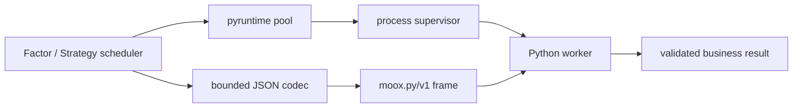

# Python 计算运行时架构设计

## 设计结论

`packages/pyruntime` 是 Factor 和 Strategy 共用的 Python worker 基础库。
Go 负责进程生命周期、调度和业务状态，Python 负责执行用户计算代码。
业务模块共享进程、帧协议和模块发布能力，但各自保留任务、结果和事务语义。

当前只支持一种数据编码：`moox.py/v1` 二进制帧中的有界 JSON。实际
Factor 和 Strategy worker 都只声明 `json`，因此不保留没有生产调用者的
Arrow、共享 mmap 快照或对应依赖。等真实数据量证明 JSON 成为瓶颈后，再以
独立方案引入针对性的列式传输。

## 共享职责

共享运行时负责：

- 启动常驻 Python worker，完成握手、健康检查、超时终止和自动重建。
- 按源码 hash 发布并加载不可变模块。
- 实现 `HELLO / LOAD / RUN / RESULT / ERROR` 长度前缀帧协议。
- 校验帧大小、协议版本、运行环境和 JSON 编码能力。
- 捕获业务 stdout/stderr，避免日志破坏二进制协议。
- 提供 worker 池、资源限制、指标和确定性测试所需的公共能力。

业务模块负责：

- Factor 的输入窗口、因子代码、结果校验和统一写回。
- Strategy 的显式状态、交易动作和状态事务。
- Storage、NATS、凭证以及其他外部系统交互。

Python worker 不直接访问这些外部系统。

## 模块边界

```text
packages/pyruntime/
├── moduleregistry/ # 源码 hash 和不可变发布
├── pool/           # worker 选择与并行度
├── process/        # 进程、握手、超时和重建
├── protocol/       # 帧、消息和 JSON 能力协商
└── python/         # Python 帧与日志捕获 helper

modules/factor/internal/engine/      # Factor 业务 codec
modules/factor/pyworker/             # Factor Python 入口
modules/strategy/internal/engine/    # Strategy 业务 codec
modules/strategy/pyworker/           # Strategy Python 入口
```

共享包不得导入 Factor 或 Strategy。不要为了复用而合并两种业务任务类型。

## 运行流程



worker 状态机：

```text
starting -> handshaking -> ready -> busy -> ready
     |           |          |       |
     +-----------+----------+-------+-> restarting -> starting
                                      |
                                      +-> failed
```

单个 worker 同一时刻只执行一个业务任务。并行度来自多个 worker，而不是在
一个 Python 解释器中并发运行任务。

## 帧与握手

帧由固定 magic、消息类型、meta 长度、meta JSON、payload 长度和 payload
组成。Go 与 Python 两侧都必须在分配大块内存前校验 meta、payload 和总帧
上限。worker 的 stdout 只能写帧，业务 stdout/stderr 必须被捕获后作为结果
日志返回。

HELLO 至少包含：

```json
{
  "protocol_version": "moox.py/v1",
  "worker_version": "1.0.0",
  "python_version": "3.12.4",
  "runtime_env_hash": "sha256:...",
  "encodings": ["json"]
}
```

协议版本、运行环境或必需编码不匹配时，worker 不进入 ready。

## 模块发布

源码按内容 hash 物化：

```text
runtime/python/
├── factor/<factor_id>/<source_hash>/factor.py
└── strategy/<strategy_id>/<source_hash>/strategy.py
```

发布过程重新计算 hash，在临时目录完成写入和校验，再原子 rename 到目标
目录。RUN 只能引用已经 LOAD 成功的 hash。禁止覆盖正在使用的源码文件。

worker 的模块缓存键为 `(module_type, logical_id, source_hash)`。业务代码不
得依赖模块级可变状态、import 次数或上一次任务遗留对象。

## 数据与结果

输入使用有界 JSON。时间和数值格式由业务 codec 明确定义，NaN/Inf 等 JSON
不能表达的值必须在编码前拒绝或规范化。运行时不做隐式编码降级，也不保留
尚未接入业务链路的传输类型。

结果先完成协议、结构、数值和业务约束校验，再进入模块自己的状态更新或写回
流程。Python 异常、协议错误和业务校验错误要区分；进程崩溃或超时由
supervisor 重建 worker。

## 可观测性

每次任务至少记录：

- `module_type`、逻辑 ID、source hash 和 request ID。
- worker ID、开始/结束时间、耗时和结果状态。
- 超时、进程退出、协议错误和业务错误分类。
- 被截断的 stdout/stderr 及 `logs_truncated` 标记。

不得记录源码全文、输入数据全集、凭证或其他敏感环境变量。

## 测试策略

- Go/Python 帧编码互操作和大小边界。
- HELLO 协议、环境与 JSON 能力校验。
- LOAD/RUN/RESULT 正常链路。
- worker 崩溃、超时、污染 stdout 和 supervisor 重建。
- 不可变模块发布及并发发布。
- warm worker 交错执行后的确定性。
- Factor 和 Strategy 各自的业务 codec、结果校验和状态语义。

测试应覆盖当前生产链路，不用仅由测试保活未落地的未来传输实现。
