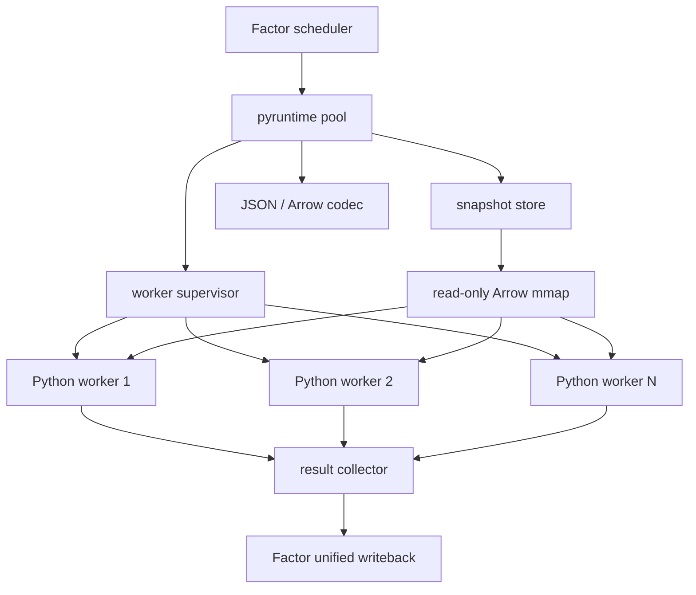

# Python 计算运行时架构设计

## 设计结论

`packages/pyruntime` 是可复用的 Python worker 基础库；在本项目当前业务边界中，Factor 是唯一使用它的 Python runtime 入口。Go 是宿主、调度者和业务事实源；Python 是常驻、单任务串行、可终止并可重建的计算进程。Strategy 保留现有独立的 Python worker/业务运行时实现，本边界不要求迁移或删除 Strategy 代码。

共享运行时负责：

- Python 进程启动、握手、健康状态、超时终止和自动重建。
- 按源码 hash 加载不可变模块，避免每个任务重复 import。
- `HELLO / LOAD / RUN / RESULT` 长度前缀帧协议。
- JSON、Arrow IPC 和只读 mmap 快照传输。
- stdout/stderr 捕获、结构化日志和错误分类。
- worker 轮换、资源限制、指标和确定性测试。

Factor 的业务适配使用该库，但不与其他业务模块共享业务协议：

| 模块 | Python 入口 | 状态 | 输出 |
| --- | --- | --- | --- |
| Factor | `signal()` / `signal_multi_params()` | 无业务状态 | 因子列尾部值 |
| Strategy | 独立 worker 入口 | 显式 `state/next_state` | `action + TargetWeights` |

V1 使用本机 worker 池。远程 Python worker、容器沙箱和多租户资源隔离不属于本设计的首期范围。

## 当前实现状态

通用能力已经落在 `packages/pyruntime`，Factor 通过 Go API 接入；Strategy 的现有独立运行路径不因本设计而改变。
当前能力包括：

1. `process` 提供常驻 worker、任务超时、状态检查和 supervisor 重建；`pool` 提供并行 worker 选择。
2. `protocol` 固定 `moox.py/v1` 帧、大小上限和 HELLO 能力协商。
3. `transport` 提供 JSON、标准 Arrow IPC stream 和 Arrow IPC file 编解码；Arrow 类型白名单覆盖数值、bool、string、UTC 毫秒时间和 null。
4. `snapshot.Store.AcquireArrow` 使用临时文件、fsync、原子 rename 和引用计数；`Store.Open` 通过只读 mmap + `ipc.NewMappedFileReader` 打开共享快照。
5. `python/moox_pyruntime` 提供 Python 侧 frame、Arrow stream 和 mmap helper；pyarrow 未安装时仍可运行 JSON-only worker。
6. `moduleregistry` 负责源码 hash 和版本化物化。Factor 的业务 codec、调度和事务语义仍由 Factor 负责；Strategy 保持自己的业务 codec、调度和事务语义。

当前明确的边界：Arrow/mmap 已在共享运行时和端到端测试中可用，但业务模块需要在 worker HELLO 协商通过后才选择 Arrow；未协商或小数据任务应使用 JSON。快照句柄必须在所有 mmap reader 关闭后再 Release。

## 目标与非目标

### 目标

1. Factor 使用统一的进程管理、帧协议、数据编码和日志设施；不把 Python runtime 依赖扩散到其他业务服务。
2. 同一输入快照只读取和编码一次，可供多个 worker 并行计算。
3. worker 崩溃、超时或内存超限后可自动恢复，不污染业务状态。
4. 每次运行固定源码、Python 环境、输入快照和协议版本，可审计并可复现。
5. 小任务保持低延迟，大任务避免重复序列化和全量内存复制。
6. Factor 的模块级接口保持简单，无需理解进程管理细节；Strategy 继续遵循自己的接口。

### 非目标

- 不让 Python 直接访问 Storage、Trade、SQLite、NATS 或账户凭证。
- 不在 Go 进程中通过 cgo 嵌入 CPython。
- 不允许业务 Python 把 stdout 当普通日志通道。
- 不承诺任意 pandas 操作完全零拷贝；目标是共享只读输入并把复制限制到实际修改的列。
- 不让一个 Python 解释器并发执行多个业务任务；并行度来自多个 worker。

## 模块边界

建议新增共享 Go 包：

```text
packages/pyruntime/
├── protocol/       # 帧、消息类型、版本协商和大小限制
├── supervisor/     # 进程启动、终止、重建、轮换和状态机
├── transport/      # JSON、Arrow IPC、mmap snapshot
├── moduleregistry/ # 源码版本、source hash、LOAD 和版本清单
├── logging/        # stdout/stderr 捕获和结构化日志
├── metrics/        # worker、任务、传输和资源指标
└── testkit/        # fake worker、崩溃/超时/污染测试工具
```

模块内保留业务适配：

```text
modules/factor/internal/engine/      # FactorTask 与 FactorResult codec
modules/factor/pyworker/             # factor 入口调用与结果校验
modules/strategy/internal/engine/    # StrategyTask 与 StrategyOutput codec
modules/strategy/pyworker/           # strategy 入口调用与 SDK
```

不要为了共享而把 Factor 与 Strategy 合成同一个任务类型。共享包不能 import 任一业务模块。

## 总体架构



## worker 状态机

```text
starting -> handshaking -> ready -> busy -> ready
     |           |          |       |
     +-----------+----------+-------+-> restarting -> starting
                                      |
                                      +-> failed
```

状态语义：

- `starting`：进程已创建，尚未收到 HELLO。
- `handshaking`：校验协议、运行环境和能力。
- `ready`：可以接收 LOAD 或 RUN。
- `busy`：正在执行一个任务。
- `restarting`：超时、崩溃、RSS 超限或计划轮换后重建。
- `failed`：连续启动失败超过阈值，需要人工处理或环境变化。

一个 worker 同时只处理一个任务。worker 的 mutex 只是最后保护，正常调度不应把多个任务同时发送到同一 worker。

## 进程监督

Supervisor 必须提供：

- 启动超时和 HELLO 超时。
- 单任务超时：终止整个进程组，丢弃本次响应。
- 崩溃检测和指数退避重启。
- 连续失败次数与 crash-loop 熔断。
- `max_tasks_per_worker`、最大 RSS 和最长存活时间轮换。
- 优雅 drain：不再派发新任务，当前任务完成后退出。
- 服务关闭时等待或终止全部 worker，不遗留子进程。

死亡 worker 必须从可调度集合中移除。重建成功并重新完成 HELLO/LOAD 后才能恢复接单，不能只保留一个已经失效的 Executor 指针。

## 帧协议

传输层继续使用现有 MX 长度前缀二进制帧：

```text
magic(2) + type(1) + meta_len(4) + meta_json + payload_len(8) + payload
```

目标消息：

| 消息 | 方向 | 用途 |
| --- | --- | --- |
| `HELLO` | Python -> Go | 上报协议、环境、能力和 worker 身份 |
| `LOAD` | Go -> Python | 加载指定 source hash 的不可变模块 |
| `LOAD_RESULT` | Python -> Go | 返回模块入口、hash 和加载错误 |
| `RUN` | Go -> Python | 执行业务任务，可内嵌数据或引用快照 |
| `RESULT` | Python -> Go | 返回业务结果、耗时和受控日志 |
| `ERROR` | 双向 | 返回结构化协议、加载或执行错误 |
| `PING/PONG` | 双向 | 空闲 worker 存活检查 |
| `DRAIN` | Go -> Python | 完成本任务后退出 |

所有帧都包含：

```text
protocol_version
request_id
worker_id
module_type: factor / strategy
encoding
trace_context
```

Go 与 Python 两侧都要在分配内存前检查 meta、payload 和总帧大小。未知协议版本、未知消息类型和不支持的 encoding 必须失败，不能静默回落。

## HELLO 与环境固定

HELLO 至少上报：

```json
{
  "protocol_version": "moox.py/v1",
  "worker_version": "1.0.0",
  "python_version": "3.12.4",
  "runtime_env_hash": "sha256:...",
  "packages": {
    "pandas": "2.2.3",
    "numpy": "2.1.2",
    "pyarrow": "16.1.0"
  },
  "encodings": ["json", "arrow_stream", "arrow_mmap"]
}
```

`runtime_env_hash` 由 Python 可执行文件、lock file、MooX Python SDK 和平台信息计算。Go 配置声明期望值；不一致时 worker 不进入 ready。

V1 使用一个受控运行环境，不自动切换到系统中的其他 Python，也不在运行任务时安装依赖。

## 模块加载与版本

### 不可变物化

Factor 和 Strategy 源码均按内容 hash 物化：

```text
runtime/python/
├── factor/<factor_id>/<source_hash>/factor.py
└── strategy/<strategy_id>/<source_hash>/strategy.py
```

发布顺序：

1. 服务端重新计算 source hash，不信任调用方提供值。
2. 在临时目录写入源码并完成语法、import 和入口校验。
3. 原子 rename 到 hash 目录。
4. 向目标 worker 发送 LOAD，并核对返回 hash。
5. LOAD 成功后切换数据库 active hash。
6. 新任务固定新 hash；已开始任务继续使用旧 hash。

禁止覆盖正在使用的 `<name>.py`。旧版本按引用计数和保留策略回收。

### 模块缓存

worker 使用 `(module_type, logical_id, source_hash)` 作为缓存键，使用 source hash 生成唯一 Python 模块名。RUN 只能引用已 LOAD 的 hash。

模块缓存只保存代码和不可变常量。业务 Python 不得依赖模块级可变状态、import 次数、单例或上一次任务遗留对象。warm-worker 契约测试会穿插执行其他任务后再次运行相同输入，检查结果是否漂移。

## 日志与 stdout 隔离

worker 的 stdout 只允许 codec 写帧。运行时在以下阶段捕获业务 stdout/stderr：

- import 与 LOAD。
- Factor `signal()` / `signal_multi_params()`。
- Strategy `run()`。

捕获内容作为结构化日志随 LOAD_RESULT、RESULT 或 ERROR 返回，Go 追加：

```text
module_type
logical_id
source_hash
request_id
worker_id
stream: stdout / stderr
```

日志有单任务字节上限，超过后截断并记录 `logs_truncated=true`。异常栈必须进入 Go 日志，不能直接丢弃 stderr。

## 数据传输选择

### JSON columnar

适合小型时序窗口和本地调试。数据按列编码，时间使用 epoch 毫秒，NaN 使用 `null`。

JSON 只在总估算大小低于阈值或 worker HELLO 未声明对应 Arrow 能力时使用。`encoding=auto` 必须根据 HELLO 能力和任务大小做真实选择；如果 pyarrow 未安装，应明确记录实际回退到 JSON，不能伪装成 Arrow。

### Arrow IPC stream

适合一次发送给单个 worker 的大窗口。Go 构造 Arrow RecordBatch 并放入 payload；Python 从 payload 解码。

Arrow stream 减少 JSON 编解码成本，但如果同一 payload 分别写入多个 worker stdin，仍会发生多次管道传输和进程内存复制。

### Arrow mmap 快照

同一数据需要被多个 worker 使用时，采用只读 Arrow IPC file：

```text
/dev/shm/moox-python/<snapshot_hash>.arrow
```

macOS 开发环境使用配置的临时目录。生产 Linux 优先使用 tmpfs。

Go 只在任务 meta 中发送：

```json
{
  "snapshot_ref": "/dev/shm/moox-python/abc.arrow",
  "snapshot_hash": "abc",
  "schema_hash": "def",
  "row_count": 2000
}
```

worker 使用 `pyarrow.memory_map()` 只读打开。操作系统页面由多个进程共享，不把完整行情复制到每个 worker。

## 快照模型

快照键必须固定业务输入：

```text
module_type
space_id + dataset_id + subject/universe
freq + bar_time + data_revision
ordered columns + lookback
schema revision
```

快照包含：

```text
snapshot_id
snapshot_hash
path
schema_hash
row_count + byte_size
created_at + expires_at
reference_count
```

创建流程使用临时文件、fsync 和原子 rename。任务完成后减少引用；引用归零且超过复用窗口后删除。独立 reaper 按 TTL 清理因服务崩溃遗留的文件，但不能删除仍被活跃任务引用的快照。

## pandas 内存语义

共享 mmap 是只读输入。多个因子不能直接修改同一个 DataFrame 对象。

worker 启用 pandas Copy-on-Write，并为每个因子提供浅视图：

```python
pd.options.mode.copy_on_write = True
factor_df = base_df.copy(deep=False)
```

语义要求：

- 读取列共享底层输入。
- 新增因子列不复制全部原始列。
- 修改输入列时只复制被修改部分。
- 一个因子的中间列不能被另一个因子观察到。
- 结果只提取声明的输出列，丢弃中间列。

Arrow 到 pandas 并非所有数据类型都能零拷贝。运行时指标必须分别记录 mmap 字节、Arrow 解码耗时、pandas 物化耗时和 worker RSS，不能只依据“使用 Arrow”推断没有复制。

## 100 因子共享数据并行计算

### 执行原则

100 个因子不对应 100 个进程。并行度由可用 CPU、内存和因子历史耗时决定，通常使用 4 至 8 个 worker。

```text
Storage 读取一次
  -> 合并输入列与最大 lookback
  -> 生成一个只读 Arrow snapshot
  -> 100 个因子划分为 N 个 FactorBatch
  -> N 个 worker mmap 同一 snapshot
  -> 每个 worker 串行计算自己的因子批次
  -> Go 聚合并校验全部结果
  -> 一次统一写回 Storage
```

### FactorBatch

```text
batch_id
parent_task_id
snapshot_id + snapshot_hash
worker_shard
factor_specs[]
expected_output_columns[]
attempt
```

批次按历史 `per_factor_ms` 做近似均衡分配，不能只按因子数量平均。首次无历史数据时使用轮询或参数数量估算。

### 自适应策略

| 场景 | 执行方式 |
| --- | --- |
| 小窗口、少量轻因子 | 单 worker 批量串行，避免调度开销 |
| 100 个较慢时序因子 | 多 worker 共享 mmap 快照 |
| 同一因子的多个参数 | 优先一次 `signal_multi_params()` |
| 全市场截面宽表 | 强制 Arrow mmap，使用专属 worker 队列 |
| 多因子共享昂贵中间量 | 后续增加公共派生列或因子 DAG，不在 V1 隐式共享可变 DataFrame |

并行阈值依据 `row_count × column_count`、估算字节、因子数量和历史耗时决定，配置只提供上下限。

## Factor 运行语义

Factor 保留现有兼容接口：

```python
signal(df, n, factor_name)
signal_multi_params(df, param_list)
```

内部因子优先实现 `signal_multi_params()`；存量 XBX 因子使用 `signal()` fallback。

Factor RUN 必须固定：

- source hash、参数、输入列、lookback 和 writeback bars。
- snapshot hash、data revision 和目标 Bar。
- 预期输出列及数值类型。

worker 与 Go 双重校验：缺失/多余输出、重复列、长度与 tail 不一致、非数值和 Inf 均使对应批次失败。默认等待全部批次成功后统一写回；失败批次可按同一 snapshot 重试，不能重新读取一份可能变化的数据。

因子写回附带 `source_hash`、`snapshot_hash`、`computed_at` 和 `parent_task_id`，使 Strategy 可以追溯因子版本和可见时间。

## Strategy 运行语义

Strategy RUN 固定源码、context、data、params、previous_targets 和 state。worker 不保存策略业务状态；Go 只在输出校验和本地事务成功后推进 `next_state`。

Strategy 一次运行不可拆成多个并行子任务后任意合并，因为策略输出是一个完整目标组合。Strategy 的并行边界是不同 Binding；同一 Binding 严格按逻辑时间串行。

## 结果聚合与失败

### Factor

- parent task 等待全部 batch 的结果。
- 每个 batch 使用稳定幂等键并可独立重试。
- Go 校验完整输出集合后执行一次统一写回。
- 默认不接受部分成功；需要部分发布时必须成为显式配置并记录缺失因子。

### Strategy

- 一个 RUN 只产生一个 RESULT。
- worker 失败不推进状态和目标。
- Go 事务失败可使用相同 run_id、输入和 state revision 重试。

### 错误分类

| 错误 | 是否重试 | 行为 |
| --- | --- | --- |
| 协议或环境不兼容 | 否 | worker 不进入 ready |
| 源码语法、import 或入口错误 | 否 | LOAD 失败，不启用版本 |
| Python 业务异常 | 默认否 | 记录完整栈和输入版本 |
| worker 崩溃或超时 | 是 | 重建 worker，使用同一任务重试 |
| snapshot 丢失或 hash 不符 | 是 | Go 按固定数据 revision 重建快照 |
| 输出契约错误 | 否 | 不写回、不推进状态 |

## 可观测性

共享指标使用 `moox_pyruntime_` 前缀：

```text
worker_state{module_type,state}
worker_restart_total{module_type,reason}
worker_task_total{module_type,status}
worker_task_duration_seconds{module_type,status}
worker_rss_bytes{module_type}
frame_bytes{module_type,encoding,direction}
snapshot_bytes{module_type}
snapshot_active_total{module_type}
snapshot_mmap_total{module_type}
module_load_total{module_type,status}
module_load_duration_seconds{module_type,status}
logs_truncated_total{module_type}
```

业务 ID、源码 hash、worker ID 和任务 ID 不进入 Prometheus label，放入日志和 TraceContext。

Factor 另外记录 batch 数量、并行度、每因子耗时和聚合等待；Strategy 另外记录 Binding 队列延迟和 state CAS 冲突。

## 安全边界

V1 只运行可信内部 Python。独立进程、超时和资源阈值用于故障隔离，不等于安全沙箱。

Python 输入不包含账户凭证和内部服务 Token。worker 环境默认不配置代理、云凭证或数据库地址。运行第三方代码前必须另行增加容器、用户权限、网络、文件系统、系统调用和 CPU/内存硬隔离。

## 测试策略

### 协议与 supervisor

- 截断、损坏、未知类型和超大帧。
- HELLO 版本、依赖版本和 runtime hash 不一致。
- worker 启动失败、任务崩溃、超时、重启和 crash loop。
- drain、服务退出和进程组清理。
- stdout 打印不会破坏协议，stderr 和异常栈可查询。

### 模块与确定性

- 同名文件使用不同 source hash 时互不覆盖。
- LOAD 失败不能切换 active hash。
- warm worker 穿插其他任务后，相同输入仍得到相同输出。
- 模块级可变状态和 import 副作用被契约测试发现。

### 数据共享

- 多个 worker mmap 同一 snapshot，结果与单 worker 串行一致。
- JSON、Arrow stream 和 Arrow mmap 得到相同业务结果。
- Copy-on-Write 下因子中间列互不污染。
- worker 崩溃后 snapshot 引用和 TTL 清理正确。
- 100 因子只创建一个输入快照，并按配置并行度运行。

## 交付顺序

1. **R1：可靠 supervisor**。worker 状态机、自动重建、日志捕获、真实健康状态。
2. **R2：版本化加载**。HELLO/LOAD、source hash 物化、启用前校验、模块缓存。
3. **R3：Factor 真并行**。固定 shard worker loop、FactorBatch、结果聚合和严格校验。
4. **R4：共享数据**。Arrow stream、Arrow mmap、snapshot 生命周期和 Copy-on-Write。
5. **R5：Strategy 接入**。Strategy 使用共享 runtime，保留独立业务 codec 和状态事务。
6. **R6：资源治理**。RSS 轮换、慢任务隔离、容量压测和运行手册。

R1 至 R3 应先于 Strategy worker 实现，避免把 Factor 的临时缺陷复制到新模块。R4 可以在小窗口 JSON 链路稳定后交付，但截面因子和大规模多因子并行上线前必须完成。

## 相关文档

- [Python 运行时详细执行计划](superpowers/plans/2026-07-11-python-runtime.md)
- [因子计算模块设计](因子计算模块设计.md)
- [Strategy 交易策略模块架构设计](策略模块架构设计.md)
- [Strategy Python 策略接入手册](策略模块Python策略接入手册.md)
