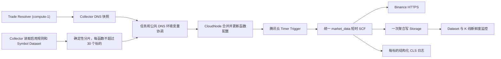

# SCF 短时行情采集

> 状态：目标架构已在当前实现分支落地；正式环境发布、绿色重建和腾讯云灰度仍需按 [行情采集整合执行计划](../superpowers/plans/2026-08-31-akshare-market-collector-integration.md) 验收。本文不证明正式环境已经切换；历史旧链路仅用于理解演进，不得作为新项目发布目标。

## 背景

MooX 使用 SCF 不是为了常驻计算，而是为了利用不同地域、不同函数实例的公网出口请求行情 API，降低所有请求集中在固定出口时被数据源频控的风险。个人量化场景不需要把 SCF 做成高可靠任务平台，核心要求是简单、成本可控、能持续拿到已收盘 K 线。

早期方案让 SCF 保持心跳、常驻等待并消费 EventBus。这个方案功能上可运行，但等待任务、轮询和保活也会累计函数运行时长，资源使用费用明显偏高。心跳只能说明容器还活着，也不能证明某个 Dataset 的最新 K 线已经写入。因此系统已经改为短时函数：收到一次工作后抓取、聚合、写 Storage，然后立即退出。

短时函数的第一版仍由 Collector 每分钟逐批调用 `InvokeFunction`。该方案又引入了一段本地排队：Collector、Gateway、CloudNode 和腾讯 Invoke API 都在实时链路上。2026-08-04 的一次实际日志中，同一分钟有 44 个分片，而 Collector 的 Invoke 并发槽只有 20；`moox-fetcher-market-data-ap-shanghai-5` 在 16:31:00.080 生成计划，16:31:09.498 才真正下发，标的 `SPYB-USDT` 自身请求只耗时约 293ms。接近 10 秒的主要延迟来自控制面排队，而不是 Binance。

因此实时 K 线改为腾讯云定时触发器直接触发每个函数。腾讯定时器是 Push 模型并使用异步调用；它仍然消耗函数并发额度，不是绕过 SCF 配额的手段。它解决的是 MooX 自己的逐节点 Invoke 排队和对 Collector/Gateway 可用性的依赖。[腾讯云定时触发器说明](https://cloud.tencent.com/document/product/583/9708)、[并发超限说明](https://cloud.tencent.com/document/product/583/51585)

## 最终决策

1. 实时 K 线由每个函数自己的 Timer Trigger 触发，不再由 Collector 在每分钟调用每个函数。
2. Collector 仍是控制面：扫描启用规则、读取关联 Symbol Dataset、生成稳定分片，并在 Symbol、规则或 DNS 变化时协调函数环境变量。DNS 默认由 `custom.toml` 选择的 Trade `compute-1` 解析；Collector 通过 Gateway 批量请求 `ResolveDomains`，本地 DNS 只作为缺失域名或 Trade 不可用时的回退。
3. 每个定时函数只承载一个 `provider + market_type + dataset_id + frequency` 组合，最多 30 个标的。30 是业务上限；Collector 先按约 1.8KB 的受管 Environment 预算拆分，为 provider、代码包、CLS、Storage 等未知变量预留空间；如果长标的或 DNS 路由仍使完整 Environment 接近 4KB，Collector 会进一步拆小分片，而不是反复提交必失败的配置。函数每次触发后从环境变量读取任务，不调用 Collector 或 Admin 配置接口。
4. SCF 并发请求行情，聚合后只调用一次 Storage。定时函数不发布逐批 Completion 事件；下一周期天然重试最近 3 根已收盘 K 线，Storage RowKey Upsert 负责幂等。
5. 长时间缺口、Symbol 全量快照、出口探针和人工 E2E 仍走有界的按需调用，不和实时 Timer 链路混在一起。
6. 不实现双版本任务快照。函数配置更新期间允许旧、新分片短暂重叠，重复 K 线写入是安全的；`assignment_hash` 只用于判断是否需要更新和排障。
7. 配置驱动的标准发布会在每个启用地域额外保留 1 个 `trigger_type=invoke` 辅助函数，专门承载
   Symbol 全量快照、缺口补采、出口探针和人工 E2E；`function_count` 只表示用户配置的 Timer
   实时容量。Space 级 `timer_function_count` 表示 Timer 总容量；启用地域的 `function_count`
   可以显式分配，或设为 0 由 CLI 自动均分。`crypto` 和 `stock_cn` 未提供地域数量时
   默认分别为 60 和 300。这样不会把按需工作错误投递到静态 Timer 环境，也不需要 SCF 在每次调用时回调控制面。

## Invoke 辅助节点的作用

线上形如 `moox-fetcher-market-data-<space>-invoke-ap-guangzhou-0` 的函数是按需执行节点，不是
实时 K 线节点。它们没有 Timer Trigger，不会每分钟自动运行；只有 Collector、`moox-cli`
或人工操作通过 `InvokeFunction` 调用时才执行，因此不会产生 Timer 空跑的函数运行时长。

每个启用地域保留 1 个辅助节点，主要原因是让以下按需任务使用对应地域的 SCF 公网出口：

- Binance 全量 Symbol 快照刷新；
- K 线缺口补采和有限失败重试；
- 部署后的出口连通性探针；
- 人工 E2E、临时诊断和按需验证。

实时节点和辅助节点的边界如下：

| 节点命名/类型 | 触发方式 | 主要用途 | 是否参与实时 K 线 |
| --- | --- | --- | --- |
| `...-timer-<region>-N` / `trigger_type=timer` | 腾讯 Timer Trigger | 从函数 Environment 读取分片，每分钟抓取 K 线 | 是 |
| `...-invoke-<region>-0` / `trigger_type=invoke` | MooX `InvokeFunction` | Symbol、补采、探针和人工任务 | 否 |

因此，删除这些 Invoke 节点不会停止 Timer 实时采集，但会使 Symbol 快照、缺口补采、出口
探针和人工 E2E 没有执行节点；只有在明确不需要这些按需能力时才应删除。`custom.toml` 的
`function_count` 只统计 Timer 节点，Invoke 辅助节点是额外的每地域 1 个固定容量。

当前 `custom.toml` 启用新加坡、广州、上海和北京四个地域，所以对应会看到四个辅助函数：
`...-<space>-invoke-ap-singapore-0`、`...-<space>-invoke-ap-guangzhou-0`、
`...-<space>-invoke-ap-shanghai-0` 和 `...-<space>-invoke-ap-beijing-0`；东京、成都等未启用地域不会创建对应节点。

## 任务环境变量

腾讯云没有跨函数共享的一份“全局环境变量”。这里的“公共环境变量”是逻辑概念：Collector 生成同一份 DNS 内容，CloudNode 将它复制到每个定时函数；每个函数仍有自己独立的环境变量和不同的标的分片。[腾讯云环境变量说明](https://cloud.tencent.com/document/product/583/30228)

| 变量 | 内容 |
| --- | --- |
| `MOOX_MARKET_FETCH_PROVIDER` | `binance` |
| `MOOX_MARKET_FETCH_MARKET_TYPE` | `spot` 或 `swap` |
| `MOOX_MARKET_FETCH_DATASET_ID` | 目标 K 线 Dataset |
| `MOOX_MARKET_FETCH_FREQUENCY` | `1m`、`1h` 等规范频率 |
| `MOOX_MARKET_FETCH_SUBJECTS` | 按字典序排列并用 `\|` 分隔，最多 30 个 |
| `MOOX_MARKET_FETCH_SYMBOLS_JSON` | `subject_id -> external_symbol` 紧凑 JSON；SCF 不猜交易所 symbol |
| `MOOX_MARKET_FETCH_ASSIGNMENT_HASH` | 不含更新时间的任务内容哈希 |
| `MOOX_MARKET_FETCH_DNS_ROUTES_JSON` | Collector 生成的公共 `host -> IP[]` JSON |
| `MOOX_MARKET_FETCH_DNS_HASH` | 不含解析时间的 DNS 内容哈希 |
| `MOOX_MARKET_FETCH_DNS_UPDATED_AT` | 最近一次成功解析时间，RFC3339 |
| `MOOX_STORAGE_RPC_GATEWAY_TARGET` | 发布时从 `scf_fetcher.spaces[].storage_rpc_gateway_target` 写入的固定 Storage 数据面地址 |

DNS 仍采用“缓存 IP 优先、失败后域名直连”的简单策略。Trade Resolver 在 `compute-1` 的网络出口执行 DNS 查询，并对候选 IPv4 做 TCP/443 探测；Collector 每 5 分钟批量请求一次，按探测延迟保留最多 4 个地址。单域失败保留上次成功值；内容哈希未变化时不更新腾讯函数配置。延迟只用于 Collector 内部排序，不写入 SCF 路由 JSON。SCF 遇到环境变量缺失、JSON 非法或 IP 请求失败时，记录警告并回退系统 DNS，不能让整个批次因 DNS 缓存失效。

Collector 是 DNS 信息的唯一更新者：它从 `custom.toml` 派生的配置中读取域名和 Trade 目标，通过已鉴权的 Gateway 调用 `ResolveDomains`，把成功结果保存在进程内缓存，并在下一次配置协调时复制到每个相关 SCF 的环境变量。SCF 不回调 Collector 获取任务或 DNS，因此采集链路不依赖 Collector 的在线请求接口。Storage 地址同样在发布时固定写入环境变量；Collector 不在每分钟协调中修改该地址。Timer 发布拒绝空值和 loopback Storage 地址。

腾讯云限制单函数环境变量总大小为 4KB，本方案不把任务 JSON、证书和无关控制面配置无限塞入函数。定时函数不携带 EventBus 与 Collector 调用凭据；发布和每次配置协调都按完整环境计算 UTF-8 字节数并预留空间，超过限制时在调用腾讯 API 前失败。每函数 30 个标的是容量上限，不是保证一定能放下的替代校验；Collector 会在 30 以内按实际受管 Environment 大小继续拆分。[腾讯云配额限制说明](https://cloud.tencent.com/document/product/583/11637)

## 节点与触发器模型

Timer Trigger 触发的仍是 SCF 事件函数，所以数据模型分开表达两个概念：

- `node_type = scf-event`：腾讯云函数类型。
- `trigger_type = timer`：实时行情节点由定时器触发。
- `trigger_type = invoke`：出口探针、Symbol 快照、补采和人工 E2E 由 MooX 按需调用。

标准 `custom.toml` 发布按地域自动创建一枚 Invoke 辅助函数；如果手工只发布 Timer 函数，Symbol
快照和缺口补采没有可用执行节点，Collector 会明确记录“无 active market fetcher nodes”，不能
把这种配置当成全量采集已就绪。

CloudNode 为 `trigger_type=timer` 的节点自动确保一个确定名称的 Timer Trigger 存在，维护 cron、开关和回读状态。没有任务的富余节点关闭 Trigger，避免空函数每分钟产生费用。管理台列表和详情同时展示节点类型、触发方式、cron 与触发器状态，避免把“事件函数”和“定时触发”混成一个字段。

Timer 的 Message 只放固定协议标识，任务和 DNS 均从环境变量读取。以 1 分钟 K 线为例，cron 使用 `0 * * * * * *`，所有节点同秒触发；本期不增加复杂错峰。腾讯云允许秒级 cron、单函数同类型触发器最多 10 个，本方案每函数只创建 1 个 Timer Trigger。[定时触发器说明](https://cloud.tencent.com/document/product/583/9708)、[配额限制说明](https://cloud.tencent.com/document/product/583/11637)

## 一致性与失败处理

- Collector 将规则、完整 Symbol 快照和可用定时节点排序后确定性分片；节点容量不足时整体协调失败并告警，不能静默漏掉标的。
- CloudNode 是腾讯云凭据和 SDK 的唯一所有者。Collector 只提交受管环境变量补丁，不能读取或覆盖 CLS、Storage、Gateway 等 Secret。
- 腾讯 `UpdateFunctionConfiguration` 提交整份 Environment。CloudNode 必须先读取远端完整环境、在函数级互斥锁内合并受管键、检查 4KB、更新、等待 Active 并回读，防止部署、DNS 和任务更新互相覆盖。[更新函数配置 API](https://cloud.tencent.com/document/api/583/18580)
- DNS 与任务由同一个协调器一次提交，不能由两个 Timer 各自覆盖函数 Environment。
- 配置更新失败时保留上次有效任务；下一次协调继续重试。部分节点成功不会清空失败节点的旧任务。
- 重新发布已有 Timer 节点时 CloudNode 合并远端完整 Environment 并清除旧运行时 fingerprint，下一次 Collector 协调会重新回读并校验任务；不会因代码发布误删任务后又错误跳过修复。
- 管理台删除使用 CloudNode 批次先删 Timer Trigger、再删 Function、最后软删目录，避免只隐藏目录而让远端函数继续触发和计费。
- Timer 是异步调用，仍受地域/命名空间并发限制；并发超限由腾讯异步队列策略处理。Collector 每次列出 Timer 节点时由 CloudNode 以有界并发只读回查腾讯 Trigger，同时核验类型、Qualifier、固定 Message、cron、开关和 Available 状态；发现漂移时下一次协调重新提交，由 CloudNode 的 Ensure 修复。真实状态、分片需求/实际数量和最近成功协调时间通过统一 metrics reporter 上报 EventBus。Monitor 消费这些协调指标，并与 Storage 数据新鲜度一起告警。协调器的完整检查到提交过程串行化，避免慢 Tick 交叉提交旧/新快照；规则或节点删除时会清理旧指标标签。

## 成本边界

定时触发不是为了让函数常驻，也不配置预置并发。函数保持 64MB、15 秒上限，正常执行应只消耗实际拉取和 Storage 写入的几秒。更新环境变量可能使后续调用发生冷启动，因此只在任务或 DNS 内容哈希变化时更新；DNS 的 `updated_at` 不参与哈希，避免每 5 分钟无意义更新所有函数。

这套设计有意接受少量重复、短暂配置不一致和下一周期重试，换取更少的服务依赖、更短的调用链和更低的维护成本。它不追求跨地域事务、全局 exactly-once、分布式锁或双版本发布。

## 维护边界

- `modules/collector`：规则、Symbol 快照、DNS 解析、分片与配置协调。
- `modules/cloudnode`：腾讯凭据、函数环境合并、Timer Trigger 生命周期和回读验证。
- `modules/collector/internal/serverless/market_data`：解析 Timer event 和函数环境，执行一次实时采集。
- `modules/storage`：K 线真值和幂等写入。
- `modules/monitor`：Trigger/协调状态及 Dataset、Storage 实际写入水位和 K 线新鲜度，不参与调度；不能无条件忽略 `producer=storage`。
- `web`：展示节点类型、触发方式和协调结果，不直接操作腾讯云。

历史的常驻 SCF、心跳、Sentinel，以及 Collector 每分钟逐节点 `InvokeFunction` 的设计只用于理解演进过程，不得作为新实时链路重新启用。
