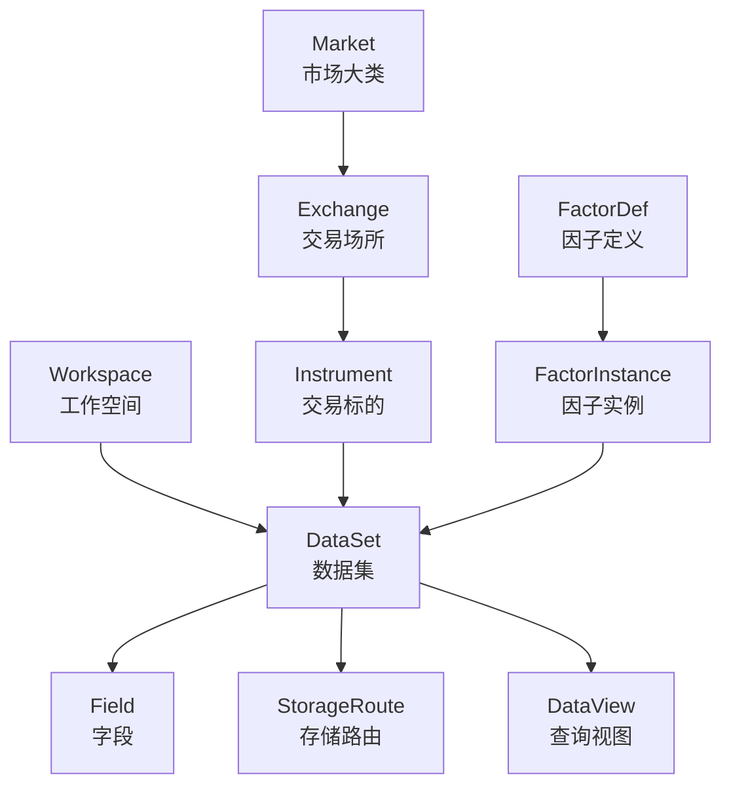

# 量化金融数据系统概念说明

本文定义 moox 与 xData 在量化金融数据系统中的核心概念。它面向使用者、产品配置者和开发者，帮助大家用同一套语言描述市场、标的、数据集、字段、因子和查询视图。

## 总览

系统分为两个主要部分：

- moox 是控制面和编排面，负责工作空间、数据配置、采集规则、节点调度和管理台交互。
- xData 是数据事实面和查询执行面，负责元数据事实、在线写入、在线查询、分析视图和冷数据归档。

推荐概念层次如下：



## Workspace

`Workspace` 是用户或业务的隔离空间，用来替代旧的 `Project` 概念。

一个 Workspace 可以代表：

- 个人量化研究空间。
- 实盘交易系统。
- 回测实验环境。
- 某个数据供应商或策略团队的独立空间。

Workspace 不表示市场，也不表示交易所。它只负责隔离配置、权限、数据集和资源。

建议字段：

```text
workspace_id
name
display_name
description
owner
created_at
updated_at
```

## Market

`Market` 表示市场大类。

示例：

```text
CN_STOCK
HK_STOCK
US_STOCK
CRYPTO
FUTURES
OPTION
FOREX
FUND
```

Market 用来回答“这是什么资产市场”。它不表示具体交易场所。

## Exchange

`Exchange` 表示具体交易场所。

示例：

```text
SSE       // 上海证券交易所
SZSE      // 深圳证券交易所
HKEX      // 香港交易所
NASDAQ
NYSE
BINANCE
OKX
COINBASE
```

Exchange 需要绑定 Market，也需要描述时区、交易日历、币种和交易规则。

建议字段：

```text
exchange_id
code
name
market
timezone
currency
trading_calendar
status
```

## Instrument

`Instrument` 表示交易标的，是金融领域中的核心对象。

示例：

```text
AAPL
MSFT
00700.HK
600519.SH
BTC-USDT
BTC-USDT-SWAP
```

Instrument 归属于某个 Exchange，也属于某个 Market。不同市场和交易所可能出现相同 symbol，因此系统内部应使用 `instrument_id` 作为唯一标识。

建议字段：

```text
instrument_id
symbol
display_symbol
exchange_id
market
instrument_type
base_asset
quote_asset
currency
timezone
status
metadata
```

`object_id` 可以作为接口兼容名或外部对象键，但长期建议在金融域中使用 `instrument_id`。

## DataSet

`DataSet` 表示一组可读写的数据集合。它保留 Dataset 的经典含义，不替换成 `DataKind`。

DataSet 用来回答“这是一组什么数据”。例如：

```text
美股日 K 数据
Binance 现货 1m K 线
港股公司资料
OKX 永续合约订单簿
日频因子值
公告正文
涨跌幅榜
```

DataSet 不是数据类型枚举。一个 DataSet 会包含 `data_kind` 和 `data_domain` 两个分类字段。

建议字段：

```text
dataset_id
workspace_id
name
display_name
data_kind
data_domain
market_scope
exchange_scope
instrument_scope
default_freqs
schema_version
retention_policy
status
```

## DataKind

`DataKind` 表示数据形态。它应该少、稳定、互斥。

推荐枚举：

```text
OBJECT       // 对象资料，例如公司信息、标的资料
TIME_SERIES  // 时间序列，例如 K 线、tick、因子序列
SNAPSHOT     // 某一时刻的截面快照
EVENT        // 事件流，例如成交事件、公告事件、订单簿变更
DOCUMENT     // 长文本，例如公告正文、新闻正文、研报
TABLE        // 普通结构化表，例如榜单、映射表、配置表
```

DataKind 不表达业务语义。`FACTOR`、`RANKING`、`NEWS` 不应放在 DataKind 中。

## DataDomain

`DataDomain` 表示业务语义。它回答“这组数据在业务上是什么”。

推荐枚举：

```text
MARKET_BAR        // K 线
MARKET_TICK       // tick
ORDER_BOOK        // 订单簿
TRADE             // 成交
SYMBOL_PROFILE    // 标的资料
COMPANY_PROFILE   // 公司资料
NEWS              // 新闻
ANNOUNCEMENT      // 公告
FACTOR_VALUE      // 因子值
RANKING_LIST      // 榜单
FINANCIAL_REPORT  // 财报
```

DataKind 和 DataDomain 需要组合使用：

| 数据 | DataKind | DataDomain |
| --- | --- | --- |
| 公司信息 | OBJECT | COMPANY_PROFILE |
| 日 K | TIME_SERIES | MARKET_BAR |
| tick | TIME_SERIES | MARKET_TICK |
| 订单簿快照 | SNAPSHOT | ORDER_BOOK |
| 成交事件 | EVENT | TRADE |
| 公告正文 | DOCUMENT | ANNOUNCEMENT |
| 涨跌幅榜 | TABLE 或 SNAPSHOT | RANKING_LIST |
| MA20 因子序列 | TIME_SERIES | FACTOR_VALUE |

## Field

`Field` 表示字段定义。字段属于 Workspace，可绑定到一个或多个 DataSet。

示例：

```text
open
high
low
close
volume
market_cap
industry
announcement_title
```

字段英文名应在 Workspace 内唯一，而不是全系统唯一。

建议字段：

```text
field_id
workspace_id
interface_name
display_name
description
table_type
primary_type
secondary_type
required
unique
validation_rule
status
```

字段和 DataSet 的关系建议使用绑定表表达：

```text
field_dataset_binding:
  workspace_id
  field_id
  dataset_id
  table_type
  required_override
  level
  status
```

## FactorDef

`FactorDef` 表示因子定义。它描述因子算法本身。

示例：

```text
MA
RSI
MACD
VOLATILITY
TURNOVER_RATE
```

建议字段：

```text
factor_id
workspace_id
name
display_name
description
source_domain
expression_hash
code_hash
value_type
version
status
```

## FactorInstance

`FactorInstance` 表示带参数的因子实例。

示例：

```text
MA(window=20, price=close)
MA(window=60, price=close)
RSI(window=14)
```

`MA(20)`、`MA(60)` 和 `MA(120)` 应是不同的 FactorInstance，而不是动态生成的普通字段。

建议字段：

```text
factor_instance_id
factor_id
workspace_id
params_json
output_name
freq
value_type
calc_version
status
```

因子值通常存入 DataSet：

```text
data_kind = TIME_SERIES
data_domain = FACTOR_VALUE
```

## DataView

`DataView` 表示面向查询构建的数据视图。它替代容易混淆的 `Projection` 命名。

DataView 不是原始 DataSet。它通常从一个或多个 DataSet 派生，用于查询加速、组合查询或分析展示。

示例：

```text
日 K + 热门因子横截面视图
分钟 K + MA/RSI 因子视图
公司资料 + 行业标签视图
公告文本搜索视图
```

逻辑定义：

```text
data_view_def:
  data_view_id
  workspace_id
  name
  source_datasets
  grain
  metrics
  filter
  refresh_policy
```

物理版本：

```text
data_view_version:
  data_view_id
  version
  physical_name
  storage_device_id
  status
  built_at
```

DataView 可以对应 DuckDB 宽表、DuckDB 长表查询、Bleve 索引或其他查询加速结构。协议只暴露 DataView 的逻辑名，不暴露物理表名。

## StorageEntity

`StorageEntity` 表示一个存储服务实例或存储集群入口。

示例：

```text
local-xdata-storage
research-storage-node
prod-storage-cluster
```

它描述“数据对象应该路由到哪个存储服务”。

## StorageDevice

`StorageDevice` 表示某个具体存储引擎。

示例：

```text
RocksDB
DuckDB
Bleve
ParquetArchive
CSVArchive
SQLite
```

推荐角色：

| StorageDevice | 主要职责 |
| --- | --- |
| RocksDB | 在线事实层，支持低延迟时序读写 |
| DuckDB | 分析查询层，支持组合筛选和横截面查询 |
| Bleve | 文本索引 |
| Parquet / CSV | 冷归档和备份 |
| SQLite | 元数据控制面 |

## StorageRoute

`StorageRoute` 表示数据到存储目标的路由规则。

建议不要只表达“字段到设备”，而要表达“数据域到执行器角色”。

推荐字段：

```text
route_id
workspace_id
dataset_id
instrument_pattern
field_id
data_kind
data_domain
freq
storage_entity_id
storage_device_id
role
priority
status
```

推荐角色：

```text
HOT_STORE      // 在线事实库，例如 RocksDB
ANALYTIC_VIEW  // 分析查询视图，例如 DuckDB DataView
TEXT_INDEX     // 文本索引，例如 Bleve
ARCHIVE        // 冷归档，例如 Parquet/CSV
```

## DataAddress

`DataAddress` 表示一次读写请求定位数据的位置。它可以替代旧的 `DataKey` 命名。

建议字段：

```text
workspace_id
dataset_id
instrument_id
object_key
exchange_id
freq
ts
partition_key
```

对于金融时序数据，核心定位通常是：

```text
workspace_id + dataset_id + instrument_id + freq + ts
```

对于静态对象资料，核心定位通常是：

```text
workspace_id + dataset_id + instrument_id
```

对于榜单或截面数据，核心定位通常是：

```text
workspace_id + dataset_id + partition_key + ts
```

## Collector

`Collector` 表示采集器。它负责从外部数据源获取数据，并写入 xData。

采集配置属于 moox 控制面。采集结果属于 xData 数据事实面。

建议把采集类型和 DataSet 的关系配置化：

```text
collector_dataset_binding:
  data_source
  collector_data_type
  market
  exchange
  instrument_type
  workspace_id
  dataset_id
  object_key_rule
  freq_rule
```

这样采集器不用硬编码 dataset_id。

## 常见组合示例

### 美股日 K

```text
Workspace: my-research
Market: US_STOCK
Exchange: NASDAQ
Instrument: AAPL
DataSet: us_stock_daily_bar
DataKind: TIME_SERIES
DataDomain: MARKET_BAR
DataAddress: workspace_id + dataset_id + instrument_id + freq=1D + ts
```

### Binance 现货 1m K 线

```text
Workspace: crypto-live
Market: CRYPTO
Exchange: BINANCE
Instrument: BTC-USDT
DataSet: binance_spot_bar
DataKind: TIME_SERIES
DataDomain: MARKET_BAR
DataAddress: workspace_id + dataset_id + instrument_id + freq=1m + ts
```

### 公司资料

```text
Workspace: equity-research
Market: HK_STOCK
Exchange: HKEX
Instrument: 00700.HK
DataSet: hk_company_profile
DataKind: OBJECT
DataDomain: COMPANY_PROFILE
DataAddress: workspace_id + dataset_id + instrument_id
```

### 多因子组合查询

```text
DataSet: daily_factor_values
DataKind: TIME_SERIES
DataDomain: FACTOR_VALUE
FactorInstance:
  MA(window=20)
  MA(window=60)
  RSI(window=14)
DataView: daily_bar_factor_view
Query:
  close > ma20 AND ma20 > ma60 AND rsi14 < 30
```

## 命名建议

建议统一使用以下命名：

| 旧概念 | 新概念 | 说明 |
| --- | --- | --- |
| Project | Workspace | 用户或业务隔离空间 |
| Object | Entity / Instrument | 底层可用 Entity，金融域使用 Instrument |
| Dataset | DataSet | 保留数据集合概念 |
| DataType | DataKind | 数据形态分类 |
| DataCategory | DataDomain | 业务语义分类 |
| DataKey | DataAddress | 数据定位信息 |
| Projection | DataView | 查询视图或加速视图 |

## 设计原则

- Workspace 只做隔离，不表达市场。
- Market 表示资产市场，Exchange 表示交易场所。
- Instrument 使用内部 ID，symbol 只作为外部标识。
- DataSet 表示数据集合，DataKind 表示数据形态。
- DataDomain 表示业务语义，不和 DataKind 混在一起。
- Field 在 Workspace 内唯一，可绑定多个 DataSet。
- FactorDef 描述算法，FactorInstance 描述参数化结果。
- DataView 是查询视图，不是原始事实数据。
- StorageRoute 描述数据到执行器的角色映射。
- Collector 的数据类型和 DataSet 关系应配置化。
