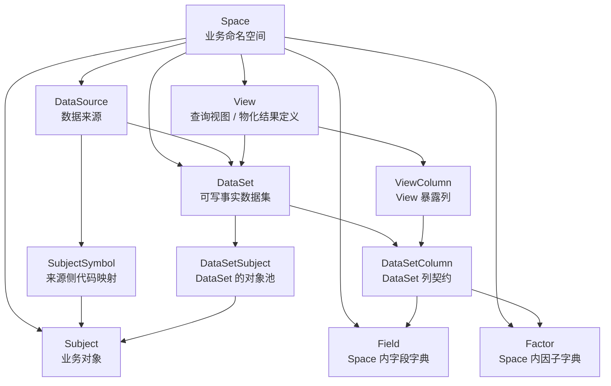

# 量化存储概念说明与设计意图

本文解释 moox-storage 中几个核心概念的边界，以及我们为什么这样设计。它面向后续开发者、管理台用户和采集/因子计算模块的接入方。

更细的表结构见 `docs/storage-target-architecture-and-metadata.md`，PB 接口见 `docs/pb-protocol-redesign.md`。

## 系统目标

moox-storage 的目标是做一个个人量化场景下的统一数据存储底座：

- 能写入实时行情、K 线、公司信息、榜单、文档、事件和因子结果。
- 能支持多个市场和来源，例如 Binance、OKX、港股、美股、A 股数据接口、文件导入和内部计算结果。
- 对用户暴露稳定的写入契约和查询入口，而不是暴露底层存储实现。
- 在线主存、分析查询、文本检索和冷备归档职责分离，但由同一套元数据解释。
- 所有数据访问都先进入 Access Service。Access Service 统一转发到 PrimaryStore、View、Search 和 Archive 等内部服务。
- PrimaryStore、View、Search 和 Archive 都可以独立部署；其中只有 PrimaryStore 需要按 Subject 做在线主存水平切分。

## 一句话模型

```text
Space 里定义 DataSource、Subject、Field、Factor、DataSet 和 View。
用户按 DataSet 写入事实数据，按 DataSet 读取事实数据，按 View 做组合分析查询。
Pebble 是在线事实主存，DuckDB/Bleve/Parquet 都从 Pebble 变更异步派生。
Access 是唯一公开数据访问入口，后端执行服务不直接暴露给业务调用方。
```

本文中所有“全局”都指 Space 内全局，不是全系统唯一。

## 核心概念关系



## Space

`Space` 是业务命名空间，也是用户看到的工作空间。

我们把 Subject、Field、Factor、DataSet、DataSource 和 View 都放在 Space 内，是为了避免“全系统全局”带来的命名污染。个人量化场景下，不同策略、不同实验或不同数据口径可能使用相同 ID，但含义不同。

示例：

```text
space_id = crypto_research
field_id = close

space_id = hk_stock_research
field_id = close
```

这两个 `close` 都是各自 Space 内的字段，不要求跨 Space 共用一份定义。

## DataSource

`DataSource` 表示数据从哪里来。它替代旧设计里的 `Exchange`，因为交易所只是来源的一种。

示例：

```text
BINANCE
OKX
TUSHARE
AKSHARE
YAHOO_FINANCE
CSV_IMPORT
FACTOR_CALCULATOR
MANUAL_INPUT
```

设计意图：

- 用 DataSource 覆盖交易所、接口、文件、人工录入和内部计算。
- 避免底层抽象过早绑定金融交易场所。
- 让同一个系统未来可以存储非交易所数据，例如新闻源、研报源、榜单源和账户数据。

## Subject

`Subject` 是 Space 内的业务对象。交易标的只是 Subject 的一种。

示例：

```text
APT-USDT
600519.SH
龙虎榜
CoinDesk
账户 account_001
```

Subject 不归属 DataSource。原因是同一个业务对象可能来自多个来源，例如 `APT-USDT` 可以从 Binance 采，也可以从 OKX 采。如果把 Subject 直接挂到 DataSource 下，就会在组合查询时产生多个“看起来相同但其实不同”的对象。

## SubjectSymbol

`SubjectSymbol` 记录 Subject 在某个 DataSource 下的外部代码。

示例：

```text
space_id = crypto_research
subject_id = APT-USDT
data_source_id = BINANCE
external_symbol = APTUSDT

space_id = crypto_research
subject_id = APT-USDT
data_source_id = OKX
external_symbol = APT-USDT
```

设计意图：

- Subject 表示业务对象。
- SubjectSymbol 表示来源侧代码。
- DataSet 只绑定一个 DataSource，因此写入时可以明确解释外部 symbol。

## DataSet

`DataSet` 是可写的事实数据集。用户写入和读取事实数据时都以 DataSet 为入口。

DataSet 回答的是：

```text
这是一组什么事实数据？
这组事实数据来自哪个 DataSource？
这组事实数据允许哪些 Subject？
这组事实数据允许哪些列？
```

一个 DataSet 只绑定一个 DataSource。这个约束是刻意的。

原因：

- 避免同一个 DataSet 内混入 Binance 和 OKX 两套口径。
- View 组合多个 DataSet 时，每一列来自哪里更清楚。
- 主存路由和数据归档更容易按来源解释。
- 采集任务可以清晰地说“采 Binance K 线 DataSet 下的所有 Subject”。

时序 DataSet 可以支持多个频率，例如：

```text
dataset_id = binance_spot_kline
data_source_id = BINANCE
freqs = ["1m", "1h", "1d"]
```

频率是事实数据的一部分，通过写入和读取时的 `freq` 表达。View 不再单独定义频率。

## DataSetSubject

`DataSetSubject` 是 DataSet 的对象池。

它表达“这个 DataSet 可以写哪些 Subject”。例如 `binance_spot_kline` 可以覆盖 Binance 现货交易对集合。

设计意图：

- 采集器可以按 DataSet 查出要抓取的 Subject 集合。
- 历史成分变化、合约下架、标的上市时间可以通过生效区间表达。
- Subject 本体保持干净，不把不同 DataSet 的覆盖关系塞进 Subject。

## Field

`Field` 是 Space 内普通字段字典。

示例：

```text
open
high
low
close
volume
title
content
industry
```

Field 是“字段定义”，不是“某个 DataSet 的列”。同一个 Field 可以被多个 DataSet 选用。

设计意图：

- 字段定义可以复用。
- 字段中文名、值类型、单位、校验规则可以集中管理。
- DataSet 是否使用该字段，由 DataSetColumn 决定。

## Factor

`Factor` 是 Space 内、已经参数化的因子结果定义。

示例：

```text
factor_id = ma20_close
name = MA20 收盘均线
algorithm = MA
params_json = {"window":20,"price":"close"}
```

我们不再拆 `FactorDef` 和 `FactorInstance`。一个 Factor 就是一种可写入、可查询、可进入 View 的因子结果。

设计意图：

- 因子最终也是一列数据。
- 动态新增因子时，只需要新增 Factor，再把它加入 DataSetColumn 或 ViewColumn。
- 因子参数是定义的一部分，不把参数解释留给查询阶段。

## DataSetColumn

`DataSetColumn` 是 DataSet 下的列契约，记录 DataSet 可以写入和读取哪些列。

它可以指向：

```text
Field
Factor
System Column
```

用 `origin_type/origin_id` 表达来源。

设计意图：

- Field 和 Factor 在字典层统一管理，在 DataSetColumn 层统一成为“列”。
- 写入时只校验 DataSetColumn，不需要调用方理解 Field 和 Factor 的内部差异。
- `text_indexed` 放在 DataSetColumn 上，而不是 Field 上，因为同一个 Field 在不同 DataSet 下是否需要全文索引可能不同。

`text_indexed` 的变更只影响之后的增量索引消费。历史 rows 不会因为元数据更新自动重建索引；需要管理台或 CLI 显式调用 `RebuildSearchIndex`，异步按当前列配置回扫事实数据。重建任务通过 Access 读路径读取数据，且只处理 DataSetSubject 已绑定的 subject。

## TimeSeries 与 Object

storage 对外把事实写入分成两类接口：TimeSeries 和 Object。

**TimeSeries** 指固定 `subject_id + freq` 下按 `data_time` 演进的数据，例如 K 线、tick、分钟级指标。它必须有明确 Subject 和固定频率。调用方用 `TimeSeriesKey` 表达：

```text
space_id
dataset_id
subject_id
freq
dimensions
data_time
```

其中 `data_time` 必须是 RFC3339/RFC3339Nano。读取一段 K 线时使用 `TimeRange` 闭区间 `[start_time, end_time]`；精确读取一根 K 线时让 `start_time=end_time` 即可。

**Object** 指非固定 `subject_id + freq` 的数据，例如公司资料、榜单、新闻、研报、账户资料、人工录入对象。即使新闻或研报具备时间线，也归为 Object，通过版本表达时间或修订序列。调用方用 `ObjectKey` 表达：

```text
space_id
dataset_id
object_id
version
```

`version` 可以是 RFC3339/RFC3339Nano，也可以是业务版本字符串；为空表示默认版本。读取版本范围时使用 `VersionRange` 闭区间 `[start_version, end_version]`。

这个划分的核心不是“有没有时间字段”，而是“是不是固定 Subject + 固定频率的连续时序”。只有满足这个条件的数据才走 TimeSeries。

## DataKey 与 Version

底层事实行统一成一个模型：

```text
space_id + dataset_id + data_key + version -> columns + attributes
```

两类外部 key 都会归一到这个模型：

```text
TimeSeries: data_key = subject_id | freq | dimhash, version = data_time
Object    : data_key = object_id,                  version = version
```

再次写入相同 `space_id + dataset_id + data_key + version` 时，系统只处理本次携带的列值和 attributes。同名列覆盖，未携带的旧列保留。storage 不把写入解释成整行替换，也不提供按 scope 删除旧行或整段事实切片的能力。

DataSetColumn 的 `required` 不要求每次字段级更新都携带该列。它更适合表达采集契约、管理台提示或全量导入校验；在线写入只校验本次携带的列是否合法。

Pebble 在线主存为了让常见时序范围读取更快，会把物理 key 拆成两类前缀：

```text
t|space|dataset|subject|freq|version|dimhash|legacy_row_id
o|space|dataset|object_id|version
```

`t|` 表示时序 key 空间，`o|` 表示对象 key 空间。时序物理 key 把 `version(data_time)` 放在 `freq` 后面，方便“某个标的某个频率的一段时间”用 key 边界直接裁剪；逻辑上它仍对应 `data_key + version`。`legacy_row_id` 只用于旧 `WriteRows` 兼容入口，新的 `TimeSeriesRow` 不暴露该字段。

`TimeRange` 中的 `start_time/end_time` 是闭区间，必须使用 RFC3339/RFC3339Nano。服务端内部统一归一化成 UTC 固定 9 位纳秒格式，避免 `2026-01-01T00:00:00Z` 与 `2026-01-01T00:00:00.5Z` 在字典序上反向。

设计意图：

- TimeSeries/Object 拆开后，对外接口不暴露内部 `data_key` 拼接细节。
- 统一 `data_key + version` 后，时序和非时序在底层没有本质区别，只有 key 的业务构造不同。
- 时间格式统一后，范围读取可以依赖 key 字典序，不会因整秒/亚秒混用漏读。
- Object 也支持 version，因此新闻、研报等带时间线的数据不需要伪装成固定频率时序。

## View

`View` 是用户做组合查询的入口，也是可异步构建的物化结果定义。

View 回答的是：

```text
用户可以查询哪些 DataSet 的哪些列？
这些列以什么粒度组合成查询结果？
这份查询结果保留最近多长时间的数据？
当前生效的物化结果是哪一个？
```

View 创建时就属于某个 Space，不再单独维护 Space 与 View 的绑定表。

View 必须指定 `primary_dataset_id`。它决定 View 的主行集合，也决定默认 Subject 范围：

```text
View 的 Subject 范围 = primary_dataset_id 对应 DataSet 的 Subject 集合
```

用户创建 View 时只需要选择 DataSet 和列，不需要逐个选择 Subject。系统也不提供 `subject_scope_policy`。我们不支持并集、交集或自定义 Subject 策略，避免 View 的行域变复杂。

当 View 关联多个 DataSet 时，其他 DataSet 只提供列。物化构建时以主 DataSet 的 Subject 集合为准，再把其他 DataSet 的列按 `subject_id`、`data_time`、`freq` 等粒度键关联进来。若某个 Subject 在附属 DataSet 中没有数据，对应列为空；系统不会因为附属 DataSet 多出 Subject 就扩展 View 的行集合。

示例：

```text
primary_dataset_id = binance_spot_kline
dataset_ids = ["binance_spot_kline", "factor_ma", "factor_rsi"]

View 的 Subject 范围来自 binance_spot_kline。
factor_ma 和 factor_rsi 只提供因子列。
```

设计意图：

- 用户临时请求不存在的组合时，直接返回 `VIEW_NOT_FOUND`。
- 不在线动态 pivot/join，避免临时组合查询拖垮分析查询引擎。
- 新字段或新因子上线后，后台异步新建物化结果并切换，不原地改当前结果。
- View 是查询产品，DataSet 是事实契约，两者不要混在一起。
- 主 DataSet 明确 View 的行域，避免多个 DataSet 的 Subject 并集或交集带来歧义。

## ViewColumn

`ViewColumn` 是 View 对用户暴露的列。

ViewColumn 通常来自 DataSetColumn，也可以来自系统列或服务端登记表达式。

设计意图：

- DataSetColumn 负责写入契约。
- ViewColumn 负责查询展示和宽表构建。
- 同一个 DataSetColumn 可以进入多个 View，使用不同的列名、排序或上线时间。

## DataSet 与 View 的边界

DataSet 和 View 不统一，是为了让写入稳定、查询灵活。

| 场景 | 使用概念 |
| --- | --- |
| 写入 K 线、公司信息、榜单、因子结果 | DataSet |
| 读取某个 DataSet 的事实行 | DataSet |
| 全文搜索新闻、公告、资料 | DataSet |
| 多因子组合筛选、K 线和因子联合查询 | View |

设计意图：

- 写入端不应该关心查询物化结果。
- 查询端不应该临时决定如何把多个 DataSet 拼起来。
- 复杂组合查询必须先沉淀为 View，系统异步构建。

## 存储设备职责

moox-storage 采用主存加派生存储的模型。

| 组件 | 职责 |
| --- | --- |
| Pebble | 在线事实主存，承接实时写入和低延迟事实读取 |
| DuckDB | View 宽表查询缓存，服务近期组合分析 |
| Bleve | 文本索引，只索引 DataSetColumn 中标记 `text_indexed` 的列 |
| Parquet | 事实冷备归档，只从 Pebble 归档 |

设计意图：

- 写入成功以 Pebble 成功为准。
- DuckDB、Bleve、Parquet 都是异步派生，不阻塞主写入。
- 同批数据若被路由到多个 PrimaryStore 目标，不提供跨目标原子提交；已经成功写入的目标不会因为后续目标失败而回滚。
- Parquet 不从查询物化结果归档，因为物化结果 schema 会随 View 和字段上线变化。
- 冷备采用事实归档路径，保证新旧数据文件 schema 更稳定。

## Access、PrimaryStore、Device 与 PrimaryRoute

`Access Service` 是唯一公开数据访问入口。Collector、FactorCalculator、管理台、CLI 和其他业务调用方都先访问 Access，再由 Access 按请求语义转发到内部服务。

元数据管理和服务侧读取分开：管理台、CLI 和控制面任务直接通过 SQLite 元数据 store 做 CRUD；Access 的校验、路由、Search 列解释等服务读路径使用独立 metadata cache。cache 启动加载快照，后续刷新由 snapshotcache 组件负责，元数据写入不会同步更新 cache。

`PrimaryStore Service` 是在线事实主存服务，底层使用 Pebble。它可以多实例部署，并按 Subject 水平切分。

`View Service` 负责 DuckDB View 物化和查询。`Search Service` 负责 Bleve 全文和结构化搜索。`Archive Service` 负责 Parquet 事实冷备。它们都可以独立部署，但不使用 PrimaryRoute 做查询分片。

`Device` 表示底层具体存储组件，例如 Pebble、DuckDB、Bleve 或 Parquet 归档目录。Device 是内部执行细节，普通调用方不感知。

`PrimaryRoute` 只负责在线事实主存的水平切分，并路由到 PrimaryStore 节点，不直接路由到 Device。当前协议和表结构仍使用 `StorageRoute` / `StorageNode` 名称，目标语义已经收窄为 `PrimaryRoute` / `PrimaryNode`。

设计意图：

- Access 只关心“把这批事实数据交给哪个 PrimaryStore 节点”。
- PrimaryRoute 解析结果会携带目标节点的 endpoint，Access 的内部 PrimaryStore client 据此连接正确节点。
- PrimaryStore 内部再决定使用哪个 Pebble 设备。
- Search、View 和 Archive 从主存变更异步派生，查询时不 fan-out 到多个 PrimaryStore 分片。
- 这样可以让各类服务独立部署，形成一个简单、清晰的分布式系统。

## 关键取舍

### 为什么不是全系统全局？

全系统全局会让字段、因子和标的命名互相污染。个人量化场景经常会做实验，Space 内全局更适合快速迭代。

### 为什么 DataSet 只绑定一个 DataSource？

这样能保证一个 DataSet 内的数据口径一致。若需要比较 Binance 和 OKX，应建立两个 DataSet，再通过 View 组合，而不是把两个来源混在一个 DataSet 中。

### 为什么 Subject 不归属 DataSource？

因为 Subject 是业务对象，DataSource 是来源。同一个业务对象可以有多个来源。来源侧代码放到 SubjectSymbol，组合查询时才能用统一 Subject 对齐。

### 为什么 Field 和 Factor 都通过 DataSetColumn 进入 DataSet？

因为写入和查询最终面对的是列。Field 和 Factor 的管理可以不同，但进入 DataSet 后都应该是统一的列契约。

### 为什么临时组合查询返回 VIEW_NOT_FOUND？

动态组合查询会引入临时 pivot/join，资源不可控。我们选择先登记 View，后台异步构建物化查询结果，让查询行为可预测。

### 为什么 Parquet 只从 Pebble 归档？

物化查询结果是近期查询缓存，不是事实源。新增字段和因子会导致查询结果 schema 变化。Parquet 从 Pebble 事实主存归档，路径单一，也更利于长期保存和恢复。

## 推荐阅读顺序

```text
1. 本文：先理解概念和设计取舍
2. storage-target-architecture-and-metadata.md：看架构、数据流和表结构
3. pb-protocol-redesign.md：看接口协议和调用边界
4. modules/storage/proto/*.proto：看最终字段定义
```
