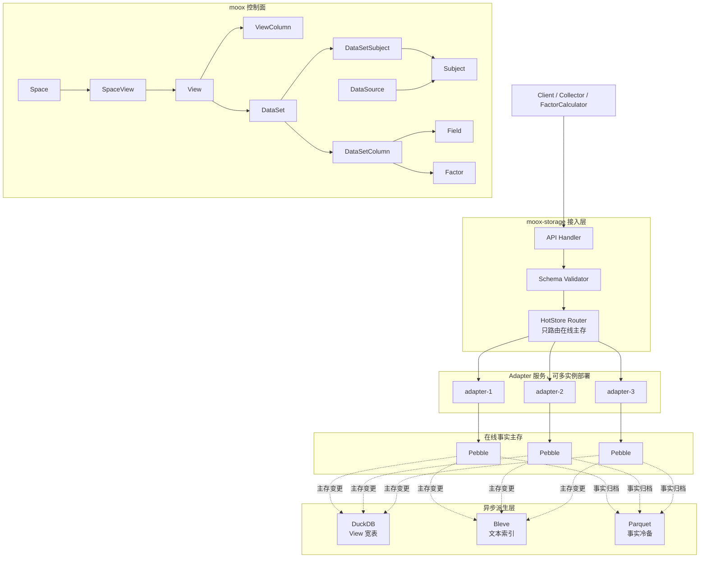
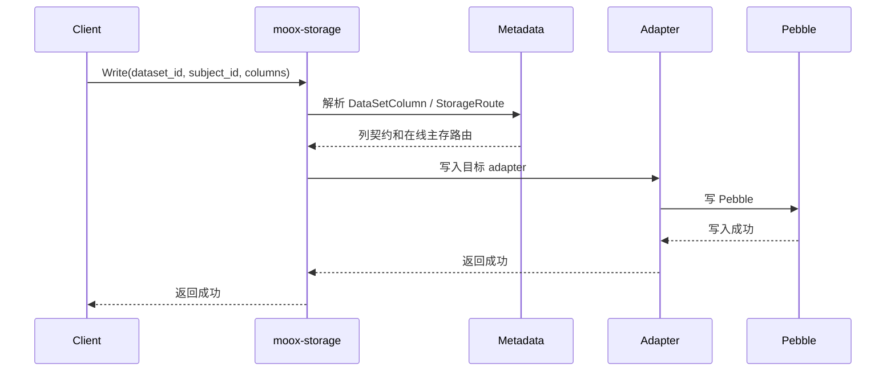
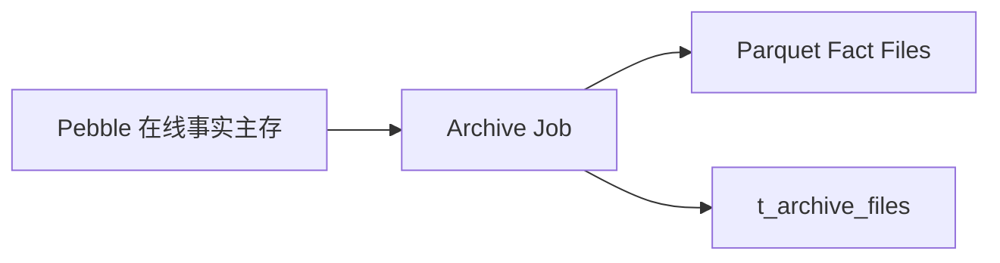

# 量化数据存储目标架构与元数据设计

本文记录 moox 量化数据存储系统的目标架构、核心概念、数据流和元数据表设计。它以旧 xData 的简单分层为基础，保留数据集、数据对象、字段契约和存储路由，同时删掉过早的治理表。

本文是目标设计。当前 `schema/storage_metadata.sql` 和 storage proto 仍需按本文继续收敛。

## 设计原则

- `Space` 是用户可见 View 的集合。它不拥有 Subject、DataSet、Field 或 Factor。
- `View` 是用户查询入口，也是 DuckDB 宽表定义。系统异步构建 View 对应的宽表。
- `DataSet` 是事实数据集。它定义一类数据和这一类数据下的列。
- `DataSetColumn` 记录 DataSet 下的所有列。列可以来自 Field、Factor 或系统列。
- `DataSource` 表示数据来源，替代旧的 Exchange。交易所、财经接口、文件导入和内部计算都可以是 DataSource。
- `Subject` 表示数据源下的数据对象。交易标的只是 Subject 的一种。
- `Field` 是全局普通字段字典。它不属于 Space。
- `Factor` 是全局、已参数化的因子结果定义。它不属于 Space，也不直接绑定 DataSet。
- Pebble 是在线事实主存。DuckDB、Bleve 和 Parquet 都从 Pebble 主存变更异步派生。
- `StorageRoute` 只负责 Pebble 在线主存的水平切分，不做字段垂直切分。
- Parquet 冷备只从 Pebble 做事实归档，不从 DuckDB 宽表归档。
- DuckDB 保存近期宽表查询缓存，不保存常驻 long 表。
- 用户请求不存在的字段组合时，服务直接返回 `VIEW_NOT_FOUND`，不在线动态 pivot/join。
- 项目尚未上线，不维护 `schema_migrations`。
- 表名使用 `t_` 前缀，列名使用 `c_` 前缀，保持和旧 moox 管理台 schema 一致。

## 总体分层



## 核心概念

### Space

`Space` 是用户或业务的使用空间。它只选择可见的 View，并承载用户隔离、权限和默认配置。

Space 不直接拥有 DataSet、Subject、Field 或 Factor。多个 Space 可以选择同一个 View。

### View

`View` 是用户查询入口。每个 View 都会落一张 DuckDB 宽表，系统异步构建和刷新这张宽表。

View 负责：

```text
选择一个或多个 DataSet
定义对用户暴露的列
定义查询频率
定义查询窗口
记录当前 active_table
记录构建状态
```

`c_query_window` 表示 View 支持在线组合查询的最近时间范围。DuckDB 宽表按这个窗口回扫和重建。

View 和 DataSet 的区别：

| 概念 | DataSet | View |
| --- | --- | --- |
| 本质 | 原始事实数据集 | 派生查询视图 |
| 是否可写 | 可写 | 只读 |
| 是否事实源 | 是 | 否 |
| 数据范围 | 一类事实数据 | 可组合多个 DataSet 的列 |
| 主要职责 | 写入契约、事实存储 | 查询、筛选、排序、宽表加速 |
| 主要后端 | Pebble | DuckDB 宽表 |

服务不为临时组合在线生成查询计划。用户查询的列组合必须命中已有 View；否则返回 `VIEW_NOT_FOUND`。

### DataSet

`DataSet` 是一组可写的事实数据集合。它回答“这是一组什么数据”。

DataSet 不属于 Space。Space 通过 View 间接使用 DataSet。

一个 DataSet 内的数据形态必须一致。K 线、公司资料、新闻、榜单、订单簿和因子值应分成不同 DataSet。

时序 DataSet 可以支持多个频率。以 Binance 现货 K 线为例，`1m`、`1h` 和 `1d` 可以共用一个 DataSet：

```text
dataset = binance_spot_kline
freqs = ["1m", "1h", "1d"]
```

DataSet 只配置一份 Subject 集合和列集合。具体查询频率由 View 决定。

`DataSet` 只保留 `data_kind`，删除 `data_domain`。业务分类可以先放入 `c_attrs_json`。

推荐 `data_kind`：

```text
object
time_series
snapshot
event
document
table
```

系统默认拒绝未知列。写入列必须先登记到 `t_dataset_columns`，因此不需要 `unknown_field_policy`。

### DataSetSubject

`DataSetSubject` 记录 DataSet 覆盖哪些 Subject。它是 DataSet 的对象池。

Subject 本身只属于 DataSource。同一个 Subject 可以被多个 DataSet 使用，例如 `BTC-USDT` 可以同时出现在 K 线、成交、订单簿和因子值 DataSet 中。

采集器抓取某个市场下的所有标的时，应先查询 DataSet 绑定的 Subject 集合，再按 Subject 写入事实数据。

`c_effective_start_time` 和 `c_effective_end_time` 表示 Subject 在 DataSet 中的生效区间。采集器和回测查询可用它过滤未上市、已下架、合约到期或历史成分变更的对象。

### DataSetColumn

`DataSetColumn` 记录 DataSet 下的所有列，替代旧设计里的 `DataSetField`。

一列可以来自：

```text
field   // 普通字段
factor  // 已参数化因子
system  // 系统列，例如 subject_id、data_time、freq
```

`t_dataset_columns` 不需要独立的 `c_dataset_column_id`。`c_dataset_id` 全局唯一，可使用 `(c_dataset_id, c_column_name)` 作为业务唯一键。

`index_policy_json` 删除。索引和宽表策略属于 View，不属于 DataSetColumn。

`c_text_indexed` 是 DataSetColumn 的列级开关。它表示该列是否同步到 Bleve 全文索引。这个开关不放在 `Field` 上，因为同一个全局字段在不同 DataSet 下可能有不同检索价值，例如 `title` 在新闻 DataSet 中需要索引，但在某个内部配置 DataSet 中可能不需要。

### DataSource

`DataSource` 表示数据来源。它比 Exchange 更通用。

示例：

```text
BINANCE
OKX
TUSHARE
AKSHARE
EASTMONEY
YAHOO_FINANCE
CSV_IMPORT
MANUAL_INPUT
FACTOR_CALCULATOR
```

交易所只是 DataSource 的一种。

### Subject

`Subject` 表示 DataSource 下的数据对象，继承旧 xData 的 Object 思路。

示例：

```text
BTC-USDT
600519.SH
龙虎榜
雪球用户 12345
CoinDesk
```

Subject 不属于 Space。它只和 DataSource 直接相关。用户私有导入数据可以创建用户私有 DataSource，再在该 DataSource 下创建 Subject。

交易标的不再单独进入 `instruments` 表，而是用 `c_subject_type` 表达：

```text
stock
crypto_pair
futures
option
ranking_board
news_source
user_account
custom
```

### Field

`Field` 是全局普通字段字典。它描述字段契约，例如字段名、值类型、单位、校验规则和示例。

示例：

```text
open
high
low
close
volume
industry
title
content
```

Field 不属于 Space，也不直接绑定 DataSet。字段进入某个 DataSet 时，由 `t_dataset_columns` 表达。

`c_unit` 表示字段默认单位，例如 `CNY`、`USD`、`USDT`、`share`、`contract` 或 `percent`。如果单位和具体 DataSet 或 Subject 相关，可在 `t_dataset_columns.c_attrs_json` 中覆盖。

### Factor

`Factor` 是全局、已参数化的因子结果定义。系统不再拆 `FactorDef` 和 `FactorInstance`。

示例：

```text
ma20_close
ma60_close
rsi14
```

`Factor` 表示可以写入、查询和进入宽表的因子结果。它不表示抽象算法族。

推荐含义：

```text
name = ma20_close
algorithm = MA
params_json = {"window":20,"price":"close"}
value_type = double
```

Factor 不绑定 DataSet。因子是否属于某个 DataSet，由 `t_dataset_columns` 表达；因子是否进入某个 View，由 `t_view_columns` 表达。

### ViewColumn

`ViewColumn` 定义 View 宽表中的列。列可以来自 DataSetColumn、Factor 或系统列。

`c_online_time` 表示该列进入 View 的上线时间，精确到时分秒。它用于解释列的可见时间，不限制宽表回扫范围。

```text
build_start_time = now - view.c_query_window
build_end_time = now
```

### StorageEntity

`StorageEntity` 表示 adapter 服务实例或服务组。moox-storage 接入层根据 StorageRoute 把在线主存写入分发到不同 adapter 服务。

### StorageDevice

`StorageDevice` 是底层具体存储组件。

示例：

```text
Pebble
DuckDB
Bleve
ParquetArchive
```

StorageDevice 可以挂在某个 StorageEntity 下。StorageRoute 只选择在线主存对应的 Pebble 设备；DuckDB、Bleve 和 Parquet 设备由异步派生任务使用。

### StorageRoute

`StorageRoute` 只负责在线主存水平切分。

它不表示字段级垂直切分，也不表示 DuckDB、Bleve 或 Parquet 的派生路径。派生路径统一来自 Pebble 主存变更。

常见路由策略：

```text
dataset 默认路由
subject 精确路由
subject_pattern 路由
subject_hash 路由
```

### ArchiveFile

`ArchiveFile` 记录 Parquet 事实归档文件。Parquet 只从 Pebble 归档，不从 DuckDB 宽表归档。

归档文件采用稳定事实 schema，避免新增字段导致宽表 Parquet schema 不一致。

推荐归档形态：

```text
dataset_id
subject_id
data_time
freq
source_type      // field / factor / system
source_id        // field_id / factor_id / system column
source_name
value_type
value_double
value_int
value_string
value_bool
value_time
value_json
ingest_time
```

## 数据流

### 写入主链路



写入成功以 Pebble 主存成功为准。DuckDB、Bleve 和 Parquet 的延迟不影响主写入返回。

### View 宽表构建

DuckDB 不保存常驻 long 表。系统定时或按事件从 Pebble 扫描 View 的查询窗口，构建新的 View 宽表。

构建流程：

1. 读取 View 的 DataSet 列表、频率和 ViewColumn 列集合。
2. 计算 `build_start_time = now - c_query_window`。
3. 从 Pebble 扫描 `[build_start_time, now]` 内的数据。
4. 新建 DuckDB 宽表。
5. 写入宽表并校验。
6. 切换 View 的 `c_active_table`。
7. 删除旧宽表。

系统不在线 `ALTER` 当前宽表。新增字段或因子时，后台新建宽表并切换。

### Parquet 事实归档

Parquet 只从 Pebble 事实主存归档。



不从 DuckDB 宽表归档，原因是宽表只覆盖近期缓存，且新增字段后新旧宽表文件 schema 可能不同。事实归档使用稳定 long schema，新增字段只新增行，不改变文件 schema。

## 读写与查询协议

### DataService

用户写入和读取事实数据统一使用 DataSet 维度。

```text
WriteRows
ReadRows
```

`WriteRows` 写入 `DataRow`。一行数据由 `DataSlice` 定位：

```text
dataset_id
subject_id
freq
dimensions
```

`DataRow` 包含：

```text
slice
data_time
row_id
columns
attrs
```

`DataSlice.dimensions` 是事实切片定位维度，不是普通查询过滤条件。它适合表达低基数且参与事实身份的维度，例如复权类型、报告期、榜单类型或订单簿深度层级。用于展示、筛选或排序的业务值应写入 `DataRow.columns`。

写入协议不提供用户删除能力，不返回行变更明细，也不返回旧值。写入成功只表示在线事实主存已接受请求。DuckDB、Bleve 和 Parquet 的派生结果由异步任务处理。

`ReadRows` 仍以 DataSet 维度读取事实数据，支持：

```text
range           // 时间区间读取
point           // row_id 点查
latest_before   // 某个截面时间之前的最新行
```

### QueryService

组合查询使用 View 维度。

```text
QueryView
SearchRows
```

`QueryView` 只查询已登记、已异步构建的 View。若用户临时请求一个不存在的字段组合，服务返回 `VIEW_NOT_FOUND`，不在线动态拼装查询计划。

表达式列属于 View 元数据和后台构建逻辑。`QueryViewColumn` 响应只返回列名、来源、数据集、来源 ID 和值类型，不返回表达式文本。

`SearchRows` 使用 DataSet 维度，支持全文检索和结构化过滤。只有 `t_dataset_columns.c_text_indexed = 1` 的列会同步到 Bleve，避免把无关字段写入全文索引，影响索引体积和查询性能。`SearchRows` 的 `filters` 和 `sorts` 用于 DataSet 内搜索，不替代跨 DataSet 的组合分析查询。

DataSet 与 View 的维度不同是刻意设计：

```text
写入事实：DataSet
读取事实：DataSet
组合分析：View
全文和结构化搜索：DataSet
```

### AdapterService

Adapter 是内部执行接口，用于把接入层已解析路由的数据分发到具体存储设备。协议统一使用 `Device` 表达底层存储，不再使用额外的 Physical 概念。

```text
WriteDeviceRows
ReadDeviceRows
```

`DeviceRef.device_table` 表示设备内部表、索引或键空间名称。它是内部执行细节，不对普通用户暴露。

## 目标元数据表

目标 storage 元数据表如下：

```text
t_spaces
t_space_views
t_views
t_view_columns
t_data_sources
t_subjects
t_datasets
t_dataset_subjects
t_dataset_columns
t_fields
t_factors
t_storage_entities
t_storage_devices
t_storage_routes
t_archive_files
```

删除或不进入 storage 核心 schema 的表：

```text
schema_migrations
markets
exchanges
instruments
instrument_aliases
dataset_dimensions
dataset_fields
field_aliases
field_index_policies
schema_change_events
storage_sync_outbox
collector_dataset_bindings
metadata_audit_logs
旧 data_view_versions
旧 data_view_materializations
factor_instances
```

`collector_dataset_bindings` 属于 moox 控制面或采集编排，不属于 storage 核心元数据。

## 表设计约定

所有表使用 `t_` 前缀，所有列使用 `c_` 前缀。

建议保留 `c_id INTEGER PRIMARY KEY AUTOINCREMENT` 作为内部自增主键，业务 ID 使用唯一索引：

```text
c_id
c_xxx_id
c_name
c_status
c_attrs_json
c_ctime
c_mtime
```

## 表字段草案

### t_spaces

```text
c_id
c_space_id
c_name
c_description
c_owner
c_status
c_attrs_json
c_ctime
c_mtime
```

### t_space_views

```text
c_id
c_space_id
c_view_id
c_status
c_ctime
c_mtime
```

### t_views

```text
c_id
c_view_id
c_name
c_description
c_dataset_ids_json
c_grain_json
c_freq
c_filter_json
c_engine              // duckdb
c_query_window
c_active_table
c_build_status
c_status
c_attrs_json
c_ctime
c_mtime
```

### t_view_columns

```text
c_id
c_view_id
c_column_name
c_source_type         // field / factor / system / expression
c_source_id
c_value_type
c_online_time
c_sort_order
c_attrs_json
c_ctime
c_mtime
```

### t_data_sources

```text
c_id
c_data_source_id
c_name
c_source_type         // exchange / vendor_api / file_import / manual / internal
c_market
c_timezone
c_config_json
c_status
c_attrs_json
c_ctime
c_mtime
```

### t_subjects

```text
c_id
c_subject_id
c_data_source_id
c_subject_type
c_source_symbol
c_name
c_market
c_currency
c_timezone
c_aliases_json
c_attrs_json
c_status
c_ctime
c_mtime
```

### t_datasets

```text
c_id
c_dataset_id
c_name
c_description
c_data_kind           // object / time_series / snapshot / event / document / table
c_freqs_json
c_status
c_attrs_json
c_ctime
c_mtime
```

### t_dataset_subjects

```text
c_id
c_dataset_id
c_subject_id
c_subject_role        // normal / benchmark / index / universe_member
c_effective_start_time
c_effective_end_time
c_status
c_attrs_json
c_ctime
c_mtime
```

建议唯一键：

```text
UNIQUE(c_dataset_id, c_subject_id)
```

### t_dataset_columns

```text
c_id
c_dataset_id
c_column_name
c_source_type         // field / factor / system
c_source_id
c_value_type
c_required
c_is_unique
c_aliases_json
c_text_indexed          // 是否同步到 Bleve 全文索引
c_status
c_ctime
c_mtime
```

建议唯一键：

```text
UNIQUE(c_dataset_id, c_column_name)
UNIQUE(c_dataset_id, c_source_type, c_source_id)
```

### t_fields

```text
c_id
c_field_id
c_interface_name
c_name
c_description
c_value_type          // string / int / double / bool / time / json / bytes
c_unit
c_validation_rule_json
c_write_example
c_status
c_attrs_json
c_ctime
c_mtime
```

### t_factors

```text
c_id
c_factor_id
c_name
c_description
c_algorithm
c_params_json
c_value_type
c_status
c_attrs_json
c_ctime
c_mtime
```

### t_storage_entities

```text
c_id
c_entity_id
c_name
c_endpoint
c_role                // adapter
c_weight
c_status
c_config_json
c_ctime
c_mtime
```

### t_storage_devices

```text
c_id
c_device_id
c_entity_id
c_name
c_engine              // pebble / duckdb / bleve / parquet_archive
c_endpoint
c_config_json
c_status
c_ctime
c_mtime
```

### t_storage_routes

```text
c_id
c_route_id
c_dataset_id
c_subject_id
c_subject_pattern
c_hash_rule
c_entity_id
c_device_id           // 仅指向在线主存 Pebble 设备
c_priority
c_status
c_ctime
c_mtime
```

### t_archive_files

```text
c_id
c_archive_file_id
c_dataset_id
c_device_id
c_partition_key
c_file_uri
c_file_format         // parquet
c_min_time
c_max_time
c_row_count
c_content_hash
c_columns_json
c_status
c_ctime
c_mtime
```

## 查询策略

查询执行器按查询形态选择后端：

| 查询形态 | 首选后端 | 说明 |
| --- | --- | --- |
| 单 Subject 时间范围查询 | Pebble | 在线主存低延迟范围扫描 |
| 已存在 View 的组合筛选 | DuckDB 宽表 | 近期窗口内高效筛选 |
| 文本检索 | Bleve | 新闻、公告、公司资料等文本索引 |
| 历史归档读取 | Parquet | 事实归档，适合离线恢复和长期保存 |

不存在 View 的组合查询直接返回 `VIEW_NOT_FOUND`。DuckDB 宽表只覆盖 View 的频率和近期窗口；超出窗口的复杂组合查询返回明确错误，或引导用户使用离线 Parquet 流程。

## 与旧 xData 的取舍

保留：

- 旧项目级字段复用思想，收敛为全局字段字典和 Space 到 View 的授权。
- DataSet 类型一致原则。
- Object 逻辑视图，改名为 Subject。
- 对象列表和对象详情的思维模型。
- 存储实体和存储设备分离。
- 在线数据按 Subject 水平切分。

删除或暂缓：

- 字段垂直切分。
- DuckDB 常驻 long 表。
- 宽表版本治理表。
- schema 迁移表。
- 采集绑定放入 storage 核心 schema。
- Exchange、Market、Instrument 的独立底层表。
- FactorDef 和 FactorInstance 的二层模型。

最终目标是保留旧 xData 的简单性，同时支持 adapter 多实例、Pebble 主存、DuckDB View 宽表、Bleve 文本索引和 Parquet 事实归档。
