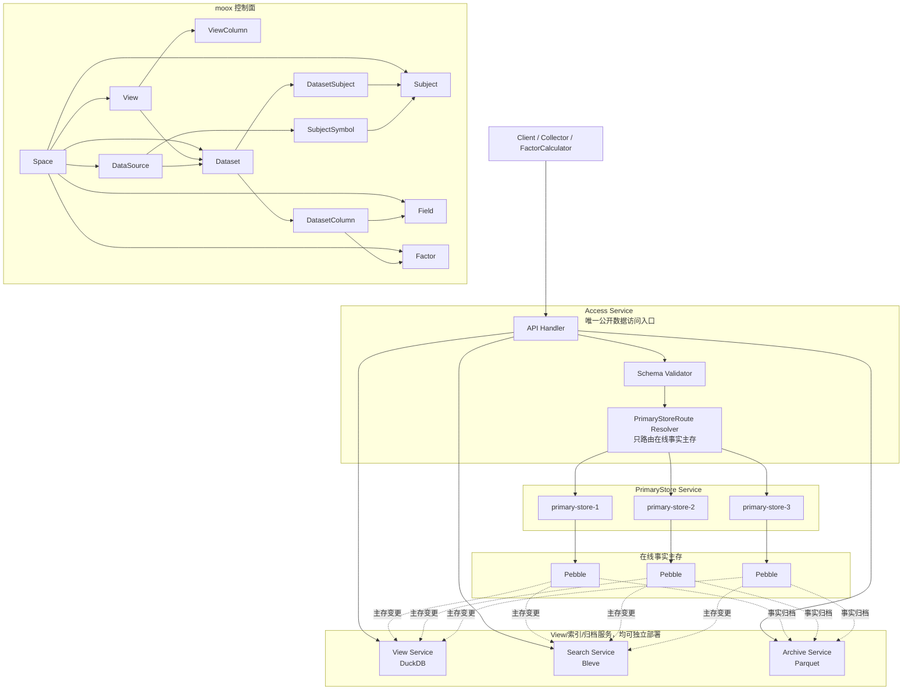
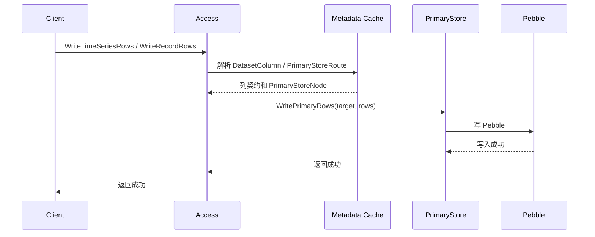
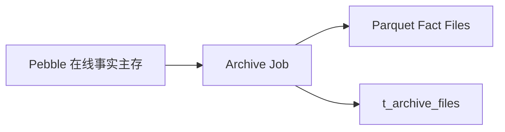

# 量化数据存储目标架构与元数据设计

本文记录 moox 量化数据存储系统的目标架构、核心概念、数据流和元数据表设计。它以旧 xData 的简单分层为基础，保留数据集、数据对象、字段契约和存储路由，同时删掉过早的治理表。

本文是目标设计。`modules/storage/schema/metadata.sql` 和 storage proto 应按本文保持一致。

如果是第一次阅读本系统，建议先读 `docs/storage-concepts-and-design-intent.md`。该文档解释 Space、DataSource、Subject、Dataset、Field、Factor、View 等概念的边界，以及这些取舍背后的设计意图。

## 设计原则

- `Space` 是业务命名空间，也是用户可见 View 的集合。本文所说“全局”均指 Space 内全局。
- `DataSource`、`Subject`、`Dataset`、`Field`、`Factor` 和 `View` 都归属某个 Space；同名业务对象可以在不同 Space 各自存在。
- `View` 是用户查询入口，也是物化查询结果定义。系统异步构建 View 对应的物化结果。
- `View` 在创建时确定所属 Space，不再使用独立的空间-视图绑定关系。
- `Dataset` 是事实数据集。它定义一类数据和这一类数据下的列，并且只绑定一个 DataSource。
- `DatasetColumn` 记录 Dataset 下的所有列。列通过 `origin_type/origin_id` 指向 Field、Factor 或系统列。
- `DataSource` 表示数据来源，替代旧的 Exchange。交易所、财经接口、文件导入和内部计算都可以是 DataSource。
- `Subject` 是 Space 内的业务对象，不归属 DataSource；数据源侧代码由 `SubjectSymbol` 映射。
- `Field` 是 Space 内普通字段字典，可被多个 Dataset 选用。
- `Factor` 是 Space 内、已参数化的因子结果定义，可被多个 Dataset 选用。
- Pebble 是在线事实主存。DuckDB、Bleve 和 Parquet 都从 Pebble 主存变更异步派生。
- `core/eventbus` 承载 storage 领域事件，`infra/transport` 承载 NATS 等底层消息传输实现，`infra/eventbus` 将底层 producer / subscriber 适配成业务事件总线，业务层不直接依赖具体消息组件。
- storage 事件 subject 使用统一前缀，默认 `moox.storage`；时序行变更事件默认 `moox.storage.time_series.rows_changed.v1`，记录行变更事件默认 `moox.storage.record.rows_changed.v1`，NATS 可用 `moox.storage.>` 订阅整组 storage 事件。
- 所有用户侧和业务侧数据访问都必须先进入 Access Service。Collector、FactorCalculator、管理台和 CLI 不直接访问 PrimaryStore、Search、View、Archive 或底层设备。
- `PrimaryStoreRoute` 只负责 Pebble 在线事实主存的水平切分，并路由到 PrimaryStore Service 节点。`PrimaryStoreTarget` 是 Access 内部解析后的执行目标，不暴露给用户协议，也不要求派生消费者理解。
- 不再使用旧的存储代理服务名作为业务服务名。底层实现统一称为 Device 或设备驱动，例如 Pebble、DuckDB、Bleve 和 Parquet 的具体实现。
- Parquet 冷备只从 Pebble 做事实归档，不从 DuckDB 宽表归档。
- DuckDB 保存近期宽表查询缓存，不保存常驻 long 表。
- 用户请求不存在的字段组合时，服务直接返回 `VIEW_NOT_FOUND`，不在线动态 pivot/join。
- 项目尚未上线，不维护 `schema_migrations`。
- 表名使用 `t_` 前缀，列名使用 `c_` 前缀，保持和旧 moox 管理台 schema 一致。

## 总体分层



## 模块内代码组织

```text
modules/storage/
  schema/              # storage 相关 SQL 表定义
    metadata.sql
    admin_console.sql
  internal/
  config/              # moox-storage 配置加载
  core/                # 领域抽象和规则，不绑定具体设备
    eventbus/
    metadata/
    router/
    schema/
  infra/               # 具体底层实现
    device/
    eventbus/
    metadata/sqlite/
    transport/
  services/            # 可独立部署或独立调度的服务
    access/            # 统一读写查询接入层
    primary/           # PrimaryStore Service，Pebble 在线事实主存
    search/            # Search Service，Bleve 全文和结构化搜索
    view/              # View Service，DuckDB View 物化和查询
    archive/           # Archive Service，Parquet 事实冷备
```

`services/access` 是唯一公开数据访问入口。它负责协议编排、鉴权、校验、元数据解释、PrimaryStoreRoute 解析、请求转发和统一错误码。Search、View、Archive 等派生消费者需要回读完整事实行时，也通过 Access 的读接口完成，不直接访问 `PrimaryStoreTarget` 或底层分片。`services/primary`、`services/search`、`services/view` 和 `services/archive` 都是内部执行服务，可以独立部署和扩缩容；单进程部署下 Access 默认使用 LocalClient 访问 PrimaryStore，只有显式配置 `storage.primary.service_name` 时才走远程 PrimaryStore Service。`core` 只放领域抽象，`infra` 只放 SQLite、Pebble、DuckDB、Bleve、Parquet、NATS 等具体实现。

## 核心概念

### Space

`Space` 是用户或业务的使用空间，也是业务元数据的命名空间。本文中“全局 Subject”“全局 Field”“全局 Factor”都指 Space 内全局，不表示全系统唯一。

Space 承载：

```text
DataSource
Subject
Dataset
Field
Factor
View
```

不同 Space 可以有相同的 `subject_id`、`field_id`、`factor_id` 或 `dataset_id`，互不影响。

### View

`View` 是用户查询入口。每个 View 都会异步构建一份物化查询结果；当前实现通常由 DuckDB 承载，但 View 概念本身不暴露底层表名。

View 负责：

```text
选择一个或多个 Dataset
指定 primary_dataset_id
定义对用户暴露的列
定义查询结果粒度
定义查询窗口
记录当前 active_result
记录构建状态
```

`c_query_window` 表示 View 支持在线组合查询的最近时间范围。物化查询结果按这个窗口回扫和重建。

`c_primary_dataset_id` 表示 View 的主 Dataset。View 的 Subject 范围固定来自主 Dataset 绑定的 Subject 集合。创建 View 时，用户选择 Dataset 和列，不需要选择 Subject；系统也不提供其他 Subject 范围策略。

当 View 关联多个 Dataset 时，附属 Dataset 只提供列。宽表构建以主 Dataset 的 Subject 集合为行域，再按 `subject_id`、`data_time`、`freq` 等粒度键关联其他 Dataset 的列。附属 Dataset 缺失数据时，相关列为空；附属 Dataset 额外拥有的 Subject 不会扩展 View 的行集合。

View 和 Dataset 的区别：

| 概念 | Dataset | View |
| --- | --- | --- |
| 本质 | 原始事实数据集 | 派生查询视图 |
| 是否可写 | 可写 | 只读 |
| 是否事实源 | 是 | 否 |
| 数据范围 | 一类事实数据 | 可组合多个 Dataset 的列 |
| 主要职责 | 写入契约、事实存储 | 查询、筛选、排序、物化加速 |
| 主要后端 | Pebble | 物化查询结果 |

服务不为临时组合在线生成查询计划。用户查询的列组合必须命中已有 View；否则返回 `VIEW_NOT_FOUND`。

### Dataset

`Dataset` 是一组可写的事实数据集合。它回答“这是一组什么数据”。

Dataset 属于某个 Space，并且只绑定一个 DataSource。这样可以避免同一个 View 中同一个 Subject 因多个来源产生重复行。

一个 Dataset 内的数据形态必须一致。K 线、公司资料、新闻、榜单、订单簿和因子值应分成不同 Dataset。

时序 Dataset 可以支持多个频率。以 Binance 现货 K 线为例，`1m`、`1h` 和 `1d` 可以共用一个 Dataset：

```text
dataset = binance_spot_kline
freqs = ["1m", "1h", "1d"]
```

Dataset 只配置一份 Subject 集合和列集合。时序频率属于 Dataset 支持的事实维度，写入和读取时通过 `freq` 指定，View 不再单独定义频率。

`Dataset` 只保留 `data_kind`，删除 `data_domain`。业务分类可以先放入 `c_attrs_json`。

推荐 `data_kind`：

```text
record
time_series
snapshot
event
document
table
```

系统默认拒绝未知列。写入列必须先登记到 `t_dataset_columns`，因此不需要 `unknown_field_policy`。

### DatasetSubject

`DatasetSubject` 记录 Dataset 覆盖哪些 Subject。它是 Dataset 的对象池。

Subject 是 Space 内业务对象，不归属 DataSource。同一个 Subject 可以被多个 Dataset 使用，例如 `BTC-USDT` 可以同时出现在 K 线、成交、订单簿和因子值 Dataset 中。

采集器抓取某个市场下的所有标的时，应先查询 Dataset 绑定的 Subject 集合，再按 Subject 写入事实数据。

`c_effective_start_time` 和 `c_effective_end_time` 表示 Subject 在 Dataset 中的生效区间。采集器和回测查询可用它过滤未上市、已下架、合约到期或历史成分变更的对象。

### SubjectSymbol

`SubjectSymbol` 表示某个 DataSource 对某个 Subject 的外部代码映射。

示例：

```text
space_id = quant
subject_id = APT-USDT
data_source_id = binance
external_symbol = APTUSDT
```

同一个 Subject 可以有多个 DataSource 映射，例如 Binance、OKX、CSV_IMPORT 都可以各自维护外部代码。Dataset 只绑定一个 DataSource，因此写入链路能明确解释外部代码来自哪里。

### DatasetColumn

`DatasetColumn` 记录 Dataset 下的所有列，替代旧设计里的 `DatasetField`。

一列可以来自：

```text
field   // Space 内普通字段
factor  // Space 内已参数化因子
system  // 系统列，例如 subject_id、data_time、freq
```

`t_dataset_columns` 不需要独立的 `c_dataset_column_id`。`c_dataset_id` 在 Space 内唯一，可使用 `(c_space_id, c_dataset_id, c_column_name)` 作为业务唯一键。

`index_policy_json` 删除。索引和宽表策略属于 View，不属于 DatasetColumn。

`c_origin_type/c_origin_id` 表示列来源。普通字段列指向 `t_fields.c_field_id`，因子列指向 `t_factors.c_factor_id`，系统列指向系统列名。

DatasetColumn 只描述写入契约和列来源，不再携带全文索引开关。是否进入 DuckDB 物化结果或 Bleve 全文索引，由 ViewColumn 和 View 引擎决定；同一个 Dataset 可以被多个 View 以不同列集合派生。

### DataSource

`DataSource` 表示数据来源。它比 Exchange 更通用。

示例：

```text
BINANCE
OKX
TUSHARE
AKSHARE
EASTMONEY
YAHOO_FINANCE
CSV_IMPORT
MANUAL_INPUT
FACTOR_CALCULATOR
```

交易所只是 DataSource 的一种。

### Subject

`Subject` 表示 Space 内的数据对象，继承旧 xData 的业务对象建模思路。

示例：

```text
BTC-USDT
600519.SH
龙虎榜
雪球用户 12345
CoinDesk
```

Subject 不直接归属 DataSource。DataSource 的外部代码、别名和来源侧 symbol 由 `SubjectSymbol` 管理。

交易标的不再单独进入 `instruments` 表，而是用 `c_subject_type` 表达：

```text
stock
crypto_pair
futures
option
ranking_board
news_source
user_account
custom
```

### Field

`Field` 是 Space 内普通字段字典。它描述字段契约，例如字段 ID、中文名、值类型、单位、校验规则和示例。

示例：

```text
open
high
low
close
volume
industry
title
content
```

Field 不直接绑定 Dataset。字段进入某个 Dataset 时，由 `t_dataset_columns` 表达。

`c_unit` 表示字段默认单位，例如 `CNY`、`USD`、`USDT`、`share`、`contract` 或 `percent`。如果单位和具体 Dataset 或 Subject 相关，可在 `t_dataset_columns.c_attrs_json` 中覆盖。

### Factor

`Factor` 是 Space 内、已参数化的因子结果定义。系统不再拆 `FactorDef` 和 `FactorInstance`。

示例：

```text
ma20_close
ma60_close
rsi14
```

`Factor` 表示可以写入、查询和进入宽表的因子结果。它不表示抽象算法族。

推荐含义：

```text
name = ma20_close
algorithm = MA
params_json = {"window":20,"price":"close"}
value_type = double
```

Factor 不绑定 Dataset。因子是否属于某个 Dataset，由 `t_dataset_columns` 表达；因子是否进入某个 View，由 `t_view_columns` 表达。

### ViewColumn

`ViewColumn` 定义 View 宽表中的列。列通过 `origin_type/origin_id` 指向 DatasetColumn、表达式或系统列。

`c_online_time` 表示该列进入 View 的上线时间，精确到时分秒。它用于解释列的可见时间，不限制宽表回扫范围。

```text
build_start_time = now - view.c_query_window
build_end_time = now
```

### PrimaryStoreNode

`PrimaryStoreNode` 表示 PrimaryStore Service 节点，也就是一个 Pebble 在线事实主存服务实例或服务组入口。Access Service 根据 PrimaryStoreRoute 把事实写入和事实读取分发到不同 PrimaryStoreNode。

当前协议和元数据表仍使用 `PrimaryStoreNode` 名称。它的目标语义已经收窄为 PrimaryStoreNode，后续协议和表结构重命名时应一并清理。

### Device

`Device` 是底层具体存储组件；表定义中仍使用 `t_storage_devices` 作为元数据表名。

示例：

```text
Pebble
DuckDB
Bleve
ParquetArchive
```

Device 可以挂在某个内部服务节点下。PrimaryStore Service 只使用 Pebble Device；View Service 使用 DuckDB Device；Search Service 使用 Bleve Device；Archive Service 使用 Parquet Device。普通调用方不感知 Device。

### PrimaryStoreRoute

`PrimaryStoreRoute` 只负责在线事实主存水平切分。

它不表示字段级垂直切分，也不表示 DuckDB、Bleve 或 Parquet 的派生路径。派生路径统一来自 Pebble 主存变更。

当前协议和元数据表仍使用 `PrimaryStoreRoute` 名称。它的目标语义已经收窄为 PrimaryStoreRoute，后续协议和表结构重命名时应一并清理。

常见路由策略：

```text
dataset 默认路由
subject 精确路由
subject_pattern 路由
subject_hash 路由
```

### ArchiveFile

`ArchiveFile` 记录 Parquet 事实归档文件。Parquet 只从 Pebble 归档，不从 DuckDB 宽表归档。

归档文件采用稳定事实 schema，避免新增字段导致宽表 Parquet schema 不一致。

推荐归档形态：

```text
dataset_id
subject_id
data_time
freq
origin_type      // field / factor / system
origin_id        // field_id / factor_id / system column
origin_name
value_type
value_double
value_int
value_string
value_bool
value_time
value_json
ingest_time
```

## 数据流

### 写入主链路



写入成功以 Pebble 主存成功为准。DuckDB、Bleve 和 Parquet 的延迟不影响主写入返回。

元数据控制面直接读写 SQLite，用于管理台、CLI 和控制面任务。Access 的写入校验、PrimaryStoreRoute 解析、Search 索引列解释等服务读路径使用独立的 metadata cache。cache 启动时加载快照，后续刷新调度由 snapshotcache 组件负责；storage 不在元数据写入时手动刷新或更新 cache，也不要求“刚写入的元数据立刻被服务读路径读到”。

事实写入链路不负责写入 DatasetSubject 绑定关系；应用层、管理台或 CLI 可按自身业务需要独立维护 DatasetSubject，用于“列出 dataset 下有哪些 subject/record”、派生重建枚举等控制面场景。Access 写入校验只校验 Dataset、列契约以及必要的 key 字段；TimeSeries 与 Record 数据只要携带合法 key 和已登记列即可写入。服务侧允许等 snapshotcache 刷新后再让读路径看到新绑定。`RebuildTimeSeriesView` 和 `RebuildRecordView` 是控制面补偿接口，后台回扫仍通过 Access 读路径执行。

事实写入语义收敛为按 `key + version` 更新列值。同一个 TimeSeries 或 Record key 再次写入时，只处理本次 row 中携带的列；同名列覆盖，未携带的旧列保留。写入协议不提供用户删除能力，也不提供整行删除或按范围清空切片的能力，底层不得用 `DeleteRange` 表达更新语义。

Access 会按 PrimaryStoreRoute 把同批 rows 分组写入一个或多个 `PrimaryStoreTarget`。`PrimaryStoreTarget` 是内部执行目标，不是跨节点事务边界；跨 `PrimaryStoreTarget` 写入不承诺全局原子性，也不回滚已经成功写入的目标。若后续目标失败，已经成功写入的 rows 仍会发布对应的 TimeSeries 或 Record 事件，便于派生侧追上成功部分。

主存写入完成后发布 `TimeSeriesRowsChangedEvent` 或 `RecordRowsChangedEvent`。事件中的 rows 是变更提示，不要求携带完整行；Search、View 等派生消费者收到事件后通过 Access 读接口回读最新完整行，再覆盖写入 DuckDB、Bleve 或其他派生结果，保证重试消费是幂等的。消费者不直接请求 `PrimaryStoreTarget`，也不理解分片、路由或底层设备细节。派生索引始终异步生成，不提供写后立即可搜契约；主链路只负责主存写入和事件发布。生产环境可把 eventbus 配置为 NATS，并通过 `subject_prefix` 和 `consumer_name` 配置统一 subject 前缀与 durable consumer。

### View 物化构建

DuckDB 不保存常驻 long 表。系统定时或按事件从 Pebble 扫描 View 的查询窗口，构建新的 View 物化结果。

构建流程：

1. 读取 View 的 `primary_dataset_id`、Dataset 列表和 ViewColumn 列集合。
2. 计算 `build_start_time = now - c_query_window`。
3. 从 Pebble 扫描主 Dataset 在 `[build_start_time, now]` 内的数据，得到 View 的 Subject 行域。
4. 新建物化查询结果。
5. 按粒度键关联附属 Dataset 的列，写入宽表并校验。
6. 切换 View 的 `c_active_result`。
7. 由后台 cleanup 任务异步删除不再被任何 active View 引用的旧结果表。

系统不在线 `ALTER` 当前宽表。新增字段或因子时，后台新建宽表并切换；旧结果表不会在切换瞬间删除，避免影响已经拿到旧 `active_result` 的并发查询。

### Parquet 事实归档

Parquet 只从 Pebble 事实主存归档。



不从 DuckDB 宽表归档，原因是宽表只覆盖近期缓存，且新增字段后新旧宽表文件 schema 可能不同。事实归档使用稳定 long schema，新增字段只新增行，不改变文件 schema。`moox-storage` 提供 archive timer handler，调度参数使用 `space_id`、`dataset_id`、`partition_key`、`start_time`、`end_time` 表达一次归档任务；`dataset_id=*` 表示归档该 Space 下所有 active Dataset。在 tRPC timer 的 `network` 配置中业务参数使用 `;` 分隔，避免和框架参数的 `&` 冲突。未显式指定 `DeviceID` 时，Archive Service 从 metadata 中选择 active `parquet_archive` 设备登记归档文件。

## 读写与查询协议

### AccessService

用户写入和读取事实数据统一使用 Dataset 维度。

```text
WriteTimeSeriesRows
ReadTimeSeriesRows
WriteRecordRows
ReadRecordRows
```

事实行底层统一为 `space_id + dataset_id + internal_key + version -> columns + attributes`。再次写入相同 key 时，系统只更新请求中携带的列值和 attributes。未携带的列不会被置空或删除。DatasetColumn 的 `required` 不表示每次字段级更新都必须携带该列；它可作为采集契约、管理台提示或全量导入校验依据。

TimeSeries 用于固定 `subject_id + freq` 下按 `data_time` 演进的数据：

```text
TimeSeriesKey(space_id, dataset_id, subject_id, freq, dimensions, data_time)
data_key = subject_id | freq | dimhash
version  = data_time
```

Record 用于其他所有数据，即使数据本身有时间线也通过 version 表达：

```text
RecordKey(space_id, dataset_id, record_id, version)
internal_key = record_id
version  = version
```

`dimensions` 是事实范围定位维度，不是普通查询过滤条件。它适合表达低基数且参与事实身份的维度，例如复权类型、报告期、榜单类型或订单簿深度层级。用于展示、筛选或排序的业务值应写入 columns。

Pebble 在线主存使用两个物理 key 空间：

```text
t|space|dataset|subject|freq|version|dimhash|legacy_row_id
r|space|dataset|record_id|version
```

TimeRange 固定为闭区间 `[start_time, end_time]`，时间必须是 RFC3339/RFC3339Nano；内部归一化为 UTC 固定 9 位纳秒，保证字典序与时间顺序一致。VersionRange 固定为闭区间 `[start_version, end_version]`。

写入协议不提供用户删除能力，不返回行变更明细，也不返回旧值。写入成功只表示在线事实主存已接受请求。若同一批请求被路由到多个 `PrimaryStoreTarget`，成功目标不会因为后续目标失败而回滚。DuckDB、Bleve 和 Parquet 的派生结果由异步任务处理。

`ReadTimeSeriesRows` 使用 `TimeSeriesKey + TimeRange` 读取时序数据。`ReadRecordRows` 使用 `RecordKey + VersionRange` 读取记录数据。精确点查可让 range 的起止相同，读取最新版本可把 range 终点设置为业务需要的上界。

### ViewService

组合查询使用 View 维度。

```text
QueryTimeSeriesRows
SearchRecordRows
```

`QueryTimeSeriesRows` 只查询已登记、已异步构建的 View。若用户临时请求一个不存在的字段组合，服务返回 `VIEW_NOT_FOUND`，不在线动态拼装查询计划。

表达式列属于 View 元数据和后台构建逻辑。`QueryTimeSeriesRowsColumn` 响应只返回列名、来源、数据集、来源 ID 和值类型，不返回表达式文本。

`SearchRecordRows` 使用 Space + View 维度，查询 View active_result 指向的 Bleve 版本化索引。Search Service 汇聚 PrimaryStore 变更事件，查询时不走 PrimaryStoreRoute，也不 fan-out 到 Pebble 分片。进入索引的字段由该 View 的 ViewColumn 决定；View 字段增加或形态变化会递增 `view_version`，后台从 PrimaryStore 全量重建新索引版本，完成后再切换 active_result。`SearchRecordRows` 的 `filters` 和 `sorts` 用于 View 内搜索，不替代跨 Dataset 的组合分析查询。

Dataset 与 View 的维度不同是刻意设计：

```text
写入事实：Dataset
读取事实：Dataset
组合分析：View
全文和结构化搜索：Dataset
```

### PrimaryStore 内部执行协议

`PrimaryStoreService` 是在线事实主存的内部执行接口。View、Search 和 Archive 分别由独立内部服务承载。

```text
WritePrimaryRows
ReadPrimaryRows
```

`PrimaryStoreTarget` 表示 Access 已完成路由后的主存执行目标。它包含目标 `node_id`、Pebble `device_id`、内部 `device_table` 和 PrimaryStore 节点 `endpoint`，只在 Access 到 PrimaryStore 的内部调用中使用，不对普通用户暴露。它不是事务对象，storage 不在多个 `PrimaryStoreTarget` 之间提供原子提交。

## 目标元数据表

目标 storage 元数据表如下：

```text
t_spaces
t_views
t_view_columns
t_data_sources
t_subjects
t_subject_symbols
t_datasets
t_dataset_subjects
t_dataset_columns
t_fields
t_factors
t_primary_store_nodes
t_storage_devices
t_primary_store_routes
t_archive_files
```

说明：PB、服务接口、seed 配置和 SQLite 物理表名均统一使用 PrimaryStore 拓扑语义；设备表仍保留 `t_storage_devices`，因为 Device 表示通用存储设备，不只服务 PrimaryStore。

删除或不进入 storage 核心 schema 的表：

```text
schema_migrations
markets
exchanges
instruments
instrument_aliases
dataset_dimensions
dataset_fields
field_aliases
field_index_policies
schema_change_events
storage_sync_outbox
collector_dataset_bindings
metadata_audit_logs
旧 data_view_versions
旧 data_view_materializations
factor_instances
```

`collector_dataset_bindings` 属于 moox 控制面或采集编排，不属于 storage 核心元数据。

## 表设计约定

所有表使用 `t_` 前缀，所有列使用 `c_` 前缀。

建议保留 `c_id INTEGER PRIMARY KEY AUTOINCREMENT` 作为内部自增主键，业务 ID 使用唯一索引：

```text
c_id
c_xxx_id
c_name
c_status
c_attrs_json
c_ctime
c_mtime
```

## 表字段草案

### t_spaces

```text
c_id
c_space_id
c_name
c_description
c_owner
c_status
c_attrs_json
c_ctime
c_mtime
```

### t_views

```text
c_id
c_space_id
c_view_id
c_name
c_description
c_primary_dataset_id
c_dataset_ids_json
c_grain_keys_json
c_filter_json
c_engine              // duckdb
c_query_window
c_active_result
c_build_status
c_status
c_attrs_json
c_ctime
c_mtime
```

### t_view_columns

```text
c_id
c_space_id
c_view_id
c_column_name
c_origin_type         // dataset_column / expression / system
c_origin_id
c_value_type
c_online_time
c_sort_order
c_attrs_json
c_ctime
c_mtime
```

### t_data_sources

```text
c_id
c_space_id
c_data_source_id
c_name
c_kind                // exchange / vendor_api / file_import / manual / internal
c_market
c_timezone
c_config_json
c_status
c_attrs_json
c_ctime
c_mtime
```

### t_subjects

```text
c_id
c_space_id
c_subject_id
c_subject_type
c_name
c_market
c_currency
c_timezone
c_attrs_json
c_status
c_ctime
c_mtime
```

### t_subject_symbols

```text
c_id
c_space_id
c_subject_id
c_data_source_id
c_external_symbol
c_status
c_attrs_json
c_ctime
c_mtime
```

### t_datasets

```text
c_id
c_space_id
c_dataset_id
c_data_source_id
c_name
c_description
c_data_kind           // record / time_series / snapshot / event / document / table
c_freqs_json
c_status
c_attrs_json
c_ctime
c_mtime
```

### t_dataset_subjects

```text
c_id
c_space_id
c_dataset_id
c_subject_id
c_subject_role        // normal / benchmark / index / universe_member
c_effective_start_time
c_effective_end_time
c_status
c_attrs_json
c_ctime
c_mtime
```

建议唯一键：

```text
UNIQUE(c_space_id, c_dataset_id, c_subject_id)
```

### t_dataset_columns

```text
c_id
c_space_id
c_dataset_id
c_column_name
c_origin_type         // field / factor / system
c_origin_id
c_value_type
c_required
c_is_unique
c_aliases_json
c_status
c_attrs_json
c_ctime
c_mtime
```

建议唯一键：

```text
UNIQUE(c_space_id, c_dataset_id, c_column_name)
UNIQUE(c_space_id, c_dataset_id, c_origin_type, c_origin_id)
```

### t_fields

```text
c_id
c_space_id
c_field_id
c_name
c_description
c_value_type          // string / int / double / bool / time / json / bytes
c_unit
c_validation_rule_json
c_write_example
c_status
c_attrs_json
c_ctime
c_mtime
```

### t_factors

```text
c_id
c_space_id
c_factor_id
c_name
c_description
c_algorithm
c_params_json
c_value_type
c_status
c_attrs_json
c_ctime
c_mtime
```

### t_primary_store_nodes

```text
c_id
c_node_id
c_name
c_endpoint
c_weight
c_status
c_config_json
c_attrs_json
c_ctime
c_mtime
```

### t_storage_devices

```text
c_id
c_device_id
c_node_id
c_name
c_engine              // pebble / duckdb / bleve / parquet_archive
c_endpoint
c_config_json
c_status
c_attrs_json
c_ctime
c_mtime
```

### t_primary_store_routes

```text
c_id
c_space_id
c_route_id
c_dataset_id
c_subject_id
c_subject_pattern
c_hash_rule
c_node_id
c_priority
c_status
c_attrs_json
c_ctime
c_mtime
```

### t_archive_files

```text
c_id
c_space_id
c_archive_file_id
c_dataset_id
c_device_id
c_partition_key
c_file_uri
c_file_format         // parquet
c_min_time
c_max_time
c_row_count
c_content_hash
c_columns_json
c_status
c_attrs_json
c_ctime
c_mtime
```

## 查询策略

查询执行器按查询形态选择后端：

| 查询形态 | 首选后端 | 说明 |
| --- | --- | --- |
| 单 Subject 时间范围查询 | Pebble | 在线主存低延迟范围扫描 |
| 已存在 View 的组合筛选 | 物化查询结果 | 近期窗口内高效筛选 |
| 文本检索 | Bleve | 新闻、公告、公司资料等文本索引 |
| 历史归档读取 | Parquet | 事实归档，适合离线恢复和长期保存 |

不存在 View 的组合查询直接返回 `VIEW_NOT_FOUND`。物化查询结果只覆盖 View 的粒度和近期窗口；超出窗口的复杂组合查询返回明确错误，或引导用户使用离线 Parquet 流程。

## 与旧 xData 的取舍

保留：

- 旧项目级字段复用思想，收敛为 Space 内字段字典和 View 查询入口。
- Dataset 类型一致原则。
- 业务对象逻辑视图，改名为 Subject。
- 对象列表和对象详情的思维模型。
- 存储节点和存储设备分离。
- 在线数据按 Subject 水平切分。

删除或暂缓：

- 字段垂直切分。
- DuckDB 常驻 long 表。
- 宽表版本治理表。
- schema 迁移表。
- 采集绑定放入 storage 核心 schema。
- Exchange、Market、Instrument 的独立底层表。
- FactorDef 和 FactorInstance 的二层模型。

最终目标是保留旧 xData 的简单性，同时支持 Access 统一入口、PrimaryStore 多实例、Pebble 主存、DuckDB View 宽表、Bleve 文本索引和 Parquet 事实归档。
