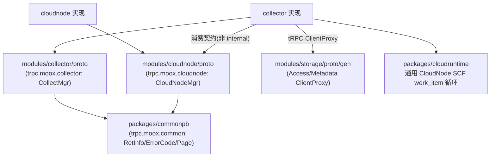

# collect / collector / cloudnode 三模块重划分执行计划

Date: 2026-07-03

## 1. 背景与目标

`modules/collect` 是一个共享 proto 模块，但把两套本属不同服务的契约（采集 `CollectMgr` + 云节点 `CloudNodeMgr`）塞进同一个 `collect_service.proto`、同一个 proto 包 `trpc.moox.collect`、同一个生成包 `collectgen`；公共类型 `moox_common.proto`（`trpc.moox.common`）也和业务 proto 共用一个生成包。命名 `collect` 无法覆盖 cloudnode 语义。

本次做一次彻底的三模块重划分（契约层 + 运行时职责），接受破坏性变更（trpc 服务全名变更、目录/包重命名、go.work/go.mod 调整）。目标：

- 契约"谁实现谁拥有"：`collector` 自持 `CollectMgr` 契约，`cloudnode` 自持 `CloudNodeMgr` 契约，公共类型下沉为独立最小包。
- 全仓重复的公共 proto 结构统一收敛到 `packages/commonpb`，避免 admin/trade/collector/cloudnode/storage 各自维护 `AuthInfo/RetInfo/Page/PageResult/ErrorCode`。
- 删除 `modules/collect`。
- 顺带清理运行时坏味道：cloudnode god-service 拆分、collector 采集器抽象收敛、目录合并与规范命名。通用 CloudNode SCF work_item runtime 继续使用 `packages/cloudruntime` 命名。

## 2. 目标依赖架构



依赖方向：`collector -> cloudnode 契约`（单向）；`cloudnode` 不反向依赖任何业务模块；业务 proto 统一依赖 `commonpb`；collector 运行时直接用 storage 生成的 tRPC client proxy 写数据。

## 3. 命名与结构决策总表

### 3.1 顶层 / 契约

| 原 | 新 | proto 包 | go 包 |
|----|----|---------|-------|
| `packages/cloudruntime` | 保留 | — | `cloudruntime` |
| 各模块重复 `moox_common.proto` / storage 中重复公共结构 | `packages/commonpb` | `trpc.moox.common` | `commonpb` |
| `modules/collect`（含 collectgen） | 删除 | — | — |
| collect 中 `CollectMgr` 部分 | `modules/collector/proto`（`collector.proto`，gen 目录 `collectorgen`） | `trpc.moox.collector` | `collectorpb` |
| collect 中 `CloudNodeMgr` 部分 | `modules/cloudnode/proto`（`cloudnode.proto`，gen 目录 `cloudnodegen`） | `trpc.moox.cloudnode` | `cloudnodepb` |

proto 文件名去 `_service` 后缀；公共文件仍为 `moox_common.proto`。

### 3.2 collector/internal 目录 before → after

| 原目录 | 新目录 | 处理 |
|--------|--------|------|
| `service/collectmgr/` | `rpc/` | 扁平化 + 改名（对齐仓库约定 admin `*/rpc/`、trade `internal/rpc`）：register.go / server.go / convert.go |
| `collector/`（Collector 接口 + registry + binance 实现） | `sources/` | 改名；执行层，统一 `Collect`，单一 registry 按 exchange+market+data_type 路由 |
| `exchange/`（交易所 HTTP SDK） | `sources/binance/client/` + `sources/exchangetypes/` | 移入 sources；按交易所聚合（方案2） |
| `adapters/`（按交易所 BuildTaskSpecs） | 删除，逻辑上移 `planner/` | 任务展开改为按 data_type（交易所无关） |
| `cloudnodepoller/` | `taskrunner/` | 改名（去 cloudnode 语义；运行时拉取并执行 work_item） |
| `cloudnodeclient/` | `taskpublisher/` | 改名；派发任务到 cloudnode，import `cloudnodepb` |
| `scf/` | `serverless/` | 改名（Serverless 入口 handler） |
| `heartbeat/` | 并入 `reporter/` | 运行时回调合并（上报心跳 + 上报任务状态） |
| `dnsproxy/` | 并入 `httpclient/` | 网络层合并（DNS 优选/probe 服务于 httpclient） |
| `adminapi/` | 并入 `app/runtime/`（config） | 后台网关 URL + 鉴权归入运行时配置 |
| 顶层 `bootstrap/` + `config/` | `app/runtime/` + `app/runtimeboot/` | runtime 保存配置/鉴权/URL helper；runtimeboot 负责 SCF runtime 进程装配 |
| `control/`（bootstrap/config/discovery/storage 各 1 文件子目录） | `app/control/`（package control，扁平） | 控制面进程装配：bootstrap.go / config.go / discovery.go / database.go |
| `storageclient/` | 删除 | 直接用 storage 生成的 `AccessClientProxy` / `MetadataClientProxy`；胶水搬到 sources(写) 与 planner(读) |
| `model/`（types.go + common/ + market/） | `model/`（扁平一层，可清晰处收拢） | 数据模型收敛 |
| `repository/task_rule_repo.go` / `task_instance_repo.go` | `repository/task_rule.go` / `task_instance.go` | 去 `_repo` 后缀 |
| `domain/` | 保留 | 控制面领域层（实体 + 规则），必要 |
| `executor/` | 保留 | 执行采集任务 |

collector/internal 目标布局：

```text
modules/collector/internal/
  app/
    control/     package control：bootstrap.go config.go discovery.go database.go
    runtime/     package runtime：config.go local_config.go global.go（含并入的 adminapi）
    runtimeboot/ package runtimeboot：bootstrap.go services.go trpc.go
  rpc/           CollectMgr trpc 入口：register.go server.go convert.go
  planner/       任务展开（按 data_type）：planner.go kline.go symbol.go task_builder.go + 读 subjects 的 helper
  domain/        控制面领域类型：TaskRule/TaskInstance/CollectParams/DatasetSubject/TaskSpec + StableTaskID/ParseCollectParams
  repository/    task_rule.go task_instance.go
  taskpublisher/ 派发任务到 cloudnode（import cloudnodepb）
  serverless/    云函数入口 handler
  executor/      执行采集任务
  taskrunner/    拉取并执行 work_item（依赖 cloudruntime + cloudnodepb 契约）
  sources/       执行层：统一 Collect
    interface.go registry.go exchangetypes/
    binance/ { client/(client.go spot.go swap.go types.go)  symbol.go kline.go api_config.go storage_config.go }
  reporter/      运行时回调：任务状态 + 心跳
  httpclient/    通用 HTTP 客户端（含 DNS 优选/probe）
  model/         数据模型（扁平）
```

### 3.3 cloudnode/internal 目录 before → after

| 原 | 新 | 处理 |
|----|----|------|
| `service/cloudnode/service.go`（1189 行） | `rpc/` | 扁平化 + 改名 + 按能力拆分 |
| — | `rpc/register.go server.go convert.go` | trpc 入口装配 + 通用依赖 + 转换 |
| — | `rpc/node.go account.go package.go workitem.go invocation.go` | 按能力拆分 handler |
| `repository/catalog.go`（大杂烩） | `repository/models.go node.go account.go package.go invocation.go` | 拆分，去 catalog 统称，去 _repo 后缀 |
| `repository/work_item_repo.go` | `repository/work_item.go` | 去 _repo 后缀，改 import cloudnodepb |
| `providers/tencent-scf/` `bootstrap/` `config/` `storage/` | 保留 | 单进程，无需 app/{control,runtime} 拆分 |

cloudnode/internal 目标布局：

```text
modules/cloudnode/internal/
  rpc/           CloudNodeMgr trpc 入口：register.go server.go convert.go node.go account.go package.go workitem.go invocation.go
  repository/    models.go node.go account.go package.go invocation.go work_item.go
  providers/tencent-scf/   bootstrap/   config/   storage/
```

## 4. 契约层拆分细节

- `packages/commonpb`：`moox_common.proto`（`trpc.moox.common`，`RetInfo/ErrorCode/Page/PageResult/AuthInfo`）；独立 go module，作为全仓公共响应、鉴权标记、分页和通用错误码的唯一来源。
- commonpb 统一范围：
  - 迁移 `modules/collect/proto/moox_common.proto`、`modules/admin/proto/moox_common.proto`、`modules/trade/proto/moox_common.proto` 中重复的 `AuthInfo/RetInfo/Page/PageResult/ErrorCode`。
  - 拆出 `modules/storage/proto/common.proto` 中与全仓重复的 `AuthInfo/RetInfo/Page/PageResult/ErrorCode`；storage 自有的 `SortOrder/TimeRange/VersionRange/TypedValue/FieldValueType/DataKind/ColumnOriginType` 等继续留在 storage proto 包内，避免 storage 领域类型泄漏到通用包。
  - `modules/admin/proto/*.proto`、`modules/trade/proto/*.proto`、`modules/storage/proto/*.proto`、`modules/collector/proto/*.proto`、`modules/cloudnode/proto/*.proto` 均 import commonpb 的 `moox_common.proto`，不再生成本地重复 common 类型。
- 为避免 protobuf descriptor 重复注册，`packages/commonpb` 落地后必须同一阶段移除 admin/trade/collect/storage 生成包中的重复 common 生成物；不能让两个不同 Go 包同时注册 `trpc.moox.common.*`。
- `modules/collector/proto/collector.proto`（`trpc.moox.collector`）：`CollectMgr` service + 采集 message（TaskRule / TaskInstance / DataTypeConfig 系列）；生成 `collectorgen`（go 包 `collectorpb`，require commonpb）。
- `modules/cloudnode/proto/cloudnode.proto`（`trpc.moox.cloudnode`）：`CloudNodeMgr` service + 节点/账户/代码包/CloudWorkItem/Submit·Poll·ReportWorkItem/InvokeSync/心跳 message；生成 `cloudnodegen`（go 包 `cloudnodepb`，require commonpb）。
- 引用切换：collector `rpc` import `collectorpb`；collector `taskpublisher` import `cloudnodepb`；cloudnode 全量 import `cloudnodepb`；admin/trade/storage/collector/cloudnode 的公共类型 import `commonpb`。
- proto Makefile 需要新增 commonpb import path。生成顺序为：`packages/commonpb` -> `modules/storage/proto` -> `modules/admin/proto` -> `modules/trade/proto` -> `modules/collector/proto` -> `modules/cloudnode/proto`。

## 5. 采集器执行 / 任务展开模型（收敛后）

两个关注点按不同维度分层：

| 关注点 | 路由键 | 交易所相关 | 位置 |
|--------|-------|-----------|------|
| 任务展开/规划 | `data_type`（kline/symbol/…） | 只读取标准 CollectParams，不依赖交易所 SDK | `planner/` |
| 执行 | `exchange+market+data_type` | 是 | `sources/` |

- kline 展开：读 dataset 下所有 subject × 频率 → N 个采集任务。
- symbol 展开：不依赖 subject，按 market 生成"拉全量标的"任务（symbol 采集反而产出 subjects）。
- 执行侧统一：`sources` 单一 registry，`Collect(ctx, params)` 按 `(exchange, market, data_type)` 路由；symbol 用 InstType，kline 用 Symbol+Interval。
- `adapters` 解散：其 `BuildTaskSpecs`（当前仅 binance/spot_kline，逻辑本就交易所无关）上移为 planner 的按 data_type 展开器。
- `planner` 明确提供按 data_type 分派的接口，例如 `BuildInstances(ctx, rule)` 内部选择 `klinePlanner` / `symbolPlanner`：
  - `klinePlanner` 要求 `params.Source.Kind == "dataset_subjects"`，通过 storage metadata tRPC proxy 拉取 active subjects 和 external symbol。
  - `symbolPlanner` 允许 `params.Source.Kind == ""` 或 `"none"`，不调用 `ListDatasetSubjects`，直接生成每个 market/data_source 的全量 symbol 采集任务。
  - 原 `TaskBuilder.BuildDatasetDrivenInstances` 的强约束不能原样保留为统一入口，否则 symbol 规则会被 `dataset_subjects` 模型误拦。

## 6. storage 访问改为直接 tRPC

- 删除 `storageclient/`，改用 `modules/storage/proto/gen` 的 `AccessClientProxy`（`WriteRecordRows`/`WriteTimeSeriesRows`）与 `MetadataClientProxy`（`RegisterDataSubject`/`ListDatasetSubjects`/`ListSubjectSymbols`）。
- proxy 构造：`gen.NewAccessClientProxy(client.WithTarget("ip://host:port"))` / `gen.NewMetadataClientProxy(client.WithTarget("ip://host:port"))`，走 tRPC 有协议请求，不再走手写 HTTP JSON path。
- dependency discovery 必须切到 tRPC 部署项：
  - control 面从 SysDeploy 优先读取 `storage_metadata_trpc`、`storage_access_trpc` 的 `rpc_address` 或 `host:port`，本地默认值改为 `127.0.0.1:20100` / `127.0.0.1:20102`。
  - SCF runtime 的 `service_deployments` 也优先读取 `storage_metadata_trpc`、`storage_access_trpc`；不能再把 `storage_metadata` / `storage_access` 的 HTTP `base_url` 传给 `client.WithTarget`。
  - 仍可保留 HTTP baseURL 作为过渡配置字段，但新的 storage proxy 路径只能消费 tRPC address。
- 胶水搬家：
  - 写入侧（`sources/binance`）：从 `SymbolInfo` 拼 `RegisterDataSubjectReq`、`[]*RecordRow`（含每批 25、并发 20 分批）、K线 `[]*TimeSeriesRow`，改用 storage gen proto 类型；删除 collector 镜像类型（RecordRow/ColumnValue/AuthInfo 等）。
  - 读取侧（`planner`）：`ListDatasetSubjects` + `ListSubjectSymbols` 翻页拉全量、合并 external_symbol、过滤 inactive → `[]domain.DatasetSubject` helper。
- 鉴权：storage 请求消息含可选 `auth_info`。SCF 侧只填**SCF 请求标记**（标识调用方为 SCF runtime 的身份信息，非 HMAC 签名），不额外引入 HMAC 机器。

## 7. 破坏性变更（trpc 全名 / 网关 / 依赖）

- trpc 服务全名：
  - `trpc.moox.collect.CollectMgr` → `trpc.moox.collector.CollectMgr`
  - `trpc.moox.collect.CloudNodeMgr` → `trpc.moox.cloudnode.CloudNodeMgr`
- admin 网关 resolver（`collectmgr`/`cloudnode` service-id → 新全名）。
- `taskpublisher` 提交路径（原 `/trpc.moox.collect.CloudNodeMgr/SubmitWorkItems` → 新全名）。
- `cloudruntime` 的 `/api/service/cloudnode/*` HTTP 路由段**保持不变**（后台服务路由，不是 trpc 全名）。
- `go.work`：
  - 移除 `./modules/collect/proto/collectgen`
  - 保留 `./packages/cloudruntime`
  - 新增 `./packages/commonpb`、`./modules/collector/proto/collectorgen`、`./modules/cloudnode/proto/cloudnodegen`
- `go.mod`：
  - collector：collectgen → collectorgen + cloudnodegen + commonpb；新增 `modules/storage/proto/gen`；继续 require `packages/cloudruntime`（含 replace）
  - cloudnode：collectgen → cloudnodegen + commonpb（含 replace）
  - admin/trade/storage：本地 common 生成包依赖 → commonpb（含 replace）；storage 保留 storage 自有 proto 类型。
- proto Makefile 与根 `make proto` 目标更新，确保 commonpb 最先生成。

## 8. 执行阶段与顺序

每个阶段结束应可编译（`go build ./...`）。

### 阶段 A：契约层落地
1. 新建 `packages/commonpb`（迁入全仓公共 `moox_common.proto`，生成，加 go.work）。
2. 切换 admin/trade/storage proto 到 commonpb：删除本地重复 common 生成物；storage 只保留 storage 自有 common 类型；更新 admingen/tradegen/storage gen 的 go.mod require·replace。
3. 新建 `modules/collector/proto`（collector.proto → collectorgen，require commonpb）。
4. 新建 `modules/cloudnode/proto`（cloudnode.proto → cloudnodegen，require commonpb）。
5. 切换 collector/cloudnode 全部 pb import 到新生成包；taskpublisher 用 cloudnodepb。
6. 更新 trpc 全名、admin 网关 resolver、taskpublisher 路径、两模块 bootstrap 注册。
7. 更新 go.work / 各 go.mod require·replace / proto Makefile / 根 `make proto` 顺序。
8. 删除 `modules/collect`。

### 阶段 B：cloudnode 运行时清理
9. `service/cloudnode/service.go` → `rpc/`（register/server/convert + node/account/package/workitem/invocation）。
10. `repository/catalog.go` → models.go + 按域拆分（去 _repo 后缀）。

### 阶段 C：cloudruntime 与 storage tRPC 访问
11. 保留 `packages/cloudruntime` 路径与包名；仅按新 `cloudnodepb` 契约更新其调用结构（如需要），`/api/service/cloudnode/*` 路由段保持不变。
12. 删除 collector `storageclient/`，改用 storage gen tRPC proxy；胶水搬到 sources/planner；SCF 填 SCF 请求标记。
13. collector discovery/config/runtime event 切换为 `storage_metadata_trpc` / `storage_access_trpc` 地址，collector go.mod 增加 `modules/storage/proto/gen`。

### 阶段 D：collector 目录重构
14. `service/collectmgr/` → `rpc/`；`collector/` → `sources/`（并入 exchange 为 client 子包 + exchangetypes）。
15. `adapters/` 解散，展开逻辑上移 planner（按 data_type：kline/symbol），新增不依赖 subject 的 symbol planner 入口。
16. `cloudnodepoller/`→`taskrunner/`；`cloudnodeclient/`→`taskpublisher/`；`scf/`→`serverless/`。
17. `heartbeat/`→`reporter/`；`dnsproxy/`→`httpclient/`；`adminapi/`+顶层 bootstrap/config→`app/runtime/`；`control/`→`app/control/`。
18. `repository/*_repo.go` 去后缀；`model/` 扁平化。

### 阶段 E：文档与验证
19. 更新 `modules/README.md`（移除 collect 行、修正 cli 依赖描述）、`docs/云节点执行平台架构.md`（协议维护表述）。
20. 全量 `go build ./...`、`make proto`；`rg "moox.collect|modules/collect|collectgen|storageclient" ` 确认无残留；`cloudruntime` 应保留且不作为残留项。

## 9. 验证清单

- [x] `go build ./...`（各 module）通过。
- [x] `make proto` 重生成无 diff 遗漏。
- [x] 无 `trpc.moox.collect` / `modules/collect` / `collectgen` / `storageclient` 残留引用；`packages/cloudruntime` 保留且引用正常。
- [x] 全仓只有 `packages/commonpb` 生成 `trpc.moox.common.*`，admin/trade/storage/collector/cloudnode 不再生成重复 common descriptor。
- [x] admin 网关能解析并转发 `collectmgr`/`cloudnode` 到新 trpc 全名。
- [x] collector control/runtime 通过 `storage_metadata_trpc` / `storage_access_trpc` 地址构造 storage gen proxy；symbol/kline 写入时使用 storage gen proxy，auth_info 带 SCF 标记。
- [x] `planner` 按 data_type registry 展开 kline/symbol；`sources` 按 exchange+market+data_type registry 执行采集；两个 registry 职责不混用。

## 10. 风险与回滚

- 破坏性变更集中在 trpc 全名与 go.work/go.mod；按阶段 A 一次性完成并编译验证，降低"半迁移"风险。
- commonpb 扩大到 admin/trade/storage 后，阶段 A 需要一次性处理重复 descriptor；如果拆成多次提交，容易出现两个 Go 包同时注册 `trpc.moox.common.*` 的运行时 panic。
- 运行时清理（阶段 B/C/D）与契约拆分解耦，可分批合入；每阶段独立可编译。
- storage 直连 tRPC 引入 storage proto 依赖进 SCF：接受（已确认），换取契约不漂移与类型安全；关键风险是 discovery 不能误用 HTTP baseURL。
- 回滚以 git 分支为准；proto 生成物纳入提交，便于比对。
