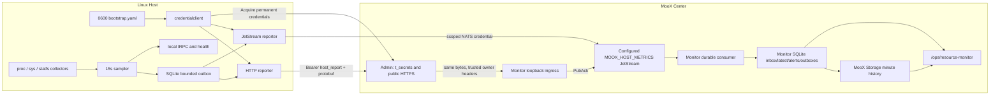

# MooX Host Agent、Admin 永久凭据与资源监控实施计划

> **For agentic workers:** REQUIRED SUB-SKILL: Use superpowers:subagent-driven-development (recommended) or superpowers:executing-plans to implement this plan task-by-task. Steps use checkbox (`- [ ]`) syntax for tracking.

**Goal:** 在 MooX 中新增可独立部署的 Linux `moox-host-agent`，采集服务器 CPU、内存、文件系统、磁盘 I/O 和网络数据；所有服务凭据统一由 Admin 的 `t_secrets` 管理，各进程用本地永久 bootstrap 主动获取自己的永久工作凭据；Monitor 通过 JetStream 可靠消费、存储、告警并承接现有资源监控页面。

**Architecture:** Host Agent 直接读取 Linux `/proc`、`/sys` 和 `statfs`，每 15 秒生成一份确定性 protobuf 快照，先写入本地 SQLite 有界 outbox，再通过 HTTPS（默认）或受限 JetStream（可选）上报。Admin 是凭据控制面和公网 HTTPS 入口，Monitor 是主机监控数据面的唯一 owner。bootstrap 是普通用户目录中的 `0600` 明文文件；bootstrap、`health_probe`、`host_report` 和 `nats_publish` 均为永久凭据，不设置过期时间，只有禁用或人工轮换才失效。

**Tech Stack:** Go 1.24、Linux amd64/arm64、tRPC-Go、protobuf、`golang.org/x/sys/unix`、GORM + `github.com/glebarez/sqlite`、NATS JetStream、MooX Storage、Vue 3、Arco Design、VChart、user systemd。

---

## 1. 当前代码事实

- 上游 `node_exporter` 的 collector 注册、flag 和路径依赖较重。本项目只参考其 Linux 指标语义，不 vendor、不 subtree、不 import `node_exporter/collector`，也不保留 Prometheus exposition。
- Admin 当前在 `modules/admin` 内抓取 `:9100/metrics`，页面请求会触发实时抓取，counter baseline 只在内存中，租户归属和持久化都不完整；该实现将在影子验证后删除。
- `modules/monitor` 已经是独立进程，具备 SQLite、调度器、HTTP/TCP probe、告警、webhook、peer health 和 SysDeploy 同步，适合作为新的资源监控中心。
- `modules/admin/schema/admin.sql` 已有 `t_secrets`；`c_secret_value` 由 `modules/admin/internal/service/secret/dao/secret.go` 使用 AES-GCM 加密。但现有 DAO 查询没有强制 `c_space_id`，`RevealSecret` 仅依赖全局 service-auth 标记，不能用于新的服务凭据。
- `c_extra_config` 是明文 JSON，只能保存非敏感元数据。
- `modules/admin/internal/common/crypto/key.go` 在缺少 `MOOX_ADMIN_ENCRYPTION_KEY` 时会使用固定开发 key；生产环境必须改为失败启动。
- 当前 Monitor 从 `modules/admin/internal/service/sysdeploy/defaults.go` 的 `extra_config.health_url` 生成 HTTP check，`modules/monitor/internal/probe/http.go` 发起 GET；当前健康探测没有逐服务 bearer。
- 当前 `scripts/deploy-moox.sh` 会把全局 `MOOX_SERVICE_AUTH_*` 默认值注入 Collector、Factor、Monitor，并先启动部分服务再启动 Admin；凭据主动获取后必须调整启动顺序和凭据文件。
- 当前 `scripts/release.sh` 是中央 MooX 整包发布，`scripts/deploy-moox.sh` 会替换中央部署目录；它们不适合部署每台机器上的 Host Agent。

## 2. 锁定决策

| 主题 | 决策 |
|---|---|
| 模块与进程 | 新建 `modules/hostagent`，二进制为 `moox-host-agent` 和 `moox-host-agent-cli`，与 `modules/monitor` 一样可独立构建和部署。 |
| 平台 | V1 只支持 Linux amd64/arm64，`CGO_ENABLED=0`；其他 OS/架构在构建或启动时明确拒绝。 |
| 采集范围 | 只做 CPU、内存、文件系统容量、磁盘 I/O、网络。进程、容器、GPU、systemd、硬件传感器和 textfile collector 不在 V1。 |
| 采集实现 | 重新实现所需 Linux ABI 读取；不复制上游实现。保留 `THIRD_PARTY_NOTICES.md` 说明设计参考和 Apache-2.0 来源。 |
| 调度 | 本地 scheduler 直接调用 collector，不通过本机 tRPC/HTTP 自调用。tRPC 只提供状态、快照和人工 `RunOnce`。 |
| 采样间隔 | 默认 15 秒；Monitor 最新状态和告警保留 15 秒粒度。Storage minute bucket 在分钟结束后再等 30 秒 lateness grace，保留 watermark 前已到达的最后一条样本。 |
| 上报模式 | 配置必须三选一：`http`、`jetstream`、`disabled`。生产部署拒绝 `disabled`；不做自动跨传输 fallback 和并行双发。 |
| 推荐链路 | 默认 HTTP：Host Agent -> Admin 公网 HTTPS -> Monitor loopback ingress -> JetStream。它支持只有出网能力、没有公网 IP 的内网机器。 |
| Direct NATS 边界 | `jetstream` 是高级 BYO 模式，只能连接运维独立提供的 TLS + operator/account + per-agent ACL JetStream；绝不暴露当前 Storage embedded NATS。标准 MooX release/deploy 只内建 HTTP 模式。 |
| 凭据表 | 不新建 credential 表，复用 `t_secrets`；新增 owner/purpose 字段和有条件唯一索引。 |
| 凭据寿命 | bootstrap、`service_api`、`health_probe`、`host_report`、`nats_publish` 都永久有效，不设置 TTL 或过期字段。禁用、软删除或人工轮换才失效。 |
| 凭据获取 | 每个服务用自己的 bootstrap 主动调用 Admin；工作凭据只驻留内存。禁止通过 Monitor health 请求顺带下发凭据。 |
| bootstrap 落盘 | 普通用户目录明文保存，不再自制加密。父目录必须 `0700`，文件必须由当前 UID 拥有且权限恰为 `0600`。 |
| Admin 根密钥 | `MOOX_ADMIN_ENCRYPTION_KEY` 是加密 `t_secrets` 的根，存在自举循环，不能再存入 `t_secrets`。它是唯一例外，由部署环境或普通用户 `0600` 文件提供。 |
| Admin health | Admin 自己的 `/healthz` 保持无认证，避免 Admin 启动依赖自身凭据接口；其他中心服务逐步启用各自 `health_probe`。 |
| 交付语义 | 在各层配置容量和保留期内 at-least-once。Agent outbox、`Nats-Msg-Id`、Monitor inbox 和 Storage 行键共同保证幂等。 |
| Monitor owner | V1 只有一个 host-metric ingest owner。使用 JetStream KV CAS lease + fencing token 保证不同或相同 instance ID 都不能并行消费到不同 SQLite；人工故障切换必须先停旧 owner。 |
| 历史存储 | Monitor SQLite 保存 inbox、最新状态、告警和 outbox；MooX Storage 保存分钟级历史。JetStream 只做有界交付缓冲。 |
| UI | 保留路由 `/ops/resource-monitor`，把数据源从 Admin `monitor` 切到 `moox_monitor`；影子比较完成后删除旧 Admin collector。 |
| Host Agent 发布 | 不加入中央 `release.sh`/`deploy-moox.sh`。`scripts/build.sh` 只增加显式 `hostagent` target，另建独立 release/deploy 脚本。 |

## 3. 范围与非目标

### V1 必须交付

- Linux 主机身份、boot ID、CPU、内存、文件系统、磁盘和网络采集。
- 本地确定性快照、原始 counter baseline、稳定 sequence 和有界 SQLite outbox。
- HTTPS 与直接 JetStream 两种 reporter；标准部署完整交付 HTTP，Direct NATS 只有在外部安全 Broker 前置条件和 ACL/revoke 验证通过时才可启用。
- Admin `t_secrets` 的 owner/purpose/space 隔离、bootstrap 管理、专用 Acquire API 和 Host Agent report API。
- 中心服务 health bearer 获取、内存缓存和 Monitor 探测注入。
- Monitor registry、JetStream stream/DLQ、durable consumer、inbox、projector、Storage history、告警和查询。
- 资源监控 UI、Host Agent 注册/禁用/轮换、一次性 bootstrap 展示。
- Admin 旧主机监控影子比较和删除。
- 中央发布逻辑调整，以及 Host Agent 独立 linux/amd64、linux/arm64 制品和普通用户部署。

### V1 明确不做

- Windows、macOS、BSD、容器/cgroup、进程、GPU、NFS 深度采集、eBPF、PromQL、remote-write。
- 动态签发短期 token、token TTL、自动续期窗口、证书 PKI、TPM、Vault 或自制本地密文格式。
- 通过 health 响应或 Monitor probe 请求下发密钥。
- Agent 远程命令执行、远程配置热更新、中心主动连接内网 Agent。
- 多 Monitor active-active 写独立 SQLite、自动 leader election、JetStream 多节点集群。
- 在 MooX 中内建或公网暴露 NATS operator/account server；Direct NATS 使用运维已有的安全 Broker，本计划只交付客户端、权限 contract 和验证 runbook。
- 自动安装 root systemd unit、自动执行 `sudo`、自动修改目标机系统级 nginx。
- 导入旧 `t_host_monitor_history`；旧数据缺少可靠的 space 归属，只保留备份后删除旧写入链路。

## 4. 总体架构



### 控制面与数据面边界

- Admin 是凭据控制面：创建、禁用、轮换、验证和下发 owner 自己的永久凭据。
- Admin 也是 Host Agent HTTP 的公网入口，但不解析业务指标，不保存样本，不执行告警。
- Monitor 是资源数据面的唯一 owner：registry、完整 envelope 校验、JetStream、inbox、projection、历史和告警都在 Monitor。
- HTTP 模式下，Admin 验证 `host_report` 后把原始 protobuf bytes 转发给 `127.0.0.1` 上的 Monitor internal ingress；Monitor 获得 PubAck 后，Admin 才向 Agent 返回成功。
- Direct NATS 模式绕过 Admin report，但 bootstrap Acquire 仍通过 Admin。V1 不让 Admin 动态签发 NATS JWT；管理员把受限 NATS JWT/seed 导入 `t_secrets`。
- 标准 HTTP 部署让 Monitor 连接中心 loopback JetStream；Direct NATS 部署则让 Monitor 和 Agent 一起连接 BYO external JetStream。两种部署都只有一个 `MOOX_HOST_METRICS`，不能同时把同一 registry 分散到两个 Broker。
- Admin 把 `nats_publish` 设为 inactive 只能阻止后续 Acquire/reconnect，不能踢掉已经建立的 NATS session；禁用 direct-NATS Agent 必须先在 NATS 侧 revoke user，再禁用 `t_secrets`/registry。需要即时集中撤销时使用默认 HTTP 模式。

## 5. 永久凭据设计

### 5.1 `t_secrets` 扩展

在现有表上新增：

```sql
c_owner_type TEXT NOT NULL DEFAULT '',
c_owner_id   TEXT NOT NULL DEFAULT '',
c_purpose    TEXT NOT NULL DEFAULT '',
c_revision   INTEGER NOT NULL DEFAULT 1
```

新增有条件唯一索引：

```sql
CREATE UNIQUE INDEX IF NOT EXISTS uk_secrets_active_owner_purpose
ON t_secrets(c_space_id, c_owner_type, c_owner_id, c_purpose)
WHERE c_is_deleted = 0 AND c_category = 'service';

CREATE UNIQUE INDEX IF NOT EXISTS uk_secrets_active_key_id
ON t_secrets(c_key_id)
WHERE c_is_deleted = 0 AND c_category = 'service';
```

约束：

| 字段 | 规则 |
|---|---|
| `c_category` | 固定为 `service`，并加入 Admin 合法 category。 |
| `c_secret_type` | token 类固定 `token`；NATS bundle 可使用 `certificate`，但仍只存于 `c_secret_value`。 |
| `c_space_id` | 中心基础服务使用保留值 `system`；Host Agent 使用真实租户 space。 |
| `c_owner_type` | 只允许 `service` 或 `hostagent`。 |
| `c_owner_id` | 中心服务使用稳定 service name；Host Agent 使用 immutable `agent_id`。 |
| `c_purpose` | 只允许 `bootstrap`、`service_api`、`health_probe`、`host_report`、`nats_publish`。 |
| `c_key_id` | 随机公开 token ID，用于 O(1) 精确查找；不是 secret。 |
| `c_secret_value` | 现有 AES-GCM 密文；token 只保存随机 secret 部分，NATS 保存 JWT/seed bundle。 |
| `c_extra_config` | 只允许非敏感标签、NATS subject 和 endpoint 等元数据，禁止 token、seed、password。 |
| `c_status` | `active` 或 `inactive`；禁用立即拒绝新请求。 |
| `c_revision` | 单调 revision；只在 credential 轮换或状态变化时递增，不能由普通 `last_used` 更新推动。 |
| `c_mtime` | 普通审计修改时间，不作为 revision；现有 SQLite trigger 的时间精度和更新范围不适合版本判断。 |

凭据没有 expiry 列。管理面可以禁用、启用、软删除和人工轮换，但不得偷偷生成短期副本。

### 5.2 owner 与 purpose

| owner | 必备 purpose | 可选 purpose |
|---|---|---|
| `moox_cloudnode`、`moox_collector`、`moox_factor`、`moox_monitor`、`moox_storage`、`moox_trade`、`moox_web_host` | `bootstrap`、`health_probe` | 需要调用 Admin `/api/service` 时增加 `service_api`。 |
| `moox_collector_scf`、`moox_cli` | `bootstrap`、`service_api` | 无 health credential。 |
| Host Agent | `bootstrap`、`host_report` | 直接 NATS 模式增加 `nats_publish`。 |

Admin 自身不创建 bootstrap 和 health credential。它通过本地数据库访问 `t_secrets`，`/healthz` 保持公开。

### 5.3 token 格式与验证

- bootstrap：`mxbs1.<key_id>.<secret>`。
- 普通 bearer：`mxcr1.<key_id>.<secret>`。
- 先解析 prefix 和 `key_id`，再以 `category + key_id + status + is_deleted` 精确查询一行，解密 `c_secret_value`，最后用 `subtle.ConstantTimeCompare` 比较 secret。
- 不允许扫描并解密全表，不允许从 request body 接受 owner/space 后直接授权。
- bootstrap 行本身定义 owner/space；Acquire 响应只能返回该 owner 允许的 purpose。
- 通用 `RevealSecret` 必须拒绝 `category=service`；控制台列表只返回脱敏元数据。

### 5.4 bootstrap 文件

Host Agent 默认路径：

```text
$HOME/.config/moox/credentials/hostagent-bootstrap.yaml
```

中心服务默认路径：

```text
$HOME/.config/moox/credentials/<service-name>-bootstrap.yaml
```

文件格式：

```yaml
version: 1
admin_url: https://moox.example.com
bootstrap_token: mxbs1.<key_id>.<secret>
```

规则：

- `$HOME/.config/moox/credentials` 必须由当前 UID 拥有且权限恰为 `0700`。
- 文件必须是普通文件、拒绝 symlink、由当前 UID 拥有且权限恰为 `0600`。
- 文件是明文，不再额外加密；安全边界是 Unix 文件权限、主目录/备份权限和人工轮换。
- 首次 provision 返回一次 bootstrap；以后正常列表和详情不再展示明文。文件丢失时执行显式 rotate 并重新部署，不能静默 reveal。
- release archive、应用 YAML、命令行参数、SQLite、outbox、日志、health 响应和 NATS header 都不得包含 bootstrap。
- Collector SCF 没有稳定普通用户 home，是唯一 bootstrap-file 例外：部署工具把 `moox_collector_scf` bootstrap 写入云函数平台的加密环境配置，冷启动后只在内存 Acquire `service_api`；禁止把工作 credential 写进函数配置、代码包或 JobItem。普通 Linux 进程、CLI 和 Host Agent 仍必须使用上述 `0600` 文件。

### 5.5 Acquire API

Admin 增加两个专用 API，不复用通用 `RevealSecret`：

```text
POST /api/credentials/v1/acquire
Authorization: Bearer <bootstrap>
body: {"purposes":["health_probe","service_api"]}

POST /api/credentials/v1/health-probes/acquire
Authorization: Bearer <monitor bootstrap>
body: {"service_names":["moox_cloudnode","moox_storage"]}
```

`AcquireOwnSecrets` 规则：

- owner、space 和 allowed purpose 全从 bootstrap 行派生，不信任 body owner/space。
- 只返回请求集合与 allowlist 的交集；Host Agent 不能获取 `health_probe`，普通服务不能获取 `host_report` 或别人的凭据。
- 返回 `purpose`、`credential`、`revision`；不返回 expiry。
- 响应 `Cache-Control: no-store`，限制为 1 MiB，日志不记录 header、body 和值。

`AcquireHealthProbeSecrets` 规则：

- 只允许 owner=`moox_monitor` 的 bootstrap。
- service name 必须存在于 Admin SysDeploy；Admin 从该可信行的 `credential_owner` 映射到 owner，并只返回该 owner 的 active `health_probe`。Storage 的多个 role 可以共享 `moox_storage` 凭据，Admin target 不需要凭据。
- Monitor 每 5 分钟刷新一次并原子替换内存 map；每次探测只读取内存，不把 token 写进 `t_monitor_checks.c_headers`。

### 5.6 内存生命周期

- `packages/credentialclient` 启动时校验 bootstrap 文件并 Acquire；成功后用 `atomic.Pointer` 或锁保护的 immutable map 原子替换。
- 凭据永久有效，但仍每 5 分钟轮询 revision，以便人工轮换/禁用能收敛。
- Admin 暂时不可用时，运行中的服务继续使用最后一次成功获取的永久凭据并标记 degraded。
- 进程重启且 Admin 不可用时，没有工作凭据：Host Agent 继续采集并堆积 outbox；中心服务保持 liveness，但 readiness=false，直到 Acquire 成功。
- 业务请求收到 401/403 时只触发一次立即 Acquire 并重试原请求一次；不得无限认证循环。
- Host Agent 上报认证失败时保留 FIFO 头和原始 bytes，状态改为 `blocked_credentials`；重新 Acquire 后继续发送。
- 撤销语义分层：bootstrap、`service_api`、`host_report` 每次都由 Admin 验证，Admin 状态更新后立即生效；`health_probe` 在目标服务和 Monitor 本地校验，最多经过一次 5 分钟 refresh 才收敛，轮换期间允许短暂 probe 失败；`nats_publish` 必须由外部 NATS operator revoke user 才能断开现有 session。

### 5.7 health 认证

- `packages/healthz` 增加可选 `RequireBearer` middleware，常量时间比较当前内存 token。
- CloudNode、Collector、Factor、Monitor、Storage、Trade、Web Host 分阶段启用各自 `health_probe`。
- Admin `/healthz` 是唯一例外，保持未认证。
- Monitor 只给 `CheckSourceSysDeploy` 自动生成的 health check 注入对应 bearer；manual HTTP check 永不继承凭据。
- 带 bearer 的 probe 禁止 redirect，防止 token 被转发到其他 origin。
- 迁移期间允许 feature flag；最终生产配置必须启用认证。

## 6. 指标、消息与持久化契约

### 6.1 Envelope

```protobuf
message HostMetricEnvelope {
  uint32 schema_version = 1;
  string sample_id = 2;
  string agent_id = 3;
  string agent_epoch_id = 4;
  string boot_id = 5;
  uint64 sequence = 6;
  string collected_at = 7;
  int64 configured_interval_millis = 8;
  int64 observed_elapsed_millis = 9;
  HostSnapshotV1 snapshot = 10;
  string agent_version = 11;
  string agent_git_commit = 12;
  string checksum_sha256 = 13;
}
```

- `sample_id = agent_id + ":" + agent_epoch_id + ":" + sequence`。
- checksum 是把 `checksum_sha256` 清空后进行 deterministic protobuf marshal，再做 SHA-256。
- retry 必须复用 outbox 中完全相同的 bytes 和 sample ID，不能重新构造 timestamp/checksum。
- Monitor 从 registry 派生 `space_id` 和 `host_id`，不信任 envelope 中的租户字段；envelope 本身不包含这两个字段。
- 校验：body <= 2 MiB、实体总数 <= 200、字符串有界、无 NaN/Inf、百分比在 `[0,100]`、rate 非负、total 一致、entity key 唯一、最大样本年龄 7 天、未来偏差 <= 2 分钟、identity/sample ID 一致。

### 6.2 Linux 指标语义

| 指标 | 语义 |
|---|---|
| CPU | `/proc/stat` aggregate；total 排除 guest/guest_nice，idle 包含 iowait；fixture golden 使用约 `53.8461538%`。 |
| Memory | `used = MemTotal - MemAvailable`；缺少 `MemAvailable` 时使用 `MemFree + Buffers + Cached + SReclaimable - Shmem` 并 clamp。 |
| Filesystem | `/proc/self/mountinfo` + `statfs`；`available=bavail*bsize`，`used=total-available`；默认排除网络/用户态 FS，固定 worker pool，不能为 timeout 无限创建 goroutine。 |
| Disk | `/proc/diskstats` 原始 totals + bytes/s、IOPS、utilization；sector 固定 512 bytes；通过 sysfs 默认排除 partition。 |
| Network | `/proc/net/dev` 原始 bytes/errors/drops totals + rates；读取 `/sys/class/net/<dev>/operstate` 作为可选状态。 |
| Rate elapsed | 使用 `CLOCK_BOOTTIME` 的持久 baseline，不序列化 Go monotonic time；boot 变化、counter 回退或 elapsed<=0 时 rate unavailable。 |

纯 parser 保持跨平台可测试；只有 `statfs`、`CLOCK_BOOTTIME` 和真实 Linux adapter 使用 build tag。

### 6.3 Agent SQLite

```text
t_hostagent_state
t_hostagent_baseline
t_hostagent_outbox
```

- 一个 SQLite transaction 内完成：加载 baseline/sequence、计算 rates、生成 envelope、更新 baseline/sequence、插入 outbox、执行容量裁剪。
- `agent_id` 在数据库初始化后不可修改；删除数据库才生成新的 `agent_epoch_id`。
- outbox 状态：`pending`、`sending`、`blocked_credentials`、`quarantined`，并带 lease、attempts、next_attempt_at 和 bounded error。
- V1 dispatcher 每次只 claim FIFO 头一条。认证/配置错误阻塞 FIFO；确定性 payload 错误才能 quarantine；成功或 duplicate receipt 才删除。
- 默认上限：24 小时、256 MiB、10,000 rows。达到上限丢弃最老完整 row，累加 dropped/gap；不能宣称无限无损。
- WAL、`busy_timeout=5000`、单 writer；测试必须覆盖远端成功但本地 Ack 前崩溃、expired lease 恢复和 close/reopen。

### 6.4 JetStream

```text
main stream: MOOX_HOST_METRICS
subject:     moox.hostmetrics.sample.v1.agent.*
durable:     monitor_hostmetrics_ingest_v1
DLQ stream:  MOOX_HOST_METRICS_DLQ
DLQ subject: moox.hostmetrics.dlq.v1
```

- Main：File、Limits、DiscardOld、MaxAge=72h、MaxBytes=10GiB、configurable MaxMsgs、DuplicateWindow=10m。
- DLQ：File、Limits、DiscardOld、MaxAge=30d、MaxBytes=1GiB、MaxMsgs=100000。
- Publisher 设置 `Nats-Msg-Id=sample_id` 并等待 PubAck。
- Consumer：DeliverAll、AckExplicit、AckWait=60s、MaxAckPending=256、MaxDeliver unlimited。
- 有效消息在 Monitor inbox transaction commit 后 Ack；临时失败 Nak；poison message 只有在 DLQ PubAck 后 Term。
- DLQ `Nats-Msg-Id` 由 source stream sequence + reason 确定性生成。
- Direct NATS 凭据只允许 publish 精确 agent subject、subscribe `_INBOX.hostagent.<token>.>`，禁止 metrics subscribe 和 JetStream management。
- Direct NATS user JWT 不设置 `exp` claim，与其他凭据一样永久；撤销依赖 operator/account 的显式 revoke + disconnect，而不是过期。
- 标准 HTTP release 使用中心已有且只绑定 loopback 的 JetStream，Monitor 在 Storage/Broker ready 后启动；该 listener 不对远端 Agent 开放。切换 Direct NATS 时，Monitor 的 broker URL 也必须切到同一个 BYO TLS Broker。

### 6.5 Monitor SQLite 与投影

- registry：agent/space/host immutable identity、enabled、report mode、disable cutoff stream sequence。
- inbox：保存 registry/space/host 快照、stream sequence、payload hash 和原始 envelope；Ack 后不再依赖 registry 后续变化。
- 单 owner：JetStream KV bucket `MOOX_HOST_METRICS_CONTROL` 的 `ingest-owner` key 使用 CAS、30 秒 lease、10 秒 renew；value 包含稳定 instance ID、随机 runtime ID 和以 KV revision 形成的 fencing token。durable metadata 只做审计，不能替代租约。
- inbox 有 rows/bytes/disk high-water；超过水位停止 Fetch，让 JetStream 承压。
- per-agent projection head barrier：同 agent 早期 retry 会阻塞其后续样本，但不阻塞其他 agent。
- epoch 表保证同 epoch 以 sequence 为准；wall clock 回退只记 anomaly；retired epoch 永不重新激活。
- projection 三阶段必须全部实现后才启用 ingress：latest/epoch/gap/freshness -> history outbox -> alert/event/notification；最终才标记 projected。
- 大 envelope projected 24 小时后压缩成轻量 dedupe tombstone；tombstone 保留 7 天。
- history/notification outbox 都有 lease、retry、dead、rows/bytes/age 上限和可见 gap。

### 6.6 Storage 数据集

| Dataset ID | 频率 | 内容 |
|---|---|---|
| `host_resource_v1` | `1m` | CPU、内存、最满文件系统、聚合磁盘/网络速率。 |
| `host_fs_v1` | `1m` | device、mountpoint、fs_type 维度的容量和只读状态。 |
| `host_disk_v1` | `1m` | device 维度的 totals、rates、IOPS、utilization。 |
| `host_net_v1` | `1m` | device 维度的 link、totals、errors/drops、rates。 |

- ID 均 <= 20 字符，中文 display name <= 10 字；`subject_id=host_id`。
- Monitor 每个 UTC minute 的 outbox row 在 `bucket_end + 30s` 前不可 claim；grace 内持续用更大 sequence 覆盖，因此正常链路写入该分钟最后样本。grace 后迟到样本不改写已提交历史，只计 `late_compacted_samples`；latest 和 alert 仍处理全部 15 秒样本。
- 在可信 Admin space 下确保 Storage Space、DataSource、subject、datasets、fields、columns、bindings 和 wildcard PrimaryStoreRoute。
- V1 配置固定写明 `primary_node_id: local`，验证该 active node 和它的 active Pebble device；不修改 `modules/storage/config/metadata.seed.yaml`，也不通过 list 第一项猜节点。
- Storage V1 fact 永久保留，没有 TTL API；上线前必须完成容量估算和写入吞吐测试。

## 7. 发布与运行目录契约

### 7.1 中央 MooX

- `scripts/release.sh` 继续发布 Admin、Monitor、Storage、Web 等中央服务，并包含新 proto/config、前端 statik 和 `deploy/nginx/moox-host-agent.conf`。
- 中央包绝不包含真实 bootstrap、Admin encryption key、工作 token、NATS seed 或数据库。
- `scripts/deploy-moox.sh` 先初始化/迁移 Admin schema、启动 Admin、provision/reuse 中心服务 bootstrap，再启动 credential-dependent services。
- 移除 health/report 对全局默认 `MOOX_SERVICE_AUTH_*` 的依赖；尚未迁移的其他 `/api/service` 业务可在本计划的 `service_api` 任务中继续使用相同 HMAC wire format，但 key 从各服务内存凭据读取，Admin 按 access key 查询 `t_secrets`。
- bootstrap 写入部署用户 `$HOME/.config/moox/credentials`，不写 `${DEPLOY_DIR}`。为保持 credential、Agent registry 和文件一致，普通 `--reset-data` 必须同时保留 `data/admin.db`、`data/monitor/monitor.db` 和 credential directory，只重置其他业务数据；不能只删其中一边。
- Admin encryption key 由 `--admin-encryption-key-file` 首次安装，远端保存为 `$HOME/.config/moox/credentials/admin-encryption-key`，权限 `0600`；文件是一行 32-byte key，loader 只 trim 行尾换行并严格校验长度。升级默认复用，绝不自动轮换。
- reverse-proxy 配置作为制品交付，中央部署脚本只复制和校验，不调用 `sudo` 或修改系统 nginx；运维显式启用。

### 7.2 Host Agent 独立制品

```text
release/moox-host-agent-<version>-linux-<arch>.tar.gz
  bin/moox-host-agent
  bin/moox-host-agent-cli
  config/app.yaml
  config/trpc_go.yaml
  config/bootstrap.example.yaml
  systemd/user/moox-host-agent.service
  README.md
  THIRD_PARTY_NOTICES.md
  SHA256SUMS
```

`bootstrap.example.yaml` 只保留字段结构，`bootstrap_token: ""`，不能放可用 token 或看起来可被误用的默认值。

根目录：

```text
~/.local/lib/moox/hostagent/releases/<version>-linux-<arch>/
~/.local/lib/moox/hostagent/current -> releases/<version>-linux-<arch>/
~/.local/state/moox/hostagent/agent.db
~/.config/moox/credentials/hostagent-bootstrap.yaml
~/.config/systemd/user/moox-host-agent.service
~/.cache/moox/hostagent/deploy/
```

- 只使用 `systemctl --user`，拒绝 UID 0，部署脚本从不调用 `sudo`。
- 目标用户必须已有可用 user manager，并由运维预先启用 linger；脚本检测失败后退出，不尝试提权。
- unit 设置 `UMask=0077`、`NoNewPrivileges=true`、空 capabilities；不能启用会改变宿主 mount/proc 视图的 `PrivateMounts`、`ProtectHome`、`ProtectProc`、`ProcSubset`。
- 归档禁止真实 credentials、SQLite、日志；归档内和归档自身都有 SHA256。

## 8. 里程碑

| 里程碑 | Tasks | 退出条件 |
|---|---|---|
| M1 凭据控制面 | 1-4 | `t_secrets` 隔离、Acquire、bootstrap 文件和 health bearer 全链路通过。 |
| M2 Agent 本地能力 | 5-9 | Linux fixtures、持久 outbox、HTTP/NATS reporter、本地 tRPC 和 CLI 通过。 |
| M3 中央数据面 | 10-13 | Admin report、JetStream、Monitor inbox/projector/history/alerts/query 通过。 |
| M4 产品迁移 | 14-15 | 页面切换，影子数据通过，Admin 旧 collector 删除。 |
| M5 发布上线 | 16-18 | 中央发布、独立 Agent 制品、rootless 部署、双架构和故障测试通过。 |

---

### Task 1: 建立 Host Agent 协议、workspace 与第三方声明

**Files:**
- Create: `modules/hostagent/proto/hostagent.proto`
- Create: `modules/hostagent/proto/Makefile`
- Create: `modules/hostagent/proto/hostagentgen/go.mod`
- Generate: `modules/hostagent/proto/hostagentgen/hostagent.pb.go`
- Generate: `modules/hostagent/proto/hostagentgen/hostagent.trpc.go`
- Create: `modules/hostagent/proto/hostagentgen/contract_test.go`
- Create: `modules/hostagent/go.mod`
- Create: `modules/hostagent/README.md`
- Create: `modules/hostagent/THIRD_PARTY_NOTICES.md`
- Modify: `go.work`
- Modify: `Makefile`

- [ ] **Step 1: 先写 descriptor contract test**

锁定 `HostMetricEnvelope` 字段号、`HostSnapshotV1` 子结构、`HostAgentMgr.GetSnapshot/GetStatus/RunOnce` 方法名，以及 envelope 不含 `space_id/host_id`。

- [ ] **Step 2: 定义完整 protobuf**

定义 CPU、Memory、Filesystem、Disk、Network、CollectorStatus、HostSnapshotV1、HostMetricEnvelope。`GetStatusRsp` 必须包含 outbox rows/bytes、dropped count、last report sample/status/stream sequence/time/error、credential acquire 状态和 build info；`RunOnceRsp` 返回 sample ID。

- [ ] **Step 3: 生成并加入 workspace**

```bash
make -C modules/hostagent/proto all
go work use ./modules/hostagent ./modules/hostagent/proto/hostagentgen
go test ./modules/hostagent/proto/hostagentgen -count=1
./scripts/check-module-boundaries.sh
```

- [ ] **Step 4: 写第三方声明并提交**

`THIRD_PARTY_NOTICES.md` 说明 node_exporter 仅作为设计参考，列出项目、许可证和 URL；fixtures 根据 Linux ABI 文档自行编写，不复制上游测试 fixture。

```bash
git add modules/hostagent go.work Makefile
git commit -m "feat(hostagent): define resource metrics protocol"
```

### Task 2: 扩展 Admin `t_secrets` 的 owner/purpose/space 隔离

**Files:**
- Modify: `modules/admin/schema/admin.sql`
- Create: `modules/admin/schema/migrations.go`
- Create: `modules/admin/schema/migrations_test.go`
- Modify: `modules/admin/cmd/cli/init_schema.go`
- Modify: `modules/admin/cmd/cli/init_schema_test.go`
- Modify: `modules/admin/internal/service/secret/model/secret.go`
- Modify: `modules/admin/internal/service/secret/dao/secret.go`
- Create: `modules/admin/internal/service/secret/dao/credential.go`
- Create: `modules/admin/internal/service/secret/dao/credential_test.go`
- Create: `modules/admin/internal/service/secret/credential.go`
- Create: `modules/admin/internal/service/secret/credential_test.go`
- Modify: `modules/admin/internal/common/crypto/key.go`
- Create: `modules/admin/internal/common/crypto/key_test.go`

- [ ] **Step 1: 写现有数据库升级测试**

用旧 `admin.sql` 建 fixture，插入一个普通加密 secret，再执行新 migration 两次。另从新 base schema 建全新空 DB，并执行 migration 两次。断言两条路径都成功、普通 secret 可读、ciphertext 未重写、新列默认值正确、索引只约束 active `category=service` 行。

- [ ] **Step 2: 增加版本化幂等 migration**

新增 `t_admin_schema_migrations`，`moox-admin-cli init` 在基础 schema 后按版本执行 transaction migration。迁移名固定 `20260710_service_credentials`，添加 owner/purpose/revision 四列、检查约束代码和两个 partial unique indexes。新空 DB 与旧 DB 都先用 `PRAGMA table_info/index_list` 判断实际结构，不能仅依赖 migration 记录，避免 base schema 已含列时重复 `ALTER`。

- [ ] **Step 3: 实现专用 Credential DAO**

所有查询显式带 `category=service`、space、owner type、owner ID、purpose、status、is_deleted。普通 Secret DAO 的 list/get/reveal 不返回明文 service credential；通用 `RevealSecret` 明确拒绝该 category。

- [ ] **Step 4: 实现 token 生成与常量时间验证**

使用 `crypto/rand` 生成 32 bytes secret 和独立 `key_id`。覆盖：owner 隔离、space 隔离、重复 provision 幂等、相同 owner/purpose 唯一、禁用立即失效、错误同长度 secret、soft delete 后可重新 provision、rotate/status change 单调增加 `c_revision`、`last_used` 更新不改变 revision。

- [ ] **Step 5: 收紧生产 encryption key**

生产模式必须从 `MOOX_ADMIN_ENCRYPTION_KEY` 或 `MOOX_ADMIN_ENCRYPTION_KEY_FILE` 读取稳定 key；文件必须普通、owner 匹配且 `0600`。固定开发 key 只允许显式 test/dev，生产缺失直接失败启动。

- [ ] **Step 6: 验证并提交**

```bash
go test ./modules/admin/schema ./modules/admin/internal/service/secret/... ./modules/admin/internal/common/crypto -count=1
go test ./modules/admin/cmd/cli -run 'Schema|Migration' -count=1
git add modules/admin
git commit -m "feat(admin): isolate permanent service credentials"
```

### Task 3: 增加 Admin provision/rotate 与专用 Acquire API

**Files:**
- Modify: `modules/admin/proto/secret_service.proto`
- Generate: `modules/admin/proto/admingen/secret_service.pb.go`
- Generate: `modules/admin/proto/admingen/secret_service.trpc.go`
- Create: `modules/admin/internal/service/secret/rpc/credential.go`
- Create: `modules/admin/internal/service/secret/rpc/credential_test.go`
- Create: `modules/admin/internal/gateway/credential_acquire.go`
- Create: `modules/admin/internal/gateway/credential_acquire_test.go`
- Modify: `modules/admin/internal/gateway/gateway.go`
- Modify: `modules/admin/internal/gateway/path.go`
- Modify: `modules/admin/internal/bootstrap/services.go`
- Modify: `modules/admin/internal/bootstrap/trpc.go`
- Modify: `modules/admin/internal/service/sysdeploy/defaults.go`
- Modify: `modules/admin/internal/service/sysdeploy/defaults_test.go`
- Modify: `web/src/api/admin/secret.ts`
- Modify: `web/src/api/admin/types.ts`

- [ ] **Step 1: 写管理面 RPC 测试**

新增 `ProvisionOwnerCredentials`、`RotateOwnerCredential`、`SetOwnerCredentialStatus`。管理调用必须经过用户 JWT 和 trusted `X-Space-Id`；Host Agent owner 绑定真实 space，中心 service 只允许 `system`。Provision 只在首次创建或显式 rotate 时返回 bootstrap 明文。

- [ ] **Step 2: 写 Acquire API 测试**

覆盖无 bearer、错误 prefix、inactive bootstrap、owner/space 伪造、越权 purpose、重复 Acquire 返回同一永久值、无 expiry、`Cache-Control:no-store`、response cap、redirect 禁止、日志脱敏。

- [ ] **Step 3: 实现 `AcquireOwnSecrets`**

`POST /api/credentials/v1/acquire` 从 bearer 派生 owner/space，返回 owner 自己的 active purposes。普通服务 allowlist 是 `service_api/health_probe`；Host Agent 是 `host_report/nats_publish`。

- [ ] **Step 4: 实现 `AcquireHealthProbeSecrets`**

先为 SysDeploy defaults 增加非敏感 `credential_owner`：Storage 的所有 role 映射 `moox_storage`，其他中心进程映射自己的稳定 owner，Admin target 留空。Acquire 只接受 `moox_monitor` bootstrap，并根据该可信映射查询 target 对应的 `health_probe`。未知/禁用 target 不返回值并给出逐项错误，不能退回共享全局 token。

- [ ] **Step 5: 限制旧 `RevealSecret`**

继续支持普通业务 secrets，但即使调用者持有旧全局 HMAC，也不能 reveal `category=service`。为这一回归写测试。

- [ ] **Step 6: 生成、验证并提交**

```bash
make -C modules/admin/proto all
go test -race ./modules/admin/internal/service/secret/... ./modules/admin/internal/gateway -run 'Credential|Acquire|Reveal' -count=1
./scripts/check-module-boundaries.sh
git add modules/admin web/src/api/admin
git commit -m "feat(admin): add permanent credential acquisition APIs"
```

### Task 4: 实现共享 credential client、service API 与 health bearer

**Files:**
- Create: `packages/credentialclient/go.mod`
- Create: `packages/credentialclient/bootstrap.go`
- Create: `packages/credentialclient/bootstrap_test.go`
- Create: `packages/credentialclient/client.go`
- Create: `packages/credentialclient/client_test.go`
- Create: `packages/credentialclient/manager.go`
- Create: `packages/credentialclient/manager_test.go`
- Create: `packages/credentialclient/serviceauth.go`
- Create: `packages/credentialclient/serviceauth_test.go`
- Modify: `packages/healthz/healthz.go`
- Create: `packages/healthz/auth.go`
- Modify: `packages/healthz/healthz_test.go`
- Modify: `go.work`
- Modify: `modules/admin/internal/gateway/service_auth.go`
- Create: `modules/admin/internal/gateway/service_auth_test.go`
- Modify: `modules/cli/go.mod`
- Modify: `modules/cli/internal/adminclient/client.go`
- Modify: `modules/cli/internal/adminclient/client_test.go`
- Modify: `modules/cli/internal/adminclient/service_auth.go`
- Create: `modules/cli/cmd/credential.go`
- Create: `modules/cli/cmd/credential_test.go`
- Modify: `modules/cli/cmd/collector.go`
- Modify: `modules/cli/cmd/tencent_ops_firewall_open.go`
- Modify: `modules/cloudnode/go.mod`
- Modify: `modules/cloudnode/internal/config/config.go`
- Modify: `modules/cloudnode/config/app.yaml`
- Modify: `modules/cloudnode/internal/bootstrap/bootstrap.go`
- Modify: `modules/collector/go.mod`
- Modify: `modules/collector/internal/app/control/config.go`
- Modify: `modules/collector/config/app.yaml`
- Modify: `modules/collector/internal/app/control/bootstrap.go`
- Modify: `modules/collector/internal/taskpublisher/client.go`
- Modify: `modules/collector/internal/taskpublisher/client_test.go`
- Modify: `modules/collector/internal/taskrunner/poller.go`
- Modify: `modules/collector/internal/app/runtime/local_config.go`
- Modify: `modules/collector/internal/app/runtime/auth.go`
- Modify: `modules/collector/cmd/scf/main.go`
- Modify: `modules/collector/cmd/scf/main_test.go`
- Modify: `modules/factor/go.mod`
- Modify: `modules/factor/internal/app/control/config.go`
- Modify: `modules/factor/config/app.yaml`
- Modify: `modules/factor/internal/app/control/bootstrap.go`
- Modify: `modules/factor/cmd/cli/run_once.go`
- Modify: `modules/monitor/go.mod`
- Modify: `modules/monitor/internal/bootstrap/bootstrap.go`
- Modify: `modules/monitor/internal/config/config.go`
- Modify: `modules/monitor/config/app.yaml`
- Modify: `modules/monitor/internal/probe/http.go`
- Modify: `modules/monitor/internal/probe/probe_test.go`
- Modify: `modules/monitor/internal/sysdeploy/sync.go`
- Modify: `modules/monitor/internal/sysdeploy/sync_test.go`
- Modify: `modules/storage/go.mod`
- Modify: `modules/storage/internal/config/loader.go`
- Modify: `modules/storage/cmd/server/main.go`
- Modify: `modules/trade/go.mod`
- Modify: `modules/trade/internal/config/app.go`
- Modify: `modules/trade/config/app.yaml`
- Modify: `modules/trade/internal/bootstrap/bootstrap.go`
- Modify: `modules/trade/internal/secretclient/client.go`
- Modify: `modules/trade/internal/secretclient/client_test.go`
- Modify: `web-host/go.mod`
- Modify: `web-host/main.go`
- Modify: `web-host/health_test.go`
- Modify: `scripts/build-collector-scf-package.sh`

- [ ] **Step 1: 写 bootstrap 文件安全测试**

覆盖目录非 `0700`、文件非 `0600`、owner 不符、symlink、非普通文件、空 token、错误 version。写入必须在同目录使用 `0600` temp file，`fsync` 后 rename；测试不能依赖 root。

- [ ] **Step 2: 实现 Acquire manager**

manager 禁止 redirect、限制响应体、外网要求 HTTPS，loopback 测试可显式允许 HTTP。启动 Acquire、每 5 分钟刷新、失败保留旧 immutable map、401/403 触发 singleflight 立即刷新。暴露 readiness/degraded 和 revision，不暴露值。root package 不得 import `modules/admin`；Acquire 使用本包自己的小型 JSON DTO 与 raw HTTP contract，继续通过 `scripts/check-module-boundaries.sh`。

`moox-cli credential bootstrap provision --owner-type service --owner-id moox_cli --output $HOME/.config/moox/credentials/moox-cli-bootstrap.yaml` 通过用户 JWT 调管理 API并原子写 `0600` 文件；bootstrap 不打印到 stdout。中心自动 provision 继续由 Task 16 的 Admin CLI 离线命令负责。

- [ ] **Step 3: 迁移现有 `/api/service` HMAC 到 `service_api`**

先执行并固化 `rg -n '/api/service|MOOX_SERVICE_AUTH|ServiceAuth' modules scripts` 的完整调用方清单，至少覆盖 Collector control/runtime/SCF/taskpublisher、Factor server/CLI、Trade secretclient、Monitor SysDeploy 和 MooX CLI。保持 `moox-auth-v1/access_key/timestamp/request_window/signature` wire format；request window 只是防重放，不是 credential TTL。迁移期 Admin validator 同时接受旧全局 key 和新 `service_api`，但只在测试环境打开兼容 flag；所有调用方切换并完成负向测试后才删除旧 key。最终 Admin 根据 access key 查询 active `service_api` 行后验签，服务 signer 从 credential manager 内存读取 access key/secret。

Collector SCF 使用独立 owner `moox_collector_scf`：发布命令把 bootstrap 写入云平台加密环境配置，冷启动 Acquire，JobItem/local config 不再携带 service access/secret。MooX CLI 使用 `$HOME/.config/moox/credentials/moox-cli-bootstrap.yaml`。Trade 必须取得 `service_api`，不能只配置 health credential。

- [ ] **Step 4: 给 healthz 增加可选认证**

`healthz.RequireBearer(next, tokenSource)` 对 bearer 做常量时间比较；无 token 时返回 503 而不是裸奔。Admin health 不套 middleware。各服务先以 feature flag 接入，最终生产配置开启。

- [ ] **Step 5: 让 Monitor 获取并注入逐服务 health credential**

Monitor 启动后调用 `AcquireHealthProbeSecrets`，只对 `CheckSourceSysDeploy` 注入目标 bearer，manual check 永远不注入。带凭据 probe 禁止 redirect；token 只在 request header 瞬时存在，不落 SQLite、日志或 check JSON。

- [ ] **Step 6: 写跨服务行为测试**

至少覆盖：不同 service owner 的 health token 不同、Storage 多 role 正确映射同一 owner、Monitor 能获取注册目标、Admin target 不加 token、无/错 bearer 401、Admin health 200、manual check 不泄漏 token、redirect target 收不到 token、Admin 短暂不可用时旧 token 继续工作、进程无初始 token readiness=false、Trade/Collector/Factor/Monitor/CLI 使用各自 `service_api`、SCF zip/JobItem 不含 bootstrap 或工作 credential、SCF 401 后只刷新一次。

- [ ] **Step 7: 验证并提交**

```bash
go test -race ./packages/credentialclient ./packages/healthz -count=1
go test ./modules/admin/internal/gateway ./modules/monitor/internal/probe ./modules/monitor/internal/sysdeploy -count=1
go test ./modules/cloudnode/internal/bootstrap ./modules/collector/internal/app/control ./modules/factor/internal/app/control ./modules/trade/internal/bootstrap -count=1
go test ./modules/collector/internal/taskpublisher ./modules/collector/internal/app/runtime ./modules/trade/internal/secretclient ./modules/cli/internal/adminclient -count=1
go test ./web-host -count=1
git add packages/credentialclient packages/healthz go.work modules web-host
git commit -m "feat(auth): acquire permanent service credentials"
```

### Task 5: 搭建 Host Agent 配置、bootstrap、SQLite 与健康状态

**Files:**
- Create: `modules/hostagent/config/app.yaml`
- Create: `modules/hostagent/config/trpc_go.yaml`
- Create: `modules/hostagent/config/bootstrap.example.yaml`
- Create: `modules/hostagent/internal/config/config.go`
- Create: `modules/hostagent/internal/config/config_test.go`
- Create: `modules/hostagent/internal/bootstrapfile/bootstrap.go`
- Create: `modules/hostagent/internal/bootstrapfile/bootstrap_test.go`
- Create: `modules/hostagent/internal/outbox/database.go`
- Create: `modules/hostagent/schema/hostagent.sql`
- Create: `modules/hostagent/schema/schema.go`
- Create: `modules/hostagent/schema/schema_test.go`
- Create: `modules/hostagent/cmd/server/main.go`

- [ ] **Step 1: 先写配置验证测试**

覆盖 Linux roots、sample/timeout、entity limits、正则编译、outbox bounds、三种 report mode、HTTP/JetStream 必填项、本地 tRPC/health 只能 loopback、production 不允许 disabled。配置和环境中都不允许 token、seed、password 字段。

- [ ] **Step 2: 定义无密 app config**

```yaml
agent:
  proc_root: /proc
  sys_root: /sys
  sample_interval: 15s
  collect_timeout: 5s
  rpc_addr: 127.0.0.1:11407
  health_addr: 127.0.0.1:11417
credentials:
  refresh_interval: 5m
  timeout: 10s
  tls_ca_file: ""
report:
  mode: disabled
  http:
    path: /api/host-agent/v1/report
    timeout: 10s
  jetstream:
    urls: []
    tls_ca_file: ""
limits:
  max_payload_bytes: 2097152
outbox:
  path: ./data/agent.db
  max_age: 24h
  max_bytes: 268435456
  max_rows: 10000
```

bootstrap file 只能通过 `--bootstrap-file` 传路径，默认 `%h/.config/moox/credentials/hostagent-bootstrap.yaml`；不能把 token 作为 CLI flag、environment value 或 app YAML 字段。

- [ ] **Step 3: 复用 shared bootstrap 安全读取**

Host Agent adapter 调用 `packages/credentialclient` 校验 owner/mode/symlink，并从 Acquire response 获得 authoritative `agent_id/space_id`。第一次成功后把 `agent_id` 写 state；后续 Acquire identity 不匹配时 fail closed。

- [ ] **Step 4: 写并实现 SQLite schema**

表为 `t_hostagent_state`、`t_hostagent_baseline`、`t_hostagent_outbox`；schema 可重复执行。WAL、`busy_timeout=5000`、单 writer connection。state keys 固定 `agent_id`、`agent_epoch_id`、`sequence`、`dropped_samples`、`last_report_*`。

- [ ] **Step 5: 实现最小 server 与 health contract**

入口包含 Version/BuildTime/GitCommit ldflags、`--check-config`、非 Linux 拒绝。liveness 表示进程/SQLite 可工作；readiness 要求至少一次成功 materialize，并根据 credential/report/outbox 状态给出 degraded detail，不返回任何 credential。

- [ ] **Step 6: 验证并提交**

```bash
go test ./modules/hostagent/internal/config ./modules/hostagent/internal/bootstrapfile ./modules/hostagent/schema -count=1
GOOS=linux GOARCH=amd64 CGO_ENABLED=0 go -C modules/hostagent build -o /tmp/moox-host-agent-amd64 ./cmd/server
git add modules/hostagent
git commit -m "feat(hostagent): scaffold secure standalone runtime"
```

### Task 6: 实现 Linux identity、CPU 与内存 collector

**Files:**
- Create: `modules/hostagent/internal/domain/snapshot.go`
- Create: `modules/hostagent/internal/identity/identity.go`
- Create: `modules/hostagent/internal/identity/boottime_linux.go`
- Create: `modules/hostagent/internal/identity/boottime_unsupported.go`
- Create: `modules/hostagent/internal/identity/identity_test.go`
- Create: `modules/hostagent/internal/collector/collector.go`
- Create: `modules/hostagent/internal/collector/cpu.go`
- Create: `modules/hostagent/internal/collector/cpu_test.go`
- Create: `modules/hostagent/internal/collector/memory.go`
- Create: `modules/hostagent/internal/collector/memory_test.go`
- Create: `modules/hostagent/internal/collector/testdata/proc/stat.before`
- Create: `modules/hostagent/internal/collector/testdata/proc/stat.after`
- Create: `modules/hostagent/internal/collector/testdata/proc/meminfo`

- [ ] **Step 1: 定义纯 collector 边界**

```go
type Collector interface {
	Name() string
	Collect(ctx context.Context, input Input) (PartialSnapshot, error)
}
```

collector 不访问数据库、不更新全局 baseline、不发布网络请求。文件读取、hostname 和 boot clock 全部可注入。

- [ ] **Step 2: 写 identity fixture 测试并实现**

读取 hostname、`/proc/sys/kernel/random/boot_id` 和 `CLOCK_BOOTTIME`。trim whitespace，拒绝空 boot ID；unsupported adapter 只为 macOS 单测编译，正式 server 仍只支持 Linux。

- [ ] **Step 3: 写 CPU golden tests**

fixture 使用：

```text
cpu  100 20 30 800 50 0 0 0 0 0
cpu  150 20 50 850 60 0 0 0 0 0
```

断言 `delta_total=130`、`delta_idle+iowait=60`、usage 约 `53.8461538%`。另测 guest 不重复、zero delta、malformed、baseline 缺失、boot change、counter regression。

- [ ] **Step 4: 实现 CPU parser/calculator**

暴露 `ParseCPUStat(io.Reader)` 和 `CalculateCPU(previous,current)`；先验证 unsigned delta，再将微小浮点误差 clamp 到 `[0,100]`。baseline 不可用时返回 `available=false`，不是零。

- [ ] **Step 5: 写并实现 memory parser**

覆盖 `MemAvailable`、fallback、kB->bytes、clamp、malformed、zero/missing MemTotal；只输出 total/available/used/usage。

- [ ] **Step 6: 验证并提交**

```bash
go test ./modules/hostagent/internal/identity ./modules/hostagent/internal/collector -run 'Identity|CPU|Memory' -count=1
git add modules/hostagent/internal/domain modules/hostagent/internal/identity modules/hostagent/internal/collector
git commit -m "feat(hostagent): collect cpu and memory metrics"
```

### Task 7: 实现文件系统、磁盘与网络 collector

**Files:**
- Create: `modules/hostagent/internal/collector/mountinfo.go`
- Create: `modules/hostagent/internal/collector/mountinfo_test.go`
- Create: `modules/hostagent/internal/collector/filesystem.go`
- Create: `modules/hostagent/internal/collector/filesystem_test.go`
- Create: `modules/hostagent/internal/collector/statfs.go`
- Create: `modules/hostagent/internal/collector/statfs_linux.go`
- Create: `modules/hostagent/internal/collector/statfs_unsupported.go`
- Create: `modules/hostagent/internal/collector/diskstats.go`
- Create: `modules/hostagent/internal/collector/diskstats_test.go`
- Create: `modules/hostagent/internal/collector/netdev.go`
- Create: `modules/hostagent/internal/collector/netdev_test.go`
- Create: `modules/hostagent/internal/collector/testdata/proc/self/mountinfo`
- Create: `modules/hostagent/internal/collector/testdata/proc/diskstats.before`
- Create: `modules/hostagent/internal/collector/testdata/proc/diskstats.after`
- Create: `modules/hostagent/internal/collector/testdata/proc/net/dev.before`
- Create: `modules/hostagent/internal/collector/testdata/proc/net/dev.after`
- Create: `modules/hostagent/internal/collector/testdata/sys/class/block/sda1/partition`
- Create: `modules/hostagent/internal/collector/testdata/sys/class/net/eth0/operstate`

- [ ] **Step 1: 写并实现 mountinfo parser**

覆盖 `\\011/\\012/\\040/\\134` escape、bind mount、重复项、mount/super options、稳定排序和 default exclude。禁止 shell out 到 `mount/df/lsblk`。

- [ ] **Step 2: 写 portable statfs adapter tests**

定义项目自己的 `FilesystemStat`，测试 total/available/used、read-only、单 mount 错误、timeout、稳定 mountpoint 排序。

- [ ] **Step 3: 实现有界文件系统采集**

使用固定 worker pool。一个不可取消的 `statfs` 卡住后，该 mount 返回前不能继续为它创建 goroutine；全部 worker 占满时 filesystem collector degraded，但 CPU/内存/磁盘/网络继续。

- [ ] **Step 4: 写并实现 diskstats**

覆盖 whole disk/partition、512-byte sector、sysfs partition 排除、device regex、boot/counter reset、zero elapsed、raw totals 和 rates。

- [ ] **Step 5: 写并实现 netdev**

覆盖 RX/TX bytes/errors/drops、接口出现/消失、exclude、counter reset、operstate 读取失败不丢 counters、稳定排序。

- [ ] **Step 6: 验证双架构编译并提交**

```bash
go test ./modules/hostagent/internal/collector -count=1
GOOS=linux GOARCH=arm64 CGO_ENABLED=0 go test -c -o /tmp/hostagent-collector-arm64.test ./modules/hostagent/internal/collector
git add modules/hostagent/internal/collector
git commit -m "feat(hostagent): collect filesystem disk and network metrics"
```

### Task 8: 实现 sampler、immutable cache、envelope 与原子 outbox

**Files:**
- Create: `modules/hostagent/internal/sampler/cache.go`
- Create: `modules/hostagent/internal/sampler/cache_test.go`
- Create: `modules/hostagent/internal/sampler/sampler.go`
- Create: `modules/hostagent/internal/sampler/sampler_test.go`
- Create: `modules/hostagent/internal/sampler/convert.go`
- Create: `modules/hostagent/internal/sampler/checksum_test.go`
- Create: `modules/hostagent/internal/outbox/materializer.go`
- Create: `modules/hostagent/internal/outbox/materializer_test.go`
- Create: `modules/hostagent/internal/outbox/repository.go`
- Create: `modules/hostagent/internal/outbox/repository_test.go`
- Create: `modules/hostagent/internal/outbox/backoff.go`
- Modify: `modules/hostagent/internal/outbox/database.go`
- Modify: `modules/hostagent/schema/hostagent.sql`

- [ ] **Step 1: 写 cache race tests**

并发读 + 1,000 次 snapshot swap，断言无 partial slice、Store 后外部 mutation 不影响 cache、stale 使用 injected clock。

- [ ] **Step 2: 写 sampler partial-failure tests**

CPU/内存成功而 filesystem 失败仍生成样本；identity/CPU/内存失败不 publish；总 timeout 不永久阻塞；重叠 collection 返回 `ErrAlreadyRunning`。

- [ ] **Step 3: 实现 raw collection 与 envelope validation**

sampler 只返回 raw counters 和 instantaneous gauges，不分配 sequence、不写 baseline。materializer 负责 rates、确定性 protobuf 和 checksum。validation 完整覆盖 2 MiB、entity/string/range/NaN/Inf/identity/age/skew。

- [ ] **Step 4: 写 transaction/restart tests**

使用真实临时 SQLite 文件，证明 baseline+sequence+envelope+outbox 原子；enqueue 失败全部 rollback；restart 后 epoch 稳定、sequence 递增；agent ID 改变被拒绝；boot/counter reset warm up；数据库删除才产生新 epoch。

- [ ] **Step 5: 实现原子 materializer**

在一个 transaction 中读取 state/baseline、按 `CLOCK_BOOTTIME` 计算 rate、分配 sequence、生成 exact bytes、更新 baseline/state、插入 outbox、执行 age/rows/bytes 裁剪。cache 只在 commit 后更新。

- [ ] **Step 6: 写 FIFO/lease/bounds tests 并实现 repository**

claim 只取最老 due row；backoff/blocked head 阻止后来 row；quarantine 才允许跳过；Ack/Retry/Block/Quarantine 必须匹配 id+sample+`sending` 且只更新一行；expired lease restart 恢复；error 限 1 KiB。

- [ ] **Step 7: race/durability gate 并提交**

```bash
go test -race ./modules/hostagent/internal/sampler ./modules/hostagent/internal/outbox -count=1
git add modules/hostagent/internal/sampler modules/hostagent/internal/outbox modules/hostagent/schema
git commit -m "feat(hostagent): persist deterministic samples"
```

### Task 9: 实现 reporters、scheduler、本地 tRPC、health 与 CLI

**Files:**
- Create: `modules/hostagent/internal/report/reporter.go`
- Create: `modules/hostagent/internal/report/http.go`
- Create: `modules/hostagent/internal/report/http_test.go`
- Create: `modules/hostagent/internal/report/jetstream.go`
- Create: `modules/hostagent/internal/report/jetstream_test.go`
- Create: `modules/hostagent/internal/report/dispatcher.go`
- Create: `modules/hostagent/internal/report/dispatcher_test.go`
- Create: `modules/hostagent/internal/scheduler/runner.go`
- Create: `modules/hostagent/internal/scheduler/runner_test.go`
- Create: `modules/hostagent/internal/scheduler/scheduler.go`
- Create: `modules/hostagent/internal/rpc/service.go`
- Create: `modules/hostagent/internal/rpc/service_test.go`
- Create: `modules/hostagent/internal/bootstrap/bootstrap.go`
- Create: `modules/hostagent/internal/bootstrap/bootstrap_test.go`
- Create: `modules/hostagent/cmd/cli/main.go`
- Modify: `modules/hostagent/cmd/server/main.go`
- Modify: `modules/hostagent/config/trpc_go.yaml`

- [ ] **Step 1: 锁定 reporter receipt 与失败分类**

统一返回 `{sample_id,status=accepted|duplicate,stream_sequence}`；失败分类只允许 retryable、blocked credentials/config、permanent payload。reporter 单次调用不 sleep、不 retry、不删 outbox、不切 transport。

- [ ] **Step 2: 实现 HTTP reporter tests 与实现**

body 必须与 outbox bytes 完全一致，`Content-Type: application/x-protobuf`，bearer 来自内存 `host_report`。禁 redirect，response <=1 MiB，sample ID 必须匹配。400/409 payload permanent；401/403 blocked 并立即 reacquire；408/425/429/5xx retryable；404 endpoint config blocked。

- [ ] **Step 3: 实现 Direct NATS reporter**

Acquire `nats_publish` 后把 JWT/seed 仅保存在内存，使用 `nats.UserJWTAndSeed` 和 custom inbox prefix 连接运维提供的外部安全 Broker；Agent 不调用 stream/consumer management，也不连接/暴露 Storage embedded NATS。测试 exact subject、Msg-ID、PubAck、duplicate、ACL denial 和错误 stream。

- [ ] **Step 4: 实现 FIFO dispatcher crash semantics**

V1 单 in-flight；accepted/duplicate 才 Ack；remote accepted + local crash 后重发得到 duplicate；401/403 保留原始 FIFO head，Acquire 成功后发送相同 bytes。

- [ ] **Step 5: 实现 scheduler 与 runner**

调用路径固定 `Scheduler -> Runner.RunOnce -> Sampler.Collect -> Materializer.Commit`，无自调用 tRPC。使用 run-after-completion timer 和 <=10% startup jitter；shutdown 等待 active collection 到 grace deadline。

- [ ] **Step 6: 实现本地 RPC、CLI 与 bootstrap lifecycle**

RPC 只绑定 `127.0.0.1:11407`，health 绑定 `127.0.0.1:11417`。CLI：

```text
moox-host-agent-cli status --json
moox-host-agent-cli snapshot --json
moox-host-agent-cli run-once --json
```

`RunOnce` 返回 sample ID；status 包含 PubAck 门禁字段但不返回 credential、header 或 payload。

- [ ] **Step 7: 验证并提交**

```bash
go test -race ./modules/hostagent/... -count=1
GOOS=linux GOARCH=amd64 CGO_ENABLED=0 go -C modules/hostagent build ./cmd/server ./cmd/cli
GOOS=linux GOARCH=arm64 CGO_ENABLED=0 go -C modules/hostagent build ./cmd/server ./cmd/cli
./scripts/check-module-boundaries.sh
git add modules/hostagent
git commit -m "feat(hostagent): assemble reporting runtime"
```

### Task 10: 实现 Admin Host Report、Monitor internal ingress 与 JetStream

**Files:**
- Create: `modules/admin/internal/gateway/hostagent_report.go`
- Create: `modules/admin/internal/gateway/hostagent_report_test.go`
- Modify: `modules/admin/internal/gateway/gateway.go`
- Modify: `modules/admin/internal/gateway/config.go`
- Modify: `modules/admin/config/gateway.yaml`
- Modify: `modules/admin/internal/service/sysdeploy/defaults.go`
- Modify: `modules/admin/internal/service/sysdeploy/defaults_test.go`
- Modify: `modules/admin/internal/bootstrap/services.go`
- Create: `modules/monitor/internal/hostmetrics/domain.go`
- Create: `modules/monitor/internal/hostmetrics/validation.go`
- Create: `modules/monitor/internal/hostmetrics/validation_test.go`
- Create: `modules/monitor/internal/hostmetrics/jetstream.go`
- Create: `modules/monitor/internal/hostmetrics/jetstream_test.go`
- Create: `modules/monitor/internal/hostmetrics/ingress_http.go`
- Create: `modules/monitor/internal/hostmetrics/ingress_http_test.go`
- Create: `modules/monitor/internal/hostmetrics/ratelimit.go`
- Create: `modules/monitor/internal/hostmetrics/ratelimit_test.go`
- Modify: `modules/monitor/internal/config/config.go`
- Modify: `modules/monitor/internal/config/config_test.go`
- Modify: `modules/monitor/config/app.yaml`
- Modify: `modules/monitor/go.mod`

- [ ] **Step 1: 写 Admin report 鉴权与透传测试**

覆盖：旧全局 service HMAC 无效、缺失/错误/禁用 bearer、purpose 不是 `host_report`、body >2MiB、content type 错、并发/owner rate limit、client 伪造 trusted headers 被覆盖、Monitor timeout/非 2xx、日志无 token/payload。

- [ ] **Step 2: 实现 `/api/host-agent/v1/report`**

Admin 解析 bearer 取得 authoritative agent/space/credential ID，不 import Host Agent 或 Monitor 业务包，不解析 protobuf。它删除所有 client 提供的 `X-Moox-*` identity header，向配置的 Monitor loopback URL 注入可信 identity，原样转发 body，禁止 redirect，透传 bounded receipt。只有 Monitor 返回 accepted/duplicate + stream sequence 才返回 200。

- [ ] **Step 3: 写完整 envelope validation tests**

覆盖 schema/checksum/sample identity、2MiB、200 entities、string bounds、duplicate entity keys、NaN/Inf、百分比/rates/totals、7-day age、2-minute future skew、trusted owner 与 envelope agent mismatch。

- [ ] **Step 4: 写 stream/DLQ reconciliation tests**

创建并严格 reconcile `MOOX_HOST_METRICS` 和 `MOOX_HOST_METRICS_DLQ`。已有 stream 的 subject/retention/storage 不兼容时 fail，不静默扩大权限或降级。

- [ ] **Step 5: 实现 Monitor internal ingress**

handler 依赖一个窄 `RegistryLookup` 接口，本 Task 用 fake 锁定契约，Task 11 提供真实实现并接入 lifecycle。listener 只允许绑定 `127.0.0.1:11418`，拒绝非 loopback remote。读取 trusted owner headers，decode/validate envelope，通过 lookup 验证 identity，在 exact subject 发布 unchanged bytes、`Nats-Msg-Id=sample_id`，等待 PubAck 后返回 `{sample_id,status,stream_sequence}`。无 PubAck 时返回 unavailable，不允许假 2xx；Task 11 完成前不得启用 listener。

- [ ] **Step 6: 验证 HTTP 与 direct NATS 收敛**

同一 sample 经 HTTP 和 direct NATS 得到同一 Msg-ID 幂等语义；Admin -> Monitor payload SHA-256 完全一致。Admin 不进入 direct NATS 热路径。

- [ ] **Step 7: 运行测试并提交**

```bash
go test -race ./modules/admin/internal/gateway -run 'HostAgent|Credential' -count=1
go test -race ./modules/monitor/internal/hostmetrics -run 'Validation|JetStream|Ingress|RateLimit' -count=1
go test ./modules/admin/internal/service/sysdeploy -count=1
./scripts/check-module-boundaries.sh
git add modules/admin modules/monitor
git commit -m "feat(monitor): ingest authenticated host reports"
```

### Task 11: 实现 Monitor registry、durable inbox、单 owner consumer

**Files:**
- Modify: `modules/monitor/schema/monitor.sql`
- Create: `modules/monitor/internal/hostmetrics/repository.go`
- Create: `modules/monitor/internal/hostmetrics/repository_test.go`
- Create: `modules/monitor/internal/hostmetrics/registry.go`
- Create: `modules/monitor/internal/hostmetrics/registry_test.go`
- Create: `modules/monitor/internal/hostmetrics/ownership.go`
- Create: `modules/monitor/internal/hostmetrics/ownership_test.go`
- Create: `modules/monitor/internal/hostmetrics/controlkv.go`
- Create: `modules/monitor/internal/hostmetrics/controlkv_test.go`
- Create: `modules/monitor/internal/hostmetrics/consumer.go`
- Create: `modules/monitor/internal/hostmetrics/consumer_test.go`
- Modify: `modules/monitor/proto/monitor.proto`
- Generate: `modules/monitor/proto/monitorgen/monitor.pb.go`
- Generate: `modules/monitor/proto/monitorgen/monitor.trpc.go`
- Modify: `modules/monitor/internal/rpc/service.go`
- Modify: `modules/monitor/internal/rpc/convert.go`
- Modify: `modules/monitor/internal/bootstrap/bootstrap.go`

- [ ] **Step 1: 写 schema idempotency tests**

至少锁定：

```text
t_monitor_host_agents
t_monitor_host_agent_epochs
t_monitor_host_metric_inbox
t_monitor_host_latest
t_monitor_host_history_outbox
t_monitor_host_resource_rules
t_monitor_host_resource_states
t_monitor_host_resource_events
t_monitor_host_notification_outbox
```

索引覆盖 agent ID、space+host、epoch、sample ID、stream sequence、projection due、history due、notification due。error 文本 <=2KiB，envelope 用 BLOB。

- [ ] **Step 2: 实现 registry RPC**

新增 `CreateHostAgent`、`ActivateHostAgent`、`ListHostAgents`、`UpdateHostAgent`、`SetHostAgentEnabled`、`DeleteHostAgent`。space 从 trusted gateway context 取得；agent/space/host 创建后 immutable；update 只改 name/labels/report mode。

- [ ] **Step 3: 实现 disable cutoff**

禁用时记录当前 stream last sequence 作为 cutoff。禁用前已经 PubAck 的样本仍允许完成 inbox/history；cutoff 后 direct publish audit-drop。HTTP 路径在 Admin credential/registry disabled 后立即拒绝新请求。

- [ ] **Step 4: 写 fail-closed ownership tests**

创建 `MOOX_HOST_METRICS_CONTROL` KV bucket。启动时以随机 runtime ID 对 `ingest-owner` 做 CAS create，成功后的 KV revision 是 fencing token；每 10 秒用 expected revision renew，30 秒未续租自动过期。即使稳定 instance ID 相同，第二个 runtime 也不能取得同一 lease。lease 丢失或 renew 失败时，先停止 ingress/Fetch/projector，再退出 host-metric owner lifecycle。durable metadata 记录 owner/runtime/fence 供审计。提供显式 CLI `hostmetrics failover --owner <id>`；候选进程第一次竞争失败就退出，运维确认旧进程停止和 lease 过期后再启动，不做常驻 standby 自动抢占。

- [ ] **Step 5: 写 consumer Ack/DLQ tests**

有效消息在 inbox transaction 后 Ack；DB 失败 Nak；相同 sample+hash Ack duplicate；相同 sample+不同 hash 进入 integrity DLQ；poison 只有 DLQ PubAck 后 Term；DLQ failure Nak source；registry/space/host/stream sequence 在 transaction 内 snapshot。

- [ ] **Step 6: 实现 durable pull consumer 和水位**

consumer exact config 为 DeliverAll/AckExplicit/AckWait60s/MaxAckPending256/unlimited MaxDeliver。每次 Fetch、inbox transaction 和 projection claim 前验证当前 fencing token；失去 lease 后不能提交新工作。inbox rows/bytes/disk 达高水位时停止 Fetch；恢复到低水位才继续。consumer 不做 Storage/webhook/UI 工作。

- [ ] **Step 7: 验证并提交**

```bash
make -C modules/monitor/proto all
go test -race ./modules/monitor/internal/hostmetrics -run 'Registry|Ownership|Consumer|Inbox|DLQ' -count=1
go test ./modules/monitor/internal/rpc ./modules/monitor/internal/bootstrap -count=1
git add modules/monitor
git commit -m "feat(monitor): persist host metric inbox"
```

### Task 12: 实现 projector、分钟级 Storage history 与有界 outbox

**Files:**
- Modify: `modules/monitor/schema/monitor.sql`
- Create: `modules/monitor/internal/hostmetrics/projector.go`
- Create: `modules/monitor/internal/hostmetrics/projector_test.go`
- Create: `modules/monitor/internal/hostmetrics/metadata.go`
- Create: `modules/monitor/internal/hostmetrics/metadata_test.go`
- Create: `modules/monitor/internal/hostmetrics/history.go`
- Create: `modules/monitor/internal/hostmetrics/history_test.go`
- Create: `modules/monitor/internal/hostmetrics/storageclient.go`
- Modify: `modules/monitor/internal/hostmetrics/repository.go`
- Modify: `modules/monitor/internal/config/config.go`
- Modify: `modules/monitor/internal/config/config_test.go`
- Modify: `modules/monitor/config/app.yaml`
- Modify: `modules/monitor/internal/bootstrap/bootstrap.go`
- Modify: `modules/monitor/go.mod`

- [ ] **Step 1: 写 epoch/order/crash tests**

覆盖 same epoch sequence、wall clock backward、gap、new epoch、retired epoch 不重启、旧消息只写 history 不回退 latest、expired lease、transaction rollback、per-agent head barrier、不同 agent 并行推进。

- [ ] **Step 2: 实现 projection stage 1**

一个 transaction 更新 epoch、latest、last_collected/ingested、gap/freshness、clock anomaly，并把 inbox 标为 `base_projected/version=1`。no-data 的依据是 last collected，不是 arrival time。

- [ ] **Step 3: 冻结 Storage metadata contract**

为四个 dataset 写 generated protobuf golden tests，锁定 ID、中文名、类型、单位、dimensions、columns、`subject_id=host_id` 和 `freq=1m`。拒绝超长 ID/display name 或 conflicting metadata。

- [ ] **Step 4: 实现 idempotent metadata ensure**

从 trusted space context ensure/create Space、DataSource `moox_hostagent`、host subject、四个 datasets/fields/columns/bindings，以及 `subject_pattern="*"`、`hash_rule="subject_id"` 的 PrimaryStoreRoute。`host_metrics.storage.primary_node_id` 在 V1 配为 `local`，必须验证该 active node 和 active Pebble device，不选择列表第一项。

- [ ] **Step 5: 实现 projection stage 2 与 minute compaction**

同一个 agent+dataset+UTC minute 使用确定性 outbox key；该分钟较新 sequence 覆盖尚未发送的较旧 row。row 的 `available_at=bucket_end+30s`，history worker 在 watermark 前不能 claim，避免正常 00/15/30/45 秒样本把第一条误当最后一条。Storage 已写成功后迟到同分钟样本不改写历史，只记录 `late_compacted_samples`。stage 2 transaction 创建/更新 history rows 后标 `history_projected/version=2`。

- [ ] **Step 6: 实现 history worker bounds/recovery**

oldest-first lease、idempotent row key、retry/backoff、dead、rows/bytes/age limits 和 gap event。Storage 一小时不可用时 broker ingestion/latest 不受阻；恢复后 drain。成功必须在 Access API 返回业务成功后删除 outbox。

- [ ] **Step 7: 实现 inbox compaction**

最终 projected envelope 24 小时后替换为 hash/sample/owner/sequence tombstone；tombstone 7 天后删除。active lease/dead diagnostic row 不清理。

- [ ] **Step 8: 容量测试并提交**

```bash
go test -race ./modules/monitor/internal/hostmetrics -run 'Projector|Epoch|Metadata|History|Compaction' -count=1
go test ./modules/monitor/internal/bootstrap -count=1
git add modules/monitor
git commit -m "feat(monitor): project host history to storage"
```

### Task 13: 实现资源告警、查询 API 与 durable notification

**Files:**
- Create: `modules/monitor/internal/hostmetrics/alert.go`
- Create: `modules/monitor/internal/hostmetrics/alert_test.go`
- Create: `modules/monitor/internal/hostmetrics/notification.go`
- Create: `modules/monitor/internal/hostmetrics/notification_test.go`
- Create: `modules/monitor/internal/hostmetrics/query.go`
- Create: `modules/monitor/internal/hostmetrics/query_test.go`
- Modify: `modules/monitor/internal/hostmetrics/projector.go`
- Modify: `modules/monitor/internal/hostmetrics/repository.go`
- Modify: `modules/monitor/internal/alerting/webhook.go`
- Modify: `modules/monitor/internal/alerting/alerting_test.go`
- Modify: `modules/monitor/proto/monitor.proto`
- Generate: `modules/monitor/proto/monitorgen/monitor.pb.go`
- Generate: `modules/monitor/proto/monitorgen/monitor.trpc.go`
- Modify: `modules/monitor/internal/rpc/service.go`
- Modify: `modules/monitor/internal/rpc/convert.go`

- [ ] **Step 1: 定义 resource rule contract**

支持 CPU usage、memory usage、filesystem usage、disk utilization/read/write rate、network RX/TX/errors/drops 和 no-data。规则包含 threshold、operator、consecutive samples、recovery samples、severity、enabled；space/agent scope 从 trusted context 派生。

- [ ] **Step 2: 写 state machine tests**

覆盖 pending/firing/recovering/resolved、hysteresis、重复 sample、out-of-order、collector unavailable、不完整实体、no-data based on collected time、Agent disabled 后停止 no-data 告警、restart recovery。

- [ ] **Step 3: 实现 projection stage 3**

在本地 transaction 内更新 alert state，append event 和 notification outbox，最后把 inbox 标 `projected/version=3`。所有三阶段上线前必须一起完成，避免旧 binary 提前吞掉 history/alert 工作。

- [ ] **Step 4: 抽取通用 webhook sender**

复用 Monitor 现有 webhook payload/delivery 语义；notification outbox 使用 lease/retry/dead/bounds。网络发送在 transaction 外；成功回写单 row；secret webhook URL 不进入日志。

- [ ] **Step 5: 增加 query RPC**

新增 latest summary/detail、history、rules CRUD、events、agent freshness/gaps/outbox status。latest/current 从 Monitor SQLite；history 从 Storage；不得在 UI query 时触发采集或网络 scrape。

- [ ] **Step 6: 验证并提交**

```bash
make -C modules/monitor/proto all
go test -race ./modules/monitor/internal/hostmetrics -run 'Alert|Notification|Query|NoData' -count=1
go test ./modules/monitor/internal/alerting ./modules/monitor/internal/rpc -count=1
git add modules/monitor
git commit -m "feat(monitor): alert and query host resources"
```

### Task 14: 迁移资源监控 UI 与 Host Agent 凭据管理流程

**Files:**
- Create: `web/src/api/host-monitor/index.ts`
- Create: `web/src/api/host-monitor/types.ts`
- Create: `web/src/views/container/resource-monitor/resource-monitor-utils.ts`
- Create: `web/src/views/container/resource-monitor/resource-monitor-utils.spec.ts`
- Modify: `web/src/views/container/resource-monitor/resource-monitor.vue`
- Modify: `web/src/views/home/home.vue`
- Delete: `web/src/api/modules/host-monitor.ts`
- Modify: `web/src/api/admin/secret.ts`
- Modify: `web/src/api/admin/types.ts`
- Modify: `web/src/api/monitor/index.ts`
- Modify: `web/src/api/monitor/types.ts`
- Create: `web/vitest.config.ts`
- Modify: `web/package.json`
- Modify: `web/pnpm-lock.yaml`

- [ ] **Step 1: 先写 frontend mapping tests**

先在 `package.json` 增加 `test:unit="vitest run"` 和只检查不自动改文件的 `lint:check`，加入 Vitest dev dependency/config。锁定百分比/bytes/rates、collector unavailable、stale/no-data、gap、filesystem/disk/network stable key、history minute bucket、红涨绿跌以外的资源告警颜色语义。

- [ ] **Step 2: 把页面数据源切到 `moox_monitor`**

保留 `/ops/resource-monitor`，实现 overview、host detail、CPU/memory/filesystem/disk/network、history、alerts/events、freshness/gaps。页面只读 query API，不直接 scrape host。同步把 `web/src/views/home/home.vue` 的旧 `@/api/modules/host-monitor` import 和首页指标 widget 切到新 API，确认删除旧文件后没有断裂 import。

- [ ] **Step 3: 实现注册事务工作流**

1. 调 Monitor `CreateHostAgent`，registry 状态为 `provisioning`。
2. 调 Admin `ProvisionOwnerCredentials`，创建 bootstrap+host_report；direct NATS 再导入 `nats_publish`。
3. bootstrap 明文只在成功响应 modal 展示一次，前端 state 离开 modal 后清空，禁止 localStorage/sessionStorage。
4. 调 Monitor `ActivateHostAgent`；中途失败保留可重试 provisioning row，不伪装成原子跨库事务。

- [ ] **Step 4: 实现禁用、轮换和删除**

所有 Agent 先在 Monitor transaction 中记录 cutoff 并禁用 registry，使数据面先 fail closed。HTTP Agent 随后禁用 Admin `host_report`；Direct NATS Agent 随后在 NATS revoke user 并禁用 Admin `nats_publish`。cutoff 后到达的样本只 audit-drop。启用要求 registry 和凭据都 active。轮换 host_report 后 Agent 在一次 401 内立即 Acquire；轮换 bootstrap 必须显示一次新值并提示重新部署 `0600` 文件。`health_probe` 轮换允许最多 5 分钟双端刷新窗口内的短暂 probe 失败。删除使用 cutoff/disable -> drain -> soft delete。

- [ ] **Step 5: UI 安全测试**

断言 bootstrap 不进入 console、URL、浏览器存储、query cache 和错误 telemetry；列表永不显示 token；复制/下载动作只存在一次性 modal；刷新页面后无法再次 reveal。

- [ ] **Step 6: 构建并提交**

```bash
cd web
pnpm run test:unit
pnpm run lint:check
pnpm run build:prod
cd ..
git add web
git commit -m "feat(web): move resource monitoring to host agents"
```

### Task 15: 影子比较并删除 Admin 旧主机监控

**Files:**
- Create: `modules/monitor/internal/hostmetrics/shadow.go`
- Create: `modules/monitor/internal/hostmetrics/shadow_test.go`
- Delete: `modules/admin/internal/service/monitor/impl.go`
- Delete: `modules/admin/internal/service/monitor/rpc/service.go`
- Delete: `modules/admin/internal/service/monitor/parser.go`
- Delete: `modules/admin/internal/service/monitor/calculator.go`
- Delete: `modules/admin/internal/service/monitor/scraper.go`
- Delete: `modules/admin/internal/service/monitor/service.go`
- Delete: `modules/admin/internal/service/monitor/timer_monitor_schedule.go`
- Delete: `modules/admin/internal/service/monitor/timer_monitor_cleanup.go`
- Delete: `modules/admin/internal/service/monitor/model/history.go`
- Delete: `modules/admin/internal/service/monitor/model/metrics.go`
- Delete: `modules/admin/internal/service/monitor/dao/monitor_history.go`
- Delete: `modules/admin/internal/service/monitor/dao/ssh_host.go`
- Modify: `modules/admin/internal/bootstrap/services.go`
- Modify: `modules/admin/internal/bootstrap/bootstrap.go`
- Modify: `modules/admin/config/app.yaml`
- Modify: `modules/admin/config/trpc_go.yaml`
- Modify: `modules/admin/proto/ops_service.proto`
- Generate: `modules/admin/proto/admingen/ops_service.pb.go`
- Generate: `modules/admin/proto/admingen/ops_service.trpc.go`
- Modify: `modules/admin/schema/admin.sql`
- Modify: `modules/admin/internal/service/sysdeploy/defaults.go`
- Modify: `docs/监控配置.md`

- [ ] **Step 1: 实现 24 小时 shadow compare**

选同一台 Linux 主机并行运行旧 `:9100` scrape 与新 Agent，按 15 秒窗口比较 CPU、memory、filesystem；disk/net 因旧口径不完整只做 availability。明确容差、missing count、clock skew 和结果报告。

- [ ] **Step 2: 设定切换门槛**

连续 24 小时：新链路样本成功率 >=99.9%，CPU/memory P95 差异在定义容差内，无未解释 sequence gap，Storage minute history 完整，告警/no-data 演练通过。未达标不得删除旧链路。

- [ ] **Step 3: 删除旧 runtime 与 RPC**

移除 Admin timer 配置/注册、monitor service、`ops_service.proto` 中旧 `Monitor` service/messages、旧 web API。重新生成路径必须是 `modules/admin/proto/admingen`，不存在 `opsgen`。

- [ ] **Step 4: 清理 schema 与 SysDeploy**

新项目无需兼容旧运行逻辑：停止写 `t_host_monitor_history`，migration 先备份/导出再 drop 表和索引；删除旧 `node_exporter`/monitor timer 的 SysDeploy 持久行与默认配置。SSH host 管理本身保留，不误删 `t_ssh_host`。

- [ ] **Step 5: 更新文档并全量回归**

```bash
make -C modules/admin/proto all
go test ./modules/admin/... ./modules/monitor/... -count=1
rg -n 'trpc\.monitor\.timer|t_host_monitor_history|/api/admin/monitor|node_exporter' modules/admin web/src docs/监控配置.md
./scripts/check-module-boundaries.sh
git add modules/admin modules/monitor web docs/监控配置.md
git commit -m "refactor(monitor): remove legacy admin host scraping"
```

预期 `rg` 只命中明确的迁移说明或返回无结果，不再命中运行代码/配置。

### Task 16: 修改中央构建、发布、部署、凭据 provision 与反向代理

**Files:**
- Modify: `scripts/release.sh`
- Modify: `scripts/deploy-moox.sh`
- Create: `scripts/test-deploy-moox-credentials.sh`
- Create: `scripts/test-release-no-secrets.sh`
- Create: `modules/admin/config/service-credentials.yaml`
- Create: `modules/admin/cmd/cli/credential.go`
- Create: `modules/admin/cmd/cli/credential_test.go`
- Create: `deploy/nginx/moox-host-agent.conf`
- Create: `docs/operations/credential-bootstrap.md`
- Modify: `README.md`
- Modify: `modules/README.md`

- [ ] **Step 1: 增加无密 central credential manifest**

`service-credentials.yaml` 只列 owner/purpose，不含值：

```yaml
version: 1
services:
  - owner_id: moox_cloudnode
    purposes: [health_probe]
  - owner_id: moox_collector
    purposes: [service_api, health_probe]
  - owner_id: moox_collector_scf
    purposes: [service_api]
  - owner_id: moox_factor
    purposes: [service_api, health_probe]
  - owner_id: moox_monitor
    purposes: [service_api, health_probe]
  - owner_id: moox_storage
    purposes: [health_probe]
  - owner_id: moox_trade
    purposes: [service_api, health_probe]
  - owner_id: moox_web_host
    purposes: [health_probe]
  - owner_id: moox_cli
    purposes: [service_api]
```

实现 `moox-admin-cli credential reconcile-central`：第一次创建 rows 和 bootstrap files；升级复用 existing row/file；DB 有 row 但文件丢失时失败并要求显式 `credential rotate-bootstrap`，绝不 reveal 或静默 rotate。另实现 `credential probe-health --bootstrap-file PATH --url URL`，在进程内 Acquire 目标自己的 health token并完成一次 no-redirect GET，只输出状态，不把 token 打到 stdout。

- [ ] **Step 2: 修改中央部署启动顺序**

`scripts/deploy-moox.sh` 固定顺序：

1. 安装或验证 `$HOME/.config/moox/credentials/admin-encryption-key` 为 owner 当前 UID、mode `0600`。
2. 以 `MOOX_ADMIN_ENCRYPTION_KEY_FILE=$HOME/.config/moox/credentials/admin-encryption-key` 执行 `moox-admin-cli init`，完成 schema + version migrations。
3. 在 `${DEPLOY_DIR}/admin` 用同一个 `MOOX_ADMIN_ENCRYPTION_KEY_FILE` 执行 `moox-admin-cli credential reconcile-central --db-path ../data/admin.db --manifest config/service-credentials.yaml --admin-url http://127.0.0.1:11000 --credentials-dir $HOME/.config/moox/credentials`。
4. 用同一个 `MOOX_ADMIN_ENCRYPTION_KEY_FILE` 启动 Admin，并等待公开 `/healthz`；init、reconcile、server 三者不能使用不同 key source。
5. 启动 Storage、CloudNode、Monitor、Collector、Factor、Trade/Web Host 中实际启用的服务。
6. 每个进程只接收 `MOOX_CREDENTIAL_BOOTSTRAP_FILE` 路径；Admin 接收 `MOOX_ADMIN_ENCRYPTION_KEY_FILE` 路径。
7. 等待每个受保护 health URL 时，部署脚本调用 `moox-admin-cli credential probe-health`；token 只存在于该 CLI 进程内，不进入 shell variable、stdout、日志或文件。

`moox-cli` 使用部署用户自己的 bootstrap file；Collector SCF 的 publish/update 流程读取 `moox_collector_scf-bootstrap.yaml` 后写入云函数加密环境配置，不能把该文件复制进 SCF zip、JobItem 或普通 app config。

标准单机部署中 `host_metrics.enabled=true` 与 `--no-storage` 不兼容，因为 Monitor 需要 loopback JetStream 和 Storage history；脚本必须在停止旧服务前拒绝该组合。

- [ ] **Step 3: 增加部署参数和升级规则**

```text
--admin-encryption-key-file PATH   # 首次部署必填；升级默认复用远端文件
--rotate-central-bootstrap OWNER   # 显式单 owner 轮换，默认不轮换
--reset-control-plane              # 开发环境显式重置 Admin/Monitor credential state
--confirm-hostagent-reprovision    # 与上一参数同时提供，确认远端 Agent 全部需要重新 provision
```

脚本拒绝把 key/token 放命令回显，运行 `umask 077`，不把 credentials 放 `${DEPLOY_DIR}`/stage/release。普通 `--reset-data` 同时保留 Admin DB、Monitor DB 与 `$HOME/.config/moox/credentials`。只有同时传 `--reset-control-plane --confirm-hostagent-reprovision` 才先备份 credential owner + Agent registry 清单，然后在同一维护流程删除 Admin/Monitor DB、host-metric stream/control KV 和除 encryption key 外的 central bootstrap files，再以原 agent IDs 重建 registry/rows/files；它会使所有远端 Host Agent bootstrap 失效，必须按备份清单重新 provision。检测到任一 DB/file/registry 单边缺失时 fail closed，不自动拼接状态。

`--rotate-central-bootstrap` 成功写入 Admin 后，新文件立即成为唯一可用 bootstrap；后续 service binary 启动失败时只回滚 binary/config，不恢复已失效旧 bootstrap。

- [ ] **Step 4: 移除凭据默认值**

只有当 `rg -n 'MOOX_SERVICE_AUTH_ACCESS_KEY|MOOX_SERVICE_AUTH_SECRET_KEY' modules scripts` 不再命中运行时取值代码，且 Collector SCF、Trade、Factor CLI、Monitor、Collector control 和 MooX CLI 的集成测试都通过后，才删除 `scripts/deploy-moox.sh` 中 `moox-service-secret-change-me` 等生产 fallback。HMAC request window 可以保留非密默认值，但 access key/secret 必须从 `service_api` 内存凭据取得。

- [ ] **Step 5: 增加 Host Agent reverse-proxy 制品**

`deploy/nginx/moox-host-agent.conf` 只暴露：

```text
POST /api/credentials/v1/acquire
POST /api/host-agent/v1/report
```

配置 TLS-only、2 MiB body cap、合理 read/write timeout、request ID、禁止记录 Authorization、report body 和 response credential；upstream 是 `127.0.0.1:11000`。中央 deploy 只复制到 `${DEPLOY_DIR}/deploy/nginx/` 并做 `nginx -t`（仅当用户提供可执行 nginx）；不自动安装/重载系统 nginx。

- [ ] **Step 6: 修改 central release 内容**

中央 `release.sh` 仍 build frontend + statik + Admin/Monitor 等，并复制 Admin/Monitor 新 config、credential manifest、proxy snippet、operations docs。它不调用 `release-host-agent.sh`，不打包 Host Agent binary/bootstrap。

- [ ] **Step 7: 写脚本测试**

覆盖首次部署、全新空 DB、幂等升级、DB/file/registry 任一侧缺失 fail、显式 rotate、普通 `--reset-data` 同时保留 Admin DB/Monitor DB/凭据、显式 control-plane reset 同时重建三者并输出远端 reprovision 清单、Admin 先启动、health bearer 成功、归档无 secret、stage 无 credential、shell trace/log 无值。

- [ ] **Step 8: 验证并提交**

```bash
bash -n scripts/build.sh scripts/release.sh scripts/deploy-moox.sh
./scripts/test-deploy-moox-credentials.sh
./scripts/test-release-no-secrets.sh
# 在 linux/amd64 release runner 执行中央整包构建
VERSION=plan-test TARGET_GOOS=linux TARGET_GOARCH=amd64 ./scripts/release.sh
tar -tzf release/moox-plan-test-linux-amd64.tar.gz | rg 'deploy/nginx/moox-host-agent.conf|admin/config/service-credentials.yaml'
git add scripts modules/admin/config modules/admin/cmd/cli deploy docs/operations README.md modules/README.md
git commit -m "build: provision central service credentials"
```

### Task 17: 实现 Host Agent 独立构建、制品与普通用户部署

**Files:**
- Modify: `scripts/build.sh`
- Create: `scripts/release-host-agent.sh`
- Create: `scripts/deploy-host-agent.sh`
- Create: `scripts/test-release-host-agent.sh`
- Create: `scripts/test-deploy-host-agent.sh`
- Create: `deploy/systemd/user/moox-host-agent.service`
- Create: `docs/operations/host-agent-release.md`
- Create: `docs/operations/host-agent-direct-nats.md`
- Modify: `modules/hostagent/README.md`
- Modify: `modules/hostagent/config/bootstrap.example.yaml`
- Modify: `modules/hostagent/proto/hostagent.proto`
- Generate: `modules/hostagent/proto/hostagentgen/hostagent.pb.go`
- Generate: `modules/hostagent/proto/hostagentgen/hostagent.trpc.go`

- [ ] **Step 1: 给 `scripts/build.sh` 增加显式 target**

```bash
build_hostagent() {
  [[ "${TARGET_GOOS}" == "linux" ]] || fail "hostagent only supports linux"
  case "${TARGET_GOARCH}" in amd64|arm64) ;; *) fail "unsupported hostagent arch" ;; esac
  build_go modules/hostagent ./cmd/server moox-host-agent 0
  build_go modules/hostagent ./cmd/cli moox-host-agent-cli 0
}
```

新增 `hostagent)` case，但不加入默认 `all`，避免 macOS 日常中央构建被 Linux-only 模块阻断。

- [ ] **Step 2: 实现 deterministic release**

`release-host-agent.sh` 只接受 linux/amd64 或 linux/arm64，清理 staging、调用显式 build target、复制固定文件、生成内部 `SHA256SUMS`、用稳定顺序打 tar，并生成 archive `.sha256`。测试生成唯一 canary bootstrap/report/NATS seed，扫描归档不得出现这些精确值或真实 token/seed 格式；允许 `bootstrap_token`、`host_report` 等字段名和 purpose 名出现在空 example、manifest 与文档中。归档仍拒绝 `agent.db`、真实 `.creds`、log 和未知文件。

- [ ] **Step 3: 实现 user systemd unit**

核心约束：

```ini
[Service]
Type=simple
UMask=0077
WorkingDirectory=%h/.local/state/moox/hostagent
ExecStartPre=%h/.local/lib/moox/hostagent/current/bin/moox-host-agent --check-config --bootstrap-file=%h/.config/moox/credentials/hostagent-bootstrap.yaml
ExecStart=%h/.local/lib/moox/hostagent/current/bin/moox-host-agent -conf=%h/.local/lib/moox/hostagent/current/config/trpc_go.yaml --app-config=%h/.local/lib/moox/hostagent/current/config/app.yaml --bootstrap-file=%h/.config/moox/credentials/hostagent-bootstrap.yaml
Restart=on-failure
RestartSec=5
NoNewPrivileges=true
CapabilityBoundingSet=
AmbientCapabilities=
RestrictSUIDSGID=true
LockPersonality=true
RestrictRealtime=true
RestrictAddressFamilies=AF_UNIX AF_INET AF_INET6
```

不启用会改变宿主观察视图的 mount/proc/home 隔离选项。

- [ ] **Step 4: 实现 rootless deploy CLI**

```text
scripts/deploy-host-agent.sh \
  --target ops@10.0.0.21 \
  --archive release/moox-host-agent-plan-test-linux-amd64.tar.gz \
  --bootstrap-file /secure/operator/hostagent-bootstrap.yaml \
  --config modules/hostagent/config/app.yaml
```

另支持 `--dry-run`。首次部署 bootstrap 必填；升级默认复用远端文件。传入的新 bootstrap 必须已经由 Admin 显式轮换/provision，deploy 脚本自身不调用 rotate。本地 bootstrap 也必须是当前用户拥有的普通 `0600` 文件。脚本拒绝 remote UID 0、拒绝 sudo、检测 Linux/arch/user systemd/linger。`report.mode=jetstream` 还必须验证非 loopback TLS URL、外部 broker identity、已导入 `nats_publish` 和 ACL probe；标准部署环境未提供 BYO Broker 时明确拒绝该模式并使用 HTTP。

- [ ] **Step 5: 实现安全 staging 与原子切换**

上传到 `~/.cache/moox/hostagent/deploy`；远端重算 SHA256；拒绝 absolute path、`..`、symlink/path traversal；解压到全新 version dir。若提供新 bootstrap，先用新 CLI 对 Admin 做 Acquire 验证，不触碰当前进程；验证通过后用同目录 `0600` temp + fsync + rename 安装。再运行新 binary `--check-config`，备份旧 symlink/unit/config，原子切换并 `systemctl --user daemon-reload/restart`。已验证的新 bootstrap 独立于 binary 版本，切换后不再恢复已被 Admin 撤销的旧值。

- [ ] **Step 6: 把 PubAck 设为部署成功门槛**

部署后先检查 `127.0.0.1:11417/healthz`，再执行 `run-once` 获取 sample ID；轮询 status，直到：

```text
last_report_sample_id == run_once.sample_id
last_report_status in {accepted, duplicate}
last_stream_sequence > 0
```

生产 config 若 `report.mode=disabled`，即使 health 200 也拒绝部署成功。

- [ ] **Step 7: 实现完整 rollback**

任一步失败，停止新进程，恢复旧 symlink/unit/config，重启旧版本并重新 health+PubAck 验证；如果本次安装了已在 Admin 生效的新 bootstrap，rollback 继续保留新 bootstrap，绝不恢复已撤销旧文件。若新 bootstrap 在预检阶段无效，则不修改任何远端文件或进程。无旧版本时保持 stopped。SQLite schema 必须保持旧 binary 可读，或者 deploy 前做一致性 backup 并在 rollback 恢复。成功后保留最近 3 个版本。

- [ ] **Step 8: 脚本测试与提交**

```bash
bash -n scripts/release-host-agent.sh scripts/deploy-host-agent.sh
./scripts/test-release-host-agent.sh
./scripts/test-deploy-host-agent.sh
TARGET_GOOS=linux TARGET_GOARCH=amd64 ./scripts/build.sh hostagent
TARGET_GOOS=linux TARGET_GOARCH=arm64 ./scripts/build.sh hostagent
VERSION=plan-test TARGET_GOARCH=amd64 ./scripts/release-host-agent.sh
VERSION=plan-test TARGET_GOARCH=arm64 ./scripts/release-host-agent.sh
shasum -a 256 -c release/moox-host-agent-plan-test-linux-amd64.tar.gz.sha256
git add scripts deploy/systemd docs/operations modules/hostagent
git commit -m "build(hostagent): add rootless release deployment"
```

### Task 18: 完成端到端、恢复、容量、安全与双架构上线门禁

**Files:**
- Create: `modules/hostagent/test/e2e/http_report_test.go`
- Create: `modules/hostagent/test/e2e/jetstream_report_test.go`
- Create: `modules/monitor/internal/hostmetrics/load_test.go`
- Create: `scripts/test-host-monitor-e2e.sh`
- Create: `scripts/test-host-monitor-failures.sh`
- Create: `scripts/test-host-monitor-security.sh`
- Create: `scripts/test-host-agent-nats-acl.sh`
- Create: `docs/operations/host-monitor-runbook.md`
- Create: `docs/superpowers/verification/2026-07-10-host-agent-admin-secrets-resource-monitoring.md`
- Modify: `README.md`
- Modify: `modules/README.md`

- [ ] **Step 1: 端到端 HTTP 路径**

在无入站端口的 Linux host 上部署 Agent，仅允许它出站访问 Admin HTTPS。验证 Acquire -> collect -> outbox -> Admin -> Monitor -> JetStream -> inbox -> latest -> minute Storage -> UI，RunOnce sample ID 在各层一致。

- [ ] **Step 2: 端到端 Direct NATS 路径**

在测试环境启动独立 TLS + operator/account JetStream，不使用 Storage embedded NATS。为两个 Agent 建立无 `exp` claim 的永久、exact-subject 用户，把其中一个 JWT/seed 导入 `t_secrets`；Agent Acquire 后从内存连接。验证可以 publish 和收 PubAck，但不能 subscribe metrics、不能管理 stream、不能 publish 另一 agent subject。随后通过该 Broker 明确支持的 user revoke + active-connection disconnect 操作验证现有 session 立即失效；如果所选 Broker 只能阻止 reconnect 而不能断开现有 session，则 Direct NATS 不通过生产门禁。只把 `t_secrets` 设为 inactive 不算撤销成功。

- [ ] **Step 3: 永久凭据行为门禁**

两个 owner bootstrap 不同；同一 owner 重复 Acquire 得到同一永久 credential/revision；不同 owner/space 不同；响应无 expiry；禁用立即失败；人工 rotate 后 revision/value 改变；服务在 Admin outage 时继续用旧内存值，重启后只 degraded、不落盘工作 secret。

- [ ] **Step 4: bootstrap 文件与泄漏扫描**

在 Linux target 断言 parent `700`、file `600`、current owner、非 symlink。每次测试生成唯一 canary 值，扫描 git diff、release tar、stage、logs、process args、health/status JSON、SQLite/outbox 和 NATS headers，不得出现 canary bootstrap、host_report、NATS seed 或 Admin encryption key；不要用字段名/purpose 名作为泄漏判据。

- [ ] **Step 5: 故障注入**

逐项停止 Admin、Monitor ingress、NATS、Storage，模拟 401/403、429、5xx、PubAck timeout、SQLite busy、counter reset、clock backward、outbox full、inbox high-water、projector crash、webhook outage。验证正确 block/retry/quarantine/gap/rollback，恢复后 drain 且无 duplicate effect。

- [ ] **Step 6: 容量与保留测试**

至少模拟 1,000 agents、15 秒采样、24 小时 Agent outbox、72 小时 JetStream、分钟 Storage history。记录 envelope P50/P95/P99 bytes、NATS publish/consume latency、Monitor SQLite growth、projector throughput、Storage writes/min、CPU/RSS、预计磁盘天数；调整 `MaxMsgs/MaxBytes` 后冻结生产值。

- [ ] **Step 7: 实机双架构验证**

不能只做 cross-compile。分别在一台 linux/amd64 和一台 linux/arm64 上验证 `/proc` fixtures、真实 `statfs/CLOCK_BOOTTIME`、user systemd、重启、升级、rollback、PubAck、文件权限和 30 分钟采集稳定性。

- [ ] **Step 8: 全量测试与静态门禁**

```bash
go test -race ./packages/credentialclient ./packages/healthz -count=1
go test -race ./modules/admin/... -count=1
go test -race ./modules/monitor/... -count=1
go test -race ./modules/hostagent/... -count=1
./scripts/check-module-boundaries.sh
./scripts/test-host-monitor-e2e.sh
./scripts/test-host-monitor-failures.sh
./scripts/test-host-monitor-security.sh
./scripts/test-host-agent-nats-acl.sh
cd web && pnpm run test:unit && pnpm run lint:check && pnpm run build:prod
```

- [ ] **Step 9: 记录证据并提交**

verification 文档记录 commit、制品 SHA256、两个真实 host 的 arch/kernel、所有命令结果、容量数值、shadow 报告、故障演练、已知 residual risk 和 rollback 命令。

```bash
git add modules/hostagent/test modules/monitor/internal/hostmetrics scripts docs README.md modules/README.md
git commit -m "test(monitor): verify host monitoring end to end"
```

## 9. 最终上线检查表

- [ ] Admin `t_secrets` migration 对旧 DB 幂等，普通 secrets 未被重写或暴露。
- [ ] 生产缺少稳定 Admin encryption key 时失败启动。
- [ ] 所有 bootstrap 都是普通用户明文 `0600` 文件，父目录 `0700`，没有第二层自制加密。
- [ ] 所有工作凭据永久有效、无 expiry/TTL；Admin 中保存 AES-GCM 密文，使用方只保存在内存；禁用/轮换行为已验证。
- [ ] Admin/Monitor/Agent 的日志、health、status、SQLite、NATS metadata 和制品无 secret。
- [ ] Monitor health probe 不再下发凭据，只给 SysDeploy request 注入已 Acquire 的 target bearer。
- [ ] Host Agent HTTP 上报只需出站网络，无公网 IP/入站端口。
- [ ] Admin report 获得 Monitor/JetStream PubAck 后才返回成功。
- [ ] Direct NATS 仅连接外部 TLS/operator Broker；ACL 与实际 revoke 经负向测试，Agent 不能订阅 metrics、管理 JetStream 或继续使用被 revoke 的 session。
- [ ] Agent outbox、JetStream、Monitor inbox/outboxes 全部有容量边界和可见 gap。
- [ ] 单 ingest owner fail closed，故障切换步骤在 runbook 中实测。
- [ ] 最新状态/告警为 15 秒粒度，Storage history 为分钟最后样本，UI 口径一致。
- [ ] 旧 Admin node_exporter collector、timer、RPC、配置和表已在 shadow gate 后删除。
- [ ] 中央 release 不含 Host Agent；Host Agent 两个架构独立制品可校验、升级、回滚。
- [ ] linux/amd64 与 linux/arm64 真实机器均完成 30 分钟稳定性、重启和 PubAck 验证。

## 10. 执行约束

- 严格按 Task 1-18 顺序执行；每个 Task 独立 commit，测试通过后再进入下一项。
- M1、M2、M3、M4 结束各做一次 code review；M5 做 release/security review。
- 任何一步发现现有代码与本计划事实不一致，先更新本计划和测试契约，再改实现，不在代码中留下双重语义。
- 不为了“先跑起来”跳过 credential isolation、outbox transaction、PubAck、inbox Ack 顺序、容量边界或 rollback gate。
- Agent ingress 默认保持关闭；只有 Tasks 1-13 全部实现且测试通过后，才在测试环境打开 `host_metrics.enabled`。
