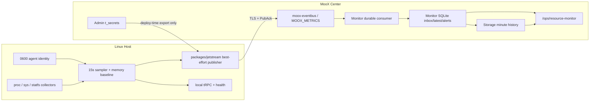

# MooX Host Agent、EventBus 凭据与资源监控实施计划

> **状态：已完成，历史实施计划。** 当前架构以 [主机监控架构设计](../../主机监控架构设计.md) 为准；后续 direct-storage 与 Admin 清理已经替代本文的阶段性 SQLite 和兼容入口描述。

> **For agentic workers:** REQUIRED SUB-SKILL: Use superpowers:subagent-driven-development (recommended) or superpowers:executing-plans to implement this plan task-by-task. Steps use checkbox (`- [ ]`) syntax for tracking.

**Goal:** 在 MooX 中新增可独立部署的 Linux `moox-host-agent`，采集服务器 CPU、内存、文件系统、磁盘 I/O 和网络数据，通过统一 MooX EventBus 上报，由 `moox-monitor` 消费、展示、告警并保存历史。

**Architecture:** Host Agent 每 15 秒读取 Linux `/proc`、`/sys` 和 `statfs`，构造 `HostMetric`，再包装成标准 `MooxMessage`，通过 `packages/jetstream` 向 EventBus 做一次 best-effort 发布。Host Agent 不使用 SQLite、不保存 outbox、不补发旧样本；Monitor 使用 durable consumer，将样本直接写入 Storage 并维护内存 latest。公网连接使用 NATS 用户名和共享 `eventbus_token`，凭据由部署流程生成并写入普通用户的 `0600` 文件。

**Tech Stack:** Go 1.24、tRPC-Go、Protocol Buffers、`packages/messagepb`、`packages/jetstream`、NATS JetStream、`golang.org/x/sys/unix`、Monitor SQLite 控制面、MooX Storage 时序数据面、Vue 3、Arco Design、VChart、Linux user systemd。

**Updated:** 2026-07-11。本版本替代文档原有的 bootstrap/acquire、HTTP 上报、Host Agent SQLite outbox、BYO NATS、`HostMetricEnvelope` 和逐 Agent 凭据设计。

### 执行进度（2026-07-11）

- 已完成：EventBus 服务、共享 JetStream client、固定 topic/consumer registry、TLS/ACL 配置、Admin `t_secrets` 凭据生成/导出/轮换，以及中央发布脚本接入。
- 已完成：`modules/hostagent` Linux amd64/arm64 采集、稳定 identity、tRPC/health、best-effort HostMetric 发布和 rootless Skill 发布部署。
- 已完成：Monitor HostMetric durable consumer、Storage 四 Dataset 直接写入、内存 latest、全局主机 API、页面 API 迁移和 metadata/release/deploy gate。
- 已完成：Admin 旧 Node Exporter 采集、Monitor RPC、配置、Schema 和部署行已全部删除；Admin 只保留网关和 SysDeploy 路由。
- 已完成：Storage 分钟级历史、72 小时 bounded retention、资源告警规则缓存，以及页面 unavailable、零值和历史缺口展示。
- 告警规则决策已补充：Monitor 启动时加载 enabled Host rules 到现有 `github.com/mooyang-code/snapshotcache`，消费链路只读内存缓存；规则新增/修改/删除不主动刷缓存，统一定时刷新，失败时保留上一份有效快照。

---

## 1. 实施前代码事实与前置依赖

> 本节保留立项时的代码快照，用于解释实施动机，不代表当前仓库状态。

- 当前仓库还没有 `modules/hostagent`、`modules/eventbus`、`packages/messagepb`、`packages/jetstream` 或 `packages/hostmetricpb`。
- [MooX EventBus 服务执行计划](./2026-07-10-moox-eventbus-service.md) 负责 `MooxMessage`、共享 JetStream client、EventBus 服务、Stream/KV 和公共部署能力，但不是整份计划单向前置：固定顺序为 EventBus Tasks 1-6 -> 本计划 Tasks 2-3 -> EventBus Task 7 -> 本计划 Task 4；EventBus Tasks 8-12 再按其计划推进。
- `modules/monitor` 已是独立 tRPC 进程，使用 GORM + SQLite，已有检查、结果、告警、webhook、peer 和 SysDeploy 同步能力。
- `/ops/resource-monitor` 当前仍调用 Admin 旧 `monitor` API；历史查询支持 `1h`、`24h`、`7d`，实时卡片每 5 秒刷新。
- Admin 仍通过旧资源监控代码直接访问 node_exporter；页面迁移并完成影子比较后才能删除旧采集链路。
- Admin 已有 `t_secrets` 和 AES-GCM 加密 DAO，但生产缺少加密根密钥时仍可能使用开发默认 key；本计划必须改成生产 fail closed。
- `scripts/build.sh`、`scripts/release.sh` 和 `scripts/deploy-moox.sh` 负责中央 MooX；Host Agent 是独立制品，发布和远端部署入口按用户要求放入 `skills/moox/scripts`。
- 上游 node_exporter 只作为 Linux 指标语义参考。本项目不 vendor、不 import、不复制其 collector 实现或测试 fixture。

## 2. 锁定决策

| 主题 | 决策 |
|---|---|
| 模块与进程 | 新建 `modules/hostagent`，二进制为 `moox-host-agent` 和 `moox-host-agent-cli`，可独立发布部署。 |
| 平台 | V1 只支持 Linux amd64/arm64，`CGO_ENABLED=0`；其他 OS/架构明确拒绝。 |
| 采集范围 | 只做 CPU、内存、文件系统容量、磁盘 I/O、网络；不做进程、容器、GPU、systemd、硬件传感器或 textfile collector。 |
| 采集实现 | 重新实现所需 Linux ABI reader/parser；不复制 node_exporter 源码。 |
| 调度 | 默认 15 秒；本地 scheduler 直接调用 collector，不通过本机 tRPC/HTTP 自调用。 |
| 本地 API | tRPC 只提供 `GetStatus`、`GetSnapshot`、`RunOnce`；本地 health/tRPC 默认只监听 loopback。 |
| 传输 | 只有 `packages/jetstream -> moox-eventbus` 一条上报链路；不提供 Host Agent HTTP 上报、Admin report proxy 或原生 `nats.go` 备选模式。 |
| Topic | 所有主机样本只发布到 `moox.metrics.host.reported.v1`。 |
| 系统空间 | 所有消息固定 `space_id=moox_system`；Host Agent 不配置 space。主机数据、告警、事件和通知在所有管理台 Space 中共享可见。 |
| Agent 身份 | 首次启动生成 UUID 并原子保存为稳定 `agent_id`；Monitor 收到第一条合法消息时自动注册。 |
| 消息标识 | 每次采样生成 UUIDv7 作为 `MooxMessage.message_id`；不使用 `generation_id`、epoch 或 sequence allocator。 |
| HostMetric | `HostMetric` 只有 `HostSnapshot snapshot`；身份、时间、空间、版本和消息 ID 全在 `MooxMessage`。 |
| 类型版本 | Go/protobuf 类型不带 `V1`；Topic、`protocol_version`、Dataset ID 等显式兼容边界可以保留版本。 |
| 字段命名 | 删除 `agent_git_commit`、`configured_interval_millis`、`observed_elapsed_millis` 和 checksum；需要毫秒字段时使用 `_ms`。 |
| Agent 可靠性 | best effort。Host Agent 不使用 SQLite/outbox，不重试旧样本；发布失败或 PubAck 超时后丢弃当前样本。 |
| Rate baseline | CPU、磁盘和网络 baseline 只驻留内存；重启后首个 rate 样本标记 unavailable。 |
| EventBus 可靠性 | PubAck 之前允许丢失；PubAck 之后由 JetStream durable consumer 和 Monitor 幂等处理保证至少一次消费。 |
| EventBus TLS | 公网 NATS 必须使用长期私有 CA 和含公网 IP SAN 的服务端证书；禁止明文公网 NATS、`insecure_skip_verify` 和 TOFU。 |
| NATS 身份 | 所有 Host Agent 共用一个 `eventbus_token`；Monitor 使用单独 `monitor_eventbus_token`。两者是固定用户名对应的独立高熵 password。 |
| ACL | Host Agent 只能发布固定 Host Topic 并接收 PubAck；Monitor 只能 bind/pull/ACK 固定 durable consumer，并按需发布 DLQ。 |
| 凭据存储 | 复用 Admin `t_secrets`，不增加 owner、purpose、revision、client type 或 client ID 列。 |
| 凭据寿命 | publisher/consumer token 不设置有效期，只有人工轮换或禁用才失效。 |
| 凭据生成 | 发布制品永不生成或携带真实凭据；首次部署生成 Admin 根密钥、私有 CA、服务端证书和六个 role token。普通升级全部复用。 |
| 轮换 | V1 不做双 token 并存。轮换前必须提示短暂中断和重新部署 Agent；失败期间样本允许丢失。 |
| Monitor owner | V1 部署只运行一个 active host-metrics ingest owner，不实现 lease/fencing 或多 Monitor active-active；手工启动第二个 consumer 属于不支持配置。 |
| 历史与 UI | Monitor 保存 inbox/latest/alert 状态，MooX Storage 保存分钟级历史；主机历史最多保留 3 天，过期数据直接丢弃；UI 保留 `/ops/resource-monitor` 并改读 Monitor。 |
| 告警规则缓存 | Host 告警消费路径禁止逐条查询 SQLite；使用已有 `github.com/mooyang-code/snapshotcache` 缓存规则快照，配置变更不主动失效，统一后台周期刷新，失败时保留上一份快照。 |
| Skill 入口 | Host Agent 发布部署、EventBus 凭据生成/导出/轮换脚本放在 `skills/moox/scripts`，并更新 `skills/moox/SKILL.md` 与 references。 |

## 3. 范围与非目标

### V1 必须交付

- Linux 主机身份、CPU、内存、文件系统容量、磁盘 I/O 和网络采集。
- 进程内 counter baseline、不可变最新快照和单次 best-effort EventBus 发布。
- 标准 `HostMetric` payload、`MooxMessage` 映射、固定 Topic 和 `moox_system` 空间。
- Admin `t_secrets` 中六个 EventBus role token、两个 TLS bundle、幂等 provision/export/rotate CLI 和生产加密根密钥门禁。
- EventBus 私有 CA TLS、六个隔离 NATS role、最小 ACL、`MOOX_METRICS` Topic registry 和固定 Monitor durable consumer。
- Monitor 自动注册、inbox 去重、latest、分钟历史、资源告警、查询 API 和全局 Space 语义。
- 资源监控页面迁移、旧 Admin collector 影子比较和删除。
- 中央 EventBus/Monitor 发布调整，以及 Host Agent linux/amd64、linux/arm64 独立制品和普通用户部署。

### V1 明确不做

- Windows、macOS、BSD、容器/cgroup、进程、GPU、eBPF、PromQL、Prometheus exposition 或 remote-write。
- Host Agent SQLite、outbox、旧样本补发、离线队列、exactly-once 或无限无损缓存。
- Host Agent 到 Admin 的 bootstrap/client token/acquire API。
- Host Agent HTTP 上报、Admin 转发、Monitor HTTP ingress、BYO Broker 或第二种 report mode。
- 每 Agent NATS 用户、强 Agent 身份证明或 broker subject 中嵌入 `agent_id`。
- JWT/operator、NKey、mTLS、Auth Callout、短期 token 或自动 token 续期。
- 公开 CA/ACME 自动续期；本计划使用私有 CA。
- 多 Monitor active-active、自动 leader election、EventBus 多节点生产集群上线。
- root systemd、自动 sudo、自动启用 linger、自动修改目标机系统 nginx/firewall。

## 4. 总体架构



### 边界

- Host Agent 只 import `packages/jetstream`，不得 import `nats.go` 或 `nats-server/v2`。
- EventBus 是 Stream、durable consumer 和 NATS listener 的唯一 owner；Monitor 不修改 Stream retention。
- Admin 是 EventBus 安全材料事实源，但不在运行时代理 Host Agent 数据，也不在 Agent 启动时下发 token。
- `moox_system` 的全局可见仅由 Monitor 的主机监控 API 实现；不得修改 Admin/Storage 的通用 Space 隔离规则。
- `moox_system` 全局可见不包含 secret 明文；EventBus 凭据只通过部署 CLI 写入受限文件。

## 5. 协议与指标契约

### 5.1 HostMetric payload

共享 payload 放在 `packages/hostmetricpb`，供 Host Agent 和 Monitor 同时依赖：

```protobuf
syntax = "proto3";

package trpc.moox.hostagent;

option go_package = "github.com/mooyang-code/moox/packages/hostmetricpb;hostmetricpb";

message HostMetric {
  HostSnapshot snapshot = 1;
}

message HostSnapshot {
  CpuMetric cpu = 1;
  MemoryMetric memory = 2;
  repeated FilesystemMetric filesystems = 3;
  repeated DiskMetric disks = 4;
  repeated NetworkMetric networks = 5;
  repeated CollectorStatus collectors = 6;
}

message CpuMetric {
  uint32 logical_cores = 1;
  double usage_percent = 2;
  bool usage_available = 3;
}

message MemoryMetric {
  uint64 total_bytes = 1;
  uint64 used_bytes = 2;
  uint64 available_bytes = 3;
  double usage_percent = 4;
}

message FilesystemMetric {
  string device = 1;
  string mountpoint = 2;
  string fs_type = 3;
  uint64 total_bytes = 4;
  uint64 used_bytes = 5;
  uint64 available_bytes = 6;
  double usage_percent = 7;
  bool read_only = 8;
}

message DiskMetric {
  string device = 1;
  uint64 read_bytes_total = 2;
  uint64 write_bytes_total = 3;
  uint64 read_ops_total = 4;
  uint64 write_ops_total = 5;
  uint64 io_time_ms_total = 6;
  double read_bytes_per_second = 7;
  double write_bytes_per_second = 8;
  double read_iops = 9;
  double write_iops = 10;
  double utilization_percent = 11;
  bool rate_available = 12;
}

message NetworkMetric {
  string device = 1;
  string operstate = 2;
  uint64 receive_bytes_total = 3;
  uint64 transmit_bytes_total = 4;
  uint64 receive_errors_total = 5;
  uint64 transmit_errors_total = 6;
  uint64 receive_dropped_total = 7;
  uint64 transmit_dropped_total = 8;
  double receive_bytes_per_second = 9;
  double transmit_bytes_per_second = 10;
  bool rate_available = 11;
}

message CollectorStatus {
  string collector = 1;
  bool success = 2;
  string error = 3;
}
```

字段单位和不变量也属于 wire contract：`*_bytes*` 为 bytes，`*_ms*` 为 milliseconds，`*_per_second`/IOPS 为每秒 rate，percent 为 `[0,100]`。totals 是 Linux kernel 暴露的累计 counter；rate 在 `rate_available=false` 时固定写 `0`。CPU 的 `usage_percent` 在 `usage_available=false` 时固定写 `0`。所有 repeated entity 按 device/mountpoint 稳定排序且 key 唯一；`CollectorStatus.error` 截断到 512 bytes，不能包含 secret、原始文件内容或 credential path。

Descriptor contract test 必须断言：

- `HostMetric` 只有 field 1 `snapshot`。
- 类型名为 `HostSnapshot`，不存在 `HostSnapshotV1`。
- 上述八个 message 的每个字段名、类型、cardinality 和 field number 完全一致；任何 rename/renumber/remove 都必须新开协议讨论，不能静默改 wire contract。
- payload 不含 `sample_id`、`agent_id`、`generation_id`、`boot_id`、`sequence`、`space_id`、时间、版本、checksum 或 interval 字段。

### 5.2 MooxMessage 映射

| MooxMessage 字段 | Host Agent 值 |
|---|---|
| `protocol_version` | `1` |
| `message_id` | 每次采样新建 UUIDv7 |
| `topic` | `moox.metrics.host.reported.v1` |
| `kind` | `MESSAGE_KIND_SNAPSHOT` |
| `producer.service_name` | `moox-host-agent` |
| `producer.instance_id` | 稳定 `agent_id` |
| `producer.node_id` | hostname，仅作展示元数据 |
| `producer.boot_id` | `/proc/sys/kernel/random/boot_id` |
| `producer.version` | Agent release version |
| `space_id` | `moox_system` |
| `sequence` | `0` |
| `occurred_at` | 本次采集完成时间，UTC |
| `published_at` | 本次唯一发布尝试开始时间，UTC |
| `content_type` | `application/x-protobuf; message=trpc.moox.hostagent.HostMetric` |
| `payload` | deterministic protobuf `HostMetric` bytes |
| `trace` | 本地周期采样为空；人工 `RunOnce` 可透传 trace |
| `attributes` | V1 为空 |

NATS transport 固定：

```text
Subject:      moox.metrics.host.reported.v1
Nats-Msg-Id:  MooxMessage.message_id
Content-Type: application/vnd.moox.message+protobuf
```

### 5.3 Linux 指标语义

| 指标 | 语义 |
|---|---|
| CPU | `/proc/stat` aggregate；total 排除 guest/guest_nice，idle 包含 iowait；counter delta 不可用时 `usage_available=false`。 |
| Memory | `used = MemTotal - MemAvailable`；缺少 `MemAvailable` 时用 `MemFree + Buffers + Cached + SReclaimable - Shmem` 并 clamp。 |
| Filesystem | `/proc/self/mountinfo` + `statfs`；`available=bavail*bsize`，`used=total-available`；默认排除网络和用户态文件系统。 |
| Disk | `/proc/diskstats`；sector 固定 512 bytes；通过 sysfs 默认排除 partition；输出 totals 和 rate。 |
| Network | `/proc/net/dev` totals/rate，`/sys/class/net/<dev>/operstate` 为可选状态。 |
| Rate elapsed | 使用进程内 `CLOCK_BOOTTIME` baseline；boot 变化、counter 回退、elapsed<=0 或进程首次采集时 rate unavailable。 |

纯 parser 使用 fixture 单测；只有真实 `statfs`、`CLOCK_BOOTTIME` 和系统访问器使用 Linux build tag。

## 6. EventBus 安全与凭据契约

### 6.1 `t_secrets` 固定记录

不增加任何列。新增 `eventbus` category，并用现有字段表达完整 EventBus 安全材料：

| `c_key_id` | `c_secret_type` | `c_secret_value` |
|---|---|---|
| `eventbus_hostagent_publisher` | `token` | 32-byte 随机共享 `eventbus_token` |
| `eventbus_monitor_consumer` | `token` | 独立 32-byte `monitor_eventbus_token` |
| `eventbus_internal_admin` | `token` | EventBus reconciliation 专用 token |
| `eventbus_storage` | `token` | Storage 专用 token |
| `eventbus_cloudnode` | `token` | CloudNode 专用 token |
| `eventbus_factor` | `token` | Factor 专用 token |
| `eventbus_tls_ca` | `certificate` | CA certificate + encrypted private key bundle |
| `eventbus_tls_server` | `certificate` | server certificate + encrypted private key bundle |

八行统一：

```text
c_space_id   = moox_system
c_category   = eventbus
c_provider   = moox_eventbus
c_status     = active
c_is_deleted = 0
```

增加 partial unique index，保证每个 active `(space_id, category, provider, key_id)` 只有一行。`c_extra_config` 只放公网 IP、证书 serial、fingerprint 和非敏感路径，不放 token/private key。

通用 Secret 页面可以显示脱敏元数据，但 `provider=moox_eventbus` 的行不能通过普通 Create/Update/Delete/Reveal 修改或获取明文；只有部署专用 Admin CLI 能 ensure、export 和 rotate。

### 6.2 私有 CA TLS

- 首次部署生成长期私有 CA 和含 EventBus advertised public IP、`127.0.0.1`、`::1` SAN 的 server certificate。
- 默认 CA 有效期 10 年，server certificate 有效期 5 年；到期前通过运维提示人工 reissue，不依赖 ACME。
- 公网 IP 变化只重签 server certificate，正常情况下复用同一 CA。
- EventBus 运行时读取 server cert/key 和 CA cert；Host Agent/Monitor 只获得 CA cert，不获得 CA private key。
- 客户端必须用 `tls://<public-ip>:4222`，验证私有 CA、有效期和 IP SAN。
- 配置和代码中不存在 `insecure_skip_verify`、自定义跳过 hostname/IP 校验或 TOFU 开关。
- loopback test/dev 可以显式关闭 TLS；任意 non-loopback bind/URL 在 TLS 或 auth 缺失时必须启动失败。

### 6.3 NATS role 与 ACL

固定用户名：

```text
hostagent-publisher
monitor-hostmetrics-consumer
```

Host Agent role：

- allow publish `moox.metrics.host.reported.v1`；
- allow subscribe 自己的 `_INBOX.>` 以接收 PubAck；
- deny 其他 `moox.>` publish/subscribe；
- deny Stream、consumer、KV 管理 API。

Monitor role：

- allow bind/info/pull/ACK durable `monitor_hostmetrics_ingest_v1`；
- allow `_INBOX.>` reply；
- allow publish `moox.dlq.message.rejected.v1`；
- deny其他 Stream/consumer/KV 和业务 Topic。

EventBus 还要求 `eventbus-internal-admin`、`storage-eventbus`、`cloudnode-eventbus`、`factor-eventbus` 四个内部 role；其 ACL 在 EventBus companion plan 和各迁移任务中锁定。Host Agent/Monitor 不得复用这些 token。

ACL 必须启动真实测试 broker 做 allow/deny 验证，不能只测 YAML parser。

### 6.4 共享 token 的已知边界

共享 publisher token 只能证明“调用方持有 MooX Host Agent publisher credential”，不能证明具体 `agent_id`。任一泄漏 token 的主机都能伪造另一个 Agent 的 `producer.instance_id`。V1 接受该风险；Monitor 的一致性校验用于防误配，不宣称强身份认证。

### 6.5 轮换

- 普通升级只读取和复用现有八行，不自动更新。
- publisher token 轮换前提示：旧 Agent 会立即上报失败，需批量重新部署凭据，期间样本直接丢失。
- Monitor token 独立轮换；Monitor 暂停期间 JetStream 已接收消息继续保留。
- V1 不做 old/new 双 token grace。
- CA 或 server key 轮换必须显式执行、备份 Admin DB/根密钥并重新部署信任材料。

## 7. Host Agent 运行时契约

### 7.1 文件布局

```text
$HOME/.config/moox/hostagent/app.yaml
$HOME/.config/moox/hostagent/eventbus.yaml       # 0600
$HOME/.config/moox/hostagent/ca.pem              # 部署生成的 CA 公钥证书
$HOME/.local/state/moox/hostagent/identity.yaml  # 0600
```

`identity.yaml`：

```yaml
version: 1
agent_id: 0190f4d0-7b1c-7f45-9a3e-7c28f6479a73
created_at: 2026-07-11T00:00:00Z
```

首次启动在 `0700` parent 中以 `0600` temp file、`fsync`、atomic rename 生成；后续重启复用。文件损坏、symlink、owner 不符或权限不符时 fail closed，不能静默生成新身份。用户明确删除身份文件后，下一次启动生成新 Agent，Monitor 将其视为新主机。

`eventbus.yaml`：

```yaml
version: 1
urls:
  - tls://203.0.113.10:4222
username: hostagent-publisher
eventbus_token: ""
ca_file: $HOME/.config/moox/hostagent/ca.pem
```

Host Agent loader 将 `eventbus_token` 映射为 `packages/jetstream.Config.Password`。发布包中的 example token 必须为空。真实文件由部署工具原子写入，不能通过 CLI 参数、环境变量、日志或进程参数传 token。

### 7.2 best-effort 调度与发布

```text
timer tick
  -> collect once
  -> update immutable in-memory latest snapshot
  -> build HostMetric + MooxMessage
  -> one bounded packages/jetstream.Publish call
  -> PubAck: record success in memory
  -> error/timeout: increment in-memory dropped counter and discard
```

- 不存在 SQLite、outbox、dispatcher、replay、lease、backoff row 或磁盘历史。
- `packages/jetstream` 对 Host Agent 禁用离线 publish reconnect buffer，避免形成隐藏 outbox。
- 连接可以在后台重新建立，但旧样本不得跨采样周期补发。
- scheduler 保证 single-flight；上一轮未结束时跳过新 tick 并增加 `skipped_samples`。
- 部分 collector 失败仍发布其余有效指标；identity、CPU 或 memory 失败时整次不发布。
- PubAck timeout 后即使 EventBus 实际已收到也不重试；Monitor 仍按 `message_id` 幂等。

### 7.3 本地状态

`GetStatus`/health 只展示内存状态：

- `agent_id`、version、hostname、boot ID；
- last collect/publish time 和结果；
- total collected/published/dropped/skipped；
- EventBus connected/degraded；
- collector status 和 bounded error；
- latest snapshot age。

不得返回 token、credential path 内容、CA private material 或完整 NATS URL 中的 userinfo。

## 8. Monitor 数据面

### 8.1 消费与校验

EventBus 预创建 durable `monitor_hostmetrics_ingest_v1`。Monitor 使用 `packages/jetstream` bind，不创建或修改 `MOOX_METRICS`。

每条消息校验：

- outer protocol、固定 Topic、SNAPSHOT kind、固定 content type；
- `space_id == moox_system`、`sequence == 0`；
- `producer.service_name == moox-host-agent`、非空 UUID agent ID、hostname、boot ID；
- UUIDv7 message ID、时间范围、payload/entity/string upper bounds；
- protobuf 可解析、无 NaN/Inf、百分比合法、totals 不超过 `math.MaxInt64`、entity key 唯一。

第一条合法消息在 Monitor SQLite transaction 中自动 upsert Agent registry。不存在手工 bootstrap/activate 注册流程。

### 8.2 Monitor SQLite

新增：

```text
t_monitor_host_agents
t_monitor_host_inbox
t_monitor_host_latest
t_monitor_host_history_outbox
t_monitor_host_alert_rules
t_monitor_host_alert_states
t_monitor_host_alert_events
t_monitor_host_notification_outbox
```

- inbox 以 `message_id` 唯一去重，保存 outer identity、stream sequence、payload hash、bounded raw bytes 和 `pending/projected` 状态。
- consumer transaction 只负责插入 inbox 和自动注册 Agent；commit 后 ACK。只有该 transaction 的临时 DB 错误才 NAK；Storage 错误发生在 ACK 后的本地 projector/outbox，不回退 consumer ACK。
- projector 在一个 SQLite transaction 中更新 latest/alert、upsert minute history outbox、写 notification outbox 并把 inbox 标为 projected；restart 后继续处理 pending inbox。
- history outbox 到 `bucket_end + 30s` 才可发送，Storage 成功后删除；失败按有界 backoff 重试。该中央 outbox 与已经取消的 Host Agent outbox 是不同边界。
- 确定性 poison message 发布 `dlqpb.RejectedMessage` 后 Term。
- registry 的 disabled/archived 只控制展示和告警，不是安全撤销；共享 token Agent 可换新 UUID 自动注册。
- V1 部署脚本和 SysDeploy 只配置一个 host-metrics consumer owner。V1 不实现分布式锁；若运维手工启动第二个相同 durable consumer，NATS 可能分流到不同 SQLite，该配置明确不受支持并在运维文档中告警。

SQLite 容量和清理策略固定如下：

- `MOOX_METRICS.max_age=24h`；projected inbox 默认保留 `48h`，配置校验要求不得短于 Stream max age，使 durable reset/重投窗口内仍可按 `message_id` 去重。
- cleaner 每小时运行，单次每张表最多删除 500 行并循环让出写锁；只删除 projected inbox，绝不删除 pending inbox。
- inbox 默认上限为 200,000 行或 512 MiB bounded raw bytes。任一上限触发后，新的 inbox transaction 返回 overload 并 NAK，不继续扩大 SQLite；readiness/metrics 必须显示 backlog 和最老 pending age。消息最终可能因 Stream `24h` retention 过期而形成可见 gap，符合指标允许丢失的边界。
- `t_monitor_host_alert_events` 默认保留 3 天并按 500 行批量清理。Agent registry、latest 和告警规则不按时间自动删除；只能通过 archive/delete 运维动作处理。
- history outbox 默认 `max_rows=100000`、`max_bytes=256 MiB`、`max_age=3d`；notification outbox 默认 `max_rows=10000`、`max_bytes=32 MiB`、`max_age=24h`，重试 backoff 最大 5 分钟。成功项立即删除。
- outbox 到达 rows/bytes cap 时丢弃本次新 history candidate/notification request；超过 max age 时 cleaner 分批丢弃最老 pending 项。两种情况都写 structured warning 和固定低基数 label 的 Prometheus counter。projector 仍在同一 transaction 更新 latest/alert 并把 inbox 标为 projected，不能因中央 best-effort outbox 满而把压力转移到 pending inbox。

### 8.3 历史和告警

- Monitor latest 和资源告警保持收到样本的粒度。
- Storage 使用 UTC minute bucket，在 `bucket_end + 30s` 前保留该分钟最后收到的样本；Dataset 行和 Monitor 历史均由 cleaner 按 3 天 retention 分批删除，删除失败不影响实时 latest。
- Dataset ID 保持显式外部版本：`host_resource_v1`、`host_fs_v1`、`host_disk_v1`、`host_net_v1`。
- 四个 Dataset 都是 `DATA_KIND_TIME_SERIES`、`freq=1m`、`space_id=moox_system`、`subject_id=agent_id`，`data_time=bucket_start UTC`。同一 key 重写只更新该分钟最终样本。
- 历史缺口是合法状态；Host Agent best-effort 不承诺连续时间序列。
- CPU、内存、文件系统、磁盘和网络阈值告警规则、事件和通知统一属于 `moox_system`。

逻辑 seed 的 dimensions/columns 固定：

| Dataset | dimensions | columns |
|---|---|---|
| `host_resource_v1` | 无 | `logical_cores`、`cpu_usage_percent`、`cpu_usage_available`、`memory_total_bytes`、`memory_used_bytes`、`memory_available_bytes`、`memory_usage_percent` |
| `host_fs_v1` | `device` + `mountpoint` | `device`、`mountpoint`、`fs_type`、`total_bytes`、`used_bytes`、`available_bytes`、`usage_percent`、`read_only` |
| `host_disk_v1` | `device` | 第 5.1 节 `DiskMetric` 的全部字段，除 dimension `device` 外字段名保持一致 |
| `host_net_v1` | `device` | 第 5.1 节 `NetworkMetric` 的全部字段，除 dimension `device` 外字段名保持一致 |

bytes/totals 使用 `INT`，percent/rate/IOPS 使用 `DOUBLE`，available/read-only 使用 `BOOL`，entity/operstate/fs type 使用 `STRING`。dimensions 必须来自已通过 payload validator 的原始 entity key，不能用数组下标；Monitor SQLite registry 保留已见 entity key，历史查询据此构造 exact Storage keys。local-route seed 为四个 Dataset 各建 wildcard subject route；不为每个动态 Agent 生成 metadata Subject/route。

### 8.4 全局 Space API

- 只有主机监控相关 Monitor RPC/HTTP adapter 忽略 UI 当前 Space，并在服务内部强制使用 `moox_system`。
- Admin gateway、Storage 通用 API 和其他 Monitor checks 继续使用正常 Space 隔离。
- UI Space 切换不清空或切换主机列表、历史和告警。
- Secret 页面不因该规则暴露 EventBus secret value。

## 9. 发布与部署契约

### 9.1 发布和部署边界

- `scripts/release.sh` 和 Host Agent release 只生成二进制、空配置模板、文档、unit 和 checksums。
- release archive、git、日志、命令行、health、SQLite、JetStream headers 中不得出现 token、Admin encryption key、CA private key 或 server private key。
- 真实安全材料只在部署阶段生成。
- fresh install 同时缺少 Admin DB 和根密钥时，部署工具生成根密钥并写 `0600` 文件。
- Admin DB 已存在但根密钥缺失时必须失败，禁止生成新 key 破坏已有密文。
- 普通升级复用全部凭据和 JetStream data；`--reset-data` 不能删除 Admin DB、EventBus data 或 credential directory。

中央运行时文件固定放在部署普通用户目录，不放进 release tree：

```text
$HOME/.config/moox/credentials/admin-encryption-key  # 0600
$HOME/.config/moox/eventbus/users.yaml               # 0600
$HOME/.config/moox/eventbus/internal-admin.yaml      # 0600
$HOME/.config/moox/eventbus/tls/ca.pem               # 0600
$HOME/.config/moox/eventbus/tls/server.pem           # 0600
$HOME/.config/moox/eventbus/tls/server-key.pem       # 0600
$HOME/.config/moox/credentials/hostagent-publisher.yaml # 0600
$HOME/.config/moox/monitor/eventbus.yaml              # 0600
$HOME/.config/moox/storage/eventbus.yaml              # 0600
$HOME/.config/moox/cloudnode/eventbus.yaml            # 0600
$HOME/.config/moox/factor/eventbus.yaml               # 0600
```

这些文件是 Admin `t_secrets` 的运行时导出副本；`t_secrets` 仍是事实源。部署工具用临时目录、`fsync` 和 atomic rename 更新，禁止 symlink 和 owner 不符文件。

六个 client role 文件的读取者和字段固定：

| 文件 | username | token 字段 | 唯一读取者 |
|---|---|---|---|
| `eventbus/internal-admin.yaml` | `eventbus-internal-admin` | `token` | `moox-eventbus` 内嵌 reconciliation client |
| `credentials/hostagent-publisher.yaml` | `hostagent-publisher` | `eventbus_token` | `skills/moox/scripts/hostagent-deploy.sh`，只作为远端分发源 |
| `monitor/eventbus.yaml` | `monitor-hostmetrics-consumer` | `monitor_eventbus_token` | `moox-monitor` |
| `storage/eventbus.yaml` | `storage-eventbus` | `token` | Storage Access/View Builder |
| `cloudnode/eventbus.yaml` | `cloudnode-eventbus` | `token` | `moox-cloudnode` |
| `factor/eventbus.yaml` | `factor-eventbus` | `token` | `moox-factor` |

每个文件还包含 `version: 1`、role 对应的 `username`、`urls` 和 `ca_file`；中央服务使用 `tls://127.0.0.1:4222`，Host Agent 分发源使用 `tls://<public-ip>:4222`。loader 只把各自 token 字段映射为 `packages/jetstream.Config.Password`。`users.yaml` 只由 broker 读取；Host Agent 分发源不由任何中心服务加载，也不得进入 release/stage/stdout。远端 Host Agent 最终仍写入第 7.1 节的 `~/.config/moox/hostagent/eventbus.yaml`。

### 9.2 Skill 内权威入口

```text
skills/moox/scripts/eventbus-credentials.sh
skills/moox/scripts/hostagent-release.sh
skills/moox/scripts/hostagent-deploy.sh
skills/moox/scripts/test-hostagent-release.sh
skills/moox/scripts/test-hostagent-deploy.sh
skills/moox/references/host-agent.md
```

同时修改：

```text
skills/moox/SKILL.md
skills/moox/references/build.md
skills/moox/references/release.md
```

`SKILL.md` frontmatter description 必须显式包含 Host Agent、服务器资源监控、Linux amd64/arm64、rootless deployment、EventBus credential provision/rotate 等触发词。

### 9.3 Host Agent 制品

```text
release/moox-host-agent-<version>-linux-<arch>.tar.gz
  bin/moox-host-agent
  bin/moox-host-agent-cli
  config/app.example.yaml
  config/eventbus.example.yaml
  config/trpc_go.yaml
  systemd/user/moox-host-agent.service
  README.md
  THIRD_PARTY_NOTICES.md
  SHA256SUMS
```

远端目录：

```text
~/.local/lib/moox/hostagent/releases/<version>-linux-<arch>/
~/.local/lib/moox/hostagent/current -> releases/<version>-linux-<arch>/
~/.local/state/moox/hostagent/identity.yaml
~/.config/moox/hostagent/eventbus.yaml
~/.config/moox/hostagent/ca.pem
~/.config/systemd/user/moox-host-agent.service
```

- 部署脚本自动探测 `linux/amd64` 或 `linux/arm64`，拒绝其他目标。
- 只使用 `systemctl --user`，拒绝 UID 0，不调用 sudo。
- 目标机必须已有可用 user manager；linger 由用户/运维预先处理。
- 升级原子切换 `current` symlink，保留前一 release 用于 rollback。
- 部署验收包含本地 health、`RunOnce`、TLS/ACL 和 PubAck；不要求旧样本补发。

## 10. 里程碑

| 里程碑 | Tasks | 退出条件 |
|---|---|---|
| M1 EventBus 前置 | 1-4 | 共享协议/client、凭据、固定 Topic、TLS 和六个隔离 role ACL 可用。 |
| M2 Agent 本地能力 | 5-8 | 双架构 collector、身份文件、内存 baseline 和 best-effort publish 通过。 |
| M3 Monitor 数据面 | 9-11 | 自动注册、幂等消费、历史、告警、API 和 UI 通过。 |
| M4 发布上线 | 12-13 | 中央发布、Skill 内凭据/Agent 发布部署和 E2E 门禁通过。 |

---

### Task 1: 验收 EventBus Tasks 1-6 公共前置

**Owner:** [MooX EventBus 服务执行计划](./2026-07-10-moox-eventbus-service.md) Tasks 1-6。本 Task 不创建、不修改、不提交 EventBus 文件。

**Files:**
- Use (owned by EventBus plan): `packages/messagepb/*`
- Use (owned by EventBus plan): `packages/jetstream/*`
- Use (owned by EventBus plan): `modules/eventbus/*`

- [ ] **Step 1: 先执行 EventBus Tasks 1-6**

必须完成其 `MooxMessage` descriptor、shared client、broker/config、registry、read-only management 和 readiness；不能在本计划中复制一套实现。

- [ ] **Step 2: 验收本计划所需 contract**

断言 shared client 支持严格 `BindPullConsumer`、受限 `EnsurePullConsumer`、KV bind/CAS、可持久化 delivery token ACK，以及 TLS/auth、PubAck、Topic/Subject、duplicate/redelivery 和 `ReconnectBufferBytes=0`。本计划的 Host Agent 只使用 Publish；Monitor 只使用 bind/pull。

- [ ] **Step 3: 记录 gate 证据，不创建空提交**

```bash
go test -count=1 ./packages/messagepb ./packages/jetstream ./modules/eventbus/...
./scripts/check-module-boundaries.sh
```

### Task 2: 定义共享 HostMetric payload 和 Host Agent tRPC

**Files:**
- Create: `packages/hostmetricpb/go.mod`
- Create: `packages/hostmetricpb/Makefile`
- Create: `packages/hostmetricpb/host_metric.proto`
- Generate: `packages/hostmetricpb/host_metric.pb.go`
- Create: `packages/hostmetricpb/contract_test.go`
- Create: `modules/hostagent/go.mod`
- Create: `modules/hostagent/proto/hostagent.proto`
- Create: `modules/hostagent/proto/Makefile`
- Create: `modules/hostagent/proto/hostagentgen/go.mod`
- Generate: `modules/hostagent/proto/hostagentgen/hostagent.pb.go`
- Generate: `modules/hostagent/proto/hostagentgen/hostagent.trpc.go`
- Create: `modules/hostagent/proto/hostagentgen/contract_test.go`
- Create: `modules/hostagent/README.md`
- Create: `modules/hostagent/THIRD_PARTY_NOTICES.md`
- Modify: `go.work`
- Modify: `Makefile`

- [ ] **Step 1: 先写 descriptor tests**

逐一断言第 5.1 节八个 message 的字段名、类型、cardinality、field number 和单位约束；断言 `HostMetric` 只有 `snapshot=1`，所有结构不带 `V1`，不存在已删除字段。断言 `HostAgentMgr` 只有 `GetStatus`、`GetSnapshot`、`RunOnce`。

- [ ] **Step 2: 定义 payload 和本地 RPC**

本地 RPC response 可以引用 `hostmetricpb.HostSnapshot`；`RunOnceRsp` 返回 `message_id`、`published`、`publish_error`，不返回 token。

- [ ] **Step 3: 生成并加入 workspace**

```bash
make -C packages/hostmetricpb all
make -C modules/hostagent/proto all
go test -count=1 ./packages/hostmetricpb ./modules/hostagent/proto/hostagentgen
```

- [ ] **Step 4: 写第三方声明并提交**

`THIRD_PARTY_NOTICES.md` 记录 node_exporter、Apache-2.0、项目 URL 和“仅参考指标语义、未复制实现”。

```bash
git add packages/hostmetricpb modules/hostagent go.work Makefile
git commit -m "feat(hostagent): define host metric contracts"
```

### Task 3: 在 Admin `t_secrets` 中管理 EventBus 安全材料

**Files:**
- Modify: `modules/admin/schema/admin.sql`
- Modify: `modules/admin/internal/service/secret/rpc/service.go`
- Modify: `modules/admin/internal/service/secret/dao/secret.go`
- Create: `modules/admin/internal/service/secret/dao/eventbus.go`
- Create: `modules/admin/internal/service/secret/dao/eventbus_test.go`
- Create: `modules/admin/internal/service/secret/eventbus.go`
- Create: `modules/admin/internal/service/secret/eventbus_test.go`
- Modify: `modules/admin/internal/common/crypto/key.go`
- Create: `modules/admin/internal/common/crypto/key_test.go`
- Modify: `modules/admin/cmd/cli/main.go`
- Create: `modules/admin/cmd/cli/eventbus_credentials.go`
- Create: `modules/admin/cmd/cli/eventbus_credentials_test.go`
- Modify: `web/src/views/settings/secrets/index.vue`

- [ ] **Step 1: 写 schema 和幂等 ensure tests**

断言不增加 owner/purpose/revision/client 列；partial unique index 只约束 active EventBus key；六个 role token 和两个 TLS bundle 重复 ensure 返回现有值，不生成新值。

- [ ] **Step 2: 实现专用 EventBus credential service**

使用 `crypto/rand` 生成六个相互独立的 32-byte token；用标准 `crypto/x509` 生成 CA/server bundle；所有值继续走现有 AES-GCM `c_secret_value`。

- [ ] **Step 3: 增加 CLI 子命令**

```text
moox-admin-cli eventbus-credentials ensure --db-path ... --encryption-key-file ... --public-ip ...
moox-admin-cli eventbus-credentials export --role eventbus --output-dir ...
moox-admin-cli eventbus-credentials export --role hostagent --output-dir ...
moox-admin-cli eventbus-credentials export --role monitor --output-dir ...
moox-admin-cli eventbus-credentials export --role storage --output-dir ...
moox-admin-cli eventbus-credentials export --role cloudnode --output-dir ...
moox-admin-cli eventbus-credentials export --role factor --output-dir ...
moox-admin-cli eventbus-credentials rotate --credential internal-admin|hostagent-publisher|monitor-consumer|storage|cloudnode|factor|server-cert|ca --confirm
```

CLI 只向 stdout 输出结构化 metadata，不输出值；文件在 `0700` temp dir 中以正确权限原子写入。

- [ ] **Step 4: 收紧生产 Admin 根密钥**

生产只接受 `MOOX_ADMIN_ENCRYPTION_KEY_FILE` 或等价部署注入；DB 存在但 key 缺失时启动/CLI 均失败。固定开发 key 只允许 test/dev。

- [ ] **Step 5: 限制普通 Secret CRUD**

普通 UI/RPC 只显示 EventBus 行的脱敏 metadata；Create/Update/Delete/Reveal 拒绝 `provider=moox_eventbus`。

- [ ] **Step 6: 验证并提交**

```bash
go test -count=1 ./modules/admin/internal/service/secret/... ./modules/admin/internal/common/crypto ./modules/admin/cmd/cli
git add modules/admin web/src/views/settings/secrets/index.vue
git commit -m "feat(admin): manage eventbus security material"
```

### Task 4: 执行 EventBus Task 7 并验收安全部署

**Owner:** [MooX EventBus 服务执行计划](./2026-07-10-moox-eventbus-service.md) Task 7。本 Task 在本计划 Task 3 完成后执行，不重复修改或提交 EventBus/中央发布文件。

**Files:**
- Use (owned by EventBus plan): `modules/eventbus/config/app.yaml`
- Use (owned by EventBus plan): `modules/eventbus/internal/registry/*`
- Use (owned by EventBus plan): `scripts/build.sh`
- Use (owned by EventBus plan): `scripts/release.sh`
- Use (owned by EventBus plan): `scripts/deploy-moox.sh`
- Use (owned by EventBus plan): `scripts/test-deploy-moox-eventbus.sh`

- [ ] **Step 1: 执行 EventBus Task 7**

它只能调用本计划 Task 3 的 Admin credential CLI，并负责中央 EventBus build/release/deploy、users file、六个 role runtime files、TLS material、SysDeploy 和启动顺序；禁止另建 credential DAO/CLI。

- [ ] **Step 2: 验收 Host Topic 和 durable**

断言 `moox.metrics.host.reported.v1` 只属于 `MOOX_METRICS`，payload 只映射 `trpc.moox.hostagent.HostMetric`，durable 只为 `monitor_hostmetrics_ingest_v1`，Monitor 使用 bind-only。

- [ ] **Step 3: 验收 TLS、ACL 和 secret leakage**

覆盖 public bind 无 TLS/auth、users file 非 `0600`、symlink/owner 错误、错误 IP SAN、未知 CA、过期证书和 ACL 过宽。publisher exact Topic + PubAck 成功；Monitor fixed durable bind/pull/ACK/DLQ 成功；六个 role 的跨域/management 越权全部失败。

- [ ] **Step 4: 运行 gate，不创建空提交**

```bash
./scripts/test-deploy-moox-eventbus.sh
go test -count=1 ./modules/eventbus/internal/config ./modules/eventbus/internal/broker ./modules/eventbus/internal/registry ./packages/jetstream
```

### Task 5: 搭建 Host Agent 配置、身份文件和进程骨架

**Files:**
- Create: `modules/hostagent/config/app.yaml`
- Create: `modules/hostagent/config/trpc_go.yaml`
- Create: `modules/hostagent/config/eventbus.example.yaml`
- Create: `modules/hostagent/internal/config/config.go`
- Create: `modules/hostagent/internal/config/config_test.go`
- Create: `modules/hostagent/internal/identity/agent_id.go`
- Create: `modules/hostagent/internal/identity/agent_id_test.go`
- Create: `modules/hostagent/internal/identity/host_linux.go`
- Create: `modules/hostagent/internal/identity/host_test.go`
- Create: `modules/hostagent/cmd/server/main.go`
- Create: `modules/hostagent/cmd/cli/main.go`

- [ ] **Step 1: 写配置负向测试**

覆盖非 Linux、非 amd64/arm64、interval/timeout 非法、非 loopback RPC、可配置 space/topic、token 出现在 app YAML/env/CLI、credentials 权限错误和 insecure TLS 字段。

- [ ] **Step 2: 定义无 secret app config**

```yaml
agent:
  proc_root: /proc
  sys_root: /sys
  sample_interval: 15s
  collect_timeout: 8s
  publish_timeout: 5s
  identity_file: $HOME/.local/state/moox/hostagent/identity.yaml
  eventbus_credentials_file: $HOME/.config/moox/hostagent/eventbus.yaml
  rpc_addr: 127.0.0.1:11407
  health_addr: 127.0.0.1:11417
limits:
  max_payload_bytes: 2097152
  max_filesystems: 128
  max_disks: 128
  max_networks: 128
```

Topic 和 `moox_system` 是代码常量，不可配置。

- [ ] **Step 3: 实现安全身份文件**

测试首次并发启动只生成一个 UUID、restart 稳定、atomic rename、权限/owner/symlink/corrupt fail closed、显式删除后生成新 ID。

- [ ] **Step 4: 建立最小 server/CLI**

CLI 提供 `check-config`、`status`、`snapshot`、`run-once`；server 非 Linux 或不支持架构时给出明确错误。

- [ ] **Step 5: 验证双架构编译并提交**

```bash
go test -count=1 ./modules/hostagent/internal/config ./modules/hostagent/internal/identity
GOOS=linux GOARCH=amd64 CGO_ENABLED=0 go -C modules/hostagent build -o /tmp/moox-host-agent-amd64 ./cmd/server
GOOS=linux GOARCH=arm64 CGO_ENABLED=0 go -C modules/hostagent build -o /tmp/moox-host-agent-arm64 ./cmd/server
git add modules/hostagent
git commit -m "feat(hostagent): add standalone runtime and identity"
```

### Task 6: 实现 Linux CPU 和内存 collector

**Files:**
- Create: `modules/hostagent/internal/domain/snapshot.go`
- Create: `modules/hostagent/internal/collector/collector.go`
- Create: `modules/hostagent/internal/collector/cpu.go`
- Create: `modules/hostagent/internal/collector/cpu_test.go`
- Create: `modules/hostagent/internal/collector/memory.go`
- Create: `modules/hostagent/internal/collector/memory_test.go`
- Create: `modules/hostagent/internal/collector/clock_linux.go`
- Create: `modules/hostagent/internal/collector/testdata/proc/stat.before`
- Create: `modules/hostagent/internal/collector/testdata/proc/stat.after`
- Create: `modules/hostagent/internal/collector/testdata/proc/meminfo`

- [ ] **Step 1: 定义纯 collector 边界**

```go
type Collector interface {
    Name() string
    Collect(ctx context.Context, input Input) (PartialSnapshot, error)
}
```

collector 不访问数据库、不发布网络请求；文件读取和 clock 可注入。

- [ ] **Step 2: 写 CPU golden tests 并实现 parser**

覆盖 guest 排除、idle+iowait、zero delta、malformed、first sample unavailable、boot change 和 counter regression。

- [ ] **Step 3: 写 memory tests 并实现 parser**

覆盖 `MemAvailable`、fallback、kB 转 bytes、clamp、missing/zero MemTotal。

- [ ] **Step 4: 验证并提交**

```bash
go test -count=1 ./modules/hostagent/internal/collector -run 'CPU|Memory'
git add modules/hostagent/internal/domain modules/hostagent/internal/collector
git commit -m "feat(hostagent): collect cpu and memory metrics"
```

### Task 7: 实现文件系统、磁盘和网络 collector

**Files:**
- Create: `modules/hostagent/internal/collector/mountinfo.go`
- Create: `modules/hostagent/internal/collector/mountinfo_test.go`
- Create: `modules/hostagent/internal/collector/filesystem.go`
- Create: `modules/hostagent/internal/collector/filesystem_test.go`
- Create: `modules/hostagent/internal/collector/statfs_linux.go`
- Create: `modules/hostagent/internal/collector/diskstats.go`
- Create: `modules/hostagent/internal/collector/diskstats_test.go`
- Create: `modules/hostagent/internal/collector/netdev.go`
- Create: `modules/hostagent/internal/collector/netdev_test.go`
- Create: `modules/hostagent/internal/collector/testdata/proc/self/mountinfo`
- Create: `modules/hostagent/internal/collector/testdata/proc/diskstats.before`
- Create: `modules/hostagent/internal/collector/testdata/proc/diskstats.after`
- Create: `modules/hostagent/internal/collector/testdata/proc/net/dev.before`
- Create: `modules/hostagent/internal/collector/testdata/proc/net/dev.after`
- Create: `modules/hostagent/internal/collector/testdata/sys/*`

- [ ] **Step 1: 实现 mountinfo + statfs**

覆盖 Linux escapes、bind mount、重复项、default exclude、稳定排序、只读状态和单 mount 失败。禁止 shell out 到 `df`、`mount` 或 `lsblk`。

- [ ] **Step 2: 实现有界 filesystem worker**

固定 worker pool；单个不可取消 `statfs` 卡住时不为同一 mount 无限创建 goroutine，其他 collector 继续。

- [ ] **Step 3: 实现 diskstats**

覆盖 whole disk/partition、512-byte sector、sysfs partition 排除、counter reset、zero elapsed、totals/rates/IOPS/utilization。

- [ ] **Step 4: 实现 netdev**

覆盖 RX/TX totals、errors/drops、接口出现/消失、exclude、counter reset、operstate 失败和稳定排序。

- [ ] **Step 5: 验证并提交**

```bash
go test -count=1 ./modules/hostagent/internal/collector
GOOS=linux GOARCH=arm64 CGO_ENABLED=0 go test -c -o /tmp/hostagent-collector-arm64.test ./modules/hostagent/internal/collector
git add modules/hostagent/internal/collector
git commit -m "feat(hostagent): collect filesystem disk and network metrics"
```

### Task 8: 实现 sampler、内存 cache、best-effort publisher 和本地 tRPC

**Files:**
- Create: `modules/hostagent/internal/sampler/cache.go`
- Create: `modules/hostagent/internal/sampler/cache_test.go`
- Create: `modules/hostagent/internal/sampler/sampler.go`
- Create: `modules/hostagent/internal/sampler/sampler_test.go`
- Create: `modules/hostagent/internal/sampler/convert.go`
- Create: `modules/hostagent/internal/publisher/eventbus.go`
- Create: `modules/hostagent/internal/publisher/eventbus_test.go`
- Create: `modules/hostagent/internal/scheduler/runner.go`
- Create: `modules/hostagent/internal/scheduler/runner_test.go`
- Create: `modules/hostagent/internal/rpc/service.go`
- Create: `modules/hostagent/internal/rpc/service_test.go`
- Create: `modules/hostagent/internal/bootstrap/bootstrap.go`
- Create: `modules/hostagent/internal/bootstrap/bootstrap_test.go`

- [ ] **Step 1: 写 cache 和 single-flight tests**

并发读写在 `-race` 下无数据竞争；外部 slice mutation 不改变 cache；重叠 `RunOnce`/timer 只执行一轮并记录 skipped。

- [ ] **Step 2: 写 MooxMessage mapping contract test**

逐字段断言第 5.2 节映射、deterministic payload、UUIDv7、Topic/Subject、`Nats-Msg-Id` 和 `sequence=0`。

- [ ] **Step 3: 写 best-effort failure tests**

模拟 disconnected、auth denied、PubAck timeout 和 EventBus 三个周期不可用；断言无文件/SQLite/queue、旧 message ID 不重发、恢复后只发新样本。

- [ ] **Step 4: 实现 publisher 和 scheduler**

每轮只有一次 bounded publish；失败更新内存 counters 后返回。credentials loader 校验 `0600`/owner/symlink 和私有 CA，不记录 token。

- [ ] **Step 5: 实现本地 RPC/health**

`GetSnapshot` 返回 immutable latest；`RunOnce` 返回本次发布结果；health 区分 live、ready、degraded，但 EventBus 不可用不导致进程退出。

- [ ] **Step 6: 验证并提交**

```bash
go test -race -count=1 ./modules/hostagent/internal/sampler ./modules/hostagent/internal/publisher ./modules/hostagent/internal/scheduler ./modules/hostagent/internal/rpc ./modules/hostagent/internal/bootstrap
git add modules/hostagent/internal
git commit -m "feat(hostagent): publish best-effort host snapshots"
```

### Task 9: 实现 Monitor durable consumer、自动注册和 inbox

**Files:**
- Modify: `modules/monitor/go.mod`
- Modify: `modules/monitor/config/app.yaml`
- Modify: `modules/monitor/internal/config/config.go`
- Modify: `modules/monitor/internal/config/config_test.go`
- Modify: `modules/monitor/schema/monitor.sql`
- Modify: `modules/monitor/schema/schema_test.go`
- Create: `modules/monitor/internal/hostmetrics/validator.go`
- Create: `modules/monitor/internal/hostmetrics/validator_test.go`
- Create: `modules/monitor/internal/hostmetrics/consumer.go`
- Create: `modules/monitor/internal/hostmetrics/consumer_test.go`
- Create: `modules/monitor/internal/hostmetrics/repository.go`
- Create: `modules/monitor/internal/hostmetrics/repository_test.go`
- Modify: `modules/monitor/internal/bootstrap/bootstrap.go`
- Modify: `modules/monitor/internal/bootstrap/bootstrap_test.go`

- [ ] **Step 1: 写 schema 和重复消息 tests**

断言 schema 幂等、message ID 唯一、first message 自动创建 Agent、重复消息不重复投影、所有行固定 `moox_system`。

- [ ] **Step 2: 实现完整 validator**

覆盖 outer/payload、bounds、time skew、NaN/Inf、percent、totals/`MaxInt64`、entity keys、producer/agent 一致性和固定 content type。

- [ ] **Step 3: 实现 durable loop**

唯一部署 owner bind `monitor_hostmetrics_ingest_v1`；SQLite inbox transaction commit 后 ACK；transaction 临时错误 NAK；poison message 发布 `dlqpb.RejectedMessage` 后 Term。部署测试必须断言 SysDeploy/start scripts 只启动一个 owner，并明确不宣称运行时 lease/fencing。

- [ ] **Step 4: 验证停止/恢复**

Monitor 停止、EventBus 正常时，PubAck 样本留在 Stream；Monitor 恢复后消费全部，重复 delivery 仍只投影一次。

- [ ] **Step 5: 验证并提交**

```bash
go test -race -count=1 ./modules/monitor/internal/hostmetrics ./modules/monitor/internal/bootstrap ./modules/monitor/schema
git add modules/monitor
git commit -m "feat(monitor): ingest host metrics from eventbus"
```

### Task 10: 实现资源投影、Storage 历史、告警和全局查询

**Files:**
- Create: `modules/monitor/internal/hostmetrics/projector.go`
- Create: `modules/monitor/internal/hostmetrics/projector_test.go`
- Create: `modules/monitor/internal/hostmetrics/history.go`
- Create: `modules/monitor/internal/hostmetrics/history_test.go`
- Create: `modules/monitor/internal/hostmetrics/history_outbox.go`
- Create: `modules/monitor/internal/hostmetrics/history_outbox_test.go`
- Create: `modules/monitor/internal/hostmetrics/alert.go`
- Create: `modules/monitor/internal/hostmetrics/alert_test.go`
- Create: `modules/monitor/internal/hostmetrics/notification_outbox.go`
- Create: `modules/monitor/internal/hostmetrics/notification_outbox_test.go`
- Create: `modules/monitor/internal/hostmetrics/cleaner.go`
- Create: `modules/monitor/internal/hostmetrics/cleaner_test.go`
- Create: `modules/monitor/internal/hostmetrics/storage_schema.go`
- Create: `modules/monitor/internal/hostmetrics/storage_schema_test.go`
- Create: `modules/monitor/internal/hostmetrics/query.go`
- Create: `modules/monitor/internal/hostmetrics/query_test.go`
- Modify: `modules/monitor/config/app.yaml`
- Modify: `modules/monitor/internal/config/config.go`
- Modify: `modules/monitor/internal/config/config_test.go`
- Modify: `modules/monitor/internal/bootstrap/bootstrap.go`
- Modify: `modules/monitor/internal/bootstrap/bootstrap_test.go`
- Modify: `modules/monitor/proto/monitor.proto`
- Regenerate: `modules/monitor/proto/monitorgen/*`
- Modify: `modules/monitor/internal/rpc/service.go`
- Modify: `modules/monitor/internal/rpc/convert.go`
- Create: `examples/metadata-monitor-host.seed.yaml`
- Create: `examples/metadata-monitor-host-local-route.seed.yaml`
- Modify: `examples/README.md`

- [ ] **Step 1: 写 latest/history/alert tests**

覆盖 pending inbox restart、乱序消息、同分钟最后样本、四个 Dataset 的 exact dimensions/column types、rate unavailable、缺失实体、offline freshness、threshold/firing/resolved/reminder、history retry、notification dedupe、projected inbox/alert event retention、批量 cleaner 和 inbox 容量门禁。分别触发 history/notification 的 rows、bytes、age cap，断言 projector 仍标记 projected、latest/alert 正常推进、对应 payload 被明确丢弃并增加固定-label counter。断言 projected retention 不得小于 EventBus `MOOX_METRICS.max_age`。

- [ ] **Step 2: 建立四个 Storage datasets**

使用固定 `moox_system`、`subject_id=agent_id`、确定性 minute key；projector 在 SQLite 中 upsert 每分钟最后样本，`bucket_end + 30s` 后由 history worker 写 Storage。重复写幂等，Storage 失败在第 8.2 节上限内保留 outbox，历史缺口不补零。逻辑 seed 定义四个 Dataset/Fields/Columns，local-route seed 只定义 bundled Storage 的 node/route，不能把 local topology 写进逻辑 seed。

- [ ] **Step 3: 实现 projector 和两个有界 worker**

projector 只从 pending inbox 推进；history/notification worker 使用 lease、attempts、next-attempt 和 bounded error。cleaner 按第 8.2 节处理 projected inbox、alert events 和过期 outbox，永不清理 pending inbox；inbox 达到 rows/bytes 上限时让 consumer NAK 并进入 degraded readiness。

- [ ] **Step 4: 接入生命周期和 Storage schema gate**

bootstrap 启动顺序固定为 repository -> Storage schema read-only validation -> consumer -> projector -> history/notification worker -> cleaner；停止时反序 drain。四个 Dataset、字段或 active route 任一缺失/不兼容时，host-metrics readiness 为 false 且 consumer 不 fetch；每分钟只读重验，seed 补齐后无需重启即可恢复。普通 Monitor HTTP/TCP checks 不受该 gate 影响。

- [ ] **Step 5: 增加全局 Host API**

提供 hosts/latest/history/alert rules/events；忽略请求中的 Space 并内部固定 `moox_system`。普通 Monitor API 继续按原 Space。

- [ ] **Step 6: 验证恢复并提交**

停止 Storage 后让 consumer ACK 多条样本，重启 Monitor，再恢复 Storage；断言 pending/projected 状态和 history outbox 恢复，最终 Storage 行幂等写入且无重复告警通知。另做 fresh DB：未导入 seed 时不 fetch，导入逻辑 seed + route seed 后自动 ready，随后历史写入成功。

```bash
make -C modules/monitor/proto all
go test -race -count=1 ./modules/monitor/internal/hostmetrics ./modules/monitor/internal/rpc ./modules/monitor/internal/bootstrap
git add modules/monitor examples
git commit -m "feat(monitor): project and query global host resources"
```

### Task 11: 迁移资源监控 UI 并删除 Admin 旧链路

**Files:**
- Modify: `web/src/api/modules/host-monitor.ts`
- Modify: `web/src/views/container/resource-monitor/resource-monitor.vue`
- Modify: `web/src/views/home/home.vue`
- Modify: `modules/admin/README.md`
- Modify: `modules/admin/config/app.yaml`
- Modify: `modules/admin/config/trpc_go.yaml`
- Modify: `modules/admin/internal/config/app.go`
- Modify: `modules/admin/proto/ops_service.proto`
- Regenerate: `modules/admin/proto/admingen/ops_service.pb.go`
- Regenerate: `modules/admin/proto/admingen/ops_service.trpc.go`
- Modify: `modules/admin/internal/service/sysdeploy/defaults.go`
- Modify: `modules/admin/internal/service/sysdeploy/defaults_test.go`
- Delete: `modules/admin/internal/service/monitor/calculator.go`
- Delete: `modules/admin/internal/service/monitor/impl.go`
- Delete: `modules/admin/internal/service/monitor/parser.go`
- Delete: `modules/admin/internal/service/monitor/scraper.go`
- Delete: `modules/admin/internal/service/monitor/service.go`
- Delete: `modules/admin/internal/service/monitor/timer_monitor_cleanup.go`
- Delete: `modules/admin/internal/service/monitor/timer_monitor_schedule.go`
- Delete: `modules/admin/internal/service/monitor/dao/monitor_history.go`
- Delete: `modules/admin/internal/service/monitor/dao/ssh_host.go`
- Delete: `modules/admin/internal/service/monitor/model/history.go`
- Delete: `modules/admin/internal/service/monitor/model/metrics.go`
- Delete: `modules/admin/internal/service/monitor/rpc/service.go`
- Modify: `modules/admin/internal/bootstrap/bootstrap.go`
- Modify: `modules/admin/internal/bootstrap/services.go`
- Modify: `modules/admin/internal/bootstrap/trpc.go`
- Modify: `modules/admin/schema/admin.sql`
- Modify: `docs/监控配置.md`
- Modify: `docs/大仓架构.md`
- Delete: `scripts/node_exporter/Makefile`
- Delete: `scripts/node_exporter/README.md`
- Delete: `scripts/node_exporter/scripts/deploy.sh`

- [ ] **Step 1: 先增加新旧影子比较工具**

同机比较 CPU、memory、filesystem、disk/network 方向和数量级；定义容差和 rate warm-up，不要求逐点完全相等。

- [ ] **Step 2: 将 API 切到 `moox_monitor`**

主机列表、实时指标、`1h/24h/7d` 历史和告警全部使用 Monitor；页面不随当前 Space 切换。

- [ ] **Step 3: 更新页面状态**

展示 last seen、online/stale/offline、rate unavailable、部分 collector degraded；不得把数据缺口显示成零值。

- [ ] **Step 4: 删除旧 Admin collector**

影子门禁通过后删除 timer/service/DAO/API、Admin proto service、node_exporter config、SysDeploy 旧 resource-monitor row 和旧表写入；重新生成 `admingen`。保留旧 DB 备份，不迁移缺少可靠身份的数据，并把监控文档改为 Host Agent/EventBus 流程。

- [ ] **Step 5: 验证并提交**

```bash
make -C modules/admin/proto all
go test -count=1 ./modules/admin/... ./modules/monitor/...
pnpm --dir web build:prod
git add modules/admin modules/monitor web docs scripts/node_exporter
git commit -m "feat(monitor): move host resource monitoring to host agent"
```

### Task 12: 接入 Host metadata seed 并回归中央发布

**Ownership:** EventBus build/release、credential provisioning、SysDeploy 和基础启动顺序仍唯一属于 EventBus Task 7。本 Task 只在其后追加 Host monitoring metadata 和 schema gate，不重复实现 EventBus packaging。

**Files:**
- Modify: `scripts/release.sh`
- Modify: `scripts/deploy-moox.sh`
- Modify (created by EventBus Task 7): `scripts/test-deploy-moox-eventbus.sh`
- Modify: `modules/storage/cmd/cli/main.go`
- Modify: `modules/storage/cmd/cli/main_test.go`
- Create: `modules/storage/internal/bootstrap/metadata/apply.go`
- Create: `modules/storage/internal/bootstrap/metadata/apply_test.go`
- Use (created by Task 10): `examples/metadata-monitor-host.seed.yaml`
- Use (created by Task 10): `examples/metadata-monitor-host-local-route.seed.yaml`

- [ ] **Step 1: 先写 fresh/upgrade/泄漏 regression tests**

断言 release 包含两个非敏感 seed、不包含真实 users/token/key/JetStream data；fresh 空 Storage 在 Monitor host consumer 启动前完成 seed import/validation；普通升级幂等复用；不兼容现有 Dataset/route 时部署失败而不是静默覆盖。

- [ ] **Step 2: 在 EventBus Task 7 顺序后追加 metadata gate**

为 Storage CLI 增加 `apply-seed --create-or-verify`：资源缺失时按依赖顺序创建，已存在时只读比较 identity、Dataset kind/freq、Field/Column 类型和 route node/match/hash；兼容则 no-op，不兼容则失败，绝不调用覆盖式 Upsert。完整顺序为 Admin schema/root key -> credential ensure/export -> EventBus ready -> Storage ready -> apply 逻辑 seed 和 route seed -> Monitor 自身只读验证 -> Monitor/其他消费者。外部 Storage 不使用 local-route seed，必须通过 `MOOX_HOST_STORAGE_ROUTE_SEED` 提供部署拓扑 seed；缺失时失败。

- [ ] **Step 3: 保持 Host Agent 独立制品边界**

Host Agent 不加入中央 `all` release；`scripts/build.sh hostagent` 已由 Skill release 作为显式底层 target 使用。`--reset-data` 继续保留 Admin DB、EventBus data 和 credential directory。

- [ ] **Step 4: 验证并提交**

```bash
./scripts/test-deploy-moox-eventbus.sh
go test -count=1 ./modules/storage/cmd/cli ./modules/storage/internal/bootstrap/metadata ./modules/monitor/internal/hostmetrics ./modules/monitor/internal/bootstrap
git add scripts modules/storage/cmd/cli modules/storage/internal/bootstrap/metadata examples/metadata-monitor-host.seed.yaml examples/metadata-monitor-host-local-route.seed.yaml
git commit -m "feat(deploy): apply host monitoring metadata"
```

### Task 13: 在 `skills/moox` 实现 Host Agent 发布部署与运维入口

**Files:**
- Modify (created by EventBus Task 7): `skills/moox/scripts/eventbus-credentials.sh`
- Create: `skills/moox/scripts/hostagent-release.sh`
- Create: `skills/moox/scripts/hostagent-deploy.sh`
- Create: `skills/moox/scripts/test-hostagent-release.sh`
- Create: `skills/moox/scripts/test-hostagent-deploy.sh`
- Create: `skills/moox/references/host-agent.md`
- Modify: `skills/moox/SKILL.md`
- Modify: `skills/moox/references/build.md`
- Modify: `skills/moox/references/release.md`
- Create: `deploy/systemd/user/moox-host-agent.service`

- [ ] **Step 1: 写 release regression test**

构建 amd64/arm64，检查 ELF 架构、`CGO_ENABLED=0`、目录、checksum、空 token template 和 secret 扫描。

- [ ] **Step 2: 实现 credential helper**

只通过文件把 Admin CLI 输出交给 EventBus/Monitor/Host Agent；使用 `umask 077`、temp dir + trap 清理；任何 token 不出现在 argv/stdout/log。

- [ ] **Step 3: 实现 rootless deploy/upgrade/rollback**

自动探测 arch、验证 archive checksum、原子安装 release、写 `0600` eventbus file、安装 user unit、切换 symlink、health + RunOnce + PubAck 验收。升级复用 identity；首次由 Agent 生成。

- [ ] **Step 4: 实现显式轮换提示**

任一 role token 或 CA rotate 前打印影响范围并要求确认；Host Agent publisher rotate 后输出待更新 Agent 列表/操作步骤，不宣称无中断。

- [ ] **Step 5: 更新 Skill 发现和文档**

`SKILL.md` 给出最短命令、触发词、安全边界和失败恢复；references 记录首次部署、升级、rollback、IP 变化重签和 token 轮换。

- [ ] **Step 6: 验证并提交**

```bash
./skills/moox/scripts/test-hostagent-release.sh
./skills/moox/scripts/test-hostagent-deploy.sh
git add skills/moox deploy/systemd/user/moox-host-agent.service
git commit -m "feat(hostagent): add skill-driven release and deployment"
```

## 11. 最终上线门禁

- [ ] `go test -count=1 ./packages/messagepb ./packages/hostmetricpb ./packages/jetstream`
- [ ] `go test -race -count=1 ./modules/eventbus/... ./modules/hostagent/... ./modules/monitor/...`
- [ ] Host Agent linux/amd64、linux/arm64 `CGO_ENABLED=0` 构建通过。
- [ ] Topic 只有 `moox.metrics.host.reported.v1`，payload 只有 `HostMetric.snapshot`。
- [ ] Host Agent 目录和依赖中不存在 SQLite、outbox、replay queue 或直接 `nats.go` import。
- [ ] EventBus 停止三个采样周期后恢复，只收到恢复后的新样本，不收到旧样本补发。
- [ ] Monitor 停止后恢复，已 PubAck 样本由 durable consumer 完整接收。
- [ ] Monitor projector/workers/cleaner 被 bootstrap 实际启动并反序 drain；inbox/outbox 每个 cap 和 expiry 路径均有丢弃/NAK 语义测试。
- [ ] 公网 NATS 只能 TLS，正确私有 CA/IP SAN 成功，未知 CA/错误 IP/insecure 配置失败。
- [ ] 六个 EventBus identity 的正向/负向 ACL 实测通过，业务服务无法取得 internal-admin 权限。
- [ ] `t_secrets` 无 owner/purpose/revision/client 新列，六个 role token 和两个 TLS bundle 幂等存在。
- [ ] release/stage/log/process args/health/RPC response 全部通过 secret leakage scan。
- [ ] Agent 首次生成 identity，升级/重启保持；corrupt/权限错误 fail closed。
- [ ] `moox_system` 主机数据和告警在所有 UI Space 可见，其他业务数据仍正常隔离。
- [ ] `/ops/resource-monitor` 实时、历史、离线、rate unavailable 和告警状态通过浏览器验收。
- [ ] fresh deploy create-or-verify 四个 Host Dataset 和 active routes；缺失/不兼容 schema 时 consumer 不 fetch，补齐后自动恢复。
- [ ] 普通升级复用 Admin 根密钥、CA、server certificate、六个 role token 和 EventBus data。
- [ ] publisher token 轮换会提示中断并完成 Agent 凭据重新部署验证。
- [ ] Host Agent 制品只通过 `skills/moox` 文档和脚本发布部署，不包含任何真实凭据。

## 12. 执行约束

- 唯一依赖顺序为 EventBus Tasks 1-6 -> 本计划 Tasks 2-3 -> EventBus Task 7/本计划 Task 4 gate -> 本计划 Tasks 5-13；EventBus Tasks 8-12 按其依赖推进，不能把整份 EventBus 计划和本计划互相声明为前置。
- 实现型 Task 先写失败测试，再实现最小代码，再运行 fresh `-count=1` 测试并提交；Task 1/4 是跨计划验收 gate，只记录测试证据，不创建空提交。
- 不因本计划修改 Storage 已有业务消息 outbox；“无 outbox”只指 Host Agent 主机样本上报。
- 不把私有 CA 误写成公开 CA，不引入 ACME daily renewal。
- 不在实现中重新加入 `client_token`、`bootstrap_token`、HTTP report 或每 Agent broker user。
- 不把 `moox_system` 的全局读取规则扩散到通用 Secret、Admin gateway 或 Storage API。
- 对所有文件权限、ACL、TLS、token rotation 和 failure-mode 要求写负向测试，不能只测 happy path。
