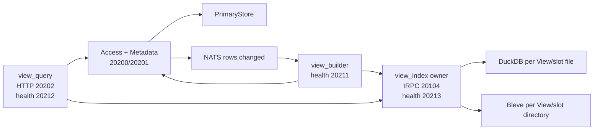

# Storage View Index Dual-Database Switch Implementation Plan

> **For agentic workers:** REQUIRED SUB-SKILL: Use superpowers:subagent-driven-development (recommended) or superpowers:executing-plans to implement this plan task-by-task. Steps use checkbox (`- [ ]`) syntax for tracking.

**Goal:** Replace the current shared-file View rotation implementation with a durable, bounded, dual-database switch architecture in which one `view_index` service owns every physical DuckDB/Bleve index and each View independently switches between deterministic `a` and `b` index slots.

**Architecture:** PrimaryStore remains the only complete source of truth. View indexes are disposable recent-data projections: metadata stores one active pointer plus one durable build lease, `view_builder` incrementally prepares and catches up the inactive slot through RPC, `view_query` reads only the active slot through RPC, and `view_index` is the only process allowed to open or delete DuckDB/Bleve files. Every DuckDB View slot is a separate database file, so reclaiming space means closing and deleting a whole file rather than relying on DuckDB row deletion, `VACUUM`, or checkpoint behavior.

**Tech Stack:** Go 1.24, tRPC-Go, Protocol Buffers, SQLite metadata, Pebble PrimaryStore, DuckDB CGO, Bleve v2, NATS JetStream, Vue 3/TypeScript, shell deployment scripts.

---

## Status And Supersession

- This plan supersedes `docs/superpowers/plans/2026-07-09-storage-view-duckdb-blue-green-rotation.md`.
- The old words `rotation`, `rotate`, `resultName`, `resultID`, `active_result`, and `building_result` must not remain in the final View-index implementation or configuration.
- The operator-facing concept is **View 索引双库切换**.
- The periodic operation is `MaintainViewIndexes`, exposed to the timer as `op=maintain`.
- The atomic final metadata operation is `ActivateViewIndex`.
- Physical identity is always named `indexID`.

## New-Project Reset Policy

This is a new project. Do not add compatibility aliases, fallback readers, schema migrations, old-path probes, or dual writes to old formats.

The following old state is disposable and may be removed before verification:

```text
var/storage/duckdb/views.duckdb*
var/storage/bleve/
all View build pointers/status stored in the old t_views columns
all derived DuckDB/Bleve View data
```

PrimaryStore is still the authoritative rebuild source. A deployment reset may also recreate SQLite metadata and seed definitions when the old schema is present. The code must fail clearly on an incompatible metadata schema; it must not silently guess or migrate it.

## Locked Decisions

| Topic | Decision |
|---|---|
| Process ownership | Exactly one `view_index` process owns physical View indexes in an independently deployed topology. `view_builder` and `view_query` use RPC and never open DuckDB/Bleve paths. |
| Bundled development mode | Role `view` may host owner, builder, and query components in one process, but builder/query still depend on the owner interface rather than opening files themselves. |
| DuckDB isolation | One file per View slot: `<view_index_root>/duckdb/<space-hex>/<view-hex>/a.duckdb` and `b.duckdb`. Each file contains one logical table named `view_rows`. |
| Bleve isolation | One directory per View slot: `<view_index_root>/bleve/<space-hex>/<view-hex>/a/` and `b/`. |
| Slots | Only deterministic `a` and `b` slots exist. No timestamp generations and no third slot. |
| Build state | Durable `ViewIndexBuild` metadata uses a unique `build_id`, target View version, state, owner lease, cursor, source snapshot watermark, coverage, schema hash, and error. |
| Claim ordering | `ClaimViewIndexBuild(PREPARING)` first, then physical `Prepare`, then CAS to `BUILDING`. This avoids two builders destructively preparing the same inactive slot. |
| Schema preemption | A View definition/column version bump immediately replaces any older build claim. The old warming index becomes an orphan and stops receiving writes. |
| Dual write | Incremental events write to active plus the current `BUILDING` or `CATCHING_UP` index whose target version equals the current View version. |
| Resume | Backfill saves its PrimaryStore cursor after each successfully written page and renews its lease. A new builder resumes an expired lease instead of restarting from page one. |
| Catch-up | Backfill scans to a captured source watermark, then rescans the overlap interval and verifies against a fresh source watermark before activation. |
| Retention | `retention_window` is a hard View-index semantic bound. TimeSeries chooses the configured window for the View's actual `filter_json.freq`; Record requires timestamp-normalizable versions and uses its Record retention window. |
| Capacity | Maintenance starts a switch on schema drift, missing active index, entry high-water, physical-byte high-water, or retention coverage drift. Disk admission prevents starting a warming file when free space is below the configured floor. |
| Read schema | `View.active_columns`, `active_schema_hash`, and active coverage are persisted atomically with the active pointer. Empty indexes never infer schema from rows. |
| File deletion | Removal marks an index closing, rejects new acquisitions, waits for in-flight references to drain, closes the handle, then removes the whole file/directory. |
| Orphans | Maintenance lists owner-managed indexes and removes unreferenced indexes after `remove_grace`. Slot reuse always calls `Prepare`, which closes and recreates the slot. |
| Query memory | DuckDB applies paging in SQL. Bleve applies predicates, sort, offset/size, and stored-field loading inside Bleve; it must not materialize all hits before pagination. |
| Projection reads | Secondary-dataset projection uses batched PrimaryStore reads, never one point read per row. |
| Old code | Delete direct Access/DataView query ownership, `Builder.Build`, dirty-build tracking, single-file DuckDB sharing, old rotation manager, and old build-state-only `UpdateView` bypass. |

## Target Deployment



The framework configs are:

```text
modules/storage/config/trpc_go.access.yaml
modules/storage/config/trpc_go.view_index.yaml
modules/storage/config/trpc_go.view_builder.yaml
modules/storage/config/trpc_go.view_query.yaml
```

`trpc.moox.storage.ViewIndex` listens on `20104`. It is internal-only and has no public HTTP endpoint.

## Target Configuration

Delete `devices.duckdb_path`, `devices.bleve_path`, and `view.rotation`. Use:

```yaml
storage:
  devices:
    pebble_path: ./var/storage/pebble
    view_index_root: ./var/storage/view-indexes
    parquet_path: ./var/storage/archive
  view:
    metadata_service_name: trpc.moox.storage.Metadata
    access_service_name: trpc.moox.storage.Access
    index_service_name: trpc.moox.storage.ViewIndex
    batch_size: 500
    batch_wait_ms: 200
    max_workers: 2
    maintenance:
      enabled: true
      owner_id: ""
      lease_ttl: 90s
      run_budget: 20s
      page_size: 500
      max_entries: 200000
      target_entries: 150000
      max_physical_bytes: 536870912
      min_free_disk_bytes: 1073741824
      min_ready_entries: 1000
      allowed_lag: 2m
      overlap_window: 30m
      remove_grace: 60s
      time_series:
        default_retention_window: 7d
        retention_by_freq:
          1m: 24h
          1h: 90d
          1d: 730d
      record:
        retention_window: 30d
```

`target_entries` is a readiness/pressure target, not a replacement for retention semantics. The time/version window remains the deterministic source-selection boundary; exceeding `max_entries` after a switch is surfaced as index pressure rather than causing an endless rebuild loop.

## Target Metadata Contract

Replace the old View build fields with:

```protobuf
message View {
  // Existing definition fields 1-10 remain, except query_window becomes retention_window.
  string active_index_id = 11;
  string status = 12;
  repeated ViewColumn columns = 13;
  string created_at = 14;
  string updated_at = 15;
  map<string, string> attributes = 16;
  uint64 view_version = 17;
  uint64 active_view_version = 18;
  repeated ViewColumn active_columns = 19;
  string active_schema_hash = 20;
  string active_coverage_start = 21;
  string active_coverage_end = 22;
  ViewIndexBuild index_build = 23; // read-only projection of the durable build row
}

message ViewIndexBuild {
  enum State {
    UNSPECIFIED = 0;
    PREPARING = 1;
    BUILDING = 2;
    CATCHING_UP = 3;
    READY = 4;
    FAILED = 5;
  }
  string space_id = 1;
  string view_id = 2;
  string build_id = 3;
  string index_id = 4;
  string engine = 5;
  uint64 target_view_version = 6;
  State state = 7;
  string owner_id = 8;
  string lease_expires_at = 9;
  string cursor_json = 10;
  string snapshot_end = 11;
  string coverage_start = 12;
  string coverage_end = 13;
  uint64 entries_written = 14;
  string schema_hash = 15;
  repeated ViewColumn columns = 16;
  string started_at = 17;
  string updated_at = 18;
  string finished_at = 19;
  string error = 20;
}
```

SQLite owns two tables:

```sql
CREATE TABLE t_views (... c_active_index_id TEXT NOT NULL DEFAULT '', ...);

CREATE TABLE t_view_index_builds (
  c_space_id TEXT NOT NULL,
  c_view_id TEXT NOT NULL,
  c_build_id TEXT NOT NULL UNIQUE,
  c_index_id TEXT NOT NULL,
  c_engine TEXT NOT NULL,
  c_target_view_version INTEGER NOT NULL,
  c_state INTEGER NOT NULL,
  c_owner_id TEXT NOT NULL,
  c_lease_expires_at TEXT NOT NULL,
  c_cursor_json TEXT NOT NULL DEFAULT '',
  c_snapshot_end TEXT NOT NULL DEFAULT '',
  c_coverage_start TEXT NOT NULL DEFAULT '',
  c_coverage_end TEXT NOT NULL DEFAULT '',
  c_entries_written INTEGER NOT NULL DEFAULT 0,
  c_schema_hash TEXT NOT NULL,
  c_columns_json TEXT NOT NULL,
  c_started_at TEXT NOT NULL,
  c_updated_at TEXT NOT NULL,
  c_finished_at TEXT NOT NULL DEFAULT '',
  c_error TEXT NOT NULL DEFAULT '',
  PRIMARY KEY (c_space_id, c_view_id)
);
```

All transitions use single SQL statements or one SQLite transaction with conditional `WHERE` clauses. Public `UpdateView` cannot mutate active/build fields.

## Target ViewIndex RPC

Create `modules/storage/proto/view_index.proto` with these RPCs:

```protobuf
service ViewIndex {
  rpc PrepareViewIndex(PrepareViewIndexReq) returns (PrepareViewIndexRsp);
  rpc WriteViewIndex(WriteViewIndexReq) returns (WriteViewIndexRsp);
  rpc StatViewIndex(StatViewIndexReq) returns (StatViewIndexRsp);
  rpc RemoveViewIndex(RemoveViewIndexReq) returns (RemoveViewIndexRsp);
  rpc ListViewIndexes(ListViewIndexesReq) returns (ListViewIndexesRsp);
  rpc QueryTimeSeriesIndex(QueryTimeSeriesIndexReq) returns (QueryTimeSeriesIndexRsp);
  rpc SearchRecordIndex(SearchRecordIndexReq) returns (SearchRecordIndexRsp);
}
```

Lifecycle requests carry `index_id` and `engine`; the owner validates that the engine matches the parsed View definition. Query requests carry an internal `index_id` plus the existing structured query fields. Public callers still use `DataView`, never this internal service.

## Maintenance State Machine

```text
IDLE
  -> claim PREPARING with buildID, inactive indexID, owner lease, schema snapshot
  -> owner PrepareViewIndex
  -> CAS PREPARING -> BUILDING
  -> page PrimaryStore within retention range
       write page to inactive index
       persist cursor + coverage + entries and renew lease
  -> capture/finish snapshot watermark
  -> CAS BUILDING -> CATCHING_UP
  -> rescan [snapshot_end-overlap_window, fresh_source_end]
  -> owner StatViewIndex
  -> verify schema hash, coverage, min-ready, lag, and target version
  -> CAS CATCHING_UP -> READY
  -> ActivateViewIndex CAS:
       active_index_id = build.index_id
       active_view_version = build.target_view_version
       active_columns/hash/coverage = build snapshot
       delete current build row
  -> after remove_grace, remove unreferenced old slot
```

If the lease expires, another builder claims the same `build_id` and resumes its saved cursor. If `view_version` changes, a new `build_id` preempts the old row; dual write observes the new row and the old physical index is later swept as unreferenced.

---

### Task 1: Replace View And Build Protocol Contracts

**Files:**
- Modify: `modules/storage/proto/metadata.proto`
- Create: `modules/storage/proto/view_index.proto`
- Modify: `modules/storage/proto/view.proto`
- Modify: `modules/storage/proto/Makefile`
- Regenerate: `modules/storage/proto/gen/*.pb.go`
- Regenerate: `modules/storage/proto/gen/*.trpc.go`
- Test: `modules/storage/internal/core/viewindex/engine_test.go`

- [x] **Step 1: Write failing protocol-shape tests**

Add compile-time tests that construct `pb.View{ActiveIndexId: ...}`, `pb.ViewIndexBuild{BuildId: ...}`, and requests for every `ViewIndex` RPC. Delete tests that construct old build fields.

- [x] **Step 2: Run the focused test and verify RED**

Run:

```bash
go test -count=1 ./modules/storage/internal/core/viewindex
```

Expected: compilation fails because `ActiveIndexId`, `ViewIndexBuild`, and the new RPC messages do not exist.

- [x] **Step 3: Edit the proto sources**

Apply the exact `View` and `ViewIndexBuild` contract in this plan. Add Metadata RPCs:

```protobuf
rpc ClaimViewIndexBuild(ClaimViewIndexBuildReq) returns (ClaimViewIndexBuildRsp);
rpc UpdateViewIndexBuild(UpdateViewIndexBuildReq) returns (UpdateViewIndexBuildRsp);
rpc ActivateViewIndex(ActivateViewIndexReq) returns (ActivateViewIndexRsp);
rpc FailViewIndexBuild(FailViewIndexBuildReq) returns (FailViewIndexBuildRsp);
```

Remove all old build methods/fields rather than reserving aliases.

- [x] **Step 4: Regenerate code**

Run:

```bash
make -C modules/storage proto
```

Expected: `trpc-open create` succeeds for all seven proto files, including `view_index.proto`.

- [x] **Step 5: Run protocol tests and compile affected packages**

Run:

```bash
go test -count=1 ./modules/storage/internal/core/viewindex ./modules/storage/proto/gen
```

Expected: PASS after call sites are updated within this task; no generated file contains `active_result` or `building_result`.

### Task 2: Introduce Parseable Index IDs And Physical Paths

**Files:**
- Modify: `modules/storage/internal/core/viewindex/engine.go`
- Modify: `modules/storage/internal/core/viewindex/engine_test.go`
- Create: `modules/storage/internal/core/viewindex/path.go`
- Create: `modules/storage/internal/core/viewindex/path_test.go`

- [x] **Step 1: Write failing tests**

Cover round-trip parsing and path generation:

```go
id := ViewIndexID("crypto", "binance_spot_kline", SlotB)
ref, err := ParseViewIndexID(id)
require.NoError(t, err)
require.Equal(t, Ref{SpaceID: "crypto", ViewID: "binance_spot_kline", Slot: SlotB}, ref)
require.Equal(t, ".../duckdb/63727970746f/62696e.../b.duckdb", DuckDBPath(root, ref))
```

Also reject malformed IDs, unknown slots, path traversal, and mismatched space/view values.

- [x] **Step 2: Run and verify RED**

```bash
go test -count=1 ./modules/storage/internal/core/viewindex -run 'Test(ViewIndexID|PhysicalPath)'
```

Expected: FAIL because `ParseViewIndexID`, `Ref`, and path helpers are missing.

- [x] **Step 3: Implement the small identity API**

Use:

```go
type Slot string
const (
    SlotA Slot = "a"
    SlotB Slot = "b"
)
type Ref struct { SpaceID, ViewID string; Slot Slot }
```

Keep hex encoding so directory names are stable and cannot escape the root. `InactiveViewIndexID` must parse/compare the active ID and choose the opposite slot.

- [x] **Step 4: Run and verify GREEN**

```bash
go test -count=1 ./modules/storage/internal/core/viewindex
```

Expected: PASS.

### Task 3: Replace Rotation Configuration With Maintenance Configuration

**Files:**
- Modify: `modules/storage/internal/config/loader.go`
- Modify: `modules/storage/internal/config/loader_test.go`
- Modify: `modules/storage/config/storage.yaml`
- Modify: `modules/storage/config/storage.access.yaml`
- Modify: `modules/storage/config/storage.view.yaml`
- Modify: `modules/storage/config/storage.view_builder.yaml`
- Modify: `modules/storage/config/storage.view_query.yaml`
- Create: `modules/storage/config/storage.view_index.yaml`

- [x] **Step 1: Write failing config tests**

Assert defaults and YAML overrides for `ViewIndexRoot`, `IndexServiceName`, `Maintenance.LeaseTTL`, all watermarks, disk floor, and per-frequency retention. Assert the old YAML keys are absent from checked-in config text.

- [x] **Step 2: Run and verify RED**

```bash
go test -count=1 ./modules/storage/internal/config
```

Expected: FAIL because the new fields do not exist.

- [x] **Step 3: Implement the new config structs and defaults**

Use `StorageViewMaintenance`, `StorageTimeSeriesMaintenance`, and `StorageRecordMaintenance`. Parse durations only at the service boundary so YAML remains human-readable. Delete `StorageViewRotation`, `DuckDBPath`, and `BlevePath`.

- [x] **Step 4: Update all role configs**

`storage.view_index.yaml` has role `view_index`, owns `view_index_root`, and uses health `:20213`. Builder/query configs contain only the owner service name, not physical paths.

- [x] **Step 5: Run and verify GREEN**

```bash
go test -count=1 ./modules/storage/internal/config
```

Expected: PASS and `rg -n 'duckdb_path|bleve_path|rotation:' modules/storage/config` returns no matches.

### Task 4: Implement Durable SQLite Build CAS And Lease State

**Files:**
- Modify: `modules/storage/schema/metadata.sql`
- Modify: `modules/storage/internal/core/metadata/store.go`
- Modify: `modules/storage/internal/infra/metadata/sqlite/crud.go`
- Modify: `modules/storage/internal/infra/metadata/sqlite/crud_test.go`
- Modify: `modules/storage/internal/services/access/metadata_space_view.go`
- Create: `modules/storage/internal/services/access/metadata_view_index.go`
- Modify: `modules/storage/internal/services/view/metadata.go`
- Modify: `modules/storage/internal/services/view/remote_metadata.go`

- [x] **Step 1: Write failing SQLite tests**

Test these independent behaviors with two Store handles against one temp SQLite file:

```text
only one builder claims an idle View
PREPARING is durable before physical preparation
wrong buildID/owner/state cannot update
lease renewal persists cursor and entries
expired lease can be resumed by another owner with the same buildID
newer view_version preempts an older build
ActivateViewIndex atomically copies index/schema/coverage and removes build row
public UpdateView cannot mutate active_index_id or index_build
```

- [x] **Step 2: Run and verify RED**

```bash
go test -count=1 ./modules/storage/internal/infra/metadata/sqlite ./modules/storage/internal/services/access -run 'Test.*ViewIndex'
```

Expected: FAIL because the build table and methods do not exist.

- [x] **Step 3: Replace the View table schema and add `t_view_index_builds`**

Use the table contract in this plan. `InitSchema` must check a schema-version row and return `incompatible storage metadata schema; reset metadata database` instead of attempting ALTER-based migration.

- [x] **Step 4: Implement conditional transitions**

Expose typed methods:

```go
ClaimViewIndexBuild(ctx, *pb.ClaimViewIndexBuildReq) (*pb.ViewIndexBuild, error)
UpdateViewIndexBuild(ctx, *pb.UpdateViewIndexBuildReq) (*pb.ViewIndexBuild, error)
ActivateViewIndex(ctx, *pb.ActivateViewIndexReq) (*pb.View, error)
FailViewIndexBuild(ctx, *pb.FailViewIndexBuildReq) (*pb.ViewIndexBuild, error)
```

Return a dedicated conflict error when `RowsAffected()==0`; map it to a non-success `RetInfo` rather than hiding it behind a transport error.

- [x] **Step 5: Add Metadata RPC handlers and remote client methods**

The builder must call these RPCs directly. Delete the current clone-and-`UpdateView` implementation from `remote_metadata.go`.

- [x] **Step 6: Run and verify GREEN**

```bash
go test -count=1 ./modules/storage/internal/infra/metadata/sqlite ./modules/storage/internal/services/access ./modules/storage/internal/services/view -run 'Test.*(ViewIndex|Metadata)'
```

Expected: PASS.

### Task 5: Build The Per-Slot DuckDB Manager

**Files:**
- Create: `modules/storage/internal/infra/device/duckdb/index_manager.go`
- Create: `modules/storage/internal/infra/device/duckdb/index_manager_test.go`
- Modify: `modules/storage/internal/infra/device/duckdb/view_store.go`
- Modify: `modules/storage/internal/infra/device/duckdb/view_store_nocgo.go`
- Modify: `modules/storage/internal/infra/device/duckdb/view_store_test.go`

- [x] **Step 1: Write failing manager tests**

Verify:

```text
Prepare(a) creates only a.duckdb and table view_rows
Prepare(b) creates an independent b.duckdb
writes and queries never cross slots or Views
Stat reports exact O(1) metadata, schema hash, min/max, and file bytes
Remove waits for an acquired query reference, closes the DB, deletes the file and sidecars
new acquisitions fail while removal is in progress
reopening the manager discovers an existing slot
```

- [x] **Step 2: Run and verify RED**

```bash
go test -count=1 ./modules/storage/internal/infra/device/duckdb -run TestIndexManager
```

Expected: FAIL because `IndexManager` is missing.

- [x] **Step 3: Implement ref-counted handle ownership**

Use one `*ViewStore` per indexID and one physical table name constant:

```go
const indexTableName = "view_rows"
```

The manager owns a mutex, condition/channel per handle, `refs`, `closing`, and last-used metadata. `Remove` must honor context cancellation while waiting.

- [x] **Step 4: Persist exact stats inside each index file**

Maintain one `moox_view_index_meta` row transactionally with writes. Do not run capped `COUNT(*)` scans during maintenance. File bytes come from `os.Stat` after checkpoint/close-safe observation.

- [x] **Step 5: Run and verify GREEN**

```bash
go test -count=1 ./modules/storage/internal/infra/device/duckdb
```

Expected: PASS, including existing query paging tests.

### Task 6: Build The Per-Slot Bleve Manager And Push Down Paging

**Files:**
- Modify: `modules/storage/internal/infra/device/bleve/index.go`
- Modify: `modules/storage/internal/infra/device/bleve/index_test.go`
- Rewrite: `modules/storage/internal/services/view/search/service.go`
- Modify: `modules/storage/internal/services/view/search/service_test.go`

- [x] **Step 1: Write failing tests**

Test independent a/b directories, reference-safe removal, exact stats, version-range query pushdown, stable sort, page size 25, `has_more`, and bounded stored-row unmarshalling. A 30,000-hit fixture must deserialize at most 26 rows for a 25-row page.

- [x] **Step 2: Run and verify RED**

```bash
go test -count=1 ./modules/storage/internal/infra/device/bleve ./modules/storage/internal/services/view/search
```

Expected: the bounded-deserialization test fails because current code reads every 10,000-hit batch.

- [x] **Step 3: Implement query pushdown and manager ownership**

Build version range queries in Bleve, set requested sort fields, request `size+1` hits at the correct offset, and unmarshal only returned hits. Remove `searchBatchSize` full-result loops and all post-query pagination.

- [x] **Step 4: Run and verify GREEN**

```bash
go test -count=1 ./modules/storage/internal/infra/device/bleve ./modules/storage/internal/services/view/search
```

Expected: PASS.

### Task 7: Add The Single ViewIndex Owner Service And Remote Client

**Files:**
- Create: `modules/storage/internal/services/viewindex/service.go`
- Create: `modules/storage/internal/services/viewindex/service_test.go`
- Create: `modules/storage/internal/services/viewindex/client.go`
- Create: `modules/storage/internal/services/viewindex/client_test.go`
- Create: `modules/storage/config/trpc_go.view_index.yaml`
- Modify: `modules/storage/cmd/server/main.go`
- Modify: `modules/storage/cmd/server/main_test.go`

- [x] **Step 1: Write failing owner routing tests**

Assert DuckDB requests route only to DuckDB, Bleve requests route only to Bleve, engine mismatches fail, lifecycle errors map to `RetInfo`, and query calls hold a reference through completion.

- [x] **Step 2: Run and verify RED**

```bash
go test -count=1 ./modules/storage/internal/services/viewindex ./modules/storage/cmd/server
```

Expected: FAIL because the package and role do not exist.

- [x] **Step 3: Implement `Service` and `Client`**

`Client` implements the existing core lifecycle interface plus typed query interfaces. It uses `pb.NewViewIndexClientProxy(client.WithServiceName(...))`. The service is the only component constructed with `ViewIndexRoot`.

- [x] **Step 4: Wire deployment roles**

`view_index` registers `pb.RegisterViewIndexService`; `view_query` and `view_builder` only create a remote client. Bundled `view` constructs one local owner and passes it through interfaces. Reject a config that gives builder/query direct owner paths.

- [x] **Step 5: Run and verify GREEN**

```bash
go test -count=1 ./modules/storage/internal/services/viewindex ./modules/storage/cmd/server
```

Expected: PASS and role tests prove builder/query do not open physical index files.

### Task 8: Replace Rotation With Durable Maintenance

**Files:**
- Delete: `modules/storage/internal/services/view/rotation.go`
- Delete: `modules/storage/internal/services/view/rotation_test.go`
- Create: `modules/storage/internal/services/view/maintenance.go`
- Create: `modules/storage/internal/services/view/maintenance_test.go`
- Create: `modules/storage/internal/services/view/build_cursor.go`
- Create: `modules/storage/internal/services/view/build_cursor_test.go`
- Modify: `modules/storage/internal/services/view/schedule.go`
- Modify: `modules/storage/internal/services/view/view_builder.go`
- Modify: `modules/storage/internal/services/view/view_builder_test.go`

- [x] **Step 1: Write state-machine tests before implementation**

Cover missing-active build, schema preemption, capacity switch, cursor resume, lease takeover, per-frequency retention, overlap catch-up, stale active lag rejection, disk admission rejection, pressure-without-loop behavior, zero read gap, and orphan grace removal.

- [x] **Step 2: Run and verify RED**

```bash
go test -count=1 ./modules/storage/internal/services/view -run 'TestMaintenance|TestBuildCursor'
```

Expected: FAIL because `MaintenanceManager` is missing.

- [x] **Step 3: Implement bounded `MaintainViewIndexes`**

Each timer pass stops at `run_budget`, processes at most `max_workers` Views, and persists after every page. `owner_id` defaults to hostname plus PID plus a random startup suffix. Use `build_id` as a random UUID-like 128-bit hex string generated with `crypto/rand`.

- [x] **Step 4: Implement retention selection**

Parse the View's fixed `filter_json.freq`; select exactly that frequency's retention window. Do not take the maximum across `Dataset.freqs`. Record versions that cannot be normalized as timestamps fail the build with a clear configuration error.

- [x] **Step 5: Implement final catch-up and activation**

Persist `snapshot_end`, enter `CATCHING_UP`, rescan overlap, stat the owner index, mark `READY`, then call `ActivateViewIndex`. Never clear the old active pointer before activation succeeds.

- [x] **Step 6: Remove old one-shot builders and scheduler names**

Delete `Builder.Build`, old direct result-name generation, local dirty tracking, and `op=rotate`. `schedule.go` accepts only `op=maintain` for View-index lifecycle work.

- [x] **Step 7: Run and verify GREEN**

```bash
go test -count=1 ./modules/storage/internal/services/view
```

Expected: PASS and `rg -n '\b(rotation|rotate|resultName|resultID)\b' modules/storage/internal/services/view` returns no matches.

### Task 9: Route Incremental Dual Writes Through The Owner

**Files:**
- Modify: `modules/storage/internal/services/view/builder/options.go`
- Modify: `modules/storage/internal/services/view/builder/time_series.go`
- Modify: `modules/storage/internal/services/view/builder/time_series_test.go`
- Modify: `modules/storage/internal/services/view/builder/record.go`
- Modify: `modules/storage/internal/services/view/builder/record_test.go`
- Delete: `modules/storage/internal/services/access/viewbuilder.go`
- Delete: `modules/storage/internal/services/access/view_dirty.go`

- [x] **Step 1: Write failing dual-write tests**

Test active-only, active+BUILDING, active+CATCHING_UP, no write to PREPARING/FAILED/stale-version build, deduplication when pointers match, and owner RPC failure propagation to NATS retry/NAK.

- [x] **Step 2: Run and verify RED**

```bash
go test -count=1 ./modules/storage/internal/services/view/builder
```

Expected: old field references fail or tests observe incorrect write targets.

- [x] **Step 3: Implement `WritableIndexIDs(view)`**

Return the active index plus the current durable build index only for `BUILDING`/`CATCHING_UP`, matching target version and schema. Every write uses `WriteViewIndex` through the owner interface.

- [x] **Step 4: Run and verify GREEN**

```bash
go test -count=1 ./modules/storage/internal/services/view/builder
```

Expected: PASS.

### Task 10: Route Queries Through The Owner And Persist Active Schema

**Files:**
- Modify: `modules/storage/internal/services/view/service.go`
- Modify: `modules/storage/internal/services/view/service_test.go`
- Delete: `modules/storage/internal/services/access/query.go`
- Modify: `modules/storage/internal/services/access/service.go`
- Modify: `modules/storage/internal/services/access/options.go`
- Modify: `web/src/api/storage/types.ts`
- Modify: `web/src/views/data/views/index.vue`
- Modify: `web/src/views/data/view-browse/index.vue`

- [x] **Step 1: Write failing query tests**

Assert DataView uses `active_index_id`, sends the query to the owner, validates requested columns against `active_columns` even when zero rows exist, and returns `VIEW_NOT_READY` for a field added after the active version.

- [x] **Step 2: Run and verify RED**

```bash
go test -count=1 ./modules/storage/internal/services/view ./modules/storage/internal/services/access -run 'Test.*Query|Test.*ActiveSchema'
```

Expected: FAIL on old active-result/direct-store behavior.

- [x] **Step 3: Implement owner-backed query paths**

Remove row introspection fallback. Public DataView responses remain unchanged except for optional active coverage fields added to the response contract. Access no longer implements `pb.DataViewService` and no longer owns DuckDB/Bleve handles.

- [x] **Step 4: Update TypeScript field names and status display**

Use `active_index_id` and `index_build.state`. Do not retain frontend fallbacks to old field names.

- [x] **Step 5: Run and verify GREEN**

```bash
go test -count=1 ./modules/storage/internal/services/view ./modules/storage/internal/services/access
pnpm --dir web typecheck
```

Expected: PASS.

### Task 11: Batch Secondary Projection Reads

**Files:**
- Modify: `modules/storage/internal/services/view/projection.go`
- Modify: `modules/storage/internal/services/view/projection_test.go`
- Modify: `modules/storage/internal/services/view/view_builder.go`
- Modify: `modules/storage/internal/services/view/view_builder_test.go`

- [x] **Step 1: Write a failing call-count test**

Project 500 primary rows with two secondary datasets and assert the reader is called once per secondary dataset/batch, not 1,000 times.

- [x] **Step 2: Run and verify RED**

```bash
go test -count=1 ./modules/storage/internal/services/view -run TestProjectionBatchesSecondaryReads
```

Expected: FAIL with the current N+1 call count.

- [x] **Step 3: Add batch projection APIs and implementation**

Group keys by dataset, issue one `ReadTimeSeriesRows` or `ReadRecordRows` request per bounded batch, index returned rows by grain/version, then project in original primary-row order.

- [x] **Step 4: Run and verify GREEN**

```bash
go test -count=1 ./modules/storage/internal/services/view
```

Expected: PASS.

### Task 12: Update Health, Admin Defaults, Deployment, And Reset Tooling

**Files:**
- Modify: `modules/admin/internal/service/sysdeploy/defaults.go`
- Modify: `modules/admin/internal/service/sysdeploy/defaults_test.go`
- Modify: `scripts/deploy-moox.sh`
- Modify: `scripts/test-deploy-moox-storage-split.sh`
- Create: `scripts/reset-storage-view-indexes.sh`
- Modify: `modules/storage/config/trpc_go.yaml`
- Modify: `modules/storage/config/trpc_go.view_builder.yaml`
- Modify: `modules/storage/config/trpc_go.view_query.yaml`
- Create: `modules/storage/config/trpc_go.view_index.yaml`

- [x] **Step 1: Write failing deployment/default tests**

Assert four independently monitored storage roles:

```text
storage_access       health 20210
storage_view_builder health 20211
storage_view_query   health 20212, public DataView 20202
storage_view_index   health 20213, internal tRPC 20104
```

Assert deploy start order is access -> view_index -> view_builder -> view_query and stop order is the reverse.

- [x] **Step 2: Run and verify RED**

```bash
go test -count=1 ./modules/admin/internal/service/sysdeploy
bash scripts/test-deploy-moox-storage-split.sh
```

Expected: FAIL because `storage_view_index` is absent.

- [x] **Step 3: Implement role deployment and health checks**

Stage both new config files, start the owner before dependents, wait for `20104` and `20213/healthz`, and report each role independently to monitor.

- [x] **Step 4: Add an explicit reset script**

The script requires `--yes` and removes only paths supplied under a resolved storage root. It deletes old `views.duckdb*`, old Bleve derived data, the new View-index root, and optionally metadata with `--metadata`. It prints every resolved path before deletion and refuses `/` or an empty root.

- [x] **Step 5: Run and verify GREEN**

```bash
go test -count=1 ./modules/admin/internal/service/sysdeploy
bash scripts/test-deploy-moox-storage-split.sh
bash -n scripts/deploy-moox.sh scripts/reset-storage-view-indexes.sh
```

Expected: PASS.

### Task 13: Update Architecture And Operations Documentation

**Files:**
- Modify: `docs/存储目标架构与元数据.md`
- Modify: `docs/存储服务架构与部署.md`
- Modify: `modules/storage/README.md`
- Modify: `docs/superpowers/plans/2026-07-09-storage-view-duckdb-blue-green-rotation.md`

- [x] **Step 1: Mark the old plan superseded**

Add a top-level notice linking to this plan. Do not keep two apparently active contracts.

- [x] **Step 2: Document ownership, state machine, reset, and observability**

Include exact path layout, ports, role boundaries, retention semantics, pressure behavior, build states, lease takeover, reset commands, and these metrics/log fields:

```text
space_id view_id build_id index_id engine state owner_id
active_entries active_bytes warming_entries warming_bytes
cursor pages_written rows_written source_end coverage_end lag_seconds
switch_reason switch_duration_seconds remove_duration_seconds
```

- [x] **Step 3: Run terminology checks**

```bash
rg -n '\b(rotation|rotate|active_result|building_result|views\.duckdb)\b' \
  modules/storage docs/存储目标架构与元数据.md docs/存储服务架构与部署.md
```

Expected: only the superseded-plan historical notice may match.

### Task 14: Run Local End-To-End Dual-Slot Verification

**Files:**
- Create: `modules/storage/tests/view_index_switch_test.go`
- Modify: `scripts/test-deploy-moox-storage-split.sh`

- [x] **Step 1: Add an integration test harness**

Start Access/Metadata, ViewIndex, ViewBuilder, and ViewQuery with temp roots and isolated ports. Create a TimeSeries View and a Record View, write facts, wait for first activation, and query through DataView.

- [x] **Step 2: Verify both switch causes**

For TimeSeries, lower `max_entries` to force an `a -> b` capacity switch. For Record, add a ViewColumn to force schema-preemptive switching. During each build, repeatedly query and assert the old active index remains readable.

- [x] **Step 3: Verify physical reclaim**

After grace, assert the old `.duckdb` file or Bleve directory no longer exists and the active slot remains. Restart all four services and verify active queries and maintenance resume.

- [x] **Step 4: Run the integration test**

```bash
go test -count=1 -tags=integration ./modules/storage/tests -run TestViewIndexDualDatabaseSwitch -v
```

Expected: PASS with both engines switching and old physical storage deleted.

### Task 15: Full Verification And Release Gate

**Files:**
- Review all files changed by Tasks 1-14.

- [x] **Step 1: Format and regenerate**

```bash
gofmt -w $(find modules/storage modules/admin/internal/service/sysdeploy -name '*.go')
make -C modules/storage proto
```

- [x] **Step 2: Run fresh backend tests**

```bash
go test -count=1 ./modules/storage/... ./modules/admin/internal/service/sysdeploy/...
```

Expected: PASS with zero failures.

- [x] **Step 3: Run repository validation and frontend build**

```bash
go test -count=1 ./...
pnpm --dir web typecheck
pnpm --dir web build
bash scripts/check-module-boundaries.sh
```

Expected: all commands exit 0.

- [ ] **Step 4: Build deployment artifacts**

```bash
./scripts/build.sh storage
TARGET_GOOS=linux TARGET_GOARCH=amd64 ./scripts/build.sh storage
```

Expected: local and Linux storage binaries build successfully.

- [x] **Step 5: Audit the final diff against this plan**

Run:

```bash
git diff --check
rg -n '\b(rotation|rotate|resultName|resultID|active_result|building_result)\b' modules/storage web/src/api/storage
rg -n 'views\.duckdb|duckdb_path|bleve_path' modules/storage/config modules/storage/internal
```

Expected: `git diff --check` exits 0 and both terminology searches return no live implementation matches.

- [ ] **Step 6: Review destructive scope before remote deployment**

Only after local verification, list the exact remote paths that will be reset and confirm they are under the configured storage root. Preserve PrimaryStore unless a full reset was explicitly selected.

## Acceptance Criteria

- [x] `view_builder` and `view_query` cannot open DuckDB or Bleve paths.
- [x] `view_index` is independently deployable and has `/healthz` on port `20213`.
- [x] Every View/slot has its own DuckDB file or Bleve directory.
- [x] Switching active slots is one metadata CAS with no read gap.
- [x] A crash after any backfill page resumes from a durable cursor.
- [x] Multiple builders cannot concurrently own one build lease.
- [x] A schema bump preempts warming immediately and old warming stops receiving writes.
- [x] TimeSeries retention uses the actual View frequency, not the widest Dataset frequency.
- [x] Record retention rejects opaque versions instead of silently truncating a scan.
- [x] DuckDB deletion reclaims the whole file after references drain.
- [x] Bleve query paging is bounded and does not load the full hit set.
- [x] Active schema is queryable even when the active index has zero rows.
- [x] Old rotation/single-file/config compatibility code is deleted.
- [x] Local integration verification covers write, switch, query, restart, and physical deletion for DuckDB and Bleve.

## Execution Notes For This Workspace

The current branch contains pre-existing uncommitted backend and frontend changes. Work in place, preserve them, and inspect each touched diff before editing. Do not reset, checkout, or revert unrelated files. During execution, use test-first red/green cycles and update this plan's checkboxes only after fresh command evidence.

### Verification Evidence (2026-07-10)

- Workspace module tests passed with `go test -count=1 ./...` run separately in every Go module; the repository root is a `go.work` workspace and is not itself a Go module.
- Storage integration passed with `CGO_ENABLED=1 GOARCH=arm64 go test -count=1 -tags=integration ./modules/storage/tests -run TestViewIndexDualDatabaseSwitch -v`; it covered DuckDB/Bleve write, switch, query, restart, and physical deletion.
- Real-data tRPC benchmark passed using the Binance K-line archive. The archive was truncated, but `8` usable CSV files were recovered; `1600` time-series rows and `50` record rows were written, `1600` DuckDB rows were materialized, and paged reads returned data successfully. Report: `/tmp/moox-storage-real-e2e-7/reports/storage-bench-20260710-150957.json`.
- Frontend passed `pnpm exec vue-tsc --noEmit` and `pnpm run build:prod`; module-boundary and split-deployment checks passed; local `./scripts/build.sh storage` passed.
- Native Linux/arm64 artifact build passed. Linux/amd64 cross-build was attempted but the local Colima/QEMU assembler crashed; it is intentionally left unchecked until an amd64 builder is available.
- The independent review found and the implementation fixed active-pointer CAS fencing, owner-side schema/version fencing, primary-write/event-publish failure semantics, cross-engine orphan identity collisions, and frequency-aware catch-up overlap. Remaining review risks are recorded in the final review summary rather than hidden by this checklist.
