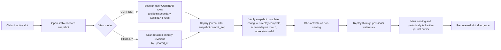

# Storage Record Multi-Version And Current/History View Implementation Plan

> **For agentic workers:** REQUIRED SUB-SKILL: Use superpowers:subagent-driven-development (recommended) or superpowers:executing-plans to implement this plan task-by-task. Steps use checkbox (`- [ ]`) syntax for tracking.

**Goal:** Replace caller-supplied Record version strings with server-managed immutable revisions, preserve complete Record history in PrimaryStore, and rebuild Record Views through explicit `CURRENT` and `HISTORY` modes with correct A/B rotation.

**Architecture:** `RecordKey` identifies one logical record; every mutation creates a complete immutable revision plus an atomic current snapshot and durable write-journal entry in Pebble. Record Views reuse the existing A/B lifecycle, but `CURRENT` backfills one current row per record while `HISTORY` backfills retained revisions; both catch up from the durable Record journal instead of interpreting a version string as time.

**Tech Stack:** Go 1.24, tRPC-Go, Protocol Buffers, SQLite metadata, Pebble PrimaryStore, Bleve v2, NATS JetStream, Vue 3/TypeScript, shell deployment scripts.

---

## Status And Supersession

Implementation status (2026-07-11): Tasks 1-11 are implemented, including the
server-managed Record contract, Pebble revision/journal storage, CURRENT and
HISTORY Bleve views, snapshot/journal rotation, caller migration, old
`WriteRecordRows`/string-version/event contract removal, documentation, and
guarded reset tooling. Task 12 verification is in progress; the independent
code review and Task 13 remote publish/reset/rebuild remain release gates.

- This plan supersedes the Record-specific version, retention, and readiness decisions in `docs/superpowers/plans/2026-07-10-storage-view-index-dual-database-switch.md`.
- The TimeSeries model remains unchanged: `TimeSeriesKey.data_time` is still RFC3339/RFC3339Nano, and DuckDB Views still use time windows.
- Do not add readers, writers, aliases, migrations, or fallbacks for the old string `RecordKey.version` model. The remote project data will be backed up and then reset.
- Intermediate commits may temporarily retain the old RPC so every commit compiles. The final commit must delete the old RPC, fields, event, tests, and documentation.

## Locked Decisions

| Topic | Decision |
|---|---|
| Record identity | `RecordKey = space_id + dataset_id + record_id`. Revision is not part of caller identity. |
| Mutation | Callers send `RecordMutation`; they never choose the new revision or send `latest`, `updated_at`, or `commit_seq`. They may send `expected_revision` only as an optimistic-concurrency precondition. |
| Revision | PrimaryStore assigns a per-record `uint64 revision`, starting at 1 and incrementing by 1. Revisions are immutable. |
| Current snapshot | Every committed mutation atomically replaces the `CURRENT` snapshot while preserving all prior revisions. |
| Partial writes | A mutation is a patch. PrimaryStore merges it with the prior current row and stores a complete immutable snapshot. |
| Concurrency | Optional `expected_revision`: absent means last-writer-wins; `0` means create-only; `N` requires current revision `N`. |
| Retry identity | `UpsertRecordRowsReq.request_id` is required. Retrying the same normalized payload with the same ID returns the original committed rows without creating another revision; reusing an ID for different payload is rejected. |
| Commit order | One PrimaryStore source assigns a monotonic `commit_seq` inside the same Pebble transaction as the revision, current snapshot, time index, and journal. The owner also persists its generated `source_id`; Access never supplies it. |
| Deployment scope | This release supports exactly one active writable PrimaryStore source, matching current metadata. Startup fails clearly if Record routes resolve to multiple writable sources. Multi-source support requires a vector cursor plan. |
| System time | `updated_at` is generated by PrimaryStore in UTC RFC3339Nano. `effective_at` is not a core field; datasets may define their own business-time column. |
| Durable change feed | Pebble stores complete committed Record rows in a journal. NATS carries the same committed payload to the active slot for low latency, while every active and warming Record index tails the Pebble journal from a contiguous persisted cursor. Warming slots consume snapshot plus ordered journal only, which keeps readiness counts deterministic. A NATS publish failure does not turn an already committed upsert into an API failure. |
| Journal retention | The first release does not prune the Record journal. Monitor its size; add cursor-aware garbage collection only in a separate design. |
| Record View mode | `RECORD_VIEW_MODE_UNSPECIFIED` normalizes to `CURRENT`. `HISTORY` must be explicit. |
| CURRENT View | One visible document per primary `record_id`; supports multiple datasets joined by current `record_id`; every projection reads all sources from one short-lived Pebble snapshot and uses that snapshot watermark as its scalar write fence; never applies time retention. |
| HISTORY View | One visible document per primary `record_id + revision`; first release requires exactly one dataset; retention uses `updated_at`, never revision. |
| Public metadata | A multi-dataset CURRENT result exposes the primary dataset's revision, updated time, and commit sequence. |
| A/B rotation | Record and TimeSeries Views share prepare, backfill, catch-up, readiness, activate, and orphan cleanup. Record activation adds a bounded non-serving `ACTIVATING` handoff and post-CAS replay, preferring `VIEW_NOT_READY` over serving a regressed slot. Their source scanners and watermarks differ. |
| Physical format | View schema hash includes Record mode and an engine layout revision. A layout change forces a new inactive slot. |
| Remote data | Stop writers, preserve a small rollback bundle containing binaries/config/schema/seeds and metadata evidence, then delete all remote Storage data. Do not duplicate the large Storage data directory on the nearly full filesystem. Re-import seeds and recollect facts. |

## Target Record Contract

```protobuf
message RecordKey {
  string space_id = 1;
  string dataset_id = 2;
  string record_id = 3;
  reserved 4;
  reserved "version";
}

message RecordMutation {
  RecordKey key = 1;
  repeated ColumnValue columns = 2;
  map<string, string> attributes = 3;
  optional uint64 expected_revision = 4;
}

message RecordRow {
  RecordKey key = 1;
  repeated ColumnValue columns = 2;
  map<string, string> attributes = 3;
  uint64 revision = 4;
  string updated_at = 5;
  uint64 commit_seq = 6;
}

enum RecordReadMode {
  RECORD_READ_MODE_UNSPECIFIED = 0;
  RECORD_READ_MODE_CURRENT = 1;
  RECORD_READ_MODE_HISTORY = 2;
}

message RevisionRange {
  uint64 start_revision = 1; // 0 means unbounded.
  uint64 end_revision = 2;   // 0 means unbounded.
}
```

`UpsertRecordRows` requires a stable request ID and returns committed full `RecordRow` values. `ReadRecordRows` defaults to `CURRENT`; `CURRENT` rejects a revision range, while `HISTORY` accepts a range and uses `start_revision == end_revision` for an exact revision.

## Target Pebble Layout

```text
rh|<space>|<dataset>|<record>|<revision-20d>
  -> immutable complete RecordRow

rc|<space>|<dataset>|<record>
  -> complete current RecordRow

rt|<space>|<dataset>|<updated_at-fixed-utc>|<record>|<revision-20d>
  -> rh key; bounded HISTORY retention scan

j|<commit_seq-20d>
  -> RecordRowsCommittedEvent with complete committed rows

ri|<request_id>
  -> deterministic payload digest + committed journal sequence

__meta|record_commit_seq
  -> uint64 counter

__meta|record_source_id
  -> owner-generated stable UUID

__meta|record_cursor_hmac_key
  -> random key used to authenticate internal paging cursors
```

Revision and commit sequence encodings must preserve numeric order. The private `rt` timestamp encoding is fixed-width UTC (`2006-01-02T15:04:05.000000000Z`), even though the public `updated_at` remains RFC3339Nano. A mutation batch writes `rh`, `rc`, `rt`, `j`, `ri`, and the counter through one synchronous Pebble batch. The first release retains idempotency entries with the unpruned journal.

## Target Record Rotation



The snapshot is process-local and lease-bound. Opening it captures the Pebble snapshot and its commit watermark under the same commit mutex. Successful scans renew its lease, and every terminal/lease-loss path closes it. If PrimaryStore restarts and invalidates the snapshot token, the build fails and restarts from `PREPARING`; it must never resume from an invalid cursor.

---

### Task 1: Add The New Protocol Additively

**Files:**
- Modify: `packages/commonpb/moox_common.proto`
- Modify: `modules/storage/proto/common.proto`
- Modify: `modules/storage/proto/access.proto`
- Modify: `modules/storage/proto/store.proto`
- Modify: `modules/storage/proto/message.proto`
- Modify: `modules/storage/proto/metadata.proto`
- Modify: `modules/storage/proto/view.proto`
- Modify: `modules/storage/proto/view_index.proto`
- Regenerate: `packages/commonpb/*.pb.go`
- Regenerate: `modules/storage/proto/gen/*.pb.go`
- Regenerate: `modules/storage/proto/gen/*.trpc.go`
- Modify: `modules/storage/proto/gen/common_alias.go`

- [ ] **Step 1: Add the conflict error and numeric Record types**

Add `REVISION_CONFLICT = 19` to the common error enum and its manually maintained alias in `common_alias.go`. Add `RevisionRange` and `RecordReadMode` to `common.proto`. Add `RecordMutation` and the server fields on `RecordRow`. This task adds DTOs and fields only; Task 3 adds `UpsertRecordRows` and the PrimaryStore RPC methods in the same commit as their implementations so generated service interfaces never break the build.

Keep the occupied `ReadRecordRowsReq` tags `3-6` unchanged during the additive phase. Append the new fields at unused tags and retain those numbers after Task 10 removes `version_range`:

```protobuf
message UpsertRecordRowsReq {
  common.AuthInfo auth_info = 1;
  repeated RecordMutation mutations = 2;
  string request_id = 3;
}

message UpsertRecordRowsRsp {
  common.RetInfo ret_info = 1;
  repeated RecordRow rows = 2;
}

message ReadRecordRowsReq {
  common.AuthInfo auth_info = 1;
  repeated RecordKey keys = 2;
  VersionRange version_range = 3; // Temporary; delete and reserve in Task 10.
  SortOrder order = 4;
  repeated string column_names = 5;
  common.Page page = 6;
  RecordReadMode mode = 7;
  RevisionRange revision_range = 8;
}
```

- [ ] **Step 2: Add committed-event and snapshot/journal DTOs**

Define the event and internal request/response messages needed for atomic upsert, stable snapshots, snapshot point reads, snapshot scans, and journal replay. Do not add methods to `service PrimaryStore` or `service AccessScan` until their implementations are added in Tasks 3 and 4.

```protobuf
message RecordRowsCommittedEvent {
  string event_id = 1;
  string source_id = 2;
  uint64 commit_seq = 3;
  string committed_at = 4;
  repeated RecordRow rows = 5;
}

message ApplyPrimaryRecordMutationsReq {
  common.AuthInfo auth_info = 1;
  PrimaryStoreTarget source_target = 2; // Representative physical owner; dataset comes from each mutation key.
  repeated RecordMutation mutations = 3;
  string request_id = 4;
}

message ApplyPrimaryRecordMutationsRsp {
  common.RetInfo ret_info = 1;
  RecordRowsCommittedEvent commit = 2;
}

message OpenRecordSnapshotReq {
  common.AuthInfo auth_info = 1;
  PrimaryStoreTarget source_target = 2;
  RecordReadMode mode = 3;
  TimeRange updated_time_range = 4;
}

message OpenRecordSnapshotRsp {
  common.RetInfo ret_info = 1;
  string snapshot_id = 2;
  uint64 commit_seq = 3;
  string source_id = 4;
}
```

Define DTOs for `ReadRecordSnapshot`, `ScanRecordSnapshot`, `RenewRecordSnapshot`, `CloseRecordSnapshot`, `GetRecordWatermark`, and `ScanRecordJournal`. Snapshot point reads carry a target dataset plus bounded `record_ids`, allowing a multi-dataset CURRENT build to join every source through the same Pebble snapshot. Journal scan uses `(after_commit_seq, through_commit_seq]` and cursor paging.

Every paging request/response uses a versioned, HMAC-authenticated cursor bound to `source_id`, operation, snapshot ID, mode, dataset/range, and original lower/upper bounds. A cursor from another snapshot or changed request must return `INVALID_PARAM`; the final page returns an empty `next_cursor`.

- [ ] **Step 3: Add View mode and owner fencing fields**

```protobuf
enum RecordViewMode {
  RECORD_VIEW_MODE_UNSPECIFIED = 0;
  RECORD_VIEW_MODE_CURRENT = 1;
  RECORD_VIEW_MODE_HISTORY = 2;
}

message RecordIndexMutation {
  RecordRow row = 1;
  uint64 order_commit_seq = 2; // CURRENT projection snapshot watermark; HISTORY committed row sequence.
  string source_id = 3;
}
```

Add `View.record_view_mode`, `ViewIndexSchema.record_view_mode`, `ViewIndexSchema.layout_revision`, `ViewIndexSchema.primary_dataset_id`, `ViewIndexSchema.dataset_ids`, `ViewIndexSchema.grain_keys`, `ViewIndexSchema.filter_json`, and `ViewIndexSchema.record_source_id`. Add `ViewIndexBatch.record_mutations`, `ViewIndexBatch.replay_source_id`, `ViewIndexBatch.replay_from_commit_seq`, and `ViewIndexBatch.replay_through_commit_seq`; an empty replay batch is valid and advances the contiguous cursor only when both the stored source/cursor equal `replay_source_id/replay_from_commit_seq`.

Add a write result with inserted/updated/ignored mutation counts and final visible count. Add Record-specific stats: `min_revision`, `max_revision`, `applied_source_id`, `applied_through_commit_seq`, `visible_entry_count`, persisted Record mode, and layout revision. Carry the normalized mode in `SearchRecordIndexReq` and require it to match the prepared/persisted schema. Add `SearchRecordRowsReq.revision_range` at unused tag `11`; delete and reserve old `version_range = 6` only in Task 10.

- [ ] **Step 4: Regenerate protobuf code**

Run:

```bash
make -C packages/commonpb all
make -C modules/storage/proto all
```

Expected: protobuf generation succeeds, `common_alias.go` exposes `ErrorCode_REVISION_CONFLICT`, and `git diff --check` reports no whitespace errors.

- [ ] **Step 5: Verify the additive protocol compiles**

Run:

```bash
(cd modules/storage && go test -run '^$' ./...)
(cd modules/collector && go test -run '^$' ./...)
```

Expected: both module trees compile because this task has not yet expanded any generated service interface; the old public RPC still exists.

- [ ] **Step 6: Commit the additive protocol**

```bash
git add packages/commonpb modules/storage/proto
git commit -m "feat(storage): define server-managed record revisions"
```

### Task 2: Implement Atomic Multi-Version Records In Pebble

**Files:**
- Modify: `modules/storage/internal/infra/device/store.go`
- Modify: `modules/storage/internal/infra/device/pebble/key.go`
- Modify: `modules/storage/internal/infra/device/pebble/store.go`
- Create: `modules/storage/internal/infra/device/pebble/record_store.go`
- Create: `modules/storage/internal/infra/device/pebble/record_snapshot.go`
- Create: `modules/storage/internal/infra/device/pebble/record_journal.go`
- Modify: `modules/storage/internal/infra/device/pebble/store_test.go`
- Create: `modules/storage/internal/infra/device/pebble/record_store_test.go`
- Create: `modules/storage/internal/infra/device/pebble/record_snapshot_test.go`

- [ ] **Step 1: Write RED tests for immutable revisions and current snapshots**

Add tests named:

```go
func TestApplyRecordMutationCreatesImmutableRevisionAndCurrentSnapshot(t *testing.T)
func TestApplyRecordMutationMergesPatchIntoCompleteRevision(t *testing.T)
func TestApplyRecordMutationMergesAttributesByKey(t *testing.T)
func TestApplyRecordMutationEnforcesExpectedRevision(t *testing.T)
func TestApplyRecordMutationRejectsDuplicateIdentityInBatch(t *testing.T)
func TestApplyRecordMutationRetryReturnsOriginalCommitWithoutNewRevision(t *testing.T)
func TestApplyRecordMutationRejectsRequestIDPayloadMismatch(t *testing.T)
```

The first write must return revision 1. A second partial mutation must return revision 2, preserve revision 1 unchanged, merge unspecified columns and attribute keys from revision 1, and replace `rc` with revision 2. Missing attributes are preserved; this release has no attribute-delete syntax. `expected_revision=0` succeeds only when no current row exists; a stale expectation returns `REVISION_CONFLICT` without advancing the counter or writing any key.

- [ ] **Step 2: Run the new tests and confirm RED**

Run:

```bash
(cd modules/storage && go test -count=1 ./internal/infra/device/pebble -run 'TestApplyRecordMutation')
```

Expected: FAIL because the Record mutation API and keyspaces do not exist.

- [ ] **Step 3: Implement ordered keys and atomic mutation**

Add focused helpers and keep TimeSeries encoding unchanged.

```go
func encodeRecordHistoryKey(key *pb.RecordKey, revision uint64) []byte
func encodeRecordCurrentKey(key *pb.RecordKey) []byte
func encodeRecordTimeKey(row *pb.RecordRow) []byte
func encodeRecordJournalKey(commitSeq uint64) []byte

func (s *Store) ApplyRecordMutations(
    ctx context.Context,
    requestID string,
    mutations []*pb.RecordMutation,
) (*pb.RecordRowsCommittedEvent, error)
```

Under `commitMu` plus sorted logical-record locks:

1. Load or create the owner-generated persistent source ID; never accept it from Access.
2. Validate the required request ID and whole batch before opening the Pebble batch.
3. Deterministically marshal the normalized mutations and compute their payload digest.
4. If `ri` already contains the same request ID and digest, load and return its original journal event; a different digest is `INVALID_PARAM`.
5. Read each `rc` snapshot.
6. Check `expected_revision`.
7. Merge the patch into a complete row.
8. Assign `revision = current.revision + 1`.
9. Assign one new `commit_seq` and one UTC RFC3339Nano `updated_at` to the batch.
10. Encode `rt` with a fixed-width UTC physical timestamp.
11. Write all `rh`, `rc`, `rt`, `j`, `ri`, and counter entries.
12. Commit synchronously and return the complete committed event.

The event ID is derived from the persistent `source_id + commit_seq`. The source ID and cursor HMAC key are generated once and survive reopen. All validation/conflict paths leave both counters and data keyspaces unchanged.

- [ ] **Step 4: Write and pass concurrency/restart tests**

```go
func TestConcurrentRecordMutationsProduceContinuousRevisions(t *testing.T)
func TestRecordCommitSequenceSurvivesReopen(t *testing.T)
func TestRecordSourceIDAndEventIDSurviveReopen(t *testing.T)
func TestRecordMutationAndJournalCommitAtomically(t *testing.T)
func TestRecordBatchCommitFailureLeavesEveryKeyspaceUnchangedAfterReopen(t *testing.T)
func TestRecordTimeIndexOrdersWholeAndFractionalSeconds(t *testing.T)
```

Inject a Pebble batch-commit failure in the atomicity test. After reopen, `rh`, `rc`, `rt`, `j`, `ri`, and the counter must all be old or all be new. Cover inclusive HISTORY endpoints across whole-second and fractional timestamps.

Run:

```bash
(cd modules/storage && go test -race -count=1 ./internal/infra/device/pebble -run 'TestConcurrentRecord|TestRecordCommit|TestApplyRecord')
```

Expected: PASS; revisions are unique and continuous for one record, and commit sequence never reuses a value after reopening Pebble.

- [ ] **Step 5: Implement stable Record snapshots**

Use `*pebble.Snapshot` behind an opaque, lease-bound in-process ID.

```go
type recordSnapshot struct {
    snapshot  *pebble.Snapshot
    mode      pb.RecordReadMode
    watermark uint64
    expiresAt time.Time
}
```

`OpenRecordSnapshot` acquires `commitMu`, creates `*pebble.Snapshot`, and reads `record_commit_seq` from that same snapshot before releasing the mutex. `CURRENT` iterates `rc`; `HISTORY` iterates `rt` inside `updated_time_range` and resolves `rh`. CURRENT point reads for secondary datasets use the same token and snapshot.

Every scan returns at most `page.size + 1` source entries and an authenticated opaque cursor. Set snapshot TTL above the View build lease and renew it on every successful scan/point-read; also expose explicit renewal for a maintenance pass that performs no scan. Closing, expiry, owner shutdown, build failure, lease loss, READY, or activation releases the Pebble snapshot.

- [ ] **Step 6: Write and pass snapshot tests**

```go
func TestCurrentSnapshotIsStableAcrossConcurrentMutation(t *testing.T)
func TestSnapshotWatermarkMatchesAtomicSnapshotBoundary(t *testing.T)
func TestCurrentSnapshotPointReadsJoinSecondaryAtSameBoundary(t *testing.T)
func TestHistorySnapshotUsesUpdatedAtRetentionRange(t *testing.T)
func TestSnapshotCursorPagesWithoutDuplicates(t *testing.T)
func TestSnapshotCursorRejectsTamperingOrDifferentBounds(t *testing.T)
func TestSnapshotLeaseRenewsAndTerminalCloseReleasesResources(t *testing.T)
func TestExpiredSnapshotFailsInsteadOfResuming(t *testing.T)
```

Run:

```bash
(cd modules/storage && go test -race -count=1 ./internal/infra/device/pebble -run 'Test(CurrentSnapshot|HistorySnapshot|Snapshot|ExpiredSnapshot)')
```

Expected: PASS.

- [ ] **Step 7: Implement and test durable journal replay**

```go
func (s *Store) RecordWatermark(ctx context.Context) (sourceID string, commitSeq uint64, err error)
func (s *Store) ScanRecordJournal(
    ctx context.Context,
    after uint64,
    through uint64,
    page *pb.Page,
) (events []*pb.RecordRowsCommittedEvent, scannedThrough uint64, result *pb.PageResult, err error)
```

Test exclusive lower bound, inclusive upper bound, multi-page replay, full committed rows, cursor stability, cursor binding to source/bounds, tampering, changed `through`, and an empty final cursor.

Run:

```bash
(cd modules/storage && go test -count=1 ./internal/infra/device/pebble -run 'TestScanRecordJournal|TestRecordWatermark')
```

Expected: PASS.

- [ ] **Step 8: Commit Pebble multi-version storage**

```bash
git add modules/storage/internal/infra/device
git commit -m "feat(storage): persist record revisions and commit journal"
```

### Task 3: Expose Multi-Version Records Through PrimaryStore And Access

**Files:**
- Modify: `modules/storage/proto/access.proto`
- Modify: `modules/storage/proto/store.proto`
- Regenerate: `modules/storage/proto/gen/access*.go`
- Regenerate: `modules/storage/proto/gen/store*.go`
- Modify: `modules/storage/internal/services/primary/client.go`
- Modify: `modules/storage/internal/services/primary/local.go`
- Modify: `modules/storage/internal/services/primary/remote.go`
- Modify: `modules/storage/internal/services/primary/service.go`
- Create: `modules/storage/internal/services/primary/service_test.go`
- Modify: `modules/storage/internal/services/access/service.go`
- Modify: `modules/storage/internal/services/access/data.go`
- Modify: `modules/storage/internal/services/access/factreader.go`
- Modify: `modules/storage/internal/services/access/key_adapter.go`
- Modify: `modules/storage/internal/services/access/validate.go`
- Modify: `modules/storage/internal/core/schema/validator.go`
- Modify: `modules/storage/internal/core/schema/validator_test.go`
- Create: `modules/storage/internal/services/access/data_record_revision_test.go`
- Create: `modules/storage/internal/services/access/data_record_conflict_test.go`
- Modify: `modules/storage/internal/services/view/builder/access_reader_test.go`

- [ ] **Step 1: Add the RPC methods beside RED transport tests**

Add `UpsertRecordRows` to `service Access` and the owner operations from Task 1 to `service PrimaryStore`, regenerate code, and immediately add method stubs returning a deliberate unimplemented error so the tree compiles. Then verify local and remote clients preserve committed revision, update time, commit sequence, persistent source ID, snapshot token, watermark, and journal cursor.

Update `scanAccessProxy` in `access_reader_test.go` with the generated `UpsertRecordRows` signature in this same step; it may return an explicit unexpected-call error, but it must continue to satisfy `pb.AccessClientProxy`.

```go
func TestPrimaryServiceAppliesRecordMutationAndReturnsCommittedRows(t *testing.T)
func TestPrimaryRemoteClientTransportsRecordSnapshotAndJournal(t *testing.T)
```

Run:

```bash
(cd modules/storage && go test -count=1 ./internal/services/primary -run 'TestPrimary')
```

Expected: compile succeeds and the behavior tests FAIL until the owner methods are wired.

- [ ] **Step 2: Wire the PrimaryStore methods**

Extend the local/remote client interface with:

```go
ApplyRecordMutations(context.Context, *pb.PrimaryStoreTarget, string, []*pb.RecordMutation) (*pb.RecordRowsCommittedEvent, error)
OpenRecordSnapshot(context.Context, *pb.OpenRecordSnapshotReq) (*pb.OpenRecordSnapshotRsp, error)
ReadRecordSnapshot(context.Context, *pb.ReadRecordSnapshotReq) (*pb.ReadRecordSnapshotRsp, error)
ScanRecordSnapshot(context.Context, *pb.ScanRecordSnapshotReq) (*pb.ScanRecordSnapshotRsp, error)
RenewRecordSnapshot(context.Context, *pb.RenewRecordSnapshotReq) error
CloseRecordSnapshot(context.Context, *pb.CloseRecordSnapshotReq) error
GetRecordWatermark(context.Context, *pb.PrimaryStoreTarget) (string, uint64, error)
ScanRecordJournal(context.Context, *pb.ScanRecordJournalReq) (*pb.ScanRecordJournalRsp, error)
```

The `source_target` is a representative route to one physical `node_id + device_id + engine + endpoint`; mutation keys still carry their actual dataset IDs. Access proves all mutations route to that same physical source before making this one atomic call. Map revision conflicts to `REVISION_CONFLICT`, missing snapshots to `NOT_FOUND`, and invalid cursors to `INVALID_PARAM`.

- [ ] **Step 3: Write RED Access behavior tests**

```go
func TestUpsertRecordRowsReturnsServerManagedRevisionMetadata(t *testing.T)
func TestUpsertRecordRowsNeverAcceptsCallerRevisionMetadata(t *testing.T)
func TestReadRecordRowsDefaultsToCurrent(t *testing.T)
func TestReadRecordRowsHistoryUsesNumericRevisionRange(t *testing.T)
func TestReadRecordRowsRejectsCurrentWithRevisionRange(t *testing.T)
func TestUpsertRecordRowsSurfacesExpectedRevisionConflict(t *testing.T)
func TestUpsertRecordPatchMayOmitExistingRequiredColumns(t *testing.T)
func TestUpsertRecordCreateStillRequiresRequiredColumns(t *testing.T)
func TestUpsertRecordRowsRequiresStableRequestID(t *testing.T)
```

Run:

```bash
(cd modules/storage && go test -count=1 ./internal/services/access ./internal/core/schema -run 'TestUpsertRecord|TestReadRecord')
```

Expected: FAIL against the old timestamp-version implementation.

- [ ] **Step 4: Implement the new Access path while isolating the temporary RPC**

`UpsertRecordRows` requires a non-empty stable request ID, validates provided columns/types, rejects duplicate logical keys in one request, resolves the single writable PrimaryStore source, calls `ApplyRecordMutations`, and returns the committed rows. Reject any non-empty temporary `RecordMutation.key.version` and any `ReadRecordRowsReq.keys[].version` on the new path, including `latest`. On create, required Dataset columns must be present. On update, omitted required columns are valid because the immutable row is built by merging with CURRENT; add an authoritative CURRENT existence check before applying create-only validation.

Keep `recordVersionMu`, `lastRecordVersion`, `normalizeWriteRecordRows`, and `nextRecordVersion` isolated behind the temporarily retained `WriteRecordRows` RPC until Task 10 so intermediate generated interfaces and legacy tests compile. No new code may call it, and it is never deployed. Task 10 deletes the RPC and helpers together.

Normalize `RECORD_READ_MODE_UNSPECIFIED` to `CURRENT`. Route `CURRENT` to the `rc` path and `HISTORY` to immutable `rh` revisions. Sort revisions numerically, never lexicographically.

- [ ] **Step 5: Add the one-source safety fence**

At Access initialization and before a Record batch, require every active Record route to resolve to the same writable physical source (`node_id + device_id + engine + endpoint`; `device_table` may differ by dataset). Return `ROUTE_CROSS_DEVICE_UNSUPPORTED` with both source identities if not.

```go
func requireSingleRecordCommitSource(targets []*pb.PrimaryStoreTarget) (string, error)
```

Add a test proving a two-source Record batch fails before either source commits.

- [ ] **Step 6: Verify PrimaryStore and Access**

Run:

```bash
(cd modules/storage && go test -race -count=1 ./internal/services/primary ./internal/services/access ./internal/core/schema)
(cd modules/storage && go test -run '^$' ./...)
(cd modules/collector && go test -run '^$' ./...)
```

Expected: behavior tests pass and the complete Storage tree compiles, including every fake implementing the expanded generated client proxy.

- [ ] **Step 7: Commit the service layer**

```bash
git add modules/storage/proto modules/storage/internal/services/primary modules/storage/internal/services/access modules/storage/internal/core/schema
git commit -m "feat(storage): serve current and historical record revisions"
```

### Task 4: Make The Record Journal The View Source Of Truth

**Files:**
- Modify: `modules/storage/proto/access.proto`
- Regenerate: `modules/storage/proto/gen/access*.go`
- Modify: `modules/storage/internal/core/eventbus/bus.go`
- Modify: `modules/storage/internal/core/eventbus/bus_test.go`
- Modify: `modules/storage/internal/infra/eventbus/producer_bus.go`
- Modify: `modules/storage/internal/infra/eventbus/producer_bus_test.go`
- Modify: `modules/storage/internal/services/access/data.go`
- Modify: `modules/storage/internal/services/access/factreader.go`
- Create: `modules/storage/internal/services/access/factreader_record_snapshot_test.go`
- Modify: `modules/storage/internal/services/view/builder/service.go`
- Modify: `modules/storage/internal/services/view/builder/access_reader.go`
- Modify: `modules/storage/internal/services/view/builder/access_reader_test.go`
- Modify: `modules/storage/internal/services/archive/events.go`

- [ ] **Step 1: Write RED committed-event tests**

```go
func TestRecordCommittedEventCarriesEveryImmutableRevision(t *testing.T)
func TestRecordCommittedEventRetryKeepsStableEventID(t *testing.T)
func TestHistorySubscriberDoesNotCollapseRevisionsByRecordID(t *testing.T)
func TestCommittedRecordUpsertReturnsSuccessWhenNATSPublishFails(t *testing.T)
func TestAccessReplayReaderPreservesScannedThroughOnEmptyScopePage(t *testing.T)
```

Use two revisions of one record in separate commits. The subscriber must observe both full rows in commit order.

- [ ] **Step 2: Replace changed-key events with committed-row events**

Rename the core handlers, Archive consumer contract, and NATS subject to `record.rows_committed.v1`. The Access publish payload must be exactly the PrimaryStore committed event; a publish retry must not invent a new ID. The durable commit is the API success boundary: if NATS publish fails, return the committed rows with success, emit a metric/error log, and let journal reconciliation repair every index. Never encourage a client retry that would create another immutable revision.

- [ ] **Step 3: Expose snapshots and replay through AccessScan**

Add the snapshot/read/renew/close/watermark/journal methods to `service AccessScan` in the same commit as their implementation in `factreader.go`. These proxy messages carry `space_id + dataset_ids`, not a caller-built `PrimaryStoreTarget`. Access resolves every dataset, enforces the single physical source rule, and proxies to PrimaryStore. This is the only ViewBuilder-to-owner route; it works unchanged in the remote split-process topology.

Use one explicit scope and bind it when the snapshot opens:

```protobuf
message RecordAccessScope {
  string space_id = 1;
  repeated string dataset_ids = 2;
}

message OpenRecordAccessSnapshotReq {
  common.AuthInfo auth_info = 1;
  RecordAccessScope scope = 2;
  RecordReadMode mode = 3;
  TimeRange updated_time_range = 4;
}

message ReadRecordAccessSnapshotReq {
  common.AuthInfo auth_info = 1;
  string snapshot_id = 2;
  string dataset_id = 3;
  repeated string record_ids = 4;
}

message ScanRecordAccessSnapshotReq {
  common.AuthInfo auth_info = 1;
  string snapshot_id = 2;
  string dataset_id = 3;
  common.Page page = 4;
}

message ScanRecordAccessJournalReq {
  common.AuthInfo auth_info = 1;
  RecordAccessScope scope = 2;
  uint64 after_commit_seq = 3;
  uint64 through_commit_seq = 4;
  common.Page page = 5;
}
```

Open returns `snapshot_id + source_id + snapshot_commit_seq`. Read/scan reject a dataset outside the bound scope. Renew/close contain only auth and snapshot ID. Watermark contains auth plus scope and returns `source_id + commit_seq`. Journal responses carry matching complete events, `scanned_through_commit_seq`, and `PageResult`; Access may filter unrelated rows/events, but the scanned-through value advances across every source commit, including a page with zero matching mutations, so the contiguous cursor cannot stall.

```go
type RecordReplayReader interface {
    OpenRecordSnapshot(ctx context.Context, req *pb.OpenRecordAccessSnapshotReq) (*pb.OpenRecordAccessSnapshotRsp, error)
    ReadRecordSnapshot(ctx context.Context, req *pb.ReadRecordAccessSnapshotReq) (*pb.ReadRecordAccessSnapshotRsp, error)
    ScanRecordSnapshot(ctx context.Context, req *pb.ScanRecordAccessSnapshotReq) (*pb.ScanRecordAccessSnapshotRsp, error)
    RenewRecordSnapshot(ctx context.Context, snapshotID string) error
    CloseRecordSnapshot(ctx context.Context, snapshotID string) error
    RecordWatermark(ctx context.Context, spaceID string, datasetIDs []string) (sourceID string, commitSeq uint64, err error)
    ScanRecordJournal(ctx context.Context, spaceID string, datasetIDs []string, after, through uint64, page *pb.Page) (events []*pb.RecordRowsCommittedEvent, scannedThrough uint64, result *pb.PageResult, err error)
}
```

NATS remains the steady-state low-latency trigger. Task 8 adds the persistent active/warming journal tailer; both build catch-up and steady reconciliation use this AccessScan path and do not depend on NATS retention.

- [ ] **Step 4: Verify event and replay contracts**

Run:

```bash
(cd modules/storage && go test -count=1 ./internal/core/eventbus ./internal/infra/eventbus ./internal/services/access ./internal/services/view/builder ./internal/services/archive)
```

Expected: PASS.

- [ ] **Step 5: Commit the durable Record event path**

```bash
git add modules/storage/proto modules/storage/internal/core/eventbus modules/storage/internal/infra/eventbus modules/storage/internal/services/access modules/storage/internal/services/view/builder modules/storage/internal/services/archive
git commit -m "feat(storage): replay committed record rows from primary journal"
```

### Task 5: Add CURRENT And HISTORY To View Metadata

**Files:**
- Modify: `modules/storage/schema/metadata.sql`
- Modify: `modules/storage/internal/infra/metadata/sqlite/store.go`
- Modify: `modules/storage/internal/infra/metadata/sqlite/crud.go`
- Modify: `modules/storage/internal/infra/metadata/sqlite/crud_test.go`
- Modify: `modules/storage/internal/services/access/metadata_space_view.go`
- Modify: `modules/storage/internal/services/access/validate.go`
- Create: `modules/storage/internal/services/access/metadata_record_view_test.go`
- Modify: `modules/storage/internal/bootstrap/metadata/seed.go`
- Modify: `modules/cli/cmd/metadata.go`
- Create: `modules/cli/cmd/metadata_test.go`
- Modify: `examples/metadata-crypto.seed.yaml`

- [ ] **Step 1: Write RED View-mode validation tests**

```go
func TestRecordViewDefaultsToCurrent(t *testing.T)
func TestCurrentRecordViewRequiresRecordIDGrainAndNoRetention(t *testing.T)
func TestCurrentRecordViewAllowsMultipleDatasets(t *testing.T)
func TestHistoryRecordViewRequiresRecordIDRevisionGrain(t *testing.T)
func TestHistoryRecordViewRejectsMultipleDatasets(t *testing.T)
func TestRecordViewRejectsFixedFilterUntilDeleteContractExists(t *testing.T)
func TestTimeSeriesViewRejectsRecordViewMode(t *testing.T)
```

- [ ] **Step 2: Run tests and confirm RED**

Run:

```bash
(cd modules/storage && go test -count=1 ./internal/services/access -run 'TestRecordView|TestCurrentRecordView|TestHistoryRecordView|TestTimeSeriesViewRejects')
```

Expected: FAIL because View metadata has no Record mode.

- [ ] **Step 3: Persist and normalize Record mode**

Add `c_record_view_mode INTEGER NOT NULL DEFAULT 0` to `t_views`, bump `metadataSchemaVersion`, and update all SQLite scan/insert/update paths. `0` remains valid for TimeSeries; normalize only an unspecified Record View to CURRENT in the service layer. Because final deployment resets metadata, do not add ALTER migrations.

Validation rules:

```go
CURRENT: engine == "bleve", primary dataset kind == RECORD,
         grain_keys == ["record_id"], retention_window == "", filter_json == ""
HISTORY: engine == "bleve", exactly one dataset,
         grain_keys == ["record_id", "revision"], retention_window parses and is > 0,
         filter_json == ""
```

Record fixed filters are deliberately out of scope for this release. Without a Record tombstone/delete contract, accepting filters would require incremental document deletion semantics that are unrelated to the agreed multi-version change. Add them later as a separate design.

- [ ] **Step 4: Add both seed import paths and definitions**

Add `record_view_mode` parsing and enum conversion to both bootstrap seed code and `modules/cli`; the remote import uses `moox-cli`, so both paths are mandatory. Make `spot_symbol_profile_view` explicitly `current` with grain `record_id` and no retention. Add a single-dataset `spot_symbol_history_view` in `history` mode with grain `record_id + revision`, `retention_window: 30d`, and its own ViewColumn definitions so remote verification covers both modes. Replace the obsolete `query_window` spelling in touched seed entries with `retention_window`.

- [ ] **Step 5: Verify metadata and seeds**

Run:

```bash
(cd modules/storage && go test -count=1 ./internal/infra/metadata/sqlite ./internal/services/access ./internal/bootstrap/metadata)
(cd modules/cli && go test -count=1 ./...)
```

Expected: PASS.

- [ ] **Step 6: Commit View metadata modes**

```bash
git add modules/storage/schema modules/storage/internal/infra/metadata modules/storage/internal/services/access modules/storage/internal/bootstrap/metadata modules/cli examples/metadata-crypto.seed.yaml
git commit -m "feat(storage): define current and history record views"
```

### Task 6: Build Mode-Specific Record Index Mutations

**Files:**
- Modify: `modules/storage/internal/services/view/projection.go`
- Modify: `modules/storage/internal/services/view/projection_test.go`
- Create: `modules/storage/internal/services/view/builder/record_map.go`
- Create: `modules/storage/internal/services/view/builder/record_map_test.go`
- Modify: `modules/storage/internal/services/view/builder/record.go`
- Modify: `modules/storage/internal/services/view/builder/record_test.go`
- Modify: `modules/storage/internal/services/view/builder/options.go`
- Modify: `modules/storage/internal/services/view/builder/service.go`

- [ ] **Step 1: Write RED CURRENT projection tests**

```go
func TestCurrentRecordProjectionJoinsDatasetsByRecordID(t *testing.T)
func TestCurrentRecordProjectionUsesPrimaryRevisionMetadata(t *testing.T)
func TestCurrentRecordProjectionReturnsNoopWhenPrimaryNeverExisted(t *testing.T)
func TestCurrentRecordProjectionUsesSnapshotWatermarkAsOrderFence(t *testing.T)
func TestCurrentRecordProjectionCannotMixRowsAcrossCommitBoundary(t *testing.T)
```

The primary and secondary rows deliberately use different revisions. The result must join by `record_id`, expose primary revision metadata, and use the containing Pebble snapshot's commit watermark only as the internal write fence.

Do not assemble a projection with sequential live reads and then use `max(joined commit_seq)`: a concurrent commit can produce a mixed cut whose fence suppresses the later correct event. For each NATS batch or replay page, open one short-lived CURRENT snapshot, point-read every participating dataset through it, build complete projections, then close it. The scalar fence is valid because this release enforces one PrimaryStore source and every projection comes from one atomic source snapshot. Multiple sources require per-dataset vector cursors and conditional source-column merging.

- [ ] **Step 2: Write RED HISTORY mapping tests**

```go
func TestHistoryRecordMappingPreservesEveryCommittedRevision(t *testing.T)
func TestHistoryRecordMappingRejectsSecondaryDataset(t *testing.T)
func TestHistoryRecordBatchDeduplicatesOnlyExactRevision(t *testing.T)
```

- [ ] **Step 3: Implement mode-specific mapping**

```go
func BuildCurrentRecordMutation(
    view *pb.View,
    rowsByDataset map[string]*pb.RecordRow,
    sourceID string,
    projectionWatermark uint64,
) (*pb.RecordIndexMutation, error)

func BuildHistoryRecordMutation(
    view *pb.View,
    committed *pb.RecordRow,
    sourceID string,
) (*pb.RecordIndexMutation, error)
```

CURRENT event handling must read authoritative current rows for every participating dataset from one short-lived snapshot; cached event fragments and sequential live reads are not valid full projections. A missing primary that never existed yields no mutation, while transient read errors return an error. Record filters and PrimaryStore tombstones/deletes are both out of scope, so this task emits only idempotent UPSERT mutations. HISTORY must use the committed row carried by the event and must never reread CURRENT.

- [ ] **Step 4: Separate low-latency active writes from ordered warming writes**

Send direct NATS mutations only to the active slot. A warming slot receives the stable snapshot followed by ordered durable-journal batches; do not mix an unordered NATS path into its readiness accounting. Preserve all HISTORY revisions in the active NATS queue by deduplicating `(dataset_id, record_id, revision)`, not only `record_id`. The warming replay path never latest-wins collapses journal events.

- [ ] **Step 5: Verify builder behavior**

Run:

```bash
(cd modules/storage && go test -count=1 ./internal/services/view ./internal/services/view/builder -run 'TestCurrentRecord|TestHistoryRecord')
```

Expected: PASS.

- [ ] **Step 6: Commit Record mapping**

```bash
git add modules/storage/internal/services/view/projection.go modules/storage/internal/services/view/projection_test.go modules/storage/internal/services/view/builder
git commit -m "feat(storage): map current and history record index mutations"
```

### Task 7: Implement CURRENT And HISTORY In Bleve

**Files:**
- Modify: `modules/storage/internal/core/viewindex/engine.go`
- Modify: `modules/storage/internal/core/viewindex/engine_test.go`
- Modify: `modules/storage/internal/infra/device/bleve/index.go`
- Modify: `modules/storage/internal/infra/device/bleve/index_test.go`
- Modify: `modules/storage/internal/services/view/search/service.go`
- Modify: `modules/storage/internal/services/view/search/service_test.go`
- Modify: `modules/storage/internal/services/view/service.go`
- Modify: `modules/storage/internal/services/view/service_test.go`
- Modify: `modules/storage/internal/services/viewindex/client.go`
- Modify: `modules/storage/internal/services/viewindex/client_test.go`
- Modify: `modules/storage/internal/services/viewindex/service.go`
- Modify: `modules/storage/internal/services/viewindex/service_test.go`

- [ ] **Step 1: Write RED physical identity and ordering tests**

```go
func TestBleveCurrentUsesOneDocumentPerRecord(t *testing.T)
func TestBleveCurrentRejectsOlderOrderCommitSeq(t *testing.T)
func TestBleveHistoryUsesOneDocumentPerRevision(t *testing.T)
func TestBleveHistoryRevisionRangeIsNumeric(t *testing.T)
func TestBleveStatsExposeVisibleCountAndAppliedCommitSeq(t *testing.T)
func TestBleveReplayCursorRejectsGapAndAdvancesWithEmptyBatch(t *testing.T)
func TestBleveRejectsMutationOrReplayFromDifferentSource(t *testing.T)
func TestBleveSearchRejectsModeDifferentFromPersistedSchema(t *testing.T)
```

- [ ] **Step 2: Add the layout revision to schema hashing**

```go
const bleveRecordLayoutRevision uint32 = 2

type ViewIndexSchema struct {
    SpaceID          string
    ViewID           string
    ViewVersion      uint64
    Engine           string
    PrimaryDatasetID string
    DatasetIDs       []string
    GrainKeys        []string
    FilterJSON       string
    RecordViewMode   pb.RecordViewMode
    RecordSourceID   string
    LayoutRevision   uint32
    Columns          []*pb.ViewColumn
    SchemaHash       string
}
```

Hash Record mode, source ID, grain keys, `filter_json` (required empty for Record in this release), primary/dataset identities, columns, and layout revision. A test must prove changing any schema input changes the hash.

- [ ] **Step 3: Implement mode-specific document IDs and fences**

```go
CURRENT: <space>/<primary_dataset>/<record_id>
HISTORY: <space>/<primary_dataset>/<record_id>/<revision-20d>
```

Store `_doc_type=row`, `_record_mode`, `_order_source_id`, numeric `_revision`, numeric `_order_commit_seq`, `_updated_at`, and `_row_json`. Persist source ID, mode, layout revision, schema hash, and the contiguous replay cursor in the index metadata document so an owner restart and an empty index retain the contract. Under the existing Bleve write mutex, require the mutation source to match the prepared schema before reading the stored order fence and applying an upsert. Equal or lower `order_commit_seq` from that source is idempotently ignored.

For replay batches, atomically apply all mutations and advance `applied_source_id + applied_through_commit_seq` only when the stored pair equals `replay_source_id + replay_from_commit_seq`; a source mismatch, gap, or overlap returns a conflict. Direct NATS mutations use source-bound document fences for latency but never advance this contiguous replay cursor. Report inserted/updated/ignored counts, and never silently turn a valid visible UPSERT into zero accepted mutations.

- [ ] **Step 4: Apply query-mode validation**

The outer DataView service normalizes the View's Record mode, carries it through `SearchRecordIndexReq`, and the owner checks it against the persisted schema. It returns `VIEW_NOT_READY` while a Record slot is in the post-CAS `ACTIVATING` handoff or when the active source ID no longer matches Access. CURRENT rejects `revision_range`. HISTORY applies a numeric range to `_revision`. Both retain bounded Bleve paging and never expose stats documents.

- [ ] **Step 5: Transport mode/layout/stats through ViewIndex RPC**

Update every `statsToProto`, `statsFromProto`, schema, and batch conversion. Tests must assert no field is lost across the split-process client/service boundary.

- [ ] **Step 6: Verify Bleve and ViewIndex**

Run:

```bash
(cd modules/storage && go test -race -count=1 ./internal/core/viewindex ./internal/infra/device/bleve ./internal/services/view ./internal/services/view/search ./internal/services/viewindex)
```

Expected: PASS.

- [ ] **Step 7: Commit the Bleve modes**

```bash
git add modules/storage/internal/core/viewindex modules/storage/internal/infra/device/bleve modules/storage/internal/services/view modules/storage/internal/services/viewindex
git commit -m "feat(storage): index current and historical record views"
```

### Task 8: Replace Record Time-Window Rotation With Snapshot And Journal Replay

**Files:**
- Modify: `modules/storage/proto/metadata.proto`
- Regenerate: `modules/storage/proto/gen/metadata.pb.go`
- Modify: `modules/storage/schema/metadata.sql`
- Modify: `modules/storage/internal/infra/metadata/sqlite/store.go`
- Modify: `modules/storage/internal/infra/metadata/sqlite/crud.go`
- Modify: `modules/storage/internal/infra/metadata/sqlite/crud_test.go`
- Modify: `modules/storage/internal/services/view/build_cursor.go`
- Modify: `modules/storage/internal/services/view/build_cursor_test.go`
- Modify: `modules/storage/internal/services/view/maintenance.go`
- Modify: `modules/storage/internal/services/view/maintenance_test.go`
- Modify: `modules/storage/tests/view_index_switch_test.go`

- [ ] **Step 1: Extend durable build state**

Add Record-specific fields to `ViewIndexBuild` and `t_view_index_builds`:

```protobuf
string snapshot_id = 21;
uint64 snapshot_commit_seq = 22;
uint64 replay_through_commit_seq = 23;
uint64 replayed_commit_seq = 24;
uint64 source_rows_seen = 25;
uint64 expected_visible_rows = 26;
uint64 accepted_mutations = 27;
string record_source_id = 28;
string retention_cutoff_at = 29;
```

Bump `metadataSchemaVersion` again for the final table shape and add `BASELINING` and `ACTIVATING` to the build-state enum. The snapshot ID is meaningful only while its PrimaryStore process is alive. Cursor JSON is versioned and binds `phase + source_id + dataset_index + source_cursor + replay_cursor`. HISTORY persists one fixed `retention_cutoff_at` for its entire build. A missing/expired snapshot or invalid cursor transitions the build to FAILED, closes any remaining token, and the next maintenance pass starts a fresh build and prepares the inactive slot again. Successful work renews both the metadata build lease and snapshot lease.

- [ ] **Step 2: Write RED build-cursor and readiness tests**

```go
func TestRecordBuildCursorRoundTripsSnapshotAndReplayState(t *testing.T)
func TestMaintenanceCurrentScansStableCurrentSnapshot(t *testing.T)
func TestMaintenanceHistoryScansUpdatedAtRetentionWindow(t *testing.T)
func TestMaintenanceReplaysJournalThroughCapturedWatermark(t *testing.T)
func TestMaintenanceSecondCatchupPassAdvancesFromFirstPassCursor(t *testing.T)
func TestMaintenanceTailsJournalForActiveAndWarmingIndexes(t *testing.T)
func TestMaintenancePublishFailureEventuallyReconcilesActiveIndex(t *testing.T)
func TestMaintenanceJournalGapOrOutOfOrderDeliveryReplaysContiguously(t *testing.T)
func TestMaintenanceRestartBeyondNATSRetentionReconcilesFromJournal(t *testing.T)
func TestMaintenanceHistoryTailUsesPersistedCoverageCutoff(t *testing.T)
func TestMaintenanceDoesNotActivateBeforeReplayCompletes(t *testing.T)
func TestMaintenanceInitializesReplayCursorFromZeroAfterBackfill(t *testing.T)
func TestMaintenanceSourceReplacementForcesCleanRebuild(t *testing.T)
func TestMaintenanceHistoryUsesOneCutoffAcrossLongBuild(t *testing.T)
func TestMaintenanceHistoryRestartsBeforeActivationWhenCutoffTooStale(t *testing.T)
func TestMaintenanceDoesNotServeNewSlotUntilPostCASReplayCompletes(t *testing.T)
func TestMaintenanceUnfilteredCurrentCannotActivateEmptyAfterSeeingPrimaryRows(t *testing.T)
func TestMaintenanceSmallViewIgnoresGlobalMinimumReadyThreshold(t *testing.T)
func TestMaintenanceHistoryCoverageDriftRotatesAndDropsExpiredRevisions(t *testing.T)
func TestMaintenanceRestartsWhenSnapshotTokenIsLost(t *testing.T)
func TestMaintenanceClosesSnapshotOnEveryTerminalAndLeaseLossPath(t *testing.T)
```

- [ ] **Step 3: Implement the Record build phases**

Use these phase rules:

```text
PREPARING:
  resolve source_id + watermark before prepare
  prepare inactive index bound to that source; do not advertise it to the unordered NATS writer

BUILDING:
  atomically open stable snapshot + watermark and persist snapshot_id + snapshot_commit_seq
  require the snapshot source_id to equal the prepared source_id
  CURRENT: scan primary CURRENT rows, point-read secondary CURRENT rows from the same snapshot, project
  HISTORY: persist one retention_cutoff_at and scan revisions at/after that fixed cutoff
  persist cursor/counters after every successful page; every source row must produce one visible UPSERT

BASELINING:
  only after the entire snapshot succeeds, send an empty source-bound replay batch
  that advances the fresh physical cursor from 0 to snapshot_commit_seq

CATCHING_UP:
  capture replay_through_commit_seq
  scan durable journal (replayed_commit_seq, replay_through_commit_seq]
  bind a fresh page cursor to that pass's exact lower/upper bounds
  CURRENT: per replay page, open a short CURRENT snapshot, recompute complete joined records,
           and use that snapshot watermark as the document fence
  HISTORY: index every committed revision at/after the build's fixed retention_cutoff_at;
           advance the cursor with a no-op for older commits
  atomically advance the index's contiguous replay cursor after every page, including no-op pages
  after the pass, set replayed_commit_seq to its scanned-through value;
  recapture watermark and repeat from that new lower bound until one bounded pass observes no gap

READY:
  require scan complete, replayed == replay_through, schema/layout/view version match,
  every source row produced an accepted/updated/ignored-newer mutation,
  owner visible_entry_count == expected_visible_rows, owner source/cursor == build source/replayed,
  and a HISTORY cutoff has not exceeded the allowed coverage-staleness threshold

ACTIVATING:
  CAS active_index_id to the new slot but mark it non-serving
  route new NATS events to it, capture a post-CAS source watermark, and replay through it
  DataView returns VIEW_NOT_READY rather than serving stale rows during this bounded handoff
  mark the slot serving only after its contiguous cursor reaches the post-CAS watermark

ACTIVE:
  on startup and every maintenance interval, replay journal from the active index's
  matching applied_source_id + applied_through_commit_seq to a captured watermark;
  NATS does not advance this cursor
```

The expected-visible counter starts at zero on a freshly prepared index and changes only from owner-confirmed unique document transitions (`insert +1`, update/ignored `0`). Record filters/deletes are not supported, so after snapshot backfill `source_rows_seen` must equal `expected_visible_rows`; replay may add newly created identities/revisions through additional inserts. This replaces the global `min_ready_entries` rule for Record Views, so a legitimate one-row View can activate but an unexplained empty index cannot.

Delete the Record RFC3339-version requirement and old overlap-window catch-up. CURRENT does not rotate for retention. HISTORY keeps coverage-staleness rotation, but derives it exclusively from `updated_at`: one build uses one fixed lower cutoff, and if that cutoff becomes too stale before CAS the slot is discarded and rebuilt rather than activated. After activation, when the retained window advances past the configured threshold, build a new slot so expired revisions disappear. Schema changes also force a new slot through the schema hash.

Run the same bounded journal reconciler for active and warming Record slots. HISTORY applies the slot's fixed coverage cutoff during replay as well as snapshot scan, including recovery after an outage longer than the nominal window; coverage rotation ages those documents out. If Access reports a different source ID, immediately mark the old slot non-serving and start a clean A/B build rather than comparing the new source's lower sequence against old fences. A commit after the last readiness watermark is included in the mandatory post-CAS replay before the first successful query. Later commits use NATS for latency and the next journal reconciliation for correctness. Do not prune the journal in this release.

- [ ] **Step 4: Add mode-complete integration tests**

Extend `view_index_switch_test.go` with:

```go
func TestCurrentRecordViewSwitchKeepsNewestRevisionDuringBackfillRace(t *testing.T)
func TestCurrentRecordViewJoinsDifferentDatasetRevisions(t *testing.T)
func TestHistoryRecordViewSwitchIndexesEveryRetainedRevision(t *testing.T)
func TestRecordViewRestartRestartsLostSnapshotBuild(t *testing.T)
func TestRecordViewCommitBetweenFinalReplayAndActivateIsVisibleOnFirstSuccessfulQuery(t *testing.T)
```

- [ ] **Step 5: Verify the View lifecycle**

Run:

```bash
(cd modules/storage && go test -race -count=1 ./internal/services/view ./internal/services/view/builder)
(cd modules/storage && go test -race -count=1 -tags=integration ./tests)
```

Expected: PASS.

- [ ] **Step 6: Commit Record rotation**

```bash
git add modules/storage/proto modules/storage/schema modules/storage/internal/infra/metadata modules/storage/internal/services/view modules/storage/tests
git commit -m "feat(storage): rotate record views from snapshots and journal"
```

### Task 9: Migrate Collector, Benchmarks, Examples, And Web

**Files:**
- Modify: `modules/collector/internal/sources/binance/symbol.go`
- Modify: `modules/collector/internal/sources/binance/symbol_test.go`
- Modify: `modules/collector/internal/sources/binance/storage_rpc.go`
- Modify: `modules/storage/cmd/bench/main.go`
- Modify: `modules/storage/cmd/bench/main_test.go`
- Modify: `examples/data-crypto-record-symbol-profiles.json`
- Modify: `examples/README.md`
- Modify: `web/src/api/storage/types.ts`
- Modify: `web/src/api/storage/access.ts`
- Modify: `web/src/api/storage/view.ts`
- Modify: `web/src/views/data/import/index.vue`
- Modify: `web/src/views/data/browse/index.vue`
- Modify: `web/src/views/data/browse/browse-utils.ts`
- Modify: `web/src/views/data/view-browse/index.vue`
- Modify: `web/src/views/data/view-browse/view-browse-utils.ts`
- Modify: `web/src/views/data/views/index.vue`
- Modify: `web/src/views/data/views/view-form-utils.ts`
- Regenerate: `web-host/internal/statik/statik.go`

- [ ] **Step 1: Write RED Collector contract tests**

```go
func TestBuildSymbolRecordMutationsUsesLogicalIdentityOnly(t *testing.T)
func TestBuildSymbolRecordMutationsNeverSetsServerRevisionFields(t *testing.T)
func TestSymbolUpsertRetryReusesRequestID(t *testing.T)
```

Delete `symbolRecordVersionLatest`; rename row builders and batch methods to mutations and call `UpsertRecordRows`. Generate one request ID before an RPC attempt and reuse it for every transport/application retry of that batch; only a new collection result gets a new ID.

- [ ] **Step 2: Migrate benchmark and example payloads**

The JSON example becomes:

```json
{
  "request_id": "018f-example-stable-request-id",
  "mutations": [
    {
      "key": {
        "space_id": "crypto",
        "dataset_id": "binance_spot_symbols",
        "record_id": "BTC-USDT"
      },
      "columns": []
    }
  ]
}
```

Benchmarks must report mutations per second, use a unique request ID per logical batch, reuse it only for retry of that batch, and verify the response contains nonzero revision and commit sequence.

- [ ] **Step 3: Update TypeScript API types and clients**

Expose `RecordMutation`, `RevisionRange`, `RecordReadMode`, `RecordViewMode`, and the server metadata on `RecordRow`. Rename `writeRecordRows` to `upsertRecordRows(requestId, mutations)`. The import flow generates one stable request ID per submitted batch and reuses it on retry; the page no longer asks for a version column.

- [ ] **Step 4: Update Record browsing and View forms**

Record browsing defaults to CURRENT and offers a CURRENT/HISTORY segmented control. Show revision and updated time as read-only columns. The View form defaults Record Views to CURRENT, derives grain keys, disables retention for CURRENT, and prevents multiple datasets in HISTORY.

- [ ] **Step 5: Verify Collector, Web, and embedded web-host assets**

Run:

```bash
(cd modules/collector && go test -count=1 ./...)
(cd modules/storage && go test -count=1 ./cmd/bench)
pnpm --dir web build:prod
(cd web-host && statik -src=../web/dist -dest=./internal)
(cd web-host && go test -count=1 ./...)
TARGET_GOOS=linux TARGET_GOARCH=amd64 ./scripts/build.sh web-host
```

Expected: Collector and benchmark tests (including non-empty stable retry request IDs), the production web build, statik regeneration, web-host tests, and Linux/amd64 web-host build pass. If `statik` is missing, install `github.com/rakyll/statik@v0.1.7`; do not use an unreviewed latest generator during release.

- [ ] **Step 6: Commit migrated callers**

```bash
git add modules/collector modules/storage/cmd/bench examples web web-host/internal/statik/statik.go
git commit -m "refactor(storage): migrate record callers to server revisions"
```

### Task 10: Delete The Old String-Version Contract

**Files:**
- Modify: `modules/storage/proto/access.proto`
- Modify: `modules/storage/proto/common.proto`
- Modify: `modules/storage/proto/store.proto`
- Modify: `modules/storage/proto/message.proto`
- Modify: `modules/storage/proto/view.proto`
- Regenerate: `modules/storage/proto/gen/*`
- Modify: `modules/storage/internal/services/archive/events.go`
- Modify: all remaining test fixtures reported by the scans below

- [ ] **Step 1: Find every legacy Record dependency**

Run:

```bash
rg -n 'WriteRecordRows|RecordRowsChangedEvent|symbolRecordVersionLatest' \
  modules/storage modules/collector modules/cli web examples
rg -ni 'record[^\n]*(GetVersion\(|\.Version\b|version_range)|GetKey\(\)\.GetVersion\(\)' \
  modules/storage/internal modules/collector modules/cli web examples \
  --glob '!modules/storage/proto/gen/**'
rg -n 'effective_at|EffectiveAt|"version"[[:space:]]*:[[:space:]]*"latest"|version_column' \
  modules/storage modules/collector modules/cli web examples
rg -n '"version"[[:space:]]*:' \
  examples/data-crypto-record-symbol-profiles.json \
  modules/collector/internal/sources/binance modules/storage/cmd/bench web/src/views/data/import
rg -ni 'latest' \
  examples/data-crypto-record-symbol-profiles.json \
  modules/collector/internal/sources/binance modules/storage/cmd/bench web/src/views/data/import
rg -n -U 'interface[[:space:]]+RecordKey[[:space:]]*\{[^}]*\bversion\??[[:space:]]*:' \
  web/src/api/storage
rg -ni 'key\?*\.version|RecordKey[^\n]*version|record[^\n]*version' \
  web/src/api/storage web/src/views/data/browse web/src/views/data/view-browse
```

Expected: inspect every match. Only legacy Record definitions and fixtures scheduled for deletion remain. Generic `PrimaryStoreKey.version`, TimeSeries `VersionRange`, release/application versions, and historical plan documents are deliberate allowlisted concepts and are not removed.

- [ ] **Step 2: Delete the old protocol**

Remove `WriteRecordRows`, old Record `version`, Record uses of `VersionRange`, and `RecordRowsChangedEvent`. Reserve deleted protobuf field numbers and names where applicable: `RecordKey.version = 4`, `ReadRecordRowsReq.version_range = 3`, and `SearchRecordRowsReq.version_range = 6`. Keep the additive replacements at tags 7/8 and 11. Regenerate protobuf code.

Run:

```bash
make -C modules/storage/proto all
```

- [ ] **Step 3: Convert all remaining fakes and fixtures**

Update storage unit/integration fakes to implement `UpsertRecordRows`, CURRENT/HISTORY reads, snapshots, watermarks, and journal replay. Do not add a deprecated adapter.

- [ ] **Step 4: Prove legacy business code is gone**

Run the same `rg` commands from Step 1.

Expected: no business-code matches for the old RPC, event, `RecordKey.version`, Record `VersionRange`, core `effective_at`, version-column UI, or the `latest` sentinel. Generic TimeSeries/internal PrimaryStore uses remain only on the explicit allowlist. Documentation plan files may retain historical text.

- [ ] **Step 5: Compile and test every affected module**

Run:

```bash
(cd modules/storage && go test -count=1 ./...)
(cd modules/collector && go test -count=1 ./...)
(cd modules/cli && go test -count=1 ./...)
pnpm --dir web build:prod
```

Expected: PASS.

- [ ] **Step 6: Commit protocol removal**

```bash
git add modules/storage modules/collector modules/cli web examples
git commit -m "refactor(storage): remove caller-managed record versions"
```

### Task 11: Update Architecture Documentation

**Files:**
- Modify: `docs/协议设计.md`
- Modify: `docs/存储概念与设计意图.md`
- Modify: `docs/存储目标架构与元数据.md`
- Modify: `docs/存储引擎架构.md`
- Modify: `docs/存储服务架构与部署.md`
- Modify: `docs/量化金融数据概念.md`
- Modify: `modules/storage/README.md`
- Modify: `skills/debug/references/scf-e2e-debug.md`

- [ ] **Step 1: Document the final semantics**

Every document must state:

```text
RecordKey identifies a logical record.
Every mutation creates one immutable server-managed revision.
updated_at is system commit time; there is no core effective_at.
CURRENT is a read/View mode, not a special revision value.
CURRENT Views retain every current record regardless of age.
HISTORY Views retain revisions by updated_at and are single-dataset in this release.
Record A/B builds use PrimaryStore snapshots plus durable journal replay.
Active Record indexes periodically reconcile the same journal; NATS is only the low-latency path.
```

- [ ] **Step 2: Replace diagrams and API examples**

Replace `record_id + version`, `latest`, and Record `VersionRange` examples with `RecordMutation`, `revision`, CURRENT/HISTORY reads, and snapshot/journal rotation diagrams. Keep TimeSeries diagrams unchanged.

- [ ] **Step 3: Check documentation consistency**

Run:

```bash
rg -n 'RecordKey.*version|version.*RecordKey|WriteRecordRows|RecordRowsChangedEvent|Record.*RFC3339' \
  docs modules/storage/README.md skills/debug/references/scf-e2e-debug.md \
  --glob '!docs/superpowers/plans/**' \
  --glob '!docs/superpowers/verification/**'
```

Expected: no current-design statement describes caller-managed Record versions. Historical plan documents are excluded from this requirement.

- [ ] **Step 4: Commit documentation**

```bash
git add docs modules/storage/README.md skills/debug/references/scf-e2e-debug.md
git commit -m "docs(storage): document multiversion record views"
```

### Task 12: Run End-To-End Verification And Independent Review

**Files:**
- Modify if findings require it: files from Tasks 1-11 only
- Create: `scripts/test-storage-record-multiversion-e2e.sh`
- Modify: `scripts/reset-storage-view-indexes.sh`
- Create: `scripts/test-reset-storage-data.sh`
- Create: `docs/superpowers/verification/2026-07-11-storage-record-multiversion-view.md`

- [ ] **Step 1: Run focused race tests**

```bash
(cd modules/storage && go test -race -count=1 \
  ./internal/infra/device/pebble \
  ./internal/services/primary \
  ./internal/services/access \
  ./internal/services/view \
  ./internal/services/view/builder \
  ./internal/infra/device/bleve)
```

Expected: PASS.

- [ ] **Step 2: Run full module tests and builds**

```bash
(cd modules/storage && go test -count=1 ./...)
(cd modules/storage && go test -count=1 -tags=integration ./tests)
(cd modules/collector && go test -count=1 ./...)
(cd modules/cli && go test -count=1 ./...)
(cd web-host && go test -count=1 ./...)
pnpm --dir web build:prod
./scripts/check-module-boundaries.sh
git diff --check
```

Expected: every command exits 0.

- [ ] **Step 3: Add and run a real local split-process E2E**

Do not repurpose `scripts/test-deploy-moox-storage-split.sh`: it is a packaging/layout test with stub binaries. Create `scripts/test-storage-record-multiversion-e2e.sh` to build and start real Storage access/view processes plus their NATS dependency in a temporary root with dynamically allocated ports. Initialize the new schema, import both seeds through the built `moox-cli`, use bounded polling, and install a trap that stops every process and removes the temporary root.

The runtime E2E must prove:

1. Two mutations produce revisions 1 and 2.
2. CURRENT returns only revision 2.
3. HISTORY returns revisions 1 and 2.
4. A CURRENT View returns one search document.
5. A HISTORY View returns two search documents.
6. A mutation during inactive-slot backfill remains current after activation.
7. A Record committed while the View process is stopped becomes visible after restart and the active contiguous journal cursor advances through it.

The PrimaryStore-restart/snapshot-token and explicit NATS publish-failure cases remain deterministic in the Go tests from Tasks 4 and 8; do not expose a production failpoint or simulate them with timing sleeps in shell.

Run:

```bash
bash scripts/test-storage-record-multiversion-e2e.sh
bash scripts/test-deploy-moox-storage-split.sh
```

Expected: exit 0 and temporary processes cleaned up.

- [ ] **Step 4: Add a guarded full Storage reset mode**

Extend `reset-storage-view-indexes.sh` with explicit `--all-storage-data --root <deploy-root> --yes`. Before deletion it must resolve real paths, require the target to equal `<deploy-root>/data/storage`, reject empty/root/symlink escapes, and prove configured Storage PIDs are stopped. It may remove only that exact directory and recreate it with the current owner/mode. Add a temporary-directory shell test covering success and every refusal case.

Run:

```bash
bash scripts/test-reset-storage-data.sh
```

- [ ] **Step 5: Dispatch an independent code-review agent**

The reviewer must inspect protocol semantics, Pebble atomicity, snapshot lifetime, cursor bounds, out-of-order events, CURRENT/HISTORY query behavior, remote reset safety, and missing tests. Fix every confirmed P0/P1/P2 finding and rerun Steps 1-4.

- [ ] **Step 6: Commit every review fix and record local evidence**

Commit confirmed source/test fixes in their owning task commit or a focused follow-up commit. Do not leave review changes unstaged while committing only documentation.

Write exact command outputs, test counts, relevant BuildIDs, and residual risks to `docs/superpowers/verification/2026-07-11-storage-record-multiversion-view.md`.

- [ ] **Step 7: Commit verification and require a clean tree**

```bash
git add docs/superpowers/verification scripts/test-storage-record-multiversion-e2e.sh scripts/reset-storage-view-indexes.sh scripts/test-reset-storage-data.sh
git commit -m "test(storage): verify multiversion record view lifecycle"
git status --short
```

Expected: `git status --short` is empty before any source is synchronized for remote build.

### Task 13: Build, Reset, Deploy, Rebuild, And Verify Remote

**Files:**
- Use: `scripts/reset-storage-view-indexes.sh`
- Use: `scripts/storage-stop.sh`
- Use: `scripts/storage-start.sh`
- Install: reviewed Storage/Collector/CLI/web-host binaries, `modules/storage/schema/metadata.sql`, `examples/*.seed.yaml`, and the guarded reset script
- Do not overwrite remote Storage configuration unless a reviewed code change makes a specific config field mandatory

- [ ] **Step 1: Capture the remote baseline**

Over SSH, record:

```bash
cd /home/ubuntu/moox/prod
./status.sh
df -PB1 data/storage
du -sb data/storage data/collector
sha256sum bin/moox-storage-access bin/moox-storage-view bin/moox-collector bin/moox-cli bin/moox-web-host
curl -sS -X POST http://127.0.0.1:11000/api/admin/storage_metadata/ListViews \
  -H 'Content-Type: application/json' \
  -d '{"space_id":"crypto","page":{"page":1,"size":20}}'
```

Expected baseline: existing two-process Storage topology, exact disk/free-byte evidence, current binary hashes, and the old Record View failure are documented before destructive work.

- [ ] **Step 2: Synchronize one clean reviewed commit with exact provenance**

From the clean worktree, record the commit, recreate the remote staging directory, and use `rsync --delete` so stale source cannot survive:

```bash
test -z "$(git status --porcelain)"
source_commit="$(git rev-parse HEAD)"
ssh ubuntu@106.53.107.122 'rm -rf /tmp/moox-record-multiversion-build && mkdir -p /tmp/moox-record-multiversion-build'
rsync -az --delete \
  --exclude '/.git/' --exclude '/web/node_modules/' --exclude '/bin/' \
  --exclude '/release/' --exclude '/data/' \
  ./ ubuntu@106.53.107.122:/tmp/moox-record-multiversion-build/
printf '%s\n' "$source_commit" | ssh ubuntu@106.53.107.122 \
  'cat > /tmp/moox-record-multiversion-build/.source-commit'
ssh ubuntu@106.53.107.122 'cat /tmp/moox-record-multiversion-build/.source-commit'
```

Expected: the remote marker exactly equals local `git rev-parse HEAD`.

- [ ] **Step 3: Build Storage, Collector, CLI, and web-host natively on Linux**

The reviewed statik asset was generated in Task 9, so the Linux host does not rebuild frontend dependencies:

```bash
export PATH="$HOME/.local/go1.24.13/bin:$PATH"
cd /tmp/moox-record-multiversion-build
GOFLAGS=-buildvcs=false TARGET_GOOS=linux TARGET_GOARCH=amd64 STORAGE_CGO_ENABLED=1 ./scripts/build.sh storage
GOFLAGS=-buildvcs=false TARGET_GOOS=linux TARGET_GOARCH=amd64 ./scripts/build.sh collector
GOFLAGS=-buildvcs=false TARGET_GOOS=linux TARGET_GOARCH=amd64 ./scripts/build.sh cli
GOFLAGS=-buildvcs=false TARGET_GOOS=linux TARGET_GOARCH=amd64 ./scripts/build.sh web-host
file bin/moox-storage bin/moox-storage-cli bin/moox-collector bin/moox-collector-cli bin/moox-cli bin/moox-web-host
sha256sum bin/moox-storage bin/moox-storage-cli bin/moox-collector bin/moox-collector-cli bin/moox-cli bin/moox-web-host
```

Expected: Storage is Linux/amd64 dynamically linked with DuckDB CGO; every other binary is Linux/amd64; the commit marker and hashes are recorded in the verification document.

- [ ] **Step 4: Enter one healthcheck-locked maintenance window**

Start a named `tmux` session and perform the entire window inside it. Also start a persistent background lock holder controlled by a sentinel, so either an SSH disconnect or a fail-closed shell exit still prevents cron from restarting a half-installed deployment:

```bash
tmux new-session -s storage-record-multiversion
set -euo pipefail
cd /home/ubuntu/moox/prod
maintenance_sentinel="$PWD/run/storage-record-multiversion.maintenance"
maintenance_pid_file="$PWD/run/storage-record-multiversion.lock.pid"
test ! -e "$maintenance_sentinel"
touch "$maintenance_sentinel"
nohup flock -n run/healthcheck.lock bash -c \
  'while [[ -e run/storage-record-multiversion.maintenance ]]; do sleep 5; done' \
  > logs/storage-record-multiversion-lock.log 2>&1 &
echo $! > "$maintenance_pid_file"
sleep 1
if ! kill -0 "$(cat "$maintenance_pid_file")" 2>/dev/null; then
  rm -f "$maintenance_sentinel" "$maintenance_pid_file"
  echo 'failed to acquire persistent healthcheck lock' >&2
  exit 1
fi
! flock -n run/healthcheck.lock true
./stop.sh collector
./stop.sh factor
./stop.sh web-host
./stop.sh storage
for pid_file in run/collector.pid run/factor.pid run/web-host.pid run/storage-access.pid run/storage-view.pid; do
  if [[ -s "$pid_file" ]]; then
    ! kill -0 "$(cat "$pid_file")" 2>/dev/null
  fi
done
! pgrep -f '/home/ubuntu/moox/prod/bin/(moox-storage-access|moox-storage-view|moox-collector|moox-factor|moox-web-host)' >/dev/null
```

Expected: Collector, Factor, web-host, `moox-storage-access`, and `moox-storage-view` are stopped; every known PID is dead; the persistent holder owns `healthcheck.lock`; cron cannot restart them during maintenance. Any failed lock, stop, PID, capacity, copy, hash, reset, install, or health assertion exits immediately, but the sentinel keeps the lock held until an operator reattaches and completes rollback.

- [ ] **Step 5: Create a capacity-gated lightweight rollback bundle**

Do not tar `data/storage` or copy `data/collector`: the user approved deleting Storage data, Collector data remains in place, and duplicating either on this filesystem is unsafe. Before copying, calculate the small rollback payload and require at least twice that size plus 1 GiB free:

```bash
stamp="$(date +%Y%m%d-%H%M%S)"
backup="backups/storage-record-multiversion-${stamp}"
payload_bytes="$(du -sb bin storage/config storage/schema examples reset-storage-view-indexes.sh | awk '{sum += $1} END {print sum}')"
free_bytes="$(df -PB1 . | awk 'NR==2 {print $4}')"
test "$free_bytes" -gt "$((payload_bytes * 2 + 1073741824))"
mkdir -p "$backup"
cp -a bin "$backup/bin"
cp -a storage/config "$backup/storage-config"
cp -a storage/schema "$backup/storage-schema"
cp -a examples "$backup/examples"
cp -a reset-storage-view-indexes.sh "$backup/reset-storage-view-indexes.sh"
sha256sum "$backup"/bin/* > "$backup/SHA256SUMS"
```

Expected: hashes verify and the bundle path is recorded. The rollback is a clean rebuild with old binaries/schema/seeds, not restoration of old Pebble/DuckDB/Bleve bytes.

- [ ] **Step 6: Install the guarded reset tool and reset all Storage data**

Install the reviewed script first, then use its guarded full-reset mode. Never issue a raw relative `rm -rf`:

```bash
install -m 0755 /tmp/moox-record-multiversion-build/scripts/reset-storage-view-indexes.sh ./reset-storage-view-indexes.sh
./reset-storage-view-indexes.sh --all-storage-data --root "$PWD" --yes
test -d "$PWD/data/storage"
```

Do not delete Admin, CloudNode, Monitor, Collector, Factor, or Web data.

- [ ] **Step 7: Install binaries, schema, and seeds without changing topology**

```bash
install -m 0755 /tmp/moox-record-multiversion-build/bin/moox-storage bin/moox-storage
install -m 0755 /tmp/moox-record-multiversion-build/bin/moox-storage bin/moox-storage-access
install -m 0755 /tmp/moox-record-multiversion-build/bin/moox-storage bin/moox-storage-view
install -m 0755 /tmp/moox-record-multiversion-build/bin/moox-storage-cli bin/moox-storage-cli
install -m 0755 /tmp/moox-record-multiversion-build/bin/moox-collector bin/moox-collector
install -m 0755 /tmp/moox-record-multiversion-build/bin/moox-collector-cli bin/moox-collector-cli
install -m 0755 /tmp/moox-record-multiversion-build/bin/moox-cli bin/moox-cli
install -m 0755 /tmp/moox-record-multiversion-build/bin/moox-web-host bin/moox-web-host
install -m 0644 /tmp/moox-record-multiversion-build/modules/storage/schema/metadata.sql storage/schema/metadata.sql
rsync -a --delete /tmp/moox-record-multiversion-build/examples/ examples/
```

Re-run the binary hashes and compare them with Step 3. Do not run the current four-process `deploy-moox.sh`; the remote remains on its existing `access + view` topology for this release. Preserve `storage/config` unless an implementation commit explicitly changed a required setting and that diff was reviewed.

- [ ] **Step 8: Start Storage and import clean metadata**

```bash
STARTUP_WAIT_SECONDS=8 ./start.sh storage
./bin/moox-cli metadata import --file examples/platform-local.seed.yaml --metadata-url http://127.0.0.1:20200
./bin/moox-cli metadata import --file examples/metadata-crypto.seed.yaml --metadata-url http://127.0.0.1:20200
./bin/moox-cli metadata import --file examples/metadata-crypto-spot-kline-1m-view.seed.yaml --metadata-url http://127.0.0.1:20200
```

Expected: ports `20200`, `20201`, `20202`, health ports `20210`, `20211`, and NATS `4222` listen; CURRENT and HISTORY Record Views appear in `ListViews` with no active index yet.

- [ ] **Step 9: Deterministically create and read two Record revisions**

Keep Collector stopped. Use a dedicated logical record so this proof does not depend on scheduler timing. The first mutation supplies required columns; the second is a patch:

```bash
curl -sS -X POST http://127.0.0.1:11000/api/admin/storage_access/UpsertRecordRows \
  -H 'Content-Type: application/json' \
  -d '{"request_id":"remote-plan-verify-revision-1","mutations":[{"key":{"space_id":"crypto","dataset_id":"binance_spot_symbols","record_id":"PLAN-VERIFY"},"columns":[{"column_name":"symbol","value_type":"FIELD_VALUE_TYPE_STRING","value":{"string_value":"PLAN-VERIFY"}},{"column_name":"external_symbol","value_type":"FIELD_VALUE_TYPE_STRING","value":{"string_value":"PLANVERIFY"}},{"column_name":"status","value_type":"FIELD_VALUE_TYPE_STRING","value":{"string_value":"TRADING"}},{"column_name":"note","value_type":"FIELD_VALUE_TYPE_STRING","value":{"string_value":"revision-one"}}]}]}' | tee /tmp/record-upsert-1.json

curl -sS -X POST http://127.0.0.1:11000/api/admin/storage_access/UpsertRecordRows \
  -H 'Content-Type: application/json' \
  -d '{"request_id":"remote-plan-verify-revision-2","mutations":[{"key":{"space_id":"crypto","dataset_id":"binance_spot_symbols","record_id":"PLAN-VERIFY"},"columns":[{"column_name":"note","value_type":"FIELD_VALUE_TYPE_STRING","value":{"string_value":"revision-two"}}]}]}' | tee /tmp/record-upsert-2.json

curl -sS -X POST http://127.0.0.1:11000/api/admin/storage_access/ReadRecordRows \
  -H 'Content-Type: application/json' \
  -d '{"keys":[{"space_id":"crypto","dataset_id":"binance_spot_symbols","record_id":"PLAN-VERIFY"}],"mode":1,"page":{"page":1,"size":5}}' | tee /tmp/record-current.json

curl -sS -X POST http://127.0.0.1:11000/api/admin/storage_access/ReadRecordRows \
  -H 'Content-Type: application/json' \
  -d '{"keys":[{"space_id":"crypto","dataset_id":"binance_spot_symbols","record_id":"PLAN-VERIFY"}],"mode":2,"page":{"page":1,"size":5}}' | tee /tmp/record-history.json
jq -e '(.ret_info.code == 0 or .ret_info.code == "SUCCESS") and (.rows[0].revision == 1)' /tmp/record-upsert-1.json
jq -e '(.ret_info.code == 0 or .ret_info.code == "SUCCESS") and (.rows[0].revision == 2)' /tmp/record-upsert-2.json
seq1="$(jq -r '.rows[0].commit_seq' /tmp/record-upsert-1.json)"
seq2="$(jq -r '.rows[0].commit_seq' /tmp/record-upsert-2.json)"
test "$seq2" -gt "$seq1"
jq -e '(.rows | length == 1) and (.rows[0].revision == 2) and ([.rows[0].columns[].column_name] | index("symbol") != null) and ([.rows[0].columns[].column_name] | index("external_symbol") != null)' /tmp/record-current.json
jq -e '([.rows[].revision] | sort == [1,2])' /tmp/record-history.json
```

The assertions prove both writes succeeded with revisions 1 and 2 and increasing commit sequences; CURRENT returns exactly revision 2 with both required columns preserved; HISTORY returns exactly revisions 1 and 2 in numeric order. There is no Collector CLI run-once command, so the release proof must not claim one.

- [ ] **Step 10: Wait for both Record View modes with bounded probes**

Poll no more than once every 30 seconds. Use `page.size <= 5`; never run an unbounded production scan.

```bash
timeout 600 bash -c '
  until curl -sS -X POST http://127.0.0.1:11000/api/admin/storage_view/SearchRecordRows \
      -H "Content-Type: application/json" \
      -d "{\"space_id\":\"crypto\",\"view_id\":\"spot_symbol_profile_view\",\"keys\":[{\"record_id\":\"PLAN-VERIFY\"}],\"page\":{\"page\":1,\"size\":5}}" \
      | tee /tmp/record-view-current.json \
      | jq -e "(.ret_info.code == 0 or .ret_info.code == \"SUCCESS\") and (.rows | length == 1) and (.rows[0].revision == 2)" >/dev/null \
    && curl -sS -X POST http://127.0.0.1:11000/api/admin/storage_view/SearchRecordRows \
      -H "Content-Type: application/json" \
      -d "{\"space_id\":\"crypto\",\"view_id\":\"spot_symbol_history_view\",\"keys\":[{\"record_id\":\"PLAN-VERIFY\"}],\"page\":{\"page\":1,\"size\":5}}" \
      | tee /tmp/record-view-history.json \
      | jq -e "(.ret_info.code == 0 or .ret_info.code == \"SUCCESS\") and ([.rows[].revision] | sort == [1,2])" >/dev/null; do
    sleep 30
  done
'
```

Expected: CURRENT returns exactly revision 2; HISTORY returns revisions 1 and 2. `ListViews` shows active slots, mode/layout metadata, contiguous replay cursors at or beyond the two manual commits, and no long-lived failed build. The local fault-injection E2E is the proof for NATS publish failure; remote verification must show the durable cursor advanced through these commits but must not add a production failpoint.

- [ ] **Step 11: Start Collector, verify recollection, DuckDB rebuild, UI, and health**

Start Collector and require a new post-start symbol-upload success within five minutes. Record log offsets before start so old lines cannot satisfy the gate. Then read one bounded BTC CURRENT row. If the external source is unavailable, the Collector gate fails and triggers rollback; it is not waived.

Independently prove DuckDB from a deterministic TimeSeries probe with a unique current-minute timestamp. Write one valid OHLC row, read that exact timestamp from Access, then poll the TimeSeries View for at most ten minutes until it returns the same timestamp. This fallback-free probe isolates DuckDB correctness from the external network.

```bash
collector_trpc_before="$(wc -l < logs/collector/trpc.log 2>/dev/null || printf 0)"
collector_stdout_before="$(wc -l < logs/collector/stdout.log 2>/dev/null || printf 0)"
STARTUP_WAIT_SECONDS=8 ./start.sh collector
export collector_trpc_before collector_stdout_before
timeout 300 bash -c '
  until {
    tail -n "+$((collector_trpc_before + 1))" logs/collector/trpc.log 2>/dev/null
    tail -n "+$((collector_stdout_before + 1))" logs/collector/stdout.log 2>/dev/null
  } | grep -q "\[SymbolCollector\] 上报标的成功"; do sleep 10; done
'
curl -sS -X POST http://127.0.0.1:11000/api/admin/storage_access/ReadRecordRows \
  -H 'Content-Type: application/json' \
  -d '{"keys":[{"space_id":"crypto","dataset_id":"binance_spot_symbols","record_id":"BTC-USDT"}],"mode":1,"page":{"page":1,"size":1}}' \
  | tee /tmp/collector-btc-current.json
jq -e '(.ret_info.code == 0 or .ret_info.code == "SUCCESS") and (.rows | length == 1)' /tmp/collector-btc-current.json

probe_time="$(date -u +'%Y-%m-%dT%H:%M:00Z')"
curl -sS -X POST http://127.0.0.1:11000/api/admin/storage_access/WriteTimeSeriesRows \
  -H 'Content-Type: application/json' \
  -d "{\"rows\":[{\"key\":{\"space_id\":\"crypto\",\"dataset_id\":\"binance_spot_kline\",\"subject_id\":\"BTC-USDT\",\"freq\":\"1m\",\"data_time\":\"${probe_time}\"},\"columns\":[{\"column_name\":\"open\",\"value_type\":\"FIELD_VALUE_TYPE_DOUBLE\",\"value\":{\"double_value\":100}},{\"column_name\":\"high\",\"value_type\":\"FIELD_VALUE_TYPE_DOUBLE\",\"value\":{\"double_value\":101}},{\"column_name\":\"low\",\"value_type\":\"FIELD_VALUE_TYPE_DOUBLE\",\"value\":{\"double_value\":99}},{\"column_name\":\"close\",\"value_type\":\"FIELD_VALUE_TYPE_DOUBLE\",\"value\":{\"double_value\":100.5}},{\"column_name\":\"volume\",\"value_type\":\"FIELD_VALUE_TYPE_DOUBLE\",\"value\":{\"double_value\":1}}]}]}" \
  | tee /tmp/timeseries-write.json
jq -e '(.ret_info.code == 0 or .ret_info.code == "SUCCESS")' /tmp/timeseries-write.json
curl -sS -X POST http://127.0.0.1:11000/api/admin/storage_access/ReadTimeSeriesRows \
  -H 'Content-Type: application/json' \
  -d "{\"keys\":[{\"space_id\":\"crypto\",\"dataset_id\":\"binance_spot_kline\",\"subject_id\":\"BTC-USDT\",\"freq\":\"1m\"}],\"time_range\":{\"start_time\":\"${probe_time}\",\"end_time\":\"${probe_time}\"},\"page\":{\"page\":1,\"size\":1}}" \
  | tee /tmp/timeseries-access.json
jq -e --arg t "$probe_time" '(.ret_info.code == 0 or .ret_info.code == "SUCCESS") and (.rows[0].key.data_time == $t)' /tmp/timeseries-access.json
export probe_time
timeout 600 bash -c '
  until curl -sS -X POST http://127.0.0.1:11000/api/admin/storage_view/QueryTimeSeriesRows \
    -H "Content-Type: application/json" \
    -d "{\"space_id\":\"crypto\",\"view_id\":\"spot_kline_1m_view\",\"keys\":[{\"subject_id\":\"BTC-USDT\",\"freq\":\"1m\"}],\"time_range\":{\"start_time\":\"${probe_time}\",\"end_time\":\"${probe_time}\"},\"limit\":1}" \
    | tee /tmp/timeseries-view.json \
    | jq -e --arg t "$probe_time" "(.ret_info.code == 0 or .ret_info.code == \"SUCCESS\") and (.rows[0].key.data_time == \$t)" >/dev/null; do sleep 30; done
'

STARTUP_WAIT_SECONDS=8 ./start.sh web-host
./status.sh
df -h data/storage
ss -ltnp | grep -E ':(4222|20200|20201|20202|20210|20211)'
tail -n 120 logs/storage-view/trpc.log
tail -n 120 logs/storage-access/trpc.log
curl -fsS http://127.0.0.1:10080/healthz
sha256sum bin/moox-web-host
curl -fsS http://127.0.0.1:10080/ > /tmp/moox-index.html
web_asset="$(grep -o 'src="[^"]*\.js"' /tmp/moox-index.html | head -1 | cut -d'"' -f2)"
curl -fsS "http://127.0.0.1:10080/${web_asset#/}" > /tmp/moox-app.js
grep -q 'UpsertRecordRows' /tmp/moox-app.js
grep -q 'revision_range' /tmp/moox-app.js
```

From the operator workstation, run a Playwright or controlled-browser smoke against the deployed web-host. Open the Record browse page, switch CURRENT/HISTORY, query `PLAN-VERIFY`, and assert one/two revisions respectively. Open the Record View page and assert the CURRENT/HISTORY modes render, CURRENT disables retention, and HISTORY prevents multiple datasets. Save screenshots plus console/network logs; any page exception, failed API request, overlap, or missing control fails the release gate.

Expected: a new Collector success line and BTC row exist, Access and DuckDB DataView return the exact probe timestamp, storage services are healthy, DuckDB files are newly created, Record builds report snapshot/replay plus active-tail completion, the served JS contains the new API contract, the browser smoke passes without console/network errors, and free disk remains above the configured floor. All queries remain bounded (`page.size <= 5` or `limit <= 5`).

- [ ] **Step 12: Prepare and shell-check the rollback recipe before releasing the lock**

Write and shell-check the exact rollback commands using the recorded `$backup` path. On any failed gate after Step 6, while lock 9 is still held:

1. Confirm the maintenance sentinel and lock-holder PID are still alive, then stop new web-host, Collector, Factor, and Storage.
2. Use the reviewed guarded reset command to clear the incompatible new Storage directory.
3. Restore old `bin`, `storage/config`, `storage/schema`, `examples`, and reset script from `$backup`; verify `SHA256SUMS`.
4. Start old Storage, initialize its empty schema, and import the backed-up old seeds with the backed-up old `moox-cli`.
5. Start old Collector, Factor, and web-host and rerun bounded health checks.

```bash
./stop.sh web-host || true
./stop.sh collector || true
./stop.sh factor || true
./stop.sh storage || true
./reset-storage-view-indexes.sh --all-storage-data --root "$PWD" --yes
rsync -a --delete "$backup/bin/" bin/
rsync -a --delete "$backup/storage-config/" storage/config/
rsync -a --delete "$backup/storage-schema/" storage/schema/
rsync -a --delete "$backup/examples/" examples/
install -m 0755 "$backup/reset-storage-view-indexes.sh" ./reset-storage-view-indexes.sh
diff <(cd "$backup/bin" && sha256sum *) <(cd bin && sha256sum *)
STARTUP_WAIT_SECONDS=8 ./start.sh storage
./bin/moox-cli metadata import --file examples/platform-local.seed.yaml --metadata-url http://127.0.0.1:20200
./bin/moox-cli metadata import --file examples/metadata-crypto.seed.yaml --metadata-url http://127.0.0.1:20200
./bin/moox-cli metadata import --file examples/metadata-crypto-spot-kline-1m-view.seed.yaml --metadata-url http://127.0.0.1:20200
STARTUP_WAIT_SECONDS=8 ./start.sh collector
STARTUP_WAIT_SECONDS=8 ./start.sh factor
STARTUP_WAIT_SECONDS=8 ./start.sh web-host
./status.sh
```

The recipe deliberately rebuilds empty old Storage state; it cannot restore deleted facts, which is acceptable only because this project is not live and the user approved deletion. After rollback health checks pass, use Step 13 to remove the sentinel and prove the healthcheck lock is free.

- [ ] **Step 13: Restart Factor and release the persistent maintenance lock**

```bash
STARTUP_WAIT_SECONDS=8 ./start.sh factor
./status.sh
rm -f run/storage-record-multiversion.maintenance
lock_pid="$(cat run/storage-record-multiversion.lock.pid)"
timeout 15 bash -c 'while kill -0 "$1" 2>/dev/null; do sleep 1; done' _ "$lock_pid"
rm -f run/storage-record-multiversion.lock.pid
flock -n run/healthcheck.lock true
```

Expected: all intended services are running and cron healthcheck may resume.

- [ ] **Step 14: Record remote evidence, require clean state, commit, and push**

Append source commit, remote binary hashes, lightweight backup path, reset scope, View IDs/slots/modes, revision examples, journal-gap recovery evidence, API responses, timestamp comparison, web-host/asset hashes, browser screenshots and console/network evidence, disk usage, rollback recipe, and service status to the verification document.

```bash
git add docs/superpowers/verification/2026-07-11-storage-record-multiversion-view.md
git commit -m "docs(storage): record remote multiversion view verification"
git status --short
git push -u origin fix/storage-record-multiversion-view
```

Expected: the worktree is clean and the implementation branch is pushed only after local and remote verification complete.

---

## Final Success Criteria

- Callers never choose a new Record revision or send a `latest` sentinel; `expected_revision` is only a concurrency precondition.
- Every mutation creates one immutable complete revision and atomically updates CURRENT.
- Retrying one request ID with the same payload returns the original commit and never creates a duplicate revision.
- `expected_revision` prevents lost updates when requested.
- PrimaryStore restart preserves revision/commit-sequence monotonicity, stable source identity, and stable event IDs.
- The fixed-width internal `updated_at` key orders whole-second and fractional timestamps correctly.
- The durable Record journal contains every committed revision and supports bounded replay.
- Active and warming indexes recover journal gaps after NATS failure or long restart; only contiguous replay advances their durable cursor.
- View document fences and replay cursors are bound to the persistent PrimaryStore source ID; source replacement forces a clean non-serving rebuild.
- Snapshot watermark capture is atomic; leases renew during work and every terminal path releases the snapshot.
- CURRENT reads and Views return one row/document per logical record.
- HISTORY reads and Views return every retained revision.
- CURRENT multi-dataset joins use `record_id`, not equal revisions.
- HISTORY is single-dataset and retains by `updated_at`.
- HISTORY periodically rotates on `updated_at` coverage drift and removes expired derived documents; CURRENT never rotates for age.
- Record View rotation never interprets revision as time and never relies solely on NATS.
- A stale backfill mutation cannot overwrite a newer current document.
- The newly activated slot is not served until mandatory post-CAS replay covers a post-switch watermark.
- A non-empty Record source cannot activate an unexplained empty index, while legitimate empty and small Views can activate.
- View schema/layout changes force an A/B rebuild.
- Old string-version APIs, events, tests, and business code are deleted.
- Remote Storage is rebuilt from the reviewed schema/seeds and clean metadata/Pebble/index state; CURRENT, HISTORY, DuckDB, Collector, and the updated web-host are verified through bounded probes.
