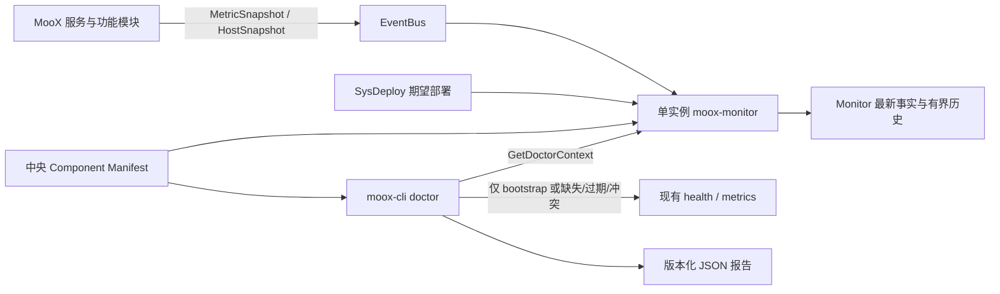

# MooX Doctor 与 Monitor V1 简化实现计划

> **For agentic workers:** REQUIRED SUB-SKILL: Use superpowers:subagent-driven-development (recommended) or superpowers:executing-plans to implement this plan task-by-task. Steps use checkbox (`- [ ]`) syntax for tracking.

**Goal:** 为个人量化交易系统交付一个单实例 Monitor 和由用户手工触发的 `moox-cli doctor bootstrap|diagnose`，能够在初始部署后检查预期进程、监控上报、关键业务功能、水位和主机资源，并输出可供用户或 AI Agent 直接解释的版本化 JSON 报告。

**Architecture:** V1 继续使用现有 `MetricSnapshot -> EventBus -> Monitor` 事实链路，Monitor 只增加有界 `GetDoctorContext` 聚合查询；Doctor 检查引擎运行在 `moox-cli`，不增加 Doctor 守护进程、DoctorMgr、独立端口或运行历史表。组件知识只保存在一份随 Monitor/CLI 编译发布的中央 Manifest 中，服务运行身份继续通过现有 health 和 Reporter 返回。Trade 模拟盘和写入型 Full Canary 拆为 V2 独立计划，不阻塞 V1 监控与手工诊断交付。

**Tech Stack:** Go 1.25、tRPC-Go、Protocol Buffers、SQLite/GORM、Prometheus client、NATS JetStream、Cobra、YAML、JSON Schema、Shell。

## Global Constraints

- MooX 是个人单用户量化系统，Monitor 只有一个实例，不实现 HA、Peer、Leader Election、Lease 或自动 Failover。
- V1 Doctor 只提供 `bootstrap` 和 `diagnose`，由用户或 AI Agent 显式触发；不实现后台 Run、调度执行、自动重试、自动修复或自动重启。
- V1 不实现 Trade 模拟盘和 `full`；它们必须进入独立 V2 计划并单独验收。
- 不部署 Prometheus Server、Pushgateway、Tracing 后端或新的日志平台。
- 不持续抓取服务 `/metrics`；Monitor 继续消费 Reporter 上报，CLI 只在 bootstrap 或 Monitor 事实缺失、过期、冲突时做有界直读。
- **Storage 冻结边界：Storage 正在大规模重构，V1 不修改 `modules/storage/**`，不新增或调整 Storage proto、配置、Schema、Reporter、指标埋点、内部 RPC 或测试，也不依赖重构中的内部接口和最终进程拓扑。**
- V1 只读 Storage 已有的 SysDeploy、health 和 Reporter/metrics 事实；Storage 功能水位和跨 Storage pipeline 检查统一标记为 `SKIPPED(storage_observability_deferred)`，不得伪造 `PASS`，也不进入本计划完成门禁。
- 不允许任意 Shell、SQL、PromQL、脚本插件或动态检查 DSL；本地检查必须映射到代码中的固定 Runner ID。
- 所有 API、CLI、Go 模型和 JSON 字段统一使用 `Observation`，面向用户显示“诊断依据”，Doctor 范围不使用 `Evidence`。
- 默认部署目标是 MooX 当前 Linux 单节点发布形态；bootstrap 必须在目标节点运行，远程用户通过现有 SSH 工具执行整条 CLI 命令。macOS/Windows 仍可构建 CLI，但 V1 不为它们实现远程服务管理、磁盘身份或重启复验 Runner。
- 所有读取必须有数量、字节和超时上限；超过上限返回明确错误，不能截断成看似完整的成功报告。

---

## 计划状态

本文件是 2026-07-19 Doctor/Monitor 方案的 V1 执行计划。原方案中 Trade Sim、Strategy 持久 Dispatcher、Collector Synthetic Canary 和 Full Canary 已从 V1 移除，不能作为 V1 完成门禁，也不得以“顺手实现”的方式混入 V1 提交。

V1 完成后，用户应能在新部署节点运行：

```bash
moox-cli doctor bootstrap --format json
moox-cli doctor diagnose --format json
```

两条命令都在前台完成并直接返回报告。需要保存报告时由 `--output <path>` 写入用户指定位置；Monitor 不保存 Doctor Run，也不提供 `start/get/list/cancel/rerun` API。

## V1 范围

### 必须实现

- 删除 Monitor 多实例和告警 Owner 仲裁，只保留单实例调度、采集、存储、查询和告警。
- 建立“发布包期望清单、SysDeploy 期望部署、运行时 Observation”三层事实，能够发现应部署但未登记、应运行但未就绪、已就绪但 Reporter 未上报的不同故障。
- 统一非 Storage 独立进程的 `service_name`、`instance_id`、`node_id`、`boot_id` 和部署身份；Storage 只映射当前已有身份，不重命名。
- 补齐非 Storage 关键进程 Reporter 和 EventBus metrics 认证链路。
- 为 Collector、CloudNode、Factor、Strategy、Trade、Archive 和 Monitor 增加最小功能指标与配置白名单水位；Storage 仅展示已有事实和明确的延期状态。
- Monitor 提供有界 `GetDoctorContext`，聚合预期进程、health、Reporter freshness、功能指标、水位、HostAgent 资源和磁盘剩余天数。
- CLI 提供 `bootstrap` 和 `diagnose`，输出稳定 JSON、可选 text/Markdown，以及明确的诊断依据、缺失事实、阻断项和人工恢复动作 ID。
- 完成全新部署 E2E、服务停止、Reporter 中断、配置缺失、磁盘样本不足等故障注入。

### 明确不实现

- 不实现 `DoctorMgr`、独立 `11422` 端口、`t_monitor_doctor_runs`、后台 Run、取消、运行历史和 Retention。
- 不实现每个服务的 `/diagnostics/v1/manifest` 或 `/diagnostics/v1/snapshot?mode=deep`。
- 不在 health listener 上执行可能超过 3 秒的数据库深查询。
- 不把组件 Manifest 分发成每个服务各自维护的一份文件。
- 不实现 `full`、`moox_doctor` Canary、Synthetic Collector Source、Trade SimulatedVenue 或 Strategy -> Trade Dispatcher 改造。
- 不实现 `bootstrap --record-baseline`、主机重启验证或跨平台服务管理 Runner。
- 不增加 SLO、错误预算、健康分数、置信度评分、覆盖率表或 Doctor 事件表。
- 不为 Doctor 修改 `modules/storage/**`，也不要求 Collector、Factor 或其他模块适配仍在变化的 Storage 接口；Storage 重构完成后另立接入计划。

### Storage 冻结边界

| V1 允许 | V1 禁止 |
| --- | --- |
| 从中央 Manifest/SysDeploy 判断 Storage 进程是否应部署 | 修改 `modules/storage/**` 的代码、配置、Proto、Schema 或测试 |
| 读取 Storage 当前已有 `/healthz`、`/readyz` 和 Reporter/metrics 事实 | 统一、重命名或新增 Storage Reporter 身份和 timer |
| 对真实 health 失败生成 `FAIL`，对已有事实缺失或冲突如实展示 | 设计或埋点 `Primary commit -> View visible` 最终水位契约 |
| 把 Storage 功能诊断和跨 Storage pipeline 显式标为延期 | 为 Doctor 修改 Collector/Factor 等调用方以适配重构中的 Storage API |

Storage 的进程存活检查仍属于 V1，但功能状态不属于 V1。`service.health:<storage-scope>` 按现有接口正常判定；`monitor.reporter_coverage`、`module.freshness` 和 `module.pipeline_lag` 中需要新增 Storage 契约的部分返回 `SKIPPED`，Observation 使用固定原因 `storage_observability_deferred`。`SKIPPED` 不影响 V1 范围内的总体结论，但报告不得宣称已覆盖 Storage 功能正确性。

## V1 架构



### 职责分离

| 组件 | V1 唯一职责 | 明确不负责 |
| --- | --- | --- |
| Monitor | 收集和保存事实、执行现有阈值告警、提供有界 `GetDoctorContext` | Doctor DAG、根因推断、写入型验证、运行历史 |
| `packages/doctor` | 中央 Manifest、固定检查模型、依赖传播、报告模型与 JSON Schema | 网络、数据库或业务 RPC |
| `moox-cli doctor` | 执行固定 Runner、组合 Context 和直读 Observation、生成报告 | 后台任务、自动修复、任意命令执行 |
| SysDeploy | 当前期望部署记录及节点归属 | 运行时健康事实、业务功能判断 |
| Reporter/HostAgent | 上报服务指标或主机快照 | Doctor 结论与恢复动作 |

### Doctor 模式

| 模式 | 用途 | 主要数据来源 | 副作用 | 默认总时限 |
| --- | --- | --- | --- | --- |
| `bootstrap` | 初始部署、升级或服务重启后的手工自检 | 中央 Manifest、发布包期望清单、SysDeploy、现有 health/metrics、目标节点固定本地 Runner | 只允许临时文件权限探针 | 2 分钟 |
| `diagnose` | 对当前故障进行手工定位 | 优先读取 Monitor Context；仅对缺失、过期、冲突项直读现有 health/metrics | 无 | 2 分钟 |

`full` 是 V2 保留名称。V1 CLI 不注册该命令，也不返回半实现的 `unavailable` 命令占位。

### V1 副作用边界

| 操作 | 允许写入 | 必须保证 |
| --- | --- | --- |
| Monitor 正常运行 | 现有 Monitor SQLite、指标 Storage、告警状态 | 不新增 Doctor Run 或 Context 表 |
| `bootstrap.path_permissions` | 目标目录中的 `.moox-doctor-probe-<pid>` 临时文件 | `create -> fsync -> close -> remove`；失败也尝试删除；文件名固定生成，禁止用户输入 |
| `bootstrap`/`diagnose` 报告 | stdout；显式 `--output` 指定文件 | 原子临时文件 + rename；不默认写工作目录 |
| health/metrics 直读 | 无 | GET only、HMAC、超时和响应字节上限 |

除上述临时文件外，V1 Doctor 不写 Storage、Collector、CloudNode、Strategy、Trade 或 EventBus 业务事实。

## 固定契约

### 中央 Component Manifest

`packages/doctor/components.yaml` 是组件知识的唯一来源，并通过 `go:embed` 同时进入 Monitor 和 CLI。它不由每个服务单独返回，也不允许部署后动态增加 Runner。

每个独立进程条目只包含：

```text
component_id
service_name
role
description
duties[]
inputs[]
outputs[]
dependencies[]
transport                 # reporter | host_snapshot | health_only
functional_observability  # active | deferred | not_applicable
health_path               # /readyz
config_paths[]
writable_paths[]
recovery_action_ids[]
required_in_default_profile
```

约束：

- `service_name` 必须对应独立部署进程，不得填写 Trade RPC endpoint、Storage 内部 RPC endpoint 或 timer service。
- Storage 条目在重构完成前固定为 `functional_observability: deferred`；V1 功能指标已接入的组件使用 `active`，只做进程检查的组件使用 `not_applicable`。
- `service_name` 和 `component_id` 全局唯一，依赖必须引用已有 `component_id`。
- Manifest 最多 64 个独立进程条目；超过上限在构建测试和运行加载时都失败。
- `config_paths` 和 `writable_paths` 只能是发布目录中的相对路径模板，不允许 `..`、glob、Shell 或环境变量展开。
- `required_in_default_profile=true` 的组件必须出现在 `examples/service-deployments.seed.yaml` 的 `deployment_mode: process` 条目中。
- 发布包的中央 Manifest checksum 必须进入 release manifest；CLI 报告记录该 checksum。

### 期望部署与运行事实

三层事实不能混用：

| 层次 | 来源 | 回答的问题 |
| --- | --- | --- |
| 发布包期望 | 中央 Manifest + 安装包内 `service-deployments.seed.yaml` | 默认部署应该包含哪些独立进程 |
| 当前期望部署 | SysDeploy 全量记录，按中央 Manifest 过滤 | 当前节点明确要求哪些进程处于 active |
| 当前运行事实 | health、Reporter、HostAgent、功能水位 | 进程和功能现在是否正常 |

固定判断：

- 默认必需组件未出现在安装包 seed：发布门禁失败。
- bootstrap 中，安装包 seed 的 process 条目未登记到目标节点 SysDeploy：`FAIL`，恢复动作 `apply_service_deployments_seed`。
- SysDeploy 条目为 `disabled`：不期待运行，Check 为 `SKIPPED`。
- SysDeploy active 但 health 缺失：`FAIL`。
- 对 `functional_observability: active` 组件，health 正常但 Reporter 超过 2 个周期未出现：`WARN`；超过 4 个周期仍缺失：`FAIL`。Storage 不应用此新增门禁。
- Manifest、SysDeploy 和 health 的 service/instance/node 身份冲突：`FAIL`，不能选择其中一份继续判定；active 组件的 Reporter 身份也参与此判断，Storage Reporter 冲突只进入延期 Observation。
- web-host 使用 `health_only`，HostAgent 使用 `host_snapshot`，其余默认进程使用 `reporter`。

Monitor 的 SysDeploy Source 必须读取全量部署记录，而不是只调用 `ListActiveServiceDeployments`。是否期待运行由 `status` 决定，是否属于独立进程由中央 Manifest 决定，不依赖当前未持久化的 `deployment_mode` 字段。

### 服务运行身份

固定字段：

```text
service_name
instance_id = <service_name>@<node_id>
node_id
boot_id                 # 每次进程启动唯一
version
git_commit
build_time
config_hash
started_at
host_boot_id            # 仅 HostAgent 提供
```

- Reporter `boot_id` 表示进程启动，不得使用 OS host boot ID，也不得跨重启复用。
- 非 Storage 部署注入稳定 `MOOX_NODE_ID`、`MOOX_INSTANCE_ID`；启动 wrapper 在每次 exec 前生成新的 `MOOX_BOOT_ID`，不得把 boot ID 固化进持久 env 文件。Storage 当前 env/wrapper 不在 V1 修改。
- Local Dev 允许 `<service>@local`，但 `node_id` 必须显式为 `local`。
- 非 Storage health 响应在现有 `Response` 中补充 `boot_id/build_time/config_hash/pipeline_config_hash`，不新增 diagnostics 路由；Storage 继续读取当前响应，不要求采用新字段。
- 非 Storage Reporter 未配置 EventBus 时继续 best effort 降级，但 health details 必须显示 reporter disabled/error，不能静默成功。

### Check、依赖和结论

Check 固定状态：

```text
PASS / WARN / FAIL / UNKNOWN / BLOCKED / SKIPPED
```

依赖传播使用以下真值表：

| 前置状态 | 必需依赖的下游行为 | 可选依赖的下游行为 |
| --- | --- | --- |
| `PASS` | 执行 | 执行 |
| `WARN` | 执行，并继承降级上下文 | 执行 |
| `FAIL` | `BLOCKED` | 执行并记录缺失能力 |
| `UNKNOWN` | `BLOCKED` | 执行并记录事实不足 |
| `BLOCKED` | `BLOCKED` | 执行并记录事实不足 |
| `SKIPPED` | 配置错误；必需依赖不能被跳过 | 执行 |

报告固定结论：

```text
HEALTHY / DEGRADED / UNHEALTHY / INCONCLUSIVE
```

优先级固定为：

1. 存在根 `FAIL`：`UNHEALTHY`。
2. 无根 `FAIL`，但存在阻断链上的根 `UNKNOWN`：`INCONCLUSIVE`。
3. 只有 `WARN`：`DEGRADED`。
4. 其余：`HEALTHY`。

`root_cause_check_ids` 只包含没有失败或未知前置依赖的根 `FAIL`；`blocking_check_ids` 包含没有未知前置依赖的根 `UNKNOWN`。已知故障不能被 UNKNOWN 覆盖成 `INCONCLUSIVE`。

### Observation

```text
Observation
  source
  observed_at
  expires_at
  summary
  digest
  error
```

- `checks[].observations` 保存每项检查的诊断依据。
- `missing_observations` 明确列出缺失事实。
- Observation 只保存摘要和 SHA-256，不保存完整指标文本、原始日志、配置正文、Secret 或业务 Payload。
- summary 最大 2 KiB；每个 Check 最多 16 条 Observation；单份报告最多 256 个 Check、2 MiB；单次 `--check` 最多选择 64 个 ID。

### 最小功能指标和水位

V1 使用固定的低基数指标：

```text
moox_module_last_success_timestamp_seconds{module}
moox_module_last_error_timestamp_seconds{module}
moox_module_runs_total{module,result}
moox_module_backlog{module}
moox_business_watermark_timestamp_seconds{module,stage,pipeline}
```

约束：

- `module`、`stage`、`result` 来自代码中的有限枚举。
- 不使用 `space`、`dataset`、subject、factor、strategy、account、order、execution、task 或 run ID 作为 label。
- `pipeline` 来自发布目录共享只读文件 `config/monitor-pipelines.yaml`，默认最多 32 个；配置保存 `pipeline -> space/dataset/freq` 映射。
- 部署脚本把同一份 pipeline 文件路径通过 `MOOX_MONITOR_PIPELINES_FILE` 注入各 Reporter 进程和 Monitor；生产者与消费者不得各自维护不同白名单。
- Reporter 单进程最多发布 256 条 Doctor 依赖 series；超过上限 readiness 降级并拒绝新增 series。
- 水位必须从权威持久状态初始化，进程重启后不得从 0 或当前时间重新开始。
- 水位是业务数据时间，只能单调推进；当前时间不能冒充业务成功。

首批水位：

| 模块 | 输入水位 | 输出水位 |
| --- | --- | --- |
| Collector | source closed window | collection task committed |
| CloudNode | job dispatch | job result |
| Storage | 延期：只读已有事实 | 延期：不在 V1 新增水位 |
| Factor | factor input | factor result |
| Strategy | factor/view input | strategy evaluation |
| Trade | execution accepted | order reconciliation |
| Archive | journal accepted | archive completion |

空闲判断：

- 没有 enabled workload、没有新输入或市场窗口尚未关闭：`SKIPPED/PASS(IDLE)`，不得因 last success 不变告警。
- 输入水位不动且输出水位不动：`PASS(IDLE)`。
- 输入水位持续前进但输出超过容忍时间未前进：`FAIL`。
- enabled workload 从未运行且关键输入事实缺失：`UNKNOWN`。
- 合法空策略目标、0 权重和无交易需求不是失败。
- pipeline 任一必需阶段依赖延期的 Storage 功能契约时，对应 lag Check 为 `SKIPPED(storage_observability_deferred)`，不能用相邻模块水位推断 Storage 已正确处理。

默认阈值：Reporter 超过 2 个周期为 `WARN`、4 个周期为 `FAIL`；health 连续 3 次失败为 `FAIL`；输出 Lag 超过 pipeline 配置容忍值为 `FAIL`；磁盘预计剩余天数 `<=14` 为 `WARN`、`<=7` 为 `FAIL`。

磁盘天数使用最近 7 天每日 `used_bytes` 增量中位数，至少 3 个有效间隔；可用容量先扣除 `max(总容量 10%, 5 GiB)`。样本不足为 `UNKNOWN`，增长速度 `<=0` 显示“当前未增长”，不能输出伪精确无限值。

### Monitor GetDoctorContext

`GetDoctorContext` 继续属于 `trpc.moox.monitor.MonitorMgr`，复用 `11410`，不新增服务或端口。

请求支持：

```text
node_id
component_ids[]          # 最多 64
pipeline_ids[]           # 最多 32
```

响应包含：

```text
generated_at
manifest_checksum
expected_components[]
health_observations[]
reporter_observations[]
module_observations[]
watermarks[]
host_resources[]
disk_forecasts[]
active_alerts[]
missing_observations[]
```

API 约束：

- 响应最大 2 MiB，组件 64、pipeline 32、告警 100、每类 Observation 128。
- 使用现有 SysDeploy、check result、metric latest/catalog、Host Storage 和 alert repository，不新增 Context 表。
- 不抓 `/metrics`、不运行 CLI Runner、不执行根因分析。
- 过期阈值来自 Reporter interval 和 pipeline 配置；缺失、过期和身份冲突必须显式返回。
- Storage 返回已有 health/Reporter Observation；其 Manifest 条目携带 `functional_observability: deferred`，Context 不增加另一套覆盖模型，也不合成 Storage 成功状态。
- 超过限制返回参数或资源耗尽错误，不截断。

### CLI 报告和命令

V1 命令：

```text
moox-cli doctor bootstrap [--node <id>] [--check <id>] [--format json|text|markdown] [--output <path>]
moox-cli doctor diagnose  [--node <id>] [--check <id>] [--format json|text|markdown] [--output <path>]
```

- JSON 是 canonical report；text/Markdown 只做 renderer，不维护第二套状态模型。
- 每次命令生成新的本地 `run_id`，不提供 request 幂等或服务端运行历史。
- `bootstrap` 使用安装包期望、SysDeploy、health、metrics 和目标节点固定本地 Runner；不依赖 Monitor 正常。
- `diagnose` 优先读取 Monitor Context；只对缺失、过期或冲突 component 直读现有 `/readyz`、`/healthz`、`/metrics`。
- Monitor 不可用时 `diagnose` 返回 `INCONCLUSIVE` 并引用 `run_bootstrap` 恢复动作，不自动切换成另一套诊断流程。
- 直读只允许 GET、HMAC、5 秒超时、1 MiB 响应上限；不增加 `deep` query。
- bootstrap 拒绝检查非本机 node；远程诊断由操作者通过现有 SSH 工具在目标节点启动完整 CLI，不在 Doctor 内实现第二套 SSH 传输。
- Exit code：`0=HEALTHY`、`1=DEGRADED`、`2=UNHEALTHY`、`3=INCONCLUSIVE/调用错误`。

第一批 Check：

实例级 Check ID 使用 `<component_id>@<node_id>` scope，pipeline Check 使用 Manifest 中的 module ID 和白名单 pipeline ID；展开后仍受 256 Check 总上限约束。

| Check ID 模板 | 模式 | 必需依赖 | 可选依赖 |
| --- | --- | --- | --- |
| `bootstrap.release_contract` | bootstrap | 无 | 无 |
| `bootstrap.inventory` | bootstrap | `bootstrap.release_contract` | 无 |
| `bootstrap.service_identity:<scope>` | bootstrap | `bootstrap.inventory` | 无 |
| `bootstrap.network:<scope>` | bootstrap | `bootstrap.inventory` | 无 |
| `bootstrap.path_permissions:<scope>` | bootstrap | `bootstrap.inventory` | 无 |
| `bootstrap.service_autostart:<scope>` | bootstrap | `bootstrap.inventory` | 无 |
| `diagnose.context` | diagnose | 无 | 无 |
| `service.health:<scope>` | bootstrap/diagnose | bootstrap 时依赖 `bootstrap.inventory` | diagnose 时可选依赖 `diagnose.context`，允许固定直读补证 |
| `monitor.metrics_delivery:<node_id>` | bootstrap/diagnose | EventBus 与 Monitor 的 `service.health:<scope>` | 无 |
| `monitor.reporter_coverage:<scope>` | bootstrap/diagnose | 对应 `monitor.metrics_delivery:<node_id>` | 对应 `service.health:<scope>`；Storage 新契约延期时为 `SKIPPED` |
| `module.freshness:<scope>` | diagnose | 对应 `monitor.reporter_coverage:<scope>` | 对应 `service.health:<scope>`；Storage 为 `SKIPPED` |
| `module.pipeline_lag:<module>:<pipeline>` | diagnose | 上下游 `module.freshness:<scope>` | 依赖 Storage 延期能力时为 `SKIPPED` |
| `host.disk_forecast:<node_id>` | diagnose | 无 | HostAgent 的 `service.health:<scope>` |

恢复动作只生成建议，不执行。V1 固定 ID：`apply_service_deployments_seed`、`verify_service_identity`、`repair_path_permissions`、`verify_eventbus_credentials`、`restart_service_manually`、`inspect_pipeline_input`、`replay_factor_window_manually`、`free_disk_space`、`run_bootstrap`。`storage_observability_deferred` 是延期原因而非可执行恢复动作。

## 后续边界，不属于本计划验收

后续至少拆成三个独立计划，按以下顺序推进：

1. Storage 重构后可观测性接入：仅在 Storage 接口和进程拓扑冻结后，重新确认 canonical identity、Reporter 覆盖、权威持久水位、`Primary commit -> View visible` 语义、pipeline 映射和独立 E2E；不得从本计划直接开始实施。
2. Trade 模拟盘与 Strategy 持久 Dispatcher：作为交易产品能力单独设计、实现、审查和 E2E，不依赖 Doctor 才能使用。
3. Full Canary：在 Storage 可观测性接入和 Trade Sim 都稳定后，用固定 `moox_doctor` 资源串联 Collector、CloudNode、Storage、Factor、Strategy 和 Trade Sim。

V2 设计前必须先提供逐模块副作用矩阵，至少覆盖 Monitor report、Collector Task、CloudNode JobItem/KV、Storage 数据、Strategy Run/Request、Trade Order/Fill/Ledger 和 EventBus message。所有业务数据必须位于 `moox_doctor`，所有运行事实必须携带可追溯 `doctor_run_id` 或通过不可变关联定位到该 ID。

Monitor 启动时不得自动跨服务清理 Canary。遗留运行只标记为 `ABORTED/PENDING_CLEANUP`；清理由下一次显式 `doctor full` preflight 或独立 `doctor cleanup` 执行。是否需要后台 DoctorMgr 必须由 V1 的真实使用数据证明，不能作为 V2 默认前提。

## 当前代码差距

| 范围 | 当前事实 | V1 处理 |
| --- | --- | --- |
| Monitor HA | 存在 peer、Peer 表/API、peer timer、Owner 仲裁 | 删除，收敛为单实例 |
| SysDeploy Source | 只读取 active deployments | 改为读取全量记录，使用 Manifest 识别独立进程，status 决定是否期待运行 |
| Reporter 身份 | Storage/Trade 名称与部署进程名不一致，boot ID 依赖部署注入 | 统一非 Storage canonical identity，部署生成 boot ID；Storage 当前身份只读并标记延期 |
| Reporter 覆盖 | Archive、Strategy、Gateway 缺 reporter；Storage shard 缺 timer | 补齐 Archive、Strategy、Gateway 并加入覆盖门禁；Storage shard 不在 V1 修改或门禁中 |
| EventBus metrics 凭证 | Topic/Durable/ACL 与 Monitor credential 不完整 | 一个共享 metrics publisher 角色和一个 Monitor consumer 凭证 |
| 功能指标 | 多数模块只有 RPC/进程指标 | 为非 Storage 模块增加固定低基数指标和白名单 pipeline 水位；跨 Storage 能力明确延期 |
| Storage 重构 | 内部接口、进程拓扑和最终指标契约正在变化 | V1 只读现有事实，禁止修改 `modules/storage/**`，重构完成后另立接入计划 |
| Doctor | `modules/doctor/` 为空，没有可执行能力 | 不创建 daemon；共享 Core 放 `packages/doctor`，编排放 CLI |
| health | 已有 HMAC `/healthz`、`/readyz`、`/metrics` | 非 Storage 服务补运行身份字段，不增加 deep diagnostics；Storage 当前响应只读 |
| Trade Sim / Full | 尚未实现 | 移出 V1，另立计划 |

## 阶段门禁

| 阶段 | 任务 | 进入下一阶段前必须满足 |
| --- | --- | --- |
| A. 契约与单实例 | Task 1-2 | Manifest、状态真值表、期望部署和单 Monitor 契约通过 |
| B. 事实可信 | Task 3-4 | 非 Storage 身份、Reporter、EventBus、功能指标和水位契约通过；Storage 延期状态可见 |
| C. 手工 Doctor | Task 5-6 | Context、bootstrap、diagnose 和报告 Schema 通过 |
| D. 交付 | Task 7 | 发布、文档、两轮审查、全量 Verify 和部署 E2E 通过 |

每个 Task 独立提交，推荐标题依次为：`feat(doctor): add v1 contracts`、`refactor(monitor): enforce single instance inventory`、`feat(monitor): complete reporter delivery`、`feat(monitor): add module watermarks`、`feat(monitor): expose doctor context`、`feat(cli): add bootstrap and diagnose`、`docs(doctor): verify v1 operations`。

## 实施任务

### Task 1: 锁定 V1 Doctor Core、状态真值表和中央 Manifest

**Files:**
- Create: `packages/doctor/go.mod`
- Create: `packages/doctor/model.go`
- Create: `packages/doctor/model_test.go`
- Create: `packages/doctor/manifest.go`
- Create: `packages/doctor/manifest_test.go`
- Create: `packages/doctor/engine.go`
- Create: `packages/doctor/engine_test.go`
- Create: `packages/doctor/report.go`
- Create: `packages/doctor/report_test.go`
- Create: `packages/doctor/report.schema.json`
- Create: `packages/doctor/components.yaml`
- Modify: `go.work`
- Modify: `scripts/check/check-package-boundaries.sh`
- Modify: `scripts/test/contract/test-release-contract.sh`
- Modify: `examples/service-deployments.seed.yaml`

**Interfaces:**
- Produces: `doctor.Mode`, `doctor.CheckStatus`, `doctor.Conclusion`, `doctor.Observation`, `doctor.CheckResult`, `doctor.Report`, `doctor.Manifest`, `doctor.Engine`。
- Produces: `doctor.LoadEmbeddedManifest()`，供 Monitor 和 CLI 使用相同组件知识。
- Produces: `doctor.Engine.Run(ctx, specs, runner)`，只处理依赖、超时、状态传播和报告，不导入任何 `modules/*`。

- [ ] 先写 RED 表测试，锁定两种 Mode、六种 Check 状态、四种结论、依赖真值表、`root_cause_check_ids`、`blocking_check_ids`、取消和总超时传播。
- [ ] 固定报告字段：`schema_version/run_id/mode/started_at/finished_at/conclusion/checks/root_cause_check_ids/blocking_check_ids/missing_observations/manifest_checksum`；Storage 延期直接复用 `checks[].status=SKIPPED` 和 Observation，不增加第二套覆盖字段。
- [ ] 报告序列化稳定并通过 JSON Schema 和 golden test；Observation、256 Check、64 个显式选择和 2 MiB 总大小在执行/序列化前校验。
- [ ] Manifest 校验最多 64 个条目、component/service 唯一、依赖存在、transport 与 functional observability 枚举、路径模板安全、恢复动作 ID 非空且属于固定集合。
- [ ] 中央 Manifest 只登记独立进程；用测试拒绝 `trade_account`、`trade_order`、Storage 内部 endpoint 和 timer service。
- [ ] 用契约测试锁定所有 Storage 进程条目为 `functional_observability: deferred`，并拒绝为其注册 V1 Storage 功能 Check 或 watermark stage。
- [ ] 在 Manifest 和默认 seed 中补齐独立节点进程 `moox_gateway`；不能把 public `admin_gateway`、Caddy 或业务 RPC endpoint 当成它的替代品。
- [ ] 发布契约交叉验证所有 `required_in_default_profile` 组件都存在于 seed 的 process 条目，且 process 条目都能映射到 Manifest。
- [ ] Engine 不导入 tRPC、SQLite、Prometheus 或业务客户端。
- [ ] 运行：

```bash
(cd packages/doctor && go test -count=1 ./...)
./scripts/check/check-package-boundaries.sh
bash scripts/test/contract/test-release-contract.sh
```

### Task 2: 删除 Monitor 多实例并建立期望部署契约

**Files:**
- Delete: `modules/monitor/internal/peer/`
- Delete: `modules/monitor/internal/domain/peer.go`
- Delete: `modules/monitor/internal/store/peer.go`
- Delete: `modules/monitor/internal/store/peer_availability.go`
- Delete: `modules/monitor/internal/store/peer_availability_test.go`
- Delete: `modules/monitor/internal/alerting/owner.go`
- Delete: `modules/monitor/internal/alerting/owner_test.go`
- Modify: `modules/monitor/internal/config/config.go`
- Modify: `modules/monitor/internal/config/config_test.go`
- Modify: `modules/monitor/internal/bootstrap/service_runtime.go`
- Modify: `modules/monitor/internal/bootstrap/schedule_timers.go`
- Modify: `modules/monitor/internal/bootstrap/schedule_timers_test.go`
- Modify: `modules/monitor/internal/alerting/evaluator.go`
- Modify: `modules/monitor/internal/alerting/evaluator_test.go`
- Modify: `modules/monitor/internal/alerting/webhook.go`
- Modify: `modules/monitor/internal/domain/alert.go`
- Modify: `modules/monitor/internal/hostmetrics/alerts.go`
- Modify: `modules/monitor/internal/hostmetrics/alerts_test.go`
- Modify: `modules/monitor/internal/metrics/domain.go`
- Modify: `modules/monitor/internal/metrics/evaluator.go`
- Modify: `modules/monitor/internal/metrics/evaluator_test.go`
- Modify: `modules/monitor/internal/metrics/notification.go`
- Modify: `modules/monitor/internal/metrics/notification_test.go`
- Modify: `modules/monitor/internal/metrics/rule_store.go`
- Modify: `modules/monitor/internal/metrics/rule_store_test.go`
- Modify: `modules/monitor/internal/sysdeploy/sync.go`
- Modify: `modules/monitor/internal/sysdeploy/sync_test.go`
- Modify: `modules/monitor/internal/rpc/convert.go`
- Modify: `modules/monitor/internal/rpc/convert_test.go`
- Modify: `modules/monitor/internal/rpc/metrics.go`
- Modify: `modules/monitor/internal/rpc/metrics_test.go`
- Modify: `modules/monitor/internal/rpc/service.go`
- Modify: `modules/monitor/internal/rpc/service_test.go`
- Modify: `modules/monitor/internal/store/alert.go`
- Modify: `modules/monitor/internal/store/repositories_test.go`
- Modify: `modules/monitor/proto/monitor.proto`
- Modify: `modules/monitor/proto/monitorgen/validation.go`
- Regenerate: `modules/monitor/proto/monitorgen/monitor.pb.go`
- Regenerate: `modules/monitor/proto/monitorgen/monitor.trpc.go`
- Modify: `modules/monitor/schema/monitor.sql`
- Modify: `modules/monitor/schema/schema_test.go`
- Modify: `modules/monitor/config/app.yaml`
- Modify: `modules/monitor/config/trpc_go.yaml`
- Modify: `modules/monitor/go.mod`
- Modify: `modules/monitor/go.sum`
- Modify: `modules/admin/internal/service/sysdeploy/defaults.go`
- Modify: `modules/admin/internal/service/sysdeploy/defaults_test.go`
- Modify: `modules/admin/internal/gateway/config_test.go`
- Modify: `scripts/deploy/deploy-moox.sh`
- Modify: `scripts/test/contract/test-deploy-moox-gateway.sh`
- Create: `scripts/test/contract/test-monitor-coverage-contract.sh`
- Modify: `web/src/api/monitor/index.ts`
- Modify: `web/src/api/monitor/types.ts`
- Modify: `web/src/views/ops/service-monitor/index.vue`
- Modify: `modules/monitor/test/e2e_test.go`

**Interfaces:**
- Consumes: `doctor.LoadEmbeddedManifest()`。
- Produces: SysDeploy Source 的 `DesiredDeployments(ctx)`，读取全量记录并返回 status，不再只返回 active rows。
- Produces: `(node_id, service_name)` 期望进程集合，供 Task 5 Context 使用。

- [ ] 先把测试改为单实例契约：Scheduler、Metric Rule 和 Alert evaluator 只由本进程执行，SQLite 状态继续防重，但不做 Owner 选举。
- [ ] 删除 PeerConfig、peer puller、peer timer、GetPeerSnapshot、ListMonitorInstances、active_instances、owner_instance_id 和对应 Web 展示。
- [ ] 删除 `t_monitor_instances`、`t_monitor_peer_snapshots` 及 trigger；项目按全新部署处理，不增加旧表兼容读取。
- [ ] SysDeploy gateway ACL 为 Monitor/CLI 增加有界 `ListServiceDeployments`，保留现有 active API 给其他调用者；客户端每页 100，扫描总量超过 500 时失败。
- [ ] Source 分页读取 active/disabled 记录，用中央 Manifest service name 过滤独立进程；不得依赖 seed 中未持久化的 `deployment_mode`。
- [ ] 覆盖契约验证 seed、SysDeploy defaults、Manifest、health URL、transport 和 canonical service name 一致。
- [ ] SysDeploy defaults 和 seed 都包含 `moox_gateway` 独立进程记录及自身 health URL，Monitor 以该进程的 Reporter/health 判断节点网关，不借用 Admin health。
- [ ] 部署脚本删除 `--monitor-peer` 和 peer YAML 注入，不影响多计算节点的 Gateway 路由。
- [ ] 运行：

```bash
make -C modules/monitor/proto all
(cd modules/monitor && go test -count=1 ./internal/config ./internal/bootstrap ./internal/alerting ./internal/sysdeploy ./internal/rpc ./internal/store ./schema)
(cd modules/admin && go test -count=1 ./internal/service/sysdeploy)
bash scripts/test/contract/test-monitor-coverage-contract.sh
bash scripts/test/contract/test-trpc-plugin-config.sh
(cd web && pnpm build:prod)
```

### Task 3: 统一运行身份并补齐 Reporter/EventBus 链路

**Files:**
- Modify: `packages/report/config.go`
- Create: `packages/report/config_test.go`
- Modify: `packages/report/handler.go`
- Modify: `packages/report/handler_test.go`
- Modify: `packages/healthz/healthz.go`
- Modify: `packages/healthz/healthz_test.go`
- Modify: `modules/trade/internal/bootstrap/bootstrap.go`
- Modify: `modules/trade/internal/bootstrap/bootstrap_test.go`
- Modify: `modules/archive/internal/bootstrap/app.go`
- Modify: `modules/archive/internal/bootstrap/app_test.go`
- Modify: `modules/archive/config/trpc_go.yaml`
- Modify: `modules/archive/go.mod`
- Modify: `modules/archive/go.sum`
- Modify: `modules/strategy/internal/bootstrap/bootstrap.go`
- Modify: `modules/strategy/internal/bootstrap/config.go`
- Modify: `modules/strategy/internal/bootstrap/config_test.go`
- Modify: `modules/strategy/config/trpc_go.yaml`
- Modify: `modules/strategy/go.mod`
- Modify: `modules/strategy/go.sum`
- Modify: `modules/gateway/internal/bootstrap/bootstrap.go`
- Modify: `modules/gateway/internal/bootstrap/bootstrap_test.go`
- Modify: `modules/gateway/internal/health/state.go`
- Modify: `modules/gateway/internal/health/state_test.go`
- Modify: `modules/gateway/config/trpc_go.yaml`
- Modify: `modules/gateway/go.mod`
- Modify: `modules/gateway/go.sum`
- Modify: `modules/eventbus/internal/health/server.go`
- Modify: `modules/eventbus/internal/health/server_test.go`
- Modify: `modules/eventbus/internal/config/config_defaults.go`
- Modify: `modules/eventbus/internal/config/config_test.go`
- Modify: `modules/eventbus/config/app.yaml`
- Modify: `modules/admin/cmd/cli/eventbus_credentials.go`
- Modify: `modules/admin/cmd/cli/eventbus_credentials_test.go`
- Modify: `modules/monitor/internal/bootstrap/metrics_runtime.go`
- Modify: `modules/monitor/internal/bootstrap/bootstrap_test.go`
- Modify: `scripts/deploy/deploy-moox.sh`
- Modify: `scripts/test/contract/test-deploy-moox-eventbus.sh`
- Modify: `scripts/test/contract/test-deploy-moox-gateway.sh`

**Interfaces:**
- Produces: health `Response.BootID/BuildTime/ConfigHash/PipelineConfigHash`。
- Produces: 非 Storage Reporter identity 与 Manifest/SysDeploy 相同的 canonical `service_name`。
- Produces: metrics publisher credential 和 Monitor consumer credential。

- [ ] `packages/report.NewHandler` 缺 `MOOX_INSTANCE_ID/MOOX_NODE_ID/MOOX_BOOT_ID` 时失败关闭；Local Dev 也必须显式设置 `MOOX_NODE_ID=local` 和 local identity，不再隐式猜测运行模式。
- [ ] `packages/healthz` 新身份字段保持向后兼容；本任务不修改 Storage 调用点，也不把 Storage 未返回新字段判为 V1 实施失败。
- [ ] 部署脚本为非 Storage 服务固定 `instance_id=<service>@<node>`；生成的 start wrapper 在每次 start/restart 前创建新 boot ID 且不回写 env 文件；移除 HOSTNAME 作为长期 instance 默认值。不得改写 Storage 的 env、wrapper 或启动参数。
- [ ] Trade 使用 `moox_trade`，其他非 Storage 名称与中央 Manifest/SysDeploy 一致；Storage 当前名称只读，不在本任务统一或重命名。
- [ ] 为 Archive、Strategy、Gateway 增加 Reporter 和 30 秒 Timer；不得为 Storage shard 启用或修改 Reporter Timer。
- [ ] HostAgent 不重复发送通用 Reporter，web-host 不伪造 metrics transport。
- [ ] Gateway/EventBus 文本指标注册到 `prometheus.DefaultRegisterer`，health `/metrics` 和 Reporter 使用同一 Gatherer。
- [ ] EventBus 创建 metrics Topic/Stream/Durable/ACL；所有 Reporter 共享一个只发布 metrics 的角色，Monitor 使用独立只消费凭证。
- [ ] Monitor 实际读取 consumer credential；认证错误令 readiness 降级，并在 health details 暴露脱敏错误。
- [ ] Reporter 发布失败增加本地 error counter 和 last error，不增加 Outbox。
- [ ] 运行：

```bash
(cd packages/report && go test -count=1 ./...)
(cd packages/healthz && go test -count=1 ./...)
(cd modules/archive && go test -count=1 ./internal/bootstrap ./internal/health)
(cd modules/strategy && go test -count=1 ./internal/bootstrap ./internal/health)
(cd modules/gateway && go test -count=1 ./internal/bootstrap ./internal/health)
(cd modules/eventbus && go test -count=1 ./internal/config ./internal/registry ./internal/health ./internal/bootstrap)
(cd modules/trade && go test -count=1 ./internal/bootstrap)
(cd modules/monitor && go test -count=1 ./internal/bootstrap ./internal/metrics/... ./test -run MetricsEventBus)
bash scripts/test/contract/test-deploy-moox-eventbus.sh
bash scripts/test/contract/test-monitor-coverage-contract.sh
```

### Task 4: 为非 Storage 关键模块增加功能指标和白名单水位

**Files:**
- Create: `packages/report/module_metrics.go`
- Create: `packages/report/module_metrics_test.go`
- Create: `packages/report/pipelines.go`
- Create: `packages/report/pipelines_test.go`
- Create: `examples/monitor-pipelines.yaml`
- Modify: `modules/collector/internal/executor/executor.go`
- Modify: `modules/collector/internal/executor/executor_test.go`
- Modify: `modules/cloudnode/internal/rpc/job_item.go`
- Modify: `modules/cloudnode/internal/rpc/job_item_test.go`
- Modify: `modules/factor/internal/scheduler/service.go`
- Modify: `modules/factor/internal/scheduler/service_test.go`
- Modify: `modules/strategy/internal/scheduler/service.go`
- Modify: `modules/strategy/internal/scheduler/service_test.go`
- Modify: `modules/strategy/internal/store/commit.go`
- Modify: `modules/strategy/internal/store/commit_test.go`
- Modify: `modules/archive/internal/writer/scheduler.go`
- Modify: `modules/archive/internal/writer/writer.go`
- Modify: `modules/trade/internal/telemetry/metrics.go`
- Modify: `modules/trade/internal/telemetry/metrics_test.go`
- Modify: `modules/trade/internal/application/rebalance/service.go`
- Modify: `modules/trade/internal/application/rebalance/service_test.go`
- Modify: `modules/trade/internal/application/reconciliation/reconciler.go`
- Modify: `modules/trade/internal/application/reconciliation/reconciler_test.go`
- Create: `modules/monitor/internal/metrics/telemetry.go`
- Create: `modules/monitor/internal/metrics/telemetry_test.go`
- Modify: `modules/monitor/internal/metrics/consumer.go`
- Modify: `modules/monitor/internal/metrics/consumer_test.go`
- Modify: `modules/monitor/internal/config/config.go`
- Modify: `modules/monitor/internal/config/config_test.go`
- Modify: `modules/monitor/config/app.yaml`
- Modify: `scripts/deploy/deploy-moox.sh`
- Modify: `scripts/release/release.sh`

**Interfaces:**
- Produces: `report.ModuleMetrics`，只暴露固定的非 Storage module/stage/result/pipeline API。
- Produces: `report.LoadPipelineAllowlist(path)` 和共享 `config/monitor-pipelines.yaml`，最多 32 条，保存业务映射和 lag tolerance。

- [ ] `ModuleMetrics` 拒绝未知 module/stage/result/pipeline、回退水位、高基数字符串和超过 256 series 的注册；V1 枚举不包含新增 Storage stage。
- [ ] pipeline 配置拒绝重复 ID、空 space/dataset、超过 32 条和非正数 lag tolerance；参与 V1 功能指标的非 Storage 服务与 Monitor 从同一路径和 checksum 加载，checksum 不一致时 Context 返回冲突。
- [ ] 在真实成功提交点更新 last success/error、runs、backlog 和 watermark，不在请求入口提前标成功。
- [ ] Collector 只在自身 task terminal success 更新输出水位，不修改 `storage_rpc.go`，也不把 RPC 接收等同于 Storage 持久提交。
- [ ] 水位启动时从模块权威持久状态恢复；测试进程重启不会发布 0、当前时间或较旧水位。
- [ ] Monitor 自身记录 ingest 成功/拒绝/延迟、最后成功时间、consumer pending 和 DLQ。
- [ ] 覆盖四类判断测试：无 enabled workload、输入不动、输入前进输出停滞、合法空策略目标；只有第三类失败。
- [ ] pipeline 经过 Storage 延期阶段时不计算端到端 lag，固定生成 `SKIPPED(storage_observability_deferred)`；单元测试证明不会误报 `PASS` 或 `FAIL`。
- [ ] 运行：

```bash
(cd packages/report && go test -count=1 ./...)
(cd modules/collector && go test -count=1 ./internal/executor)
(cd modules/cloudnode && go test -count=1 ./internal/rpc)
(cd modules/factor && go test -count=1 ./internal/scheduler)
(cd modules/strategy && go test -count=1 ./internal/scheduler ./internal/store)
(cd modules/archive && go test -count=1 ./internal/writer)
(cd modules/trade && go test -count=1 ./internal/telemetry ./internal/application/rebalance ./internal/application/reconciliation)
(cd modules/monitor && go test -count=1 ./internal/config ./internal/metrics/...)
```

### Task 5: 实现有界 GetDoctorContext

**Files:**
- Modify: `modules/monitor/proto/monitor.proto`
- Modify: `modules/monitor/proto/monitorgen/validation.go`
- Regenerate: `modules/monitor/proto/monitorgen/monitor.pb.go`
- Regenerate: `modules/monitor/proto/monitorgen/monitor.trpc.go`
- Create: `modules/monitor/internal/doctor/context.go`
- Create: `modules/monitor/internal/doctor/context_test.go`
- Create: `modules/monitor/internal/hostmetrics/forecast.go`
- Create: `modules/monitor/internal/hostmetrics/forecast_test.go`
- Modify: `modules/monitor/internal/metrics/query.go`
- Modify: `modules/monitor/internal/metrics/query_test.go`
- Modify: `modules/monitor/internal/rpc/service.go`
- Create: `modules/monitor/internal/rpc/doctor_context.go`
- Create: `modules/monitor/internal/rpc/doctor_context_test.go`
- Modify: `modules/monitor/internal/bootstrap/service_runtime.go`
- Modify: `modules/admin/internal/service/sysdeploy/defaults.go`
- Modify: `examples/service-deployments.seed.yaml`

**Interfaces:**
- Consumes: Task 2 desired deployment set、Task 3 非 Storage Reporter identity、Task 4 非 Storage module metrics，以及 Storage 已有只读事实。
- Produces: `MonitorMgr.GetDoctorContext(GetDoctorContextReq) GetDoctorContextRsp`，供 Task 6 CLI 使用。

- [ ] Proto validation 固定 component 64、pipeline 32、响应 2 MiB；未知 ID 返回参数错误。
- [ ] Context 合并 Manifest、SysDeploy、check result、metric latest/catalog、Host Storage 和 alerts，不新增表。
- [ ] 对每个 active process 返回 health、Reporter/transport、identity、freshness 和 missing/conflict Observation。
- [ ] 对 Storage 只返回现有 health/Reporter Observation 和 Manifest 延期状态；不查询 Storage 内部 RPC，不合成成功水位，CLI 据此生成固定 `SKIPPED` Check。
- [ ] disabled process 明确返回 `expected=false`，不制造缺失告警；默认必需但 SysDeploy 缺失只由 bootstrap release/inventory check 判断。
- [ ] 磁盘 forecast 使用固定 7 天中位数算法，覆盖样本不足、负增长、安全余量、多挂载点和 14/7 天阈值。
- [ ] Context 不抓 metrics、不运行本地 Runner、不运行 Doctor Engine、不生成结论。
- [ ] API 只通过现有 MonitorMgr `11410` 和现有 Gateway route 暴露，不增加端口。
- [ ] 运行：

```bash
make -C modules/monitor/proto all
(cd modules/monitor && go test -count=1 ./internal/doctor ./internal/sysdeploy ./internal/metrics/... ./internal/hostmetrics ./internal/rpc)
(cd modules/admin && go test -count=1 ./internal/service/sysdeploy)
```

### Task 6: 实现 CLI bootstrap、diagnose 和报告渲染

**Files:**
- Create: `modules/cli/internal/doctorclient/client.go`
- Create: `modules/cli/internal/doctorclient/client_test.go`
- Create: `modules/cli/internal/doctor/bootstrap.go`
- Create: `modules/cli/internal/doctor/bootstrap_test.go`
- Create: `modules/cli/internal/doctor/diagnose.go`
- Create: `modules/cli/internal/doctor/diagnose_test.go`
- Create: `modules/cli/internal/doctor/probes.go`
- Create: `modules/cli/internal/doctor/probes_test.go`
- Create: `modules/cli/internal/doctor/render.go`
- Create: `modules/cli/internal/doctor/render_test.go`
- Create: `modules/cli/internal/command/doctor.go`
- Create: `modules/cli/internal/command/doctor_test.go`
- Modify: `modules/cli/internal/command/root.go`
- Modify: `modules/cli/internal/command/root_test.go`
- Modify: `modules/cli/internal/config/config.go`
- Modify: `modules/cli/internal/config/config_test.go`
- Modify: `modules/cli/config/cli.yaml`
- Modify: `modules/cli/go.mod`
- Modify: `modules/cli/go.sum`
- Modify: `scripts/deploy/deploy-moox.sh`

**Interfaces:**
- Consumes: `packages/doctor` Engine/Manifest/Report 和 `MonitorMgr.GetDoctorContext`。
- Produces: `moox-cli doctor bootstrap|diagnose`，canonical JSON、text/Markdown renderer 和固定 exit code。

- [ ] 命令层在网络调用前校验 mode、node、check、format、output 组合，并拒绝 bootstrap 的非本机 node；V1 不注册 `full/get/list/cancel/rerun`。
- [ ] bootstrap 对比 embedded Manifest、安装包 seed 和 SysDeploy 全量记录，再执行固定 health/network/path/autostart/Reporter 检查。
- [ ] Storage 仍执行 inventory 和现有 health 检查；新增 Reporter coverage、freshness、水位及跨 Storage pipeline Check 固定为 `SKIPPED(storage_observability_deferred)`，且报告明确当前结论只覆盖 V1 范围。
- [ ] path probe 只在 Manifest writable path 中创建固定前缀临时文件，并验证失败路径也执行删除。
- [ ] diagnose 先调用 Context；仅对 missing/stale/conflict component 直读现有 health/metrics，且直读结果不写 Monitor 历史。
- [ ] Monitor 不可用时 diagnose 生成 `INCONCLUSIVE` 报告和 `run_bootstrap` 建议，不静默切换模式。
- [ ] HMAC 客户端限制 GET、固定 path、5 秒、1 MiB；响应摘要进入 Observation，正文不进入报告。
- [ ] 本地 Runner 只读取固定身份、端口、文件权限、服务 enabled/active 和 boot ID；测试拒绝用户提供命令、路径覆盖、环境变量展开或非 Manifest 路径。
- [ ] JSON 通过 Schema；text/Markdown renderer 只读取 Report；`--output` 使用同目录临时文件和原子 rename。
- [ ] 运行：

```bash
(cd modules/cli && go test -count=1 ./internal/doctor/... ./internal/doctorclient/... ./internal/command ./internal/config)
(cd packages/doctor && go test -count=1 ./...)
```

### Task 7: 完成发布、文档、两轮审查和部署 E2E

**Files:**
- Modify: `scripts/release/release.sh`
- Modify: `scripts/deploy/deploy-moox.sh`
- Modify: `scripts/test/contract/test-release-contract.sh`
- Modify: `modules/monitor/README.md`
- Modify: `modules/README.md`
- Modify: `README.md`
- Modify: `docs/架构总览.md`
- Modify: `docs/运维/MooX指标监控.md`
- Create: `docs/运维/MooX-Doctor运维.md`
- Modify: `docs/节点服务网关架构.md`
- Modify: `docs/ops/node-gateway.md`
- Modify: `.superpowers/sdd/progress.md`
- Create: `modules/monitor/test/doctor_context_e2e_test.go`
- Create: `modules/cli/test/doctor_e2e_test.go`

**Interfaces:**
- Consumes: Task 1-6 全部 V1 契约。
- Produces: 包含中央 Manifest、报告 Schema 和 Doctor CLI 的发布包，以及可重复的部署 E2E。

- [ ] 发布包包含 embedded Manifest checksum、报告 Schema、service deployment seed 和 CLI；不包含 Full fixture、Trade Sim 或 Doctor daemon。
- [ ] 文档明确单 Monitor、无 HA、无自动修复、无 DoctorMgr、V1 只有 bootstrap/diagnose、Storage 冻结边界，以及 web-host/HostAgent transport 例外。
- [ ] 为每个 recovery action ID 编写原因、只读确认步骤、人工恢复命令和重新接入检查；CLI 只引用 ID。
- [ ] 第一轮独立审查重点检查：期望清单、单实例删减、状态真值表、Observation freshness、API 有界性和认证边界。
- [ ] 修复第一轮所有 Critical/Important 后重新运行受影响测试。
- [ ] 第二轮使用新的审查 Agent，重点检查：本地 Runner 是否可注入、path probe 是否越界、缺失服务是否被错误忽略、UNKNOWN 是否掩盖 FAIL、高基数标签是否可绕过。
- [ ] 修复第二轮所有 Critical/Important 后运行完整门禁：

```bash
./scripts/check/check-module-boundaries.sh
./scripts/check/check-package-boundaries.sh
./scripts/check/check-gofmt.sh
bash scripts/test/contract/test-monitor-coverage-contract.sh
bash scripts/test/contract/test-trpc-plugin-config.sh
bash scripts/test/contract/test-release-contract.sh
bash scripts/test/e2e/test-doctor-e2e.sh
make verify
```

- [ ] 在每个 Task 和最终提交前运行 `git diff --name-only -- modules/storage`，输出必须为空；同时审查共享部署/发布脚本不得出现新的 Storage 专用 env、wrapper、配置或探针逻辑。任一条件不满足都立即停止，不得把 Storage 相关变更并入本计划。

- [ ] 在全新临时目录启动默认单节点服务，等待两个 Reporter 周期；bootstrap 和 diagnose 报告必须通过 JSON Schema。
- [ ] 删除一个 required process 的 SysDeploy 记录，bootstrap 必须在 inventory 产生根 FAIL；恢复 seed 后通过。
- [ ] 停止一个业务服务，证明一个根 FAIL 和下游 BLOCKED；恢复后重新运行 diagnose 通过。
- [ ] 保持业务 API 正常但中断 Reporter，证明报告区分“业务健康、监控链路异常”。
- [ ] 证明 Storage inventory/health 仍可检查，而 Storage 功能水位和跨 Storage pipeline 显式为 `SKIPPED(storage_observability_deferred)`，不影响非 Storage V1 门禁，也不显示为 `PASS`。
- [ ] 禁用一个 SysDeploy process，证明它为 SKIPPED 而不是缺失 FAIL。
- [ ] 制造 identity/boot ID 冲突，证明失败关闭且不选择任一事实继续判断。
- [ ] 构造 33 个 pipeline、257 条 Doctor series、超大 metrics 响应和超大 Context，全部必须在限制处明确失败。
- [ ] 验证 bootstrap 失败、超时和 Ctrl-C 后不残留 `.moox-doctor-probe-*` 文件。

## V1 最终验收标准

1. 新部署后，用户或 AI Agent 通过 `moox-cli doctor bootstrap --format json` 能知道默认期望组件、SysDeploy 缺失、身份冲突、路径权限、服务状态和 Reporter 覆盖。
2. `diagnose` 能区分业务服务故障、监控上报故障、事实过期和事实不足，并给出根 FAIL、根 UNKNOWN、受影响下游及人工恢复动作 ID。
3. Monitor 只有一个实例，没有 Peer、Owner、Lease、独立 Doctor 服务、Doctor Run 表或后台工作流。
4. 中央 Manifest 只有一份；服务继续使用现有 health/metrics，不增加 deep diagnostics。
5. Collector、CloudNode、Factor、Strategy、Trade、Archive 可通过成功时间、错误时间、Backlog 和白名单水位判断功能状态，且空闲不会被误判；Storage 仅检查 inventory、现有 health 和已有只读事实，功能诊断明确延期且不伪造通过。
6. API、报告和指标都有明确数量、字节、基数和超时上限；超过限制失败关闭。
7. V1 Doctor 除临时权限探针和显式报告文件外不写业务事实，也不执行恢复动作。
8. Storage 新增可观测性、Trade Sim 和 Full Canary 没有混入 V1 代码或完成门禁，并已有明确的后续独立计划入口条件。
9. 两轮独立审查、`make verify`、全新部署 E2E、故障注入和 Reporter 中断复验全部通过后，才可标记 V1 完成。
