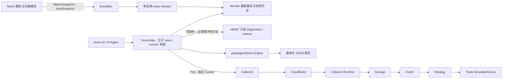

# MooX Doctor 与 Monitor 简化实现计划

> **For agentic workers:** REQUIRED SUB-SKILL: Use superpowers:subagent-driven-development (recommended) or superpowers:executing-plans to implement this plan task-by-task. Steps use checkbox (`- [ ]`) syntax for tracking.

**Goal:** 为个人量化交易系统建立一个由单实例 Monitor 承载的 Doctor 能力，使 AI Agent 和用户能够基于已有监控事实完成部署自检、故障诊断和隔离的全链路功能验证；同时补齐服务及服务内功能模块的可观测性，并通过 Trade 的确定性模拟盘验证采集、存储、因子、策略和交易闭环。

**Architecture:** 各独立进程继续通过 tRPC Prometheus 默认 Registry 和 `packages/report` 定时发布 `MetricSnapshot`，HostAgent 保留专用主机快照，Monitor 保存最新事实和有界历史；Doctor 是 `moox-monitor` 进程内的逻辑模块，不创建新守护进程。可复用的检查模型、DAG 调度和报告渲染放在 `packages/doctor`，Monitor 内的 `DoctorMgr` 负责持久化与编排，`moox-cli` 负责调用和只读直连兜底。Full 模式只操作 `moox_doctor` 空间和 `doctor_` 前缀资源，并通过真实 Collector -> CloudNode -> Collector Runtime -> Storage -> Factor -> Strategy -> Trade Sim 链路运行固定 Canary。

**Tech Stack:** Go 1.25、tRPC-Go、Protocol Buffers、SQLite/GORM、Prometheus client、NATS JetStream、MooX Storage、Python Strategy Worker、Cobra、YAML、Shell。

---

## 计划状态

本文件记录 2026-07-19 Doctor/Monitor 讨论的最终执行方案。实现时以本计划为准，并同步修订与单实例边界、服务身份、指标链路、Strategy 执行绑定和 Trade 模拟盘冲突的旧文档。

这是个人单用户量化系统，不按商用高可用平台建设。允许存在多个 Collector、CloudNode 或计算节点，但控制面只有一个 `moox-monitor` 和一个进程内 `DoctorMgr`。所有恢复动作只生成建议，不自动执行。

## 简化边界

### 必须实现

- 部署后能够回答服务是谁、做什么、输入输出、依赖、允许修改的目录与配置、正常条件、故障恢复和重新接入方式。
- Monitor 能发现预期服务未上报、身份不一致、指标过期、功能模块长时间未成功、输入水位前进但输出水位停滞、磁盘剩余可运行天数过短。
- Doctor 提供 `bootstrap`、`diagnose`、`full` 三种模式，输出版本化 JSON 报告和面向用户的“诊断依据”。
- Full 使用固定测试资源，验证 Collector、CloudNode、Storage、Factor、Strategy 和 Trade 模拟盘的真实业务链路及 Monitor 可观测链路。
- Trade 模拟盘是正式产品能力，不是只为 Doctor 写的旁路；它必须复用真实订单、成交、账本、余额、持仓、Outbox 和恢复链路。
- 所有高影响动作都被固定 Space、资源属性、前缀、模拟账户和幂等键约束，任何不一致都失败关闭。

### 明确不实现

- 不部署 Prometheus Server、Pushgateway、Tracing 后端或集中式日志平台。
- 不实现 Monitor/Doctor 多实例、高可用、Leader Election、分布式 Lease、自动 Failover 或自动扩缩容。
- 不实现自动修复、自动重启、自动重启机器、自动反向交易或复杂 Saga 补偿。
- 不增加 SLO、错误预算、健康分数、置信度评分、覆盖率数据库、Doctor 事件表或 Factor 专用运行历史表。
- 不让 Monitor 持续抓取各服务 `/metrics`；直读只用于 `diagnose/full` 中过期、缺失或冲突的分支，且不写入正常指标历史。
- 不允许配置任意 Shell、SQL、PromQL、脚本插件或动态检查 DSL。检查和恢复动作必须由代码中的固定 ID 映射。
- 不把 Strategy -> Trade 正确性建立在跨服务命令 EventBus、双 Inbox 或逐状态 Receipt 流上。
- V1 不做盘口深度、队列位置、随机延迟、随机成交或实盘级撮合仿真。
- V1 不提供 Doctor Web UI；API、CLI、JSON 和 Markdown 报告先构成完整操作面。

## 最终架构



### 职责分离

| 组件 | 唯一职责 | 不负责 |
| --- | --- | --- |
| Monitor | 收集、保存和查询事实；计算简单阈值；聚合 `GetDoctorContext` | 根因推断、Canary 编排、自动修复 |
| Doctor Engine | 执行固定检查 DAG、处理依赖、生成结论和根因 | 网络、数据库或业务 RPC 细节 |
| DoctorMgr | 适配 Monitor/服务事实、持久化 Run、串行执行、取消、清理 | 多实例协调、恢复执行中的 Run |
| `moox-cli` | 调用 DoctorMgr、渲染报告、显式只读 Direct 兜底 | Full 的本地旁路、自动恢复 |
| Trade SimulatedVenue | 用持久化确定性行情撮合模拟订单 | 复制第二套订单、账本或持仓系统 |

### Doctor 模式

| 模式 | 用途 | 数据来源 | 副作用 | 默认总时限 |
| --- | --- | --- | --- | --- |
| `bootstrap` | 初始部署、升级、重启后的自检 | 静态 Manifest、进程/端口/目录/配置、健康接口、Monitor 覆盖 | 无 | 2 分钟 |
| `diagnose` | 日常故障定位 | 优先读取 Monitor；仅对缺失、过期、冲突分支做 HMAC 直读 | 无 | 2 分钟 |
| `full` | 验证真实功能闭环 | `diagnose` 前置检查 + 固定隔离 Canary | 仅写 `moox_doctor` | 15 分钟 |

不再设置独立 `quick`、`deep`、`verify` Profile。重跑使用 `rerun_of`、`failed_only` 和可选 `check_ids`；只有原 Run 是 `full` 且请求显式允许时，重跑才可再次执行 Canary。

### 状态和结论

| 对象 | 固定枚举 |
| --- | --- |
| Check | `PASS / WARN / FAIL / UNKNOWN / BLOCKED / SKIPPED` |
| Run | `RUNNING / COMPLETED / CANCELED / TIMED_OUT / ABORTED` |
| Report | `HEALTHY / DEGRADED / UNHEALTHY / INCONCLUSIVE` |

- 依赖 Check 失败时，下游标记 `BLOCKED`，不能制造级联伪根因。
- 根因只取没有失败前置依赖的 `FAIL` Check。
- 缺失或过期事实必须是 `UNKNOWN`，不能当作 `PASS`。
- `WARN` 产生 `DEGRADED`；任何根 `FAIL` 产生 `UNHEALTHY`；关键事实不足产生 `INCONCLUSIVE`。

### Observation 术语

新 API、Go 模型和 JSON 字段统一使用 `Observation`；面向用户显示“诊断依据”。Doctor 范围内不再使用 `Evidence`。

```text
Observation
  source
  observed_at
  expires_at
  summary
  digest
  error
```

`checks[].observations` 保存每项检查的诊断依据，`observation_source` 标识来源，`missing_observations` 明确列出缺失项。只保存摘要与摘要哈希，不保存完整指标文本、原始日志、完整配置或业务数据 Payload。

## 固定契约

### Component Manifest

每个独立部署进程必须有静态 Manifest，至少包含：

```text
component_id
service_name
role
duties[]
inputs[]
outputs[]
dependencies[]
endpoints[]
mutable_paths[] { path, permission, purpose }
config_files[] { path, mutable }
normal_conditions[]
recovery_action_ids[]
rejoin_checks[]
```

Manifest 作为只读 YAML 随发布包安装，并由 `/diagnostics/v1/manifest` 返回当前组件条目。它不是运行时插件，也不能携带命令、SQL 或查询表达式。运行响应额外包含 `version`、`git_commit`、`build_time`、`config_hash`、Manifest checksum、`instance_id`、`node_id`、`boot_id` 和 `host_boot_id`。其中 Reporter 的 `boot_id` 是每次进程启动唯一的 process boot ID，`host_boot_id` 才表示操作系统本次开机。

### Check Registry

```text
check_id
modes[]
scope_kind
runner_id
required_checks[]
severity
timeout
max_observation_age
side_effect
safety_gate
recovery_action_ids[]
```

Registry 编译进 `packages/doctor`。`runner_id` 只能映射到显式注册的 Go Runner；未知 ID 在启动时失败。默认单项时限为 Monitor 查询 3 秒、health/metrics 5 秒、SSH/数据库 10 秒、Canary 阶段 120 秒、清理 60 秒。

首批 Check DAG 使用固定 ID：

| Check ID | 模式 | 主要依赖 |
| --- | --- | --- |
| `bootstrap.inventory` | bootstrap/diagnose/full | 无 |
| `bootstrap.disk_identity` | bootstrap/diagnose/full | `bootstrap.inventory` |
| `bootstrap.network` | bootstrap/diagnose/full | `bootstrap.inventory` |
| `bootstrap.ssh_access` | bootstrap | `bootstrap.network` |
| `bootstrap.service_autostart` | bootstrap | `bootstrap.inventory` |
| `bootstrap.path_permissions` | bootstrap | `bootstrap.inventory` |
| `bootstrap.config_provenance` | bootstrap | `bootstrap.inventory` |
| `service.health` | 三种 | `bootstrap.network` |
| `monitor.metrics_delivery` | diagnose/full | `service.health:eventbus`、`service.health:monitor` |
| `monitor.reporter_coverage` | 三种 | `monitor.metrics_delivery` |
| `module.freshness` | diagnose/full | 对应 `service.health`、`monitor.reporter_coverage` |
| `module.pipeline_lag` | diagnose/full | 上下游 `module.freshness` |
| `canary.collector` | full | 所有 preflight、Collector/CloudNode health |
| `canary.storage` | full | `canary.collector` |
| `canary.factor` | full | `canary.storage` |
| `canary.strategy` | full | `canary.factor` |
| `canary.trade_sim` | full | `canary.strategy` |
| `canary.monitor_visibility` | full | 所有 Canary 业务 Check |
| `canary.cleanup` | full | 由 Full Runner defer 执行 |

`bootstrap.disk_identity` 校验设备/卷唯一标识、文件系统、期望挂载点、读写权限、容量和预计剩余天数；`bootstrap.config_provenance` 在源码部署中校验 Git commit/dirty state，在发布包部署中校验 `release-manifest.json` 的 source commit 与配置 checksum。Host boot ID 在 Linux 读取 `/proc/sys/kernel/random/boot_id`，macOS 使用 `kern.boottime` 的规范化哈希，Windows 使用 CIM `LastBootUpTime` 的规范化哈希；三者只由固定平台 Runner 获取，不能拿它代替 Reporter process boot ID。

`bootstrap.ssh_access` 必须使用 BatchMode、固定用户、已知主机指纹和明确的 key file；私钥权限不严、host key 未固定、需要交互密码或目标身份不符都失败。检查只读取身份与平台状态，不把 SSH 变成通用远程命令入口。

`canary.cleanup` 不依赖普通 DAG 的成功状态。Full Runner 在获得 `canary_run_id` 后立即注册 defer，并在报告关闭前把清理结果写成独立 Check；清理失败会让报告至少为 `DEGRADED`，但绝不能扩大删除条件来追求成功。

### Monitor 最小功能指标

所有功能模块只增加下面这些通用指标；已有更详细指标继续保留，但 Doctor 不依赖高基数标签。

```text
moox_module_last_success_timestamp_seconds{module}
moox_module_last_error_timestamp_seconds{module}
moox_module_runs_total{module,result}
moox_module_inflight{module}                                      # 可选
moox_module_backlog{module}                                       # 可选
moox_business_watermark_timestamp_seconds{module,stage,space,dataset}
moox_business_window_items{module,stage,result}                    # 可选
```

约束：

- `module`、`stage`、`result` 必须来自代码内有限枚举。
- `space`、`dataset` 只来自已配置的有限元数据；不得放入 subject、factor、strategy、account、order、execution、task 或 run ID。
- 水位是业务数据时间，只能单调推进；不能用当前时间伪造成功。
- “没有信号”或“没有订单”本身不是失败。只有输入水位持续前进而输出水位超过容忍时间未前进，或已关闭窗口缺失/无效，才失败。

Trade 额外保留四个有限标签指标：`moox_trade_execution_total{mode,result}`、`moox_trade_sim_match_total{result}`、`moox_trade_sim_snapshot_age_seconds`、`moox_trade_nonterminal_executions{mode}`。Execution/order/run ID 仍只能进入 RPC Observation，不能进入 label。

第一批输入输出水位：

| 模块 | 输入水位 | 输出水位 |
| --- | --- | --- |
| Collector | source closed window | Storage commit |
| Storage | Primary commit | View visible |
| Factor | factor input | factor result |
| Strategy | factor/view input | strategy evaluation |
| Trade | execution accepted | order reconciliation |
| Archive | journal accepted | archive completion |
| CloudNode | job dispatch | job result |
| EventBus | newest message | oldest pending/consumer progress |

首批功能判断保持简单且可解释：

| 功能模块 | `PASS` 所需事实 | 不能误判的情况 |
| --- | --- | --- |
| Collector | 已关闭窗口无缺口/重复，任务终态成功，Storage commit 水位达到窗口末端 | 市场尚未开盘或窗口尚未关闭 |
| Storage Primary/View | 写入成功，View complete，schema/version 匹配，View 水位不落后于容忍值 | 没有新输入时水位不变 |
| Factor | 输入窗口完整，结果字段存在且非 Null/NaN，结果水位追平输入 | 因子值为 0 |
| Strategy | 输入 revision 已评估，运行成功，目标通过风险校验 | 合法地产生空目标或 0 权重 |
| Trade | Execution 达明确终态，订单/成交/账本/持仓可对账，无超时 UNKNOWN | 策略没有产生交易需求 |
| Archive | Journal 没有超龄未归档项，最近归档文件可校验 | 白名单 Dataset 没有新数据 |
| CloudNode | JobItem 不超龄，dispatch/result 计数闭合 | 队列为空 |
| EventBus | durable pending/redelivery 在阈值内，最新 publish/ack 时间可解释 | Topic 当前没有生产者 |

默认判断：Reporter 超过 2 个上报周期未出现为 `WARN/UNKNOWN`；health 连续 3 次失败为 `FAIL`；功能模块超过 2 个调度周期无成功为 `WARN`；输出 Lag 超过配置容忍值为 `FAIL`；已关闭窗口缺失或校验错误为 `FAIL`；磁盘预计剩余天数 `<=14` 为 `WARN`、`<=7` 为 `FAIL`。

磁盘天数使用最近 7 天的每日 `used_bytes` 增量中位数，至少需要 3 个有效间隔；可用容量先扣除 `max(总容量 10%, 5 GiB)` 安全余量，再除以正增长速度。样本不足返回 `UNKNOWN`，增长速度 `<=0` 返回“当前未增长”且不告警，不能显示伪精确的无限天数。

### Doctor API

`moox-monitor` 同一进程内注册两个服务：

- `trpc.moox.monitor.MonitorMgr`，保留 Monitor API并新增 `GetDoctorContext`，端口 `11410`。
- `trpc.moox.monitor.DoctorMgr`，提供 `StartRun`、`GetRun`、`ListRuns`、`CancelRun`，内部端口 `11422`。

`11422` 不是新进程，也不是公开诊断端口。Node Gateway 仅允许 `admin-gateway` 和 `moox-cli` 调用 DoctorMgr。各服务只读诊断仍复用原 health 监听端口和 health HMAC。

StartRun 的 `request_id` 必须幂等：同一请求内容返回原 Run；同一 `request_id` 携带不同请求哈希返回冲突。Canonical report 是版本化 JSON，Proto 只传 `report_json`，不维护第二套报告结构。

API 读取保持有界：`ListRuns` 默认 20、最大 100；单次最多选择 64 个 Check；Observation summary 最大 2 KiB，单份 `report_json` 最大 2 MiB。超过上限返回参数错误，不截断成看似完整的报告。`failed_only` 自动补入失败 Check 所需的前置依赖。

第一批固定恢复动作 ID 为：`verify_service_identity`、`repair_path_permissions`、`verify_eventbus_credentials`、`apply_doctor_seed`、`rebuild_view_index`、`replay_factor_window`、`reset_doctor_sim_account`、`cleanup_doctor_canary`、`free_disk_space`、`restart_service_manually`。这些 ID 只映射到文档和检查步骤，Doctor 不执行动作。

### Doctor 持久化

Monitor SQLite 只新增 `t_monitor_doctor_runs` 一张表：

```text
c_run_id
c_request_id
c_request_hash
c_mode
c_state
c_phase
c_scope_json
c_cancel_requested
c_canary_run_id
c_started_at
c_updated_at
c_finished_at
c_report_json
```

`c_request_id` 唯一。每个 Check 完成后原子更新 `phase/report_json/updated_at`。进程内 mutex 加数据库中的唯一 `RUNNING` 约束确保全局只有一个 Run，不引入分布式锁。Monitor 启动时把遗留 `RUNNING` 标成 `ABORTED`；若遗留 Full Canary，则先执行固定清理，再接受新 Run，不恢复执行到一半的工作流。

### Full Canary 固定资源

| 资源 | 固定值 |
| --- | --- |
| Space | `moox_doctor` |
| Space 属性 | `scope=internal`、`owner_module=doctor`、`managed_by=moox-doctor` |
| Raw Dataset | `doctor_kline_raw_v1` |
| Factor Dataset | `doctor_factor_v1` |
| Raw View | `doctor_kline_view_v1` |
| Signal View | `doctor_signal_view_v1` |
| Data Source | `doctor_synthetic` |
| Subject | `doctor_btc_usdt` |
| Collector Rule | `doctor_collect_kline_v1`，默认 disabled |
| Factor Definition | `doctor_smoke_factor_v1` |
| Factor Binding | `doctor_factor_bind_v1` |
| Strategy | `doctor_smoke_strategy`，版本 `1.0.0` |
| Strategy Binding | `doctor_strategy_bind_v1` |
| Trade Account | `doctor_trade_account`，类型 `sim` |
| Trade Channel | `doctor_trade_channel`，`is_simulated=true` |
| Run ID | `doctor_<UTC>_<6-random>` |

固定元数据随部署创建并长期保留，不为每次 Run 创建 Dataset/View。Run 事实保留 7 天，Doctor 报告保留 30 天。清理必须同时验证 Space、`managed_by`、`doctor_` 前缀和 `run_id`；禁止只按前缀删除。

固定数值 Fixture 使用相对 `fixture_time` 的 4 根已关闭 1m Bar，close 依次为 `100, 101, 99, 102`，其他 OHLCV 数值和 checksum 写死在 `full-canary.yaml`。Factor 定义为 `close_delta_1m = close - lag(close, 1)`，最后一根期望值为 `3`；Strategy 在该值大于 0 时产生 `BTCUSDT target_weight=0.10`，否则产生 0 权重。Trade 初始余额为 `10000 USDT`，模拟快照 `bid=99.90, ask=100.00, mark=100.00`，滑点和费率均为 10 bps，步长为 `0.001 BTC`。预期买入 `10 BTC`、成交价 `100.10`、费用 `1.001 USDT`，最终为 `10 BTC + 8997.999 USDT`。实现和 E2E 必须用 Decimal 计算并逐字段断言，不能使用浮点近似掩盖错误。

### Trade 模拟盘

模拟盘只替换交易所 Adapter，继续使用现有 Trade Order aggregate、FillHandler、双式账本、余额/持仓投影、Outbox、client order ID 幂等和重启恢复。

V1 撮合规则：

- MARKET/IOC 买单使用 ask 加固定滑点，卖单使用 bid 减固定滑点。
- 穿价 LIMIT 成交，未穿价 LIMIT 保持 `OPEN`。
- 固定费率，默认全量成交；可配置有限成交量上限以测试 `PARTIAL`。
- 行情快照、Venue 订单、成交和费用全部持久化；同一快照和配置必须产生相同结果哈希。

失败关闭条件：Strategy binding mode 必须为 `paper`，Account 必须为 `sim`，Channel 必须 `is_simulated=true`，Account/Channel 必须相互绑定，Channel 不得设置或读取 API Key。任一条件不满足时，在创建数据库订单之前拒绝，Resolver 绝不回退到真实 Exchange Factory。

Execution 固定状态：`PLANNED / EXECUTING / COMPLETED / FAILED / PARTIAL / UNKNOWN / EXPIRED`。同一模拟账户只允许一个活动 Execution。`UNKNOWN` 禁止自动重试；`PARTIAL` 冻结新 Execution，等待用户确认后用新的 FULL Target 修正，不自动反向交易。

## 当前代码差距

| 范围 | 当前事实 | 本计划处理 |
| --- | --- | --- |
| Doctor | `modules/doctor/` 为空，没有 Engine、Run 或 API | 使用 `packages/doctor` 做共享 Core，DoctorMgr 放入 Monitor；不新增 daemon |
| Monitor HA | 存在 `internal/peer`、Peer 表/API、peer timer、Owner 仲裁 | 全部删除，收敛为单实例 |
| Reporter 身份 | Storage 使用 `storage_primary/storage_view`，Trade 使用 `trade_account`，部署名不一致 | 统一为 SysDeploy 独立进程名 |
| Reporter 覆盖 | Archive、Strategy、Gateway 缺 reporter；Storage shard 缺 timer | 补齐；HostAgent 保留专用快照，web-host 明确 health-only |
| 自定义指标 | Gateway/EventBus 的部分文本指标不在默认 Gatherer | 改为注册式 Prometheus Collector，确保 Reporter 能采集 |
| EventBus 凭证 | Metrics Topic/Durable/ACL 与 Monitor credential 使用不完整 | 建一个共享 metrics publisher 角色和一个 Monitor consumer 凭证 |
| 业务状态 | 多数模块只有 RPC/进程指标，没有成功时间、Backlog、输入输出水位 | 增加最小功能指标，不建新时序平台 |
| Diagnostics | 只有 `/healthz`、`/readyz`、`/metrics` | 增加 HMAC 只读 Manifest/Snapshot |
| Strategy 绑定 | `SetExecutionMode` 原地修改 mode，binding 没有 channel_id | 改为不可变 Create/Disable，Paper -> Live 必须新建 binding |
| Strategy -> Trade | 执行请求表存在，但没有完整持久 Dispatcher/查询闭环 | 使用持久请求 + 幂等 RPC + 查询，不建双 EventBus 协议 |
| Trade Sim | Account/Channel 字段已存在，但 Resolver 返回 `simulated channel is not implemented` | 实现持久化 `SimulatedVenue` 并复用真实 Trade 内核 |
| Collector Canary | 只有真实数据源，Doctor 无受限触发入口 | 增加固定 synthetic source 和 `RunDoctorCanary`，仍走 CloudNode JobItem |

## 阶段门禁

| 阶段 | 任务 | 进入下一阶段前必须满足 |
| --- | --- | --- |
| A. 事实可信 | Task 1-5 | 单 Monitor、身份、Reporter 覆盖、EventBus 认证、业务指标契约全部通过 |
| B. 只读 Doctor | Task 6-9 | Manifest、Context、Bootstrap/Diagnose、CLI、重启基线全部通过且无写副作用 |
| C. 模拟盘与 Canary | Task 10-13 | Trade Sim、Strategy Dispatcher、Collector synthetic、Full 闭环和幂等清理通过 |
| D. 交付 | Task 14-15 | Retention、部署文档、两轮审查、全量 Verify 和实际 E2E 通过 |

阶段 A 未完成前不得实现 Full Canary。否则 Doctor 会把“没有指标”误判成业务故障，无法区分监控链路和业务链路。

每个 Task 独立提交，推荐标题依次为：`feat(doctor): add core contracts`、`refactor(monitor): remove peer coordination`、`fix(monitor): align service reporting identity`、`feat(monitor): complete metric delivery`、`feat(monitor): add module watermarks`、`feat(healthz): add signed diagnostics`、`feat(monitor): expose doctor context`、`feat(monitor): add doctor manager`、`feat(cli): add doctor commands`、`feat(trade): add simulated venue`、`feat(strategy): dispatch target executions`、`feat(collector): add doctor canary source`、`feat(doctor): run full canary`、`docs(doctor): add operations guidance`、`test(doctor): verify system workflow`。每个提交前运行对应 Task 的命令，不把后续 Task 的半成品提前混入。

### Task 1: 锁定 Doctor Core、Manifest 和报告契约

**Files:**
- Create: `packages/doctor/go.mod`
- Create: `packages/doctor/model.go`
- Create: `packages/doctor/model_test.go`
- Create: `packages/doctor/registry.go`
- Create: `packages/doctor/registry_test.go`
- Create: `packages/doctor/engine.go`
- Create: `packages/doctor/engine_test.go`
- Create: `packages/doctor/report.go`
- Create: `packages/doctor/report_test.go`
- Create: `packages/doctor/report.schema.json`
- Create: `modules/doctor/config/components.yaml`
- Create: `modules/doctor/config/components.schema.json`
- Create: `modules/doctor/fixtures/full-canary.yaml`
- Modify: `go.work`
- Modify: `scripts/check-package-boundaries.sh`

- [ ] 先写 RED 表测试，锁定三种 Mode、Check/Run/Report 状态、Observation 字段、Root Cause 规则、依赖失败转 `BLOCKED`、缺失/过期转 `UNKNOWN`、超时与取消传播。
- [ ] 定义 `Runner` 接口和编译期 Registry；重复 Check ID、循环依赖、未知 Runner、读模式包含副作用、缺失 safety gate 均在启动前失败。
- [ ] Engine 只负责 DAG 和报告，不导入 `modules/*`、tRPC、SQLite 或 Prometheus。
- [ ] 报告 JSON 带 `schema_version`、`run_id`、`mode`、`conclusion`、`checks`、`root_cause_check_ids`，序列化必须稳定并通过 golden test。
- [ ] 创建全组件 Manifest；包内测试校验 component/service 唯一性、前述九类必填信息、checksum 稳定和禁止动作字段。SysDeploy 交叉覆盖由 Task 3 的仓库脚本验证。
- [ ] 固定 Canary 资源写入 fixture；校验所有可控资源属于 `moox_doctor`、使用 `doctor_` 前缀并带三项管理属性。
- [ ] 包边界门禁允许 Monitor 和 CLI 引用 `packages/doctor`，仍禁止模块互相 import `internal/`。
- [ ] 运行：

```bash
(cd packages/doctor && go test -count=1 ./...)
./scripts/check-package-boundaries.sh
```

### Task 2: 删除 Monitor 多实例与告警 Owner 复杂度

**Files:**
- Delete: `modules/monitor/internal/peer/`
- Delete: `modules/monitor/internal/domain/peer.go`
- Delete: `modules/monitor/internal/store/peer.go`
- Delete: `modules/monitor/internal/store/peer_availability.go`
- Delete: `modules/monitor/internal/store/peer_availability_test.go`
- Delete: `modules/monitor/internal/alerting/owner.go`
- Delete: `modules/monitor/internal/alerting/owner_test.go`
- Modify: `modules/monitor/internal/config/config.go`
- Modify: `modules/monitor/internal/config/config_test.go`
- Modify: `modules/monitor/internal/bootstrap/service_runtime.go`
- Modify: `modules/monitor/internal/bootstrap/schedule_timers.go`
- Modify: `modules/monitor/internal/bootstrap/schedule_timers_test.go`
- Modify: `modules/monitor/internal/alerting/evaluator.go`
- Modify: `modules/monitor/internal/alerting/evaluator_test.go`
- Modify: `modules/monitor/internal/metrics/scheduler.go`
- Modify: `modules/monitor/proto/monitor.proto`
- Modify: `modules/monitor/proto/monitorgen/validation.go`
- Regenerate: `modules/monitor/proto/monitorgen/monitor.pb.go`
- Regenerate: `modules/monitor/proto/monitorgen/monitor.trpc.go`
- Modify: `modules/monitor/schema/monitor.sql`
- Modify: `modules/monitor/schema/schema_test.go`
- Modify: `modules/monitor/config/app.yaml`
- Modify: `modules/monitor/config/trpc_go.yaml`
- Modify: `scripts/deploy-moox.sh`
- Modify: `modules/admin/internal/gateway/config_test.go`
- Modify: `modules/gateway/cmd/e2e-helper/main.go`
- Modify: `web/src/api/monitor/index.ts`
- Modify: `web/src/api/monitor/types.ts`
- Modify: `web/src/views/ops/service-monitor/index.vue`

- [ ] 先把测试改成单实例契约：Scheduler 和 Metric Rule 只在本进程执行；同一规则仍由 SQLite 状态去重，但不做 Owner 选举。
- [ ] 删除 `PeerConfig`、peer puller、`peer_sync.timer`、`GetPeerSnapshot`、`ListMonitorInstances`、`active_instances` 和对应生成代码。
- [ ] 删除 `t_monitor_instances`、`t_monitor_peer_snapshots` 及 trigger；项目按新部署处理，不增加旧表迁移或兼容读取。
- [ ] 删除 `owner_instance_id` 语义；Alert Event 需要来源时使用本地 `instance_id`，但它不参与仲裁。
- [ ] 删除部署参数 `--monitor-peer` 及 Monitor peer YAML 注入；保留 Gateway 的多节点路由，因为计算节点仍可存在。
- [ ] 删除 Web 中 Monitor instance 列表和 active instance 展示，并更新 Gateway/Admin 测试，不保留指向已删除 RPC 的调用。
- [ ] 运行：

```bash
make -C modules/monitor/proto all
(cd modules/monitor && go test -count=1 ./internal/config ./internal/bootstrap ./internal/alerting ./internal/metrics/... ./internal/rpc ./internal/store ./schema)
bash scripts/test-trpc-plugin-config.sh
(cd web && pnpm build:prod)
```

### Task 3: 建立服务身份和监控覆盖契约

**Files:**
- Create: `scripts/test-monitor-coverage-contract.sh`
- Modify: `modules/admin/internal/service/sysdeploy/defaults.go`
- Modify: `modules/admin/internal/service/sysdeploy/defaults_test.go`
- Modify: `examples/service-deployments.seed.yaml`
- Modify: `packages/report/config.go`
- Create: `packages/report/config_test.go`
- Modify: `packages/report/handler.go`
- Modify: `packages/report/handler_test.go`
- Modify: `modules/storage/cmd/server/main.go`
- Modify: `modules/storage/cmd/server/main_test.go`
- Modify: `modules/trade/internal/bootstrap/bootstrap.go`
- Modify: `modules/trade/internal/bootstrap/bootstrap_test.go`
- Modify: `scripts/deploy-moox.sh`
- Modify: `scripts/test-deploy-moox-gateway.sh`

- [ ] 覆盖测试从 SysDeploy 中只读取 `deployment_mode=process && monitor_enabled=true` 的进程，绝不把 Trade RPC endpoint 或 Storage 内部 endpoint 当独立进程。
- [ ] 为每个进程声明一个 transport：`reporter`、`host_snapshot` 或 `health_only`；HostAgent 使用 `host_snapshot`，web-host 使用 `health_only`，其他后端进程使用 `reporter`。
- [ ] 补充 `moox_gateway` 独立进程记录和 health URL；修正 `moox_monitor` 描述为“单实例 Monitor + DoctorMgr”。
- [ ] 固定 canonical service name：`storage-primary`、`storage-view`、`storage-shard`、`moox_trade`，其他名称与 SysDeploy 保持一致。
- [ ] 部署时注入稳定 `MOOX_NODE_ID`、`MOOX_INSTANCE_ID=<service>@<node>`、每次进程启动都唯一的 `MOOX_BOOT_ID`、`MOOX_VERSION`；移除把 HOSTNAME 当长期 Instance ID 的默认行为。OS `host_boot_id` 由 HostAgent/Diagnostics 独立提供，避免进程重启后 Reporter sequence 回零却复用 message ID。
- [ ] Local Dev 没有部署环境时允许 `<service>@local`，但必须显式标为 local，不能与已部署实例混淆。
- [ ] 覆盖脚本拒绝缺 Manifest、缺 health、缺 transport、重复 service name、未知 transport，以及 reporter 名称与 SysDeploy 不一致。
- [ ] 运行：

```bash
(cd packages/report && go test -count=1 ./...)
(cd modules/admin && go test -count=1 ./internal/service/sysdeploy)
(cd modules/storage && go test -count=1 ./cmd/server)
(cd modules/trade && go test -count=1 ./internal/bootstrap)
bash scripts/test-monitor-coverage-contract.sh
bash scripts/test-deploy-moox-gateway.sh
```

### Task 4: 补齐 Reporter、EventBus 认证和默认 Gatherer

**Files:**
- Modify: `modules/archive/internal/bootstrap/app.go`
- Modify: `modules/archive/internal/bootstrap/app_test.go`
- Modify: `modules/archive/config/trpc_go.yaml`
- Modify: `modules/archive/go.mod`
- Modify: `modules/archive/go.sum`
- Modify: `modules/strategy/internal/bootstrap/bootstrap.go`
- Modify: `modules/strategy/internal/bootstrap/config.go`
- Modify: `modules/strategy/internal/bootstrap/config_test.go`
- Modify: `modules/strategy/config/trpc_go.yaml`
- Modify: `modules/strategy/go.mod`
- Modify: `modules/strategy/go.sum`
- Modify: `modules/storage/config/trpc_go.shard.yaml`
- Modify: `modules/gateway/internal/bootstrap/bootstrap.go`
- Modify: `modules/gateway/internal/bootstrap/bootstrap_test.go`
- Modify: `modules/gateway/internal/health/state.go`
- Modify: `modules/gateway/internal/health/state_test.go`
- Modify: `modules/gateway/config/trpc_go.yaml`
- Modify: `modules/gateway/go.mod`
- Modify: `modules/gateway/go.sum`
- Modify: `modules/eventbus/internal/health/server.go`
- Modify: `modules/eventbus/internal/health/server_test.go`
- Modify: `modules/eventbus/internal/config/config_defaults.go`
- Modify: `modules/eventbus/internal/config/config_test.go`
- Modify: `modules/eventbus/config/app.yaml`
- Modify: `modules/admin/cmd/cli/eventbus_credentials.go`
- Modify: `modules/admin/cmd/cli/eventbus_credentials_test.go`
- Modify: `modules/monitor/internal/bootstrap/metrics_runtime.go`
- Modify: `modules/monitor/internal/bootstrap/bootstrap_test.go`
- Modify: `scripts/test-deploy-moox-eventbus.sh`

- [ ] 为 Archive、Strategy、Gateway 增加 `packages/report` Handler 和 30 秒 tRPC Timer；为 Storage shard 配置已有 reporter timer。
- [ ] HostAgent 不重复发送通用 Reporter，web-host 不伪造 metrics transport。
- [ ] 把 Gateway/EventBus 手写文本指标改为注册到 `prometheus.DefaultRegisterer` 的 Collector，确保 health `/metrics` 和 Reporter 读取同一个 Gatherer。
- [ ] EventBus 声明 metrics Topic、Stream、Monitor durable 和 ACL；只增加一个共享只发布 metrics 的 publisher 角色和一个 Monitor consumer 凭证，不为每个服务创建角色。
- [ ] Monitor Metrics consumer 实际读取 `eventbus_credential_file`；开启认证后能够消费，错误凭证失败关闭并让 Monitor readiness 降级。
- [ ] Reporter 保持 best effort，不增加 Outbox；发布失败必须增加本地 error counter 并由 health/diagnostics 可见。
- [ ] E2E 等待两个上报周期，断言 Archive、Strategy、Gateway 和 Storage shard 出现在 Monitor，HostAgent 没有重复 service snapshot，未知 service name 被拒绝。
- [ ] 运行：

```bash
(cd modules/archive && go test -count=1 ./internal/bootstrap ./internal/health)
(cd modules/strategy && go test -count=1 ./internal/bootstrap ./internal/health)
(cd modules/gateway && go test -count=1 ./internal/bootstrap ./internal/health)
(cd modules/eventbus && go test -count=1 ./internal/config ./internal/registry ./internal/health ./internal/bootstrap)
(cd modules/monitor && go test -count=1 ./internal/bootstrap ./internal/metrics/... ./test -run MetricsEventBus)
bash scripts/test-deploy-moox-eventbus.sh
bash scripts/test-monitor-coverage-contract.sh
```

### Task 5: 增加服务内功能指标和水位

**Files:**
- Create: `packages/report/module_metrics.go`
- Create: `packages/report/module_metrics_test.go`
- Modify: `modules/collector/internal/executor/executor.go`
- Modify: `modules/collector/internal/executor/executor_test.go`
- Modify: `modules/collector/internal/sources/binance/storage_rpc.go`
- Modify: `modules/cloudnode/internal/rpc/job_item.go`
- Modify: `modules/cloudnode/internal/rpc/job_item_test.go`
- Modify: `modules/storage/internal/service/primarystore/data.go`
- Modify: `modules/storage/internal/service/primarystore/data_test.go`
- Modify: `modules/storage/internal/service/datashard/outbox_relay.go`
- Modify: `modules/storage/internal/service/datashard/outbox_relay_test.go`
- Modify: `modules/storage/internal/service/viewbuilder/service.go`
- Modify: `modules/storage/internal/service/viewbuilder/service_test.go`
- Modify: `modules/factor/internal/scheduler/service.go`
- Modify: `modules/factor/internal/scheduler/service_test.go`
- Modify: `modules/strategy/internal/rpc/service.go`
- Modify: `modules/strategy/internal/rpc/service_test.go`
- Modify: `modules/strategy/internal/bus/outbox.go`
- Modify: `modules/strategy/internal/bus/outbox_test.go`
- Create: `modules/archive/internal/telemetry/metrics.go`
- Create: `modules/archive/internal/telemetry/metrics_test.go`
- Modify: `modules/archive/internal/writer/scheduler.go`
- Modify: `modules/archive/internal/writer/writer.go`
- Modify: `modules/trade/internal/telemetry/metrics.go`
- Modify: `modules/trade/internal/telemetry/metrics_test.go`
- Modify: `modules/eventbus/internal/health/server.go`
- Create: `modules/monitor/internal/metrics/telemetry.go`
- Create: `modules/monitor/internal/metrics/telemetry_test.go`

- [ ] 在 `packages/report` 增加小型 `ModuleMetrics` Recorder，仅封装本计划列出的固定名称、有限 label 和单调水位；不创建新的 Go module 或指标 DSL。
- [ ] 单元测试拒绝空/未知 module、stage、result 和回退水位；高基数 ID 不进入 label API。
- [ ] 在表格列出的真实成功提交点更新 last success/error、runs、backlog 和水位；不得在请求入口提前标成功。
- [ ] Monitor 自身记录 ingest 成功/拒绝/延迟、最后成功时间、consumer pending 和 DLQ，不用 Doctor 检查掩盖 Monitor 自身故障。
- [ ] 为“输入不动”“输入前进但输出停滞”“无策略信号”“有信号但交易未完成”分别写测试，确保只有后两类异常按契约告警。
- [ ] 运行：

```bash
(cd packages/report && go test -count=1 ./...)
(cd modules/collector && go test -count=1 ./internal/executor ./internal/sources/binance)
(cd modules/cloudnode && go test -count=1 ./internal/rpc)
(cd modules/storage && go test -count=1 ./internal/service/primarystore ./internal/service/datashard ./internal/service/viewbuilder)
(cd modules/factor && go test -count=1 ./internal/scheduler)
(cd modules/strategy && go test -count=1 ./internal/rpc ./internal/bus)
(cd modules/archive && go test -count=1 ./internal/telemetry ./internal/writer)
(cd modules/trade && go test -count=1 ./internal/telemetry)
(cd modules/monitor && go test -count=1 ./internal/metrics/...)
```

### Task 6: 增加统一 HMAC 只读 Diagnostics

**Files:**
- Create: `packages/healthz/diagnostics.go`
- Create: `packages/healthz/diagnostics_test.go`
- Create: `packages/healthz/client.go`
- Create: `packages/healthz/client_test.go`
- Modify: `packages/healthz/healthz.go`
- Modify: `packages/healthz/healthz_test.go`
- Modify: `packages/healthz/auth.go`
- Modify: `packages/healthz/auth_test.go`
- Modify: `packages/healthz/go.mod`
- Modify: `packages/healthz/go.sum`
- Modify: `modules/admin/internal/health/server.go`
- Modify: `modules/archive/internal/health/server.go`
- Modify: `modules/cloudnode/internal/health/server.go`
- Modify: `modules/collector/internal/health/server.go`
- Modify: `modules/eventbus/internal/health/server.go`
- Modify: `modules/factor/internal/health/server.go`
- Modify: `modules/gateway/internal/health/state.go`
- Modify: `modules/hostagent/internal/app/health.go`
- Modify: `modules/monitor/internal/health/server.go`
- Modify: `modules/storage/internal/health/server.go`
- Modify: `modules/strategy/internal/health/server.go`
- Modify: `modules/trade/internal/health/server.go`
- Modify: `web-host/main.go`
- Modify: `web-host/health_test.go`
- Modify: `modules/monitor/internal/probe/http.go`
- Modify: `modules/monitor/internal/probe/probe_test.go`
- Modify: `scripts/deploy-moox.sh`
- Modify: `scripts/release.sh`

- [ ] 扩展 StandardMux，在原 health 监听器上增加 `/diagnostics/v1/manifest` 和 `/diagnostics/v1/snapshot?mode=basic|deep`；不再打开额外进程或诊断端口。
- [ ] Manifest Handler 只返回当前 `component_id` 的静态条目和运行身份/checksum；Snapshot Handler 只返回有界、脱敏、模块所有的状态。
- [ ] `deep` 只做固定只读查询；不得修改状态、触发任务、重启服务或递归调用 Doctor。
- [ ] 客户端复用现有 health HMAC 的时间戳、nonce 和签名规则；未签名、签名过期、nonce 重放、路径篡改都返回 `401`。
- [ ] HMAC material 对有 query 的诊断请求使用 `escaped_path + canonical_query`；测试把 `mode=basic` 篡改成 `mode=deep` 必须失败，避免未签名 query 放大只读负载。
- [ ] 发布包安装只读 `components.yaml` 和 fixture；部署为每个进程设置正确 `component_id`，公开 Caddy 对 diagnostics 继续返回 `404`。
- [ ] `/readyz` 只表达当前能否接活；业务水位和数据完整度只由 Monitor/Doctor 判断。
- [ ] 运行：

```bash
(cd packages/healthz && go test -count=1 ./...)
(cd modules/monitor && go test -count=1 ./internal/probe ./internal/health)
bash scripts/test-health-auth-config.sh
bash scripts/test-deploy-moox-gateway.sh
```

### Task 7: 实现 Monitor 的 GetDoctorContext 聚合视图

**Files:**
- Modify: `modules/monitor/proto/monitor.proto`
- Modify: `modules/monitor/proto/monitorgen/validation.go`
- Regenerate: `modules/monitor/proto/monitorgen/monitor.pb.go`
- Regenerate: `modules/monitor/proto/monitorgen/monitor.trpc.go`
- Create: `modules/monitor/internal/doctor/context.go`
- Create: `modules/monitor/internal/doctor/context_test.go`
- Modify: `modules/monitor/internal/sysdeploy/sync.go`
- Modify: `modules/monitor/internal/sysdeploy/sync_test.go`
- Modify: `modules/monitor/internal/metrics/query.go`
- Modify: `modules/monitor/internal/metrics/query_test.go`
- Create: `modules/monitor/internal/hostmetrics/forecast.go`
- Create: `modules/monitor/internal/hostmetrics/forecast_test.go`
- Modify: `modules/monitor/internal/rpc/service.go`
- Create: `modules/monitor/internal/rpc/doctor_context.go`
- Create: `modules/monitor/internal/rpc/doctor_context_test.go`

- [ ] Proto 新增有界 `GetDoctorContext`；按 component/node/scope 过滤，返回生成时间、预期进程、health、Reporter freshness、功能指标、水位、HostAgent 资源、磁盘天数、当前告警和 `missing_observations`。
- [ ] 聚合使用现有 SysDeploy、check result、metric latest/catalog、Host Storage 和 alert repository，不新增 Context 表、Snapshot EventBus 或覆盖率表。
- [ ] SysDeploy Source 只选择独立进程；静态 Manifest 补充角色知识，但不凭空把未部署组件标成失败。
- [ ] 过期阈值来自 Reporter interval 和 Check Registry；缺失/冲突明确返回，不把旧值静默当最新值。
- [ ] 用固定 7 天中位数算法计算磁盘剩余天数，覆盖样本不足、负增长、安全余量、14/7 天阈值和多挂载点测试。
- [ ] `GetDoctorContext` 本身不直抓 `/metrics`，不运行 Canary，也不执行根因分析。
- [ ] 运行：

```bash
make -C modules/monitor/proto all
(cd modules/monitor && go test -count=1 ./internal/doctor ./internal/sysdeploy ./internal/metrics/... ./internal/rpc)
```

### Task 8: 实现 DoctorMgr、Run 存储和 Bootstrap/Diagnose

**Files:**
- Create: `modules/monitor/proto/doctor.proto`
- Modify: `modules/monitor/proto/Makefile`
- Create: `modules/monitor/proto/monitorgen/doctor.pb.go`
- Create: `modules/monitor/proto/monitorgen/doctor.trpc.go`
- Modify: `modules/monitor/proto/monitorgen/validation.go`
- Create: `modules/monitor/internal/doctor/manager.go`
- Create: `modules/monitor/internal/doctor/manager_test.go`
- Create: `modules/monitor/internal/doctor/registry.go`
- Create: `modules/monitor/internal/doctor/bootstrap_checks.go`
- Create: `modules/monitor/internal/doctor/bootstrap_checks_test.go`
- Create: `modules/monitor/internal/doctor/diagnose_checks.go`
- Create: `modules/monitor/internal/doctor/diagnose_checks_test.go`
- Create: `modules/monitor/internal/store/doctor.go`
- Create: `modules/monitor/internal/store/doctor_test.go`
- Modify: `modules/monitor/internal/store/repositories.go`
- Modify: `modules/monitor/schema/monitor.sql`
- Modify: `modules/monitor/schema/schema_test.go`
- Create: `modules/monitor/internal/rpc/doctor.go`
- Create: `modules/monitor/internal/rpc/doctor_test.go`
- Modify: `modules/monitor/internal/bootstrap/bootstrap.go`
- Modify: `modules/monitor/internal/bootstrap/runtime.go`
- Modify: `modules/monitor/internal/bootstrap/service_runtime.go`
- Modify: `modules/monitor/config/app.yaml`
- Modify: `modules/monitor/config/trpc_go.yaml`
- Modify: `modules/monitor/go.mod`
- Modify: `modules/monitor/go.sum`
- Modify: `modules/admin/internal/service/sysdeploy/defaults.go`
- Modify: `examples/service-deployments.seed.yaml`

- [ ] 用 RED 测试锁定一张表、`request_id + request_hash` 幂等、全局单 Run、逐 Check 进度持久化、Cancel、总超时、启动遗留 Run 转 `ABORTED`。
- [ ] SQLite 增加 `state=RUNNING` 的 partial unique index；启动发现遗留 Full 时先按固定安全边界清理并保存 Observation，再接受新 Run，绝不从中间 Phase 续跑。
- [ ] `DoctorMgr` 注册在同一 `moox-monitor` 进程的 `11422`；SysDeploy 使用 `gateway_routes` 路由该服务，不新增独立 deployment row。
- [ ] `bootstrap` 检查身份/版本/config provenance、磁盘/卷稳定标识与挂载、目录权限、网络/SSH、端口、supervisor enable、health、依赖、Reporter 覆盖和功能模块水位；不得调用会自动重启的现有 healthcheck 默认模式。
- [ ] `status.sh` 的 PID 或返回码只能形成辅助 Observation，不能单独产生 `PASS`；进程身份、监听端口、readiness 和 Reporter boot ID 必须相互一致。
- [ ] `diagnose` 先读 `GetDoctorContext`；仅对缺失、过期或冲突 component 调用 HMAC manifest/snapshot/metrics，并把直读结果作为 Observation，不写入 Monitor 正常历史。
- [ ] 直读仍失败时保持 `UNKNOWN`，并给出固定 `recovery_action_id` 和人工建议；不得执行建议。
- [ ] Full API 此时只有在 Task 13 注册完整 Full Runner 后才能被启用；通过配置 capability 明确返回 unavailable，不能执行半条链路。
- [ ] 运行：

```bash
make -C modules/monitor/proto all
(cd modules/monitor && go test -count=1 ./internal/doctor ./internal/store ./internal/rpc ./internal/bootstrap ./schema)
(cd modules/admin && go test -count=1 ./internal/service/sysdeploy)
```

### Task 9: 增加 Doctor CLI、Direct 兜底和重启复验

**Files:**
- Create: `modules/cli/internal/doctorclient/client.go`
- Create: `modules/cli/internal/doctorclient/client_test.go`
- Create: `modules/cli/internal/doctor/direct.go`
- Create: `modules/cli/internal/doctor/direct_test.go`
- Create: `modules/cli/internal/doctor/render.go`
- Create: `modules/cli/internal/doctor/render_test.go`
- Create: `modules/cli/internal/command/doctor.go`
- Create: `modules/cli/internal/command/doctor_test.go`
- Modify: `modules/cli/internal/command/root.go`
- Modify: `modules/cli/internal/command/root_test.go`
- Modify: `modules/cli/internal/config/config.go`
- Modify: `modules/cli/internal/config/config_test.go`
- Modify: `modules/cli/config/cli.yaml`
- Modify: `modules/cli/go.mod`
- Modify: `modules/cli/go.sum`
- Modify: `scripts/deploy-moox.sh`

- [ ] 增加 `doctor bootstrap|diagnose|full|get|list|cancel`；Canonical 输出默认 JSON，可选 `--format text|markdown` 只做 renderer。
- [ ] 增加 `--rerun-of`、`--failed-only`、重复 `--check`；参数组合在网络调用前校验。
- [ ] 默认调用 DoctorMgr；显式 `--direct` 才使用本地/SSH 固定只读 Runner。Direct 只允许 bootstrap/diagnose，`full --direct` 在任何副作用前拒绝。
- [ ] 发布时为 `moox-cli` 生成只允许 DoctorMgr 方法的 Service Gateway 凭证；CLI 不直连 `11422`，DoctorMgr 也不加入公开 Caddy 路由。
- [ ] Direct 配置只允许目标、health HMAC 和固定 Manifest；不能携带任意 Shell。SSH Runner 只执行编译进代码的身份、端口、文件权限、supervisor 和 boot ID 查询。
- [ ] 增加 `bootstrap --record-baseline`；用户手工重启后使用 `bootstrap --verify-rejoin <run_id>` 比较 host boot ID、进程新 start time、supervisor enabled、Monitor/HostAgent 新 Observation。Doctor 不自动重启主机。
- [ ] Exit code 固定为 `0=HEALTHY`、`1=DEGRADED`、`2=UNHEALTHY`、`3=INCONCLUSIVE/调用错误`。
- [ ] 运行：

```bash
(cd modules/cli && go test -count=1 ./internal/doctor/... ./internal/doctorclient/... ./internal/command ./internal/config)
```

### Task 10: 实现 Trade 持久化确定性模拟盘

**Files:**
- Create: `modules/trade/schema/simulation.sql`
- Modify: `modules/trade/schema/schema.go`
- Modify: `modules/trade/schema/schema_test.go`
- Create: `modules/trade/internal/simulation/store.go`
- Create: `modules/trade/internal/simulation/store_test.go`
- Create: `modules/trade/internal/simulation/matcher.go`
- Create: `modules/trade/internal/simulation/matcher_test.go`
- Create: `modules/trade/internal/simulation/venue.go`
- Create: `modules/trade/internal/simulation/venue_test.go`
- Modify: `modules/trade/internal/infra/exchangebridge/resolver.go`
- Modify: `modules/trade/internal/infra/exchangebridge/resolver_test.go`
- Modify: `modules/trade/internal/infra/store/store.go`
- Modify: `modules/trade/internal/infra/store/store_test.go`
- Modify: `modules/trade/internal/application/command/engine.go`
- Modify: `modules/trade/internal/application/command/engine_test.go`
- Modify: `modules/trade/internal/application/consumer/fill.go`
- Modify: `modules/trade/internal/application/consumer/fill_test.go`
- Modify: `modules/trade/internal/application/reconciliation/reconciler.go`
- Modify: `modules/trade/internal/application/reconciliation/reconciler_test.go`
- Modify: `modules/trade/internal/bootstrap/bootstrap.go`
- Modify: `modules/trade/internal/bootstrap/kernel_workers.go`
- Modify: `modules/trade/internal/bootstrap/kernel_workers_test.go`

- [ ] Schema 持久化 immutable market snapshot、snapshot quotes、Venue order/fill 和 result hash；唯一键保证同一 client order/fill 重放不重复。
- [ ] Matcher 实现已固定的 MARKET/IOC、穿价 LIMIT、固定滑点、固定费率、默认全量成交和可选容量上限；同输入 golden hash 稳定。
- [ ] `SimulatedVenue` 实现现有 `TradingAdapter` 的 `Place`、`Cancel`、`QueryByClientOrderID`、`Rules`、`ListFills`、`SubscribePrivate`，让现有 FillHandler 和 Reconciler 消费模拟成交。
- [ ] Resolver 在读取任何 Secret 前验证 Account/Channel/Binding；sim 只能返回 SimulatedVenue，live 只能返回真实 Adapter，不存在 fallback。
- [ ] 写失败关闭测试：mode/account/channel/API Key 任一不一致时订单、成交、账本均为零，并断言真实 Exchange Factory 未被调用。
- [ ] 写重启恢复测试：落库的 OPEN/UNKNOWN 模拟订单在 Trade 重启后由现有 Reconciler 恢复，不新建 order ID。
- [ ] 运行：

```bash
(cd modules/trade && go test -count=1 ./internal/simulation ./internal/infra/exchangebridge ./internal/application/command ./internal/application/consumer ./internal/application/reconciliation ./internal/bootstrap ./schema)
```

### Task 11: 收敛 Trade Execution API 和 Strategy 持久 Dispatcher

**Files:**
- Modify: `modules/trade/proto/trade_service.proto`
- Modify: `modules/trade/proto/tradegen/validation.go`
- Regenerate: `modules/trade/proto/tradegen/trade_service.pb.go`
- Regenerate: `modules/trade/proto/tradegen/trade_service.trpc.go`
- Modify: `modules/trade/schema/rebalance.sql`
- Modify: `modules/trade/internal/application/rebalance/service.go`
- Modify: `modules/trade/internal/application/rebalance/service_test.go`
- Modify: `modules/trade/internal/rpc/server.go`
- Modify: `modules/trade/internal/rpc/server_test.go`
- Modify: `modules/trade/internal/rpc/register.go`
- Modify: `modules/trade/internal/rpc/register_test.go`
- Modify: `modules/strategy/proto/strategy.proto`
- Modify: `modules/strategy/proto/strategygen/validation.go`
- Regenerate: `modules/strategy/proto/strategygen/strategy.pb.go`
- Regenerate: `modules/strategy/proto/strategygen/strategy.trpc.go`
- Modify: `modules/strategy/schema/strategy.sql`
- Modify: `modules/strategy/schema/schema_test.go`
- Modify: `modules/strategy/internal/store/bindings.go`
- Modify: `modules/strategy/internal/store/bindings_test.go`
- Create: `modules/strategy/internal/execution/dispatcher.go`
- Create: `modules/strategy/internal/execution/dispatcher_test.go`
- Modify: `modules/strategy/internal/rpc/frontend_service.go`
- Modify: `modules/strategy/internal/rpc/frontend_service_test.go`
- Modify: `modules/strategy/internal/bootstrap/bootstrap.go`
- Modify: `modules/strategy/internal/bootstrap/config.go`
- Modify: `modules/strategy/config/app.yaml`
- Modify: `modules/strategy/go.mod`
- Modify: `modules/strategy/go.sum`

- [ ] Trade 将外部 Rebalance API 收敛为 `CreateTargetExecution` 和 `GetExecution`；TradeOpsSvc 增加仅模拟盘可用的 `PublishSimulationSnapshot`、`ResetSimulationAccount`。
- [ ] `CreateTargetExecution` 保存 `execution_id`、`idempotency_key`、canonical `request_hash`、`not_after`、source、target hash 和不可变 snapshot；同 key 不同 hash 冲突。
- [ ] `execution_id` 同时作为 Rebalance run ID，order/client order ID 由 `execution_id + leg_sequence` 确定生成；Fill 唯一键和 Ledger ref 唯一键承担重放防重。
- [ ] 同一 Account 只有一个活动 Execution；过期且未下单为 `EXPIRED`，已改变资金但未完成为 `PARTIAL`，提交真相无法确认时为 `UNKNOWN` 且禁止自动重试。
- [ ] `GetExecution` 返回订单/成交/费用摘要、Residual、最终持仓和脱敏错误；Trade DB 是权威状态。
- [ ] Strategy 删除原地 `SetExecutionMode`，增加 `CreateExecutionBinding`、`DisableExecutionBinding`、`ListExecutionBindings`、`GetStrategyExecution`；binding 增 `channel_id` 且 mode 创建后不可变。Paper -> Live 必须创建新 binding。
- [ ] V1 每个 Group 只允许一个 enabled execution binding，Target 只支持 `FULL`；不实现 PATCH。
- [ ] 新 Target 只 supersede 尚未提交的旧 revision；已经产生订单或成交的 Execution 继续到明确终态，不能被后来的 Target 覆盖。
- [ ] Strategy 先在 `t_strategy_execution_requests` 持久化请求，再由单进程 Dispatcher 幂等 RPC 调 Trade；超时先 `GetExecution`，确认不存在才用同一 ID 重试。
- [ ] Strategy 只保存 `PENDING -> SUBMITTED -> COMPLETED | FAILED` 粗粒度投影；`PARTIAL/UNKNOWN/EXPIRED` 映射为 Strategy `FAILED`，详细真相始终查询 Trade。
- [ ] 不新增跨服务 command EventBus、Trade command Inbox、Receipt Inbox 或 revision 状态流；Trade 内部现有 Outbox/EventBus 继续驱动订单和成交。
- [ ] 运行：

```bash
make -C modules/trade/proto all
make -C modules/strategy/proto all
(cd modules/trade && go test -count=1 ./internal/application/rebalance ./internal/rpc ./internal/infra/store ./schema)
(cd modules/strategy && go test -count=1 ./internal/execution ./internal/store ./internal/rpc ./internal/bootstrap ./schema)
```

### Task 12: 增加受限 Collector Synthetic Canary

**Files:**
- Modify: `modules/collector/proto/collector.proto`
- Modify: `modules/collector/proto/collectorgen/validation.go`
- Regenerate: `modules/collector/proto/collectorgen/collector.pb.go`
- Regenerate: `modules/collector/proto/collectorgen/collector.trpc.go`
- Create: `modules/collector/internal/sources/doctor/kline.go`
- Create: `modules/collector/internal/sources/doctor/kline_test.go`
- Modify: `modules/collector/internal/sources/registry.go`
- Modify: `modules/collector/internal/sources/registry_test.go`
- Modify: `modules/collector/internal/domain/collect_params.go`
- Modify: `modules/collector/internal/domain/collect_params_test.go`
- Modify: `modules/collector/internal/planner/task_builder.go`
- Modify: `modules/collector/internal/planner/task_builder_test.go`
- Modify: `modules/collector/internal/taskpublisher/client.go`
- Modify: `modules/collector/internal/taskpublisher/client_test.go`
- Modify: `modules/collector/internal/taskrunner/poller.go`
- Modify: `modules/collector/internal/taskrunner/poller_test.go`
- Modify: `modules/collector/internal/model/types.go`
- Modify: `modules/collector/internal/rpc/service.go`
- Modify: `modules/collector/internal/rpc/service_test.go`

- [ ] CollectMgr 新增 service-only `RunDoctorCanary`，请求只接受 `space_id=moox_doctor`、`doctor_` run ID、fixture time/version 和固定 rule ID；拒绝自定义 provider、URL、Dataset 或 Job Type。
- [ ] RPC 必须从固定 disabled Rule 构造 TaskInstance，再调用现有 `SubmitCollectorJobItems`；DoctorMgr 不得直接提交 JobItem 或写 Storage。
- [ ] JobItem ID 由 `doctor:<check_id>:<run_id>` 确定生成；同 Run 去重，新 Run 唯一。
- [ ] 从 JobItem -> TaskExecuteEvent -> CollectParams 传播 `space_id`、`dataset_id`、`run_id`、fixture time/version/checksum。
- [ ] Synthetic source 生成固定 4 根已关闭 1m OHLCV Bar 和 `doctor_run_id`，继续使用现有 `collect.kline` handler 和 Storage 写入路径。
- [ ] Cloud 模式必须实际经过 CloudNode 和目标 Collector Runtime；目标 SCF 不可用时该 Check 为 `BLOCKED/FAIL`。显式 local 模式必须把 Tencent 控制面 Check 标为 `SKIPPED`，不能声称验证了云链路。
- [ ] Local 模式也必须通过 CloudNode JobItem 并调用发布包中的 `moox-collector-scf -once`；只允许替换 Runtime 落点，不能改成 Doctor 直接执行 Collector handler。
- [ ] 运行：

```bash
make -C modules/collector/proto all
(cd modules/collector && go test -count=1 ./internal/sources/... ./internal/domain ./internal/planner ./internal/taskpublisher ./internal/taskrunner ./internal/rpc)
(cd packages/cloudruntime && go test -count=1 ./...)
```

### Task 13: 实现 Full Canary 编排、校验和安全清理

**Files:**
- Create: `examples/metadata-doctor-canary.seed.yaml`
- Create: `modules/strategy/strategies/doctor/strategy.py`
- Create: `modules/strategy/strategies/doctor/strategy.yaml`
- Create: `modules/strategy/strategies/doctor/test_strategy.py`
- Create: `modules/monitor/internal/doctor/full_runner.go`
- Create: `modules/monitor/internal/doctor/full_runner_test.go`
- Create: `modules/monitor/internal/doctor/canary_clients.go`
- Create: `modules/monitor/internal/doctor/canary_clients_test.go`
- Create: `modules/monitor/internal/doctor/cleanup.go`
- Create: `modules/monitor/internal/doctor/cleanup_test.go`
- Modify: `modules/monitor/internal/doctor/registry.go`
- Modify: `modules/monitor/internal/doctor/manager.go`
- Modify: `modules/monitor/internal/bootstrap/bootstrap.go`
- Modify: `modules/monitor/config/app.yaml`
- Modify: `modules/monitor/go.mod`
- Modify: `modules/monitor/go.sum`
- Modify: `modules/admin/internal/service/sysdeploy/defaults.go`
- Modify: `examples/service-deployments.seed.yaml`
- Create: `modules/monitor/test/doctor_full_e2e_test.go`

- [ ] Metadata seed 创建固定 Space、raw/factor Dataset、View、Subject、Source、Factor 定义和属性；apply 必须幂等，定义冲突时失败而不是覆盖用户资源。
- [ ] Node Gateway 只为 Monitor caller 放行 Full 所需的固定 Collector、Factor、Storage、Strategy 和 Trade 方法；`ResetSimulationAccount`/`PublishSimulationSnapshot` 只能由受信运维身份调用并写审计，不开放 wildcard。
- [ ] Doctor Strategy 固定读取 Canary View，产生确定 Target，并通过不可变 Paper Binding 持久提交 Execution；不使用 `commit=false` dry-run 冒充交易验证。
- [ ] Full 顺序固定为 preflight -> runtime/observability -> Collector/CloudNode -> Storage raw/View -> Factor realtime -> Strategy -> Trade Sim -> Monitor visibility -> cleanup。
- [ ] Storage 校验使用精确 key 和 `QueryTimeSeriesRows`，断言 `complete=true`、version/schema hash、范围、原始值、Factor 值和 `doctor_run_id`。
- [ ] Factor 默认验证实时事件触发；若超时，可调用已有 RecalcFactor 作为诊断分叉。实时触发仍为 `FAIL`，补算成功只让 factor compute 子 Check `PASS`，Full 结论不能变健康。
- [ ] Reset 固定模拟账户到已知余额并写审计 Ledger，发布固定 snapshot，执行一个 Target；验证一张订单、一笔成交、费用、余额、持仓和 `GetExecution=COMPLETED`。
- [ ] 用相同 idempotency key 重放，订单、成交、Ledger 数量不得增加；再用相同 key 不同 hash，必须返回 conflict。
- [ ] Full PASS 同时要求业务事实正确和 Monitor 在两个 Reporter 周期内看见相关服务/功能水位；不能只用指标推断业务成功。
- [ ] 清理只 disable Doctor Rule/Binding、取消 Doctor sim open orders、删除 7 天以上 Run facts；固定 Metadata 保留。任何 Space/属性/前缀/run ID 不一致都拒绝删除。
- [ ] `include_external` 仅增加 Binance/DNS/TLS/外部数据 freshness 的只读 Observation；默认不影响内部 Canary 结论。
- [ ] 运行：

```bash
(cd modules/strategy && python3 -m pytest strategies/doctor/test_strategy.py)
(cd modules/monitor && go test -count=1 ./internal/doctor)
(cd modules/monitor && go test -count=1 ./test -run DoctorFull)
```

### Task 14: 完成 Retention、发布、恢复建议和文档

**Files:**
- Modify: `modules/monitor/internal/bootstrap/data_cleanup_timer.go`
- Modify: `modules/monitor/internal/bootstrap/data_cleanup_timer_test.go`
- Modify: `modules/monitor/config/app.yaml`
- Modify: `scripts/release.sh`
- Modify: `scripts/deploy-moox.sh`
- Modify: `modules/monitor/README.md`
- Modify: `modules/README.md`
- Modify: `modules/trade/README.md`
- Modify: `modules/trade/DESIGN.md`
- Modify: `docs/架构总览.md`
- Modify: `docs/运维/MooX指标监控.md`
- Modify: `docs/节点服务网关架构.md`
- Modify: `docs/ops/node-gateway.md`
- Modify: `docs/superpowers/specs/2026-07-15-node-service-gateway-design.md`
- Modify: `docs/策略模块架构设计.md`
- Modify: `docs/交易模块功能说明.md`
- Create: `docs/运维/MooX-Doctor运维.md`
- Create: `docs/运维/MooX模拟盘运维.md`
- Modify: `README.md`

- [ ] Data cleanup 删除 30 天以上 Doctor report 和 7 天以上 Canary facts，使用有界批次、超时和防重入；不删除固定 fixture Metadata。
- [ ] 发布包包含 Doctor component manifest、fixture、metadata seed 和 Strategy fixture；安装后文件只读，可写目录与 Manifest 完全一致。
- [ ] 为每个 `recovery_action_id` 编写原因、只读确认步骤、人工恢复命令、重建顺序和 rejoin checks；Doctor 只引用 ID，不执行命令。
- [ ] 文档明确单 Monitor、无 HA、无自动修复、Direct 只读、Full 只走模拟盘，以及 web-host/HostAgent 的监控例外。
- [ ] 删除文档中的 Monitor peer、`GetPeerSnapshot`、多实例协同、Trade 模拟盘未实现、Strategy 可原地切换 mode 等旧描述。
- [ ] 用 `rg` 校验新 Doctor API/模型/UI 文案没有 `Evidence`，只使用 `Observation` 和“诊断依据”。
- [ ] 运行：

```bash
bash scripts/test-monitor-coverage-contract.sh
bash scripts/test-deploy-moox-eventbus.sh
bash scripts/test-deploy-moox-gateway.sh
bash scripts/test-trpc-plugin-config.sh
if rg -n 'Evidence|GetDoctorEvidence' packages/doctor modules/monitor modules/cli docs/运维/MooX-Doctor运维.md; then exit 1; fi
```

最后一条 `rg` 预期无输出。

### Task 15: 两轮审查、全量 Verify 和实际 E2E

**Files:**
- Modify as findings require: only files in Task 1-14 scope
- Modify: `.superpowers/sdd/progress.md`

- [ ] 记录实施前 Base SHA 和每阶段验证结果；每个 Task 使用 RED -> GREEN -> focused regression 的小提交，不把无关重构混入。
- [ ] 第一轮独立审查重点检查：单实例删减是否完整、Observation freshness、Check 依赖/Root Cause、认证边界、SQLite 幂等和重启清理。
- [ ] 修复第一轮全部 Critical/Important，重新运行受影响测试。
- [ ] 第二轮由新的审查 Agent 重点检查：任何路径能否触达实盘、Canary 能否越界删除、Execution UNKNOWN/PARTIAL 是否会重复下单、重放是否增加财务事实。
- [ ] 修复第二轮全部 Critical/Important，重新运行受影响测试。
- [ ] 运行完整静态和单元门禁：

```bash
./scripts/check-module-boundaries.sh
./scripts/check-package-boundaries.sh
./scripts/check-gofmt.sh
bash scripts/test-monitor-coverage-contract.sh
bash scripts/test-trpc-plugin-config.sh
make verify
```

- [ ] 在全新临时目录启动单节点完整服务，应用默认 seed，等待两个 Reporter 周期，运行 `bootstrap`、`diagnose`、`full`；三份报告必须可由 JSON Schema 校验并包含完整诊断依据。
- [ ] 停止一个业务服务，证明 Doctor 给出一个根 `FAIL` 和下游 `BLOCKED`；恢复后重跑 failed checks，确认重新接入。
- [ ] 制造 Reporter 中断但保持业务 API 正常，证明 Doctor 区分“可观测链路故障”和“业务链路故障”。
- [ ] 人工重启 Monitor，证明旧 Run 变 `ABORTED`、Canary 先清理、无自动续跑；随后可开始新 Run。
- [ ] 人工重启 Trade 于模拟 Execution 中间，证明同一 execution/order 恢复且不重复成交或记账。
- [ ] 使用 live Account、live Channel、带 API Key 的 sim Channel 和错误 Space 分别攻击 Full，全部必须在创建订单前失败，真实 Exchange mock 调用计数为零。
- [ ] 执行 `bootstrap --record-baseline`，手工重启节点，再执行 `--verify-rejoin`，证明 boot ID 变化、所有预期进程重新上线且 Reporter 使用新 boot ID。
- [ ] 执行同一 Full request 两次，确认返回同一 Run；同 request ID 不同 hash 返回 conflict；新 request 的固定 metadata 不重复创建。

## 最终验收标准

1. 新部署后，AI Agent 仅通过 Doctor JSON 就能知道预期组件、当前异常、缺失事实、根因 Check、受影响下游和人工恢复动作 ID。
2. Monitor 只保存事实，Doctor 只解释和验证；没有持续 `/metrics` 抓取、自动修复或隐藏的第二套监控数据库。
3. 所有 `monitor_enabled` 独立进程都有稳定 service/instance/node identity、每次启动唯一的 process boot ID，以及明确的 reporter、host snapshot 或 health-only transport。
4. Collector、Factor、Strategy、Trade 等服务不仅“进程活着”，还能用成功时间、错误时间、Backlog、输入输出水位判断功能模块是否正常。
5. Full 真实经过 Collector -> CloudNode -> Collector Runtime -> Storage -> Factor -> Strategy -> Trade Sim，并同时验证业务结果和 Monitor 可见性。
6. 模拟盘不包含任何真实 Secret 或真实 Adapter fallback；重试、重启和重放都不能重复订单、成交或账本流水。
7. Doctor 只使用 `moox_doctor` 和 `doctor_` 资源；清理边界错误时宁可留下测试数据，也不能触碰用户空间。
8. 单 Monitor 重启后的运行状态、清理和重新执行行为确定，无 Peer、Owner、Lease 或 HA 残留。
9. 所有文档、Proto、CLI 和 JSON 使用 `Observation`/“诊断依据”，不再使用 `Evidence`。
10. 两轮独立审查、`make verify`、全新部署 E2E、故障注入和重启复验全部通过后，才可标记计划完成。
