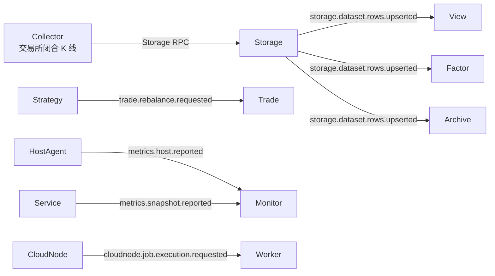

# Event System CR Remediation Implementation Plan

> **For agentic workers:** REQUIRED SUB-SKILL: Use superpowers:subagent-driven-development (recommended) or superpowers:executing-plans to implement this plan task-by-task. Steps use checkbox (`- [ ]`) syntax for tracking.

**Goal:** 按个人量化、新项目、不过度追求高可靠的边界，把事件系统收敛为五个真正跨进程的事件，删除 Tick/Streamcalc、通用 DLQ、Trade 自消费事件和重复注册配置，并修正 Runner、Monitor、保留时长约束及 Consumer 所有权问题。

**Architecture:** 业务模块只发布跨进程事实或命令，进程内状态推进使用本地数据库状态机和进程内唤醒，Timer 只负责启动恢复和遗漏兜底。事件定义采用 Go code-first，`Event` 同时表示事件名称、版本、payload factory、Stream 和 owner；`EventMessage` 只表示一次实际传输。EventBus YAML 的资源拓扑只包含 Stream/KV，Consumer 由消费服务通过唯一 `NewConsumer` API 声明、创建和校验；业务配置使用 `consumer`，只有 `packages/jetstream` 的 NATS 适配模型保留官方字段名 `Durable`。Storage 与 Strategy 在“本地状态和事件必须一起提交”时保留 outbox，其余路径不增加 Saga、全局事务、exactly-once 或 Schema Registry。

**Tech Stack:** Go 1.25, NATS JetStream, Protocol Buffers, SQLite/GORM, Pebble, Vue 3, Go workspace.

---

## 1. 执行边界

### 1.1 最终只保留五个业务事件

| Event | 语义 | 发布方 | 消费方 | 可靠性 |
|---|---|---|---|---|
| `storage.dataset.rows.upserted@1` | Storage 已提交行变更 | Storage | View / Factor / Archive | Storage Pebble batch + outbox |
| `metrics.host.reported@1` | 主机指标快照 | HostAgent | Monitor | best effort，最多投递 3 次 |
| `metrics.snapshot.reported@1` | 服务指标快照 | Service | Monitor | best effort，最多投递 3 次 |
| `cloudnode.job.execution.requested@1` | CloudNode 执行任务命令 | CloudNode | Worker | JetStream work queue |
| `trade.rebalance.requested@1` | 策略请求执行调仓 | Strategy | Trade | Strategy SQLite transaction + outbox |

最终调用关系：



### 1.2 已确认且不得在执行中反转的决策

1. Collector 只拉取交易所已经闭合的 K 线并直接写 Storage；V1 删除 Tick 事件、Streamcalc 和 `market.kline.closed` 事件。
2. `keep_duration` 是容量治理，不是业务删除。过期清理不发布删除事件，也不增加 tombstone。
3. Dataset 的 `keep_duration` 必须为 `0`，或不短于引用它的 View `keep_duration`；`0` 表示永久保留。
4. Storage 不支持删除已注册字段，只保留 `UpsertFields`。该项已由提交 `715f110a` 完成，本计划只把它作为验收前置条件。
5. 业务层统一使用 `consumer` 命名；只有 `packages/jetstream` 映射 NATS 配置时继续使用官方字段名 `Durable`。
6. Storage/outbox 语义使用“已提交”或 `committed`，不再用 `durable` 描述业务数据。
7. 本计划修改到的事件、Storage 和业务消费代码注释统一使用中文；Protobuf/Go API、NATS Header 和 JetStream 官方字段名保持英文。
8. 通用 EventBus DLQ 删除。永久错误 `TERM` 并记录结构化日志；临时错误 `NAK`；Archive 可继续使用自己的本地 quarantine 文件。
9. Trade 内部的订单推进、成交推进和对账使用数据库状态机；状态提交后立即唤醒本地 Worker，Timer 只做启动恢复和遗漏兜底，不通过 EventBus 给自己发事件。
10. 不引入 Kafka、Saga、全局事务、分布式锁、exactly-once、独立 Schema Registry、DLQ 管理后台或历史协议兼容层。

### 1.3 保留的基础协议

`EventMessage` 保持当前七个字段，不再扩展：

```protobuf
message EventMessage {
  string event_id = 1;
  string event_name = 2;
  uint32 event_version = 3;
  string space_id = 4;
  string subject_id = 5;
  google.protobuf.Timestamp occurred_at = 6;
  bytes payload = 7;
}
```

传输映射保持：

```text
Nats-Msg-Id = EventMessage.event_id
Content-Type = application/vnd.moox.event+protobuf
NATS Data = deterministic protobuf(EventMessage)
NATS Subject = moox.<event_name>.v<event_version>.<space_token>.<subject_token>
```

代码侧事件概念只保留：

```text
Event         静态事件契约和发布/消费句柄
EventMessage  一次实际传输的消息
Payload       具体 Protobuf 业务内容
```

不保留 `EventType`、`EventDefinition` 或 `EventSchema` 三套近义模型。

### 1.4 最初 CR 与执行任务映射

| 最初 CR | 本轮最终取舍 | 执行任务 |
|---|---|---|
| P0 Streamcalc 会提前或重复发布未闭合 K 线，Storage 不处理 revision | 删除 Tick/Streamcalc；Collector 只写交易所闭合 K 线 | Task 2 |
| P1 Storage 删除和过期清理无事件会让下游保留数据 | 不修复为删除事件；`keep_duration` 明确是容量治理，只增加 Dataset/View 保留时长约束 | Task 3 |
| P1 Monitor unknown producer 阈值 120 与 MaxDeliver=3 冲突 | 未注册 producer 第一次即 TERM；授权查询故障才 RETRY | Task 4 |
| P1 Runner 把 Handler `RETRY+Err` 当作进程失败 | Handler 错误只上报；只有 fetch/transport/context 结束 Runner | Task 1 |
| P1 DLQ 可能放大超过 8 MiB，且没有实用查看/重放入口 | 删除通用 DLQ；永久错误 TERM + 结构化日志，Archive 保留本地 quarantine | Task 5 |
| P2 YAML、EventType、AllEventTypes、factory 和 AST gate 重复 | 合并为 Go code-first `Event`，payload/subject/stream/owner 全部从单个值派生 | Task 6 |
| P2 Trade 通过 EventBus 消费自己的状态事件 | Trade 内部使用 DB 状态机和本地 Worker 唤醒，Timer 仅兜底；EventBus 只消费 Strategy 调仓命令 | Task 8 |
| P2 Consumer 创建所有权和磁盘淘汰策略漂移 | 消费服务通过 `NewConsumer` 创建并拥有 Consumer；EventBus 只拥有 Stream/KV；limits 统一 discard old | Task 7 |
| 后续决定删除 `DeleteFields` | 已由 `715f110a` 完成，本计划只做回归验收 | 第 2 节、Task 11 |
| 后续决定业务层直接使用 `consumer` | 业务配置改名；基础设施继续使用 JetStream `Durable` | Task 4、Task 7、Task 9 |
| 后续决定 Storage 描述使用 `committed` 且注释可用中文 | 修改触达文件的业务术语和注释 | Task 9 |
| 后续确认 metrics/job.requested 走 Event | 保留两类 metrics 事件和 CloudNode work queue 命令 | 第 1.1 节、Task 6、Task 7 |

## 2. 已完成基线

执行前必须确认 `715f110a` 仍在目标分支历史中：

```bash
git merge-base --is-ancestor 715f110a HEAD
```

Expected: exit code `0`。

该提交已经完成：

- 删除 DataNode、PrimaryStore、CLI 的 `DeleteFields` API。
- 将字段写入口统一为 `UpsertFields`。
- 更新并生成 Storage Protobuf。
- 字段管理 UI 增加“已注册字段不可删除，只能禁用”的提示。

本计划不得重新添加 `DeleteFields`、字段删除 operation 或兼容别名。

## 3. 目标 EventBus 拓扑

`modules/eventbus/config/app.yaml` 最终只包含以下 Stream：

| Stream | Subjects | Retention | Discard |
|---|---|---|---|
| `MOOX_STORAGE` | `moox.storage.dataset.rows.upserted.v1.>` | `limits` | `old` |
| `MOOX_METRICS` | `moox.metrics.>` | `limits` | `old` |
| `MOOX_CLOUDNODE_EXEC` | `moox.cloudnode.job.execution.requested.v1.>` | `work_queue` | `old` |
| `MOOX_TRADE` | `moox.trade.rebalance.requested.v1.>` | `work_queue` | `old` |

以下 Consumer 由各消费服务在启动时声明并调用 `NewConsumer` 创建或校验，EventBus 配置不保存这些定义：

| 所有者 | Stream | Consumer | Event | MaxDeliver |
|---|---|---|---|---|
| Storage View | `MOOX_STORAGE` | `storage_view` | `DatasetRowsUpserted` | `-1` |
| Factor | `MOOX_STORAGE` | `factor_calc` | `DatasetRowsUpserted` | `5` |
| Archive | `MOOX_STORAGE` | `moox_archive_kline_v1` | `DatasetRowsUpserted` | `-1` |
| Monitor HostMetrics | `MOOX_METRICS` | `monitor_hostmetrics_ingest_v1` | `MetricsHostReported` | `3` |
| Monitor Metrics | `MOOX_METRICS` | `monitor_metrics_ingest_v1` | `MetricsSnapshotReported` | `3` |
| Trade | `MOOX_TRADE` | `trade_rebalance_v1` | `TradeRebalanceRequested` | `-1` |

CloudNode 按执行路由生成 `cn_exec_` 前缀的 Consumer 名称，也通过同一个 `NewConsumer` API 创建。EventBus 只在启动时创建四个 Stream 和 KV，不创建、不更新、不删除任何业务 Consumer。

`NewConsumer` 的固定语义：

```text
Consumer 不存在                   -> 创建并返回
Consumer 配置完全一致             -> 绑定并返回
AckWait/MaxDeliver/MaxAckPending 不同 -> 更新后返回
Stream/Durable/Filter/DeliverPolicy 冲突 -> ErrConsumerConfigConflict
```

不可变配置冲突时不得自动删除重建，避免静默丢失消费位置。

## 4. 文件结构

### 4.1 Create

- `modules/storage/internal/service/metadata/sqlite/keep_duration.go`：Dataset/View 保留时长比较和引用校验。
- `modules/storage/internal/service/metadata/sqlite/keep_duration_test.go`：双向保留时长约束测试。
- `modules/monitor/internal/metrics/consumer_eventbus_test.go`：Monitor 的 TERM 和重投次数契约。
- `packages/events/consumer_test.go`：`Event` 派生 Stream/filter 并创建 Consumer 的契约测试。
- `modules/trade/internal/application/rebalance/request.go`：把 `trade.rebalance.requested` 权重命令转换为现有调仓计划。
- `modules/trade/internal/application/rebalance/request_test.go`：权重、固定资金、价格和当前仓位解析测试。
- `modules/trade/internal/bootstrap/kernel_wakeup.go`：数据库状态提交后的进程内 Worker 唤醒和恢复扫描。
- `modules/trade/internal/bootstrap/kernel_wakeup_test.go`：立即唤醒、合并重复唤醒和 Timer 兜底测试。
- `modules/trade/test/strategy_rebalance_event_e2e_test.go`：Strategy outbox 到 Trade 调仓计划的跨模块契约测试。

### 4.2 Delete

- `modules/streamcalc/**`：删除整个模块。
- `modules/collector/internal/sources/binance/tick.go`
- `modules/collector/internal/sources/binance/tick_test.go`
- `modules/storage/internal/service/primarystore/kline_consumer.go`
- `modules/storage/internal/service/e2e/market_pipeline_e2e_test.go`
- `packages/events/marketpb/**`
- `packages/events/tradingpb/**`
- `packages/events/registry/events.yaml`
- `packages/dlqpb/**`
- `packages/events/dlq.go`
- `modules/storage/internal/service/view/dlq.go`
- `modules/storage/internal/service/view/dlq_test.go`
- `packages/strategyeventpb/**`
- `modules/trade/internal/bootstrap/trading_signal_worker.go`
- `modules/trade/internal/bootstrap/trading_signal_worker_test.go`
- `modules/trade/internal/infra/bus/events.go`
- `modules/trade/internal/infra/bus/relay.go`
- `modules/trade/internal/infra/bus/relay_test.go`

### 4.3 Modify

- `packages/jetstream/runner.go`, `runner_test.go`：Handler 业务错误只上报，不终止 Runner。
- `packages/jetstream/consumer.go`, `consumer_test.go`：删除重复 create/bind API，统一为 `NewConsumer`。
- `packages/events/consumer.go`：适配统一的 JetStream Consumer API。
- `packages/events/registry.go`, `events_test.go`, `architecture_test.go`, `Makefile`, `go.mod`：code-first 事件定义和五事件词表。
- `packages/tradeeventpb/trade_events.proto` 及生成文件：只保留可执行的 `RebalanceRequested`。
- `modules/eventbus/config/app.yaml`
- `modules/eventbus/internal/config/config_defaults.go`
- `modules/eventbus/internal/config/config_test.go`
- `modules/eventbus/internal/config/config_types.go`
- `modules/eventbus/internal/config/config_validation.go`
- `modules/eventbus/internal/registry/registry.go`
- `modules/eventbus/internal/registry/registry_test.go`
- `modules/collector/internal/sources/binance/kline.go`
- `modules/collector/internal/sources/binance/kline_test.go`
- `modules/collector/internal/bootstrap/bootstrap.go`
- `modules/collector/internal/bootstrap/config.go`
- `modules/collector/config/app.yaml`
- `modules/storage/cmd/server/main.go`, `main_test.go`
- `modules/storage/internal/service/metadata/sqlite/crud_dataset.go`
- `modules/storage/internal/service/metadata/sqlite/crud_view.go`
- `modules/storage/internal/service/metadata/sqlite/dataset_test.go`
- `modules/storage/internal/service/metadata/sqlite/crud_test.go`
- `modules/storage/internal/service/view/consume.go`, `consume_test.go`
- `modules/archive/internal/config/config.go`, `config_test.go`
- `modules/archive/config/app.yaml`
- `modules/archive/internal/bootstrap/app.go`, `app_test.go`
- `modules/archive/internal/consumer/handler.go`, `handler_test.go`
- `modules/factor/internal/trigger/nats.go`, `nats_test.go`
- `modules/factor/internal/bootstrap/config.go`
- `modules/factor/config/app.yaml`
- `modules/monitor/internal/metrics/consumer.go`, `consumer_test.go`
- `modules/monitor/internal/hostmetrics/hostmetrics.go`, `hostmetrics_test.go`
- `modules/monitor/internal/bootstrap/metrics_runtime.go`
- `modules/trade/internal/config/app.go`, `app_test.go`
- `modules/trade/config/app.yaml`
- `modules/trade/internal/bootstrap/kernel_workers.go`, `kernel_workers_test.go`
- `modules/trade/internal/bootstrap/kernel_timers.go`
- `modules/trade/internal/application/rebalance/service.go`, `service_test.go`
- `modules/trade/internal/infra/store/store.go`, `store_test.go`
- `modules/trade/schema/bus.sql`, `rebalance.sql`, `schema_test.go`
- `modules/strategy/schema/strategy.sql`, `schema_test.go`
- `modules/strategy/internal/domain/types.go`
- `modules/strategy/internal/store/commit.go`, `commit_test.go`
- `modules/strategy/internal/store/bindings.go`, `bindings_test.go`
- `modules/strategy/internal/bus/publisher.go`, `publisher_test.go`
- `modules/strategy/test/outbox_jetstream_e2e_test.go`
- `web/src/views/data/datasets/index.vue`
- `web/src/views/data/datasets/dataset-lifecycle.test.ts`
- `go.work`
- 根 `Makefile`
- `scripts/verify-event-contracts.sh`
- `docs/架构总览.md`
- `docs/协议设计.md`
- `docs/运维/MooX-EventBus运维.md`
- `docs/运维/数据保留与磁盘空间.md`

历史实施计划作为历史证据保留，不回写成“当前架构”；当前架构文档必须明确旧 Tick、DLQ 和 Trade 自消费事件已删除。

## 5. 实施任务

### Task 1: 修正 JetStream Runner 的错误边界

**Files:**
- Modify: `packages/jetstream/runner.go`
- Modify: `packages/jetstream/runner_test.go`

- [ ] **Step 1: 写出 Handler 错误不终止 Runner 的失败测试**

增加以下三类用例：

```go
func TestRunnerRetryBusinessErrorReportsAndContinues(t *testing.T)
func TestRunnerTermBusinessErrorReportsAndContinues(t *testing.T)
func TestRunnerTransportActionErrorStops(t *testing.T)
```

前两个用例让 fake consumer 依次返回两个 batch：第一条 Handler 返回 `RETRY/TERM + Err`，第二条返回 `ACK`；断言 ErrorReporter 收到业务错误、第二个 batch 被消费、`Run` 仅在 context cancel 后返回 `nil`。第三个用例让 `Nak` 或 `Term` 返回错误，断言 `Run` 返回该 transport error。

- [ ] **Step 2: 验证现状会失败**

Run:

```bash
cd packages/jetstream
go test -count=1 -run 'TestRunner(RetryBusinessErrorReportsAndContinues|TermBusinessErrorReportsAndContinues|TransportActionErrorStops)' ./...
```

Expected: 前两个用例失败，现有 Runner 在第一次 Handler `Err` 后退出。

- [ ] **Step 3: 收窄 `Runner.handle` 返回错误的来源**

目标逻辑：

```go
result := r.handler.Handle(ctx, delivery)
if result.Err != nil {
	r.report(fmt.Errorf("handle delivery: %w", result.Err))
}
if err := ApplyHandlerResult(ctx, delivery, result); err != nil {
	return result, fmt.Errorf("apply handler result: %w", err)
}
if heartbeatErr := drainHeartbeatError(heartbeatErrs); heartbeatErr != nil {
	return result, heartbeatErr
}
return result, nil
```

`Run` 只因以下原因退出：

- `Fetch` 返回非 timeout、非 decode-only 的错误。
- `ACK/NAK/TERM/InProgress` 传输动作失败。
- context 取消。

HandlerResult 的 `Err` 只用于诊断，不加入 `batchErr`。当某条消息返回 `RETRY` 时，当前 batch 后续消息继续按相同 delay NAK，保持现有 lane 顺序语义。

- [ ] **Step 4: 更新接口中文注释**

`ErrorReporter` 注释改为“接收业务处理、拉取和传输动作错误；业务处理错误只上报，拉取和传输错误会结束本轮 Runner”。

- [ ] **Step 5: 运行完整包测试**

Run:

```bash
cd packages/jetstream
go test -race -count=1 ./...
```

Expected: PASS。

- [ ] **Step 6: 提交**

```bash
git add packages/jetstream/runner.go packages/jetstream/runner_test.go
git commit -m "fix(jetstream): keep runner alive after handler errors"
```

### Task 2: 删除 Tick/Streamcalc，Collector 直接写闭合 K 线

**Files:**
- Delete: `modules/streamcalc/**`
- Delete: `modules/collector/internal/sources/binance/tick.go`
- Delete: `modules/collector/internal/sources/binance/tick_test.go`
- Delete: `modules/storage/internal/service/primarystore/kline_consumer.go`
- Delete: `modules/storage/internal/service/e2e/market_pipeline_e2e_test.go`
- Delete: `packages/events/marketpb/**`
- Modify: `modules/collector/internal/sources/binance/kline.go`
- Modify: `modules/collector/internal/sources/binance/kline_test.go`
- Modify: `modules/collector/internal/bootstrap/bootstrap.go`
- Modify: `modules/storage/cmd/server/main.go`
- Modify: `modules/storage/cmd/server/main_test.go`
- Modify: `modules/admin/cmd/cli/eventbus_credentials.go`
- Modify: `modules/admin/cmd/cli/eventbus_credentials_test.go`
- Modify: `go.work`

- [ ] **Step 1: 锁定闭合 K 线直写行为**

在 `kline_test.go` 增加：

```go
func TestKlineCollectorLiveAlsoWritesOnlyClosedKlines(t *testing.T)
```

构造一根 `CloseTime <= now` 和一根 `CloseTime > now` 的交易所 K 线，设置 `CollectParams.Live=true`，断言：

- `MergeTimeSeriesRows` 只收到闭合 K 线。
- 未发生 EventBus publish。
- Storage watermark 仍作为起始游标。

- [ ] **Step 2: 验证测试在 Tick 分支下失败**

Run:

```bash
cd modules/collector
go test -count=1 ./internal/sources/binance -run TestKlineCollectorLiveAlsoWritesOnlyClosedKlines
```

Expected: FAIL，当前 `Live` 分支进入 `TickCollector`。

- [ ] **Step 3: 删除 Kline Collector 的事件分支**

`Collect` 不再判断 `params.Live`，所有模式统一执行当前的 Kline REST 拉取、水位推进、`filterClosedKlines` 和 `MergeTimeSeriesRows`。删除：

```go
var eventPublisher *events.Publisher
func SetEventPublisher(*events.Publisher)
func (*KlineCollector) CollectLive(...)
```

删除 `init()` 中 `DataType("tick")` 注册，只保留 spot/swap 的 `DataType("kline")`。

- [ ] **Step 4: 删除 Collector 对 EventBus 的启动依赖**

从 `bootstrap.Initialize` 删除 `jetstream.Connect`、`events.DefaultRegistry`、`events.NewPublisher` 和 `binance.SetEventPublisher`。Collector 的指标上报继续走 `packages/report`，不能因本任务误删。

同时从 Collector config 删除只服务 Tick publisher 的 EventBus 字段；若其他 Collector 功能仍读取同一配置，先用 `rg` 证明调用方后再删。

- [ ] **Step 5: 删除 Storage 市场事件入口**

从 Storage server 删除 `MOOX_MARKET` client/consumer、`storage_primary_kline_v1` 启动 goroutine和 `MOOX_STORAGE_KLINE_DURABLE` 环境变量。Storage 只接收 Collector 的 Storage RPC 写入，写入成功后继续由 DataNode outbox 产生 `DatasetRowsUpserted`。

- [ ] **Step 6: 删除模块和 workspace 引用**

删除上述文件和整个 `modules/streamcalc`，并从以下位置移除引用：

```text
go.work
modules/admin/cmd/cli/eventbus_credentials.go
modules/admin/cmd/cli/eventbus_credentials_test.go
scripts/verify-event-contracts.sh
```

根 `Makefile` 若有 Streamcalc build/test target，也一起删除。

- [ ] **Step 7: 用新的端到端测试替代市场事件 E2E**

不要保留旧 `Tick -> Streamcalc -> Storage` 测试。使用 Collector 包内测试覆盖“交易所闭合 K 线 -> Storage writer”，使用 Storage 既有 DataNode E2E 覆盖“RPC 写入 -> committed outbox -> View/Factor/Archive”。

- [ ] **Step 8: 运行模块测试和残留扫描**

Run:

```bash
(cd modules/collector && go test -race -count=1 ./...)
(cd modules/storage && CGO_ENABLED=1 go test -count=1 ./cmd/server ./internal/service/datanode/... ./internal/service/primarystore/...)
(cd modules/admin && go test -count=1 ./cmd/cli/...)
rg -n 'streamcalc|TickReceived|MarketKlineClosed|MOOX_MARKET|storage_primary_kline_v1' \
  modules packages go.work Makefile scripts \
  --glob '!**/*_test.go' --glob '!docs/**'
```

Expected: 测试 PASS；`rg` 无生产代码命中。

- [ ] **Step 9: 提交**

```bash
git add -A modules/streamcalc modules/collector modules/storage modules/admin packages/events/marketpb go.work Makefile scripts/verify-event-contracts.sh
git commit -m "refactor(market): write closed klines directly to storage"
```

### Task 3: 为 Dataset/View 增加保留时长约束，不发布清理事件

**Files:**
- Create: `modules/storage/internal/service/metadata/sqlite/keep_duration.go`
- Create: `modules/storage/internal/service/metadata/sqlite/keep_duration_test.go`
- Modify: `modules/storage/internal/service/metadata/sqlite/crud_dataset.go`
- Modify: `modules/storage/internal/service/metadata/sqlite/crud_view.go`
- Modify: `web/src/views/data/datasets/index.vue`
- Modify: `web/src/views/data/datasets/dataset-lifecycle.test.ts`

- [ ] **Step 1: 写双向约束测试**

测试矩阵：

| Dataset | View | 结果 |
|---|---|---|
| `0` | `720h` | allow |
| `720h` | `720h` | allow |
| `721h` | `720h` | allow |
| `719h` | `720h` | reject |
| Dataset 从 `720h` 改为 `24h`，已有 View=`168h` | - | reject |
| Dataset 从 `720h` 改为 `0` | - | allow |
| View 引用多个 Dataset，任一不足 | - | reject |

错误使用稳定 sentinel：

```go
var ErrDatasetKeepDurationShorterThanView = errors.New("dataset keep_duration must be 0 or not shorter than view keep_duration")
```

- [ ] **Step 2: 验证现状没有该约束**

Run:

```bash
cd modules/storage
CGO_ENABLED=1 go test -count=1 ./internal/service/metadata/sqlite -run KeepDuration
```

Expected: FAIL，当前只校验 duration 格式。

- [ ] **Step 3: 实现纯比较函数**

```go
func keepDurationCovers(datasetKeep, viewKeep string) (bool, error) {
	if datasetKeep == "0" {
		return true, nil
	}
	datasetDuration, err := time.ParseDuration(datasetKeep)
	if err != nil {
		return false, err
	}
	viewDuration, err := time.ParseDuration(viewKeep)
	if err != nil {
		return false, err
	}
	return datasetDuration >= viewDuration, nil
}
```

View 的 `0` 代表永久保留，因此只有 Dataset=`0` 可以覆盖 View=`0`；实现时必须在 `time.ParseDuration` 前单独处理这个分支。

- [ ] **Step 4: 在 View upsert 事务内校验所有 Dataset**

对去重后的 `primary_dataset_id + dataset_ids` 逐个读取 `t_datasets.c_keep_duration`。不存在的 Dataset 返回明确错误；任一 Dataset 不覆盖 View 时返回：

```text
dataset <dataset_id> keep_duration <dataset_keep> is shorter than view <view_id> keep_duration <view_keep>
```

校验必须和 View upsert 使用同一 SQLite transaction，避免读写之间出现不一致。

- [ ] **Step 5: 在 Dataset 缩短保留时长时反向校验**

`UpdateDataset` 在写入前查询所有满足以下条件的 View：

```sql
c_space_id = ?
AND (
  c_primary_dataset_id = ?
  OR EXISTS (
    SELECT 1 FROM json_each(c_dataset_ids_json)
    WHERE json_each.value = ?
  )
)
```

如果新的 `keep_duration` 不能覆盖任一 View，拒绝整个更新。Dataset 状态为 disabled 也不能绕过该约束。

- [ ] **Step 6: 保持过期清理为内部容量操作**

扫描 `CleanupExpiredBuckets`、过期清理 Timer 和 Pebble bucket 删除路径，确认不调用 events Publisher、不写 outbox。增加一条测试：执行过期 bucket 清理后 outbox count 不增加。

- [ ] **Step 7: 更新 UI 提示和源码契约测试**

在 Dataset 保留时长输入框下显示：

```text
被 View 使用时，Dataset 保留时长必须不小于 View 保留时长；0 表示永久保存。
```

`dataset-lifecycle.test.ts` 断言这段文案存在。

- [ ] **Step 8: 运行测试**

Run:

```bash
(cd modules/storage && CGO_ENABLED=1 go test -race -count=1 ./internal/service/metadata/sqlite ./internal/service/datanode/...)
(cd web && pnpm test -- dataset-lifecycle.test.ts)
```

Expected: PASS。

- [ ] **Step 9: 提交**

```bash
git add modules/storage/internal/service/metadata/sqlite web/src/views/data/datasets
git commit -m "feat(storage): enforce dataset and view keep duration"
```

### Task 4: 修正 Monitor 未知生产方策略

**Files:**
- Create: `modules/monitor/internal/metrics/consumer_eventbus_test.go`
- Modify: `modules/monitor/internal/metrics/consumer.go`
- Modify: `modules/monitor/internal/metrics/consumer_test.go`
- Modify: `modules/monitor/internal/hostmetrics/hostmetrics.go`
- Modify: `modules/monitor/internal/hostmetrics/hostmetrics_test.go`

- [ ] **Step 1: 写未知生产方和投递次数测试**

使用 embedded NATS 创建 `MOOX_METRICS` 和 `MaxDeliver=3` 的测试 Consumer：

1. 未注册 producer 的合法 MetricReport 第一次投递即 `TERM`。
2. Consumer `NumPending=0` 且不发生第二次投递。
3. authorizer 返回临时错误时返回 `RETRY`，JetStream 最多投递 3 次。

- [ ] **Step 2: 验证现状失败**

Run:

```bash
cd modules/monitor
go test -count=1 ./internal/metrics -run 'TestUnknownProducer|TestAuthorizerFailure'
```

Expected: FAIL；当前 unknown producer 阈值 `120` 永远达不到。

- [ ] **Step 3: 删除不可达 grace 阈值**

删除 `unknownProducerGraceDeliveries=120`。决策表：

```text
解码/契约错误              -> TERM + structured error
authorizer 查询失败         -> RETRY(1s) + error
authorizer 返回未注册       -> TERM + structured error
Storage/DB 临时写入失败      -> RETRY(1s) + error
写入成功                    -> ACK
```

未知 producer 日志字段至少包含：

```text
component=monitor_metrics
event_id
event_name
producer_id
subject
delivery_count
decision=term
reason=producer_not_registered
```

- [ ] **Step 4: 统一 HostMetrics 业务命名**

将业务常量：

```go
const Durable = "monitor_hostmetrics_ingest_v1"
```

改为：

```go
const Consumer = "monitor_hostmetrics_ingest_v1"
```

Task 7 迁移 Consumer API 时，将该业务名称映射到 `jetstream.ConsumerConfig.Durable`。

- [ ] **Step 5: 运行 Monitor 测试**

Run:

```bash
cd modules/monitor
go test -race -count=1 ./internal/metrics ./internal/hostmetrics ./internal/bootstrap
```

Expected: PASS。

- [ ] **Step 6: 提交**

```bash
git add modules/monitor/internal/metrics modules/monitor/internal/hostmetrics modules/monitor/internal/bootstrap
git commit -m "fix(monitor): term unknown metric producers"
```

### Task 5: 删除通用 DLQ，永久错误直接 TERM

**Files:**
- Delete: `packages/dlqpb/**`
- Delete: `packages/events/dlq.go`
- Delete: `modules/storage/internal/service/view/dlq.go`
- Delete: `modules/storage/internal/service/view/dlq_test.go`
- Modify: `modules/archive/internal/consumer/handler.go`
- Modify: `modules/archive/internal/consumer/handler_test.go`
- Modify: `modules/factor/internal/trigger/nats.go`
- Modify: `modules/factor/internal/trigger/nats_test.go`
- Modify: `modules/monitor/internal/metrics/consumer.go`
- Modify: `modules/monitor/internal/hostmetrics/hostmetrics.go`
- Modify: `modules/storage/internal/service/view/consume.go`
- Modify: `modules/storage/internal/service/view/consume_test.go`
- Modify: `modules/cloudnode/internal/jobqueue/jetstream_queue.go`
- Modify: `modules/cloudnode/internal/jobqueue/jetstream_queue_test.go`
- Modify: `modules/trade/internal/bootstrap/kernel_workers.go`
- Modify: `go.work`
- Modify: `Makefile`

- [ ] **Step 1: 为每个 Consumer 锁定错误分类**

每个模块至少增加以下测试：

```text
malformed protobuf      -> TERM
payload contract error  -> TERM
temporary store error   -> RETRY
successful processing   -> ACK
```

断言永久错误不会调用 EventBus publisher。Archive 额外断言本地 `journal.Quarantine` 写入成功后 TERM；本地 quarantine 写入失败时 RETRY。

- [ ] **Step 2: 验证当前测试依赖 DLQ**

Run:

```bash
rg -n 'PublishRejected|RejectedMessage|DLQPublisher|RetryExhausted|withTradeDLQ|MOOX_DLQ' \
  modules packages --glob '*.go' --glob '*.proto' --glob '*.yaml'
```

Expected: 命中 Archive、Factor、Monitor、Storage View、Trade、事件注册表和 `packages/dlqpb`。

- [ ] **Step 3: 删除共享 DLQ 协议和发布器**

删除 `packages/dlqpb` 和 `packages/events/dlq.go`，从 `go.work`、根 `Makefile` 和各模块 `go.mod` 删除 require/replace。

- [ ] **Step 4: 按模块替换为 TERM + 结构化日志**

统一永久错误结果：

```go
return jetstream.HandlerResult{
	Decision: jetstream.TERM,
	Err:      fmt.Errorf("decode event: %w", err),
}
```

Runner 的 ErrorReporter 负责结构化记录。日志字段统一为：

```text
component
consumer
event_id
event_name
subject
delivery_count
decision
reason
```

不得把原始 payload 全量写日志。

- [ ] **Step 5: 保留 Archive 的本地 quarantine**

Archive Handler 保留本地文件隔离，但删除 `DLQPublisher`、`JetStreamDLQ`、`NewHandlerWithDLQ`。处理顺序：

```text
永久错误 -> 写本地 quarantine -> TERM
quarantine 写失败 -> RETRY
临时 Archive 写失败 -> RETRY
成功 -> ACK
```

- [ ] **Step 6: 删除 Storage View `RetryExhausted` Hook**

`ConsumerOptions` 删除 `RetryExhausted`。达到 `MaxRetryAttempts` 时直接返回 `TERM + Err`，增加 `moox_storage_view_retry_exhausted_total` 指标和结构化日志，不再创建第二条事件。

- [ ] **Step 7: 删除 Trade 的 `withTradeDLQ`**

Trade handler 自己区分 permanent/transient；wrapper 不再把 TERM 改成 RETRY。后续 Task 8 会进一步删除多数 Trade handler。

- [ ] **Step 8: 运行受影响模块测试**

Run:

```bash
(cd modules/archive && go test -race -count=1 ./...)
(cd modules/factor && go test -race -count=1 ./internal/trigger/...)
(cd modules/monitor && go test -race -count=1 ./internal/metrics ./internal/hostmetrics)
(cd modules/storage && CGO_ENABLED=1 go test -count=1 ./internal/service/view/...)
(cd modules/cloudnode && go test -race -count=1 ./internal/jobqueue/...)
(cd modules/trade && go test -race -count=1 ./internal/bootstrap/...)
```

Expected: PASS。

- [ ] **Step 9: 扫描残留并提交**

Run:

```bash
rg -n 'packages/dlqpb|PublishRejected|RejectedMessage|MOOX_DLQ|dlq.message.rejected' \
  modules packages go.work Makefile --glob '!**/*_test.go'
```

Expected: 无命中。

```bash
git add -A packages/dlqpb packages/events modules go.work Makefile
git commit -m "refactor(events): remove shared eventbus dlq"
```

### Task 6: 将事件注册表改为 Go code-first

**Files:**
- Delete: `packages/events/registry/events.yaml`
- Delete: `packages/events/tradingpb/**`
- Delete: `packages/strategyeventpb/**`
- Modify: `packages/events/registry.go`
- Modify: `packages/events/message.go`
- Modify: `packages/events/decode.go`
- Modify: `packages/events/events_test.go`
- Modify: `packages/events/architecture_test.go`
- Modify: `packages/events/Makefile`
- Modify: `packages/events/go.mod`
- Modify: `modules/eventbus/internal/config/config_validation.go`
- Modify: `modules/eventbus/internal/registry/registry.go`
- Modify: `modules/eventbus/internal/rpc/service.go`
- Modify: `modules/eventbus/internal/rpc/service_test.go`
- Modify: `modules/storage/internal/service/view/eventconsumer/subject.go`
- Modify: `modules/storage/internal/service/view/eventconsumer/subject_test.go`
- Modify: `go.work`
- Modify: `Makefile`

- [ ] **Step 1: 写五事件词表测试**

架构测试必须精确断言：

```go
want := []string{
	"cloudnode.job.execution.requested@1",
	"metrics.host.reported@1",
	"metrics.snapshot.reported@1",
	"storage.dataset.rows.upserted@1",
	"trade.rebalance.requested@1",
}
```

同时断言每个 `Event`：

- payload factory 非空。
- payload full name 由 factory descriptor 得到。
- subject family 可派生。
- owner 和 stream 非空。
- 事件名唯一。

- [ ] **Step 2: 验证旧 YAML 和重复表仍存在**

Run:

```bash
cd packages/events
go test -count=1 -run 'TestEventContractArchitecture|TestBuiltInEvents' ./...
```

Expected: FAIL，当前注册表包含 18 个事件。

- [ ] **Step 3: 实现单点声明**

使用一个 `Event` 同时承载静态契约和发布/消费句柄：

```go
type Event struct {
	name       string
	version    uint32
	stream     string
	owner      string
	newPayload func() proto.Message
}

func (e Event) Name() string       { return e.name }
func (e Event) Version() uint32    { return e.version }
func (e Event) Stream() string     { return e.stream }
func (e Event) Owner() string      { return e.owner }
func (e Event) NewPayload() proto.Message {
	return e.newPayload()
}

var builtInEvents []Event

func declareEvent(
	name string,
	version uint32,
	stream string,
	owner string,
	newPayload func() proto.Message,
) Event {
	event := Event{
		name: name, version: version, stream: stream, owner: owner,
		newPayload: newPayload,
	}
	builtInEvents = append(builtInEvents, event)
	return event
}
```

五个导出变量各自只声明一次：

```go
var DatasetRowsUpserted = declareEvent(
	"storage.dataset.rows.upserted",
	1,
	"MOOX_STORAGE",
	"storage",
	func() proto.Message { return &storagepb.DatasetRowsUpserted{} },
)
```

其余四个事件按同样形式声明。`trade.rebalance.requested` 的 owner 是 `strategy`，stream 是 `MOOX_TRADE`。

- [ ] **Step 4: 从 `Event` 派生 payload 和 subject**

`DefaultRegistry` 直接遍历 `builtInEvents`。payload full name 使用：

```go
event.NewPayload().
	ProtoReflect().
	Descriptor().
	FullName()
```

subject 使用：

```go
fmt.Sprintf(
	"moox.%s.v%d.<space>.<subject>",
	event.Name(),
	event.Version(),
)
```

Registry API 收敛为：

```go
func (r *Registry) Lookup(name string, version uint32) (Event, bool)
func (r *Registry) Events() []Event
func (r *Registry) RenderSubject(event Event, spaceID, subjectID string) (string, error)
func (r *Registry) FamilyPattern(event Event) (string, error)
```

`Publisher.Publish`、`Registry.MarshalMessage` 和 Consumer 配置都直接接收 `Event`。

`Registry.ValidateMessage` 改为返回 `(Event, error)`；`DecodeRaw` 使用返回的 `Event.NewPayload()` 解码。EventBus RPC 直接遍历 `registry.Events()` 生成已有的 Protobuf `EventInfo`，Storage subject helper 直接调用 `registry.FamilyPattern(events.DatasetRowsUpserted)`。

删除：

```text
EventType
EventDefinition
EventSchema
embedded events.yaml
registryFile
NewRegistry(raw []byte)
payloadFactories()
AllEventTypes
PartitionKey
YAML tags
AST EventType declaration扫描
```

`Event` 字段保持私有，只允许 `packages/events` 内部 `declareEvent` 创建，业务不能制造未注册事件。

- [ ] **Step 5: 简化架构门禁**

`architecture_test.go` 不再解析 Go AST。新门禁只验证：

- `Registry.Events()` 返回五个 `Event` 的稳定只读副本。
- Event 没有重复 key、payload、subject。
- `EventMessage` 仍只有七个字段。
- 生产代码不直接调用 `PublishRaw` 或硬编码五个业务 subject。

- [ ] **Step 6: 删除无用 payload 包**

删除 market、trading、strategy event payload 包及 workspace/build 引用。`packages/tradeeventpb` 保留到 Task 8，只生成一个调仓命令 payload。

- [ ] **Step 7: 运行测试和依赖整理**

Run:

```bash
(cd packages/events && go mod tidy && go test -race -count=1 ./...)
(cd modules/eventbus && go test -count=1 ./internal/config ./internal/registry ./internal/rpc)
(cd modules/storage && CGO_ENABLED=1 go test -count=1 ./internal/service/view/eventconsumer)
go work sync
rg -n 'events.yaml|EventType|EventDefinition|EventSchema|AllEventTypes|payloadFactories|PartitionKey|NewRegistry\\(|BuiltInDefinitions' \
  packages/events modules --glob '*.go' --glob '*.yaml'
```

Expected: 测试 PASS；扫描无命中。

- [ ] **Step 8: 提交**

```bash
git add -A packages/events packages/strategyeventpb modules/eventbus/internal modules/storage/internal/service/view/eventconsumer go.work Makefile
git commit -m "refactor(events): declare event catalog in go"
```

### Task 7: 让消费服务通过唯一 `NewConsumer` API 拥有 Consumer

**Files:**
- Modify: `packages/jetstream/consumer.go`
- Modify: `packages/jetstream/consumer_test.go`
- Modify: `packages/jetstream/errors.go`
- Modify: `packages/jetstream/runner.go`
- Modify: `packages/jetstream/runner_test.go`
- Modify: `packages/jetstream/transport_test.go`
- Modify: `packages/events/consumer.go`
- Create: `packages/events/consumer_test.go`
- Modify: `modules/eventbus/config/app.yaml`
- Modify: `modules/eventbus/internal/config/config_defaults.go`
- Modify: `modules/eventbus/internal/config/config_test.go`
- Modify: `modules/eventbus/internal/config/config_types.go`
- Modify: `modules/eventbus/internal/config/config_validation.go`
- Modify: `modules/eventbus/internal/registry/registry.go`
- Modify: `modules/eventbus/internal/registry/registry_test.go`
- Modify: `modules/eventbus/test/storage_consumers_e2e_test.go`
- Modify: `modules/archive/internal/config/config.go`
- Modify: `modules/archive/config/app.yaml`
- Modify: `modules/archive/internal/bootstrap/app.go`
- Modify: `modules/archive/internal/bootstrap/app_test.go`
- Modify: `modules/archive/internal/consumer/runner.go`
- Modify: `modules/archive/internal/consumer/runner_test.go`
- Modify: `modules/archive/test/archive_e2e_test.go`
- Modify: `modules/factor/internal/trigger/nats.go`
- Modify: `modules/factor/internal/trigger/nats_test.go`
- Modify: `modules/factor/internal/bootstrap/config.go`
- Modify: `modules/factor/config/app.yaml`
- Modify: `modules/storage/internal/config/loader.go`
- Modify: `modules/storage/internal/service/view/consume.go`
- Modify: `modules/storage/cmd/server/main.go`
- Modify: `modules/monitor/internal/metrics/consumer.go`
- Modify: `modules/monitor/internal/hostmetrics/hostmetrics.go`
- Modify: `modules/cloudnode/internal/jobqueue/jetstream_queue.go`
- Modify: `modules/cloudnode/internal/jobqueue/jetstream_queue_test.go`
- Modify: `modules/trade/internal/config/app.go`
- Modify: `modules/trade/config/app.yaml`
- Modify: `modules/trade/internal/bootstrap/kernel_workers.go`
- Modify: `modules/trade/internal/bootstrap/trading_signal_worker.go`
- Modify: `modules/trade/test/eventbus_e2e_test.go`

- [ ] **Step 1: 写 EventBus 与 Consumer 所有权测试**

EventBus repository config 测试必须断言：

```text
app.yaml 只有 broker/internal_client/health/streams/kv
Config 不再包含 Consumers
Config 不再包含 ConsumerTemplates
EventBus registry 不调用 AddConsumer/UpdateConsumer/DeleteConsumer
```

每个业务模块测试自己的 Consumer name、Event、AckWait、MaxDeliver、MaxAckPending 和 DeliverPolicy。不得在 EventBus 测试中复制业务 Consumer 表。

`packages/jetstream/consumer_test.go` 增加：

```go
func TestNewConsumerCreatesWhenMissing(t *testing.T)
func TestNewConsumerBindsMatchingConsumer(t *testing.T)
func TestNewConsumerUpdatesMutableFields(t *testing.T)
func TestNewConsumerRejectsImmutableConflict(t *testing.T)
func TestNewConsumerDoesNotDeleteConflictingConsumer(t *testing.T)
```

- [ ] **Step 2: 让 `Default()` 只提供标量默认值**

`Default()` 只保留：

```go
Broker
InternalClient
Health
```

`Streams` 和 `KV` 不得在 Go 中硬编码；`Consumers`、`ConsumerTemplates` 及其 config type 直接删除。`Load` 的顺序保持：

```text
scalar defaults -> YAML -> normalize -> env override -> Validate
```

- [ ] **Step 3: 将 YAML 改为四个 Stream 和 KV**

按第 3 节的表删除：

```text
MOOX_MARKET
MOOX_DLQ
MOOX_STRATEGY
trade_execution_v1
trade_reconciliation_v1
trade_progress_v1
trade_trading_signal_v1
streamcalc_kline_v1
storage_primary_kline_v1
```

删除整个 `consumers:` 和 `consumer_templates:` 段。所有 `limits` Stream 显式写 `discard: old`，`MOOX_TRADE` 改成 `work_queue`。

- [ ] **Step 4: 只校验 `Event` 与 Stream 的关系**

`Config.Validate` 遍历 `registry.Events()`：

1. `event.Stream()` 存在。
2. 该 Stream 的 subjects 覆盖 `registry.FamilyPattern(event)`。
3. family 只被一个 Stream 覆盖。

EventBus 不再校验 Consumer；Consumer 的 Event/filter 一致性由 `events.NewConsumer` 和各模块测试负责。

- [ ] **Step 5: 实现唯一的 `NewConsumer` API 并删除重复入口**

在一个可编译提交中增加 `Client.NewConsumer`、迁移全部调用方，并删除：

```text
NewPullConsumer
EnsurePullConsumer
BindPullConsumer
BindManagedPullConsumer
ConsumerRef
ConsumerBindRef
PullConsumer
PullConsumerAPI
NewConsumerFromPull
```

公开类型统一为：

```go
type Consumer struct {
	// 内部仍然使用 NATS pull subscription。
}

type ConsumerConfig struct {
	Stream              string
	Durable             string
	FilterSubject       string
	AckWait             time.Duration
	MaxDeliver          int
	MaxAckPending       int
	FetchMaxWait        time.Duration
	DeliverPolicy       nats.DeliverPolicy
	DeliverDecodeErrors bool
}

func (c *Client) NewConsumer(
	ctx context.Context,
	cfg ConsumerConfig,
) (*Consumer, error)
```

`Runner` 的依赖接口同步重命名为 `ConsumerAPI`。`events.Consumer` 直接保存 `*jetstream.Consumer`，删除只为旧类型适配存在的 `NewConsumerFromPull`。

`NewConsumer` 不根据默认零值偷偷改变显式配置；默认值只在调用方未填写时应用。不可变字段冲突返回：

```go
var ErrConsumerConfigConflict = errors.New("jetstream consumer config conflict")
```

用于服务端对账的字段：

```text
不可变：Stream、Durable、FilterSubject、DeliverPolicy
可更新：AckWait、MaxDeliver、MaxAckPending
仅本地：FetchMaxWait、DeliverDecodeErrors
```

仅本地字段不得参与 JetStream 配置冲突判断。

错误中必须列出 Consumer 名称和冲突字段，不包含凭据。

- [ ] **Step 6: 让 `events.NewConsumer` 派生 Stream 和 filter**

业务侧使用：

```go
type ConsumerConfig struct {
	Name                string
	Event               Event
	AckWait             time.Duration
	MaxDeliver          int
	MaxAckPending       int
	FetchMaxWait        time.Duration
	DeliverPolicy       nats.DeliverPolicy
	DeliverDecodeErrors bool
}

func NewConsumer(
	ctx context.Context,
	client *jetstream.Client,
	registry *Registry,
	cfg ConsumerConfig,
) (*Consumer, error)
```

`events.NewConsumer` 使用 `cfg.Event.Stream()` 和 `registry.FamilyPattern(cfg.Event)` 生成底层配置，并映射：

```go
jetstream.ConsumerConfig{
	Stream:        cfg.Event.Stream(),
	Durable:       cfg.Name,
	FilterSubject: family,
	// 其余字段逐项映射。
}
```

Archive、Factor、Storage View、Monitor 和 Trade 使用 `events.NewConsumer`。CloudNode 的 route filter 比 event family 更窄，直接使用 `jetstream.Client.NewConsumer`，但仍从 `Event` 派生 subject 前缀。

这里的“唯一 API”指 `packages/jetstream` 只有一个 Consumer 生命周期入口 `Client.NewConsumer`；`events.NewConsumer` 是增加 EventMessage 解码的类型化包装，不定义第二套创建/绑定语义。

- [ ] **Step 7: 重命名业务配置**

执行以下重命名，不保留兼容字段：

```text
Archive.EventBus.Durable       -> Archive.EventBus.Consumer
archive.eventbus.durable       -> archive.eventbus.consumer
Factor LiveDurable             -> LiveConsumer
Storage ConsumerName           -> Consumer
Trade RebalanceDurable         -> RebalanceConsumer
trade.rebalance_durable        -> trade.rebalance_consumer
HostMetrics Durable            -> Consumer
```

业务调用使用：

```go
events.ConsumerConfig{
	Name:  cfg.Consumer,
	Event: events.DatasetRowsUpserted,
}
```

只有 `packages/jetstream.ConsumerConfig.Durable` 和 NATS `ConsumerConfig.Durable` 保留 `Durable`。

- [ ] **Step 8: 扫描旧 API 和中心化 Consumer 残留**

Run:

```bash
rg -n 'NewPullConsumer|EnsurePullConsumer|BindPullConsumer|BindManagedPullConsumer|ConsumerBindRef|ConsumerRef|PullConsumer|PullConsumerAPI|NewConsumerFromPull' \
  modules packages --glob '*.go'
rg -n '^consumers:|^consumer_templates:|Consumers|ConsumerTemplates' \
  modules/eventbus --glob '*.go' --glob '*.yaml'
```

Expected: 两次扫描都无命中。

- [ ] **Step 9: 运行 EventBus、Consumer API 和业务配置测试**

Run:

```bash
(cd packages/jetstream && go test -race -count=1 ./...)
(cd packages/events && go test -race -count=1 ./...)
(cd modules/eventbus && go test -race -count=1 ./...)
(cd modules/archive && go test -count=1 ./internal/config ./internal/bootstrap)
(cd modules/factor && go test -count=1 ./internal/trigger ./internal/bootstrap)
(cd modules/storage && CGO_ENABLED=1 go test -count=1 ./internal/config ./internal/service/view)
(cd modules/monitor && go test -count=1 ./internal/metrics ./internal/hostmetrics)
(cd modules/cloudnode && go test -count=1 ./internal/jobqueue)
(cd modules/trade && go test -count=1 ./internal/config)
```

Expected: PASS。

- [ ] **Step 10: 提交**

```bash
git add packages/jetstream packages/events modules/eventbus modules/archive modules/factor modules/storage modules/monitor modules/cloudnode modules/trade
git commit -m "refactor(events): let services own consumers"
```

### Task 8: 将 Strategy -> Trade 收敛为唯一调仓命令

**Files:**
- Modify: `packages/tradeeventpb/trade_events.proto`
- Modify: `packages/tradeeventpb/trade_events.pb.go`
- Modify: `modules/strategy/schema/strategy.sql`
- Modify: `modules/strategy/internal/domain/types.go`
- Modify: `modules/strategy/internal/store/commit.go`
- Modify: `modules/strategy/internal/store/commit_test.go`
- Modify: `modules/strategy/internal/store/bindings.go`
- Modify: `modules/strategy/internal/store/bindings_test.go`
- Modify: `modules/strategy/test/outbox_jetstream_e2e_test.go`
- Create: `modules/trade/internal/application/rebalance/request.go`
- Create: `modules/trade/internal/application/rebalance/request_test.go`
- Modify: `modules/trade/internal/application/rebalance/service.go`
- Modify: `modules/trade/internal/application/rebalance/service_test.go`
- Modify: `modules/trade/internal/bootstrap/kernel_workers.go`
- Modify: `modules/trade/internal/bootstrap/kernel_workers_test.go`
- Create: `modules/trade/internal/bootstrap/kernel_wakeup.go`
- Create: `modules/trade/internal/bootstrap/kernel_wakeup_test.go`
- Modify: `modules/trade/internal/bootstrap/kernel_timers.go`
- Modify: `modules/trade/internal/infra/store/store.go`
- Modify: `modules/trade/schema/bus.sql`
- Modify: `modules/trade/schema/rebalance.sql`
- Create: `modules/trade/test/strategy_rebalance_event_e2e_test.go`

- [ ] **Step 1: 定义可执行但不过度复杂的命令**

`trade_events.proto` 删除 OrderSnapshot、FillReceived、ReconciliationRequested、RebalanceCompleted，只保留：

```protobuf
message RebalanceTarget {
  string instrument_id = 1;
  string symbol = 2;
  string market_type = 3;
  string target_weight = 4;
}

message RebalanceRequested {
  string request_id = 1;
  string strategy_run_id = 2;
  string execution_binding_id = 3;
  string account_id = 4;
  string channel_id = 5;
  string mode = 6;
  string data_revision = 7;
  string capital_amount = 8;
  string quote_asset = 9;
  repeated RebalanceTarget targets = 10;
}
```

约束：

- `request_id == EventMessage.event_id`。
- `execution_binding_id == EventMessage.subject_id`。
- `mode` 只允许 `paper`、`live`。
- `capital_amount` 是用户为该执行绑定配置的固定执行资金，不动态计算账户总权益。
- V1 使用 `target_quantity = capital_amount * target_weight / latest_price`。
- 数量按 Trade instrument precision 向零截断。
- 当前仓位来自 Trade 本地 position projection。

这套约束刻意避免账户净值估算、保证金优化器和组合级资金调度。

- [ ] **Step 2: 扩展 Strategy execution binding**

新项目直接修改建表定义：

```sql
t_strategy_execution_bindings (
  ...
  c_channel_id TEXT NOT NULL,
  c_capital_amount TEXT NOT NULL,
  c_quote_asset TEXT NOT NULL DEFAULT 'USDT',
  ...
)
```

同步 domain、RPC 和页面当前 execution binding 编辑入口；`paper/live` 模式必须填写 channel、正数 capital，`observe` 不发布执行命令。

- [ ] **Step 3: 写 Strategy commit 测试**

覆盖：

```text
action=hold                              -> 0 outbox
action=rebalance, only observe binding   -> 0 outbox
action=rebalance, paper binding          -> 1 command
action=rebalance, paper+live bindings    -> 2 commands
重复 commit 同一个 run                   -> 不增加命令
缺 channel/capital 的执行绑定             -> commit 失败且状态/outbox 一起回滚
```

事件 ID：

```go
eventID := task.RunID + ":rebalance:" + executionBindingID
```

- [ ] **Step 4: 在 Strategy transaction 中写调仓命令**

`Commit` 先写 run/state，再通过 `t_strategy_bindings.c_group_id` 查询 enabled execution bindings。仅对 `paper/live` 生成 `tradeeventpb.RebalanceRequested`，并把完整 EventMessage 写入现有 `t_strategy_outbox`。

删除 `StrategyOutputAccepted` payload 和事件。Strategy outbox relay 保留，因为 state commit 和命令 publish 必须一致。

- [ ] **Step 5: 实现 Trade 请求解析器**

`request.go` 定义：

```go
type SnapshotResolver interface {
	ResolveLatestPrice(
		context.Context,
		string,
		string,
		*tradeeventpb.RebalanceTarget,
	) (Market, error)
	ResolveCurrentQuantity(
		context.Context,
		string,
		string,
		string,
	) (shared.Decimal, error)
	RoundQuantity(
		context.Context,
		string,
		shared.Decimal,
	) (shared.Decimal, error)
}

type RequestPlanner struct {
	Resolver SnapshotResolver
}
```

`Build` 验证所有必填字段、weight 合法性和 gross weight `<= 1`，解析固定资金和价格，产出当前 `Service.Create` 所需的 `Targets/Currents/Markets`。

永久错误：

```text
字段缺失
非法 decimal
重复 symbol
gross weight > 1
未知 market_type
```

临时错误：

```text
最新价格读取失败
仓位读取失败
instrument precision 读取失败
SQLite busy
```

- [ ] **Step 6: 让 Trade Consumer 原子记录 inbox 和调仓计划**

为 `Tx` 增加：

```go
func (t *Tx) RecordInbox(consumer, eventID, eventName string) (bool, error)
```

`Service.CreateFromEvent` 在同一个 SQLite transaction 中：

1. 插入 inbox；已存在则直接成功。
2. 写 `t_rebalance_runs` 和 legs。
3. 不写 Trade outbox。

Consumer 成功持久化计划后 ACK，并调用本地 `Wake()`；永久校验错误 TERM，Snapshot/DB 临时错误 RETRY。

- [ ] **Step 7: 删除 Trade 自发布事件**

从 `Service.Create` 删除 `EncodeRebalanceRequested` 和 `tx.AddOutbox`。从 `Advance` 删除 `EncodeRebalanceCompleted` 和 `tx.AddOutbox`。

删除：

```text
t_trade_outbox
Trade Relay
execution consumer
progress consumer
reconciliation consumer
trading signal consumer
TradeOrderIntentCreated
TradeOrderStateChanged
TradeExecutionSliceReady
TradeFillReceived
TradeRebalanceCompleted
TradeReconciliationRequested
TradeOrderAcknowledged
TradeOrderSubmitUnknown
TradingSignal
```

Trade 只保留自己通过 `events.NewConsumer` 创建的 `trade_rebalance_v1` Consumer。

- [ ] **Step 8: 用本地唤醒推进正常流程**

`startKernelWorkers` 只启动：

```text
rebalance Consumer
private stream supervisor
trade state worker
```

新增进程内唤醒器：

```go
type kernelWakeup struct {
	ch chan struct{}
}

func newKernelWakeup() *kernelWakeup {
	return &kernelWakeup{ch: make(chan struct{}, 1)}
}

func (w *kernelWakeup) Wake() {
	select {
	case w.ch <- struct{}{}:
	default:
	}
}
```

以下状态提交成功后立即调用 `Wake()`：

```text
Rebalance Consumer 创建 PLANNED run
RPC 创建 READY order
private stream 写入 fill
对账更新 order/fill/position
cancel/replace saga 状态变化
```

Worker 收到唤醒后调用 `recoverOrdersOnce`，继续处理 READY、SUBMITTING、SUBMIT_UNKNOWN、cancel saga 和 active rebalance。buffer 大小为 1，重复唤醒自动合并；真正待处理工作始终以 DB 为准，channel 不承载业务数据。

- [ ] **Step 9: 让 Timer 只承担恢复兜底**

保留两个低频 Timer：

```text
trade_order_recovery: 15s
trade_fill_reconcile: 30s
```

进程启动时先执行一次 recovery，然后进入“本地唤醒 + 低频 Timer”循环。Timer 只处理以下情况：

```text
进程在 DB commit 后、Wake 前崩溃
channel 唤醒被合并
外部成交回报遗漏，需要主动 reconcile
启动时 DB 已存在未完成工作
```

正常下单和成交推进测试不得等待 Timer。

- [ ] **Step 10: 写跨模块 E2E**

`strategy_rebalance_event_e2e_test.go` 使用 embedded NATS：

1. 初始化四 Stream，不预建 `trade_rebalance_v1`。
2. Strategy commit 写一条 outbox。
3. Strategy relay 发布 `trade.rebalance.requested`。
4. Trade 通过 `events.NewConsumer` 创建 Consumer，消费并创建一个 `PLANNED` run。
5. 重发同一个 EventMessage，Trade inbox 保证仍只有一个 run。
6. 不推进 fake clock，断言本地 Wake 立即推进已经落库的 run。
7. 单独构造“DB 已提交但没有 Wake”的重启场景，推进 15s fake clock 后由 recovery Timer 补偿。

- [ ] **Step 11: 运行 Strategy/Trade 全测试**

Run:

```bash
(cd packages/tradeeventpb && make all && go test ./...)
(cd modules/strategy && CGO_ENABLED=1 go test -race -count=1 ./...)
(cd modules/trade && CGO_ENABLED=1 go test -race -count=1 ./...)
```

Expected: PASS。

- [ ] **Step 12: 扫描 Trade 自消费残留**

Run:

```bash
rg -n 'TradeOrder|TradeExecution|TradeFill|TradeReconciliation|TradeRebalanceCompleted|TradingSignal|t_trade_outbox|withTradeDLQ' \
  modules/trade modules/strategy packages/events packages/tradeeventpb \
  --glob '*.go' --glob '*.proto' --glob '*.sql' --glob '*.yaml'
```

Expected: 无命中。

- [ ] **Step 13: 提交**

```bash
git add -A packages/tradeeventpb packages/strategyeventpb modules/strategy modules/trade
git commit -m "refactor(trade): consume only strategy rebalance commands"
```

### Task 9: 收敛术语、注释和架构门禁

**Files:**
- Modify: `modules/storage/internal/service/datanode/service.go`
- Modify: `modules/storage/internal/service/datanode/pebble/store.go`
- Modify: `modules/storage/internal/health/server.go`
- Modify: `modules/archive/internal/config/config.go`
- Modify: `modules/factor/internal/trigger/nats.go`
- Modify: `modules/monitor/internal/hostmetrics/hostmetrics.go`
- Modify: `modules/trade/internal/config/app.go`
- Modify: `scripts/verify-event-contracts.sh`

- [ ] **Step 1: 改写 Storage/outbox 注释**

以下语义统一：

```text
durable event payload      -> committed event payload / 已提交事件载荷
durable outbox row         -> committed outbox row / 已提交 outbox 记录
durable dependency         -> 持久化依赖
durable latest value       -> 已提交的最新值
```

例如：

```go
// UpsertFieldsEvent 为本次已提交写入涉及的每个 Dataset 返回一条事件载荷。
```

不要改 JetStream `Durable` 字段和确实表示崩溃恢复能力的技术描述。

- [ ] **Step 2: 将本计划触达文件的注释改为中文**

范围限于本计划修改过的事件、Storage、Monitor、Archive、Factor、Strategy、Trade 文件。导出符号注释仍以符号名开头，满足 golint 风格：

```go
// Consumer 表示业务模块绑定的 EventBus Consumer 名称。
```

- [ ] **Step 3: 更新 contract gate**

`verify-event-contracts.sh` 最终执行：

```bash
(cd packages/events && go test ./...)
(cd packages/jetstream && go test ./...)
(cd modules/eventbus && go test ./...)
(cd modules/collector && go test ./internal/sources/binance)
(cd modules/storage && CGO_ENABLED=1 go test ./internal/service/datanode/... ./internal/service/view/...)
(cd modules/monitor && go test ./internal/metrics ./internal/hostmetrics)
(cd modules/strategy && CGO_ENABLED=1 go test ./internal/store ./internal/bus)
(cd modules/trade && CGO_ENABLED=1 go test ./internal/bootstrap ./internal/application/rebalance)
```

并增加生产源码扫描：

```text
禁止 streamcalc/Tick/MarketKlineClosed/MOOX_MARKET
禁止 packages/dlqpb/PublishRejected/MOOX_DLQ
禁止 Trade 自消费事件
禁止业务 YAML key 使用 *_durable 或 durable:
禁止 modules 直接 PublishRaw
只允许五个 Event 值
禁止 EventType/EventDefinition/EventSchema
禁止 NewPullConsumer/EnsurePullConsumer/BindPullConsumer/BindManagedPullConsumer/PullConsumerAPI/NewConsumerFromPull
禁止 EventBus YAML 出现 consumers/consumer_templates
```

Archive/Factor 等技术注释中的英文单词不作为门禁；门禁只匹配配置字段和 Go 配置成员。

- [ ] **Step 4: 修复 workspace boundary gate 的现有假阳性**

删除市场 E2E 后，Storage 不应再依赖 Collector testkit。同步删除 `modules/storage/go.mod` 中的 Collector require/replace。

若 `make check-boundaries` 仍因局部变量 `newEnvelope` 命中旧信封规则，将变量改为 `eventMessage`；不要放宽禁止旧 `MooxMessage` 的规则。

- [ ] **Step 5: 运行门禁**

Run:

```bash
./scripts/verify-event-contracts.sh
make check-boundaries
make test-storage-boundary
git diff --check
```

Expected: 全部 PASS，不接受“既有失败”作为本计划完成条件。

- [ ] **Step 6: 提交**

```bash
git add modules packages scripts/verify-event-contracts.sh
git commit -m "chore(events): align consumer terminology and contract gates"
```

### Task 10: 更新当前架构和运维文档

**Files:**
- Modify: `docs/架构总览.md`
- Modify: `docs/协议设计.md`
- Modify: `docs/运维/MooX-EventBus运维.md`
- Modify: `docs/运维/数据保留与磁盘空间.md`
- Modify: `README.md`

- [ ] **Step 1: 更新架构图和事件表**

文档只展示第 1.1 节五个事件。明确：

- Collector 直接写闭合 K 线。
- Storage committed upsert 触发 View/Factor/Archive。
- Strategy 只在 paper/live execution binding 上发布调仓命令。
- Trade 正常流程由 DB commit 后的本地 Wake 立即推进；Timer 只负责启动恢复和遗漏兜底。
- EventBus 只创建 Stream/KV；每个消费服务通过 `NewConsumer` 创建并拥有自己的 Consumer。

- [ ] **Step 2: 更新保留时长说明**

写清：

```text
过期清理不产生业务事件。
Dataset keep_duration 必须为 0 或 >= 所有引用 View 的 keep_duration。
0 表示永久保存。
设置更短的 keep_duration 会在元数据写入阶段被拒绝。
```

- [ ] **Step 3: 更新 EventBus 运维说明**

删除 DLQ 查看/重放命令，替换为：

```text
永久错误：查看对应 consumer 的 structured error log 和 terminated counter。
Archive 数据错误：查看 Archive 本地 quarantine。
临时错误：查看 NumRedelivered、AckPending 和模块 retry counter。
```

说明 `limits + discard old` 是个人系统的容量策略，允许旧消息自然淘汰。

- [ ] **Step 4: 标记旧计划为历史**

不修改旧计划的原始结论；在当前架构文档中注明：

```text
2026-07-24 之前的 EventMessage/streaming 计划记录的是当时的过渡架构，
当前运行契约以本计划完成后的五事件拓扑为准。
```

- [ ] **Step 5: 文档扫描**

Run:

```bash
rg -n 'Streamcalc|MOOX_MARKET|MOOX_DLQ|dlq.message.rejected|trade.execution.slice.ready|trade.fill.received' \
  README.md docs/架构总览.md docs/协议设计.md docs/运维
```

Expected: 仅允许出现在“已删除/历史架构”说明中。

- [ ] **Step 6: 提交**

```bash
git add README.md docs/架构总览.md docs/协议设计.md docs/运维
git commit -m "docs(events): document simplified five-event architecture"
```

### Task 11: 全量验证和目标环境验收

**Files:**
- Modify only if verification exposes a defect in the scoped implementation.

- [ ] **Step 1: 运行事件契约和重点模块测试**

Run:

```bash
./scripts/verify-event-contracts.sh
```

Expected: `event contract verification passed`。

- [ ] **Step 2: 运行 workspace 测试**

Run:

```bash
./scripts/test-go-workspace.sh
```

Expected: 所有 workspace module 的 `go test` 和 `go vet` PASS。

- [ ] **Step 3: 运行 Web 测试和构建**

Run:

```bash
cd web
pnpm test
pnpm build:prod
```

Expected: PASS，构建无 TypeScript/Vue 错误。

- [ ] **Step 4: 运行重点 race 测试**

Run:

```bash
(cd packages/jetstream && go test -race -count=1 ./...)
(cd packages/events && go test -race -count=1 ./...)
(cd modules/eventbus && go test -race -count=1 ./...)
(cd modules/monitor && go test -race -count=1 ./internal/metrics ./internal/hostmetrics)
(cd modules/strategy && CGO_ENABLED=1 go test -race -count=1 ./internal/store ./internal/bus)
(cd modules/trade && CGO_ENABLED=1 go test -race -count=1 ./internal/bootstrap ./internal/application/rebalance)
```

Expected: PASS。

- [ ] **Step 5: 运行最终残留扫描**

Run:

```bash
rg -n 'streamcalc|TickReceived|MarketKlineClosed|MOOX_MARKET|packages/dlqpb|MOOX_DLQ|PublishRejected|EventType|EventDefinition|EventSchema|AllEventTypes|partition_key|StrategyOutputAccepted|TradingSignal|TradeExecutionSliceReady|TradeFillReceived|TradeReconciliationRequested|t_trade_outbox|NewPullConsumer|EnsurePullConsumer|BindPullConsumer|BindManagedPullConsumer|ConsumerBindRef|ConsumerRef|PullConsumer|PullConsumerAPI|NewConsumerFromPull' \
  modules packages go.work Makefile scripts \
  --glob '*.go' --glob '*.proto' --glob '*.sql' --glob '*.yaml' --glob 'go.mod' --glob 'go.work' --glob 'Makefile'
rg -n '^consumers:|^consumer_templates:|Consumers|ConsumerTemplates' \
  modules/eventbus --glob '*.go' --glob '*.yaml'
```

Expected: 两次扫描都无命中。

- [ ] **Step 6: 验证只有五个事件**

Run:

```bash
cd packages/events
go test -count=1 -run TestBuiltInEvents ./...
```

Expected: PASS，输出中没有额外事件。

- [ ] **Step 7: 目标 Linux/CGO 验收**

使用仓库已有 Linux build 脚本构建 Storage、Strategy、Trade，并在同一 SHA 上运行：

```bash
./scripts/build-storage-linux.sh
```

随后在目标机执行该 SHA 对应的：

```bash
(cd modules/storage && CGO_ENABLED=1 go test ./internal/service/metadata/sqlite ./internal/service/datanode/... ./internal/service/view/...)
(cd modules/strategy && CGO_ENABLED=1 go test ./...)
(cd modules/trade && CGO_ENABLED=1 go test ./...)
```

Expected: PASS；返回 artifact 必须是 Linux ELF，记录其 `GIT_COMMIT` 与当前验收 SHA 相同。

- [ ] **Step 8: 检查最终 diff**

Run:

```bash
git status --short
git diff --check
git log --oneline --decorate -12
```

Expected: 只有本计划范围内变更；`git diff --check` 无输出。

- [ ] **Step 9: 最终提交**

如果验证阶段产生修复：

```bash
git add -A
git commit -m "test(events): complete simplified event system acceptance"
```

若没有额外变更，不创建空提交。

- [ ] **Step 10: 推送并验证远端**

```bash
git push origin feature/mooyang
LOCAL_SHA=$(git rev-parse HEAD)
REMOTE_SHA=$(git ls-remote origin refs/heads/feature/mooyang | awk '{print $1}')
test "$LOCAL_SHA" = "$REMOTE_SHA"
```

Expected: `LOCAL_SHA == REMOTE_SHA`。只有该检查通过后，才能声明计划实施已经远端落地。

## 6. 验收标准

### 6.1 结构

- [ ] 生产代码中只存在五个 `Event` 值，不存在 `EventType/EventDefinition/EventSchema`。
- [ ] `packages/events` 不再读取 YAML 注册表。
- [ ] EventBus YAML 只定义 Stream/KV，不包含 Consumer 或 Consumer template。
- [ ] 每个业务 Consumer 由所属消费服务调用唯一的 `NewConsumer` 创建和校验。
- [ ] 生产代码不存在旧 Pull/create/bind Consumer API。
- [ ] `modules/streamcalc`、`packages/dlqpb`、`packages/strategyeventpb` 已删除。
- [ ] Trade 不再拥有 outbox，不消费自己发布的事件。

### 6.2 行为

- [ ] Collector Live/非 Live 都只写交易所闭合 K 线。
- [ ] Storage committed upsert 仍能驱动 View/Factor/Archive。
- [ ] 过期清理不产生 EventMessage。
- [ ] Dataset `keep_duration` 小于任一 View `keep_duration` 时，创建/更新被拒绝。
- [ ] Handler 返回 `RETRY/TERM + Err` 后 Runner 不退出。
- [ ] Monitor 未注册 producer 第一次即 TERM；authorizer 临时错误最多重投 3 次。
- [ ] 永久错误不再发布 DLQ 事件。
- [ ] Strategy paper/live 调仓产生一条 `trade.rebalance.requested`；hold/observe 不产生。
- [ ] Trade 重收相同 event_id 不重复创建调仓计划。
- [ ] 正常 Trade 状态提交后由本地 Wake 立即推进，不等待 Timer。
- [ ] Wake 遗漏或进程重启时，已落库 Trade 工作由低频 Timer 恢复。

### 6.3 命名和文档

- [ ] 业务配置和变量使用 `consumer`。
- [ ] 只有 `packages/jetstream` 和 NATS 适配结构使用官方 `Durable` 字段。
- [ ] Storage/outbox 业务描述使用“已提交”或 `committed`。
- [ ] 本计划触达代码的注释为中文。
- [ ] 当前架构和运维文档不再把 Tick、Streamcalc、DLQ、Trade 自消费事件描述为生产架构。

## 7. 实施顺序和检查点

按以下顺序实施，不能并行跨越依赖：

```text
Task 1 Runner
  -> Task 2 Collector/Streamcalc
  -> Task 3 keep_duration
  -> Task 4 Monitor
  -> Task 5 DLQ
  -> Task 6 code-first Registry
  -> Task 7 Consumer ownership/NewConsumer
  -> Task 8 Strategy/Trade
  -> Task 9 gates/comments
  -> Task 10 docs
  -> Task 11 full acceptance
```

建议设置三个强制检查点：

1. **Checkpoint A，Task 1-4 后：** Market 链路、保留时长、Runner、Monitor 分别通过 focused test。
2. **Checkpoint B，Task 5-7 后：** 只有五个 `Event`、四个 Stream、无 DLQ；EventBus 无 Consumer 配置，业务只使用 `NewConsumer`。
3. **Checkpoint C，Task 8-11 后：** Strategy -> Trade E2E、workspace test、Linux/CGO 和远端 SHA 全部通过。

任何检查点失败都应在当前任务内修复，不把失败留给后续任务吸收。
