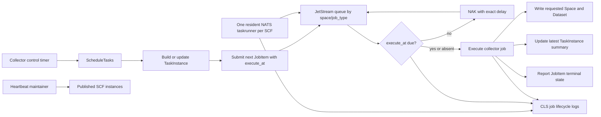

# Collector 定时作业队列与设计整改 Implementation Plan

> **For agentic workers:** REQUIRED SUB-SKILL: Use superpowers:subagent-driven-development (recommended) or superpowers:executing-plans to implement this plan task-by-task. Steps use checkbox (`- [ ]`) syntax for tracking.

**Goal:** 将 Collector 调整为“控制面提前生成带预期执行时间的 JobItem，SCF 使用一个常驻 NATS taskrunner 消费自己支持的作业队列”的简洁模型，并修复首次 CR 中确认存在的任务提交、目标 Dataset、状态串写和标的退市同步问题，同时让每个 JobItem 的完整生命周期可在 CLS 中检索。

**Architecture:** Collector 控制面只负责规划 TaskInstance 和向 CloudNode 提交下一次 JobItem；CloudNode 继续拥有 `space_id + job_type` 作业执行队列，并在发布 SCF 节点时准备其支持的 durable。代码包只描述 SCF 节点的部署产物，不进入 JobItem、事件或队列身份；每个 SCF 进程只启动一个 NATS 连接和一个常驻 taskrunner，内部绑定各个受支持 JobType 的 durable。未来任务由 JetStream `NakWithDelay` 留在队列，到期后可由任意兼容 SCF 执行；立即任务不填写 `execute_at`。tRPC timer 只保留心跳和 DNS，不参与任务消费。SCF 的正常与异常 JobItem 生命周期日志统一写入现有 CLS topic。

**Tech Stack:** Go 1.25、tRPC-Go、NATS JetStream、Protocol Buffers、SQLite/GORM、tRPC CLS writer、Vue 3、Vitest。

---

## 1. 历史讨论汇总与最终设计决策

### 1.1 评审边界

本计划来自对以下范围的首次深度 CR 和后续逐项设计讨论：

```text
repository: /Users/mooyang/Documents/go/src/github.com/mooyang-code/moox
collector:  /Users/mooyang/Documents/go/src/github.com/mooyang-code/moox/modules/collector
```

统一评审原则：

- 使用场景是个人量化，优先简洁、可维护和够用，不为高可靠场景增加通用基础设施。
- 项目尚未上线，不考虑历史兼容；不合理的 RPC、字段、状态、Topic 和数据库结构直接删除。
- 先确认现有设计是否合理，不为了显示“深度”而硬找问题。
- 允许时序采集任务少量重复执行，Storage 结果幂等即可，不为任务去重增加额外复杂度。
- Binance HTTP 客户端关闭 TLS 证书校验是明确接受的项目约束，不作为整改项。

首次 CR 的总体结论不是推翻 Collector：`jobs registry -> planner -> taskpublisher/taskrunner -> executor -> source` 的分层方向合理，CloudNode 拥有 JobItem 队列、Collector 专注采集业务也合理。需要整改的是调度和 SCF 消费链路中的不一致，以及四个已确认的业务正确性问题。详细 CR 条目见第 2 节。

### 1.2 讨论过程与结论演进

| 讨论主题 | 曾讨论的方案或疑问 | 最终结论 | 落实位置 |
|---|---|---|---|
| 控制面投递方式 | 到执行时间才提交，或提前生成待执行任务 | 控制面提前为全部有效 TaskInstance 提交“下一次执行”的 JobItem；不无限展开所有未来窗口 | Task 1、Task 2 |
| SCF 扩缩容 | 调度器按节点分配、逐节点唤醒 | 删除节点分配和 wake；所有兼容 SCF 竞争共享 durable，新增或减少节点不改任务 | Task 2、Task 3、Task 9 |
| 调度 RPC 命名 | `RecalculateAllTaskInstances`、`ReconcileTasks` 都不够直接 | 最终使用 `ScheduleTasks`，只表达规划和提交下一次任务 | Task 2 |
| 重复任务 | 是否增加任务去重 | 少量重复可接受；只复用 CloudNode 现有 JobItem 状态，不新增去重表、锁或 exactly-once | Task 2、Task 9 |
| SCF 保活 | 心跳是否同时负责取任务、唤醒或节点调度 | 新发布的 SCF 启动后保持 keepalive；`HeartbeatMaintainer` 只维护通信、节点初始化和心跳 | Task 3 |
| 多种任务 | 一个 SCF 是否扫描所有 Topic | SCF 只绑定其 `SupportedJobTypes` 对应的 durable；Kline、Symbol 继续使用不同 JobType | Task 3 |
| 提前任务执行 | SCF 本地保存未来任务并每 5 秒 tick 检查 | 该方案已放弃；未来 delivery 直接 `NakWithDelay(execute_at-now)`，不建立本地 future queue | Task 3 |
| tRPC job timer | 是否用框架 timer 周期检查 NATS，或只启动一个 NATS 消费者 | 不需要 job timer；每个 SCF 只有一个进程级 NATS 连接和常驻 taskrunner，内部按受支持 JobType 绑定多个 durable，tRPC timer 只保留 heartbeat 和 DNS | Task 3 |
| JetStream 重投 | 延迟到期后是否仍投给原 SCF | 不保证；可由任意绑定同一 durable 的兼容 SCF 获取，因此任务和日志不能依赖固定 NodeID | Task 3、Task 9 |
| `execute_at` 立即语义 | 是否使用特殊时间值，是否要求时间严格相等 | 字段缺失表示立即；`now >= execute_at` 立即；只有 `execute_at > now` 才延期，不使用特殊值或相等判断 | Task 1、Task 3 |
| 作业路由 | `space_id + code_package_id + job_type` | 改为 `space_id + job_type`；代码包只属于节点部署元数据，不进入任务或 durable identity | Task 3、Task 9 |
| Registry 类型命名 | `Definition` 含义过宽 | 改为 `JobDefinition`，相关查询和构造函数同步使用完整名称，不保留旧别名 | Task 3 |
| SCF 被云平台回收 | 是否需要全局节点健康分配或回收恢复逻辑 | 不增加；共享 durable 会把任务交给仍存活的任意 SCF，个人项目不追求同时全部回收场景的额外保障 | Task 3、Task 9 |
| JobItem 日志 | 只记录最终完成，还是记录完整过程 | 获取、校验、延期、触发、状态上报、完成及实际 ACK/NAK/TERM 全部写现有 CLS | Task 7、Task 9 |
| CLS 实现 | 是否增加独立审计系统 | 不增加；复用 tRPC CLS writer，将当前 `warn` 调整为 `info` 并统一结构化字段 | Task 7 |

### 1.3 已确认的最终设计决策

1. `JobItem.execute_at` 使用可选 `google.protobuf.Timestamp`：
   - 未填写：收到后立即执行。
   - 当前时间已经达到或超过 `execute_at`：立即执行，即判断 `now >= execute_at`。
   - 大于当前时间：本次 delivery 返回 `RETRY`，延迟为 `execute_at - now`。
   - 不使用 `0`、负数或自定义字符串等特殊值表达立即执行。

   不要求当前时间与 `execute_at` 严格相等。网络传输、JetStream 投递和 SCF 调度造成任务晚到时，只要 `execute_at` 已经过期就立刻执行；只有 `execute_at` 仍严格晚于当前时间时才延期。
2. Collector 控制面提前提交周期任务，只生成每个 TaskInstance 的“下一次执行”，不一次生成无限未来任务。
3. `RecalculateAllTaskInstances` 直接改名为 `ScheduleTasks`。项目尚未上线，不保留旧 RPC、旧消息名或双路兼容。
4. `ScheduleTasks` 只做规划、持久化和提交，不再唤醒 SCF。
5. SCF 只消费自身支持的 `job_type` 队列。路由改为：

```text
space_id + job_type
```

   `code_package_id` 只保留在 CloudNode 节点/SCF 发布元数据中，用于描述部署产物和排查版本；从 JobItem、`JobExecutionRequested`、durable identity、Collector Rule target 和任务参数中删除。不同代码包只要声明支持同一个 `job_type`，就竞争消费同一个 durable。若未来确实出现不兼容的消息契约，显式升级 `job_type`，不能借代码包 ID 隐式分流。
6. 心跳维护只负责：
   - CloudNode 保活调用；
   - SCF 节点信息初始化；
   - SCF 主动上报心跳。

   心跳处理器不得再拉取或执行 JobItem。
7. 每个 SCF 进程只启动一个常驻 NATS taskrunner：
   - 只建立一个 NATS 连接；
   - 内部按支持的 JobType 绑定对应 durable；
   - 队列为空时继续阻塞等待，不退出、不依赖作业 timer 重启；
   - 多个 SCF 绑定相同 durable，由 JetStream 竞争分配；
   - tRPC timer 只保留心跳和 DNS；
   - 不新增手写 `WorkerLoop`、`time.Ticker` 或本地 future-task 堆。
8. 时序采集允许少量重复执行。只复用 CloudNode 已有的 `job_item_id` 幂等状态，不新增 exactly-once、全局去重、租约、DLQ、Saga 或分布式锁。
9. Binance HTTP 客户端关闭 TLS 证书校验是已接受决策，本计划不修改、不补告警，也不将其列为风险整改项。
10. 每个 JobItem 的获取、延期、触发执行、状态上报、完成和 ACK/NAK/TERM 都写 CLS 结构化日志；不记录完整 params、凭据、签名或密钥。
11. jobs registry 中的核心类型使用 `JobDefinition`，不使用脱离上下文后含义不清的 `Definition`；新项目直接同步重命名相关 API。

### 1.4 已放弃方案

以下内容在讨论中出现过，但不再属于目标设计，实施时不得重新引入：

- 到期后再由控制面发布 JobItem。
- `ScheduleTasks` 提交后调用 `InvokeFunction` 唤醒一批 SCF。
- HeartbeatMaintainer 在心跳回调中拉取、轮询或执行任务。
- SCF job tRPC timer、5 秒 tick、外层 WorkerLoop 或本地 future-task 队列。
- 将 `code_package_id` 放入 JobItem、事件 Subject、Consumer name 或消息身份校验。
- 要求未来 delivery 到期后回到第一次获取它的 SCF 节点。
- 为允许的时序重复增加全局去重、租约、分布式锁、Saga 或 DLQ。
- 只在 `now == execute_at` 时触发执行。

## 2. 最初 CR 结论与后续核验

| 来源 | 优先级 | 发现 | 结论 | 本计划 |
|---|---|---|---|---|
| 最初 CR | P1 | Collector 忽略 `JobItemAck.REJECTED`，调度可能假成功 | 确认存在 | Task 2 |
| 最初 CR | P1 | 规则声明 `target.dataset_id`，Binance 实际写固定配置 Dataset | 确认存在 | Task 5 |
| 最初 CR | P1 | TaskInstance 状态只按 `space_id + task_id` 更新，旧作业可覆盖新作业 | 确认存在 | Task 4 |
| 最初 CR | P1 | Symbol 只增加 active 标的，不停用下架标的 | 确认存在 | Task 6 |
| 最初 CR + 后续讨论 | P1 | 控制面按分钟重复规划、提交并逐节点唤醒 SCF | 方案不再合理 | Task 2、Task 3 |
| 后续讨论 | P1 | 作业路由包含 `code_package_id`，相同能力的不同构建产物被拆成不同队列 | 方案不再合理 | Task 3 |
| 最初 CR | P2 | CloudNode durable 的 `MaxAckPending=1` 限制多个 SCF 动态消费 | 确认存在 | Task 3 |
| 最初 CR | P2 | SCF 当前按“一轮队列为空即退出”运行，需要外部反复触发 | 确认存在 | Task 3 |
| 最初 CR | P2 | SCF 生产入口未启动心跳 tRPC service，且心跳 service 名不一致 | 确认存在 | Task 3 |
| 最初 CR | P2 | 支持的 JobType 在 taskrunner、CLI 和心跳中分别硬编码或表达不一致 | 确认存在 | Task 3 |
| 后续日志核验 | P2 | SCF CLS writer 当前为 warn 级别，正常 JobItem 生命周期不会进入 CLS | 确认存在 | Task 7 |
| 最初 CR | P2 | 120s、115s、105s、90s、60s、45s 多套执行窗口并存 | 确认存在 | Task 8 |
| 最初 CR | P2 | assignment 字段、RUNNING/PART_FAILED、空 Handler 等概念没有运行时读者 | 确认存在 | Task 8 |
| 最初 CR 后用户定界 | 不处理 | Binance TLS 证书校验关闭 | 用户明确接受 | 明确排除 |

以下现有设计是合理的，保留而不是重做：

- CloudNode 拥有作业队列生命周期，SCF 只 bind 已存在的 durable。
- Kline、Symbol 使用独立 `job_type` 队列，互不阻塞。
- JetStream delivery 决定 ACK、TERM、RETRY，CloudNode 保存每次 JobItem 的终态。
- Collector 的 job definition、planner、source 分层继续保留。
- Kline 仅写交易所已闭合 K 线，直接调用 Storage，不恢复已删除的 Tick/Streamcalc 双写链路。

## 3. 最终运行链路



TaskInstance 与 JobItem 的职责必须保持不同：

- `TaskInstance`：稳定的业务采集单元，保存最新一次已调度 JobItem ID 和最新执行摘要。
- `JobItem`：一次具体执行，ID 包含预期执行时间，CloudNode 保存其独立终态。
- 旧 JobItem 可以完成，但不得覆盖 TaskInstance 已指向的新 JobItem 摘要。

## 4. 实施顺序

```text
Task 1  execute_at 协议贯通
  ↓
Task 2  ScheduleTasks 提前投递并删除 wake
  ↓
Task 3  队列路由与代码包解耦，SCF 常驻 NATS taskrunner
  ↓
Task 4  TaskInstance 状态绑定 JobItem
  ↓
Task 5  目标 Dataset 贯通
  ↓
Task 6  Symbol active/inactive 对账
  ↓
Task 7  补齐 JobItem CLS 生命周期日志
  ↓
Task 8  删除无效结构并统一时间边界
  ↓
Task 9  跨模块验证、E2E 和部署验收
```

每个 Task 独立提交。后一个 Task 开始前，前一个 Task 的目标测试必须通过。

---

## Task 1: 为 JobItem 增加明确的预期执行时间

**Files:**

- Modify: `modules/cloudnode/proto/cloudnode.proto`
- Modify: `modules/cloudnode/proto/cloudnodegen/cloudnode.pb.go`
- Modify: `modules/cloudnode/proto/cloudnodegen/cloudnode.trpc.go`
- Modify: `packages/cloudjobpb/job_events.proto`
- Modify: `packages/cloudjobpb/job_events.pb.go`
- Modify: `modules/cloudnode/internal/jobstate/types.go`
- Modify: `modules/cloudnode/internal/jobstate/kv_store.go`
- Modify: `modules/cloudnode/internal/jobstate/kv_store_test.go`
- Modify: `modules/cloudnode/internal/jobqueue/jetstream_queue.go`
- Modify: `modules/cloudnode/internal/jobqueue/jetstream_queue_test.go`
- Modify: `packages/cloudruntime/runtime.go`
- Modify: `packages/cloudruntime/runtime_test.go`
- Modify: `packages/events/validation_test.go`

- [x] **Step 1: 先写协议与状态传播测试**

覆盖以下行为：

```go
func TestCreatePendingPersistsExecuteAt(t *testing.T)
func TestCreatePendingWithoutExecuteAtMeansImmediate(t *testing.T)
func TestPublishCarriesExecuteAtToJobExecutionRequested(t *testing.T)
func TestJobItemDetailReturnsExecuteAt(t *testing.T)
```

先运行：

```bash
(cd modules/cloudnode && go test -count=1 ./internal/jobstate ./internal/jobqueue)
(cd packages/cloudruntime && go test -count=1 ./...)
```

Expected: 新字段尚不存在，测试编译失败。

- [x] **Step 2: 修改 protobuf 契约并重新生成**

新增字段：

```proto
message JobItem {
  // existing fields...
  google.protobuf.Timestamp execute_at = 8;
}

message JobItemDetail {
  // existing fields...
  google.protobuf.Timestamp execute_at = 17;
}

message JobExecutionRequested {
  // existing fields...
  google.protobuf.Timestamp execute_at = 7;
}
```

执行：

```bash
make -C modules/cloudnode/proto all
make -C packages/cloudjobpb all
```

Expected: 生成文件更新，`go test` 可识别 `ExecuteAt`。

- [x] **Step 3: 在 CloudNode 状态和事件中完整保留字段**

`jobstate.State` 使用 `*time.Time` 保存可选值。`CreatePending` 校验非空 timestamp 合法后转为 UTC；`State.ToDetail` 转回 protobuf。`JetStreamQueue.Publish` 原样写入事件。

禁止在 CloudNode 根据服务器时间补默认值。字段缺失就是立即执行，语义由 worker 解释。

- [x] **Step 4: 扩展 CloudRuntime JobItem**

```go
type JobItem struct {
    // existing fields...
    ExecuteAt time.Time
}
```

本 Task 只完成数据贯通，不在通用 CloudRuntime 中 sleep。到期判断属于 Collector delivery adapter，在 Task 3 实现。

- [x] **Step 5: 运行协议测试**

```bash
(cd packages/cloudjobpb && go test -count=1 ./...)
(cd packages/events && go test -count=1 ./...)
(cd packages/cloudruntime && go test -count=1 ./...)
(cd modules/cloudnode && go test -count=1 ./internal/jobstate ./internal/jobqueue ./internal/rpc)
```

Expected: 全部通过；带值和缺失两种 `execute_at` 都能往返。

- [x] **Step 6: 提交**

```bash
git add modules/cloudnode/proto packages/cloudjobpb modules/cloudnode/internal/jobstate modules/cloudnode/internal/jobqueue packages/cloudruntime packages/events
git commit -m "feat(cloudjob): add optional execution time"
```

---

## Task 2: 将调度入口改为 ScheduleTasks 并删除逐节点唤醒

**Files:**

- Modify: `modules/collector/proto/collector.proto`
- Modify: `modules/collector/proto/collectorgen/collector.pb.go`
- Modify: `modules/collector/proto/collectorgen/collector.trpc.go`
- Modify: `modules/collector/internal/rpc/service.go`
- Modify: `modules/collector/internal/rpc/service_test.go`
- Modify: `modules/collector/internal/rpc/schedule.go`
- Modify: `modules/collector/internal/rpc/schedule_test.go`
- Modify: `modules/collector/internal/domain/task_instance.go`
- Modify: `modules/collector/internal/store/task_instance.go`
- Modify: `modules/collector/internal/store/task_instance_test.go`
- Modify: `modules/collector/internal/taskpublisher/client.go`
- Modify: `modules/collector/internal/taskpublisher/client_test.go`
- Modify: `modules/cloudnode/internal/jobstate/kv_store.go`
- Modify: `modules/cloudnode/internal/jobstate/kv_store_test.go`
- Modify: `examples/e2e/verify.mjs`
- Modify: `examples/e2e/README.md`

- [x] **Step 1: 先写调度时间、ACK 和无 wake 测试**

新增或重写测试：

```go
func TestBuildScheduledJobItemUsesNextBoundary(t *testing.T)
func TestBuildScheduledJobItemIDIncludesExecuteAt(t *testing.T)
func TestSubmitCollectorJobItemsReturnsRejectedAck(t *testing.T)
func TestScheduleTasksSubmitsWithoutWakingNodes(t *testing.T)
func TestScheduleTasksRepeatedInSameWindowUsesSameJobItemID(t *testing.T)
func TestCreatePendingDeduplicatedPendingDoesNotRepublish(t *testing.T)
```

`REJECTED` 用例必须断言错误中包含 `job_item_id` 和 `reject_reason`，不能只断言非空错误。

- [x] **Step 2: 直接重命名 RPC**

将以下类型和 RPC 一次性改名：

```text
RecalculateAllTaskInstancesReq -> ScheduleTasksReq
RecalculateAllTaskInstancesRsp -> ScheduleTasksRsp
RecalculateAllTaskInstances    -> ScheduleTasks
recalculateRule                -> scheduleRule
HandleSchedule                 -> HandleSchedule
```

`HandleSchedule` 已足够简洁，保留。生产代码、测试、E2E 和文档中不保留旧 RPC 名。

执行：

```bash
make -C modules/collector/proto all
```

- [x] **Step 3: 按下一时间边界构造周期 JobItem**

将时钟作为参数传入纯函数，避免测试覆盖全局时间：

```go
func nextExecuteAt(now time.Time, interval time.Duration) time.Time {
    return now.UTC().Truncate(interval).Add(interval)
}

func scheduledJobItemID(taskID string, executeAt time.Time) string {
    return strings.TrimSpace(taskID) + ":" + executeAt.UTC().Format(time.RFC3339)
}
```

规则：

- 周期任务总是写 `execute_at=nextExecuteAt(...)`。
- 一次 `ScheduleTasks` 对所有实例使用同一个 `now`。
- 默认非法或空周期仍按现有 `30m` 处理。
- 每个实例只提交下一时间边界，不建立 schedule cursor 表。
- 手工直接调用 CloudNode `SubmitJobItems` 时不填 `execute_at`，自然获得立即执行语义。
- 调度器必须先为全部实例预计算 `execute_at` 和确定性的 `job_item_id`，在发布前将
  `cloud_job_item_id` 写入 TaskInstance。发布与回写顺序不能留下“SCF 已完成、控制面尚未
  绑定 JobItem ID”的竞态窗口。
- `TaskInstance` 可增加 `gorm:"-"` 的瞬态调度字段承载本轮 `execute_at`；publisher
  必须消费预计算值，不能在逐条构造消息时再次调用 `time.Now()`。
- `UpsertMany` 必须更新 `c_cloud_job_item_id`。发布后只处理 ACK 状态，不再把 ACK
  当作首次获得 JobItem ID 的来源。

同一 `job_item_id` 已处于 pending 时，CloudNode 返回 `DEDUPLICATED` 且 `ShouldPublish=false`；只有 `enqueue_failed` 才重新发布。这样控制面每分钟重复规划同一个未来窗口不会系统性制造多份消息，也没有增加新的去重存储。

- [x] **Step 4: 将 REJECTED ACK 转成明确错误**

将 ACK 解析改为返回成功映射和错误：

```go
func jobItemIDsByTaskID(items []*pb.JobItem, acks []*pb.JobItemAck) (map[string]string, error)
```

`CREATED`、`DEDUPLICATED` 记录 ID；`REJECTED` 聚合为错误。部分批次已成功的 ID 仍返回并写入 TaskInstance，随后 `ScheduleTasks` 返回失败。

- [x] **Step 5: 删除 wake 全链路**

删除：

- `WakeOptions`
- `WakeCollectorNodes`
- `listCloudNodes`
- `buildWakeEvent`
- `supportsAnyJobType`
- 相关并发常量和测试
- `scheduleRule` 中的 `WakeCollectorNodes` 调用

`taskpublisher.Config` 同步删除只为 wake event 服务的字段。不要留下“提交后可选 wake”的开关。

- [x] **Step 6: 运行 Collector 调度测试和零残留检查**

```bash
(cd modules/collector && go test -count=1 ./internal/taskpublisher ./internal/rpc)
(cd modules/cloudnode && go test -count=1 ./internal/jobstate ./internal/rpc)
rg -n "RecalculateAllTaskInstances|WakeCollectorNodes|WakeOptions|collector_schedule" modules/collector examples/e2e docs --glob '!docs/superpowers/plans/**'
```

Expected: 测试通过；`rg` 零命中。

- [x] **Step 7: 提交**

```bash
git add modules/collector modules/cloudnode/internal/jobstate examples/e2e
git commit -m "refactor(collector): schedule future jobs without wakeups"
```

---

## Task 3: 路由与代码包解耦，并为每个 SCF 启动一个常驻 NATS taskrunner

**Files:**

- Modify: `packages/cloudjobqueue/identity.go`
- Modify: `packages/cloudjobqueue/identity_test.go`
- Modify: `packages/events/validation.go`
- Modify: `packages/events/validation_test.go`
- Modify: `packages/cloudjobpb/job_events.proto`
- Modify: `packages/cloudjobpb/job_events.pb.go`
- Modify: `packages/cloudruntime/runtime.go`
- Modify: `packages/cloudruntime/runtime_test.go`
- Modify: `modules/cloudnode/proto/cloudnode.proto`
- Modify: `modules/cloudnode/proto/cloudnodegen/cloudnode.pb.go`
- Modify: `modules/cloudnode/proto/cloudnodegen/cloudnode.trpc.go`
- Modify: `modules/cloudnode/internal/jobstate/types.go`
- Modify: `modules/cloudnode/internal/jobstate/kv_store.go`
- Modify: `modules/cloudnode/internal/jobstate/kv_store_test.go`
- Modify: `modules/cloudnode/internal/jobhistory/schema.go`
- Modify: `modules/cloudnode/internal/jobhistory/store.go`
- Modify: `modules/cloudnode/internal/jobhistory/store_test.go`
- Modify: `modules/cloudnode/internal/rpc/job_item.go`
- Modify: `modules/cloudnode/internal/rpc/job_item_test.go`
- Modify: `modules/collector/internal/jobs/jobdef/definition.go`
- Modify: `modules/collector/internal/jobs/kline/definition.go`
- Modify: `modules/collector/internal/jobs/symbol/definition.go`
- Modify: `modules/collector/internal/jobs/kline/planner.go`
- Modify: `modules/collector/internal/jobs/symbol/planner.go`
- Modify: `modules/collector/internal/jobs/registry.go`
- Modify: `modules/collector/internal/jobs/registry_test.go`
- Modify: `modules/collector/internal/domain/collect_params.go`
- Modify: `modules/collector/internal/domain/collect_params_test.go`
- Modify: `modules/collector/internal/taskpublisher/client.go`
- Modify: `modules/collector/internal/taskpublisher/client_test.go`
- Modify: `modules/collector/internal/taskrunner/direct.go`
- Modify: `modules/collector/internal/taskrunner/direct_test.go`
- Modify: `modules/collector/internal/reporter/heartbeat.go`
- Modify: `modules/collector/internal/reporter/heartbeat_test.go`
- Modify: `modules/collector/internal/serverless/bootstrap/trpc.go`
- Modify: `modules/collector/internal/app/runtime/global.go`
- Modify: `modules/collector/internal/app/runtime/global_test.go`
- Modify: `modules/collector/internal/serverless/handler.go`
- Modify: `modules/collector/internal/serverless/handler_test.go`
- Modify: `modules/collector/cmd/scf/main.go`
- Modify: `modules/collector/cmd/scf/main_test.go`
- Modify: `modules/collector/config/trpc_go.yaml`
- Modify: `modules/collector/configs/example_trpc_go.yaml`
- Modify: `modules/cli/internal/command/collector.go`
- Modify: `modules/cli/internal/command/collector_test.go`
- Modify: `modules/cli/internal/command/setup_eventbus_e2e.go`
- Modify: `modules/cli/internal/command/setup_eventbus_e2e_test.go`
- Modify: `modules/cloudnode/internal/rpc/node.go`
- Modify: `modules/cloudnode/internal/rpc/node_test.go`
- Modify: `modules/cloudnode/internal/config/config.go`
- Modify: `modules/cloudnode/internal/config/config_test.go`
- Modify: `modules/cloudnode/internal/bootstrap/bootstrap.go`
- Modify: `modules/cloudnode/internal/jobqueue/jetstream_queue.go`
- Modify: `modules/cloudnode/internal/jobqueue/jetstream_client_test.go`
- Modify: `modules/cloudnode/config/app.yaml`
- Modify: `web/src/views/collector/collector-rules/collector-rules.vue`
- Modify: `examples/e2e/verify.mjs`
- Modify: `examples/e2e/README.md`
- Modify: `modules/cloudnode/README.md`
- Modify: `docs/采集任务管理.md`

- [x] **Step 1: 先写常驻消费和到期判断测试**

覆盖：

```go
func TestHandleDeliveryWithoutExecuteAtExecutesImmediately(t *testing.T)
func TestHandleDeliveryAtExecuteAtExecutesImmediately(t *testing.T)
func TestHandleDeliveryWithPastExecuteAtExecutesImmediately(t *testing.T)
func TestHandleDeliveryWithFutureExecuteAtRetriesUntilDue(t *testing.T)
func TestQueueIdentityUsesOnlySpaceAndJobType(t *testing.T)
func TestNodesFromDifferentPackagesShareSupportedJobQueue(t *testing.T)
func TestTaskrunnerDoesNotRequireCodePackageID(t *testing.T)
func TestRoundRobinConsumerStaysOpenWhenQueuesAreEmpty(t *testing.T)
func TestRunJobItemsStopsOnlyWhenContextEnds(t *testing.T)
func TestPublishedNodeEnsuresSupportedJobQueues(t *testing.T)
func TestKeepaliveDoesNotPollJobItems(t *testing.T)
func TestHeartbeatReportsExactSupportedJobTypes(t *testing.T)
func TestSCFConfigContainsNoJobTimer(t *testing.T)
```

未来任务用例断言：

```go
result.Decision == jetstream.RETRY
result.Delay == executeAt.Sub(now)
```

允许毫秒级容差，但不得改成固定 1 秒轮询。

- [x] **Step 2: 从现有 jobs registry 导出支持的 JobType**

```go
type JobDefinition struct {
    JobType string
    // existing fields...
}

func SupportedJobTypes() []string {
    out := make([]string, 0, len(jobDefinitions))
    for _, definition := range jobDefinitions {
        out = append(out, definition.JobType)
    }
    return out
}
```

将当前过于宽泛的 `Definition` 一次性改名为 `JobDefinition`，并同步收敛相关名称：

```text
jobdef.Definition             -> jobdef.JobDefinition
jobs.Definition               -> jobs.JobDefinition
definitions                   -> jobDefinitions
ListDefinitions               -> ListJobDefinitions
DefinitionByDataType          -> JobDefinitionByDataType
kline.Definition              -> kline.NewJobDefinition
symbol.Definition             -> symbol.NewJobDefinition
```

不保留 type alias 或旧函数包装。`FieldDefinition` 已经表达具体含义，继续保留。

Kline、Symbol `JobDefinition` 显式声明各自 `JobType`。taskrunner 和心跳从 registry 读取该清单，不再各自硬编码。CLI 发布元数据继续声明相同的两个值并用测试锁定，因为 CLI 不应为两个字符串反向依赖整个 Collector module。不要建立插件系统或动态 manifest。

- [x] **Step 3: 将执行队列与具体代码包彻底解耦**

`packages/cloudjobqueue.Identity` 改为：

```go
type Identity struct {
    SpaceID string
    JobType string
}
```

`ConsumerName` 只对长度编码后的 `space_id + job_type` 求哈希；`SubjectID` 只由 `job_type` 得出。相同 Space 内，任意代码包只要声明支持同一个 JobType，就绑定同一个 durable。

同时删除作业契约中的 `code_package_id`：

- `cloudnode.JobItem` 和 `JobItemDetail`；
- `cloudjobpb.JobExecutionRequested`；
- CloudNode pending state 和 job history；
- Collector `CollectTarget`、planner 任务参数和 `buildJobItem`；
- `cloudruntime.Config`、`cloudruntime.JobItem` 及 taskrunner 的 payload/package 相等校验；
- Collector Rule 前端表单、E2E 示例和相关文档。

`MOOX_CODE_PACKAGE_ID`、CloudNode 节点记录和发布命令中的 package ID 继续保留，因为它们描述“当前 SCF 部署了哪个产物”；taskrunner 不读取它来选择任务或验证消息。需要记录部署版本时，CLS 使用可选字段 `runtime_code_package_id`，不得重新写回 JobItem。

事件拓扑校验和 CLI 的 eventbus E2E 声明也必须改为新的两段队列身份；不能只改
`cloudjobqueue.Identity` 而让 `packages/events/validation.go` 或
`setup_eventbus_e2e.go` 继续要求 package 维度。

执行：

```bash
make -C modules/cloudnode/proto all
make -C packages/cloudjobpb all
```

这是新项目，不保留 protobuf 旧字段、旧 JSON 参数或 job history 数据库兼容；部署时重建 CloudNode JobItem KV/history 和旧 durable。

- [x] **Step 4: 在 delivery adapter 判断 execute_at**

解码事件后、调用 `cloudruntime.ExecuteJobItem` 前执行：

```go
executeAt := payload.GetExecuteAt()
if executeAt != nil {
    due := executeAt.AsTime().UTC()
    if delay := due.Sub(now().UTC()); delay > 0 {
        return jetstream.HandlerResult{
            Decision: jetstream.RETRY,
            Delay:    delay,
        }
    }
}
```

`handleDelivery` 接收 `now func() time.Time`，生产调用传 `time.Now`。判断只看 `delay > 0`，不得使用 `due.Equal(now)` 作为触发条件；`delay <= 0` 一律立即执行。测试不要依赖真实长时间 sleep。未来任务不写 Collector 状态，也不写 CloudNode 终态。

- [x] **Step 5: 将一次性扫描改为常驻等待**

当前 `roundRobinConsumer.Fetch` 在所有队列一轮为空时返回 `jetstream.ErrClosed`，导致通用 Runner 正常退出。改为返回 `nats.ErrTimeout`，让既有 `jetstream.Runner` 继续下一轮阻塞 Fetch：

```go
if allBindingsTimedOut {
    return nil, nats.ErrTimeout
}
```

`RunJobItems` 拆为：

- `Run`：一直运行到 context 取消或不可恢复错误，供生产 SCF 使用；
- `RunOnce`：一轮队列为空后退出，仅供本地诊断和 E2E 使用。

两者复用相同的 binding、handler 和单个 NATS 连接。不要在外层再写 tick、sleep
或重复连接循环；也不能让现有 `--once` 因改成常驻语义后永久挂起。

- [x] **Step 6: CloudNode 在发布节点时提前准备 durable**

CloudNode 已经拥有作业执行队列。创建或发布 SCF 节点时，根据：

```text
space_id + supported_workloads
```

幂等调用 `EnsureJobExecutionQueue`。这样即使尚未提交第一条任务，SCF 启动后也能 bind 全部受支持 durable。不要让 SCF 自己创建 Consumer。

- [x] **Step 7: 启动心跳/DNS tRPC services 和一个 NATS runner**

`initializeServerlessRuntime` 必须启动 SCF tRPC services，但 `RegisterTRPCServices` 只注册：

- `trpc.heartbeat.timer`
- `trpc.dnsresolve.timer`

修正当前 Go 注册的 `trpc.reporter.timer` 与 YAML `trpc.heartbeat.timer` 不一致。不得增加 `trpc.collectorjob.timer`。

这里的“无 job timer”只针对 SCF 打包使用的
`modules/collector/configs/example_trpc_go.yaml`。控制面服务使用的
`modules/collector/config/trpc_go.yaml` 仍需保留调用 `ScheduleTasks` 的调度 timer，
不能把控制面规划定时器误删。

SCF bootstrap 只启动一次 `taskrunner.Run(ctx)`。它等待 runtime communication readiness 后进入常驻 JetStream Runner；readiness 只表达 NodeID 和 Service Gateway 已由首次 keepalive 初始化，不让心跳模块调用、轮询或管理任务。

readiness 在 `internal/app/runtime` 提供进程级、可等待且可测试的窄接口；首次
keepalive 初始化通信信息后将其置为 ready。它不是第二套调度状态，也不承载任务队列。

`--once` 模式保留为本地诊断入口，复用同一套 binding 和 handler，但一轮队列为空后退出；生产 SCF 只调用常驻 `Run`。

- [x] **Step 8: 统一使用发布时注入的 Space**

SCF taskrunner 和 heartbeat 都只读取 `MOOX_SPACE_ID`。缺失时 runtime 初始化明确失败，不再从 Binance Storage binding 推导 Space。`collector function publish/deploy` 已负责注入该环境变量，补测试锁定该契约。

- [x] **Step 9: 将 keepalive handler 收窄为纯心跳**

删除 `pollJobItemsAfterHeartbeat`、`keepaliveTaskExecutionTimeout` 和相关日志。keepalive 调用只执行 `ProcessProbe`、有界 `ReportHeartbeat` 和响应构造。

- [x] **Step 10: 放开 durable 的简单固定并发**

CloudNode 配置增加：

```yaml
jetstream:
  max_ack_pending: 32
```

默认值和校验均为正整数，bootstrap 不再硬编码 `1`。不做根据节点数自动扩缩或运行时调参。

- [x] **Step 11: 运行 SCF 与 CloudNode 测试**

```bash
(cd packages/cloudjobqueue && go test -count=1 ./...)
(cd packages/cloudjobpb && go test -count=1 ./...)
(cd packages/cloudruntime && go test -count=1 ./...)
(cd modules/collector && go test -count=1 ./internal/jobs ./internal/taskrunner ./internal/reporter ./internal/serverless/... ./cmd/scf)
(cd modules/cloudnode && go test -count=1 ./internal/config ./internal/bootstrap ./internal/jobqueue ./internal/jobstate ./internal/jobhistory ./internal/rpc)
(cd modules/cli && go test -count=1 ./internal/command)
(cd web && pnpm test && pnpm build:prod)
```

Expected: 队列身份只包含 Space 和 JobType，不同代码包的兼容 SCF 共享 durable；一个 SCF 只建立一个 NATS 连接和一个常驻 Runner；空队列不会退出；立即任务直接执行；未来任务返回精确延迟；keepalive 测试证明没有任务消费；默认 `MaxAckPending=32`。

- [x] **Step 12: 做零残留检查并提交**

```bash
rg -n "code_package_id|CodePackageID|DefaultCollectorCodePackageID" packages/cloudjobqueue packages/cloudjobpb packages/cloudruntime modules/collector/internal modules/cloudnode/internal modules/cloudnode/proto web/src/views/collector/collector-rules examples/e2e docs/采集任务管理.md modules/cloudnode/README.md
rg -n "\\bDefinition\\b|\\bListDefinitions\\b|\\bDefinitionByDataType\\b" modules/collector/internal/jobs modules/collector/internal/rpc
git add packages/cloudjobqueue packages/cloudjobpb packages/cloudruntime modules/collector modules/cloudnode modules/cli web examples/e2e docs
git commit -m "feat(collector): decouple scf queues from code packages"
```

Expected: 第一条 `rg` 只允许命中 CloudNode 节点/SCF 部署元数据和 `runtime_code_package_id` 日志字段，不能命中 JobItem、JobExecutionRequested、queue identity、Collector Rule target 或 taskrunner 路由；第二条 `rg` 零命中，确保宽泛旧名称没有残留。

---

## Task 4: 将 TaskInstance 状态绑定到具体 JobItem

**Files:**

- Modify: `modules/collector/proto/collector.proto`
- Modify: `modules/collector/proto/collectorgen/collector.pb.go`
- Modify: `modules/collector/proto/collectorgen/collector.trpc.go`
- Modify: `modules/collector/internal/model/types.go`
- Modify: `modules/collector/internal/taskrunner/direct.go`
- Modify: `modules/collector/internal/executor/executor.go`
- Modify: `modules/collector/internal/executor/executor_test.go`
- Modify: `modules/collector/internal/reporter/task_status.go`
- Modify: `modules/collector/internal/reporter/task_status_test.go`
- Modify: `modules/collector/internal/store/task_instance.go`
- Modify: `modules/collector/internal/store/task_instance_test.go`
- Modify: `modules/collector/internal/rpc/service.go`
- Modify: `modules/collector/internal/rpc/service_test.go`

- [ ] **Step 1: 先写旧作业不得覆盖新摘要的测试**

```go
func TestUpdateStatusMatchesCurrentJobItemID(t *testing.T)
func TestUpdateStatusIgnoresStaleJobItemID(t *testing.T)
func TestReportTaskStatusCarriesJobItemID(t *testing.T)
```

场景：

1. TaskInstance 当前 `cloud_job_item_id=item-new`。
2. `item-old` 晚到成功上报。
3. RPC 返回成功，TaskInstance 摘要不变。
4. `item-new` 上报后摘要更新。

- [ ] **Step 2: 扩展 Collector 状态协议**

```proto
message ReportInstanceStatusReq {
  // existing fields...
  string job_item_id = 8;
}
```

执行：

```bash
make -C modules/collector/proto all
```

- [ ] **Step 3: 将 JobItem ID 贯穿执行模型**

`TaskExecuteEvent`、`collectTask`、reporter request 和 taskrunner 转换都携带 `JobItemID`。状态上报必须同时要求 `space_id`、`task_id`、`job_item_id`。

- [ ] **Step 4: 使用三元条件更新最新摘要**

```sql
WHERE c_space_id = ?
  AND c_task_id = ?
  AND c_cloud_job_item_id = ?
```

RowsAffected 为 0 表示该执行已经过期或实例已不存在。Collector RPC 记录一条 info 日志并返回成功，避免旧 delivery 因摘要无法更新而持续重试。CloudNode JobItem 终态仍按原链路独立上报。

- [ ] **Step 5: 运行状态链路测试**

```bash
(cd modules/collector && go test -count=1 ./internal/store ./internal/reporter ./internal/executor ./internal/rpc ./internal/taskrunner)
```

Expected: 新执行更新摘要，旧执行安静完成且不覆盖。

- [ ] **Step 6: 提交**

```bash
git add modules/collector
git commit -m "fix(collector): bind task summaries to job items"
```

---

## Task 5: 让规则目标 Dataset 成为真实写入目标

**Files:**

- Modify: `modules/collector/internal/sources/interface.go`
- Modify: `modules/collector/internal/model/types.go`
- Modify: `modules/collector/internal/taskrunner/direct.go`
- Modify: `modules/collector/internal/executor/executor.go`
- Modify: `modules/collector/internal/executor/executor_test.go`
- Modify: `modules/collector/internal/sources/binance/storage_config.go`
- Modify: `modules/collector/internal/sources/binance/storage_config_test.go`
- Modify: `modules/collector/internal/sources/binance/kline.go`
- Create: `modules/collector/internal/sources/binance/kline_test.go`
- Modify: `modules/collector/internal/sources/binance/symbol.go`
- Modify: `modules/collector/internal/sources/binance/symbol_test.go`
- Modify: `modules/collector/configs/sources/market/binance.yaml`

- [ ] **Step 1: 先写目标 Dataset 不可被配置覆盖的测试**

```go
func TestKlineCollectorWritesRequestedSpaceAndDataset(t *testing.T)
func TestKlineWatermarkReadsRequestedSpaceAndDataset(t *testing.T)
func TestSymbolCollectorWritesRequestedSpaceAndDataset(t *testing.T)
func TestTaskEventFromJobItemRequiresDatasetID(t *testing.T)
```

测试故意让旧 binding 中的 Dataset 与任务 Dataset 不同，断言最终读写只出现任务携带的值。

- [ ] **Step 2: 扩展执行参数**

```go
type CollectParams struct {
    SpaceID   string
    DatasetID string
    // existing fields...
}
```

`dataset_id` 已由 Kline/Symbol planner 写入 JobItem params。taskrunner、`TaskExecuteEvent`、executor 和 source 之间不得丢失该字段。

- [ ] **Step 3: 收窄 Binance StorageBinding**

删除运行时写入目标字段：

```text
space_id
record_dataset_id
kline_dataset_id
```

保留来源和标的拓扑字段：

```text
data_source_id
subject_type
subject_market
subject_dataset_ids
auth_info
```

其中 `subject_dataset_ids` 只表示 Symbol 应维护哪些 Dataset 的 Subject membership，不是行数据写入目标。

- [ ] **Step 4: Kline 全部使用请求目标**

水位读取、RowKey 构造和日志统一使用：

```go
params.SpaceID
params.DatasetID
```

将 `buildKlineRows` 改为显式参数：

```go
func buildKlineRows(
    klines []*market.Kline,
    spaceID string,
    datasetID string,
    subjectID string,
    freq string,
) ([]*storagepb.RowFieldUpsert, error)
```

禁止再传整个 `StorageBinding`，避免以后误用固定目标。

- [ ] **Step 5: Symbol 记录行使用请求目标**

`buildSymbolRecordRows` 同样显式接收 `spaceID` 和 `datasetID`。注册 active subject 时，将任务目标 Dataset 与 `subject_dataset_ids` 做去重并集。

- [ ] **Step 6: 运行执行和 Binance source 测试**

```bash
(cd modules/collector && go test -count=1 ./internal/executor ./internal/taskrunner ./internal/sources/binance)
```

Expected: Kline 水位和写入、Symbol record 写入都严格落到规则目标。

- [ ] **Step 7: 提交**

```bash
git add modules/collector
git commit -m "fix(collector): honor rule target datasets"
```

---

## Task 6: 对账并停用已经下架的 Symbol membership

**Files:**

- Modify: `modules/collector/internal/sources/binance/storage_rpc.go`
- Modify: `modules/collector/internal/sources/binance/symbol.go`
- Modify: `modules/collector/internal/sources/binance/symbol_test.go`

- [ ] **Step 1: 先写 active/inactive 对账测试**

覆盖：

```go
func TestSymbolCollectorDeactivatesMissingDatasetSubjects(t *testing.T)
func TestSymbolCollectorKeepsReturnedSubjectsActive(t *testing.T)
func TestSymbolCollectorDoesNotDeactivateAfterPartialWriteFailure(t *testing.T)
func TestSymbolCollectorSkipsDeactivationForEmptySnapshot(t *testing.T)
```

输入 active 集合 `{BTC-USDT}`，Storage 现有 active 集合 `{BTC-USDT, OLD-USDT}`。期望只对 `OLD-USDT` 调用 `BindDatasetSubject(status=inactive)`。

- [ ] **Step 2: 给 storageWriter 增加两个窄接口**

```go
ListDatasetSubjects(ctx, spaceID, datasetID) ([]*storagepb.DatasetSubject, error)
BindDatasetSubject(ctx, binding *storagepb.DatasetSubject) error
```

分页大小复用 Collector planner 的约定或在 Binance 包内使用固定 `200`，不建立通用 metadata repository。

- [ ] **Step 3: active 上报全部成功后再执行停用**

顺序必须是：

1. 获取 Binance symbols。
2. 过滤当前 active USDT symbols。
3. 写 record rows 并注册 active subjects。
4. 只有第 3 步全部成功，才遍历任务目标 Dataset 与 `subject_dataset_ids`。
5. 将 Storage 中仍为 active、但本次 active 集合不存在的 membership 更新为 `inactive`。

空 active 快照跳过停用，避免异常响应导致一次性停用全部标的。只停用 Dataset membership，不删除 Subject、历史 Kline 或 record 历史。重复执行同一个 inactive 更新允许成功。

`BindDatasetSubject` 是完整 upsert，不是 patch。停用时必须复制
`ListDatasetSubjects` 返回的完整 binding，仅修改 `status`（以及确有语义时的
结束时间）；不得用只含 ID/status 的新对象覆盖 role、起止时间和 attributes。

- [ ] **Step 4: 运行 Symbol 测试**

```bash
(cd modules/collector && go test -count=1 ./internal/sources/binance -run 'TestSymbol')
```

Expected: 缺失标的被停用；active 标的不变；上游部分失败时不做批量停用。

- [ ] **Step 5: 提交**

```bash
git add modules/collector/internal/sources/binance
git commit -m "fix(collector): reconcile inactive symbols"
```

---

## Task 7: 补齐 JobItem CLS 生命周期日志

**Files:**

- Create: `modules/collector/internal/taskrunner/job_log.go`
- Create: `modules/collector/internal/taskrunner/job_log_test.go`
- Modify: `modules/collector/internal/taskrunner/direct.go`
- Modify: `modules/collector/internal/taskrunner/direct_test.go`
- Modify: `modules/collector/internal/reporter/task_status.go`
- Modify: `modules/collector/internal/reporter/task_status_test.go`
- Modify: `packages/cloudruntime/runtime.go`
- Modify: `packages/cloudruntime/runtime_test.go`
- Modify: `packages/jetstream/runner.go`
- Modify: `packages/jetstream/runner_test.go`
- Modify: `modules/cli/internal/collectorpackager/scf.go`
- Modify: `modules/cli/internal/collectorpackager/scf_test.go`
- Modify: `scripts/build-collector-scf-package.sh`
- Modify: `scripts/build-collector-scf-package_test.sh`
- Modify: `modules/collector/README.md`

- [ ] **Step 1: 先锁定 JobItem 日志事件和固定字段**

增加纯格式化测试，至少覆盖：

```go
func TestJobLifecycleLogFieldsAreStable(t *testing.T)
func TestJobLifecycleLogOmitsSensitiveParams(t *testing.T)
func TestJobActionReporterReportsAckNakAndTerm(t *testing.T)
func TestJobActionReporterReportsTransportFailure(t *testing.T)
func TestSCFPackageCLSWriterUsesInfoLevel(t *testing.T)
```

统一使用可检索的 `key=value` 字段，不输出完整 `params`。每条 JobItem 日志尽量带齐：

```text
event
space_id
job_id
job_item_id
task_id
job_type
runtime_code_package_id
node_id
consumer
message_id
delivery_count
execute_at
dataset_id
subject_id
symbol
interval
```

阶段性字段按需增加：

```text
decision
delay_ms
status
duration_ms
error_code
error
```

无法解析的 delivery 至少记录 `consumer`、`message_id`、`delivery_count` 和解析错误。禁止记录完整 `params`、HTTP 请求体、认证头、AccessKey、SecretKey、CLS 密钥或交易所凭据。

- [ ] **Step 2: 定义简洁且完整的生命周期事件**

固定事件名和级别：

| event | 级别 | 记录时机 |
|---|---|---|
| `collector_job_received` | info | SCF 从 JetStream 获取一条 delivery，尚未执行业务 |
| `collector_job_rejected` | error | 消息解码、队列身份或路由校验失败，决定 TERM |
| `collector_job_deferred` | info | `execute_at` 尚未到期，决定带延迟 RETRY |
| `collector_job_started` | info | 校验通过且已到期，调用 Collector workload 前 |
| `collector_job_instance_reported` | info/error | Collector TaskInstance 状态上报成功或失败 |
| `collector_job_cloudnode_reported` | info/error | CloudNode JobItem 终态上报成功或失败 |
| `collector_job_done` | info/error | workload 最终成功或失败，带耗时和错误码 |
| `collector_job_delivery_action` | info/error | JetStream 实际完成或未完成 ACK/NAK/TERM |
| `collector_job_transport_error` | error | fetch、in-progress 或 delivery action 的传输错误 |

同一次 delivery 允许因未来时间或执行失败多次出现 `received`，依靠 `job_item_id + delivery_count` 区分。这与项目允许重复执行的约束一致，不增加日志去重。

不记录空队列的每次 fetch timeout，也不记录周期性“仍在等待”，避免常驻 Runner 每 500ms 向 CLS 制造无业务价值的噪声。

- [ ] **Step 3: 在 taskrunner 记录获取、校验、延期和触发**

`handleDelivery` 一进入就写 `collector_job_received`。解码并校验身份后补齐 JobItem 和采集维度字段：

- `task_id`、`dataset_id`、`subject_id`、`symbol`、`interval` 只从已验证 payload 中提取；
- 非法消息写 `collector_job_rejected`，并返回 TERM；
- 未来消息在返回 RETRY 前写 `collector_job_deferred`，包含 `execute_at` 和 `delay_ms`；
- 立即或到期消息在调用 workload 前写 `collector_job_started`。

使用一个窄的日志字段构造 helper 保证字段名一致，不建立通用审计框架，也不改变业务返回结果。

- [ ] **Step 4: 记录两个状态上报边界和最终结果**

Collector TaskInstance 状态上报每次请求结束后写 `collector_job_instance_reported`：

- 成功使用 info；
- 重试耗尽或服务拒绝使用 error；
- 带 `status`、`job_item_id`、`task_id`、`node_id` 和错误。

`packages/cloudruntime` 在 CloudNode JobItem 终态上报结束后写 `collector_job_cloudnode_reported`，并扩充现有 `collector_job_done`：

- 成功和失败都带 `duration_ms`；
- 失败带稳定 `error_code` 和简短 `error`；
- 失败事件用 error 级别，正常事件用 info 级别；
- 不把结果 summary 或完整 params 写入日志。

- [ ] **Step 5: 记录实际 ACK/NAK/TERM 结果**

`packages/jetstream.RunnerConfig` 增加可选、传输无关的 action observer：

```go
type ActionReporter interface {
    ReportAction(context.Context, *Delivery, HandlerResult, error)
}
```

Runner 每次调用 `ApplyHandlerResult` 后都通知 observer，包括因同批前一条 RETRY 而一起延期的 pending delivery。Collector 注入的实现写 `collector_job_delivery_action`：

- `ACK`、`RETRY`、`TERM` 映射为稳定的 `decision`；
- RETRY 带 `delay_ms`；
- 只有 `ApplyHandlerResult` 返回 nil 才表示 transport action 成功；
- action 失败写 error，并额外写 `collector_job_transport_error`。

`ErrorReporter` 只处理没有具体 JobItem 的 fetch/in-progress 传输错误，不再把
workload 返回的业务错误重复标成 transport error。业务成功/失败由
`collector_job_done` 表达，ACK/NAK/TERM 及其失败由 `ActionReporter` 表达。
通用 JetStream 包不依赖 tRPC log 或 CLS。

- [ ] **Step 6: 将 SCF CLS writer 调整为 info**

`renderTRPCConfigWithCLS` 当前生成：

```yaml
writer: cls
level: warn
```

改为：

```yaml
writer: cls
level: info
```

测试同时断言打包结果中只有一个 CLS writer、topic ID 正确、writer 级别为 info。
CLI packager 与 `scripts/build-collector-scf-package.sh` 两条真实打包路径都必须修改并
锁定测试。控制台 writer 保持现状。这样正常的 `received`、`started`、`done` 和
`ACK` 才会进入 CLS；不新建日志 topic、outbox 或旁路数据库。

- [ ] **Step 7: 运行日志与打包测试**

```bash
(cd packages/jetstream && go test -count=1 ./...)
(cd packages/cloudruntime && go test -count=1 ./...)
(cd modules/collector && go test -count=1 ./internal/taskrunner ./internal/reporter)
(cd modules/cli && go test -count=1 ./internal/collectorpackager)
```

Expected: 正常、未来、非法和失败 JobItem 都有可关联的生命周期日志；ACK/NAK/TERM 记录的是实际 JetStream action 结果；SCF 包中的 CLS writer 接收 info 日志。

- [ ] **Step 8: 提交**

```bash
git add modules/collector packages/cloudruntime packages/jetstream modules/cli
git commit -m "feat(collector): log complete job lifecycle to cls"
```

---

## Task 8: 删除无运行时价值的结构并统一时间边界

**Files:**

- Modify: `modules/collector/proto/collector.proto`
- Modify: `modules/collector/proto/collectorgen/collector.pb.go`
- Modify: `modules/collector/proto/collectorgen/collector.trpc.go`
- Modify: `modules/collector/internal/domain/task_rule.go`
- Modify: `modules/collector/internal/domain/task_instance.go`
- Modify: `modules/collector/internal/store/task_rule.go`
- Modify: `modules/collector/internal/store/task_rule_test.go`
- Modify: `modules/collector/internal/rpc/convert.go`
- Modify: `modules/collector/internal/rpc/convert_test.go`
- Modify: `modules/collector/schema/collector.sql`
- Delete: `modules/collector/internal/jobs/kline/handler.go`
- Delete: `modules/collector/internal/jobs/symbol/handler.go`
- Modify: `modules/collector/internal/model/types.go`
- Modify: `modules/collector/internal/reporter/task_status.go`
- Modify: `modules/collector/internal/reporter/task_status_test.go`
- Modify: `modules/collector/internal/serverless/handler.go`
- Modify: `modules/collector/internal/taskrunner/direct.go`
- Modify: `web/src/views/collector/collector-rules/collector-rules.vue`
- Modify: `examples/e2e/verify.mjs`
- Modify: `examples/e2e/README.md`
- Modify: `modules/collector/README.md`
- Modify: `docs/采集任务管理.md`
- Modify: `docs/云节点管理.md`
- Modify: `skills/debug/references/scf-e2e-debug.md`

- [ ] **Step 1: 删除未生效的节点分配字段**

从 proto、domain、store、schema、RPC conversion、前端表单和 E2E 删除：

```text
assignment_type
assigned_nodes
node_pattern
node_tags
```

最终节点选择完全由 `space_id + job_type` durable 的竞争消费决定。代码包只属于节点部署信息，不属于规则或作业路由。

这是新项目，不写 SQLite ALTER migration；实施发布时重建 Collector DB。

- [ ] **Step 2: 删除未使用的 TaskInstance 状态**

只保留：

```text
PENDING
SUCCESS
FAILED
```

删除 `RUNNING`、`PART_FAILED` 及 reporter/domain/前端/E2E 映射。任务中间态由 JetStream delivery 表达，不复制到 TaskInstance。

- [ ] **Step 3: 删除空壳和已禁用的直接执行概念**

删除：

- 只有注释的 `jobs/kline/handler.go`
- 只有注释的 `jobs/symbol/handler.go`
- 已明确禁用的 `EventActionTask`
- 从未读取的 `TaskExecuteEvent.Immediate`
- 文档和日志中的“JobItem polling”“逐节点分配”等旧说法

保留 taskrunner 作为“JetStream delivery 到 Collector executor”的明确适配层，不为两个 job type 复制 Handler。

- [ ] **Step 4: 统一简单时间预算**

最终常量：

| 边界 | 值 |
|---|---:|
| SCF 平台 timeout | 120s |
| 单个 Collector workload timeout | 100s |
| JetStream `AckWait` | 120s |
| 心跳 timer | 9s |
| 未来任务 NAK delay | `execute_at - now` |
| 普通可重试错误 NAK delay | 1s |

代码中为 100s 和 120s 使用具名常量；README 不再出现 45s、110s、115s、作业 timer 或“keepalive 执行任务”。

- [ ] **Step 5: 更新文档和 Web**

文档必须明确：

- `ScheduleTasks` 只提交下一次任务。
- `execute_at` 缺失表示立即执行。
- 心跳 timer 与常驻 NATS taskrunner 相互独立。
- 每个 SCF 只有一个 NATS 连接和一个常驻 taskrunner，内部绑定多个受支持 durable。
- SCF 不需要被调度器唤醒。
- 动态增加 SCF 后，新实例通过相同 durable 自动参与消费。
- 允许少量重复执行，不提供任务级去重承诺。
- 每个 JobItem 的获取、延期、执行、状态上报、完成和 delivery action 都可按 `job_item_id` 在 CLS 检索。
- Binance TLS 校验关闭是本项目接受的运行配置。

前端 Collector Rule 页面删除全部节点匹配 UI，只保留采集参数、目标 Dataset、周期和启停。

- [ ] **Step 6: 重新生成并做零残留检查**

```bash
make -C modules/collector/proto all
rg -n "assignment_type|assigned_nodes|node_pattern|node_tags|TASK_INSTANCE_STATUS_RUNNING|TASK_INSTANCE_STATUS_PART_FAILED|EventActionTask|Immediate:|collectorJobSchedule|trpc.collectorjob.timer|ScheduledRunJobItems" modules/collector web examples/e2e docs --glob '!docs/superpowers/plans/**'
```

Expected: 零命中。

- [ ] **Step 7: 运行模块和前端测试**

```bash
(cd modules/collector && go test -count=1 ./...)
(cd web && pnpm test && pnpm build:prod)
```

Expected: Collector 全模块和 Web 构建通过。

- [ ] **Step 8: 提交**

```bash
git add modules/collector web examples/e2e docs
git commit -m "refactor(collector): remove unused scheduling concepts"
```

---

## Task 9: 跨模块验证与部署验收

**Files:**

- Create: `packages/jetstream/testkit/server.go`
- Create: `packages/jetstream/testkit/server_test.go`
- Modify: `modules/collector/internal/taskrunner/direct_test.go`
- Modify: `modules/cloudnode/internal/rpc/job_item_test.go`
- Modify: `packages/jetstream/runner_test.go`
- Modify: `modules/cli/internal/collectorpackager/scf_test.go`
- Modify: `examples/e2e/verify.mjs`
- Modify: `examples/e2e/README.md`

- [ ] **Step 1: 增加真实 JetStream 定时执行测试**

在现有 embedded `nats-server` 测试中覆盖三条消息：

1. 无 `execute_at`，本轮立即执行并 ACK。
2. `execute_at <= now`，本轮立即执行并 ACK。
3. `execute_at = now + 300ms`，首次 delivery 被 `NakWithDelay`，到期前 workload 未运行，到期后执行并 ACK。

测试使用真实 JetStream，不 mock `Delivery.Nak`。

将 embedded NATS/JetStream 的启动、stream 创建和清理提取到最小
`packages/jetstream/testkit`。testkit 只提供 broker/topology 测试基础设施；
`execute_at` 业务断言继续留在 Collector taskrunner 测试中，不建立通用场景 DSL。

- [ ] **Step 2: 增加提交到执行的契约测试**

CloudNode 测试至少断言：

- `SubmitJobItems` 接受缺失 `execute_at`。
- 非法 timestamp 返回 `REJECTED` 和原因。
- 未来时间写入 KV、EventMessage payload 和 `GetJobItem` detail。
- JobItem、EventMessage payload 和 queue identity 均不包含 `code_package_id`。
- 发布自不同代码包、但支持同一 JobType 的 SCF 绑定同一个 durable。
- `MaxAckPending=32` 实际写入创建的 durable 配置。

- [ ] **Step 3: 运行 affected modules race tests**

```bash
(cd packages/cloudjobpb && go test -race -count=1 ./...)
(cd packages/cloudruntime && go test -race -count=1 ./...)
(cd packages/cloudjobqueue && go test -race -count=1 ./...)
(cd packages/events && go test -race -count=1 ./...)
(cd packages/jetstream && go test -race -count=1 ./...)
(cd modules/cloudnode && go test -race -count=1 ./...)
(cd modules/collector && go test -race -count=1 ./...)
(cd modules/cli && go test -race -count=1 ./...)
```

Expected: 全部通过，无 data race。

- [ ] **Step 4: 运行仓库级验证**

```bash
make proto-check
make verify-pr
./scripts/test-go-workspace.sh
(cd web && pnpm test && pnpm build:prod)
```

Expected: 生成代码无漂移，工作区测试、vet、Web 测试和构建全部通过。

- [ ] **Step 5: 更新并运行现有 E2E**

`examples/e2e/verify.mjs` 改用 `ScheduleTasks`，并验证：

1. 调用后 CloudNode JobItem 有未来 `execute_at`。
2. 到期前 JobItem 保持 pending，Storage 不出现本次窗口的新行。
3. 到期后 JobItem 进入 success/failed 终态。
4. TaskInstance 的 `cloud_job_item_id` 与最新执行一致。
5. Kline 写入规则指定的 target Dataset。
6. 直接提交一个不带 `execute_at` 的测试 JobItem，确认立即进入执行链路。
7. 输出本次验收使用的 `job_item_id`、预期生命周期事件和 CLS 查询条件，便于远端部署后按同一 ID 核对。

执行：

```bash
node examples/e2e/verify.mjs --help
```

先确认参数说明无旧 RPC/assignment/status，再按 `examples/e2e/README.md` 启动本地全链路运行。
文档必须明确区分：

- 在目标机运行 `moox-collector-scf -once` 的本地诊断 E2E；
- 通过 `moox-cli collector function publish` 发布到腾讯云并由真实 SCF 消费的远端验收。

前者不能作为“腾讯云 SCF 已发布并执行”的证据。

- [ ] **Step 6: SCF 部署验收**

按新项目切换方式执行，不做兼容部署：

1. 部署新 CloudNode 和 Collector 控制面；生产目录运行 E2E 时使用
   `--preserve-data`，除非本次验收明确安排了重建数据。
2. 重建 Collector DB，并清理旧 Collector Job Execution Queue。
3. 在同一 Space 发布至少两个支持相同 JobType 的 SCF 节点，其中至少两个节点使用不同代码包构建。
4. 验证每个新发布节点开始 keepalive 和 9s 心跳。
5. 无任务时确认心跳持续、常驻 NATS runner 保持等待，且不产生虚假 JobItem 生命周期日志。
6. 调用 `ScheduleTasks`，确认没有 `InvokeFunction` wake 请求。
7. 确认 SCF 只 bind `collect.kline`、`collect.symbol` 两条自身支持的队列。
8. 确认未来任务在到期前不访问 Binance，到期后由任一 SCF 消费。
9. 增加或减少一个 SCF 节点后再次提交任务，确认无需重建任务或调整 durable。
10. 查询 Storage，确认行落在规则指定 Space/Dataset。
11. 在 CLS 按一个立即任务的 `job_item_id` 查询，确认依次存在 `received -> started -> instance_reported -> done -> cloudnode_reported -> delivery_action(ACK)`。
12. 在 CLS 按一个未来任务的 `job_item_id` 查询，确认到期前存在 `received -> deferred -> delivery_action(RETRY)`，到期后可由任意兼容节点记录新一轮 `received -> started -> done -> delivery_action(ACK)`。
13. 人工提交一个可控失败任务，确认 CLS 有稳定 `error_code`、简短 `error` 和最终 `delivery_action(RETRY/TERM)`；日志中没有完整 params 或凭据。

重复执行同一时序任务或 JetStream 重投导致同一 `job_item_id` 出现多轮日志不作为失败，只要 `delivery_count` 可区分、最终 Storage 幂等结果正确。JetStream 到期重投可落到不同 SCF，所以验收按 `job_item_id` 聚合，不要求 `node_id` 固定。

- [ ] **Step 7: 最终代码卫生检查**

```bash
rg -n "RecalculateAllTaskInstances|WakeCollectorNodes|assignment_type|assigned_nodes|node_pattern|node_tags|TASK_INSTANCE_STATUS_RUNNING|TASK_INSTANCE_STATUS_PART_FAILED|keepaliveTaskExecutionTimeout|pollJobItemsAfterHeartbeat|collectorJobSchedule|trpc.collectorjob.timer|ScheduledRunJobItems" . --glob '!docs/superpowers/plans/**'
git status --short
```

Expected: 第一条命令零命中；工作区只包含本计划内修改。

- [ ] **Step 8: 提交验收调整**

```bash
git add modules packages examples docs web
git commit -m "test(collector): verify scheduled scf execution"
```

---

## 5. 明确不做

- 不修改 Binance TLS 证书校验行为。
- 不增加本地 future-task 队列、内存最小堆或持久化 scheduler cursor。
- 不增加任务级 exactly-once、去重表、分布式锁、租约、Saga 或 DLQ。
- 不在到期时由控制面再发布任务，也不由控制面逐个唤醒 SCF。
- 不让 HeartbeatMaintainer 感知 Topic、JobType、`execute_at` 或任务执行结果。
- 不使用 `code_package_id` 进行 JobItem 路由、消息校验或 durable 隔离；不兼容契约通过新 JobType 显式版本化。
- 不增加作业 timer、SCF tick 检查或外层 WorkerLoop；常驻 NATS taskrunner 自己阻塞消费。
- 不做根据 SCF 数量自动计算 `MaxAckPending`，固定 `32` 即可。
- 不为日志增加独立审计服务、outbox、数据库或第二套 CLS topic。
- 不在 CLS 中记录完整 JobItem params、HTTP 请求体、认证信息、签名或密钥。
- 不保留旧 RPC、旧字段、旧状态或数据库迁移兼容。
- 不重做现有 CloudNode JobItem 状态机和 JetStream Runner。

## 6. 完成标准

- [ ] `ScheduleTasks` 是唯一调度 RPC，只提交下一次未来 JobItem。
- [ ] `execute_at` 缺失或已到期立即执行，未来值通过 JetStream 延迟到期。
- [ ] 心跳调用不再触发任何 JobItem 拉取或执行。
- [ ] JobItem、执行事件和 durable identity 不包含 `code_package_id`；路由仅为 `space_id + job_type`。
- [ ] SCF 生产入口启动 tRPC heartbeat、DNS timers 和且仅一个常驻 NATS taskrunner，不存在作业 timer。
- [ ] 新增 SCF 实例可通过共享 durable 自动参与其支持 JobType 的消费，不同代码包不会拆分队列。
- [ ] `REJECTED` ACK 会使调度明确失败。
- [ ] 旧 JobItem 终态不会覆盖 TaskInstance 的最新执行摘要。
- [ ] Kline 和 Symbol 行严格写入规则指定的 Space/Dataset。
- [ ] 下架 Symbol 的 Dataset membership 被置为 inactive。
- [ ] 每个 JobItem 的获取、延期、触发、状态上报、完成及实际 ACK/NAK/TERM 都写入 CLS，并可用 `job_item_id + delivery_count` 关联。
- [ ] 正常生命周期 info 日志实际进入 CLS；异常日志包含稳定错误码且不泄露 params 或凭据。
- [ ] assignment 字段、未使用状态、空 Handler 和旧 wake 代码全部删除。
- [ ] affected modules race tests、`make verify-pr`、workspace tests、Web tests 和真实 JetStream 定时测试全部通过。
- [ ] 远端 SCF smoke 证明心跳、提前投递、到期执行、动态节点消费和 CLS 生命周期日志符合设计。
