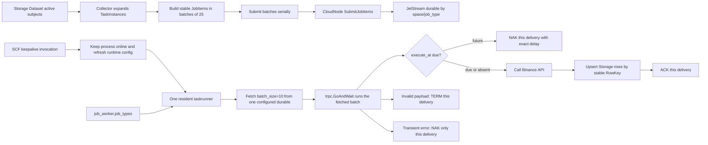

# Collector SCF JetStream 批量并发优化 Implementation Plan

> **For agentic workers:** REQUIRED SUB-SKILL: Use superpowers:subagent-driven-development (recommended) or superpowers:executing-plans to implement this plan task-by-task. Steps use Markdown checkboxes for tracking.

**Goal:** 在不引入同步 SCF 调用、额外调度中心或高可靠基础设施的前提下，让 Collector 控制面按 Dataset 标的一次生成数百个 JobItem 并串行分批投递到 JetStream；常驻 SCF 根据配置绑定 provider-specific JobType，每次 `Fetch(10)` 后使用 `trpc.GoAndWait` 并发执行整批任务，逐消息独立 ACK/NAK/TERM，并保证短任务有界重试、Storage 重投结果正确、Binance TLS 正常校验。

**Architecture:** 保留现有“Collector 规划、CloudNode 管队列、SCF 常驻消费、Storage 落库”的边界。已实测 keepalive 可严格保证 SCF 在线，因此把它作为确定前提：keepalive 只做进程保活、运行时配置更新和心跳，不触发、不拉取、不执行 JobItem。控制面按固定批次顺序调用 CloudNode，CloudNode 异步发布 JetStream；SCF 由一个常驻 taskrunner 只绑定 `job_worker.job_types` 指定的 durable，在不同 durable 之间按批次轮转。`batch_size` 同时表示单次 Fetch 数量和该批最大并发数，不再增加第二个 concurrency 参数；并发由通用 JetStream Runner 的 opt-in independent batch 模式调用 `trpc.GoAndWait` 完成。

**Tech Stack:** Go 1.25、tRPC-Go、NATS JetStream、Tencent SCF、SQLite/GORM、Storage PrimaryStore/DataNode、Vue 3、Vitest、CLS。

---

## 1. 已确认前提与范围

### 1.1 以当前代码为实施基线

本计划基于提交 `adb4fb93` 后的当前实现。以下能力已经存在且方向合理，不重做：

- Collector 已从 Storage Dataset 读取 active subjects，并按 subject、interval 展开稳定 TaskInstance。
- `JobItem.execute_at` 已贯通 Collector、CloudNode、JetStream 和 CloudRuntime。
- JobItem 路由已经使用 `space_id + job_type`，多个 SCF 可竞争同一 durable。
- SCF 生产入口已经启动一个后台常驻 taskrunner；队列为空不会退出。
- 未来任务已经使用 `NakWithDelay(execute_at-now)`，不在 SCF 内维护 future queue。
- keepalive handler 与 taskrunner 入口已经分离。
- Kline 和 Symbol 均直接写 Storage，CloudNode 保存每个 JobItem 的独立状态。

本次不是推翻 Collector，而是补齐当前实现仍缺少的批量并发语义和几个会直接影响数据正确性的边界。

### 1.2 keepalive 的最终约束

已由项目实际环境验证：

> keepalive 可以严格保证 Tencent SCF 实例持续在线运行。

因此本计划不再设计 SCF 冷启动恢复、按任务唤醒、同步调用或额外 worker 守护系统。允许的依赖只有：

1. SCF 启动时常驻 taskrunner 等待第一次完整运行时配置就绪。
2. keepalive invocation 更新服务地址、NodeID、心跳和在线状态。
3. taskrunner 就绪后持续独立消费 JetStream，不等待后续 keepalive 才执行下一批任务。

resident taskrunner 使用进程级 context，不把某次 keepalive invocation 的 deadline 当作任务寿命。每个 JobItem 由 worker 自己创建独立的 20 秒 deadline；keepalive 返回不会取消正在执行的采集任务。

明确禁止：

- `ScheduleTasks -> InvokeFunction` 或任何按 JobItem 激活 SCF 的链路。
- keepalive handler 调用 `Fetch`、`ExecuteTask`、`ExecuteJobItem`。
- 一次 SCF invocation 同步承载一个 JobItem。
- 为保活重新引入本地任务缓存、定时轮询或任务执行状态机。

### 1.3 简化原则

本计划主动不引入：

- 全局 exactly-once、Saga、分布式锁、租约服务。
- 通用 DLQ 管理平台、Schema Registry。
- 独立限流服务、自适应并发算法。
- SCF 自动扩缩容控制器或节点级任务分配。
- 为 Symbol/Kline 建立两套 worker 框架。

默认参数先固定为：

```yaml
job_worker:
  batch_size: 10
  timeout: 20s
  job_types:
    - collect.binance.kline
    - collect.binance.symbol
```

约束解释：

- `batch_size=10`：一次从一个 durable 最多拉 10 条，并通过 `trpc.GoAndWait` 同时执行这最多 10 条；不再定义重复的 `concurrency`。
- `timeout=20s`：每个 JobItem 从开始处理到完成 Storage/状态上报的总预算；正常采集一般小于 5 秒。
- `job_types`：当前 SCF 实例实际绑定和对外上报的 provider-specific JobType；未来 A 股 Provider 只需注册如 `collect.tushare.kline` 并在对应 SCF 配置中启用。
- Collector 不设置 `in_progress_interval`。CloudNode durable 使用 `AckWait=60s`，给 20 秒任务保留 40 秒余量。
- 单 durable 的 `max_ack_pending=32` 继续限制所有 SCF 合计未 ACK delivery 数。

## 2. 最终运行模型



### 2.1 一批 delivery 的处理规则

| delivery 状态 | handler 行为 | JetStream 动作 | 是否影响同批其他消息 |
|---|---|---|---|
| `execute_at` 缺失或已到期 | 立即采集并写 Storage | 成功 ACK | 不影响 |
| `execute_at` 在未来 | 不访问 Binance/Storage | `NAK(delay)` | 不影响 |
| 参数、身份或协议永久非法 | 不执行采集 | TERM | 不影响 |
| Binance/Storage 临时失败 | 返回 retryable error | `NAK(retryDelay)` | 不影响 |
| ACK/NAK/TERM 传输失败 | 本批完成后返回聚合错误，外层 runner 重建 | 动作错误写日志 | 已开始的消息均完成各自动作 |

Collector 的 independent batch 模式下不得保留当前“某一条 RETRY 后，把本批剩余消息全部以同一 delay NAK”的顺序批语义。通用 Runner 的默认串行模式保持不变，继续服务 Archive、Trade、Factor、Monitor 等现有调用方。

### 2.2 期望容量

以 100 个 Kline JobItem 为例：

- Collector 通过 4 个串行 HTTP 请求提交：`25 + 25 + 25 + 25`。
- 单 SCF 每轮最多获取 10 条，并发执行 10 条。
- 10 条中即使 2 条未到期、1 条失败，其余 7 条仍正常执行并 ACK。
- 多个 SCF 共同绑定 durable 时，由 JetStream 竞争分配；不做 NodeID 定向。
- `MaxAckPending=32` 是该 durable 的全局在途上限，不把每个 SCF 的 10 简单无限放大。

## 3. 实施顺序

```text
Task 1  通用 JetStream Runner 增加独立并发批模式
  ↓
Task 2  provider-specific JobType 与配置驱动消费者
  ↓
Task 3  Collector 真正 Fetch(10) 并启用批内并发
  ↓
Task 4  控制面改为串行分批投递
  ↓
Task 5  收紧 20 秒执行预算、3 次本地重试和 60 秒 AckWait
  ↓
Task 6  收紧 JobItem 身份并简化 Dataset 规则
  ↓
Task 7  恢复 Binance TLS 证书校验
  ↓
Task 8  跨模块并发、重投和数据链路 E2E
  ↓
Task 9  真实 SCF 验收、独立 CR、提交与推送
```

每个 Task 独立提交。后一个 Task 开始前，前一个 Task 的目标测试必须通过。

---

## Task 1: 为通用 JetStream Runner 增加独立并发批模式

**Files:**

- Modify: `packages/jetstream/runner.go`
- Modify: `packages/jetstream/runner_test.go`

- [x] **Step 1: 先写 opt-in 并发批和默认兼容测试**

新增测试：

```go
func TestRunnerDefaultsToSequentialBatch(t *testing.T)
func TestRunnerIndependentBatchRunsWholeFetchedBatchConcurrently(t *testing.T)
func TestRunnerConcurrentRetryDoesNotNakOtherDeliveries(t *testing.T)
func TestRunnerConcurrentBatchWaitsForAllStartedDeliveries(t *testing.T)
func TestRunnerConcurrentBatchAggregatesActionErrors(t *testing.T)
func TestRunnerSequentialRetryStillNaksRemainingDeliveries(t *testing.T)
```

`TestRunnerIndependentBatchRunsWholeFetchedBatchConcurrently` 使用 atomic 计数和 barrier：

```go
var active atomic.Int32
var maxActive atomic.Int32
release := make(chan struct{})

handler := DeliveryHandlerFunc(func(context.Context, *Delivery) HandlerResult {
    current := active.Add(1)
    updateMax(&maxActive, current)
    <-release
    active.Add(-1)
    return HandlerResult{Decision: ACK}
})
```

输入 10 条 delivery，配置 `BatchSize: 10, IndependentBatch: true`，在释放 barrier 前等待 `active == 10`，最终断言 `maxActive == 10`。这里不存在第二个并发度：`BatchSize` 就是 Fetch 上限和该批最大并发数。

运行：

```bash
(cd packages/jetstream && go test -count=1 ./... -run 'TestRunner(Default|Independent|Concurrent|Sequential)')
```

Expected: `RunnerConfig` 尚无 `IndependentBatch`，测试先编译失败。

- [x] **Step 2: 只增加内部 opt-in 开关，默认值保持串行**

```go
type RunnerConfig struct {
    BatchSize          int
    IndependentBatch   bool
    InProgressInterval time.Duration
    ErrorReporter      ErrorReporter
    ActionReporter     ActionReporter
}
```

兼容约束：

- Archive、Trade、Factor、Monitor 等未设置 `IndependentBatch` 的调用方继续走当前串行逻辑。
- 默认串行模式保留 ordered batch 行为：遇到 RETRY 后把未开始的剩余 delivery 一并延期。
- `IndependentBatch=true` 表示 Fetch 到的每条 delivery 独立完成，不能传播某一条的 delay。
- 更新 `ActionReporter` 注释，明确并发模式下可能被多个 goroutine 同时调用。

- [x] **Step 3: 使用 trpc.GoAndWait 实现整批并发**

把批处理拆为两个方法：

```go
func (r *Runner) processSequentialBatch(
    ctx context.Context,
    deliveries []*Delivery,
) error

func (r *Runner) processConcurrentBatch(
    ctx context.Context,
    deliveries []*Delivery,
) error
```

禁止自行实现 worker channel、semaphore 或 `sync.WaitGroup` 并发池。`trpc.GoAndWait` 每个 handler 启动一个受 panic recovery 保护的 goroutine；输入已由 `Fetch(batch_size)` 严格限制，因此不会出现无界 goroutine：

```go
func (r *Runner) processConcurrentBatch(
    ctx context.Context,
    deliveries []*Delivery,
) error {
    errs := make([]error, len(deliveries))
    handlers := make([]func() error, len(deliveries))
    for index := range deliveries {
        index := index
        delivery := deliveries[index]
        handlers[index] = func() error {
            if ctx.Err() != nil {
                return nil
            }
            _, inProgressErr, actionErr := r.handle(ctx, delivery)
            errs[index] = errors.Join(inProgressErr, actionErr)
            return nil
        }
    }
    waitErr := trpc.GoAndWait(handlers...)
    return errors.Join(waitErr, errors.Join(errs...))
}
```

`Run` 中只做一次分支：

```go
if r.cfg.IndependentBatch {
    batchErr = r.processConcurrentBatch(ctx, deliveries)
} else {
    batchErr = r.processSequentialBatch(ctx, deliveries)
}
```

每个 closure 只写自己下标的 `errs[index]`，不需要 mutex。`GoAndWait` 返回后再聚合错误；每条 delivery 已经独立完成 ACK/NAK/TERM。Collector 不启用 `InProgressInterval`，因此这里不会为任务启动 delivery heartbeat goroutine。

- [x] **Step 4: 验证旧串行语义无回归**

```bash
(cd packages/jetstream && go test -count=1 ./...)
(cd packages/jetstream && go test -race -count=1 ./...)
(cd modules/archive && go test -count=1 ./internal/eventconsumer ./test)
(cd modules/factor && go test -count=1 ./internal/trigger/eventconsumer)
(cd modules/monitor && go test -count=1 ./internal/metrics/eventconsumer ./internal/hostmetrics/eventconsumer)
(cd modules/trade && go test -count=1 ./internal/eventconsumer)
```

Expected: 新并发测试通过；现有 `TestRunnerRetryStopsBatchAndNaksRemainingWithSameDelay` 继续通过。

- [x] **Step 5: 提交**

```bash
git add packages/jetstream/runner.go packages/jetstream/runner_test.go
git commit -m "feat(jetstream): support independent concurrent batches"
```

---

## Task 2: 落地 provider-specific JobType 与配置驱动消费者

**Files:**

- Modify: `modules/collector/internal/jobs/kline/definition.go`
- Modify: `modules/collector/internal/jobs/kline/handler_test.go`
- Modify: `modules/collector/internal/jobs/symbol/definition.go`
- Modify: `modules/collector/internal/jobs/symbol/handler_test.go`
- Modify: `modules/collector/internal/jobs/registry.go`
- Modify: `modules/collector/internal/jobs/registry_test.go`
- Add: `modules/collector/internal/jobs/route.go`
- Add: `modules/collector/internal/jobs/route_test.go`
- Modify: `modules/collector/internal/taskpublisher/client.go`
- Modify: `modules/collector/internal/taskpublisher/client_test.go`
- Modify: `modules/collector/internal/app/runtime/local_config.go`
- Add: `modules/collector/internal/app/runtime/local_config_test.go`
- Modify: `modules/collector/configs/config.yaml`
- Modify: `modules/collector/internal/reporter/heartbeat.go`
- Modify: `modules/collector/internal/reporter/heartbeat_test.go`
- Modify: `modules/cli/internal/command/collector.go`
- Modify: `modules/cli/internal/command/collector_test.go`
- Modify: `examples/e2e/verify.mjs`
- Modify: `examples/e2e/verify-status.test.mjs`

- [x] **Step 1: 先写 JobType、配置过滤和发布元数据测试**

新增或修改：

```go
func TestRegistryUsesProviderSpecificJobTypes(t *testing.T)
func TestJobRouteForBinanceKline(t *testing.T)
func TestJobRouteByJobType(t *testing.T)
func TestBuildJobItemDerivesProviderSpecificJobType(t *testing.T)
func TestDefaultConfigEnablesBinanceJobTypes(t *testing.T)
func TestJobWorkerConfigRejectsUnknownJobType(t *testing.T)
func TestHeartbeatAdvertisesConfiguredJobTypesOnly(t *testing.T)
func TestCollectorPublishUsesSameJobTypesForMetadataAndEnvironment(t *testing.T)
```

硬性断言：

```text
binance kline  -> collect.binance.kline
binance symbol -> collect.binance.symbol
```

旧的 `collect.kline`、`collect.symbol` 不作为兼容别名保留。A 股 Provider 本次不虚构实现；route 单元测试证明新增 `collect.tushare.kline` 后可以被配置选择。

- [x] **Step 2: 将 JobType 改为 provider-specific**

先把现有 provider 常量改为：

```go
// internal/jobs/kline
const JobType = "collect.binance.kline"

// internal/jobs/symbol
const JobType = "collect.binance.symbol"
```

再新增小而明确的路由表。JobDefinition 继续只负责 `kline`、`symbol` 的规则表单和 planner；不要为 Binance Kline、A 股 Kline 复制两套 UI definition：

```go
type JobRoute struct {
    Exchange string
    DataType string
    JobType  string
}

var jobRoutes = []JobRoute{
    {Exchange: "binance", DataType: "kline", JobType: kline.JobType},
    {Exchange: "binance", DataType: "symbol", JobType: symbol.JobType},
}
```

路由 API：

```go
func JobRouteFor(exchange, dataType string) (JobRoute, bool)
func JobRouteByJobType(jobType string) (JobRoute, bool)
func SupportedJobTypes() []string
```

删除 `JobDefinition.JobType`，避免一个 Kline definition 只能表达一个 Provider。`buildJobItem` 改为返回 `(*pb.JobItem, error)`，根据 TaskInstance payload 中已经过规则校验的 `exchange + data_type` 查询 `JobRouteFor`；找不到 route 时返回错误，不再拼接 `"collect."+dataType`，也不再信任 params 中可篡改的 `job_type`。

未来 A 股只需给现有 Kline definition 增加对应 `Supports`，并在路由表新增：

```go
{Exchange: "tushare", DataType: "kline", JobType: "collect.tushare.kline"}
```

实际 Provider/source 实现仍是新增该 route 的前置条件。

- [x] **Step 3: 增加最小 JobWorker 配置**

```go
type JobWorkerConfig struct {
    BatchSize int           `json:"batch_size" yaml:"batch_size"`
    Timeout   time.Duration `json:"timeout" yaml:"timeout"`
    JobTypes  []string      `json:"job_types" yaml:"job_types"`
}

func GetJobWorkerConfig() (JobWorkerConfig, error)
```

默认值和部署配置：

```yaml
job_worker:
  batch_size: 10
  timeout: 20s
  job_types:
    - collect.binance.kline
    - collect.binance.symbol
```

校验规则：

- `batch_size <= 0` 使用 10。
- `timeout <= 0` 使用 20 秒。
- `job_types` 去空白、去重并保持输入顺序。
- `job_types` 为空或包含 registry 未注册值时启动失败，不能静默回退为“消费全部”。
- 不增加 `concurrency` 和 `in_progress_interval`。
- `MOOX_COLLECTOR_JOB_TYPES` 非空时覆盖 YAML，格式为逗号分隔列表，供同一代码包按 SCF 部署选择消费者。

- [x] **Step 4: 让部署元数据与运行时配置使用同一列表**

在 `collectorPublishOptions` 增加：

```go
JobTypes []string
```

发布命令增加：

```go
collectorFunctionPublishCmd.Flags().StringSliceVar(
    &collectorPublishFlags.JobTypes,
    "job-types",
    []string{"collect.binance.kline", "collect.binance.symbol"},
    "JobTypes consumed by this SCF deployment",
)
```

`buildCollectorCreateNodeItem` 同时写入：

```text
metadata.supported_workloads = normalized job types
environment.MOOX_COLLECTOR_JOB_TYPES = comma-joined job types
```

这样 CloudNode 在创建节点时预建的 durable、SCF 实际绑定的 durable、heartbeat 上报的 `supported_workloads` 使用同一列表。未来 A 股部署的形状是：

```bash
moox collector function publish \
  --job-types collect.tushare.kline
```

前提是代码包已经注册对应 Provider；未知 JobType 必须在发布或 SCF 启动时失败。

- [x] **Step 5: 更新受影响的契约与 E2E fixture**

把 Collector/CLI/E2E 中作为真实 Collector workload 的：

```text
collect.kline
collect.symbol
```

更新为：

```text
collect.binance.kline
collect.binance.symbol
```

CloudNode、CloudRuntime、JetStream 的通用单元测试仍可使用 `collect.kline` 作为任意字符串样例，不做无意义全仓机械替换。

- [x] **Step 6: 运行测试并提交**

```bash
(cd modules/collector && go test -count=1 ./internal/jobs/... ./internal/taskpublisher \
  ./internal/app/runtime ./internal/reporter)
(cd modules/cli && go test -count=1 ./internal/command)
node --test examples/e2e/verify-status.test.mjs
git add modules/collector/internal/jobs modules/collector/internal/taskpublisher \
  modules/collector/internal/app/runtime modules/collector/internal/reporter \
  modules/collector/configs/config.yaml modules/cli/internal/command examples/e2e
git commit -m "refactor(collector): scope job types by provider"
```

---

## Task 3: 让 Collector Fetch(10) 并通过 trpc.GoAndWait 并发整批

**Files:**

- Modify: `modules/collector/internal/taskrunner/direct.go`
- Modify: `modules/collector/internal/taskrunner/direct_test.go`
- Modify: `modules/collector/cmd/scf/main_test.go`
- Modify: `modules/collector/internal/serverless/handler_test.go`
- Modify: `scripts/build/build-collector-scf-package_test.sh`

- [x] **Step 1: 先写 worker 配置和 Fetch 参数测试**

新增：

```go
func TestTaskRunnerBindsConfiguredJobTypesOnly(t *testing.T)
func TestRoundRobinConsumerFetchesRequestedBatchAndRotates(t *testing.T)
func TestCollectorRunnerUsesIndependentBatch(t *testing.T)
func TestCollectorBatchStartsAllFetchedDeliveriesBeforeWaiting(t *testing.T)
```

`fakeQueueConsumer` 记录每次 `Fetch` 收到的 batch 参数。断言调用序列为：

```text
first.Fetch(10)
second.Fetch(10)
first.Fetch(10)
```

不能只检查返回数量。并发测试使用 barrier，必须证明 10 个 handler 都已开始，而不是串行完成 10 次。

- [x] **Step 2: 只为配置中的 JobType 创建 consumer binding**

将：

```go
jobTypes := jobs.SupportedJobTypes()
```

改为：

```go
workerCfg, err := runtimeapp.GetJobWorkerConfig()
if err != nil {
    return err
}
jobTypes := workerCfg.JobTypes
```

只用配置列表创建 consumer binding。进程内 handler registry 可以继续一次性注册代码包支持的全部 route，避免动态修改全局 registry；是否实际消费完全由 binding 决定。配置 `collect.binance.kline` 的 SCF 不得顺带 bind `collect.binance.symbol`，heartbeat 也只上报前者。

- [x] **Step 3: 修正 roundRobinConsumer**

将：

```go
func (c *roundRobinConsumer) Fetch(ctx context.Context, _ int)
```

改为：

```go
func (c *roundRobinConsumer) Fetch(
    ctx context.Context,
    batch int,
) ([]*jetstream.Delivery, error) {
    if batch <= 0 {
        batch = 1
    }
    // 对当前 binding 调用 consumer.Fetch(ctx, batch)，拿到一批后将 next
    // 移到下一个 binding。空 binding 仍在本轮继续尝试。
}
```

继续保留“按批次轮转 JobType”的简单公平性：

- 一轮从 Kline durable 拉最多 10 条。
- 下一轮优先尝试 Symbol durable。
- 总并发由单个 resident Runner 的 Fetch 批次限制为 10，不为每个 JobType 各起一个 runner 或第二层并发池。

- [x] **Step 4: 将配置传入 Runner**

```go
return jetstream.NewRunner(roundRobin, handler, jetstream.RunnerConfig{
    BatchSize:        workerCfg.BatchSize,
    IndependentBatch: true,
    ErrorReporter:    ...,
    ActionReporter:   actionReporter,
}).Run(ctx)
```

`InProgressInterval` 保持零值。每个 delivery 继续通过现有 `handleDelivery -> CloudRuntime.ExecuteJobItem` 执行；不得在 handler 内再创建第二层“JobItem 并发池”。Kline 单任务的分页请求仍串行，避免把一次 JobItem 再无界放大成多页并发。

- [x] **Step 5: 固化 keepalive 与执行解耦**

扩展现有测试，明确断言：

```go
func TestProductionRuntimeStartsResidentRunnerExactlyOnce(t *testing.T)
func TestRepeatedKeepaliveDoesNotStartTaskRunner(t *testing.T)
func TestKeepaliveDoesNotFetchOrExecuteJobItems(t *testing.T)
```

允许第一次 keepalive 完成运行时配置并解除 readiness；禁止每次 keepalive 重启 runner 或触发一次消费。

- [x] **Step 6: 验证 SCF 包含新配置**

`scripts/build/build-collector-scf-package_test.sh` 解压 zip 后断言：

```text
config.yaml contains job_worker.batch_size: 10
config.yaml contains job_worker.timeout: 20s
config.yaml contains collect.binance.kline
config.yaml does not contain concurrency or in_progress_interval
```

运行：

```bash
(cd modules/collector && go test -count=1 ./internal/app/runtime ./internal/taskrunner ./cmd/scf ./internal/serverless)
bash scripts/build/build-collector-scf-package_test.sh
```

- [x] **Step 7: 提交**

```bash
git add modules/collector/internal/taskrunner \
  modules/collector/cmd/scf \
  modules/collector/internal/serverless \
  scripts/build/build-collector-scf-package_test.sh
git commit -m "feat(collector): fetch and execute job batches concurrently"
```

---

## Task 4: 将控制面改为串行分批投递

**Files:**

- Modify: `modules/collector/internal/taskpublisher/client.go`
- Modify: `modules/collector/internal/taskpublisher/client_test.go`
- Modify: `modules/collector/internal/rpc/service.go`
- Modify: `modules/collector/internal/rpc/service_test.go`
- Modify: `scripts/check-collector-planned-node-removal.mjs`

- [x] **Step 1: 先写严格串行和失败停止测试**

新增：

```go
func TestSubmitCollectorJobItemsSubmitsBatchesInInputOrder(t *testing.T)
func TestSubmitCollectorJobItemsNeverRunsTwoBatchesConcurrently(t *testing.T)
func TestSubmitCollectorJobItemsStopsAfterFirstFailedBatch(t *testing.T)
func TestScheduleTasksContinuesAfterOneRuleFails(t *testing.T)
```

使用 51 个实例，断言请求顺序和大小严格为：

```text
request 1: task-00..task-24, size 25
request 2: task-25..task-49, size 25
request 3: task-50, size 1
max concurrent HTTP requests: 1
```

第二批失败时：

- 返回第一批 25 个成功 ID。
- 不提交第三批。
- 返回错误包含 `batch 25-50`。
- 下次 `ScheduleTasks` 通过稳定 JobItemID 让第一批 deduplicate，并继续补发未成功批次。

- [x] **Step 2: 删除发布端 errgroup 和 semaphore**

实现保持直接：

```go
idsByTaskID := make(map[string]string, len(jobItems))
for start := 0; start < len(jobItems); start += submitJobItemBatchSize {
    end := min(start+submitJobItemBatchSize, len(jobItems))
    ids, err := c.submitCollectorJobItemBatch(ctx, jobItems[start:end], start, end)
    maps.Copy(idsByTaskID, ids)
    if err != nil {
        return idsByTaskID, err
    }
}
return idsByTaskID, nil
```

删除 `submitJobItemConcurrency`、`sync.Mutex` 和 `errgroup`。发布端串行只保证控制面简单和请求顺序；任务执行并发由 SCF 消费端负责，两者不要混淆。

- [x] **Step 3: ScheduleTasks 按规则继续并聚合错误**

规则之间保持串行。某条规则失败时记录错误并继续下一条，最后返回聚合错误：

```go
var scheduleErr error
for i := range rules {
    created, err := s.scheduleRule(ctx, &rules[i], now)
    if err != nil {
        scheduleErr = errors.Join(
            scheduleErr,
            fmt.Errorf("rule %s: %w", rules[i].RuleID, err),
        )
        continue
    }
    total += created
}
```

这样一个错误规则不会阻塞其后数百个有效标的，但不增加重试调度器。

- [x] **Step 4: 增加静态边界检查**

扩展 `scripts/check-collector-planned-node-removal.mjs`，在以下控制面文件中拒绝同步 SCF 调用或 wake 概念：

```text
modules/collector/internal/taskpublisher/client.go
modules/collector/internal/rpc/service.go
```

拒绝符号：

```text
InvokeFunction
InvokeSync
WakeNode
ActivateSCF
```

不要扫描 serverless keepalive handler；keepalive 本身是被接受的生命周期机制。

- [x] **Step 5: 运行测试并提交**

```bash
(cd modules/collector && go test -count=1 ./internal/taskpublisher ./internal/rpc)
node scripts/check-collector-planned-node-removal.mjs
git add modules/collector/internal/taskpublisher modules/collector/internal/rpc \
  scripts/check-collector-planned-node-removal.mjs
git commit -m "refactor(collector): submit cloud jobs in serial batches"
```

---

## Task 5: 收紧 20 秒执行预算、3 次本地重试和 60 秒 AckWait

**Files:**

- Modify: `modules/collector/internal/taskrunner/direct.go`
- Modify: `modules/collector/internal/taskrunner/direct_test.go`
- Add: `modules/collector/internal/sources/binance/client/retry.go`
- Add: `modules/collector/internal/sources/binance/client/retry_test.go`
- Modify: `modules/collector/internal/httpclient/client.go`
- Modify: `modules/collector/internal/httpclient/client_test.go`
- Modify: `modules/collector/internal/sources/binance/client/spot.go`
- Modify: `modules/collector/internal/sources/binance/client/swap.go`
- Modify: `modules/collector/internal/sources/binance/client/trades.go`
- Modify: `modules/collector/internal/sources/binance/storage_rpc.go`
- Add: `modules/collector/internal/sources/binance/storage_rpc_test.go`
- Modify: `modules/collector/internal/sources/binance/symbol.go`
- Modify: `modules/collector/internal/sources/binance/symbol_test.go`
- Modify: `modules/cloudnode/internal/config/config.go`
- Modify: `modules/cloudnode/internal/config/config_test.go`
- Modify: `modules/cloudnode/config/app.yaml`
- Modify: `modules/cloudnode/internal/jobqueue/jetstream_queue.go`
- Modify: `modules/cloudnode/internal/jobqueue/jetstream_queue_test.go`
- Modify: `modules/cloudnode/internal/jobqueue/jetstream_client_test.go`

- [x] **Step 1: 先写总超时、重试次数和 AckWait 测试**

新增：

```go
func TestCollectorJobItemUsesConfiguredTwentySecondDeadline(t *testing.T)
func TestCollectorWorkloadLeavesTwoSecondsForFinalReport(t *testing.T)
func TestCollectorTimeoutReturnsRetryableDecision(t *testing.T)
func TestBinanceTransientRequestAttemptsThreeTimes(t *testing.T)
func TestBinancePermanentResponseDoesNotRetry(t *testing.T)
func TestStorageTransientFailureAttemptsThreeTimes(t *testing.T)
func TestStoragePermanentResponseDoesNotRetry(t *testing.T)
func TestCollectorRunnerDoesNotSendInProgress(t *testing.T)
func TestJobExecutionQueueUsesSixtySecondAckWait(t *testing.T)
```

测试时间通过注入 timeout/clock 或毫秒级测试配置完成，禁止真实等待 20 秒或 60 秒。`retry.Attempts(3)` 的含义固定为总共 3 次调用，即首次加两次重试。

- [x] **Step 2: 把 20 秒 deadline 覆盖到整个 JobItem**

在 resident Runner 的 delivery handler 外层创建 timeout context：

```go
handler := jetstream.DeliveryHandlerFunc(func(
    handleCtx context.Context,
    delivery *jetstream.Delivery,
) jetstream.HandlerResult {
    jobCtx, cancel := context.WithTimeout(handleCtx, workerCfg.Timeout)
    defer cancel()
    return handleDelivery(jobCtx, registry, bindings, runtimeCfg, delivery)
})
```

删除内部固定 `collectorWorkloadTimeout = 100s`。整体 20 秒 deadline 包含：

- delivery 校验和到期判断。
- Binance 请求与本地 retry。
- Storage 请求与本地 retry。
- Collector/CloudNode 状态上报。

为终态上报保留固定 2 秒，不新增配置项：

```go
const jobReportReserve = 2 * time.Second

func workloadContext(ctx context.Context) (context.Context, context.CancelFunc, error) {
    deadline, ok := ctx.Deadline()
    if !ok {
        return nil, nil, errors.New("job deadline is required")
    }
    workloadDeadline := deadline.Add(-jobReportReserve)
    if !time.Now().Before(workloadDeadline) {
        return nil, nil, context.DeadlineExceeded
    }
    workloadCtx, cancel := context.WithDeadline(ctx, workloadDeadline)
    return workloadCtx, cancel, nil
}
```

因此采集和本地 retry 最多使用约 18 秒，成功或最终失败后仍有 2 秒完成 CloudNode 状态上报与 ACK/TERM。达到执行预算时返回 retryable 结果，由当前 delivery `NAK(delay)`；不得把超时转成 TERM。测试使用注入时钟或短 deadline，不真实等待。

- [x] **Step 3: 统一 Binance 的 3 次短重试**

复用现有 `github.com/avast/retry-go`，不要再引入第二个 retry 库。公共 helper 的有效参数：

```go
retry.Attempts(3)
retry.Delay(200 * time.Millisecond)
retry.DelayType(retry.BackOffDelay)
retry.MaxDelay(time.Second)
retry.LastErrorOnly(true)
retry.Context(ctx)
retry.RetryIf(isRetryableBinanceError)
```

每次 HTTP 请求最多使用 5 秒 child context，但不得超过 JobItem 剩余 deadline。只重试网络错误、超时、HTTP 429 和 5xx；JSON/参数错误及其他 4xx 直接返回。现有 spot/swap/trades 中分散的 `retry.Do` 改为调用同一个 helper，避免不同接口各自演化出不同次数。

`httpclient` 增加可供 `errors.As` 判断的状态错误，禁止根据错误字符串识别状态码：

```go
type StatusError struct {
    StatusCode int
}

func (e *StatusError) Error() string {
    return fmt.Sprintf("HTTP status %d", e.StatusCode)
}
```

- [x] **Step 4: 给 Storage RPC 增加同样的 3 次短重试**

在 `storageWriter` 的 RPC 边界统一使用：

```go
retry.Attempts(3)
retry.Delay(200 * time.Millisecond)
retry.DelayType(retry.BackOffDelay)
retry.MaxDelay(time.Second)
retry.LastErrorOnly(true)
retry.Context(ctx)
retry.RetryIf(isRetryableStorageError)
```

只重试 tRPC 网络/超时和 Storage `INNER_ERR`；`INVALID_PARAM`、鉴权失败、context canceled 不重试。删除 `SymbolCollector.sendSymbolBatchWithRetry` 外层的整批 retry，防止 Storage writer 3 次乘以外层 3 次变成 9 次。Kline 和 Symbol 都通过同一个 `storageWriter` 获得一致行为。

- [x] **Step 5: 将 durable 设置为 60 秒 AckWait、4 次 MaxDeliver**

最终值：

```yaml
jetstream:
  max_deliver: 4
  max_ack_pending: 32
```

```go
const DefaultAckWait = 60 * time.Second
```

解释：

- JobItem 硬超时 20 秒，ACK 前还有 40 秒用于调度抖动和 action 发送。
- 不发送 `InProgress`，减少一个心跳状态机。
- 未来任务第一次 delivery 可用于精确 `NAK(execute_at-now)`；剩余 3 次可用于到期后的真实执行。
- `MaxAckPending=32` 足够容纳 3 个 10 条批次和少量余量，不增加动态容量算法。

断言 `EnsureJobExecutionQueue` 会把已存在 consumer 更新为：

```text
AckWait=60s
MaxDeliver=4
MaxAckPending=32
```

- [x] **Step 6: 运行测试**

运行：

```bash
(cd modules/collector && go test -count=1 ./internal/taskrunner \
  ./internal/httpclient ./internal/sources/binance ./internal/sources/binance/client)
(cd modules/cloudnode && go test -count=1 ./internal/config ./internal/jobqueue)
```

- [x] **Step 7: 提交**

```bash
git add modules/collector/internal/taskrunner modules/collector/internal/sources/binance \
  modules/collector/internal/httpclient \
  modules/cloudnode/internal/config modules/cloudnode/config/app.yaml \
  modules/cloudnode/internal/jobqueue
git commit -m "fix(collector): bound retries within short job deadlines"
```

---

## Task 6: 收紧 JobItem 身份并简化 Dataset 规则

**Files:**

以下两个原计划任务合并实施，避免 identity、规则 JSON 和前端表单在两个提交之间出现互相矛盾的中间状态。

- Modify: `modules/collector/internal/jobs/registry.go`
- Modify: `modules/collector/internal/jobs/registry_test.go`
- Modify: `modules/collector/internal/jobs/jobdef/definition.go`
- Modify: `modules/collector/internal/jobs/jobdef/definition_test.go`
- Modify: `modules/collector/internal/taskpublisher/client.go`
- Modify: `modules/collector/internal/taskpublisher/client_test.go`
- Modify: `modules/collector/internal/taskrunner/direct.go`
- Modify: `modules/collector/internal/taskrunner/direct_test.go`
- Modify: `modules/collector/internal/domain/collect_params.go`
- Modify: `modules/collector/internal/domain/collect_params_test.go`
- Modify: `modules/collector/internal/jobs/kline/planner.go`
- Modify: `modules/collector/internal/jobs/kline/params.go`
- Modify: `modules/collector/internal/jobs/symbol/planner.go`
- Modify: `modules/collector/internal/jobs/symbol/params.go`
- Modify: `modules/collector/internal/rpc/service.go`
- Modify: `modules/collector/internal/rpc/service_test.go`
- Modify: `modules/collector/internal/planner/task_builder_test.go`
- Modify: `web/src/views/collector/collector-rules/collector-rules.vue`
- Add: `web/src/views/collector/collector-rules/collector-rule-params.ts`
- Add: `web/src/views/collector/collector-rules/collector-rule-params.test.ts`
- Modify: `examples/e2e/verify.mjs`
- Modify: `examples/e2e/README.md`

- [x] **Step 1: 先写 envelope 权威性测试**

新增：

```go
func TestTaskEventUsesEnvelopeSpaceID(t *testing.T)
func TestTaskEventRejectsPayloadSpaceMismatch(t *testing.T)
func TestTaskEventDerivesDataTypeFromJobType(t *testing.T)
func TestTaskEventRejectsPayloadDataTypeMismatch(t *testing.T)
func TestBuildJobItemDerivesJobTypeFromExchangeAndDataType(t *testing.T)
```

权威字段：

| 字段 | 权威来源 |
|---|---|
| `space_id` | Event envelope / `nodeRuntime.JobItem.SpaceID` |
| `job_type` | Event payload，经 queue binding 验证 |
| `data_type` | jobs registry 根据 `job_type` 推导 |
| `job_item_id` | Event payload，经 CloudRuntime 传递 |
| `dataset_id`、`subject_id`、`symbol`、`interval` | 任务业务 params |

params 中若重复携带 `space_id` 或 `data_type`，必须与权威值一致，否则 TERM；不得静默接受跨空间或跨类型串写。

Storage 行写入继续依赖现有 RowKey upsert 获得结果幂等；本计划不新增 Collector inbox、分页哈希或 source-event 去重表。JetStream 重投可能再次发起同一 upsert，这是个人量化场景接受的 at-least-once 边界。

- [x] **Step 2: 定义唯一规则 JSON 契约**

新项目不保留旧字段兼容。最终形状：

```json
{
  "source": {
    "kind": "dataset_subjects",
    "dataset_id": "binance_spot_kline_1h"
  },
  "collector": {
    "exchange": "binance",
    "market": "spot",
    "data_type": "kline",
    "intervals": ["1h"],
    "live": false
  },
  "target": {
    "dataset_id": "binance_spot_kline_1h"
  },
  "schedule": {
    "interval": "1h"
  }
}
```

直接删除：

- `target.job_type`：由 jobs registry 决定。
- `schedule.timezone`：当前 next-boundary 算法不读取它，统一 UTC。
- `schedule.intervals`：只保留 `collector.intervals`。
- `objects`：Dataset active membership 已经是任务全集；需要子集时创建一个更小 Dataset，不维护第二套标的过滤语义。
- task params 中的 `schedule_timezone` 和 `job_type`。

- [x] **Step 3: DatasetID 不再按字符串猜测**

删除 `inferDatasetID` 和前端 `inferCollectDatasetId`。规则创建时明确要求：

- Kline：`source.dataset_id` 和 `target.dataset_id` 均非空；个人量化默认在 UI 中选择同一个 Dataset。
- Symbol：`source.kind=none`，`target.dataset_id` 非空。

这会直接消除 `binance_spot_symbol` 与实际 `dataset_binance_spot_symbols` 的默认命名不一致，不需要维护类型到 Dataset 的魔法映射。

- [x] **Step 4: Create/Update 时按 jobs registry 完整校验**

在写 DB 前完成：

```go
params, err := domain.ParseCollectParams(...)
definition, ok := jobs.JobDefinitionByDataType(params.Collector.DataType)
_, routeOK := jobs.JobRouteFor(params.Collector.Exchange, params.Collector.DataType)
if !ok || !routeOK || !definition.Matches(params) {
    return fmt.Errorf(
        "unsupported collector: exchange=%s market=%s data_type=%s source_kind=%s",
        params.Collector.Exchange,
        params.Collector.Market,
        params.Collector.DataType,
        params.Source.Kind,
    )
}
```

同步收紧 `JobDefinition.Matches`，要求 `exchange + market + data_type + source_kind` 同时匹配 `Supports`。验证 intervals 非空、DatasetID 非空、schedule interval 可被 `time.ParseDuration` 接受。非法规则不得等到 `ScheduleTasks` 才失败。

- [x] **Step 5: 简化前端规则表单**

`collector-rule-params.ts` 只负责：

```ts
export type CollectorRuleInput = {
  dataType: "kline" | "symbol";
  exchange: string;
  market: "spot" | "swap";
  datasetId: string;
  intervals: string[];
  scheduleInterval: string;
};

export function buildCollectorRuleParams(input: CollectorRuleInput): Record<string, unknown>
```

在 `collector-rules.vue`：

- 使用现有 Storage metadata API 加载当前 Space 的 active datasets。
- Provider 选项读取后端 `DataSourceOptions`，当前显示 Binance，未来注册 A 股 Provider 后不需要重写表单类型。
- 增加必选 Dataset 下拉框。
- 移除 objects 输入、通配符和对应状态。
- Kline 与 Symbol 统一使用一个产品类型/market 控件，删除未被后端定义采用的 `inst_types` 分支。
- Kline 显示 interval 多选；Symbol 不显示 interval。
- 增加必填采集频率控件并写入 `schedule.interval`，不再静默固定为 30 分钟。
- 编辑时严格解析新结构，不读取已删除字段。

Vitest 覆盖 Kline、Symbol、缺失 Dataset、切换市场四种构造结果。

- [x] **Step 6: 更新 E2E 请求**

`examples/e2e/verify.mjs` 和 README 只使用新形状，不再发送 `job_type`、`timezone`、重复 intervals。

- [x] **Step 7: 运行测试并提交**

```bash
(cd modules/collector && go test -count=1 ./internal/domain ./internal/jobs/... \
  ./internal/taskpublisher ./internal/taskrunner ./internal/rpc ./internal/planner)
(cd web && pnpm test -- src/views/collector/collector-rules/collector-rule-params.test.ts)
(cd web && pnpm exec vue-tsc --noEmit)
git add modules/collector/internal/domain modules/collector/internal/jobs \
  modules/collector/internal/taskpublisher modules/collector/internal/taskrunner \
  modules/collector/internal/rpc modules/collector/internal/planner \
  web/src/views/collector/collector-rules examples/e2e
git commit -m "refactor(collector): simplify dataset driven rule contracts"
```

---

## Task 7: 恢复 Binance TLS 证书校验

**Files:**

- Modify: `modules/collector/internal/httpclient/client.go`
- Modify: `modules/collector/internal/httpclient/client_test.go`
- Modify: `modules/collector/internal/httpclient/probe.go`
- Add: `modules/collector/internal/httpclient/probe_test.go`

- [x] **Step 1: 先写证书校验测试**

新增：

```go
func TestNewHTTPClientEnablesTLSVerification(t *testing.T)
func TestGetWithIPValidatesCertificateForDomain(t *testing.T)
func TestGetWithIPRejectsUntrustedCertificate(t *testing.T)
func TestProbeHTTPSRejectsCertificateForWrongDomain(t *testing.T)
```

测试必须覆盖“URL 仍使用域名、DialContext 只替换目标 IP”的真实方式。不能只断言字段值。

- [x] **Step 2: 使用系统根证书，不要求 Binance 专用证书配置**

普通 client：

```go
transport := http.DefaultTransport.(*http.Transport).Clone()
transport.TLSClientConfig = &tls.Config{
    MinVersion: tls.VersionTLS12,
}
client := &http.Client{
    Timeout:   5 * time.Second,
    Transport: transport,
}
```

`RootCAs == nil` 表示使用 SCF 运行时系统 CA。访问 Binance 公网证书不需要项目配置客户端证书，也不需要把 Binance 证书打进 SCF 包。

指定 IP 时继续构造：

```text
URL:         https://api.binance.com/...
Dial target: selected-ip:443
TLS SNI:     api.binance.com
Verify name: api.binance.com
```

不要把 URL 改成 IP。`http.Transport` 会根据请求 URL host 设置 SNI 和主机名校验；probe 中显式设置 `ServerName: domain` 以让意图清晰。

- [x] **Step 3: 删除两个 InsecureSkipVerify**

以下两处均不得残留：

```text
modules/collector/internal/httpclient/client.go
modules/collector/internal/httpclient/probe.go
```

增加静态断言：

```bash
! rg -n 'InsecureSkipVerify:\s*true' modules/collector/internal/httpclient
```

- [x] **Step 4: 运行测试并提交**

```bash
(cd modules/collector && go test -count=1 ./internal/httpclient)
(cd modules/collector && go test -race -count=1 ./internal/httpclient)
git add modules/collector/internal/httpclient
git commit -m "fix(collector): verify Binance TLS certificates"
```

---

## Task 8: 增加跨模块批量并发 E2E

**Files:**

- Add: `modules/collector/test/jetstream_batch_e2e_test.go`
- Add: `modules/collector/test/storage_redelivery_e2e_test.go`
- Modify: `examples/e2e/verify.mjs`
- Modify: `examples/e2e/verify-status.test.mjs`
- Modify: `examples/e2e/run.sh`
- Modify: `examples/e2e/run-real-scf.sh`
- Modify: `examples/e2e/test-run-real-scf.sh`
- Modify: `examples/e2e/README.md`

- [x] **Step 1: 建立 100 条任务的本地 JetStream E2E**

`jetstream_batch_e2e_test.go` 使用 testkit NATS、真实 events registry 和 Collector taskrunner adapter：

1. 创建 100 个稳定 JobItem。
2. 以 25 条一批串行提交。
3. consumer 使用 `BatchSize=10, IndependentBatch=true`。
4. fake workload 用 barrier 记录最大并发。
5. 等待全部 delivery 得到动作。

硬性断言：

```text
submitted batches: [25, 25, 25, 25]
fetch batch arguments: all 10
max active handlers: 10
ACK count: 100
NAK count: 0
TERM count: 0
duplicate handler starts: 0
```

- [x] **Step 2: 增加 mixed batch E2E**

同一 Fetch 返回 due、future、retryable、invalid 四类消息，断言各自动作。未来消息第二次 delivery 到期后执行，且第一轮不阻塞 due 消息。

- [x] **Step 3: 增加 Storage 重投结果正确性 E2E**

模拟：

1. Kline Storage 写入成功。
2. 第一次 ACK 失败，delivery 重投。
3. 同一批 rows 再次写入。

断言：

- 同一 RowKey 最终只有一行且字段值正确。
- redelivery 可以重复调用 upsert，但不会产生重复数据行。
- 不要求 Collector 自己维护去重状态。
- 不把“下游事件严格只发布一次”列入本计划承诺。

- [x] **Step 4: 扩展现有端到端脚本**

`examples/e2e/verify.mjs` 增加 batch acceptance state：

```json
{
  "batch_job_item_ids": ["..."],
  "expected_batch_size": 10
}
```

最大并发直接从任务 started/completed barrier 观测，不增加第二个配置字段。`run.sh` 本地 resident 路径至少提交 20 条立即任务，验证全部终态和 Storage rows。`run-real-scf.sh` 继续只使用已经发布的真实 SCF，不启动本地 SCF。

- [x] **Step 5: 运行跨模块验证**

```bash
(cd packages/jetstream && go test -race -count=1 ./...)
(cd modules/cloudnode && go test -race -count=1 ./internal/config ./internal/jobqueue ./internal/jobstate ./internal/rpc)
(cd packages/cloudruntime && go test -race -count=1 ./...)
(cd modules/collector && go test -race -count=1 ./...)
(cd modules/storage && go test -race -count=1 ./internal/service/primarystore ./internal/service/datanode/...)
node --test examples/e2e/verify-status.test.mjs
bash examples/e2e/test-run-scf-resident.sh
bash examples/e2e/test-run-real-scf.sh
bash scripts/test/contract/test-go-workspace.sh
make verify-pr
```

Expected: 全部通过；任何 race、提前执行、整批共同 NAK 或重复 Storage 行都必须在进入 Task 9 前修复。

- [x] **Step 6: 提交**

```bash
git add modules/collector/test examples/e2e
git commit -m "test(collector): cover concurrent JetStream job batches"
```

---

## Task 9: 真实 SCF 验收、独立 CR、提交与推送

**Files:**

- Modify if required by acceptance: `scripts/build/build-collector-scf-package.sh`
- Modify if required by acceptance: `examples/e2e/run-real-scf.sh`
- Modify if required by acceptance: `examples/e2e/verify.mjs`
- Modify: `docs/superpowers/plans/2026-07-27-collector-scf-jetstream-batch-concurrency.md`

- [x] **Step 1: 构建并发布新的 SCF 包**

```bash
make -C modules/collector package-scf
```

确认 zip 中包含：

```text
main
config.yaml with batch_size=10, timeout=20s and provider-specific job_types
config.yaml without concurrency or in_progress_interval
EventBus CA and worker credential loading support
```

通过现有 CloudNode 发布链路更新真实 Tencent SCF 节点。记录 code package ID 和函数版本。

- [x] **Step 2: 验证 keepalive 前提仍成立**

在不投递 JobItem 的情况下连续观察至少两个 keepalive 周期：

- SCF 节点持续 online。
- resident taskrunner 进程未重启。
- keepalive invocation 日志只包含配置更新、probe、heartbeat。
- 没有 `collector_job_started`。

随后停止控制面 Schedule timer 但保留 keepalive，手工投递立即 JobItem；任务仍应被后台 taskrunner 消费。该用例直接证明 keepalive 不负责触发任务。

- [x] **Step 3: 真实批量并发验收**

使用至少 20 个 active DatasetSubject：

```bash
MOOX_E2E_TIMEOUT_SECONDS=300 \
  bash examples/e2e/run-real-scf.sh \
  --space crypto \
  --dataset binance_spot_kline_1h
```

验收：

- 控制面无任何同步 SCF invoke。
- JetStream consumer 可看到单次 pull 最大 10。
- CLS 中至少出现一组 10 个不同 JobItem 的 `collector_job_started`，且它们在该组首个 `collector_job_completed` 之前均已开始。
- 未来任务在 `execute_at` 前只有 `collector_job_deferred` 和 RETRY action。
- 每个终态 JobItem 有且只有一个最终 ACK/TERM。
- Storage 目标 Dataset、subject、freq、watermark 正确。
- keepalive 日志与 JobItem 生命周期日志使用不同 event 字段，可独立查询。

CLS 查询字段至少包含：

```text
event
space_id
job_item_id
job_type
node_id
delivery_count
execute_at
decision
dataset_id
subject_id
interval
```

- [x] **Step 4: 运行 codeCR 独立审查**

按全局约定使用 `codeCR` subAgent 审查最终 diff，要求重点核查：

1. Runner 并发下 ACK/NAK/TERM 和 cancellation 是否有 race。
2. 默认串行模式的已有模块是否行为回归。
3. keepalive 是否重新耦合任务执行。
4. 同一批 mixed delivery 是否真正独立。
5. 20 秒 deadline 是否包含本地重试和状态上报，是否仍残留 100 秒 timeout。
6. Binance/Storage 是否存在嵌套 retry 导致超过 3 次调用。
7. TLS 是否仍有跳过校验路径。
8. E2E 是否实际覆盖 `Fetch(10)` 和最大并发 10，而非只看最终成功数。

所有 actionable finding 修复后重新运行 Task 8 的完整验证集。

- [x] **Step 5: 更新计划勾选状态并检查文档**

```bash
rg -n '\- \[ \]' docs/superpowers/plans/2026-07-27-collector-scf-jetstream-batch-concurrency.md \
  | rg -v "rg -n"
rg -n 'TODO|TBD|placeholder|similar file|appropriate file' \
  docs/superpowers/plans/2026-07-27-collector-scf-jetstream-batch-concurrency.md \
  | rg -v "rg -n 'TODO"
git diff --check
```

Expected:

- 第一条无输出。
- 第二条无输出。
- `git diff --check` 无输出。

- [x] **Step 6: 最终提交并推送**

```bash
git add docs/superpowers/plans/2026-07-27-collector-scf-jetstream-batch-concurrency.md
git commit -m "docs: complete collector SCF batch concurrency plan"
git push origin feature/mooyang
```

核验：

```bash
git status --short
git rev-parse HEAD
git ls-remote --heads origin feature/mooyang
```

本地 HEAD 与远端 SHA 必须一致；不得把实施前已经存在的无关 worktree 修改混入提交。

---

## 4. 最终验收矩阵

| 场景 | 输入 | 预期 |
|---|---|---|
| 控制面大批量 | 100 个 Dataset subjects | 4 个串行 25 条请求，无同步 SCF invoke |
| 单 SCF 消费 | 100 个 due JobItem | 每次 Fetch 参数为 10，最大并发为 10 |
| 多 SCF 消费 | 多个常驻 SCF 绑定同 durable | 竞争消费，无节点定向，未 ACK 总数不超过 32 |
| 混合时间 | 同批 due + future | due 立即执行，future 单独 NAK，不整批延期 |
| 永久非法 | space/job_type/data_type 不一致 | 只 TERM 当前 delivery |
| 临时失败 | Binance 或 Storage 暂时失败 | 单次调用总尝试 3 次；仍失败则只 NAK 当前 delivery |
| 任务超时 | 单任务达到 20 秒 | context 取消并 NAK，不发送 InProgress |
| durable 超时 | 正常任务小于 20 秒 | AckWait 60 秒，不发生处理中重投 |
| ACK 丢失 | Storage 成功后 ACK 失败 | 重投后同一 RowKey 最终只有一行 |
| 多 Provider | Binance SCF 与未来 A 股 SCF 使用不同 job_types | 各自只绑定配置声明的 durable |
| TLS 正常 | 域名 URL + 优选 IP Dial | 系统 CA、SNI 和域名校验均生效 |
| TLS 异常 | 不受信或错误域名证书 | 请求失败，不降级为跳过校验 |
| keepalive | 连续 invocation | SCF 常驻且 runner 不重启，不执行任务 |
| 无 schedule timer | keepalive 正常、手工投递任务 | 常驻 runner 仍能执行，证明触发链路解耦 |

## 5. 完成定义

只有同时满足以下条件才算完成：

- 控制面串行分批发布，SCF 端 `Fetch(10)` 后并发执行 10 条。
- `batch_size` 是唯一并发数量；实现使用 `trpc.GoAndWait`，没有自建 worker pool。
- 并发批中每条 delivery 独立决定 ACK、NAK、TERM。
- keepalive 仍严格保活，但不包含任务执行逻辑。
- JobType 按 Provider 划分，SCF 只绑定配置中的 `job_types`。
- JobItem 总超时 20 秒，Binance/Storage 临时失败总尝试 3 次。
- CloudNode 使用 `AckWait=60s`、`MaxDeliver=4`，Collector 不发送 InProgress。
- Storage 重投依赖 RowKey upsert 保证最终数据行正确，不引入额外去重系统。
- Binance 客户端使用系统 CA 和域名校验，不需要业务证书配置。
- 规则明确选择 Dataset，不再猜 Dataset 名或保存无运行时读者的字段。
- package、Collector、CloudNode、Storage race 测试和 workspace 验证全部通过。
- 本地 JetStream E2E 和真实 Tencent SCF E2E 都通过。
- codeCR 独立审查无未处理的 actionable finding。
- 最终提交已推送，远端分支 SHA 与本地 HEAD 一致。

## 6. 完成证据

- 实施分支：`feature/collector-scf-batch-concurrency`。
- 核心实现截止提交：`37d85162`；最终 E2E 断言加固提交：`e83a64bc`。
- 本地验证：`make verify-pr`、`scripts/test/contract/test-go-workspace.sh`、Collector/CloudRuntime race 测试、17 个 Node E2E 契约测试和 `git diff --check` 均通过。
- 106 微服务：Collector、CloudNode、EventBus、Storage、Gateway 和 Web Host 均以本计划配置运行；Collector 已更新为当前实现。
- 腾讯云 SCF 包：`moox-collector-batch-a5-20260727_37d85162-ca5` 与 `moox-collector-batch-b5-20260727_37d85162-ca5`。
- 在线 SCF 节点：`moox-collector-batch-a5-20260727-ap-guangzhou-0` 与 `moox-collector-batch-b5-20260727-ap-guangzhou-0`。
- 真实 E2E：`/tmp/moox-real-scf-20260727T073106Z.json` 与 `/tmp/moox-real-scf-20260727T073106Z.log`，覆盖 1 个定时任务、1 个立即任务、20 个批任务、受控失败、TaskInstance、Storage 和 View，结果 `PASS`。
- 运行期清理：旧测试 SCF 节点已从 CloudNode 和腾讯云删除；EventBus worker 凭据已轮换，避免已删除常驻实例继续消费。
- 接受的剩余边界：若 CloudRuntime 在每次重投中都无法查询 JobItem 状态并最终达到 `MaxDeliver`，JobItem 可能保留 `PENDING`，需手工清理；个人量化场景不为此引入额外协调系统。
