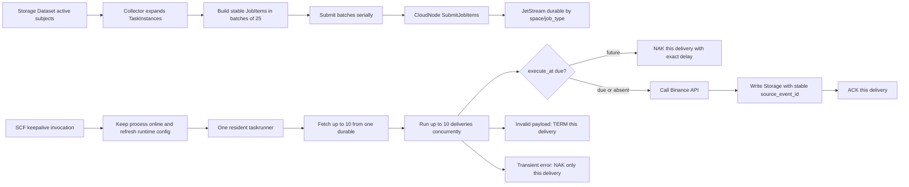

# Collector SCF JetStream 批量并发优化 Implementation Plan

> **For agentic workers:** REQUIRED SUB-SKILL: Use superpowers:subagent-driven-development (recommended) or superpowers:executing-plans to implement this plan task-by-task. Steps use checkbox (`- [ ]`) syntax for tracking.

**Goal:** 在不引入同步 SCF 调用、额外调度中心或高可靠基础设施的前提下，让 Collector 控制面按 Dataset 标的一次生成数百个 JobItem 并串行分批投递到 JetStream，常驻 SCF 每次 `Fetch(10)` 后并发执行最多 10 个采集任务，逐消息独立 ACK/NAK/TERM，并保证 Storage 重投幂等、Binance TLS 正常校验。

**Architecture:** 保留现有“Collector 规划、CloudNode 管队列、SCF 常驻消费、Storage 落库”的边界。已实测 keepalive 可严格保证 SCF 在线，因此把它作为确定前提：keepalive 只做进程保活、运行时配置更新和心跳，不触发、不拉取、不执行 JobItem。控制面按固定批次顺序调用 CloudNode，CloudNode 异步发布 JetStream；SCF 由一个常驻 taskrunner 在不同 JobType durable 之间按批次轮转，每次从一个 durable 拉取最多 10 条，并通过通用 JetStream Runner 的显式并发模式独立处理每条 delivery。

**Tech Stack:** Go 1.25、tRPC-Go、NATS JetStream、Tencent SCF、SQLite/GORM、Storage PrimaryStore/DataNode、Vue 3、Vitest、CLS。

---

## 1. 已确认前提与范围

### 1.1 以当前代码为实施基线

本计划基于提交 `adb4fb93` 后的当前实现。以下能力已经存在且方向合理，不重做：

- Collector 已从 Storage Dataset 读取 active subjects，并按 subject、interval 展开稳定 TaskInstance。
- `JobItem.execute_at` 已贯通 Collector、CloudNode、JetStream 和 CloudRuntime。
- JobItem 路由已经使用 `space_id + job_type`，多个 SCF 可竞争同一 durable。
- SCF 生产入口已经启动一个后台常驻 taskrunner；队列为空不会退出。
- 未来任务已经使用 `NakWithDelay(execute_at-now)`，不在 SCF 内维护 future queue。
- keepalive handler 与 taskrunner 入口已经分离。
- Kline 和 Symbol 均直接写 Storage，CloudNode 保存每个 JobItem 的独立状态。

本次不是推翻 Collector，而是补齐当前实现仍缺少的批量并发语义和几个会直接影响数据正确性的边界。

### 1.2 keepalive 的最终约束

已由项目实际环境验证：

> keepalive 可以严格保证 Tencent SCF 实例持续在线运行。

因此本计划不再设计 SCF 冷启动恢复、按任务唤醒、同步调用或额外 worker 守护系统。允许的依赖只有：

1. SCF 启动时常驻 taskrunner 等待第一次完整运行时配置就绪。
2. keepalive invocation 更新服务地址、NodeID、心跳和在线状态。
3. taskrunner 就绪后持续独立消费 JetStream，不等待后续 keepalive 才执行下一批任务。

明确禁止：

- `ScheduleTasks -> InvokeFunction` 或任何按 JobItem 激活 SCF 的链路。
- keepalive handler 调用 `Fetch`、`ExecuteTask`、`ExecuteJobItem`。
- 一次 SCF invocation 同步承载一个 JobItem。
- 为保活重新引入本地任务缓存、定时轮询或任务执行状态机。

### 1.3 简化原则

本计划主动不引入：

- 全局 exactly-once、Saga、分布式锁、租约服务。
- 通用 DLQ 管理平台、Schema Registry。
- 独立限流服务、自适应并发算法。
- SCF 自动扩缩容控制器或节点级任务分配。
- 为 Symbol/Kline 建立两套 worker 框架。

默认参数先固定为：

```yaml
job_worker:
  batch_size: 10
  concurrency: 10
  in_progress_interval: 30s
```

并发只由两个已有边界限制：

- 单 SCF、单批最多 10 个任务同时执行。
- 单 durable 的 `max_ack_pending: 32` 限制所有 SCF 合计未 ACK delivery 数。

## 2. 最终运行模型



### 2.1 一批 delivery 的处理规则

| delivery 状态 | handler 行为 | JetStream 动作 | 是否影响同批其他消息 |
|---|---|---|---|
| `execute_at` 缺失或已到期 | 立即采集并写 Storage | 成功 ACK | 不影响 |
| `execute_at` 在未来 | 不访问 Binance/Storage | `NAK(delay)` | 不影响 |
| 参数、身份或协议永久非法 | 不执行采集 | TERM | 不影响 |
| Binance/Storage 临时失败 | 返回 retryable error | `NAK(retryDelay)` | 不影响 |
| ACK/NAK/TERM 传输失败 | 本批完成后返回聚合错误，外层 runner 重建 | 动作错误写日志 | 已开始的消息均完成各自动作 |

并发模式下不得保留当前“某一条 RETRY 后，把本批剩余消息全部以同一 delay NAK”的顺序批语义。该语义只保留给 `Concurrency == 1` 的现有调用方。

### 2.2 期望容量

以 100 个 Kline JobItem 为例：

- Collector 通过 4 个串行 HTTP 请求提交：`25 + 25 + 25 + 25`。
- 单 SCF 每轮最多获取 10 条，并发执行 10 条。
- 10 条中即使 2 条未到期、1 条失败，其余 7 条仍正常执行并 ACK。
- 多个 SCF 共同绑定 durable 时，由 JetStream 竞争分配；不做 NodeID 定向。
- `MaxAckPending=32` 是该 durable 的全局在途上限，不把每个 SCF 的 10 简单无限放大。

## 3. 实施顺序

```text
Task 1  通用 JetStream Runner 增加独立并发批模式
  ↓
Task 2  Collector 真正 Fetch(10) 并启用批内并发
  ↓
Task 3  控制面改为串行分批投递
  ↓
Task 4  调整 delivery 心跳与重投预算
  ↓
Task 5  收紧 JobItem 身份并贯通 Storage 幂等键
  ↓
Task 6  简化规则参数和 Dataset 选择
  ↓
Task 7  恢复 Binance TLS 证书校验
  ↓
Task 8  跨模块并发、重投和数据链路 E2E
  ↓
Task 9  真实 SCF 验收、独立 CR、提交与推送
```

每个 Task 独立提交。后一个 Task 开始前，前一个 Task 的目标测试必须通过。

---

## Task 1: 为通用 JetStream Runner 增加独立并发批模式

**Files:**

- Modify: `packages/jetstream/runner.go`
- Modify: `packages/jetstream/runner_test.go`

- [ ] **Step 1: 先写并发度和默认兼容测试**

新增测试：

```go
func TestRunnerDefaultsConcurrencyToOne(t *testing.T)
func TestRunnerConcurrentBatchHonorsLimit(t *testing.T)
func TestRunnerConcurrentRetryDoesNotNakOtherDeliveries(t *testing.T)
func TestRunnerConcurrentBatchWaitsForAllStartedDeliveries(t *testing.T)
func TestRunnerConcurrentBatchAggregatesActionErrors(t *testing.T)
func TestRunnerConcurrentBatchRunsInProgressPerDelivery(t *testing.T)
```

`TestRunnerConcurrentBatchHonorsLimit` 使用 atomic 计数和 barrier：

```go
var active atomic.Int32
var maxActive atomic.Int32
release := make(chan struct{})

handler := DeliveryHandlerFunc(func(context.Context, *Delivery) HandlerResult {
    current := active.Add(1)
    updateMax(&maxActive, current)
    <-release
    active.Add(-1)
    return HandlerResult{Decision: ACK}
})
```

输入 10 条 delivery，配置 `BatchSize: 10, Concurrency: 3`，断言 `maxActive == 3`，而不是只断言总共处理 10 条。

运行：

```bash
(cd packages/jetstream && go test -count=1 ./... -run 'TestRunner(Default|Concurrent)')
```

Expected: `RunnerConfig` 尚无 `Concurrency`，测试先编译失败。

- [ ] **Step 2: 扩展 RunnerConfig，默认值保持串行**

```go
type RunnerConfig struct {
    BatchSize          int
    Concurrency        int
    InProgressInterval time.Duration
    ErrorReporter      ErrorReporter
    ActionReporter     ActionReporter
}

func normalizeRunnerConfig(cfg RunnerConfig) RunnerConfig {
    if cfg.BatchSize <= 0 {
        cfg.BatchSize = 1
    }
    if cfg.Concurrency <= 0 {
        cfg.Concurrency = 1
    }
    if cfg.Concurrency > cfg.BatchSize {
        cfg.Concurrency = cfg.BatchSize
    }
    return cfg
}
```

兼容约束：

- 所有未设置 `Concurrency` 的 Archive、Trade、Factor、Monitor 调用方继续使用 1。
- `Concurrency == 1` 保留当前 ordered batch 行为：遇到 RETRY 后把未开始的剩余 delivery 一并延期。
- `Concurrency > 1` 明确表示每条 delivery 可独立完成，不能再传播某一条的 delay。
- 更新 `ActionReporter` 注释，明确并发模式下可能被多个 goroutine 同时调用。

- [ ] **Step 3: 实现有界并发处理**

把批处理拆为两个方法：

```go
func (r *Runner) processSequentialBatch(
    ctx context.Context,
    deliveries []*Delivery,
) error

func (r *Runner) processConcurrentBatch(
    ctx context.Context,
    deliveries []*Delivery,
) error
```

并发实现使用固定数量 worker，而不是为无限输入创建 goroutine；本批 delivery 数本身不超过 `BatchSize`：

```go
jobs := make(chan *Delivery)
errs := make(chan error, len(deliveries))
var wg sync.WaitGroup

for i := 0; i < min(r.cfg.Concurrency, len(deliveries)); i++ {
    wg.Add(1)
    go func() {
        defer wg.Done()
        for delivery := range jobs {
            _, inProgressErr, actionErr := r.handle(ctx, delivery)
            errs <- errors.Join(inProgressErr, actionErr)
        }
    }()
}
```

发送 jobs 时若 `ctx.Done()` 已关闭，不再启动尚未分发的 delivery；已经进入 worker 的 delivery 等待 `handle` 返回。所有 worker 退出后聚合非空错误。

- [ ] **Step 4: 验证旧串行语义无回归**

```bash
(cd packages/jetstream && go test -count=1 ./...)
(cd packages/jetstream && go test -race -count=1 ./...)
(cd modules/archive && go test -count=1 ./internal/eventconsumer ./test)
(cd modules/factor && go test -count=1 ./internal/trigger/eventconsumer)
(cd modules/monitor && go test -count=1 ./internal/metrics/eventconsumer ./internal/hostmetrics/eventconsumer)
(cd modules/trade && go test -count=1 ./internal/eventconsumer)
```

Expected: 新并发测试通过；现有 `TestRunnerRetryStopsBatchAndNaksRemainingWithSameDelay` 继续通过。

- [ ] **Step 5: 提交**

```bash
git add packages/jetstream/runner.go packages/jetstream/runner_test.go
git commit -m "feat(jetstream): support independent concurrent batches"
```

---

## Task 2: 让 Collector 真正 Fetch(10) 并启用批内并发

**Files:**

- Modify: `modules/collector/internal/app/runtime/local_config.go`
- Add: `modules/collector/internal/app/runtime/local_config_test.go`
- Modify: `modules/collector/configs/config.yaml`
- Modify: `modules/collector/internal/taskrunner/direct.go`
- Modify: `modules/collector/internal/taskrunner/direct_test.go`
- Modify: `modules/collector/cmd/scf/main_test.go`
- Modify: `modules/collector/internal/serverless/handler_test.go`
- Modify: `scripts/build-collector-scf-package_test.sh`

- [ ] **Step 1: 先写 worker 配置和 Fetch 参数测试**

新增：

```go
func TestDefaultConfigUsesTenConcurrentJobWorkers(t *testing.T)
func TestLoadConfigsReadsJobWorkerConfig(t *testing.T)
func TestRoundRobinConsumerFetchesRequestedBatchAndRotates(t *testing.T)
func TestCollectorRunnerUsesConfiguredBatchConcurrency(t *testing.T)
```

`fakeQueueConsumer` 记录每次 `Fetch` 收到的 batch 参数。断言调用序列为：

```text
first.Fetch(10)
second.Fetch(10)
first.Fetch(10)
```

不能只检查返回数量。

- [ ] **Step 2: 增加单一、显式的 worker 配置**

```go
type JobWorkerConfig struct {
    BatchSize          int           `json:"batch_size" yaml:"batch_size"`
    Concurrency        int           `json:"concurrency" yaml:"concurrency"`
    InProgressInterval time.Duration `json:"in_progress_interval" yaml:"in_progress_interval"`
}
```

在 `AppConfig` 增加 `JobWorker *JobWorkerConfig`。默认值：

```go
JobWorker: &JobWorkerConfig{
    BatchSize:          10,
    Concurrency:        10,
    InProgressInterval: 30 * time.Second,
},
```

配置文件使用：

```yaml
job_worker:
  batch_size: 10
  concurrency: 10
  in_progress_interval: 30s
```

归一化规则：

- `batch_size <= 0` 使用 10。
- `concurrency <= 0` 使用 10。
- `concurrency > batch_size` 收敛到 `batch_size`。
- `in_progress_interval <= 0` 使用 30 秒。

不再复用含义模糊的 `event_bus.workers` 控制 JobItem 并发。

- [ ] **Step 3: 修正 roundRobinConsumer**

将：

```go
func (c *roundRobinConsumer) Fetch(ctx context.Context, _ int)
```

改为：

```go
func (c *roundRobinConsumer) Fetch(
    ctx context.Context,
    batch int,
) ([]*jetstream.Delivery, error) {
    if batch <= 0 {
        batch = 1
    }
    // 对当前 binding 调用 consumer.Fetch(ctx, batch)，拿到一批后将 next
    // 移到下一个 binding。空 binding 仍在本轮继续尝试。
}
```

继续保留“按批次轮转 JobType”的简单公平性：

- 一轮从 Kline durable 拉最多 10 条。
- 下一轮优先尝试 Symbol durable。
- 总并发仍由同一个 Runner 限制为 10，不为每个 JobType 各起 10 个并发池。

- [ ] **Step 4: 将配置传入 Runner**

```go
workerCfg := runtimeapp.GetJobWorkerConfig()
return jetstream.NewRunner(roundRobin, handler, jetstream.RunnerConfig{
    BatchSize:          workerCfg.BatchSize,
    Concurrency:        workerCfg.Concurrency,
    InProgressInterval: workerCfg.InProgressInterval,
    ErrorReporter:      ...,
    ActionReporter:     actionReporter,
}).Run(ctx)
```

每个 delivery 继续通过现有 `handleDelivery -> CloudRuntime.ExecuteJobItem` 执行；不得在 handler 内再创建第二层“JobItem 并发池”。Kline 单任务的分页请求仍串行，避免无界放大 Binance 请求量。

- [ ] **Step 5: 固化 keepalive 与执行解耦**

扩展现有测试，明确断言：

```go
func TestProductionRuntimeStartsResidentRunnerExactlyOnce(t *testing.T)
func TestRepeatedKeepaliveDoesNotStartTaskRunner(t *testing.T)
func TestKeepaliveDoesNotFetchOrExecuteJobItems(t *testing.T)
```

允许第一次 keepalive 完成运行时配置并解除 readiness；禁止每次 keepalive 重启 runner 或触发一次消费。

- [ ] **Step 6: 验证 SCF 包含新配置**

`scripts/build-collector-scf-package_test.sh` 解压 zip 后断言：

```text
config.yaml contains job_worker.batch_size: 10
config.yaml contains job_worker.concurrency: 10
config.yaml contains job_worker.in_progress_interval: 30s
```

运行：

```bash
(cd modules/collector && go test -count=1 ./internal/app/runtime ./internal/taskrunner ./cmd/scf ./internal/serverless)
bash scripts/build-collector-scf-package_test.sh
```

- [ ] **Step 7: 提交**

```bash
git add modules/collector/internal/app/runtime \
  modules/collector/configs/config.yaml \
  modules/collector/internal/taskrunner \
  modules/collector/cmd/scf \
  modules/collector/internal/serverless \
  scripts/build-collector-scf-package_test.sh
git commit -m "feat(collector): fetch and execute job batches concurrently"
```

---

## Task 3: 将控制面改为串行分批投递

**Files:**

- Modify: `modules/collector/internal/taskpublisher/client.go`
- Modify: `modules/collector/internal/taskpublisher/client_test.go`
- Modify: `modules/collector/internal/rpc/service.go`
- Modify: `modules/collector/internal/rpc/service_test.go`
- Modify: `scripts/check-collector-planned-node-removal.mjs`

- [ ] **Step 1: 先写严格串行和失败停止测试**

新增：

```go
func TestSubmitCollectorJobItemsSubmitsBatchesInInputOrder(t *testing.T)
func TestSubmitCollectorJobItemsNeverRunsTwoBatchesConcurrently(t *testing.T)
func TestSubmitCollectorJobItemsStopsAfterFirstFailedBatch(t *testing.T)
func TestScheduleTasksContinuesAfterOneRuleFails(t *testing.T)
```

使用 51 个实例，断言请求顺序和大小严格为：

```text
request 1: task-00..task-24, size 25
request 2: task-25..task-49, size 25
request 3: task-50, size 1
max concurrent HTTP requests: 1
```

第二批失败时：

- 返回第一批 25 个成功 ID。
- 不提交第三批。
- 返回错误包含 `batch 25-50`。
- 下次 `ScheduleTasks` 通过稳定 JobItemID 让第一批 deduplicate，并继续补发未成功批次。

- [ ] **Step 2: 删除发布端 errgroup 和 semaphore**

实现保持直接：

```go
idsByTaskID := make(map[string]string, len(jobItems))
for start := 0; start < len(jobItems); start += submitJobItemBatchSize {
    end := min(start+submitJobItemBatchSize, len(jobItems))
    ids, err := c.submitCollectorJobItemBatch(ctx, jobItems[start:end], start, end)
    maps.Copy(idsByTaskID, ids)
    if err != nil {
        return idsByTaskID, err
    }
}
return idsByTaskID, nil
```

删除 `submitJobItemConcurrency`、`sync.Mutex` 和 `errgroup`。发布端串行只保证控制面简单和请求顺序；任务执行并发由 SCF 消费端负责，两者不要混淆。

- [ ] **Step 3: ScheduleTasks 按规则继续并聚合错误**

规则之间保持串行。某条规则失败时记录错误并继续下一条，最后返回聚合错误：

```go
var scheduleErr error
for i := range rules {
    created, err := s.scheduleRule(ctx, &rules[i], now)
    if err != nil {
        scheduleErr = errors.Join(
            scheduleErr,
            fmt.Errorf("rule %s: %w", rules[i].RuleID, err),
        )
        continue
    }
    total += created
}
```

这样一个错误规则不会阻塞其后数百个有效标的，但不增加重试调度器。

- [ ] **Step 4: 增加静态边界检查**

扩展 `scripts/check-collector-planned-node-removal.mjs`，在以下控制面文件中拒绝同步 SCF 调用或 wake 概念：

```text
modules/collector/internal/taskpublisher/client.go
modules/collector/internal/rpc/service.go
```

拒绝符号：

```text
InvokeFunction
InvokeSync
WakeNode
ActivateSCF
```

不要扫描 serverless keepalive handler；keepalive 本身是被接受的生命周期机制。

- [ ] **Step 5: 运行测试并提交**

```bash
(cd modules/collector && go test -count=1 ./internal/taskpublisher ./internal/rpc)
node scripts/check-collector-planned-node-removal.mjs
git add modules/collector/internal/taskpublisher modules/collector/internal/rpc \
  scripts/check-collector-planned-node-removal.mjs
git commit -m "refactor(collector): submit cloud jobs in serial batches"
```

---

## Task 4: 调整 delivery 心跳和重投预算

**Files:**

- Modify: `modules/cloudnode/internal/config/config.go`
- Modify: `modules/cloudnode/internal/config/config_test.go`
- Modify: `modules/cloudnode/config/app.yaml`
- Modify: `modules/cloudnode/internal/jobqueue/jetstream_queue.go`
- Modify: `modules/cloudnode/internal/jobqueue/jetstream_queue_test.go`
- Modify: `modules/cloudnode/internal/jobqueue/jetstream_client_test.go`
- Modify: `modules/collector/internal/taskrunner/direct_test.go`

- [ ] **Step 1: 先写混合批和长任务测试**

新增真实 JetStream 测试：

```go
func TestDirectWorkerMixedBatchHandlesEachDeliveryIndependently(t *testing.T)
func TestDirectWorkerLongJobUsesInProgressWithoutRedelivery(t *testing.T)
```

同批 10 条中放入：

- 6 条已到期且成功。
- 1 条未来任务。
- 1 条永久非法参数。
- 1 条 retryable 执行错误。
- 1 条慢任务。

断言：

- 6 条成功和 1 条慢任务均执行并 ACK。
- 未来任务没有调用 executor，只 NAK 自己。
- 非法任务 TERM。
- retryable 任务只 NAK 自己。
- 每条 delivery 恰好产生自己的 action log。
- 慢任务运行超过一个 heartbeat 周期仍没有因 AckWait 重投。

- [ ] **Step 2: 保持 AckWait 和全局在途上限，MaxDeliver 调整为 4**

最终值：

```yaml
jetstream:
  max_deliver: 4
  max_ack_pending: 32
```

```go
const DefaultAckWait = 120 * time.Second
```

解释：

- 未来任务通常先消耗 1 次 delivery 用于延期。
- 剩余最多 3 次可用于真实执行和临时错误重投。
- 30 秒 `InProgress` 续期覆盖最长 100 秒 Collector workload，不需要把 AckWait 放大到数分钟。
- `MaxAckPending=32` 已足够容纳 3 个完整 10 条批次和少量余量；个人量化不增加动态容量算法。

- [ ] **Step 3: 更新 durable 配置测试**

断言 `EnsureJobExecutionQueue` 会把已存在 consumer 更新为：

```text
AckWait=120s
MaxDeliver=4
MaxAckPending=32
```

运行：

```bash
(cd modules/cloudnode && go test -count=1 ./internal/config ./internal/jobqueue)
(cd modules/collector && go test -count=1 ./internal/taskrunner)
```

- [ ] **Step 4: 提交**

```bash
git add modules/cloudnode/internal/config modules/cloudnode/config/app.yaml \
  modules/cloudnode/internal/jobqueue modules/collector/internal/taskrunner
git commit -m "fix(cloudjob): preserve execution retries after deferral"
```

---

## Task 5: 收紧 JobItem 身份并贯通 Storage 幂等键

**Files:**

- Modify: `modules/collector/internal/jobs/registry.go`
- Modify: `modules/collector/internal/jobs/registry_test.go`
- Modify: `modules/collector/internal/taskpublisher/client.go`
- Modify: `modules/collector/internal/taskpublisher/client_test.go`
- Modify: `modules/collector/internal/taskrunner/direct.go`
- Modify: `modules/collector/internal/taskrunner/direct_test.go`
- Modify: `modules/collector/internal/model/types.go`
- Modify: `modules/collector/internal/executor/executor.go`
- Modify: `modules/collector/internal/executor/executor_test.go`
- Modify: `modules/collector/internal/sources/interface.go`
- Modify: `modules/collector/internal/sources/binance/storage_rpc.go`
- Modify: `modules/collector/internal/sources/binance/storage_config_test.go`
- Modify: `modules/collector/internal/sources/binance/kline.go`
- Modify: `modules/collector/internal/sources/binance/api_config_test.go`
- Modify: `modules/collector/internal/sources/binance/symbol.go`
- Modify: `modules/collector/internal/sources/binance/symbol_test.go`

- [ ] **Step 1: 先写 envelope 权威性测试**

新增：

```go
func TestTaskEventUsesEnvelopeSpaceID(t *testing.T)
func TestTaskEventRejectsPayloadSpaceMismatch(t *testing.T)
func TestTaskEventDerivesDataTypeFromJobType(t *testing.T)
func TestTaskEventRejectsPayloadDataTypeMismatch(t *testing.T)
func TestBuildJobItemDerivesJobTypeFromInstanceDataType(t *testing.T)
```

权威字段：

| 字段 | 权威来源 |
|---|---|
| `space_id` | Event envelope / `nodeRuntime.JobItem.SpaceID` |
| `job_type` | Event payload，经 queue binding 验证 |
| `data_type` | jobs registry 根据 `job_type` 推导 |
| `job_item_id` | Event payload，经 CloudRuntime 传递 |
| `dataset_id`、`subject_id`、`symbol`、`interval` | 任务业务 params |

params 中若重复携带 `space_id` 或 `data_type`，必须与权威值一致，否则 TERM；不得静默接受跨空间或跨类型串写。

- [ ] **Step 2: jobs registry 增加反向查询**

```go
func JobDefinitionByJobType(jobType string) (JobDefinition, bool)
```

`buildJobItem` 使用 `TaskInstance.DataType -> JobDefinition.JobType`，不再从可篡改的 `TaskParams["job_type"]` 推断路由。

- [ ] **Step 3: 将 JobItemID 传到 source**

```go
type CollectParams struct {
    SpaceID    string
    DatasetID  string
    JobItemID  string
    InstType   string
    Symbol     string
    SubjectID  string
    Interval   string
    Live       bool
}
```

`TaskExecuteEvent -> collectTask -> sources.CollectParams` 全链路必须保留同一个 JobItemID。

- [ ] **Step 4: Storage writer 接受 source_event_id**

改为：

```go
type klineStorage interface {
    LatestTimeSeriesTime(context.Context, *storagepb.TimeSeriesKey) (time.Time, bool, error)
    UpsertFields(context.Context, string, []*storagepb.RowFieldUpsert) error
}

func (w *storageWriter) UpsertFields(
    ctx context.Context,
    sourceEventID string,
    rows []*storagepb.RowFieldUpsert,
) error {
    rsp, err := w.access.UpsertFields(ctx, &storagepb.PrimaryUpsertFieldsReq{
        AuthInfo:      w.authInfo,
        Rows:          rows,
        SourceEventId: sourceEventID,
    })
    // existing response handling
}
```

- [ ] **Step 5: 为每次 Storage 写入生成稳定且不冲突的事件 ID**

同一 JobItem 可能分页写多次，不能简单把所有页面都设成同一个 source event ID。新增纯函数：

```go
func storageSourceEventID(
    jobItemID string,
    rows []*storagepb.RowFieldUpsert,
) (string, error)
```

算法：

1. 校验 JobItemID 非空。
2. 提取每一行完整 RowKey：space、dataset、subject、freq、data_time。
3. 对 key 字符串排序。
4. 对 `jobItemID + NUL + sorted keys` 做 SHA-256。
5. 返回 `collector:` 加完整 hex digest。

必须覆盖：

```go
func TestStorageSourceEventIDSameJobAndRowsIsStable(t *testing.T)
func TestStorageSourceEventIDDifferentPagesDoNotCollide(t *testing.T)
func TestStorageWriterPassesSourceEventID(t *testing.T)
func TestKlineRedeliveryReusesSourceEventIDForSameRows(t *testing.T)
func TestSymbolBatchesUseDistinctStableSourceEventIDs(t *testing.T)
```

这只复用 Storage 已有 source-event 去重能力，不新增 Collector 去重表。

- [ ] **Step 6: 运行测试并提交**

```bash
(cd modules/collector && go test -count=1 ./internal/jobs ./internal/taskpublisher \
  ./internal/taskrunner ./internal/executor ./internal/sources/...)
(cd modules/storage && go test -count=1 ./internal/service/primarystore ./internal/service/datanode/...)
git add modules/collector/internal/jobs modules/collector/internal/taskpublisher \
  modules/collector/internal/taskrunner modules/collector/internal/model \
  modules/collector/internal/executor modules/collector/internal/sources
git commit -m "fix(collector): bind job identity to idempotent storage writes"
```

---

## Task 6: 简化规则参数和 Dataset 选择

**Files:**

- Modify: `modules/collector/internal/domain/collect_params.go`
- Modify: `modules/collector/internal/domain/collect_params_test.go`
- Modify: `modules/collector/internal/jobs/kline/definition.go`
- Modify: `modules/collector/internal/jobs/kline/handler_test.go`
- Modify: `modules/collector/internal/jobs/kline/planner.go`
- Modify: `modules/collector/internal/jobs/kline/params.go`
- Modify: `modules/collector/internal/jobs/symbol/planner.go`
- Modify: `modules/collector/internal/jobs/symbol/params.go`
- Modify: `modules/collector/internal/jobs/registry.go`
- Modify: `modules/collector/internal/jobs/registry_test.go`
- Modify: `modules/collector/internal/rpc/service.go`
- Modify: `modules/collector/internal/rpc/service_test.go`
- Modify: `modules/collector/internal/planner/task_builder_test.go`
- Modify: `web/src/views/collector/collector-rules/collector-rules.vue`
- Add: `web/src/views/collector/collector-rules/collector-rule-params.ts`
- Add: `web/src/views/collector/collector-rules/collector-rule-params.test.ts`
- Modify: `examples/e2e/verify.mjs`
- Modify: `examples/e2e/README.md`

- [ ] **Step 1: 定义唯一规则 JSON 契约**

新项目不保留旧字段兼容。最终形状：

```json
{
  "source": {
    "kind": "dataset_subjects",
    "dataset_id": "binance_spot_kline_1h"
  },
  "collector": {
    "exchange": "binance",
    "market": "spot",
    "data_type": "kline",
    "intervals": ["1h"],
    "live": false
  },
  "target": {
    "dataset_id": "binance_spot_kline_1h"
  },
  "schedule": {
    "interval": "1h"
  }
}
```

直接删除：

- `target.job_type`：由 jobs registry 决定。
- `schedule.timezone`：当前 next-boundary 算法不读取它，统一 UTC。
- `schedule.intervals`：只保留 `collector.intervals`。
- `objects`：Dataset active membership 已经是任务全集；需要子集时创建一个更小 Dataset，不维护第二套标的过滤语义。
- task params 中的 `schedule_timezone` 和 `job_type`。

- [ ] **Step 2: DatasetID 不再按字符串猜测**

删除 `inferDatasetID` 和前端 `inferCollectDatasetId`。规则创建时明确要求：

- Kline：`source.dataset_id` 和 `target.dataset_id` 均非空；个人量化默认在 UI 中选择同一个 Dataset。
- Symbol：`source.kind=none`，`target.dataset_id` 非空。

这会直接消除 `binance_spot_symbol` 与实际 `binance_spot_symbols` 的默认命名不一致，不需要维护类型到 Dataset 的魔法映射。

- [ ] **Step 3: Create/Update 时按 jobs registry 完整校验**

在写 DB 前完成：

```go
params, err := domain.ParseCollectParams(...)
definition, ok := jobs.JobDefinitionFor(params)
if !ok {
    return fmt.Errorf(
        "unsupported collector: exchange=%s market=%s data_type=%s",
        params.Collector.Exchange,
        params.Collector.Market,
        params.Collector.DataType,
    )
}
if !definition.AcceptsSourceKind(params.Source.Kind) {
    return fmt.Errorf("source kind %q is invalid for %s", ...)
}
```

验证 intervals 非空、DatasetID 非空、schedule interval 可被 `time.ParseDuration` 接受。非法规则不得等到 `ScheduleTasks` 才失败。

- [ ] **Step 4: 简化前端规则表单**

`collector-rule-params.ts` 只负责：

```ts
export type CollectorRuleInput = {
  dataType: "kline" | "symbol";
  exchange: "binance";
  market: "spot" | "swap";
  datasetId: string;
  intervals: string[];
  scheduleInterval: string;
};

export function buildCollectorRuleParams(input: CollectorRuleInput): Record<string, unknown>
```

在 `collector-rules.vue`：

- 使用现有 Storage metadata API 加载当前 Space 的 active datasets。
- 增加必选 Dataset 下拉框。
- 移除 objects 输入、通配符和对应状态。
- Kline 与 Symbol 统一使用一个产品类型/market 控件，删除未被后端定义采用的 `inst_types` 分支。
- Kline 显示 interval 多选；Symbol 不显示 interval。
- 增加必填采集频率控件并写入 `schedule.interval`，不再静默固定为 30 分钟。
- 编辑时严格解析新结构，不读取已删除字段。

Vitest 覆盖 Kline、Symbol、缺失 Dataset、切换市场四种构造结果。

- [ ] **Step 5: 更新 E2E 请求**

`examples/e2e/verify.mjs` 和 README 只使用新形状，不再发送 `job_type`、`timezone`、重复 intervals。

- [ ] **Step 6: 运行测试并提交**

```bash
(cd modules/collector && go test -count=1 ./internal/domain ./internal/jobs/... \
  ./internal/rpc ./internal/planner)
(cd web && pnpm test -- src/views/collector/collector-rules/collector-rule-params.test.ts)
(cd web && pnpm exec vue-tsc --noEmit)
git add modules/collector/internal/domain modules/collector/internal/jobs \
  modules/collector/internal/rpc modules/collector/internal/planner \
  web/src/views/collector/collector-rules examples/e2e
git commit -m "refactor(collector): simplify dataset driven rule contracts"
```

---

## Task 7: 恢复 Binance TLS 证书校验

**Files:**

- Modify: `modules/collector/internal/httpclient/client.go`
- Modify: `modules/collector/internal/httpclient/client_test.go`
- Modify: `modules/collector/internal/httpclient/probe.go`
- Add: `modules/collector/internal/httpclient/probe_test.go`

- [ ] **Step 1: 先写证书校验测试**

新增：

```go
func TestNewHTTPClientEnablesTLSVerification(t *testing.T)
func TestGetWithIPValidatesCertificateForDomain(t *testing.T)
func TestGetWithIPRejectsUntrustedCertificate(t *testing.T)
func TestProbeHTTPSRejectsCertificateForWrongDomain(t *testing.T)
```

测试必须覆盖“URL 仍使用域名、DialContext 只替换目标 IP”的真实方式。不能只断言字段值。

- [ ] **Step 2: 使用系统根证书，不要求 Binance 专用证书配置**

普通 client：

```go
transport := http.DefaultTransport.(*http.Transport).Clone()
transport.TLSClientConfig = &tls.Config{
    MinVersion: tls.VersionTLS12,
}
```

`RootCAs == nil` 表示使用 SCF 运行时系统 CA。访问 Binance 公网证书不需要项目配置客户端证书，也不需要把 Binance 证书打进 SCF 包。

指定 IP 时继续构造：

```text
URL:         https://api.binance.com/...
Dial target: selected-ip:443
TLS SNI:     api.binance.com
Verify name: api.binance.com
```

不要把 URL 改成 IP。`http.Transport` 会根据请求 URL host 设置 SNI 和主机名校验；probe 中显式设置 `ServerName: domain` 以让意图清晰。

- [ ] **Step 3: 删除两个 InsecureSkipVerify**

以下两处均不得残留：

```text
modules/collector/internal/httpclient/client.go
modules/collector/internal/httpclient/probe.go
```

增加静态断言：

```bash
! rg -n 'InsecureSkipVerify:\s*true' modules/collector/internal/httpclient
```

- [ ] **Step 4: 运行测试并提交**

```bash
(cd modules/collector && go test -count=1 ./internal/httpclient)
(cd modules/collector && go test -race -count=1 ./internal/httpclient)
git add modules/collector/internal/httpclient
git commit -m "fix(collector): verify Binance TLS certificates"
```

---

## Task 8: 增加跨模块批量并发 E2E

**Files:**

- Add: `modules/collector/test/jetstream_batch_e2e_test.go`
- Add: `modules/collector/test/storage_redelivery_e2e_test.go`
- Modify: `examples/e2e/verify.mjs`
- Modify: `examples/e2e/verify-status.test.mjs`
- Modify: `examples/e2e/run.sh`
- Modify: `examples/e2e/run-real-scf.sh`
- Modify: `examples/e2e/test-run-real-scf.sh`
- Modify: `examples/e2e/README.md`

- [ ] **Step 1: 建立 100 条任务的本地 JetStream E2E**

`jetstream_batch_e2e_test.go` 使用 testkit NATS、真实 events registry 和 Collector taskrunner adapter：

1. 创建 100 个稳定 JobItem。
2. 以 25 条一批串行提交。
3. consumer 使用 `BatchSize=10, Concurrency=10`。
4. fake workload 用 barrier 记录最大并发。
5. 等待全部 delivery 得到动作。

硬性断言：

```text
submitted batches: [25, 25, 25, 25]
fetch batch arguments: all 10
max active handlers: 10
ACK count: 100
NAK count: 0
TERM count: 0
duplicate handler starts: 0
```

- [ ] **Step 2: 增加 mixed batch E2E**

同一 Fetch 返回 due、future、retryable、invalid 四类消息，断言各自动作。未来消息第二次 delivery 到期后执行，且第一轮不阻塞 due 消息。

- [ ] **Step 3: 增加 Storage 重投幂等 E2E**

模拟：

1. Kline Storage 写入成功。
2. 第一次 ACK 失败，delivery 重投。
3. 同一批 rows 再次写入。

断言：

- 最终行值正确。
- source-event outbox 只产生一次对应事件。
- JobItem 第二次处理使用相同 source event ID。
- 不要求 Collector 自己维护去重状态。

- [ ] **Step 4: 扩展现有端到端脚本**

`examples/e2e/verify.mjs` 增加 batch acceptance state：

```json
{
  "batch_job_item_ids": ["..."],
  "expected_batch_size": 10,
  "expected_concurrency": 10
}
```

`run.sh` 本地 resident 路径至少提交 20 条立即任务，验证全部终态和 Storage rows。`run-real-scf.sh` 继续只使用已经发布的真实 SCF，不启动本地 SCF。

- [ ] **Step 5: 运行跨模块验证**

```bash
(cd packages/jetstream && go test -race -count=1 ./...)
(cd modules/cloudnode && go test -race -count=1 ./internal/config ./internal/jobqueue ./internal/jobstate ./internal/rpc)
(cd packages/cloudruntime && go test -race -count=1 ./...)
(cd modules/collector && go test -race -count=1 ./...)
(cd modules/storage && go test -race -count=1 ./internal/service/primarystore ./internal/service/datanode/...)
node --test examples/e2e/verify-status.test.mjs
bash examples/e2e/test-run-scf-resident.sh
bash examples/e2e/test-run-real-scf.sh
bash scripts/test-go-workspace.sh
make verify-pr
```

Expected: 全部通过；任何 race、提前执行、整批共同 NAK 或重复 source event 都必须在进入 Task 9 前修复。

- [ ] **Step 6: 提交**

```bash
git add modules/collector/test examples/e2e
git commit -m "test(collector): cover concurrent JetStream job batches"
```

---

## Task 9: 真实 SCF 验收、独立 CR、提交与推送

**Files:**

- Modify if required by acceptance: `scripts/build-collector-scf-package.sh`
- Modify if required by acceptance: `examples/e2e/run-real-scf.sh`
- Modify if required by acceptance: `examples/e2e/verify.mjs`
- Modify: `docs/superpowers/plans/2026-07-27-collector-scf-jetstream-batch-concurrency.md`

- [ ] **Step 1: 构建并发布新的 SCF 包**

```bash
make -C modules/collector package-scf
```

确认 zip 中包含：

```text
main
config.yaml with batch_size=10, concurrency=10, in_progress_interval=30s
EventBus CA and worker credential loading support
```

通过现有 CloudNode 发布链路更新真实 Tencent SCF 节点。记录 code package ID 和函数版本。

- [ ] **Step 2: 验证 keepalive 前提仍成立**

在不投递 JobItem 的情况下连续观察至少两个 keepalive 周期：

- SCF 节点持续 online。
- resident taskrunner 进程未重启。
- keepalive invocation 日志只包含配置更新、probe、heartbeat。
- 没有 `collector_job_started`。

随后停止控制面 Schedule timer 但保留 keepalive，手工投递立即 JobItem；任务仍应被后台 taskrunner 消费。该用例直接证明 keepalive 不负责触发任务。

- [ ] **Step 3: 真实批量并发验收**

使用至少 20 个 active DatasetSubject：

```bash
MOOX_E2E_TIMEOUT_SECONDS=300 \
  bash examples/e2e/run-real-scf.sh \
  --space crypto \
  --dataset binance_spot_kline_1h
```

验收：

- 控制面无任何同步 SCF invoke。
- JetStream consumer 可看到单次 pull 最大 10。
- CLS 中至少出现一组 10 个不同 JobItem 的 `collector_job_started`，且它们在该组首个 `collector_job_completed` 之前均已开始。
- 未来任务在 `execute_at` 前只有 `collector_job_deferred` 和 RETRY action。
- 每个终态 JobItem 有且只有一个最终 ACK/TERM。
- Storage 目标 Dataset、subject、freq、watermark 正确。
- keepalive 日志与 JobItem 生命周期日志使用不同 event 字段，可独立查询。

CLS 查询字段至少包含：

```text
event
space_id
job_item_id
job_type
node_id
delivery_count
execute_at
decision
dataset_id
subject_id
interval
```

- [ ] **Step 4: 运行 codeCR 独立审查**

按全局约定使用 `codeCR` subAgent 审查最终 diff，要求重点核查：

1. Runner 并发下 ACK/NAK/TERM 和 cancellation 是否有 race。
2. `Concurrency==1` 的已有模块是否行为回归。
3. keepalive 是否重新耦合任务执行。
4. 同一批 mixed delivery 是否真正独立。
5. Storage source event ID 是否会跨页面冲突。
6. TLS 是否仍有跳过校验路径。
7. E2E 是否实际覆盖 `Fetch(10)` 和最大并发 10，而非只看最终成功数。

所有 actionable finding 修复后重新运行 Task 8 的完整验证集。

- [ ] **Step 5: 更新计划勾选状态并检查文档**

```bash
rg -n '\- \[ \]' docs/superpowers/plans/2026-07-27-collector-scf-jetstream-batch-concurrency.md
rg -n 'TODO|TBD|placeholder|similar file|appropriate file' \
  docs/superpowers/plans/2026-07-27-collector-scf-jetstream-batch-concurrency.md \
  | rg -v "rg -n 'TODO"
git diff --check
```

Expected:

- 第一条无输出。
- 第二条无输出。
- `git diff --check` 无输出。

- [ ] **Step 6: 最终提交并推送**

```bash
git add docs/superpowers/plans/2026-07-27-collector-scf-jetstream-batch-concurrency.md
git commit -m "docs: complete collector SCF batch concurrency plan"
git push origin feature/mooyang
```

核验：

```bash
git status --short
git rev-parse HEAD
git ls-remote --heads origin feature/mooyang
```

本地 HEAD 与远端 SHA 必须一致；不得把实施前已经存在的无关 worktree 修改混入提交。

---

## 4. 最终验收矩阵

| 场景 | 输入 | 预期 |
|---|---|---|
| 控制面大批量 | 100 个 Dataset subjects | 4 个串行 25 条请求，无同步 SCF invoke |
| 单 SCF 消费 | 100 个 due JobItem | 每次 Fetch 参数为 10，最大并发为 10 |
| 多 SCF 消费 | 多个常驻 SCF 绑定同 durable | 竞争消费，无节点定向，未 ACK 总数不超过 32 |
| 混合时间 | 同批 due + future | due 立即执行，future 单独 NAK，不整批延期 |
| 永久非法 | space/job_type/data_type 不一致 | 只 TERM 当前 delivery |
| 临时失败 | Binance 或 Storage 临时错误 | 只 NAK 当前 delivery |
| 长任务 | 单任务超过 30 秒 | 周期 InProgress，无 AckWait 重投 |
| ACK 丢失 | Storage 成功后 ACK 失败 | 重投后 rows 正确，source event 不重复 |
| TLS 正常 | 域名 URL + 优选 IP Dial | 系统 CA、SNI 和域名校验均生效 |
| TLS 异常 | 不受信或错误域名证书 | 请求失败，不降级为跳过校验 |
| keepalive | 连续 invocation | SCF 常驻且 runner 不重启，不执行任务 |
| 无 schedule timer | keepalive 正常、手工投递任务 | 常驻 runner 仍能执行，证明触发链路解耦 |

## 5. 完成定义

只有同时满足以下条件才算完成：

- 控制面串行分批发布，SCF 端 `Fetch(10)` 后并发执行 10 条。
- 并发批中每条 delivery 独立决定 ACK、NAK、TERM。
- keepalive 仍严格保活，但不包含任务执行逻辑。
- Storage 重投使用稳定且分页不冲突的 source event ID。
- Binance 客户端使用系统 CA 和域名校验，不需要业务证书配置。
- 规则明确选择 Dataset，不再猜 Dataset 名或保存无运行时读者的字段。
- package、Collector、CloudNode、Storage race 测试和 workspace 验证全部通过。
- 本地 JetStream E2E 和真实 Tencent SCF E2E 都通过。
- codeCR 独立审查无未处理的 actionable finding。
- 最终提交已推送，远端分支 SHA 与本地 HEAD 一致。
