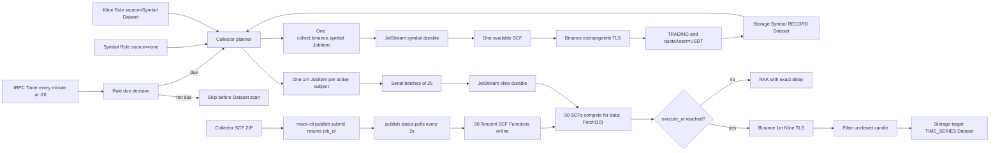

# Collector Symbol 到 1 分钟 Kline 真实 SCF E2E Implementation Plan

> **For agentic workers:** REQUIRED SUB-SKILL: Use superpowers:subagent-driven-development (recommended) or superpowers:executing-plans to implement this plan task-by-task. Steps use checkbox (`- [ ]`) syntax for tracking.

**Goal:** 建立可重复执行的真实 E2E：Collector 每分钟第 20 秒按 Rule 周期生成任务，SCF 抓取 Binance 所有 `TRADING` 状态的 USDT 现货交易对写入 Symbol Dataset，再由 Collector 基于该 Dataset 生成 1 分钟 Kline JobItem，经 JetStream 交给 50 个 Tencent SCF 竞争消费并写入目标 Storage Dataset。

**Architecture:** Collector 是唯一任务规划方，Rule 的 `schedule.interval` 决定是否在本次分钟 Tick 生成任务，JobItem 的 `execute_at` 固定为下一个对齐周期边界。Symbol Dataset 是 `RECORD` 类型的标的全集输入，Kline Dataset 是 `TIME_SERIES` 类型的采集输出；SCF 只从 JobItem 获取业务作用域，从 keepalive 事件获取 Storage/Gateway 运行时地址，从部署环境获取 EventBus、CA 和密钥。

**Tech Stack:** Go 1.25、tRPC-Go Timer、NATS JetStream、Tencent SCF、Binance Spot REST API、Storage Metadata/PrimaryStore、SQLite/GORM、Node.js E2E、CLS。

---

## 1. 已确认范围

### 1.1 业务口径

本计划中的“Binance 全市场现货标的”固定表示：

```text
exchange = binance
market = spot
status = TRADING
quote_asset = USDT
```

不采集 BTC、FDUSD、USDC 等其他报价资产，也不采集合约标的。

目标 Dataset：

| Dataset | DataKind | 内容 | Rule 周期 |
| --- | --- | --- | --- |
| `e2e_binance_symbols` | `RECORD` | 所有 active USDT 现货交易对及 Binance external symbol | E2E 使用 `1m`，生产建议 `1h` |
| `e2e_binance_kline_1m` | `TIME_SERIES` | 上述 active subjects 的已闭合 1 分钟 Kline | `1m` |

E2E Dataset ID 允许加 run suffix，但最终长度必须满足 Storage 的 30 字符限制。

### 1.2 调度语义

Collector 只有一个全局 tRPC Timer：

```text
每分钟第 20 秒触发一次
```

Timer 本身不表达某条 Rule 的业务周期。每条 Rule 的：

```json
{"schedule":{"interval":"1m"}}
```

才表示任务生成周期。

调度统一使用 UTC 固定周期，并在下一个分钟边界执行：

| 当前 Tick | Rule 周期 | 是否生成 | `execute_at` |
| --- | --- | --- | --- |
| `12:34:20Z` | `1m` | 是 | `12:35:00Z` |
| `12:34:20Z` | `1h` | 否 | - |
| `12:59:20Z` | `1h` | 是 | `13:00:00Z` |
| `15:59:20Z` | `4h` | 是 | `16:00:00Z` |
| `23:59:20Z` | `1d` | 是 | 次日 `00:00:00Z` |

第一版只接受能够对齐分钟边界的固定周期：

```text
1m、5m、15m、30m、1h、2h、4h、6h、12h、1d
```

实现可以接受其他“大于等于 1 分钟且为整分钟”的 Go duration；不增加 Cron、时区、任意 phase offset、漏跑补偿或分布式调度锁。

### 1.3 参数归属

| 参数 | 唯一归属 | 说明 |
| --- | --- | --- |
| `space_id`、目标 `dataset_id`、`subject_id`、`symbol`、`market`、`interval`、`execute_at` | JobItem | 单次采集任务的业务作用域 |
| Storage tRPC target、Service Gateway target、`node_id` | CloudNode keepalive 事件 | 会随部署拓扑变化，不写入 MQ |
| EventBus URL、CA、JobTypes、package ID、Gateway HMAC、CLS 配置 | SCF 部署环境 | worker 建连前必须存在 |
| Storage AuthInfo 的密钥材料 | 部署 Secret/打包期派生配置 | 不进入 JobItem、心跳或日志 |

禁止给 JobItem 增加 `storage_target`、`storage_ip_port`、`service_gateway` 或任何密钥字段。

### 1.4 50 SCF 的验收口径

SCF 发布能力不是本计划的实现范围。本计划直接假设
`docs/superpowers/plans/2026-07-27-cloudnode-async-scf-publish.md`
已经完整实现并通过验收，只把 `moox-cli` 当作发布入口。

50 个节点表示 50 个独立 Tencent SCF Function，使用相同：

```text
MOOX_SPACE_ID
collect.binance.symbol JobType
collect.binance.kline JobType
```

durable identity 只由 `space_id + job_type` 决定，与 package ID 无关。50 个节点必须部署同一个已验收 package 版本，但它们因为 Space 和 JobType 相同而竞争同一个 durable，不复制任务。当前每个 JobType 的 `MaxAckPending=32`，因此本次验收：

- E2E 只调用 `moox-cli collector function publish submit --node-count 50` 提交发布，并读取返回的 `job_id`。
- E2E 只调用 `moox-cli collector function publish status --job-id <id>` 轮询真实发布进度。
- 所有 SCF 发布实现细节均以 CloudNode 前置计划为准，本计划不再展开。
- 要求 50 个节点全部部署成功、online、心跳新鲜、package ID 正确。
- 要求所有 Kline JobItem 的 `execution_node` 属于这 50 个节点。
- 统计并输出每个节点的任务数，但不要求均匀分配。
- 不要求 50 个节点都实际获得任务。
- 不为了让 50 个节点同时繁忙而提高 `MaxAckPending`。
- 50 个节点在验收后保留；本计划不通过 E2E runner 自动删除真实云函数。

### 1.5 明确不做

- 不让 Symbol SCF 直接生成 Kline JobItem。
- 不让 E2E 脚本直接拼装业务 Kline JobItem。
- 不增加 Symbol 完成事件、DAG、工作流引擎或调度回调。
- 不同步调用 SCF，不按 NodeID 分配任务。
- 不把 Kline target Dataset 静态写入 Binance source YAML。
- 不要求 exactly-once；依赖稳定 JobItem ID、JetStream 重投和 Storage RowKey 幂等。
- 不把 50 节点作为个人量化的默认长期容量。

---

## 2. 当前实现与阻断点

以下能力已完成，本计划不重做：

- SCF 常驻 taskrunner 直接绑定 JetStream durable。
- `Fetch(10)` 后使用 `trpc.GoAndWait` 并发处理一批 delivery。
- Collector 按 25 条一批串行提交 CloudNode。
- Binance/Storage 临时失败在 JobItem deadline 内本地重试 3 次。
- Binance TLS 使用系统根证书校验。
- future JobItem 使用 `NakWithDelay(execute_at-now)`。
- JobItem、TaskInstance 和 Storage 写入证据已进入现有 E2E。

当前存在四个与本次 E2E 直接相关的差距：

1. tRPC Timer 当前在每分钟第 0 秒触发，而不是第 20 秒。
2. `ScheduleTasks` 每分钟处理所有 enabled Rule，未在读取 Dataset subjects 前判断本轮是否到期。
3. Kline source Dataset 被错误地强制为 `TIME_SERIES`，无法读取 Symbol `RECORD` Dataset。
4. Symbol Collector 会把标的绑定到 YAML 的静态 `subject_dataset_ids`，隔离 E2E Dataset 可能因静态 Dataset 不存在而整批失败。
现有 `examples/e2e/verify.mjs` 只覆盖预置 Kline Dataset 和手工注册的 BTC-USDT，不覆盖：

```text
创建 Dataset
  -> 全市场 Symbol Job
  -> Symbol Dataset
  -> Collector 展开全部 1m Kline JobItem
  -> 50 个真实 SCF
  -> Storage 1m Kline
```

---

## 3. 最终调用链



Symbol 和 Kline Rule 的标准配置：

```json
{
  "symbol_rule": {
    "source": {"kind": "none"},
    "collector": {
      "exchange": "binance",
      "market": "spot",
      "data_type": "symbol"
    },
    "target": {"dataset_id": "e2e_binance_symbols"},
    "schedule": {"interval": "1m"}
  },
  "kline_rule": {
    "source": {
      "kind": "dataset_subjects",
      "dataset_id": "e2e_binance_symbols"
    },
    "collector": {
      "exchange": "binance",
      "market": "spot",
      "data_type": "kline",
      "intervals": ["1m"]
    },
    "target": {"dataset_id": "e2e_binance_kline_1m"},
    "schedule": {"interval": "1m"}
  }
}
```

---

## 4. 文件变更地图

### 调度

- Create: `modules/collector/internal/domain/schedule.go`
- Create: `modules/collector/internal/domain/schedule_test.go`
- Modify: `modules/collector/internal/domain/collect_params.go`
- Modify: `modules/collector/internal/domain/collect_params_test.go`
- Modify: `modules/collector/internal/rpc/service.go`
- Modify: `modules/collector/internal/rpc/service_test.go`
- Modify: `modules/collector/internal/taskpublisher/client.go`
- Modify: `modules/collector/internal/taskpublisher/client_test.go`
- Modify: `modules/collector/internal/store/task_instance.go`
- Modify: `modules/collector/internal/store/task_instance_test.go`
- Modify: `modules/collector/config/trpc_go.yaml`
- Modify: `modules/collector/configs/example_trpc_go.yaml`

### Dataset 与 Symbol 绑定

- Modify: `modules/collector/internal/rpc/service.go`
- Modify: `modules/collector/internal/rpc/service_test.go`
- Modify: `modules/collector/internal/sources/binance/storage_config.go`
- Modify: `modules/collector/internal/sources/binance/storage_config_test.go`
- Modify: `modules/collector/internal/sources/binance/symbol.go`
- Modify: `modules/collector/internal/sources/binance/symbol_test.go`
- Modify: `modules/collector/configs/sources/market/binance.yaml`

### E2E 与文档

- Create: `examples/e2e/collector-symbol-kline.mjs`
- Create: `examples/e2e/collector-symbol-kline.test.mjs`
- Create: `examples/e2e/run-real-symbol-kline-scf.sh`
- Create: `examples/e2e/test-run-real-symbol-kline-scf.sh`
- Modify: `modules/collector/internal/httpclient/client.go`
- Modify: `modules/collector/internal/httpclient/client_test.go`
- Modify: `examples/e2e/README.md`
- Modify: `modules/collector/README.md`
- Modify: `docs/采集任务管理.md`

本计划假设以下前置计划已经完成，只说明如何通过 `moox-cli` 发布并验收 SCF，不展开 CloudNode、前端或 CLI 的内部实现：

```text
docs/superpowers/plans/2026-07-27-cloudnode-async-scf-publish.md
```

不修改 Storage protobuf；当前 Metadata 和 PrimaryStore RPC 已足够完成 Dataset 注册、激活、读取和写入验收。

---

## Task 1: 实现固定 UTC 周期判断并把 Timer 调整到每分钟第 20 秒

**Files:**

- Create: `modules/collector/internal/domain/schedule.go`
- Create: `modules/collector/internal/domain/schedule_test.go`
- Modify: `modules/collector/internal/domain/collect_params.go`
- Modify: `modules/collector/internal/domain/collect_params_test.go`
- Modify: `modules/collector/config/trpc_go.yaml`
- Modify: `modules/collector/configs/example_trpc_go.yaml`

- [x] **Step 1: 先写周期解析和 due decision 的失败测试**

新增表驱动测试：

```go
func TestScheduleDecisionUsesNextMinuteBoundary(t *testing.T) {
    tests := []struct {
        name       string
        now        string
        interval   string
        wantDue    bool
        wantWindow string
    }{
        {"one_minute", "2026-07-27T12:34:20Z", "1m", true, "2026-07-27T12:35:00Z"},
        {"hour_not_due", "2026-07-27T12:34:20Z", "1h", false, ""},
        {"hour_due", "2026-07-27T12:59:20Z", "1h", true, "2026-07-27T13:00:00Z"},
        {"four_hour_due", "2026-07-27T15:59:20Z", "4h", true, "2026-07-27T16:00:00Z"},
        {"day_due", "2026-07-27T23:59:20Z", "1d", true, "2026-07-28T00:00:00Z"},
    }
    for _, test := range tests {
        t.Run(test.name, func(t *testing.T) {
            now, err := time.Parse(time.RFC3339, test.now)
            require.NoError(t, err)
            executeAt, due, err := ScheduleDecision(now, test.interval)
            require.NoError(t, err)
            assert.Equal(t, test.wantDue, due)
            if test.wantWindow == "" {
                assert.True(t, executeAt.IsZero())
                return
            }
            assert.Equal(t, test.wantWindow, executeAt.Format(time.RFC3339))
        })
    }
}

func TestParseScheduleIntervalRejectsSubMinuteAndFractionalMinute(t *testing.T) {
    for _, value := range []string{"", "0s", "30s", "90s", "-1m", "bad"} {
        _, err := ParseScheduleInterval(value)
        require.Error(t, err, value)
    }
}
```

运行：

```bash
(cd modules/collector && go test -count=1 ./internal/domain -run 'TestSchedule')
```

Expected: `ParseScheduleInterval` 和 `ScheduleDecision` 尚不存在，测试编译失败。

- [x] **Step 2: 在 domain 中实现唯一的周期解析和对齐规则**

新增：

```go
func ParseScheduleInterval(raw string) (time.Duration, error) {
    raw = strings.TrimSpace(raw)
    if strings.HasSuffix(raw, "d") {
        daysText := strings.TrimSuffix(raw, "d")
        if daysText == "" {
            daysText = "1"
        }
        days, err := strconv.Atoi(daysText)
        if err != nil || days <= 0 {
            return 0, fmt.Errorf("schedule.interval must be a positive whole-minute duration")
        }
        return time.Duration(days) * 24 * time.Hour, nil
    }
    duration, err := time.ParseDuration(raw)
    if err != nil || duration < time.Minute || duration%time.Minute != 0 {
        return 0, fmt.Errorf("schedule.interval must be a positive whole-minute duration")
    }
    return duration, nil
}

func ScheduleDecision(now time.Time, raw string) (time.Time, bool, error) {
    duration, err := ParseScheduleInterval(raw)
    if err != nil {
        return time.Time{}, false, err
    }
    candidate := now.UTC().Truncate(time.Minute).Add(time.Minute)
    due := candidate.UnixNano()%duration.Nanoseconds() == 0
    if !due {
        return time.Time{}, false, nil
    }
    return candidate, true, nil
}
```

`CollectParams.Validate` 必须调用同一个 `ParseScheduleInterval`，删除直接使用 `time.ParseDuration` 的重复校验。`30s` 从此作为非法配置拒绝，不保留兼容分支。

- [x] **Step 3: 将 tRPC Timer 固定到第 20 秒**

两个配置都使用：

```yaml
network: "20 */1 * * * *?scheduler=collectorSchedule"
protocol: timer
timeout: 60000
```

不增加第二个 Collector schedule timer。

- [x] **Step 4: 验证周期和配置**

```bash
(cd modules/collector && go test -count=1 ./internal/domain)
rg -n 'network: "20 \*/1 \* \* \* \*\?scheduler=collectorSchedule"' \
  modules/collector/config/trpc_go.yaml \
  modules/collector/configs/example_trpc_go.yaml
```

Expected: domain 测试通过；两个配置各命中一次。

- [x] **Step 5: 提交**

```bash
git add \
  modules/collector/internal/domain/schedule.go \
  modules/collector/internal/domain/schedule_test.go \
  modules/collector/internal/domain/collect_params.go \
  modules/collector/internal/domain/collect_params_test.go \
  modules/collector/config/trpc_go.yaml \
  modules/collector/configs/example_trpc_go.yaml
git commit -m "feat(collector): align rule scheduling to minute boundaries"
```

---

## Task 2: 只在 Rule 到期时读取 Dataset 和生成下一周期任务

**Files:**

- Modify: `modules/collector/internal/rpc/service.go`
- Modify: `modules/collector/internal/rpc/service_test.go`
- Modify: `modules/collector/internal/taskpublisher/client.go`
- Modify: `modules/collector/internal/taskpublisher/client_test.go`
- Modify: `modules/collector/internal/store/task_instance.go`
- Modify: `modules/collector/internal/store/task_instance_test.go`

- [x] **Step 1: 先写未到期 Rule 不访问 Dataset、不提交任务的测试**

为 fake dataset source 增加调用计数，并新增：

```go
func TestScheduleTasksSkipsRuleBeforeDatasetScanWhenNotDue(t *testing.T)
func TestScheduleTasksBuildsMinuteRuleForNextMinute(t *testing.T)
func TestScheduleTasksBuildsHourlyRuleOnlyAtPreviousMinute(t *testing.T)
func TestScheduleTasksUsesOneExecuteAtForAllSubjectsInRule(t *testing.T)
func TestScheduleTasksRepeatedInDueMinuteUsesStableJobItemIDs(t *testing.T)
func TestScheduleTasksAdvancesNextMinuteWhilePreviousWindowIsPending(t *testing.T)
func TestLatePreviousWindowReportDoesNotOverwriteCurrentWindow(t *testing.T)
```

关键断言：

```go
svc.now = func() time.Time {
    return time.Date(2026, 7, 27, 12, 34, 20, 0, time.UTC)
}

// 1h rule at 12:34:20:
assert.Zero(t, datasetSource.listCalls)
assert.Empty(t, publisher.items)

// 1m rule at 12:34:20:
assert.Equal(t, "2026-07-27T12:35:00Z", publisher.items[0].ExecuteAt.Format(time.RFC3339))

// The 12:35 JobItem is still pending at 12:35:20.
// Scheduling must still create the distinct 12:36 JobItem.
assert.NotEqual(t, firstWindowJobItemID, secondWindowJobItemID)
assert.Contains(t, secondWindowJobItemID, "2026-07-27T12:36:00Z")
```

运行：

```bash
(cd modules/collector && go test -count=1 ./internal/rpc -run 'TestScheduleTasks')
```

Expected: 当前实现仍会加载所有 enabled Rule，至少一个测试失败。

- [x] **Step 2: 将 due 判断放在 Dataset 查询之前**

`ScheduleTasks` 每条 Rule 只解析一次参数：

```go
params, err := domain.ParseCollectParams(rule.CollectParams, rule.Exchange, rule.DataType)
if err != nil {
    scheduleErr = errors.Join(scheduleErr, fmt.Errorf("rule %s: %w", rule.RuleID, err))
    continue
}
executeAt, due, err := domain.ScheduleDecision(now, params.Schedule.Interval)
if err != nil {
    scheduleErr = errors.Join(scheduleErr, fmt.Errorf("rule %s: %w", rule.RuleID, err))
    continue
}
if !due {
    log.DebugContextf(ctx,
        "[Collector] schedule rule skipped: rule_id=%s interval=%s",
        rule.RuleID, params.Schedule.Interval)
    continue
}
created, err := s.scheduleRule(ctx, &rule, params, executeAt)
```

`scheduleRule` 改为接收已经验证的 `params` 和唯一 `executeAt`，不得重新读取当前时间或重新计算周期。

- [x] **Step 3: 让 TaskPublisher 只接受控制面计算好的执行窗口**

将：

```go
PrepareScheduledInstances(instances, now)
```

改为：

```go
PrepareScheduledInstances(instances, executeAt)
```

实现只负责：

```go
if executeAt.IsZero() {
    return nil, fmt.Errorf("execute_at is required")
}
prepared[i].ExecuteAt = executeAt.UTC()
prepared[i].CloudJobItemID = scheduledJobItemID(prepared[i].TaskID, executeAt.UTC())
```

删除 `taskpublisher` 内的 `nextExecuteAt`、`parseScheduleDuration` 和默认 `30m` fallback，避免 domain 与 publisher 出现两套周期语义。

- [x] **Step 4: 允许连续分钟窗口各自拥有 pending JobItem**

当前 TaskInstance pending fence 会在上一窗口仍 pending 时重投旧 JobItem，并可能跳过中间一分钟。新模型允许 TaskInstance 绑定向更新的窗口推进：

```text
12:34:20 -> item(task, 12:35)
12:35:20 -> item(task, 12:36)，即使 12:35 仍 pending
```

`ReserveMany` 在 `c_space_id + c_task_id` 冲突时：

- 相同 `cloud_job_item_id`：允许重提，由 CloudNode 去重。
- 新的 `cloud_job_item_id`：更新绑定并重置当前 TaskInstance 状态为 pending。
- 不再用“当前状态必须 success/failed”阻止窗口推进。

保留 `UpdateStatus` 的 JobItem ID guard。旧窗口完成后只更新 CloudNode JobItem 终态；由于 Collector TaskInstance 已绑定新窗口，旧报告必须作为 stale report 忽略，不能覆盖新窗口状态。

对应 SQL upsert 删除当前 `Where` predicate：

```sql
c_cloud_job_item_id = excluded.c_cloud_job_item_id
OR c_last_exec_status IN (?, ?)
```

并保留：

```go
"c_last_exec_status": clause.Expr{
    SQL: "CASE WHEN c_cloud_job_item_id <> excluded.c_cloud_job_item_id THEN ? ELSE c_last_exec_status END",
    Vars: []any{domain.InstanceStatusPending},
},
```

- [x] **Step 5: 固化提前投递和 SCF 延期语义**

现有 taskrunner 测试必须继续证明：

```go
execute_at > now  => RETRY with execute_at-now
execute_at <= now => execute immediately
```

运行：

```bash
(cd modules/collector && go test -count=1 ./internal/rpc ./internal/taskpublisher ./internal/taskrunner)
```

Expected: 全部通过；1h Rule 在非 `xx:59` Tick 不创建任何 TaskInstance/JobItem。

- [x] **Step 6: 提交**

```bash
git add \
  modules/collector/internal/rpc/service.go \
  modules/collector/internal/rpc/service_test.go \
  modules/collector/internal/taskpublisher/client.go \
  modules/collector/internal/taskpublisher/client_test.go \
  modules/collector/internal/store/task_instance.go \
  modules/collector/internal/store/task_instance_test.go
git commit -m "feat(collector): generate jobs only for due rule windows"
```

---

## Task 3: 明确 Symbol 输入 Dataset 和 Kline 输出 Dataset 的类型契约

**Files:**

- Modify: `modules/collector/internal/rpc/service.go`
- Modify: `modules/collector/internal/rpc/service_test.go`
- Modify: `modules/collector/internal/planner/storagesource/source_test.go`
- Modify: `modules/collector/internal/jobs/kline/planner_test.go`

- [x] **Step 1: 先写 Symbol RECORD 到 Kline TIME_SERIES 的规则测试**

新增：

```go
func TestCreateKlineRuleAcceptsRecordSymbolSourceAndTimeSeriesTarget(t *testing.T)
func TestCreateKlineRuleRejectsTimeSeriesSource(t *testing.T)
func TestCreateKlineRuleRejectsRecordTarget(t *testing.T)
func TestCreateSymbolRuleRequiresRecordTarget(t *testing.T)
func TestKlinePlannerUsesSourceDatasetSubjectsAndTargetDatasetID(t *testing.T)
```

标准测试参数：

```json
{
  "source": {"kind":"dataset_subjects","dataset_id":"symbols"},
  "collector": {
    "exchange":"binance",
    "market":"spot",
    "data_type":"kline",
    "intervals":["1m"]
  },
  "target":{"dataset_id":"kline_1m"},
  "schedule":{"interval":"1m"}
}
```

fake Dataset metadata：

```go
"symbols": {
    DataSourceID: "binance",
    DataKind: storagepb.DataKind_DATA_KIND_RECORD,
    Status: "active",
},
"kline_1m": {
    DataSourceID: "binance",
    DataKind: storagepb.DataKind_DATA_KIND_TIME_SERIES,
    Status: "active",
},
```

运行：

```bash
(cd modules/collector && go test -count=1 ./internal/rpc ./internal/planner/storagesource ./internal/jobs/kline)
```

Expected: Kline source 当前被强制要求 TIME_SERIES，accept 测试失败。

- [x] **Step 2: 分别验证 source 和 target，不再共用错误的 expectedKind**

规则固定为：

```text
symbol target      -> RECORD
kline source       -> RECORD
kline target       -> TIME_SERIES
all Dataset status -> active
all data_source_id -> collector exchange
```

`validateTaskRuleDatasets` 必须显式按角色调用：

```go
switch params.Collector.DataType {
case "symbol":
    return s.validateDataset(ctx, rule.SpaceID, params.Target.DatasetID,
        params.Collector.Exchange, storagepb.DataKind_DATA_KIND_RECORD, "target")
case "kline":
    if err := s.validateDataset(ctx, rule.SpaceID, params.Source.DatasetID,
        params.Collector.Exchange, storagepb.DataKind_DATA_KIND_RECORD, "source"); err != nil {
        return err
    }
    return s.validateDataset(ctx, rule.SpaceID, params.Target.DatasetID,
        params.Collector.Exchange, storagepb.DataKind_DATA_KIND_TIME_SERIES, "target")
default:
    return fmt.Errorf("unsupported collector data_type: %s", params.Collector.DataType)
}
```

不保留“Kline source 也可以是旧 Kline Dataset”的兼容分支。

- [x] **Step 3: 固化 active subjects 和 external symbol 展开**

Storagesource 测试必须覆盖：

- 只读取 Symbol Dataset 的 active DatasetSubjects。
- inactive subject 不生成任务。
- `SubjectSymbol.external_symbol=BTCUSDT` 写入 TaskSpec 的 `symbol`。
- JobItem 的 `dataset_id` 始终为 Kline target，而不是 Symbol source。
- 1 个 interval 时，任务数严格等于 active subject 数。

运行：

```bash
(cd modules/collector && go test -count=1 ./internal/rpc ./internal/planner/storagesource ./internal/jobs/kline)
```

Expected: 全部通过。

- [x] **Step 4: 提交**

```bash
git add \
  modules/collector/internal/rpc/service.go \
  modules/collector/internal/rpc/service_test.go \
  modules/collector/internal/planner/storagesource/source_test.go \
  modules/collector/internal/jobs/kline/planner_test.go
git commit -m "feat(collector): plan kline jobs from symbol datasets"
```

---

## Task 4: 删除 Binance 静态 Dataset 自动绑定

**Files:**

- Modify: `modules/collector/internal/sources/binance/storage_config.go`
- Modify: `modules/collector/internal/sources/binance/storage_config_test.go`
- Modify: `modules/collector/internal/sources/binance/symbol.go`
- Modify: `modules/collector/internal/sources/binance/symbol_test.go`
- Modify: `modules/collector/configs/sources/market/binance.yaml`

- [x] **Step 1: 先写 Symbol 只绑定任务目标 Dataset 的测试**

替换现有多 Dataset 断言：

```go
func TestBuildSymbolRegisterRequestBindsOnlyRequestedTarget(t *testing.T) {
    req := buildSymbolRegisterRequest(
        activeSymbol("BTC"),
        "crypto",
        "e2e_binance_symbols",
        StorageBinding{
            DataSourceID: "binance",
            SubjectType: "crypto_pair",
            SubjectMarket: "spot",
        },
    )
    require.Len(t, req.GetDatasetBindings(), 1)
    assert.Equal(t, "e2e_binance_symbols", req.GetDatasetBindings()[0].GetDatasetId())
}

func TestSymbolCollectorReconcilesOnlyRequestedTargetDataset(t *testing.T)
```

增加 YAML strict decode 测试，包含 `subject_dataset_ids` 时必须因未知字段失败，防止配置重新引入隐藏绑定。

- [x] **Step 2: 删除静态绑定字段和辅助函数**

从 `StorageBinding` 删除：

```go
SubjectDatasetIDs []string `yaml:"subject_dataset_ids"`
```

删除 `appendMissingDatasetIDs`。Symbol 注册只构造一个 binding：

```go
DatasetBindings: []*storagepb.DatasetSubject{{
    SpaceId: spaceID,
    DatasetId: targetDatasetID,
    SubjectId: subjectID,
    SubjectRole: "normal",
    Status: "active",
}},
```

退市 reconciliation 只调用：

```go
reconcileInactiveSymbolMemberships(
    ctx, writer, spaceID, []string{datasetID}, symbols,
)
```

为防止删除的字段继续被 YAML 静默忽略，把 source config loader 改成 strict decode。`binanceSourceConfig` 显式声明当前文件已有的 `app`、`api`、`storage` 三个顶层键：

```go
type binanceSourceConfig struct {
    App     map[string]any `yaml:"app"`
    API     APIConfig     `yaml:"api"`
    Storage struct {
        Bindings map[string]StorageBinding `yaml:"bindings"`
    } `yaml:"storage"`
}

decoder := yaml.NewDecoder(bytes.NewReader(data))
decoder.KnownFields(true)
if err := decoder.Decode(&source); err != nil {
    return nil, err
}
```

这样旧 `subject_dataset_ids` 或拼错的 binding 字段会直接使启动配置校验失败。

- [x] **Step 3: 清理 Binance YAML**

spot 和 swap 都删除：

```yaml
subject_dataset_ids:
```

保留 `data_source_id`、subject identity 和 auth 配置。Kline Dataset 只能由 Rule target 指定。

- [x] **Step 4: 验证 Symbol 过滤和目标 Dataset**

测试必须继续覆盖：

```text
status=TRADING
quoteAsset=USDT
BTC-USDT -> BTCUSDT
Record rows 写 target Dataset
DatasetSubject 只绑定 target Dataset
退市只更新 target Dataset membership
```

运行：

```bash
(cd modules/collector && go test -count=1 ./internal/sources/binance)
```

Expected: 全部通过。

- [x] **Step 5: 提交**

```bash
git add \
  modules/collector/internal/sources/binance/storage_config.go \
  modules/collector/internal/sources/binance/storage_config_test.go \
  modules/collector/internal/sources/binance/symbol.go \
  modules/collector/internal/sources/binance/symbol_test.go \
  modules/collector/configs/sources/market/binance.yaml
git commit -m "refactor(collector): bind symbols only to rule target dataset"
```

---

## Task 5: 建立可重复创建并激活两个 Dataset 的 E2E fixture

**Files:**

- Create: `examples/e2e/collector-symbol-kline.mjs`
- Create: `examples/e2e/collector-symbol-kline.test.mjs`

- [x] **Step 1: 先写纯函数测试**

使用 `node:test` 覆盖：

```js
test("builds record symbol dataset contract", () => {})
test("builds 1m time-series dataset contract", () => {})
test("rejects dataset ids longer than 30 characters", () => {})
test("counts only active USDT symbol memberships", () => {})
test("matches kline jobs to active symbol subjects", () => {})
test("accepts zero-write only with no_new_closed_kline", () => {})
test("never places storage endpoints or secrets in job params", () => {})
test("builds exactly 50 unique SCF node definitions", () => {})
```

运行：

```bash
node --test examples/e2e/collector-symbol-kline.test.mjs
```

Expected: E2E module尚不存在，测试失败。

- [x] **Step 2: 定义隔离运行参数和 state**

脚本接受：

```text
--phase setup|symbols|klines|assert|cleanup
--gateway
--web
--space
--symbol-dataset
--kline-dataset
--symbol-rule
--kline-rule
--cloud-account
--package-name
--package-version
--zip
--region
--fleet-prefix
--scf-count
--timeout-seconds
--state-file
```

默认：

```js
const defaults = {
  symbolDataset: "e2e_binance_symbols",
  klineDataset: "e2e_binance_kline_1m",
  symbolRule: "e2e_binance_symbols_1m",
  klineRule: "e2e_binance_kline_1m",
  scfCount: 50,
  timeoutSeconds: 600,
}
```

state 至少保存：

```json
{
  "run_id": "",
  "symbol_dataset_id": "",
  "kline_dataset_id": "",
  "symbol_rule_id": "",
  "kline_rule_id": "",
  "symbol_job_item_id": "",
  "symbol_count": 0,
  "kline_job_item_ids": [],
  "scf_node_ids": [],
  "package_id": "",
  "started_at": "",
  "finished_at": ""
}
```

state 文件权限为 `0600`，不得保存密码、HMAC、云密钥或完整 keepalive event。

- [x] **Step 3: 通过 Storage API 创建完整 Dataset**

fixture 必须：

1. `GetDataSource` create-or-verify `binance` DataSource 为 active。
2. `GetField`/`CreateField` create-or-verify本节列出的字段字典及类型。
3. `ListDataNodes` 选择已部署且 active 的 DataNode。
4. `CreateDataset` 创建 disabled Dataset。
5. `UpsertDatasetColumn` 注册列。
6. `CheckDatasetActivation` 要求 `ready=true`。
7. `ActivateDataset` 使用返回的 revision。
8. `GetDataset` 断言 `status=active`、`binding_locked=true`。

两个 Dataset 的共同元数据：

```js
{
  space_id: args.space,
  data_source_id: "binance",
  status: "disabled",
  data_node_id: selectedNode.node_id,
}
```

展示名分别使用不超过 10 个中文字符的 `币安标的测试` 和 `币安分钟测试`。

Symbol Dataset 列：

```js
[
  ["symbol", "string"],
  ["external_symbol", "string"],
  ["base_asset", "string"],
  ["quote_asset", "string"],
  ["status", "string"],
  ["min_qty", "double"],
  ["max_qty", "double"],
  ["tick_size", "double"],
  ["lot_size", "double"],
]
```

Kline Dataset：

```js
{
  data_kind: "DATA_KIND_TIME_SERIES",
  freqs: ["1m"],
  columns: [
    ["open", "double"],
    ["high", "double"],
    ["low", "double"],
    ["close", "double"],
    ["volume", "double"],
    ["quote_volume", "double"],
    ["trade_num", "int"],
  ],
}
```

`trade_num` 不能省略：Binance Kline row builder 会无条件写入该字段，PrimaryStore 会拒绝任何未注册列。

不得直接写 Storage SQLite，也不得依赖 `metadata-quant-initial.seed.yaml` 中既有 Kline Dataset。

- [x] **Step 4: 保证 fixture 可重复运行**

若 Dataset 已存在：

- 契约完全一致且 active：复用。
- disabled 且契约一致：完成缺失列和激活。
- kind、data source、freq、DataNode 或列类型不一致：立即失败，不静默修改 active Dataset。

cleanup 默认只 disable 两条 Rule；只有显式请求时删除临时 Dataset。真实 SCF fleet 保留在 CloudNode catalog 和腾讯云中，后续运行通过相同 fleet prefix 复用。

- [x] **Step 5: 运行 JS 单测**

```bash
node --test examples/e2e/collector-symbol-kline.test.mjs
```

Expected: 全部通过。

- [x] **Step 6: 提交**

```bash
git add \
  examples/e2e/collector-symbol-kline.mjs \
  examples/e2e/collector-symbol-kline.test.mjs
git commit -m "test(e2e): add collector symbol and kline dataset fixture"
```

---

## Task 6: 完成 Symbol Rule 到 Kline JobItem 的真实 E2E

**Files:**

- Modify: `examples/e2e/collector-symbol-kline.mjs`
- Modify: `examples/e2e/collector-symbol-kline.test.mjs`

- [x] **Step 1: 创建并触发 Symbol Rule**

setup 创建：

```js
{
  space_id: args.space,
  rule_id: args.symbolRule,
  data_type: "symbol",
  exchange: "binance",
  collect_params: {
    source: {kind: "none"},
    collector: {
      exchange: "binance",
      market: "spot",
      data_type: "symbol",
    },
    target: {dataset_id: args.symbolDataset},
    schedule: {interval: "1m"},
  },
  enabled: true,
  creator: "collector-symbol-kline-e2e",
}
```

`symbols` phase 调用一次 `ScheduleTasks`。因为 Symbol Rule 为 `1m`，任意分钟调用都应生成下一个分钟边界任务；不得直接调用 `SubmitJobItems`。

- [x] **Step 2: 等待 Symbol Job 成功并验证全集**

断言：

- 只有一个当前窗口的 Symbol TaskInstance 和 JobItem。
- `execute_at` 是下一个整分钟边界。
- `job_type=collect.binance.symbol`。
- `execution_node` 属于本次验证的真实 SCF fleet。
- Job 终态为 SUCCESS。
- Job result 的写入数大于 0。
- Symbol Job 总执行时间小于现有 `job_worker.timeout=20s`；超时即本轮失败，不通过放宽 E2E 判断掩盖。

先分页读取 active DatasetSubject 和 Binance SubjectSymbol 映射，再按
`record_id + snapshot version` 分成每批 25 个 Key 调用 Storage PrimaryStore
`ReadRecordRows` 精确读取 Symbol Dataset。这样验证 PrimaryStore 真实写入，不依赖
Storage View 的异步索引进度。随后按 Subject ID 比较集合：

```text
最新 Symbol Record 中 status=active 的 record_id 集合
active DatasetSubject 的 subject_id 集合
上述 subjects 对应的 Binance SubjectSymbol 映射集合
```

验收条件：

- active Symbol Record 和 active DatasetSubject 的 Subject ID 集合完全一致。
- 每个 active Subject 恰好存在一个 `data_source_id=binance` 的 external symbol 映射。
- active DatasetSubjects 全部是 `*-USDT`。
- SubjectSymbol external symbol 全部以 `USDT` 结尾且不含 `-`。
- 存在 `BTC-USDT -> BTCUSDT`。
- inactive membership 不进入 Kline 任务基数。
- 记录 `symbol_count`，不把实时变化的绝对数量硬编码为 449。

完成上述集合验证后立即 `DisableTaskRule(symbol_rule)`。E2E 使用 `1m` 只是为了快速得到首次 Symbol 结果；若继续保持 enabled，随后为 Kline 调用 `ScheduleTasks` 时会额外生成下一窗口 Symbol JobItem。

- [x] **Step 3: 创建 Kline Rule 并让 Collector 生成任务**

只有 Symbol Job 成功且 active subjects 已可读后，才创建/启用：

```js
{
  space_id: args.space,
  rule_id: args.klineRule,
  data_type: "kline",
  exchange: "binance",
  collect_params: {
    source: {
      kind: "dataset_subjects",
      dataset_id: args.symbolDataset,
    },
    collector: {
      exchange: "binance",
      market: "spot",
      data_type: "kline",
      intervals: ["1m"],
    },
    target: {dataset_id: args.klineDataset},
    schedule: {interval: "1m"},
  },
  enabled: true,
  creator: "collector-symbol-kline-e2e",
}
```

调用一次 `ScheduleTasks`，然后断言：

```text
Kline TaskInstance 数 = active Symbol DatasetSubject 数
本窗口 Kline JobItem 数 = Kline TaskInstance 数
每个 JobItem interval = 1m
每个 JobItem target dataset_id = Kline Dataset
每个 JobItem subject_id 属于 Symbol Dataset
每个 JobItem symbol 等于 SubjectSymbol.external_symbol
所有 JobItem execute_at 完全相同
所有 JobItem ID 包含同一 execute_at 窗口
```

- [x] **Step 4: 验证业务参数与运行时参数分离**

遍历本窗口 JobItem params，禁止出现：

```js
const forbidden = [
  "storage_target",
  "storage_rpc_gateway_target",
  "storage_ip_port",
  "service_gateway_target",
  "eventbus_url",
  "app_key",
  "secret",
  "hmac",
]
```

同时通过 fleet readiness 证明 keepalive 已下发可用 Service/Storage target；通过 SCF 环境和连接日志证明 EventBus/CA 在 worker 启动前可用。

- [x] **Step 5: 增加 phase 纯函数测试**

测试至少覆盖：

- 10 个 active + 2 个 inactive subjects 只期待 10 个 Kline JobItem。
- 重复 subject 或缺少 external symbol 立即失败。
- 任一 JobItem 指向 Symbol Dataset 而不是 Kline Dataset立即失败。
- `execute_at` 不一致立即失败。
- JobItem 中出现 endpoint/secret 字段立即失败。

- [x] **Step 6: 提交**

```bash
git add \
  examples/e2e/collector-symbol-kline.mjs \
  examples/e2e/collector-symbol-kline.test.mjs
git commit -m "test(e2e): cover symbol to kline job planning"
```

---

## Task 7: 通过 moox-cli 发布 50 个真实 SCF 并验证 Storage 1m Kline

**Files:**

- Create: `examples/e2e/run-real-symbol-kline-scf.sh`
- Create: `examples/e2e/test-run-real-symbol-kline-scf.sh`
- Modify: `examples/e2e/collector-symbol-kline.mjs`
- Modify: `examples/e2e/collector-symbol-kline.test.mjs`
- Modify: `modules/collector/internal/httpclient/client.go`
- Modify: `modules/collector/internal/httpclient/client_test.go`

- [x] **Step 1: 先写 shell runner 参数和失败边界测试**

`test-run-real-symbol-kline-scf.sh` 使用 fake `node` 验证 runner：

```text
默认 --scf-count 50
缺少 cloud account/package name/region 时启动前失败
scf-count 非正整数时失败
setup -> publish submit -> publish status -> fleet online -> symbols -> klines -> assert 顺序固定
submit 未返回 job_id 时立即失败
status 返回 NODE_BATCH_STATUS_FAILED/PARTIAL 时输出失败 Item 并立即失败
status 临时请求失败时继续轮询，但超过 30 分钟后停止
发布终态前不得创建或启用 Symbol/Kline Rule
退出时总是执行 Rule cleanup
runner 不自动删除真实 SCF fleet
state/log 文件权限为 0600
密码和 secret 不出现在命令回显
```

运行：

```bash
bash examples/e2e/test-run-real-symbol-kline-scf.sh
```

Expected: runner 尚不存在，测试失败。

- [x] **Step 2: 通过 moox-cli 提交 50 个 SCF 的异步发布任务**

开始本 Task 前，假设
`docs/superpowers/plans/2026-07-27-cloudnode-async-scf-publish.md`
已经完整实现并验收。本计划不修改 CloudNode、CLI 或前端的发布实现，也不重复描述发布 Job、Item、并发、恢复和腾讯云调用细节。

E2E runner 准备好 `moox-cli collector function publish submit --help` 要求的控制面鉴权、SCF 运行配置和 EventBus 凭据后，只调用一次：

```bash
moox-cli collector function publish submit \
  --control-url "${CONTROL_URL}" \
  --space-id "${SPACE_ID}" \
  --node-count 50 \
  --function-name-prefix "${FLEET_PREFIX}" \
  --cloud-account-id "${CLOUD_ACCOUNT_ID}" \
  --region "${REGION}" \
  --package-name "${PACKAGE_NAME}" \
  --version "${PACKAGE_VERSION}" \
  --zip "${PACKAGE_ZIP}" \
  --eventbus-credential-file "${EVENTBUS_CREDENTIAL_FILE}"
```

CLI 必须立即返回非空 `job_id`、本次 `package_id` 和
`total_count=50`。runner 将结果写入权限为 `0600` 的 state 文件；如果
submit 失败或没有返回 `job_id`，则在创建 Rule 前终止 E2E。

- [x] **Step 3: 通过 moox-cli 查询发布结果**

runner 只使用 submit 返回的 `job_id`，每 2 秒调用：

```bash
moox-cli collector function publish status \
  --control-url "${CONTROL_URL}" \
  --space-id "${SPACE_ID}" \
  --job-id "${JOB_ID}"
```

`PENDING/RUNNING` 时继续轮询；`FAILED/PARTIAL` 时输出失败 Item 并终止；
30 分钟未到终态时保留 `job_id` 供继续查询并终止本轮。只有以下结果才继续创建 Rule：

```text
status = NODE_BATCH_STATUS_SUCCESS
total_count = 50
success_count = 50
failed_count = 0
```

- [x] **Step 4: 校验发布后的 SCF fleet**

发布 Job 成功后，使用现有节点查询能力等待最多 10 分钟并确认：

```text
匹配 node prefix 的节点数 = 50
50 个 node ID 唯一
status = ONLINE
last_heartbeat 距现在 <= 120s
package_id/package_version = 本次发布产物
supported_workloads 包含 collect.binance.symbol 和 collect.binance.kline
```

记录全部 node ID 到 state 后再进入 Symbol/Kline Rule 调度。发布机制本身的正确性由前置计划负责；本计划只验证 CLI 发布结果能够支持真实 Collector E2E。

- [x] **Step 5: 等待所有 Kline JobItem 终态**

每次分页拉取 CloudNode JobItem，按本窗口 ID 集合匹配。验收：

- SUCCESS 数量等于 active subject 数。
- FAILED/ENQUEUE_FAILED 数量为 0。
- 每个 `execution_node` 属于本次 50 节点集合。
- 允许同一节点执行多个任务。
- 允许部分节点执行 0 个任务。
- 输出 `node_id -> completed_job_count` 排序统计。
- 输出但不修改 durable 的 `MaxAckPending=32`。

如果 `rows_written=0`，只接受：

```text
zero_write_reason = no_new_closed_kline
```

至少要求一个 JobItem 提供正数写入证据；若全为零，等待下一个 1m Rule 窗口再验一次，而不是用历史 Storage 行冒充本次成功。

- [x] **Step 6: 从 Storage 读取真实 1m Kline**

使用 Job result 的 `written_row_key_samples` 读取 PrimaryStore，并逐条验证：

```text
space_id = E2E space
dataset_id = e2e_binance_kline_1m
subject_id 属于本次 Symbol Dataset
freq = 1m
data_time 是 UTC 整分钟
open/high/low/close/volume/quote_volume/trade_num 可读
high >= max(open, close)
low <= min(open, close)
volume >= 0
quote_volume >= 0
trade_num >= 0
```

必须抽查：

- `BTC-USDT`
- 至少 9 个其他本次实际写入的 subjects
- 至少 2 个不同 execution nodes 的写入结果；若本轮只有一个节点获得任务，则记录为 fleet 分布未覆盖并重新运行一个窗口。

- [x] **Step 7: 增加可关联的 Binance HTTP 成功日志**

将 HTTP 成功从 Debug 提升为不含 URL/query/secret 的 Info 事件：

```go
log.InfoContextf(ctx,
    "collector_http_completed domain=%s status=%d duration_ms=%d",
    domain, resp.StatusCode, time.Since(start).Milliseconds(),
)
```

禁止在 Info 日志打印 `fullURL`。JobItem 级 `collector_job_started/done` 与 Kline collector 已有的 `space_id/dataset_id/symbol/interval/count` 完成日志共同完成关联。

`client_test.go` 使用可控 HTTP/TLS server 和 log writer 验证：

- HTTP 200 产生一次 `collector_http_completed`。
- 日志有 domain、status、duration。
- 日志不含 query、credential、完整 URL。
- TLS 验证失败不产生 success event。

- [x] **Step 8: 通过日志证明 TLS、延期和 Storage 链路**

对 Symbol JobItem 和至少 10 个 Kline JobItem 记录 CLS 查询键：

```text
job_item_id
task_id
execution_node
dataset_id
subject_id
```

必须确认：

```text
collector_job_received
collector_job_deferred + delivery_action(RETRY)（提前 Fetch 时）
collector_job_started
collector_http_completed，且无 x509/TLS verify error
Storage write success 或 no_new_closed_kline
collector_job_done
cloudnode_reported
delivery_action(ACK)
```

聚合检查：

```text
TLS/x509 error = 0
HTTP 429 = 0，若出现则本轮失败并保留日志
HTTP 5xx 最终失败 = 0
Storage target missing = 0
invalid Dataset/Subject binding = 0
JobItem retry 超过 MaxDeliver = 0
```

日志中不得打印 EventBus credential、Gateway HMAC、Storage app key 或完整环境变量。

- [x] **Step 9: 运行 runner 自测**

```bash
node --test examples/e2e/collector-symbol-kline.test.mjs
bash examples/e2e/test-run-real-symbol-kline-scf.sh
(cd modules/collector && go test -count=1 ./internal/httpclient)
```

Expected: 全部通过。

- [x] **Step 10: 提交**

```bash
git add \
  examples/e2e/run-real-symbol-kline-scf.sh \
  examples/e2e/test-run-real-symbol-kline-scf.sh \
  examples/e2e/collector-symbol-kline.mjs \
  examples/e2e/collector-symbol-kline.test.mjs \
  modules/collector/internal/httpclient/client.go \
  modules/collector/internal/httpclient/client_test.go
git commit -m "test(e2e): verify symbol fanout across real scf fleet"
```

---

## Task 8: 更新文档、完成跨模块验证和真实发布验收

**Files:**

- Modify: `examples/e2e/README.md`
- Modify: `modules/collector/README.md`
- Modify: `docs/采集任务管理.md`
- Modify: `docs/superpowers/plans/2026-07-27-collector-symbol-kline-real-scf-e2e.md`

- [x] **Step 1: 更新 Rule 和 Timer 文档**

文档必须明确：

```text
tRPC timer = 每分钟第20秒
schedule.interval = Rule任务生成周期
collector.intervals = Kline数据频率
execute_at = 下一个对齐周期边界
Symbol target = RECORD
Kline source = Symbol RECORD
Kline target = TIME_SERIES
```

删除旧示例中：

```text
Kline source 与 target 使用同一个 Kline Dataset
schedule.interval = 30s
Symbol YAML 静态绑定 Kline Dataset
```

- [x] **Step 2: 写出真实 E2E 命令**

README 使用：

```bash
read -rsp 'E2E admin password: ' MOOX_E2E_ADMIN_PASSWORD && echo
export MOOX_E2E_ADMIN_PASSWORD

examples/e2e/run-real-symbol-kline-scf.sh \
  --gateway http://127.0.0.1:11000 \
  --web http://127.0.0.1:9527 \
  --space crypto \
  --cloud-account tencent-prod \
  --package-name moox-collector-e2e \
  --package-version 20260727 \
  --region ap-guangzhou \
  --fleet-prefix moox-collector-e2e \
  --scf-count 50 \
  --timeout-seconds 600
```

README 同时说明：

- 默认保留 50 个节点供观察。
- runner 不自动删除真实 fleet；需要删除时使用独立的 SCF 运维流程。
- Rule cleanup 始终执行。
- Dataset cleanup 必须显式执行。
- state 和日志路径会在启动时打印。

- [x] **Step 3: 运行模块测试**

```bash
(cd modules/collector && go test -count=1 ./...)
(cd modules/collector && go test -race -count=1 ./internal/rpc ./internal/taskpublisher ./internal/taskrunner ./internal/sources/binance)
(cd packages/jetstream && go test -race -count=1 ./...)
node --test examples/e2e/verify-status.test.mjs
node --test examples/e2e/collector-symbol-kline.test.mjs
bash examples/e2e/test-run-real-scf.sh
bash examples/e2e/test-run-real-symbol-kline-scf.sh
```

Expected: 全部通过。

- [x] **Step 4: 运行仓库验证**

```bash
./scripts/test-go-workspace.sh
make verify-pr
git diff --check
git status --short
```

Expected:

- workspace tests 通过。
- `make verify-pr` 通过。
- `git diff --check` 无输出。
- worktree 只包含本计划范围内的预期变更。

- [x] **Step 5: 发布新 SCF package 前做外部连通性预检**

必须在真实 SCF 可达的网络环境证明：

```text
EventBus TLS 地址不是 127.0.0.1
CA 可验证服务端证书
worker credential 只能绑定既有 durable
Service Gateway HTTPS 可达
Storage tRPC target 由 keepalive 下发且可达
```

任一预检失败时不得创建 50 个函数。

- [x] **Step 6: 构建代码包并通过 moox-cli 发布 SCF fleet**

runner 复用 Task 7 的 `moox-cli` 流程：执行一次
`collector function publish submit --node-count 50 ...`，读取返回的
`job_id`，再通过 `collector function publish status --job-id ...`
等待发布完成。本 Step 不包含 CloudNode/CLI 发布机制的实现、单测或内部故障恢复验证。

记录：

```text
git HEAD
package_id
package_version
artifact SHA-256
上传时间
publish job_id
publish operation
publish terminal status
50 个 Item 的最终结果
```

确认 50 个节点的 package ID/version 都指向本次产物，并确认 worker 的 `MOOX_SPACE_ID` 与 JobType 配置会绑定目标 durable 后，再启用 Symbol/Kline Rule。package ID 不参与 durable identity。

- [x] **Step 7: 执行真实 50 SCF E2E**

执行 Task 8 Step 2 命令，保存：

```text
runner log
state JSON
publish job_id 和 Job 终态
50 个发布 Item 最终结果
50 节点列表和 heartbeat 时间
Symbol JobItem ID
Kline JobItem ID 集合
节点任务分布
Storage RowKey 样本
CLS 查询结果
```

完成标准不是“SCF 部署成功”，而是：

```text
Symbol Dataset 有本次真实全市场数据
Collector 按 active Symbol 数生成 1m Kline JobItem
所有 JobItem 由本次 fleet 执行并终态成功
Storage 有本次写入的 1m Kline
CLS 无 TLS、429、Storage endpoint 或认证错误
```

- [x] **Step 8: 使用 codeCR 做独立审查**

审查范围：

```text
Rule due 判断是否在 Dataset scan 前
UTC 周期与 execute_at 是否一致
重复 Tick 是否仍使用稳定 JobItem ID
Symbol source/target Dataset 类型是否正确
静态 subject_dataset_ids 是否完全删除
50 SCF 是否竞争同一 durable
SCF 发布是否一次提交一个 Job 并立即返回 job_id
E2E 是否只通过 moox-cli submit/status 发布并查询真实进度
JobItem 是否泄漏 endpoint/secret
E2E 是否用历史数据冒充本次写入
cleanup 是否误删正式 Rule/Dataset/SCF
```

所有 finding 必须附文件、符号或行号。P0/P1 必须修复；P2 若不修复，需在本计划记录明确理由。

- [x] **Step 9: 更新计划勾选与验收证据**

将已完成 Step 改为 `[x]`，在文档末尾追加：

```text
implementation HEAD
package ID/version/SHA-256
publish job ID/operation/terminal status
publish Item success count
test command summaries
real E2E run ID
symbol count
kline job count
online SCF count
distinct execution node count
positive write count
CLS error counts
codeCR result
```

- [x] **Step 10: 最终提交并推送**

```bash
git add \
  examples/e2e/README.md \
  modules/collector/README.md \
  docs/采集任务管理.md \
  docs/superpowers/plans/2026-07-27-collector-symbol-kline-real-scf-e2e.md
git commit -m "docs(collector): document symbol to kline scf e2e"
git push origin feature/mooyang
```

最终核对：

```bash
git status --short
git rev-parse HEAD
git ls-remote origin refs/heads/feature/mooyang
```

Expected:

- worktree clean。
- 本地 HEAD 与远端 `feature/mooyang` SHA 完全一致。

---

## 5. 验收矩阵

| 需求 | 自动验证 | 真实环境证据 |
| --- | --- | --- |
| Timer 每分钟第 20 秒 | 配置 grep + domain tests | Collector timer 日志 |
| 1m Rule 每分钟触发 | RPC unit test | 连续两个窗口 JobItem |
| 1h Rule 只在 `xx:59` 生成 | RPC unit test | 可选生产观察 |
| `execute_at` 是下周期 | domain/taskpublisher tests | JobItem detail + deferred CLS |
| 全部 TRADING USDT 现货标的 | Binance filter tests | Symbol rows/memberships/mappings |
| Symbol Dataset 为 Kline source | RPC/planner tests | TaskInstance subject 集合 |
| Collector 串行分批写 MQ | taskpublisher tests | JobItem 数和提交日志 |
| SCF 发布异步提交 | runner contract tests | submit 返回的 `job_id` 与 status 终态 |
| 50 SCF 部署在线 | E2E fleet assertion | CloudNode 节点目录/heartbeat |
| SCF 竞争消费、不复制任务 | durable tests + JobItem ID 集合 | execution_node 分布 |
| Kline 写入目标 Dataset | Job result scope assertion | PrimaryStore RowKey 和 OHLCV |
| Storage 地址不进任务 | forbidden key assertion | keepalive/runtime 日志 |
| TLS 正常验证 | HTTP client tests | CLS 无 x509/TLS 错误 |
| 没有历史数据假阳性 | positive write evidence assertion | 本次 JobItem RowKey 样本 |

---

## 6. 实施顺序与提交边界

```text
Task 1  固定周期和 :20 Timer
  ↓
Task 2  Rule due gate 和唯一 execute_at
  ↓
Task 3  Symbol RECORD -> Kline TIME_SERIES 契约
  ↓
Task 4  删除静态 Dataset 自动绑定
  ↓
Task 5  E2E Dataset fixture
  ↓
Task 6  Symbol -> Kline 任务闭环
  ↓
Task 7  异步发布 50 SCF 和 Storage 写入闭环
  ↓
Task 8  文档、全量验证、真实验收、codeCR、推送
```

每个 Task 独立提交。后一个 Task 开始前，前一个 Task 的目标测试必须通过。

---

## 7. 计划自检

- [x] 覆盖所有 `TRADING` 状态 USDT 现货交易对口径。
- [x] 覆盖每分钟第 20 秒的 tRPC Timer。
- [x] 覆盖分钟、小时、日周期的 due 判断和下一周期 `execute_at`。
- [x] 覆盖 Symbol RECORD Dataset 到 Kline TIME_SERIES Dataset。
- [x] 明确 Kline JobItem 只能由 Collector 生成。
- [x] 覆盖 JetStream、50 SCF、Storage 和 CLS 的真实链路。
- [x] 覆盖通过 moox-cli 异步发布 SCF 并查询真实进度。
- [x] 明确业务参数、keepalive topology 和部署 Secret 的归属。
- [x] 不引入工作流引擎、分布式锁、exactly-once 或自动扩缩容。
- [x] 不要求 50 SCF 均匀消费或全部实际获得任务。
- [x] 覆盖测试、race、仓库验证、独立 codeCR、提交和远端 SHA。
- [x] 所有实施步骤均有明确文件、命令、断言和完成标准。

## 8. 实施验收记录（2026-07-28）

真实 E2E 使用前置计划提供的 `moox-cli publish submit/status` 发布 50 个
Tencent SCF；Collector E2E 本身没有实现或绕过 CloudNode 发布机制。

```text
implementation_commit: 0fc0c523038868e671e67f200298f221db538e91
run_rule_suffix: 20260727t233211z
package_id: moox-collector-e2e_20260727T233125Z_32de3f34-39a4-4a2d-b59f-6296b0fdaf69
package_version: 20260727T233125Z
artifact_sha256: 11b224155bb63be1834fac93ad9dc90497bff70678dc5ba002fe9896b0a632f3
publish_job_id: node-batch-4c254a15-2003-4839-a0f3-8a7a11beb785
publish_status: NODE_BATCH_STATUS_SUCCESS
publish_items: success=50 failed=0
online_scf_count: 50
symbol_count: 470
kline_job_count: 470
positive_write_count: 4258
distinct_execution_node_count: 50
verified_storage_row_keys: 10
enabled_e2e_rules_after_cleanup: 0
```

Storage 验证直接读取本次 Symbol snapshot 的 470 个 Record Key，并精确读取
本次 Kline Job result 给出的 10 个 TimeSeries RowKey，不依赖历史 View 数据。
CLS 通过每个任务独立、不可变的 `job_item_id` 上下文关联后台 resident worker
的 transport、Binance HTTP 200 和 Storage 完成日志，不依赖 keepalive invocation
的 `SCF_RequestId`；含多个 JobItem ID 的日志行会被拒绝。验证覆盖 Symbol 完整
生命周期和最多 100 个跨节点候选中的至少 10 个 Kline 完整生命周期。
查询范围内没有 x509/TLS、HTTP 429、无效 Storage binding 或 Secret 泄漏。
高并发阶段出现的少量 Storage deadline 重试均由 JetStream 重投恢复，470 个
Kline JobItem 最终全部 SUCCESS。

本地验证：

```text
(modules/collector) go test ./... -count=1                         PASS
(modules/collector) go test -race ./internal/taskrunner
  ./internal/taskpublisher ./internal/serverless ./test -count=1  PASS
node --test examples/e2e/collector-symbol-kline.test.mjs          34/34 PASS
bash examples/e2e/test-run-real-symbol-kline-scf.sh               PASS
./scripts/test-go-workspace.sh                                    PASS
```
