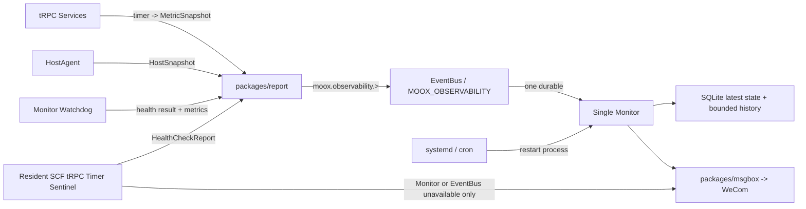

# MooX 全系统可观测性与业务监控 Implementation Plan

> **For agentic workers:** REQUIRED SUB-SKILL: Use superpowers:subagent-driven-development (recommended) or superpowers:executing-plans to implement this plan task-by-task. Steps use checkbox (`- [ ]`) syntax for tracking.

**Goal:** 在不引入 Prometheus Server、Alertmanager、HA 或复杂规则平台的前提下，建立一条统一、可验证的 MooX 监控链路，覆盖所有独立微服务和 SCF 存活、全部服务器资源、所有启用中的实时 TimeSeries Dataset + Frequency，以及 K 线采集、因子计算、资产余额和最小市场异常检测。

**Architecture:** 所有长驻 tRPC 服务通过 `packages/report` 在 tRPC timer 中采集进程内 Prometheus Registry，并把有界快照发布到统一 `moox.observability.>` subject；HostAgent 和 Watchdog 使用同一公共上报包发布强类型观测事件。单实例 Monitor 使用一个 JetStream durable 消费整个 observability 前缀，保存最新事实、执行简单阈值与静默检测并通过 `packages/msgbox` 告警。Monitor 是主 Watchdog；一个经现网验证可由持续心跳保持常驻的 SCF 节点启动轻量 tRPC Server，并用 30 秒 timer handler 充当外部 Sentinel。二者非对称互补，不做互相选主或完整双活。

**Tech Stack:** Go 1.25、tRPC-Go、Protocol Buffers、Prometheus client、NATS JetStream、SQLite/GORM、Vue 3、TypeScript、腾讯云 SCF、企业微信 Webhook、Shell。

---

## 1. 方案结论

### 1.1 必须遵守的简化边界

- Monitor 保持单实例；系统 cron/systemd 负责拉起 Monitor，不实现 Monitor HA、Peer、Leader Election 或分布式 Lease。
- 不部署 Prometheus Server、Pushgateway、Alertmanager、Grafana、Tracing 后端或新的日志系统。
- 不实现通用告警 DSL、PromQL、动态脚本、机器学习异常检测、自动修复或自动重启。
- EventBus 只承担观测数据传输，不把所有业务 Event 都交给 Monitor。
- Monitor 与 SCF 不做完全重复的检查集：Monitor 负责全量内部检查，SCF 只负责少量外部哨兵检查。
- 所有 SCF 都通过现有 heartbeat 判断存活；只有一个显式配置 `MOOX_SCF_WATCHDOG_ENABLED=true` 的 SCF 节点运行 Watchdog timer，避免重复探测和重复告警。
- `packages/msgbox` 只封装通知通道，不保存告警状态，不做分布式去重；告警状态仍由 Monitor 管理。
- 新项目不保留 `MOOX_METRICS`、`moox.metrics.>`、旧 durable、旧软删除 Schema 或旧 pipeline 配置的兼容路径。
- 所有查询、消息、标签、错误摘要和内存快照必须有明确上限；不允许把 `subject_id`、`job_id`、`trace_id`、订单号、账户号或错误文本作为普通指标标签。

### 1.2 最终运行关系



这套关系回答“Monitor 所在机器挂掉怎么办”：

1. Monitor 进程退出但机器仍活着，由 systemd/cron 拉起。
2. Monitor 所在机器不可达时，常驻 SCF Sentinel 的 30 秒 tRPC timer 无法访问 Monitor `/readyz`，直接发送企业微信告警。
3. 普通业务服务器不可达时，Monitor 通过服务健康检查失败或 HostAgent 快照静默感知。
4. EventBus 不可用时，Monitor `/readyz` 必须失败；SCF 同样会直接告警。
5. 已验证 CloudNode 持续发送 heartbeat/keepalive 时 SCF 可以长期驻留，因此 Sentinel 直接使用进程内 30 秒 timer handler 周期执行，不再按“单次 invocation 最后一分钟窗口”设计。若 heartbeat 链路本身停止，SCF 仍可能被平台冻结；个人量化 V1 接受这一平台 best-effort 边界，不再增加腾讯云 Timer Trigger。

### 1.3 观测 subject 契约

固定 Stream 与前缀：

```text
stream: MOOX_OBSERVABILITY
subjects:
  moox.observability.>
monitor durable:
  monitor_observability_ingest_v1
```

固定事件：

| Event | Payload | Owner | Subject family |
| --- | --- | --- | --- |
| `observability.metrics.snapshot.reported` v1 | `metricspb.MetricReport` | 各 tRPC 服务 | `moox.observability.metrics.snapshot.reported.v1.*.*` |
| `observability.host.snapshot.reported` v1 | `hostmetricpb.HostMetric` | HostAgent | `moox.observability.host.snapshot.reported.v1.*.*` |
| `observability.health.check.reported` v1 | `observabilitypb.HealthCheckReport` | Monitor/SCF Watchdog | `moox.observability.health.check.reported.v1.*.*` |

`packages/events.Registry` 仍是事件名、版本、payload、validator、stream 和 subject 的唯一声明处。Monitor 只绑定 `moox.observability.>`，解码后按 Registry 中的 Event 路由，不按字符串前缀手写反序列化。

### 1.4 指标命名契约

自定义指标固定使用：

```text
moox_<module>_<subsystem>_<metric>_<unit>
```

规则：

- Counter 以 `_total` 结尾。
- Duration 使用 `_seconds`。
- Unix 时间使用 `_timestamp_seconds`。
- 字节使用 `_bytes`。
- 比例使用 `_ratio`，百分比只用于 HostAgent 已有协议字段。
- `<module>` 使用 `collector`、`factor`、`storage`、`trade`、`monitor`、`cloudnode` 等稳定模块名。
- 不再使用 `moox_module_*{module="collector"}` 这种把模块名放在 label 的泛化命名。
- Go runtime、process 和 tRPC 原生指标保留 `go_`、`process_`、`trpc_`，不强行改名。

允许的通用标签：

```text
result
kind
stage
pipeline
space_id
dataset_id
freq
node_id
service_name
```

禁止的普通标签：

```text
subject_id
symbol
job_id
job_item_id
trace_id
request_id
message_id
order_id
account_id
error
error_message
```

仅 Market Canary 允许对一个配置白名单中的 `subject_id` 建立检查事实；它不进入全量 Dataset 指标标签。

### 1.5 实时 TimeSeries 监控范围

“所有启用中的实时 TimeSeries Dataset + Frequency”不维护第二份手工清单，由生产模块维护 Expected Dataset Registry。它表达“哪些 Dataset + Frequency 当前应该持续运行”，解决新规则从未运行时没有 `last_run` 指标、Monitor 因而无法发现缺失的问题：

- Collector：所有 `TaskRule.Enabled=true`、`data_type=kline`、`collector.live=true` 的 `target.dataset_id × collector.intervals[]`。
- Factor：所有 binding 和 factor 都为 `enabled` 的 `target_dataset × freq`。
- 后续新增实时 TimeSeries 生产模块时，必须通过同一个 `report.DatasetMetrics.ReplaceExpected` 注册 expected set，不修改 Monitor 发现逻辑。
- Storage 的提交水位只证明实际写入，不单独把一个 Dataset 判定为“应该实时运行”。
- Collector/Factor 启动时必须完成第一次加载；规则创建、更新、停用事务成功后立即刷新；现有 metrics timer 每 5 分钟做一次兜底对账。
- 对账失败保留上一版完整 expected set，Reporter 继续上报，并记录 refresh error 与最后成功时间；不能因一次数据库读取失败发布错误的空集合。
- Monitor 对 expected set 做并集，按 `producer + space_id + dataset_id + freq` 展示；同一 Dataset 的 Collector、Storage、Factor 阶段分别保留，不互相覆盖。

这里的 inventory refresh 只表示“预期监控对象对账”，不是重新采集 K 线或扫描时序数据。它定期重新读取 Collector 规则和 Factor binding，把当前应运行的 `Dataset + Frequency` 原子替换到进程内 Expected Dataset Registry，用来发现“已启用但一次也没有运行”的对象。为避免名词混淆，正文统一称为“expected set 对账”；代码中的 `inventory` 仅作为这一小段进程内清单的实现名。启动时、规则变更后和现有 5 分钟 metrics timer 兜底时执行即可，不新增独立服务或 timer。

配置文件只保存默认策略和小范围覆盖：

```yaml
version: 2
realtime_timeseries:
  defaults:
    run_missed_intervals: 2
    success_missed_intervals: 3
    watermark_periods: 3
    minimum_watermark_lag: 10m
  overrides:
    - space_id: crypto
      dataset_id: market_kline
      freq: 1m
      canary_subject_id: BTC-USDT
      watermark_lag: 5m
      market_price_change_ratio: 0.05
      market_volume_ratio: 5
```

Expected Dataset Registry 指标：

```text
moox_<module>_dataset_enabled{space_id,dataset_id,freq} 1
moox_<module>_dataset_expected_interval_seconds{space_id,dataset_id,freq}
moox_<module>_dataset_inventory_refresh_errors_total
moox_<module>_dataset_inventory_last_success_timestamp_seconds
```

运行和水位指标：

```text
moox_<module>_dataset_runs_total{space_id,dataset_id,freq,result}
moox_<module>_dataset_last_run_timestamp_seconds{space_id,dataset_id,freq}
moox_<module>_dataset_last_success_timestamp_seconds{space_id,dataset_id,freq}
moox_<module>_dataset_input_watermark_timestamp_seconds{space_id,dataset_id,freq}
moox_<module>_dataset_output_watermark_timestamp_seconds{space_id,dataset_id,freq}
moox_<module>_dataset_rows_total{space_id,dataset_id,freq,result}
```

固定语义：

- `last_run`：本次执行进入终态的时间，成功或失败都更新。
- `last_success`：成功完成本次业务动作的时间；合法空结果也算成功。
- `input_watermark`：本次成功消费的最大业务 `data_time`。
- `output_watermark`：权威写入成功后最大已提交 `data_time`。
- `empty`：更新 `last_run`、`last_success` 和 `runs_total{result="empty"}`，不推进 watermark。
- watermark 只能单调递增；重放旧消息不能让水位倒退。
- Monitor 用当前时间减原始 timestamp 计算 lag，生产者不重复上报派生 lag。
- `result` 只能是 `success|error|empty|rejected`。
- expected set 超过 10 分钟未成功对账时，Monitor 标记为 `UNKNOWN/inventory_stale`，不把上一版清单误判为仍然可信。

默认判定：

- `last_run` 超过 `2 × expected_interval + 30s`：告警。
- `last_success` 超过 `3 × expected_interval + 30s`：告警。
- `output_watermark` 超过 `max(3 × freq, 10m)`：告警。
- 生产者 Reporter 本身过期时，Dataset 展示为 `STALE/producer_stale`，但冻结该生产者已有的逐 Dataset freshness check，不制造一批 Dataset 告警；改由 `node_id + service_name + instance_id` 唯一的 Reporter freshness check 发出一条服务级告警。

### 1.6 默认告警集

| 类型 | 默认条件 | 恢复条件 |
| --- | --- | --- |
| 服务 | 同一 `node_id + service_name` 连续 3 次失败 | 连续 2 次成功 |
| Reporter | 同一 `node_id + service_name + instance_id` 超过 freshness 窗口未上报 | 对应实例恢复上报 |
| HostAgent | `occurred_at` 超过 90 秒未更新 | 收到更新且新于已保存时间 |
| CPU | 5 分钟窗口持续大于 90% | 小于 80% |
| 内存 | 5 分钟窗口持续大于 90% | 小于 80% |
| 文件系统 | 任一非忽略挂载点大于 90% | 小于 85% |
| 网络错误 | interval error rate 大于 1/s | 小于 0.1/s |
| SCF | heartbeat 超过 90 秒 | 新 heartbeat |
| Dataset run | 超过默认 run freshness | 新终态 |
| Dataset success | 超过默认 success freshness | 新成功 |
| Dataset watermark | 超过默认 watermark freshness | 水位恢复 |
| Canary | 读取失败、无闭合数据或 BTC-USDT 1m 水位过期 | 下一次成功且新鲜 |
| 资产余额 | Trade balance sync 连续 3 次失败或超过 15 分钟 | 下一次成功 |
| 市场异常 | 1m/5m 绝对涨跌幅或成交量比超过配置阈值 | 下一窗口回到阈值内 |

## 2. 当前代码评审结论

以下问题是本计划的真实输入，不是为了“硬找茬”而新增的抽象：

| 优先级 | 当前问题 | 处理方式 |
| --- | --- | --- |
| P0 | `modules/hostagent/internal/collector/collector_linux.go` 引用已不存在的 parser 类型和函数，Linux release 构建失败 | 恢复 Linux parser 与跨架构构建门禁 |
| P1 | HostAgent 网络告警直接累加生命周期累计错误数 | 上报 interval error rate，Monitor 只评估速率 |
| P1 | HostAgent 最新状态只在 Monitor 内存中；只有新样本到达时才评估，Monitor 重启或机器静默后无法稳定告警 | SQLite 保存 agent registry，独立 timer 做 silence scan |
| P1 | Metrics consumer 连接 NATS 后、durable 真正 bind 前就把 readiness 标为成功；Host consumer 不参与 readiness | 合并为一个 consumer，bind 并进入处理循环后才 ready |
| P1 | SysDeploy 自动检查主要以 `service_name` 标识，多节点同名服务会覆盖；loopback health URL 不能跨主机访问 | 使用 `node_id + service_name`，校验 node-reachable URL |
| P1 | SCF heartbeat 写成 online 后没有 freshness 派生，任务选择也没有排除过期节点 | 90 秒派生 timeout，调度只选 freshness 合格节点 |
| P1 | SCF 进程内调用 `ObserveModuleRun`，但当前 serverless 路径没有真正启动 tRPC Server/Reporter；控制面的成功报告也缺少稳定的业务 watermark 字段 | Sentinel SCF 启动 tRPC timer reporter；Dataset 结果回传 Collector，由控制面 Registry 推进 watermark |
| P1 | Monitor 和 HostAgent 使用不同 durable/consumer；subject 仍是 `moox.metrics.>`，无法表达统一观测边界 | 新建 `MOOX_OBSERVABILITY` 和单一 durable |
| P2 | Monitor check/webhook/rule 的 `(space,id,is_deleted)` 唯一索引会在删除、重建、再次删除时冲突 | 新项目直接改为硬删除和引用约束 |
| P2 | 创建告警规则时缺少 check、webhook 存在且启用的完整校验 | 写事务内校验，删除时 RESTRICT |
| P2 | metric rule evaluation 没有纳入 retention；Overview 会计入 disabled check | 增加 14 天清理，只聚合 enabled |
| P2 | 通知发送实现位于 Monitor 内部，SCF 无法安全复用 | 提取 `packages/msgbox` |
| P2 | `examples/monitor-pipelines.yaml` 仍带 `crosses_storage_deferred` 和手工 pipeline 清单 | v2 改为 Expected Dataset Registry + 默认策略 |

## 3. 实施顺序

### Task 1: 固化统一观测事件契约

**Files:**

- Create: `packages/observabilitypb/go.mod`
- Create: `packages/observabilitypb/Makefile`
- Create: `packages/observabilitypb/health_check.proto`
- Create: `packages/observabilitypb/health_check.pb.go`
- Modify: `go.work`
- Modify: `packages/events/registry.go`
- Modify: `packages/events/validation.go`
- Modify: `packages/events/validation_test.go`
- Modify: `packages/events/events_test.go`
- Modify: `modules/eventbus/config/app.yaml`
- Modify: `modules/eventbus/internal/config/config_test.go`
- Modify: `modules/eventbus/internal/registry/registry_test.go`

- [ ] **Step 1: 先写失败的 Registry 和 validator 测试**

测试必须断言三个事件都属于 `MOOX_OBSERVABILITY`，FamilyPattern 均位于 `moox.observability.>`，旧 `MetricsHostReported`、`MetricsSnapshotReported` 和 `MOOX_METRICS` 声明不存在。

```go
func TestObservabilityEventsShareOneStream(t *testing.T) {
	for _, event := range []events.Event{
		events.ObservabilityMetricsSnapshotReported,
		events.ObservabilityHostSnapshotReported,
		events.ObservabilityHealthCheckReported,
	} {
		require.Equal(t, "MOOX_OBSERVABILITY", event.Stream())
		require.Contains(t, events.FamilyPattern(event), "moox.observability.")
	}
}
```

Run:

```bash
cd packages/events && go test ./...
```

Expected: FAIL，因为新事件和 payload 尚不存在。

- [ ] **Step 2: 定义最小 HealthCheckReport**

```proto
syntax = "proto3";

package trpc.moox.observability;

import "google/protobuf/timestamp.proto";

option go_package = "github.com/mooyang-code/moox/packages/observabilitypb;observabilitypb";

message HealthCheckReport {
  string observer_id = 1;
  string check_id = 2;
  string target = 3;
  string kind = 4;
  bool success = 5;
  int32 status_code = 6;
  int64 latency_ms = 7;
  string error_code = 8;
  string error_summary = 9;
  google.protobuf.Timestamp checked_at = 10;
}
```

Validator 固定限制：`observer_id/check_id/kind` 必填；`target <= 512`；`error_code <= 64`；`error_summary <= 256`；`latency_ms >= 0`；`checked_at` 有效且与 envelope `occurred_at` 相差不超过 5 分钟。

- [ ] **Step 3: 重命名内建事件并切换 EventBus Stream**

删除旧事件变量和旧 stream 配置，不保留 alias。EventBus 配置只声明：

```yaml
- name: MOOX_OBSERVABILITY
  subjects:
    - moox.observability.>
  retention: limits
  storage: file
  replicas: 1
```

- [ ] **Step 4: 生成代码并验证无生成漂移**

Run:

```bash
make proto
git diff --check
cd packages/observabilitypb && go test ./...
cd packages/events && go test ./...
cd modules/eventbus && go test ./...
```

Expected: PASS，第二次执行 `make proto` 不再产生 diff。

- [ ] **Step 5: Commit**

```bash
git add go.work packages/observabilitypb packages/events modules/eventbus
git commit -m "feat(observability): unify event contracts and stream"
```

### Task 2: 把 `packages/report` 收敛为唯一上报入口

**Files:**

- Modify: `packages/report/module_metrics.go`
- Modify: `packages/report/module_metrics_test.go`
- Create: `packages/report/dataset_metrics.go`
- Create: `packages/report/dataset_metrics_test.go`
- Create: `packages/report/event_reporter.go`
- Create: `packages/report/event_reporter_test.go`
- Modify: `packages/report/handler.go`
- Modify: `packages/report/handler_test.go`
- Modify: `packages/report/config.go`
- Modify: `packages/report/go.mod`
- Modify: `modules/admin/internal/bootstrap/bootstrap.go`
- Modify: `modules/archive/internal/bootstrap/metrics_reporter.go`
- Modify: `modules/cloudnode/internal/bootstrap/bootstrap.go`
- Modify: `modules/collector/internal/bootstrap/bootstrap.go`
- Modify: `modules/eventbus/internal/bootstrap/bootstrap.go`
- Modify: `modules/factor/internal/bootstrap/bootstrap.go`
- Modify: `modules/gateway/internal/bootstrap/metrics_reporter.go`
- Modify: `modules/monitor/internal/bootstrap/metrics_runtime.go`
- Modify: `modules/strategy/internal/bootstrap/metrics_reporter.go`
- Modify: `modules/trade/internal/bootstrap/bootstrap.go`

- [ ] **Step 1: 写命名和低基数失败测试**

测试 Gather 后的 family 名称必须以 `moox_<module>_` 开头，且不含 `module`、`subject_id`、`job_id`、`error` 标签。非法 module 名直接返回错误。

```go
func TestDatasetMetricsNamesAndLabels(t *testing.T) {
	registry := prometheus.NewRegistry()
	metrics, err := report.NewDatasetMetrics(registry, "collector")
	require.NoError(t, err)
	metrics.ReplaceExpected([]report.DatasetExpectation{{
		Key: report.DatasetKey{SpaceID: "crypto", DatasetID: "market_kline", Freq: "1m"},
		Interval: time.Minute,
	}})
	families, err := registry.Gather()
	require.NoError(t, err)
	requireMetricFamily(t, families, "moox_collector_dataset_enabled")
	requireNoLabels(t, families, "module", "subject_id", "job_id", "error")
}
```

- [ ] **Step 2: 实现明确的 DatasetMetrics API**

```go
type DatasetKey struct {
	SpaceID   string
	DatasetID string
	Freq      string
}

type DatasetExpectation struct {
	Key      DatasetKey
	Interval time.Duration
}

type DatasetObservation struct {
	Key             DatasetKey
	Result          string
	Rows            uint64
	FinishedAt      time.Time
	InputWatermark  time.Time
	OutputWatermark time.Time
}

type DatasetMetrics struct {
	// Prometheus collectors are private; callers can only use bounded methods.
}

func NewDatasetMetrics(registerer prometheus.Registerer, module string) (*DatasetMetrics, error)
func (m *DatasetMetrics) ReplaceExpected(items []DatasetExpectation) error
func (m *DatasetMetrics) ObserveRun(observation DatasetObservation) error
```

`ReplaceExpected` 先验证完整新集合，再 `Reset`/替换，避免解析失败时把旧 inventory 清空。`ObserveRun` 对 watermark 使用 max 语义。

- [ ] **Step 3: 删除泛化 `moox_module_*` 指标**

`ObserveModuleRun` 改为模块实例持有的 `ModuleMetrics.ObserveRun`；bootstrap 显式构造并注入，不能依靠 SCF 与服务进程不共享的全局内存。

固定 family 为：

```text
moox_<module>_runs_total{stage,result,pipeline}
moox_<module>_last_success_timestamp_seconds{stage,pipeline}
moox_<module>_last_error_timestamp_seconds{stage,pipeline}
moox_<module>_input_watermark_timestamp_seconds{stage,pipeline}
moox_<module>_business_watermark_timestamp_seconds{stage,pipeline}
moox_<module>_metrics_errors_total{operation}
moox_<module>_metrics_last_error_timestamp_seconds
```

`packages/report` 暴露同一套 canonical name helper，Monitor Context、CLI Doctor 和
`/metrics` fallback 不得再各自拼旧的 `moox_module_*` 名字。Collector、Factor 的服务进程在
Dataset observation 被 Expected Dataset Registry 接受后，同时桥接一次低基数 `ObserveRun`；
SCF 不持有另一份无法被 `moox_collector` Reporter 上报的 ModuleMetrics。

- [ ] **Step 4: 把 Reporter 自身指标也改成模块前缀**

删除当前全局：

```text
moox_metrics_report_errors_total{service}
moox_metrics_report_last_error_timestamp_seconds{service}
```

改为 Handler 按 module 注册：

```text
moox_<module>_report_errors_total
moox_<module>_report_last_error_timestamp_seconds
```

`DefaultConfig` 签名改为 `DefaultConfig(module, serviceName string)`，所有现有调用点显式传入，例如：

```go
report.DefaultConfig("collector", "moox_collector")
report.DefaultConfig("eventbus", "eventbus")
report.DefaultConfig("admin", "admin_gateway")
```

module 只用于指标命名，serviceName 仍用于 EventMessage 身份；二者不得通过 label 互相替代。

- [ ] **Step 5: 增加 typed event reporter**

```go
type EventReporter struct {
	Registry  *events.Registry
	Publisher Publisher
}

func (r *EventReporter) ReportHealth(
	ctx context.Context,
	report *observabilitypb.HealthCheckReport,
	spaceID string,
) error
```

`ReportHealth` 使用 `observability.health.check.reported`，`subject_id` 固定为 `observer_id + "/" + check_id`，调用 Registry Encode/Validate，错误中不得泄露 credential。

- [ ] **Step 6: 保留两种合法运行方式**

- 长驻 tRPC 服务：timer handler 定时调用 `Handler.Handle(ctx)`。
- 常驻 SCF Sentinel：依靠已验证的 heartbeat/keepalive 保持驻留，启动轻量 tRPC Server，由 30 秒 timer handler 更新专用 Registry，再调用 `Handler.Handle(ctx)` 和 `EventReporter.ReportHealth(ctx)`；handler 自身不再启动额外常驻 goroutine。非 Sentinel SCF 只保留现有 resident taskrunner 和 heartbeat。

- [ ] **Step 7: Test and commit**

```bash
cd packages/report && go test -race ./...
git add packages/report modules/admin modules/archive modules/cloudnode modules/collector modules/eventbus modules/factor modules/gateway modules/monitor modules/strategy modules/trade
git commit -m "refactor(report): enforce module metrics and dataset contracts"
```

### Task 3: Monitor 合并为一个 observability consumer

**Files:**

- Create: `modules/monitor/internal/observability/eventconsumer/consumer.go`
- Create: `modules/monitor/internal/observability/eventconsumer/consumer_test.go`
- Create: `modules/monitor/internal/observability/eventconsumer/consumer_eventbus_test.go`
- Delete: `modules/monitor/internal/metrics/eventconsumer/consumer.go`
- Delete: `modules/monitor/internal/metrics/eventconsumer/consumer_test.go`
- Delete: `modules/monitor/internal/metrics/eventconsumer/consumer_eventbus_test.go`
- Delete: `modules/monitor/internal/hostmetrics/eventconsumer/consumer.go`
- Delete: `modules/monitor/internal/hostmetrics/eventconsumer/consumer_test.go`
- Modify: `modules/monitor/internal/bootstrap/metrics_runtime.go`
- Modify: `modules/monitor/internal/bootstrap/host_runtime.go`
- Modify: `modules/monitor/internal/bootstrap/bootstrap.go`
- Modify: `modules/monitor/internal/bootstrap/runtime.go`
- Modify: `modules/monitor/internal/bootstrap/health.go`
- Modify: `modules/monitor/internal/config/config.go`
- Modify: `modules/monitor/internal/config/config_test.go`

- [ ] **Step 1: 写 embedded NATS 失败测试**

覆盖以下行为：

1. durable 恰好为 `monitor_observability_ingest_v1`。
2. filter 恰好为 `moox.observability.>`。
3. Metrics、Host、Health 三种 payload 都能由同一消费循环路由。
4. 已注册但 payload 不合法的事件执行 TERM。
5. Storage 暂时失败执行 NAK。
6. 未注册的 event name/version 执行 TERM，并增加拒绝计数。
7. 重启后 durable 继续消费，不创建第二个 consumer。

- [ ] **Step 2: 实现单一 dispatcher**

```go
type Routes struct {
	Metrics func(context.Context, *eventpb.EventMessage, *metricspb.MetricReport) error
	Host    func(context.Context, *eventpb.EventMessage, *hostmetricpb.HostMetric) error
	Health  func(context.Context, *eventpb.EventMessage, *observabilitypb.HealthCheckReport) error
}

type Consumer struct {
	consumer *jetstream.Consumer
	registry *events.Registry
	routes   Routes
}
```

路由只接受三个明确 Event；不允许 `switch strings.HasPrefix(subject, ...)`。

- [ ] **Step 3: 修正 readiness 时序**

把 `MetricsIngestReady` 改为 `ObservabilityIngestReady`。只有以下条件全部满足才置 true：

1. NATS 连接成功。
2. stream 存在。
3. durable bind 成功。
4. consumer loop 已进入 receive 状态。
5. 三个 route handler 均已配置。

连接成功但 bind 失败时 `/readyz` 必须返回 503。Host route 不再游离于 readiness 外。

- [ ] **Step 4: 删除旧配置字段**

删掉 Metrics 和 Host 各自的 consumer/credential 配置，改为一组：

```yaml
observability:
  enabled: true
  eventbus_urls:
    - tls://127.0.0.1:4222
  credential_file: ${MOOX_OBSERVABILITY_CREDENTIAL_FILE}
  stream: MOOX_OBSERVABILITY
  consumer: monitor_observability_ingest_v1
  filter_subject: moox.observability.>
```

- [ ] **Step 5: Test and commit**

```bash
cd modules/monitor && go test -race ./internal/observability/... ./internal/bootstrap/... ./internal/config/...
git add modules/monitor
git commit -m "refactor(monitor): consume one observability subject tree"
```

### Task 4: 修正 Monitor 配置 Schema、引用完整性和清理策略

**Files:**

- Modify: `modules/monitor/schema/monitor.sql`
- Modify: `modules/monitor/schema/schema_test.go`
- Modify: `modules/monitor/internal/domain/check.go`
- Modify: `modules/monitor/internal/domain/alert.go`
- Modify: `modules/monitor/internal/store/check.go`
- Modify: `modules/monitor/internal/store/alert.go`
- Modify: `modules/monitor/internal/store/repositories.go`
- Modify: `modules/monitor/internal/store/repositories_test.go`
- Modify: `modules/monitor/internal/rpc/service.go`
- Modify: `modules/monitor/internal/rpc/service_test.go`
- Modify: `modules/monitor/internal/bootstrap/data_cleanup_timer.go`
- Modify: `modules/monitor/internal/bootstrap/data_cleanup_timer_test.go`

- [ ] **Step 1: 写删除重建和引用约束失败测试**

测试 `create -> delete -> recreate -> delete` 可重复；绑定中的 check/webhook 删除返回明确冲突；disabled check 不出现在 Overview；metric rule evaluation 14 天后被批量删除。

- [ ] **Step 2: 改为硬删除**

从 checks、webhooks、alert rules、metric rules 删除 `c_is_deleted`。唯一键直接使用 `(c_space_id, c_*_id)`。

固定删除行为：

- check 被 alert rule 引用：RESTRICT。
- webhook 被 alert rule 或 metric rule channel 引用：RESTRICT。
- alert rule 删除：同一事务删除 state 和未发送 notification；历史 alert event 保留其字符串快照。
- metric rule 删除：同一事务删除 state、channel 和 evaluation。
- 未绑定 check 删除：同时删除 check results。

- [ ] **Step 3: 创建/更新 rule 时完整校验**

写事务内读取 check/webhook，要求都存在且 enabled；不能只相信客户端传入 ID。通知发送失败不能把 alert state 当作通知成功，下一次 evaluation 必须可重试。

- [ ] **Step 4: 清理 evaluation**

沿用现有 cleanup timer，每批最多 500 条、每次最多 10 批，删除 14 天前 `t_monitor_metric_rule_evaluations`；保留 latest/state。

- [ ] **Step 5: Test and commit**

```bash
cd modules/monitor && go test -race ./internal/store/... ./internal/rpc/... ./internal/bootstrap/...
git add modules/monitor
git commit -m "fix(monitor): enforce config integrity and bounded retention"
```

### Task 5: 提取 `packages/msgbox` 并统一通知出口

**Files:**

- Create: `packages/msgbox/go.mod`
- Create: `packages/msgbox/message.go`
- Create: `packages/msgbox/sender.go`
- Create: `packages/msgbox/wecom.go`
- Create: `packages/msgbox/wecom_test.go`
- Modify: `go.work`
- Modify: `modules/monitor/internal/alerting/webhook.go`
- Modify: `modules/monitor/internal/alerting/evaluator.go`
- Modify: `modules/monitor/internal/metrics/notification.go`
- Modify: `modules/monitor/internal/metrics/notification_test.go`

- [ ] **Step 1: 写 transport 失败测试**

覆盖 HTTP 非 2xx、企微业务 `errcode != 0`、超时、最大响应 64 KiB、消息正文最大 4096 字符、URL 必须为 HTTPS（测试 server 可通过显式 test option 放开）。

- [ ] **Step 2: 实现小接口**

```go
type Severity string

const (
	SeverityInfo     Severity = "info"
	SeverityWarning  Severity = "warning"
	SeverityCritical Severity = "critical"
)

type Message struct {
	Key      string
	Severity Severity
	Title    string
	Body     string
	Labels   map[string]string
}

type Sender interface {
	Send(context.Context, Message) error
}
```

`Key` 用于下游展示，不在 msgbox 内做状态或去重。Labels 最多 16 个，key/value 各不超过 64/256 字符。

- [ ] **Step 3: Monitor 改为依赖 Sender**

保留现有 alert evaluator 的 threshold、recovery、reminder 语义；删除 Monitor 内部重复 HTTP webhook 传输代码。普通告警全部从 Monitor 发出。

- [ ] **Step 4: SCF 直接发送边界**

SCF 仅在以下情况直接调用 `msgbox.Sender`：

- Monitor `/readyz` 不可达或返回非 2xx。
- HealthCheckReport 无法发布到 EventBus。

其他服务、Dataset、Canary 失败若 Monitor 和 EventBus 正常，只发事件，由 Monitor 告警。SCF 每次 timer tick 最多直发一条合并消息，并在 Sentinel 进程内使用 5 分钟 cooldown 抑制重复直发；进程回收后 cooldown 丢失是可接受的 best-effort 行为，不把去重状态放进 `packages/msgbox`。

- [ ] **Step 5: Test and commit**

```bash
cd packages/msgbox && go test -race ./...
cd modules/monitor && go test -race ./internal/alerting/... ./internal/metrics/...
git add go.work packages/msgbox modules/monitor
git commit -m "refactor(alerting): share message transports"
```

### Task 6: 修复 HostAgent Linux 构建和采集语义

**Files:**

- Create: `modules/hostagent/internal/collector/parser_linux.go`
- Create: `modules/hostagent/internal/collector/parser_linux_test.go`
- Modify: `modules/hostagent/internal/collector/collector_linux.go`
- Modify: `modules/hostagent/internal/app/sample_timer.go`
- Modify: `modules/hostagent/internal/app/sample_timer_test.go`
- Modify: `packages/hostmetricpb/host_metric.proto`
- Modify: `packages/hostmetricpb/host_metric.pb.go`
- Modify: `modules/monitor/internal/hostmetrics/alerts.go`
- Modify: `modules/monitor/internal/hostmetrics/alerts_test.go`
- Modify: `skills/moox/scripts/hostagent-release.sh`
- Modify: `skills/moox/scripts/test-hostagent-release.sh`

- [ ] **Step 1: 用当前失败构建做回归测试**

Run:

```bash
VERSION=review TARGET_GOARCH=amd64 bash skills/moox/scripts/hostagent-release.sh
```

Expected before fix: FAIL，缺少 `CPUStat`、`DiskStat`、`NetworkStat` 和 `Parse*`。

- [ ] **Step 2: 恢复 Linux-only parser**

`parser_linux.go` 必须有：

```go
//go:build linux
```

解析 `/proc/stat`、`/proc/meminfo`、`/proc/diskstats`、`/proc/net/dev` 和 `/proc/mounts`，使用 `bufio.Scanner`/`strings.Fields`，对短行、非数字、计数器回绕和设备消失返回明确状态，不 panic。

- [ ] **Step 3: 区分必需与可选采集器**

- CPU 或 Memory 失败：整次 sample 返回错误，不发布全零快照，HostAgent `/readyz` 失败。
- Filesystem、Disk、Network 失败：仍发布 CPU/Memory，在 `CollectorStatus` 标记失败。
- `occurred_at` 使用采样完成时间，不使用 EventBus 消费时间。

- [ ] **Step 4: 改网络错误为 interval rate**

在 `NetworkMetric` 增加：

```proto
double receive_errors_per_second = 12;
double transmit_errors_per_second = 13;
bool error_rate_available = 14;
```

HostAgent 使用相邻快照和实际 elapsed 计算；首次样本、计数器回绕或间隔非正时 `error_rate_available=false`。Monitor 删除累计 total 告警逻辑，只汇总可用 rate。

Host 资源进入 firing 后必须复用 `MinimumReminderIntervalSeconds`：首次通知失败只记录 `send_failed`，但 firing 状态继续保留，并在 reminder 到期后的新样本上重试；通知成功后仍按相同间隔发送持续异常提醒。通知失败不能回滚 HostSnapshot，也不能永久吞掉本轮异常。

- [ ] **Step 5: 增加两个架构发布门禁**

```bash
VERSION=review TARGET_GOARCH=amd64 bash skills/moox/scripts/hostagent-release.sh
VERSION=review TARGET_GOARCH=arm64 bash skills/moox/scripts/hostagent-release.sh
bash skills/moox/scripts/test-hostagent-release.sh
```

Expected: 两个 tarball 都包含可执行 ELF、默认配置和 checksum；测试不尝试在 macOS 执行 Linux binary。

- [ ] **Step 6: Test and commit**

```bash
make proto
cd modules/hostagent && go test -race ./...
cd modules/monitor && go test -race ./internal/hostmetrics/...
git add modules/hostagent packages/hostmetricpb modules/monitor skills/moox/scripts
git commit -m "fix(hostagent): restore linux collection and interval rates"
```

### Task 7: 持久化 HostAgent registry 并检测机器静默

**Files:**

- Modify: `modules/monitor/schema/monitor.sql`
- Modify: `modules/monitor/schema/schema_test.go`
- Create: `modules/monitor/internal/hostmetrics/registry.go`
- Create: `modules/monitor/internal/hostmetrics/registry_test.go`
- Create: `modules/monitor/internal/hostmetrics/silence.go`
- Create: `modules/monitor/internal/hostmetrics/silence_test.go`
- Modify: `modules/monitor/internal/hostmetrics/hostmetrics.go`
- Modify: `modules/monitor/internal/bootstrap/schedule_timers.go`
- Modify: `modules/monitor/internal/bootstrap/schedule_timers_test.go`
- Modify: `modules/monitor/internal/rpc/host.go`
- Modify: `modules/monitor/proto/monitor.proto`

- [ ] **Step 1: 写 Monitor 重启和静默失败测试**

场景：

1. 保存 agent A 的 `occurred_at=T0`。
2. 重建 Monitor runtime。
3. `T0+91s` 执行 silence scan。
4. A 仍出现在列表中，状态为 `UNREACHABLE`，生成一次 alert transition。
5. 收到 `occurred_at=T0+100s` 后恢复。
6. 晚到的 `T0+50s` 不能覆盖新状态。

- [ ] **Step 2: 新增最小 registry 表**

```sql
CREATE TABLE t_monitor_host_agents (
    c_agent_id TEXT PRIMARY KEY,
    c_hostname TEXT NOT NULL,
    c_boot_id TEXT NOT NULL,
    c_last_seen_at DATETIME NOT NULL,
    c_last_event_id TEXT NOT NULL,
    c_status TEXT NOT NULL CHECK (c_status IN ('reachable', 'unreachable')),
    c_ctime DATETIME NOT NULL DEFAULT CURRENT_TIMESTAMP,
    c_mtime DATETIME NOT NULL DEFAULT CURRENT_TIMESTAMP
);
```

不在 SQLite 重复保存完整 HostSnapshot；现有 latest/history 路径继续承担样本数据。

- [ ] **Step 3: 以 EventMessage 时间单调 upsert**

只有新 `occurred_at > c_last_seen_at` 才更新 registry。EventBus redelivery 和旧消息不得把 agent 重新变成 reachable。

- [ ] **Step 4: 注册 30 秒 silence timer**

stale 阈值 90 秒。扫描只触发状态 transition；处于 unreachable 时由 Monitor alert reminder 策略控制提醒，不每 30 秒发送一次。

- [ ] **Step 5: Proto/UI 查询补充状态**

Host list 返回 `last_seen_at`、`reachable`、`stale_seconds`；Monitor 重启后即使还没有收到新快照也能返回已知 agent。

- [ ] **Step 6: Test and commit**

```bash
make proto
cd modules/monitor && go test -race ./internal/hostmetrics/... ./internal/bootstrap/... ./internal/rpc/...
git add modules/monitor
git commit -m "feat(monitor): persist host presence and detect silence"
```

### Task 8: 修复 SysDeploy 多节点检查和服务身份

**Files:**

- Modify: `modules/monitor/internal/sysdeploy/sync.go`
- Modify: `modules/monitor/internal/sysdeploy/sync_test.go`
- Modify: `modules/monitor/internal/metrics/producer_authorizer.go`
- Modify: `modules/monitor/internal/metrics/consumer_test.go`
- Modify: `modules/monitor/internal/doctor/context.go`
- Modify: `modules/monitor/internal/doctor/context_test.go`
- Modify: `modules/cli/test/doctor_e2e_test.go`
- Modify: `examples/service-deployments.seed.yaml`
- Modify: `modules/cli/internal/setup/client/client.go`
- Modify: `modules/cli/internal/setup/client/client_test.go`

- [ ] **Step 1: 写同服务双节点失败测试**

输入 `moox_collector@node-a` 和 `moox_collector@node-b`，必须生成两个 check：

```text
sysdeploy:node-a:moox_collector
sysdeploy:node-b:moox_collector
```

停用 node-b 只能禁用 node-b check。

- [ ] **Step 2: 统一运行身份**

固定：

```text
service_name = moox_collector
instance_id  = moox_collector@node-a
node_id      = node-a
boot_id      = 每次进程启动唯一
```

ProducerAuthorizer 必须校验 `service_name + node_id` 对应 active SysDeploy，不能仅校验 service name。

- [ ] **Step 3: 校验 health URL 可达性**

部署 seed/setup 将 `127.0.0.1` 替换为目标 node host；仅当 Monitor 与目标服务明确同节点时允许 loopback。无可达 URL 时不创建伪 check，而是返回配置错误并使 Doctor/Monitor readiness 展示原因。

- [ ] **Step 4: Overview 只计 enabled**

禁用和已删除 check 不进入服务健康分母；它们可在配置页查看，但不让 Overview 显示假故障。

- [ ] **Step 5: Test and commit**

```bash
cd modules/monitor && go test -race ./internal/sysdeploy/... ./internal/doctor/... ./internal/metrics/...
cd modules/cli && go test -race ./test/... ./internal/setup/client/...
git add modules/monitor modules/cli examples/service-deployments.seed.yaml
git commit -m "fix(monitor): key service checks by node and service"
```

### Task 9: 让 SCF heartbeat 真正表示存活

**Files:**

- Modify: `modules/cloudnode/internal/store/node.go`
- Create: `modules/cloudnode/internal/store/node_test.go`
- Modify: `modules/cloudnode/internal/rpc/node_batch_runner.go`
- Modify: `modules/cloudnode/internal/rpc/node_batch_runner_test.go`
- Create: `modules/cloudnode/internal/observability/scf_metrics.go`
- Create: `modules/cloudnode/internal/observability/scf_metrics_test.go`
- Modify: `modules/cloudnode/internal/bootstrap/bootstrap.go`
- Modify: `modules/cloudnode/internal/bootstrap/bootstrap_test.go`

- [ ] **Step 1: 写 heartbeat freshness 失败测试**

固定 `now`，验证：

- 无 heartbeat：`unknown`，不可接任务。
- 89 秒：`online`，可接任务。
- 91 秒：`timeout`，不可接任务。
- 新 heartbeat：恢复 `online`。

- [ ] **Step 2: 查询时派生状态**

不依赖后台批量 UPDATE 才能正确；`ListNodes`/`GetNode` 根据 `last_heartbeat_at` 派生展示状态。任务选择 SQL 直接要求：

```sql
c_last_heartbeat_at >= :now_minus_90_seconds
```

刚创建但从未 heartbeat 的 SCF 仍允许 keepalive maintainer 调用，但不允许领取业务 JobItem。

- [ ] **Step 3: CloudNode reporter 上报低基数 SCF 状态**

```text
moox_cloudnode_scf_nodes{status="online|timeout|unknown"} <count>
moox_cloudnode_scf_oldest_heartbeat_age_seconds
moox_cloudnode_scf_keepalive_runs_total{result}
```

不以 `node_id` 作为 Prometheus label；具体 node 列表通过 CloudNode API/Monitor context 查看。

- [ ] **Step 4: Test and commit**

```bash
cd modules/cloudnode && go test -race ./internal/store/... ./internal/rpc/... ./internal/observability/... ./internal/bootstrap/...
git add modules/cloudnode
git commit -m "fix(cloudnode): expire stale scf heartbeats"
```

### Task 10: 实现 Monitor 主 Watchdog 和 SCF 外部 Sentinel

**Files:**

- Modify: `modules/monitor/internal/scheduler/scheduler.go`
- Modify: `modules/monitor/internal/scheduler/scheduler_test.go`
- Modify: `modules/monitor/internal/bootstrap/schedule_timers.go`
- Modify: `modules/monitor/internal/bootstrap/service_runtime.go`
- Modify: `modules/monitor/internal/domain/check.go`
- Modify: `modules/monitor/internal/store/check.go`
- Modify: `modules/monitor/internal/alerting/evaluator.go`
- Modify: `modules/monitor/proto/monitor.proto`
- Create: `modules/monitor/internal/watchdog/metrics.go`
- Create: `modules/monitor/internal/watchdog/metrics_test.go`
- Create: `modules/collector/internal/serverless/watchdog.go`
- Create: `modules/collector/internal/serverless/watchdog_test.go`
- Create: `modules/collector/internal/serverless/bootstrap/observability_timer.go`
- Create: `modules/collector/internal/serverless/bootstrap/observability_timer_test.go`
- Modify: `modules/collector/internal/app/runtime/global.go`
- Modify: `modules/collector/internal/app/runtime/global_test.go`
- Modify: `modules/collector/cmd/scf/main.go`
- Modify: `modules/collector/cmd/scf/main_test.go`
- Modify: `modules/collector/configs/trpc_go.yaml`
- Modify: `modules/cloudnode/internal/rpc/node.go`
- Modify: `modules/cloudnode/internal/rpc/node_item_test.go`
- Modify: `scripts/build-collector-scf-package.sh`
- Modify: `scripts/build-collector-scf-package_test.sh`

- [ ] **Step 1: Monitor 继续复用现有 check scheduler**

不新建第二套调度器。每次现有 HTTP/TCP check 完成后更新：

```text
moox_monitor_watchdog_checks_total{kind,result}
moox_monitor_watchdog_last_run_timestamp_seconds{kind}
moox_monitor_watchdog_last_success_timestamp_seconds{kind}
moox_monitor_watchdog_latency_seconds{kind}
```

service/node/check ID 留在 SQLite check result，不进入 metrics label。

- [ ] **Step 2: 在常驻 SCF 中真正启动 tRPC timer**

当前 SCF 只启动 resident taskrunner 和 `cloudfunction.Start`；`trpc_go.yaml` 中仅声明 timer 不会自动执行。`startProductionRuntime` 必须显式创建轻量 `trpc.Server`、注册 timer handler，并在独立 goroutine 中运行 Server，不能阻塞 CloudFunction handler 或 JobItem taskrunner。删除当前没有注册 handler 的 `trpc.heartbeat.timer` 和 `trpc.dnsresolve.timer` 声明：heartbeat 继续由 CloudNode keepalive event 负责，DNS 保持现有启动时刷新，不保留看似运行、实际未执行的 timer 配置。

只新增一个 timer service：

```yaml
- name: trpc.moox.collector.scf_observability.timer
  port: 8005
  network: "*/30 * * * * *?scheduler=scfObservability&startAtOnce=1"
  protocol: timer
  timeout: 20000
```

`runtimeapp` 增加无阻塞 readiness snapshot。首次完整 heartbeat 尚未提供 `node_id`、Gateway 和 Storage target 时，handler 返回 `nil` 并记录 `not_ready`，不能等待到 timer timeout，也不能发送故障告警。

- [ ] **Step 3: 只允许一个 SCF Sentinel**

所有 SCF 仍通过 heartbeat 判断存活；只有环境变量 `MOOX_SCF_WATCHDOG_ENABLED=true` 的节点执行 observability handler，其他节点立即返回。CloudNode 发布配置拒绝在同一 space 中启用第二个 Sentinel，并只给被选中的节点注入该环境变量。

- [ ] **Step 4: 定义 SCF 最小检查集**

每 30 秒只执行：

1. Monitor `/readyz`，5 秒 timeout。
2. Gateway `/readyz`，5 秒 timeout。
3. 通过 Gateway 调 Storage 只读查询最新 `BTC-USDT` 1m 闭合 K 线，整体 10 秒 timeout。

不调用交易下单、不写 Storage、不触发采集或因子重算。Canary 成功要求：至少一条闭合记录、字段可解码、最大 `data_time` 未超过配置 freshness。

- [ ] **Step 5: 防止 timer 重入**

```go
func (h *Handler) Handle(ctx context.Context) error {
	if !h.enabled || !h.running.CompareAndSwap(false, true) {
		return nil
	}
	defer h.running.Store(false)
	return h.run(ctx)
}
```

单轮总 timeout 为 20 秒；上一轮仍在执行时跳过新一轮并增加 `moox_collector_scf_watchdog_skipped_total{reason="overlap"}`。结果最多 8 个 check；每个错误摘要最多 256 字符；任何 HTTP body 最多读 64 KiB。

- [ ] **Step 6: 把外部结果映射到现有告警状态机**

在 Monitor `CheckKind` 增加 `CHECK_KIND_EXTERNAL`。外部 check 由 bootstrap 根据配置幂等创建，固定 ID：

```text
external:scf_sentinel:monitor_ready
external:scf_sentinel:gateway_ready
external:scf_sentinel:market_canary
```

Scheduler 只调度 HTTP/TCP check，永远不主动执行 EXTERNAL check。Health route 仅接受配置 allowlist 中的 `observer_id + check_id`，把合法 report 转成现有 `domain.CheckResult`，`instance_id=observer_id`，然后复用现有 result repository 和 alert evaluator。未知 observer/check 执行 TERM 并记录固定错误码，不能动态创建任意告警项。

- [ ] **Step 7: 正常结果通过公共 reporter**

每个检查调用 `report.EventReporter.ReportHealth`；同一 timer handler 最后调用一次 `report.Handler.Handle` 上报 SCF 进程指标。Reporter 使用 `module=collector`、`service_name=moox_collector_scf` 和稳定 node/boot identity。Monitor 健康且 EventBus publish 成功时 SCF 不直发消息。

- [ ] **Step 8: 中央路径失败时直接 msgbox**

Monitor 失败或任一 health report publish 失败时，把本轮失败合并为一条 `critical` 消息。测试必须证明：

- Monitor down：直接发送一次。
- Monitor healthy + Canary stale：只发 EventBus，由 Monitor 发送。
- EventBus down：直接发送一次。
- 一个 timer tick 多项失败：仍只发送一次。
- 5 分钟 cooldown 内连续失败：不重复直发；cooldown 后仍失败才再次提醒。

- [ ] **Step 9: 验证 SCF 长期驻留前提与 best-effort 边界**

已验证 keepalive 持续存在时 SCF 可长期驻留。测试必须在持续 heartbeat/keepalive 的条件下跨越至少三个 30 秒周期，证明 timer handler 会持续执行 Monitor 探测、EventBus 上报和必要的直接 msgbox，并且不会与 JobItem taskrunner 互相阻塞。停止 heartbeat 后不承诺 SCF 继续存活；若平台冻结进程，V1 允许丢失该外部告警，不为此再引入 Timer Trigger、Lease 或双 Sentinel。

- [ ] **Step 10: 打包配置**

SCF 包必须包含 timer service 配置，以及 Watchdog 所需的 Gateway URL、Monitor URL、EventBus credential、health HMAC credential、Canary scope、`MOOX_SCF_WATCHDOG_ENABLED` 和 msgbox webhook 的环境变量名，不把 secret 写入 zip。

- [ ] **Step 11: Test and commit**

```bash
cd modules/monitor && go test -race ./internal/scheduler/... ./internal/watchdog/...
cd modules/collector && go test -race ./internal/serverless/... ./internal/app/runtime/... ./cmd/scf/...
cd modules/cloudnode && go test -race ./internal/rpc/...
bash scripts/build-collector-scf-package_test.sh
git add modules/monitor modules/collector modules/cloudnode scripts
git commit -m "feat(watchdog): add monitor checks and external scf sentinel"
```

### Task 11: 对账全部启用的实时 Dataset + Frequency

**Files:**

- Create: `modules/collector/internal/observability/realtime_inventory.go`
- Create: `modules/collector/internal/observability/realtime_inventory_test.go`
- Modify: `modules/collector/internal/store/task_rule.go`
- Modify: `modules/collector/internal/store/task_rule_test.go`
- Modify: `modules/collector/internal/bootstrap/bootstrap.go`
- Modify: `modules/collector/internal/bootstrap/bootstrap_test.go`
- Modify: `modules/collector/internal/rpc/service.go`
- Modify: `modules/collector/internal/rpc/service_test.go`
- Create: `modules/factor/internal/observability/realtime_inventory.go`
- Create: `modules/factor/internal/observability/realtime_inventory_test.go`
- Modify: `modules/factor/internal/bootstrap/bootstrap.go`
- Modify: `modules/factor/internal/bootstrap/bootstrap_test.go`
- Modify: `modules/factor/internal/rpc/service.go`
- Modify: `modules/factor/internal/rpc/service_test.go`
- Modify: `examples/monitor-pipelines.yaml`
- Modify: `scripts/test-monitor-coverage-contract.sh`

- [ ] **Step 1: 写 expected set 对账失败测试**

Collector 测试同时包含：

- enabled + live + kline + `[1m,5m]`：产生两项。
- enabled + non-live：不产生。
- disabled：不产生。
- symbol：不产生。
- 两条规则指向同一 tuple：去重。
- 非法规则：本轮对账失败，保留上一轮 expected set。

Factor 测试只选择 binding 与 factor 同时 enabled 的 `target_dataset + freq`。

- [ ] **Step 2: 为 Collector 增加全量 enabled 查询**

`TaskRuleRepository.ListEnabledAll(ctx, limit)` 固定最大 1000；超过上限返回错误，不截断。解析使用现有 `domain.ParseCollectParams`。

- [ ] **Step 3: 启动时建立第一版 Expected Dataset Registry**

Collector/Factor bootstrap 在对外 ready 前调用一次 `Refresh`。首次加载失败直接终止启动，因为系统无法证明应该监控哪些实时 Dataset；不得以空 expected set 继续运行。

Collector 的 `expected_interval_seconds` 使用 `schedule.interval`；Factor 没有独立 schedule，使用可严格解析的 `freq`。任何非正数或无法解析的 interval/freq 都使首次加载失败，不能回退成 0。

- [ ] **Step 4: 规则变更后立即刷新**

Collector TaskRule 和 Factor binding/factor 的创建、更新、启停事务成功后调用 `MarkDirty` 并立即尝试 `Refresh`。刷新属于观测派生，不回滚已成功提交的业务配置；失败时保留上一版 expected set，增加 refresh error，等待兜底对账恢复。

- [ ] **Step 5: 用现有 metrics timer 每 5 分钟兜底对账**

不增加新 timer。Collector/Factor 的 metrics timer 在 registry 到期或 dirty 时尝试 refresh，无论 refresh 是否成功都继续调用 Reporter：

```go
if inventory.Due(now) {
	if err := inventory.Refresh(ctx); err != nil {
		metrics.ObserveInventoryRefresh("error")
	} else {
		metrics.ObserveInventoryRefresh("success")
	}
}
return reporter.Handle(ctx)
```

`Refresh` 必须先在临时集合中完成查询、解析、去重和校验，全部成功后才原子调用 `ReplaceExpected`。运行期失败不能清空旧集合，也不能阻断进程、业务调度或本轮 MetricSnapshot。

- [ ] **Step 6: v2 policy 不再手工枚举 pipeline**

把 `examples/monitor-pipelines.yaml` 改为本计划 1.5 的 v2 结构，删除 `crosses_storage_deferred`。配置 loader 明确只接受 `version: 2`，旧版报错。

YAML 不再拥有模块 pipeline allowlist，但 `ModuleMetrics` 仍需要一个有限的低基数 pipeline 集合。把以下固定归属放入 `packages/report` 的代码内 Registry，并由 `LoadPipelineAllowlist` 与无环境配置的 `ValidatePipelineEnvironment` 自动附加：

```text
archive/archive-materialize
cloudnode/cloudnode-jobs
collector/collector-market-data
factor/factor-calculation
monitor/monitor-metrics
strategy/strategy-targets
trade/trade-rebalance
```

增加契约测试：加载真实 `examples/monitor-pipelines.yaml` 后，逐模块调用 `ObserveRun` 必须成功，
并能从 Prometheus Registry Gather 到对应系列；只有声明支持权威水位的 pipeline 才测试
`AdvanceInputWatermark`/`AdvanceWatermark`。不允许再次从 YAML `pipelines` 字段读取固定归属。

不能在契约测试中对所有 pipeline 人工调用 `AdvanceWatermark`。代码内 Registry 同时声明两种能力：

- `freshness_monitoring`：只有能够证明“应持续有运行结果”的 pipeline 才生成
  `module.freshness`；V1 仅 `monitor/monitor-metrics` 开启。事件驱动的 CloudNode、Trade、
  Strategy、Archive 合法空闲时不能因 wall-clock last success 过期而告警。
- `watermark_monitoring`：只有输入、输出来自同一权威业务时间域且输出位于提交边界之后才生成
  `module.pipeline_lag`；V1 仅 `monitor/monitor-metrics` 开启。
  Archive 在无 dirty journal 时会合法空闲且缺少 previous-input/backlog 事实，不能用旧 output 与当前
  wall clock 比较；Strategy 也缺少 enabled-binding inventory，全部 binding 停用时不能硬编码
  `EnabledWorkloads=1`。两者暂不生成 lag check，后续拥有权威 expected-workload/backlog 事实后再开启。

Collector、Factor 的连续性由所有启用中的 `Dataset + Frequency` 独立判断，不把多个 tuple/freq
折叠成一个 module watermark；CloudNode、Trade 当前没有可信业务水位，只保留 process/Reporter
和真实终态 run 事实。契约测试分别断言上述 capability matrix，并以真实调用点测试为准。

Monitor 为 Doctor 读取 ModuleMetrics 时，必须在 SQLite 查询层先按
`service_name + canonical instance_id(service@node) + 7 个 canonical metric names` 过滤，
再应用 256 条上限。不能先读取同一 service 的全部动态 Dataset series 再在内存筛选，否则启用
Dataset 较多时会把 module facts 挤出结果；也不能混入服务迁移前其他 node 的旧 series。

- [ ] **Step 7: 覆盖契约脚本**

`scripts/test-monitor-coverage-contract.sh` 增加静态断言：Collector、Factor 都注册 `DatasetMetrics`；不存在 `crosses_storage_deferred`；默认 policy 字段完整。

- [ ] **Step 8: Test and commit**

```bash
cd modules/collector && go test -race ./internal/observability/... ./internal/store/... ./internal/bootstrap/...
cd modules/factor && go test -race ./internal/observability/... ./internal/bootstrap/...
bash scripts/test-monitor-coverage-contract.sh
git add modules/collector modules/factor examples/monitor-pipelines.yaml scripts/test-monitor-coverage-contract.sh
git commit -m "feat(observability): discover enabled realtime datasets"
```

### Task 12: 让 Collector SCF 结果推进真实采集水位

**Files:**

- Modify: `modules/collector/internal/sources/interface.go`
- Modify: `modules/collector/internal/sources/binance/kline.go`
- Create: `modules/collector/internal/sources/binance/kline_test.go`
- Modify: `modules/collector/internal/sources/binance/symbol.go`
- Modify: `modules/collector/internal/sources/binance/symbol_test.go`
- Modify: `modules/collector/internal/executor/executor.go`
- Modify: `modules/collector/internal/executor/executor_test.go`
- Modify: `modules/collector/internal/rpc/service.go`
- Modify: `modules/collector/internal/rpc/service_test.go`
- Modify: `modules/collector/internal/bootstrap/bootstrap.go`
- Modify: `modules/collector/internal/model/types.go`
- Modify: `modules/collector/internal/model/types_test.go`

- [ ] **Step 1: 把 CollectResult 固定为三个最小字段**

```go
type CollectResult struct {
	RowsWritten      uint64 `json:"rows_written"`
	OutputWatermark string `json:"output_watermark,omitempty"`
	SnapshotVersion string `json:"snapshot_version,omitempty"`
}
```

删除 `WrittenRowKeySamples`、`StorageReadScope`、`RecordSnapshotVersion` 和 `ZeroWriteReason`；不增加 `EmptyReason`。TaskInstance/执行摘要已经拥有 space、dataset、subject 和 freq，结果不重复携带 scope。E2E 使用已知 TaskInstance scope 和 output watermark 查询 Storage，不依赖生产者自报的 RowKey 样本。

三个字段分别只回答“写了多少”“TimeSeries 写到哪里”“Record 快照版本是什么”。`OutputWatermark` 必须为成功 Storage write ACK 的最大 RFC3339 `data_time`；`SnapshotVersion` 只用于 Symbol 等 Record Dataset。二者按数据类型互斥，不再增加 scope、样本行键或原因字段。由于 source executor 共用一个结果接口，为少一个可选字符串再拆两套传输结构收益很小，V1 保留这一三个字段的最小公共结果。完整 `CollectResult` JSON 最大 1 KiB。

- [ ] **Step 2: 固定结果校验矩阵**

| 数据类型 | 条件 | 判定 |
| --- | --- | --- |
| Kline | `error != nil` | `error`，不推进 watermark |
| Kline | `error == nil && RowsWritten == 0` | `empty`，不要求原因字段，不推进 watermark |
| Kline | `error == nil && RowsWritten > 0` | 必须有 `OutputWatermark` |
| Symbol | `error != nil` | `error` |
| Symbol | `error == nil && RowsWritten > 0` | 必须有 `SnapshotVersion` |

具体“没有新的闭合 K 线”只写固定结构化日志，不进入跨模块结果契约。

- [ ] **Step 3: 修复成功状态证据**

所有 scheduled success 都必须回传编码后的 `CollectResult`，不能传空字符串。失败结果只保存固定 error code 和 256 字符摘要，不回传堆栈。

- [ ] **Step 4: 由外层执行摘要携带 Dataset/Frequency**

```go
type taskExecutionSummary struct {
	DataType  string `json:"data_type"`
	DatasetID string `json:"dataset_id"`
	Freq      string `json:"freq,omitempty"`
	CollectResult
}
```

`space_id` 使用 ReportTaskStatus 请求中的值；`subject_id` 留在 TaskInstance，不进入监控结果或指标标签。

- [ ] **Step 5: 只在控制面接受当前 JobItem 后观测**

`ReportTaskStatus` 先执行当前的 stale/delivery 检查和数据库更新；只有 `updated=true` 才解析 result 并调用 Collector 服务进程中的 `DatasetMetrics.ObserveRun`。旧 delivery、重复回调和未知 tuple 使用 `rejected`，不得推进 success/watermark。

只有 `DatasetMetrics.ObserveRun` 成功接受该 tuple 后，才桥接
`ModuleMetrics.ObserveRun("collect", ...)`；Dataset key 非法、未在 expected set 或被拒绝时，
不能刷新 module last-success。桥接只记录终态，不把多个 Dataset 的 watermark 汇总到
`collector-market-data`。

- [ ] **Step 6: 空结果由 RowsWritten 推导**

合法“没有新的闭合 K 线”：

```text
result=empty
last_run=now
last_success=now
watermark=unchanged
rows=0
```

不保存 `EmptyReason`。Monitor 的状态、指标和告警都不会按空结果原因分支：`RowsWritten == 0 && error == nil` 已足够推导 `empty`；当前异常空数据继续返回 error，合法零写入只有“没有新的闭合数据”。具体原因只写 Collector 本地结构化日志，不进入跨模块协议，也不为未来假设场景预留字段。

- [ ] **Step 7: 删除未使用的泛化 CollectResult**

删除 `modules/collector/internal/model/types.go` 中仅被自身测试使用的 `CollectResult{Data, Count, Timestamp, Metadata}` 及对应测试，保留 Job registry 实际使用的 `jobs/kline.Result` 和 `jobs/symbol.Result`，避免三套同名结果模型继续混淆。

- [ ] **Step 8: Test and commit**

```bash
cd modules/collector && go test -race ./internal/sources/... ./internal/executor/... ./internal/rpc/...
git add modules/collector
git commit -m "feat(collector): report committed dataset watermarks"
```

### Task 13: 从 Storage 和 Factor 权威提交点上报水位

**Files:**

- Create: `modules/storage/internal/observability/dataset_metrics.go`
- Create: `modules/storage/internal/observability/dataset_metrics_test.go`
- Modify: `modules/storage/internal/service/primarystore/service.go`
- Modify: `modules/storage/internal/service/primarystore/service_test.go`
- Create: `modules/storage/internal/bootstrap/metrics_reporter.go`
- Create: `modules/storage/internal/bootstrap/metrics_reporter_test.go`
- Modify: `modules/storage/cmd/server/main.go`
- Modify: `modules/factor/internal/scheduler/service.go`
- Modify: `modules/factor/internal/scheduler/service_test.go`
- Modify: `modules/factor/internal/bootstrap/bootstrap.go`

- [ ] **Step 1: Storage 只在所有目标写入成功后推进**

对一次 PrimaryStore TimeSeries upsert 按 `(space_id,dataset_id,freq)` 分组，计算最大 `data_time`。只有该组 DataNode 写入确认成功后：

```go
metrics.ObserveRun(report.DatasetObservation{
	Key:             key,
	Result:          "success",
	Rows:            uint64(len(rows)),
	FinishedAt:      now,
	OutputWatermark: maxDataTime,
})
```

任何部分失败记录 `error`，不得推进 output watermark。Record dataset 不进入此指标。

- [ ] **Step 2: 注册 Storage reporter**

当前 Storage 配置已有 `trpc.moox.storage.primary.metrics.timer` 与 view timer，代码必须为对应进程真正注册 `report.Handler`。角色名固定 `storage_primary` 和 `storage_view`，避免多个进程都声称同一 instance。

- [ ] **Step 3: Factor 在 WriteFactorPatch 成功后推进**

`chunk.TargetTimes` 已提供权威 input 范围。`WriteFactorPatch` 成功后：

- input watermark = 本 chunk 最大 TargetTime。
- output watermark = 同一最大 TargetTime。
- rows = 成功写入的目标行数。
- terminal error 更新 run/error，不推进 watermark。

按 `target_dataset + freq` 记录，不按 subject 记录。

- [ ] **Step 4: watermark 单调和重放测试**

先提交 10:05，再重放 10:03，最终 gauge 必须保持 10:05。Storage 写失败、Factor 计算成功但写回失败都不能推进。

- [ ] **Step 5: Test and commit**

```bash
cd modules/storage && go test -race ./internal/observability/... ./internal/service/primarystore/... ./internal/bootstrap/...
cd modules/factor && go test -race ./internal/scheduler/... ./internal/bootstrap/...
git add modules/storage modules/factor
git commit -m "feat(observability): report storage and factor watermarks"
```

### Task 14: 增加资产余额与最小市场异常监控

**Files:**

- Create: `modules/trade/internal/observability/balance_metrics.go`
- Create: `modules/trade/internal/observability/balance_metrics_test.go`
- Create: `modules/trade/internal/bootstrap/balance_sync_timer.go`
- Create: `modules/trade/internal/bootstrap/balance_sync_timer_test.go`
- Modify: `modules/trade/internal/bootstrap/bootstrap.go`
- Modify: `modules/trade/config/trpc_go.yaml`
- Create: `modules/monitor/internal/watchdog/market_canary.go`
- Create: `modules/monitor/internal/watchdog/market_canary_test.go`
- Modify: `modules/monitor/internal/config/config.go`
- Modify: `modules/monitor/internal/config/config_test.go`

- [ ] **Step 1: Trade 注册 5 分钟 balance sync timer**

复用现有 `BalanceSvc.SyncBalances`/service 方法，不新建第二套余额实现。固定指标：

```text
moox_trade_balance_sync_runs_total{result}
moox_trade_balance_sync_last_run_timestamp_seconds
moox_trade_balance_sync_last_success_timestamp_seconds
moox_trade_balance_sync_consecutive_failures
moox_trade_balance_sync_max_difference_ratio
```

不使用 account_id label。具体账户错误进入有界日志和 alert payload。

- [ ] **Step 2: 余额“正常”的 V1 定义**

- timer 成功从 venue 拉取余额并持久化。
- 本地与 venue 的最大相对差异低于配置阈值。
- 连续失败少于 3 次。
- 最近一次成功不超过 15 分钟。

不做跨币种估值、VaR、保证金预测或自动调仓。

- [ ] **Step 3: Monitor Market Canary**

只对 v2 policy overrides 中的少量 canary subject 查询最近两个已闭合 bar，计算：

```text
abs(close_now / close_previous - 1)
volume_now / max(volume_previous, epsilon)
```

默认只启用 BTC-USDT，阈值来自配置。无足够数据、数据未闭合或水位过期先判为 Canary freshness 失败，不误报“市场暴涨”。

- [ ] **Step 4: Test and commit**

```bash
cd modules/trade && go test -race ./internal/observability/... ./internal/bootstrap/...
cd modules/monitor && go test -race ./internal/watchdog/... ./internal/config/...
git add modules/trade modules/monitor
git commit -m "feat(observability): monitor balances and market canary"
```

### Task 15: 增加统一 Observability Overview

**Files:**

- Modify: `modules/monitor/proto/monitor.proto`
- Modify: `modules/monitor/proto/monitorgen/monitor.pb.go`
- Modify: `modules/monitor/proto/monitorgen/monitor.trpc.go`
- Create: `modules/monitor/internal/observability/overview.go`
- Create: `modules/monitor/internal/observability/overview_test.go`
- Create: `modules/monitor/internal/rpc/observability.go`
- Create: `modules/monitor/internal/rpc/observability_test.go`
- Modify: `web/src/api/metric-monitor/types.ts`
- Modify: `web/src/api/metric-monitor/index.ts`
- Create: `web/src/views/ops/metric-monitor/observability-overview.vue`
- Create: `web/src/views/ops/metric-monitor/observability-overview.test.ts`
- Modify: `web/src/views/ops/service-management/index.vue`

- [ ] **Step 1: 定义有界聚合 API**

```proto
message GetObservabilityOverviewReq {
  string space_id = 1;
}

message DatasetFrequencyStatus {
  string producer = 1;
  string space_id = 2;
  string dataset_id = 3;
  string freq = 4;
  string status = 5;
  string reason = 6;
  string last_run_at = 7;
  string last_success_at = 8;
  string input_watermark_at = 9;
  string output_watermark_at = 10;
  int64 lag_seconds = 11;
}
```

响应最多 1000 个 DatasetFrequencyStatus；超过上限返回错误，不静默截断。

- [ ] **Step 2: 聚合固定五块内容**

1. 服务：`node_id + service_name` 合并 SysDeploy 健康结果；Reporter 按 `node_id + service_name + instance_id` 在 SQL 查询阶段取 `last_seen_at` 最新 boot，分页总数也只统计逻辑实例，旧 boot 不产生重复行或挤占 1000 项上限。健康检查失败优先显示 `down`，Reporter 过期显示 `stale`，只有检查没有 Reporter 时显示 `unknown/reporter missing`。
2. 主机：agent reachable、CPU、Memory、Filesystem。
3. SCF：online/timeout/unknown 数量和最旧 heartbeat。
4. Dataset：Expected Dataset Registry 中所有 tuple 的 run/success/input/output watermark。
5. Canary/Balance：最后检查、状态、原因。

- [ ] **Step 3: UI 使用现有运维页面**

在 `service-management` 中增加“总览”tab，不新建 landing page。表格支持 status、module、dataset、freq 过滤；异常排在前面。使用现有图标库，不做大卡片、装饰 hero 或复杂 dashboard。

- [ ] **Step 4: 响应式和空态验证**

桌面 1440×900 与移动 390×844 下：

- 表格/筛选不重叠。
- 长 dataset ID 可换行或省略并有 tooltip。
- 无数据区分 `尚未上报`、`producer stale` 和 `正常但空结果`。
- 多个 Reporter 实例上报同一 `producer + space_id + dataset_id + freq` 时只显示一行，水位取最新值；任一实例仍新鲜时不把聚合行误判为 producer stale。

- [ ] **Step 5: Test and commit**

```bash
make proto
cd modules/monitor && go test -race ./internal/observability/... ./internal/rpc/...
cd web && npm run test -- --run observability-overview
cd web && npm run typecheck
git add modules/monitor web
git commit -m "feat(monitor): add observability overview"
```

### Task 16: 对齐 HostAgent 部署与健康认证

**Files:**

- Modify: `modules/hostagent/internal/config/config.go`
- Modify: `modules/hostagent/internal/config/config_test.go`
- Modify: `modules/hostagent/config/app.yaml`
- Modify: `modules/hostagent/README.md`
- Modify: `skills/moox/scripts/hostagent-deploy.sh`
- Modify: `skills/moox/scripts/test-hostagent-deploy.sh`
- Modify: `scripts/test-monitor-coverage-contract.sh`

- [ ] **Step 1: 健康地址 env 真正生效**

`MOOX_HOST_AGENT_HEALTH_ADDR` 覆盖 app.yaml；部署默认使用 `0.0.0.0:11425`，本地开发配置可继续 `127.0.0.1`。

- [ ] **Step 2: 首次部署强制三个输入**

`hostagent-deploy.sh` 必须要求：

```text
--eventbus-file
--ca-file
--health-auth-file
```

三个文件必须是普通文件；secret 文件远端权限 0600。参数缺失时在执行 scp/ssh 前失败。

- [ ] **Step 3: 文档 curl 与 HMAC 一致**

README 不再给出未签名的远程 `/readyz` curl；使用 `moox-cli doctor` 或现有 health signing client 示例。

- [ ] **Step 4: 模拟首次部署测试**

fake `scp`/`ssh` 必须证明生成目录、配置、权限、systemd service 和 health env 一致；不能只 grep 脚本文本。

- [ ] **Step 5: Test and commit**

```bash
cd modules/hostagent && go test -race ./internal/config/...
bash skills/moox/scripts/test-hostagent-deploy.sh
bash scripts/test-monitor-coverage-contract.sh
git add modules/hostagent skills/moox/scripts scripts/test-monitor-coverage-contract.sh
git commit -m "fix(hostagent): align secure deployment contract"
```

### Task 17: 全链路 E2E、故障注入和文档

**Files:**

- Create: `modules/monitor/test/observability_eventbus_e2e_test.go`
- Create: `modules/monitor/test/host_silence_restart_e2e_test.go`
- Create: `modules/monitor/test/watchdog_e2e_test.go`
- Create: `modules/collector/test/observability_pipeline_e2e_test.go`
- Create: `scripts/test-observability-e2e.sh`
- Modify: `docs/架构总览.md`
- Modify: `docs/监控配置.md`
- Modify: `modules/monitor/README.md`
- Modify: `modules/hostagent/README.md`
- Modify: `modules/cloudnode/README.md`

- [ ] **Step 1: EventBus E2E**

启动 embedded NATS，创建 `MOOX_OBSERVABILITY`，发布 Metrics/Host/Health，验证一个 durable 完成三类路由、去重、NAK/TERM 和 restart resume。

- [ ] **Step 2: Dataset E2E**

执行：

```text
enabled live Collector rule
-> SCF CollectResult
-> Collector ReportTaskStatus
-> DatasetMetrics
-> MetricSnapshot
-> EventBus
-> Monitor latest
-> freshness rule
```

必须同时覆盖 success、empty、error、stale delivery 和 watermark 不回退。

- [ ] **Step 3: Host/SCF/服务故障注入**

- 停 HostAgent：90 秒后 unreachable 告警。
- 重启 Monitor：仍能从 SQLite 识别旧 agent 并继续 silence scan。
- 两节点同名服务：只停止一个，只告警对应 node。
- 停 SCF heartbeat：CloudNode 变 timeout，调度不再选取。
- 停 Monitor：SCF 直接 msgbox。
- 停 EventBus：Monitor readiness 失败，SCF 直接 msgbox。

- [ ] **Step 4: 真实只读 Canary**

在测试/部署环境查询 BTC-USDT 1m 最近闭合 K 线，记录请求 scope 和 watermark；服务根路径 404 不能作为部署失败依据，必须以 `/readyz` 和真实业务查询判定。

- [ ] **Step 5: 一键本地验证脚本**

```bash
#!/usr/bin/env bash
set -euo pipefail

(cd packages/report && go test -race ./...)
(cd packages/msgbox && go test -race ./...)
(cd packages/events && go test -race ./...)
(cd modules/hostagent && go test -race ./...)
(cd modules/monitor && go test -race ./...)
(cd modules/collector && go test -race ./...)
(cd modules/cloudnode && go test -race ./...)
(cd modules/storage && go test -race ./...)
(cd modules/factor && go test -race ./...)
(cd modules/trade && go test -race ./...)
bash skills/moox/scripts/test-hostagent-release.sh
bash skills/moox/scripts/test-hostagent-deploy.sh
bash scripts/test-monitor-coverage-contract.sh
```

- [ ] **Step 6: 更新架构文档**

文档明确：

- observability subject 与 metric name 是两套不同命名规则。
- systemd/cron、Monitor、HostAgent、SCF Sentinel 的故障覆盖边界。
- 所有启用实时 Dataset + Frequency 的自动发现规则。
- `last_run`、`last_success`、`input_watermark`、`output_watermark` 的区别。
- SCF direct msgbox 只用于中央路径故障。

- [ ] **Step 7: Commit**

```bash
git add modules/monitor/test modules/collector/test scripts/test-observability-e2e.sh docs modules/monitor/README.md modules/hostagent/README.md modules/cloudnode/README.md
git commit -m "test(observability): prove monitoring failure paths"
```

### Task 18: 独立代码审查、部署验收和远端闭环

**Files:**

- Modify only files required by review findings.
- Create: `docs/superpowers/verification/2026-07-28-system-observability-monitoring.md`

- [ ] **Step 1: 运行完整生成和工作区门禁**

```bash
make proto
make verify-pr
./scripts/test-go-workspace.sh
bash scripts/test-observability-e2e.sh
git diff --check
git status --short
```

Expected: 所有命令 PASS；第二次 `make proto` 无 diff；worktree 只含本计划产生的改动。

- [ ] **Step 2: 使用 `codeCR` 做独立审查**

审查必须覆盖：

- Event Registry/subject/stream/durable 一致性。
- Consumer ACK/NAK/TERM、重启、并发和 close。
- Prometheus label cardinality。
- watermark 权威提交点和单调性。
- SCF 是否真正启动 tRPC Server 并注册 30 秒 timer、只启用一个 Sentinel，以及持续 heartbeat/keepalive 时能否跨多个周期稳定执行且不阻塞 JobItem。
- msgbox secret、timeout、response bound。
- HostAgent Linux amd64/arm64 构建。
- Monitor Schema 引用完整性和删除语义。
- 多节点 service identity。
- UI bounded API 和空态。

所有结论必须带文件、符号或行号；主执行 Agent 独立复核并修复后重跑完整门禁。

- [ ] **Step 3: 全新部署，不保留旧兼容对象**

部署顺序：

1. EventBus：删除旧 `MOOX_METRICS` 和旧 durable，创建 `MOOX_OBSERVABILITY`。
2. Monitor：使用新 SQLite Schema；不迁移旧软删除记录。
3. HostAgent：逐台部署并验证快照。
4. Collector/CloudNode/SCF：发布新代码包，只给一个 SCF 节点配置 `MOOX_SCF_WATCHDOG_ENABLED=true`，验证 tRPC timer 已启动。
5. Storage/Factor/Trade：启用 reporter 和业务水位。
6. Gateway/Web：部署 Overview。

- [ ] **Step 4: 远端验收证据**

必须记录：

```text
MOOX_OBSERVABILITY stream info
monitor_observability_ingest_v1 consumer info
各服务 /readyz
每台 HostAgent last_seen_at
SCF online -> timeout -> online
BTC-USDT 1m Collector output watermark
Storage committed watermark
Factor input/output watermark
Trade balance last_success
Canary checked_at/status
企业微信 trigger/resolved 消息
```

再执行一次进程停止、HostAgent 停止、Monitor 停止和 SCF heartbeat 停止的故障注入，确认各自只产生预期告警出口。

- [ ] **Step 5: 写 verification 文档**

记录精确 commit SHA、命令、结果、远端 stream/durable、实际节点、实际 Dataset/Frequency、Canary 水位和故障注入时间；不能只写“已验证”。

- [ ] **Step 6: 最终 commit、push 和远端 ref 核验**

```bash
git add docs/superpowers/verification/2026-07-28-system-observability-monitoring.md
git commit -m "docs(observability): record deployment verification"
git push origin feature/mooyang
git status --short
git rev-parse HEAD
git ls-remote --heads origin feature/mooyang
```

Expected: worktree clean，`git rev-parse HEAD` 与 `git ls-remote` 的远端 SHA 完全一致。

## 4. 完成标准

只有以下条件全部满足，才能认为计划完成：

- `moox.observability.>` 是唯一观测 subject 前缀，Monitor 只有一个对应 durable。
- 所有长驻 tRPC 服务的指标都由 `packages/report` timer 上报。
- 所有自定义指标满足 `moox_<module>_...` 命名和低基数规则。
- Monitor readiness 能真实反映 EventBus durable 是否已绑定并工作。
- systemd/cron 能恢复 Monitor 进程；Monitor 主机不可达时 SCF 能直接告警。
- 常驻 SCF 确实启动 tRPC Server 和 30 秒 observability timer；同一 space 只有一个 Sentinel，持续 heartbeat/keepalive 时能跨多个周期稳定探测。
- 每台服务器的 HostAgent 静默、CPU、内存、文件系统和网络错误速率可检测。
- SCF heartbeat 能从 online 自动变为 timeout，过期 SCF 不再领取任务。
- Collector 与 Factor 自动声明全部启用实时 TimeSeries Dataset + Frequency。
- Collector、Storage、Factor 的 last run、last success、input/output watermark 语义经过 E2E 验证。
- Trade 余额同步和 BTC-USDT 只读 Canary 可告警，不产生交易或业务写入。
- Monitor 重启后不丢失已知主机和静默状态。
- 多节点同名服务不会相互覆盖。
- 企业微信普通告警只由 Monitor 发出；SCF 只在中央路径故障时直发。
- HostAgent Linux amd64/arm64 发布构建通过。
- 完整 race、workspace、E2E、独立 codeCR 和远端故障注入都有可追溯证据。

## 5. 明确不做

- Monitor 集群、跨机选主、Watchdog 双主仲裁。
- 通用 PromQL、SLO、错误预算、告警编排平台。
- 全量 subject/symbol 粒度指标。
- 腾讯云 Timer Trigger、双 Sentinel 或对每个 SCF 都启用 Watchdog timer。
- 交易下单 Canary、自动修复、自动重启业务服务。
- 市场异常机器学习、动态基线或跨市场相关性模型。
- 多通知渠道编排；V1 只实现统一 Sender 和企业微信。
- 旧 EventBus stream、durable、Schema 和配置格式兼容。
