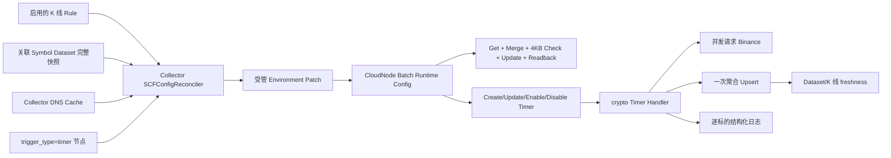

# SCF 定时触发行情采集执行计划

> **For agentic workers:** REQUIRED SUB-SKILL: Use superpowers:subagent-driven-development (recommended) or superpowers:executing-plans to implement this plan task-by-task. Steps use checkbox (`- [ ]`) syntax for tracking.

**Goal:** 将实时 K 线从 Collector 逐节点调用改为腾讯云 Timer Trigger 直接触发，并由 Collector 统一协调每节点任务和公共 DNS 环境变量，在保持多地域出口能力的同时消除本地 Invoke 排队、缩短延迟和降低无效 SCF 运行成本。

**Implementation status (2026-08-05):** Task 1-10 的代码、测试和独立 codeCR 已完成；本轮线上发布与全量 Timer 数据验证已经执行，详见第 6 节。Collector/CloudNode/Storage-node 已部署并运行，49 个 SCF 节点已完成地域与 Timer 元数据核验，CLS 已验证连续 3 个完整 1m 周期覆盖 478 个 active symbol。Storage view 在 EventBus 重启后曾出现 outbox/消费积压，已通过 DataNode relay 超时保护、重启恢复和 view consumer 重启处理；最终 Storage view 水位仍需继续追平后，才能把第 8 项“Storage 查询连续 3 轮”标记为完全闭环。Task 1-10 中的“先运行失败测试”是实现方法说明，不代表本次交付伪造了未执行的红灯证据。

**Architecture:** Collector 只做控制面协调：读取启用规则和完整 Symbol Dataset，按每函数最多 30 个标的确定性分片，将节点私有任务与公共 DNS 一次提交给 CloudNode。CloudNode 持有腾讯凭据，合并完整函数 Environment、协调 Timer Trigger 并回读；SCF 每次被 Timer 触发后从环境变量读取任务，并发请求行情、聚合后一次写 Storage，实时链路不再依赖 Collector、Admin、CloudNode Invoke 或 EventBus Completion。

**Tech Stack:** Go 1.25、tRPC-Go Timer、Tencent Cloud SCF Go SDK v1.1.0、SQLite/GORM、Storage tRPC、Vue 3、TypeScript、Vitest、CLS。

## Global Constraints

- 本项目尚未上线，不保留旧实时 Invoke 调度、旧表数据或兼容分支；切换时清空重建 Collector/CloudNode 运行数据。
- SCF 固定 64MB、15 秒；函数内 HTTP 并发继续由环境变量配置。
- Timer Trigger 是异步调用，仍计入地域和命名空间 SCF 并发，不能写成“规避腾讯并发限制”。
- 一个定时函数只承载一个 `provider + market_type + dataset_id + frequency`，标的总数不超过 30；完整 Environment 预算不足时，Collector 会在 30 以内继续拆小分片。
- 不实现双版本任务快照、分布式锁、全局 exactly-once、预置并发或复杂错峰；所有同频节点在同一秒触发。
- 允许配置切换期间少量重复采集；Storage RowKey Upsert 是数据幂等边界。
- Collector 不持有腾讯云密钥；所有腾讯 SCF 查询、环境变量更新和 Trigger 操作都由 CloudNode 完成。
- DNS 和任务只能由一个协调器合并后提交，不能有两个 Timer 分别修改整份函数 Environment。
- 定时实时函数不携带 EventBus/Collector 控制面凭据，不发布每分钟 Completion；数据是否成功以 Storage 最新水位、Dataset freshness 和 CLS 明细为准。
- `InvokeFunction` 仅保留给 `egress_probe`、Symbol 全量快照、有界补采和人工 E2E，不得重新进入实时每分钟链路。

---

## 1. 设计原因与官方边界

### 1.1 为什么不再由 Collector 每分钟 Invoke

当前链路是：

```text
Collector Timer -> 本地分片/排队 -> Gateway -> CloudNode -> Tencent Invoke
  -> SCF -> Binance -> Storage -> EventBus Completion
```

2026-08-04 的线上证据显示，同一分钟生成 44 个分片，而 Collector Invoke 并发槽只有 20。`moox-fetcher-crypto-market-ap-shanghai-5` 的计划时间为 16:31:00.080，实际下发时间为 16:31:09.498；其中 `SPYB-USDT` 的行情请求本身只耗时约 293ms。因此 8 至 10 秒尾延迟主要发生在 MooX 控制面排队，而不是 Binance 请求。

腾讯 Timer 在到点后直接调用函数，属于 Push 模型和异步调用。它可以去掉 MooX 本地逐节点 Invoke 排队及对 Collector/Gateway 在线状态的实时依赖，但每个事件仍是一次函数执行，仍受 SCF 并发限制。[定时触发器说明](https://cloud.tencent.com/document/product/583/9708)、[SCF 工作原理](https://cloud.tencent.com/document/product/583/9694/)、[并发超限](https://cloud.tencent.com/document/product/583/51585)

### 1.2 为什么任务放环境变量而不是每次请求配置接口

- 每分钟让所有 SCF 请求 Collector/Admin 配置接口会新增中心依赖、目标机流量和一段网络延迟。
- 每个函数有独立 Environment，可保存不同的标的分片；“公共 DNS”由 Collector 生成后复制到每个函数，并非腾讯云提供一份全局环境变量。
- 用户允许重复 K 线，配置原地更新即可；不需要维护旧、新双版本快照。
- 腾讯 `UpdateFunctionConfiguration` 会更新函数配置，CloudNode 必须整份读取、合并、写回和验证，不能让 Collector 直接掌握腾讯凭据。[环境变量](https://cloud.tencent.com/document/product/583/30228)、[更新函数配置](https://cloud.tencent.com/document/api/583/18580)

### 1.3 为什么限制 30 个标的

每个函数环境变量总大小上限为 4KB，单函数同类型 Trigger 上限为 10 个；本方案每函数只用一个 Timer Trigger。30 是业务容量上限，Collector 先按约 1.8KB 的受管 Environment 预算拆分，为无法提前知道的 provider、代码包、CLS、Storage 变量留出空间；完整 Environment 仍必须由 CloudNode 逐次校验，不允许以“标的没有超过 30”代替 4KB 校验。[配额限制](https://cloud.tencent.com/document/product/583/11637)

定时函数不再注入 EventBus、Collector 和 Service Gateway 控制面变量，只保留 Storage、CLS、行情执行参数、任务和 DNS。Collector 还会用真实 DNS/任务内容计算受管 Environment 字节数；在调用 CloudNode 前预留 provider 变量空间，超长合法标的会自动拆分而不是永久协调失败。这样既减少 Secret 暴露，也为 4KB 环境限制留出空间。

## 2. 目标运行链路



### 2.1 环境变量契约

| Key | 所有者 | 规则 |
| --- | --- | --- |
| `MOOX_MARKET_FETCH_PROVIDER` | Collector | 第一版仅 `binance` |
| `MOOX_MARKET_FETCH_MARKET_TYPE` | Collector | `spot` 或 `swap` |
| `MOOX_MARKET_FETCH_DATASET_ID` | Collector | 一个函数只写一个 Dataset |
| `MOOX_MARKET_FETCH_FREQUENCY` | Collector | 规范化为 `1m`、`1h` 等 |
| `MOOX_MARKET_FETCH_SUBJECTS` | Collector | 字典序、`\|` 分隔、1 至 30 个 |
| `MOOX_MARKET_FETCH_SYMBOLS_JSON` | Collector | `subject_id -> 外部行情 symbol` 的紧凑 JSON；禁止 SCF 根据 SubjectID 猜 symbol |
| `MOOX_MARKET_FETCH_ASSIGNMENT_HASH` | Collector | SHA-256 前 16 个十六进制字符；不包含更新时间 |
| `MOOX_MARKET_FETCH_DNS_ROUTES_JSON` | Collector | 紧凑 JSON：`host -> []IP` |
| `MOOX_MARKET_FETCH_DNS_HASH` | Collector | 基于排序后的 host/IP；不含解析时间 |
| `MOOX_MARKET_FETCH_DNS_UPDATED_AT` | Collector | 最近成功解析时间 RFC3339 |
| `MOOX_STORAGE_RPC_GATEWAY_TARGET` | 发布 CLI/CloudNode | 定时函数固定 Storage 数据面地址，不由 Timer event 提供；来源为 `scf_fetcher.spaces[].storage_rpc_gateway_target` |
| `MOOX_FETCH_MAX_INFLIGHT_REQUESTS` | 发布 CLI/CloudNode | 函数内部 HTTP 并发 |
| `MOOX_FETCH_REQUEST_TIMEOUT_MS` | 发布 CLI/CloudNode | 单次行情 HTTP 超时 |
| `MOOX_FETCH_STORAGE_TIMEOUT_MS` | 发布 CLI/CloudNode | 聚合 Storage 写入超时，默认 5000ms |

任务值示例：

```text
MOOX_MARKET_FETCH_PROVIDER=binance
MOOX_MARKET_FETCH_MARKET_TYPE=spot
MOOX_MARKET_FETCH_DATASET_ID=dataset_binance_spot_kline_1m
MOOX_MARKET_FETCH_FREQUENCY=1m
MOOX_MARKET_FETCH_SUBJECTS=BTC-USDT|ETH-USDT|SOL-USDT
MOOX_MARKET_FETCH_SYMBOLS_JSON={"BTC-USDT":"BTCUSDT","ETH-USDT":"ETHUSDT","SOL-USDT":"SOLUSDT"}
MOOX_MARKET_FETCH_ASSIGNMENT_HASH=4c90f2de37e18b6a
MOOX_MARKET_FETCH_DNS_ROUTES_JSON={"api.binance.com":["1.2.3.4"],"data-api.binance.vision":["5.6.7.8"]}
MOOX_MARKET_FETCH_DNS_HASH=6db17155f0f0d241
MOOX_MARKET_FETCH_DNS_UPDATED_AT=2026-08-04T08:00:00Z
MOOX_STORAGE_RPC_GATEWAY_TARGET=ip://106.53.107.122:11003
```

`MOOX_STORAGE_RPC_GATEWAY_TARGET` 是部署时写入的固定数据面地址，避免 SCF 每次触发再请求 Collector 配置接口。它不是由 Collector 每分钟变更的受管任务键；Collector 只负责把当前 DNS 快照和任务分片更新到相应函数环境。公共 DNS 的“公共”表示所有函数复制同一份快照，不表示腾讯云存在跨函数共享环境变量。

### 2.2 节点字段契约

Timer 触发的仍是 SCF Event Function，不把两个概念塞进一个枚举：

```text
node_type=scf-event, trigger_type=timer   # 实时 K 线
node_type=scf-event, trigger_type=invoke  # 探针、Symbol、补采、人工 E2E
```

新增 `t_cloud_nodes.c_trigger_type`，值只允许空串、`invoke`、`timer`。`scf-event` 创建时空值规范化为 `invoke`；`scf-web` 和 `server` 必须为空。定时节点的实际 Trigger 名称、cron、开关、腾讯状态和最近协调时间保存在非敏感 `c_metadata`，不新增更多列。

### 2.3 分片规则

1. Collector 读取所有启用 K 线 Rule，按 `provider/market_type/dataset_id/frequency` 排序。
2. 每个 Rule 从关联 Symbol Dataset 读取完整 active 快照；按 `subject_id` 排序并去重。
3. 每 30 个标的切一个 shard；一个 shard 对应一个定时节点。
4. 定时节点先按地域分组、组内按 `node_id` 排序，再按地域轮询展开，避免排序结果只使用一个地域。
5. shard 数大于定时节点数时，本轮整体失败并保留旧配置，同时上报“容量不足”；不允许只下发前 N 个 shard。
6. 多余节点写入空任务并关闭 Trigger，不产生每分钟空调用费用。
7. Rule、Symbol 或 DNS 内容没有变化时，哈希相同的节点不调用腾讯配置接口。

8. Symbol Dataset 返回的 `external_symbol` 必须随分片一起固化。Collector 写入
   `MOOX_MARKET_FETCH_SYMBOLS_JSON`，SCF 只使用该映射请求交易所，不能通过删除连字符等启发式规则猜 symbol；缺失或冲突映射直接让本轮协调失败。

### 2.4 频率与 cron

第一期支持下面的确定映射，未支持频率直接拒绝启用 Timer：

| Frequency | Tencent 7-field cron |
| --- | --- |
| `1m` | `0 * * * * * *` |
| `5m` | `0 */5 * * * * *` |
| `15m` | `0 */15 * * * * *` |
| `30m` | `0 */30 * * * * *` |
| `1h` | `0 0 * * * * *` |
| `4h` | `0 0 */4 * * * *` |
| `1d` | `0 0 0 * * * *` |

本期所有同频节点同秒触发，不加入随机错峰。Trigger Name 固定为 `moox-market-fetch-timer`，Message 固定为 `market_fetch_timer_v1`，任务不写入 Message。

## 3. 文件结构

| 路径 | 责任 |
| --- | --- |
| `modules/cloudnode/schema/cloudnode.sql` | 新增 `c_trigger_type` |
| `modules/cloudnode/proto/cloudnode.proto` | Trigger 类型字段与批量运行配置 RPC |
| `modules/cloudnode/internal/providers/tencentscf/trigger.go` | Tencent Timer Trigger SDK 封装 |
| `modules/cloudnode/internal/rpc/function_lock.go` | 部署与运行配置更新共用的函数级互斥 |
| `modules/cloudnode/internal/rpc/runtime_config.go` | 受管环境合并、4KB 校验、Trigger 协调和回读 |
| `modules/cloudnode/internal/rpc/node_batch_runner.go` | 新增 runtime-config batch operation |
| `modules/collector/internal/marketfetch/assignment.go` | 规则/Symbol 到稳定 shard 的纯函数 |
| `modules/collector/internal/marketfetch/environment.go` | 任务与 DNS 环境变量编解码、哈希 |
| `modules/collector/internal/marketfetch/reconciler.go` | Collector 控制面协调 |
| `modules/collector/internal/dnscache/cache.go` | 稳定公共 DNS 快照，不再随 request 发送 |
| `modules/collector/internal/serverless/crypto/timer.go` | Timer event 与环境变量解析 |
| `modules/collector/internal/marketfetch/executor.go` | 复用有界并发和一次 Storage 写入 |
| `modules/collector/internal/scfinvoker/client.go` | 定时节点查询与 runtime-config batch 提交 |
| `modules/cli/internal/command/collector.go` | 定时节点发布、精简环境和 Trigger 初始配置 |
| `web/src/views/collector/cloud-node/` | 节点类型、触发方式和 Timer 状态展示 |
| `modules/monitor/internal/bootstrap/` | 协调状态、Trigger 状态与数据 freshness 告警 |

## 4. 实施任务

### Task 1: 固定 CloudNode 触发方式字段与 Proto 契约

**Files:**
- Modify: `modules/cloudnode/schema/cloudnode.sql:3-23`
- Modify: `modules/cloudnode/internal/store/models.go:5-30`
- Modify: `modules/cloudnode/internal/store/node.go:14-82`
- Modify: `modules/cloudnode/proto/cloudnode.proto:73-228`
- Modify: `modules/cloudnode/proto/cloudnode.proto:587-596`
- Modify: `modules/cloudnode/internal/rpc/node.go:27-80`
- Test: `modules/cloudnode/internal/store/catalog_test.go`
- Test: `modules/cloudnode/internal/rpc/node_test.go`

**Interfaces:**
- Produces: `CloudNode.trigger_type`, `GetNodeListReq.trigger_type`, `NodeCreateItem.trigger_type`。
- Produces: `SubmitUpdateNodeRuntimeConfigs(BatchUpdateNodeRuntimeConfigsReq) returns (SubmitNodeBatchRsp)`。

- [ ] **Step 1: 先写字段规范化和持久化失败测试**

```go
func TestNormalizeTriggerType(t *testing.T) {
    require.Equal(t, "invoke", normalizeTriggerType("scf-event", ""))
    require.Equal(t, "timer", normalizeTriggerType("scf-event", "timer"))
    require.Equal(t, "", normalizeTriggerType("server", ""))
    require.Error(t, validateTriggerType("server", "timer"))
}
```

Store 测试必须证明 `trigger_type=timer` 可写入、读取和过滤；不能只检查 Proto 字段存在。

- [ ] **Step 2: 运行测试确认先失败**

Run: `cd modules/cloudnode && go test ./internal/store ./internal/rpc -run 'TriggerType|CloudNode' -count=1`

Expected: FAIL，提示 `TriggerType` 或 `GetTriggerType` 尚不存在。

- [ ] **Step 3: 修改 schema、store 和 Proto**

Schema 使用：

```sql
c_node_type TEXT NOT NULL DEFAULT 'scf-event',
c_trigger_type TEXT NOT NULL DEFAULT '',
```

Proto 增加：

```proto
enum NodeBatchOperation {
  NODE_BATCH_OPERATION_UNSPECIFIED = 0;
  NODE_BATCH_OPERATION_CREATE_NODES = 1;
  NODE_BATCH_OPERATION_DEPLOY_NODES = 2;
  NODE_BATCH_OPERATION_DELETE_NODES = 3;
  NODE_BATCH_OPERATION_UPDATE_RUNTIME_CONFIGS = 4;
}

message NodeRuntimeConfigPatch {
  string node_id = 1;
  map<string, string> managed_environment = 2;
  bool timer_enabled = 3;
  string timer_cron = 4;
}

message BatchUpdateNodeRuntimeConfigsReq {
  repeated NodeRuntimeConfigPatch nodes = 1;
}
```

`CloudNode` 使用字段号 28、`GetNodeListReq` 使用字段号 8、`NodeCreateItem` 使用字段号 12，均命名 `trigger_type`。本项目绿色重建，不在 `MigrateLegacySchema` 增加兼容 ALTER；上线 Task 10 删除 CloudNode SQLite 后重建。

- [ ] **Step 4: 串行生成 Proto 并运行测试**

Run: `cd modules/cloudnode/proto && make all`

Run: `cd modules/cloudnode && go test ./internal/store ./internal/rpc -count=1`

Expected: PASS。Proto 生成和测试不得并行，避免读取中间生成文件。

- [ ] **Step 5: 提交**

```bash
git add modules/cloudnode/schema modules/cloudnode/proto modules/cloudnode/internal/store modules/cloudnode/internal/rpc/node.go
git commit -m "feat(cloudnode): record SCF trigger type"
```

### Task 2: 封装 Tencent Timer Trigger 生命周期

**Files:**
- Create: `modules/cloudnode/internal/providers/tencentscf/trigger.go`
- Create: `modules/cloudnode/internal/providers/tencentscf/trigger_test.go`
- Modify: `modules/cloudnode/internal/rpc/server.go:34-70`
- Modify: `modules/cloudnode/internal/rpc/node.go:154-310`

**Interfaces:**
- Produces: `EnsureTimerTrigger(ctx, TimerTriggerRequest) (*TimerTrigger, error)`。
- Produces: `DeleteTimerTrigger(ctx, TimerTriggerRequest) error`。
- Consumes: Tencent SDK `CreateTrigger`, `ListTriggers`, `UpdateTrigger`, `DeleteTrigger`。

- [ ] **Step 1: 写请求映射与幂等协调测试**

```go
type TimerTriggerRequest struct {
    FunctionRef
    Name       string
    Cron       string
    Enabled    bool
    Qualifier  string
    Message    string
}

type TimerTrigger struct {
    Name            string
    Cron            string
    Enabled         bool
    AvailableStatus string
    Qualifier       string
}
```

测试覆盖：不存在时创建、cron 不同时更新、开关不同时更新、完全一致时零写入、同名非 timer 时失败、删除不存在视为成功。`TriggerDesc` 直接使用七段 cron，`CustomArgument=market_fetch_timer_v1`。

- [ ] **Step 2: 运行 Provider 测试确认先失败**

Run: `cd modules/cloudnode && go test ./internal/providers/tencentscf -run TimerTrigger -count=1`

Expected: FAIL，提示 Timer Trigger 类型或方法不存在。

- [ ] **Step 3: 实现 SDK 封装**

确定性请求必须包含：

```go
request.Type = common.StringPtr("timer")
request.TriggerName = common.StringPtr(req.Name)
request.TriggerDesc = common.StringPtr(req.Cron)
request.Enable = common.StringPtr(map[bool]string{true: "OPEN", false: "CLOSE"}[req.Enabled])
request.Qualifier = common.StringPtr(firstNonEmpty(req.Qualifier, "$LATEST"))
request.CustomArgument = common.StringPtr(req.Message)
```

`ListTriggers` 必须分页并只匹配确定名称，不能假定第一页完整。更新后再次 List 回读 `cron/enabled/AvailableStatus`。

- [ ] **Step 4: 将 Trigger 纳入节点生命周期**

- `trigger_type=timer` 创建/部署成功后确保 Trigger 存在。
- 没有任务时 Trigger 初始为 `CLOSE`，避免刚创建就空跑。
- 删除函数前先删除确定名称的 Timer Trigger；删除 Trigger 失败则本次删除失败，不能留下不清楚的部分状态。
- `trigger_type=invoke` 不创建 Timer。

- [ ] **Step 5: 运行测试并提交**

Run: `cd modules/cloudnode && go test ./internal/providers/tencentscf ./internal/rpc -count=1`

Expected: PASS。

```bash
git add modules/cloudnode/internal/providers/tencentscf modules/cloudnode/internal/rpc
git commit -m "feat(cloudnode): manage SCF timer triggers"
```

### Task 3: 增加受管 Environment 批量协调

**Files:**
- Create: `modules/cloudnode/internal/rpc/function_lock.go`
- Create: `modules/cloudnode/internal/rpc/runtime_config.go`
- Create: `modules/cloudnode/internal/rpc/runtime_config_test.go`
- Modify: `modules/cloudnode/internal/rpc/node.go:376-456`
- Modify: `modules/cloudnode/internal/rpc/node_batch_runner.go:1-180`
- Modify: `modules/cloudnode/internal/rpc/node_batch.go:1-150`
- Modify: `modules/cloudnode/internal/store/node.go:96-161`

**Interfaces:**
- Consumes: Task 1 的 `NodeRuntimeConfigPatch`。
- Produces: 异步 `NODE_BATCH_OPERATION_UPDATE_RUNTIME_CONFIGS` Job，每节点返回更新或 no-op 结果。

- [ ] **Step 1: 写环境合并、安全边界和竞态测试**

受管 Key 白名单固定为：

```go
var collectorManagedEnvironment = map[string]struct{}{
    "MOOX_MARKET_FETCH_PROVIDER": {},
    "MOOX_MARKET_FETCH_MARKET_TYPE": {},
    "MOOX_MARKET_FETCH_DATASET_ID": {},
    "MOOX_MARKET_FETCH_FREQUENCY": {},
    "MOOX_MARKET_FETCH_SUBJECTS": {},
    "MOOX_MARKET_FETCH_ASSIGNMENT_HASH": {},
    "MOOX_MARKET_FETCH_DNS_ROUTES_JSON": {},
    "MOOX_MARKET_FETCH_DNS_HASH": {},
    "MOOX_MARKET_FETCH_DNS_UPDATED_AT": {},
}
```

测试必须证明：未知 Key 被拒绝；现有 Secret 和代码包 ID 被保留；相同环境和 Trigger 配置不调用 Tencent Update；超过环境限制在本地失败；部署和 runtime patch 同节点并发时不会丢字段。

- [ ] **Step 2: 运行 race 测试确认先失败**

Run: `cd modules/cloudnode && go test -race ./internal/rpc -run 'RuntimeConfig|FunctionLock' -count=1`

Expected: FAIL，提示 runtime config handler 尚不存在。

- [ ] **Step 3: 实现函数级互斥和完整 Environment 合并**

锁 Key 固定为：

```go
func functionLockKey(ref tencentscf.FunctionRef) string {
    return strings.Join([]string{ref.Region, ref.Namespace, ref.FunctionName}, "\x00")
}
```

部署更新和 runtime patch 必须共用同一个 keyed mutex。Patch 流程严格为：

```text
GetFunction -> merge allowlisted keys -> validate full environment size
-> UpdateFunctionConfiguration -> wait Active -> GetFunction readback
-> EnsureTimerTrigger -> persist non-secret hashes/status in metadata
```

环境字节计算使用 UTF-8 `len(key)+1+len(value)+1`，完整结果必须 `<=4096`；错误信息要包含当前字节数和限制，但不能打印 Environment 值。

- [ ] **Step 4: 接入 NodeBatch runner**

`SubmitUpdateNodeRuntimeConfigs` 做以下验证后落异步 Job：节点数 1 至 100、Node ID 不重复、目标节点必须 `node_type=scf-event && trigger_type=timer`、cron 必须在允许映射中。每个 Item 的 `request_json` 仍由 CloudNode SQLite 0600 文件保护，日志不输出其内容。

成功后仅在 `c_metadata` 保存：

```json
{
  "assignment_hash": "...",
  "assignment_count": 30,
  "dns_hash": "...",
  "dns_updated_at": "...",
  "timer_trigger_name": "moox-market-fetch-timer",
  "timer_cron": "0 * * * * * *",
  "timer_enabled": true,
  "timer_available_status": "Available",
  "runtime_config_reconciled_at": "2026-08-04T08:00:00Z"
}
```

- [ ] **Step 5: 运行 CloudNode 全模块测试并提交**

Run: `cd modules/cloudnode && go test -race ./... -count=1`

Expected: PASS。

```bash
git add modules/cloudnode/internal/rpc modules/cloudnode/internal/store
git commit -m "feat(cloudnode): reconcile managed SCF runtime config"
```

### Task 4: 构建 Collector 稳定分片与公共 DNS Environment

**Files:**
- Create: `modules/collector/internal/marketfetch/assignment.go`
- Create: `modules/collector/internal/marketfetch/assignment_test.go`
- Create: `modules/collector/internal/marketfetch/environment.go`
- Create: `modules/collector/internal/marketfetch/environment_test.go`
- Modify: `modules/collector/internal/dnscache/cache.go:20-170`
- Modify: `modules/collector/internal/dnscache/cache_test.go`

**Interfaces:**
- Produces: `BuildAssignments(groups []TaskGroup, nodes []scfinvoker.Node, maxSubjects int) ([]NodeAssignment, error)`。
- Produces: `BuildManagedEnvironment(NodeAssignment, dnscache.Snapshot) (map[string]string, error)`。

- [ ] **Step 1: 写纯函数测试**

```go
type TaskGroup struct {
    Provider   string
    MarketType string
    DatasetID  string
    Frequency  string
    Subjects   []string
}

type NodeAssignment struct {
    NodeID       string
    Group        TaskGroup
    Subjects     []string
    Cron         string
    Enabled      bool
    AssignmentHash string
}
```

覆盖：479 个标的生成 16 个 shard；每 shard 不超过 30；输入乱序仍得到相同映射；节点按地域轮询；节点不足整体报错；富余节点 `Enabled=false`；不支持的 frequency 报错。

- [ ] **Step 2: 运行测试确认先失败**

Run: `cd modules/collector && go test ./internal/marketfetch ./internal/dnscache -run 'Assignment|Environment|DNS' -count=1`

Expected: FAIL，提示新类型或方法不存在。

- [ ] **Step 3: 实现 DNS 公共变量序列化**

环境 JSON 固定为：

```go
type EnvironmentDNSRoutes map[string][]string
```

规范化规则：host 小写并去结尾点；IP 使用 `net.ParseIP` 验证；每个 host 去重、排序并最多保留 4 个地址；JSON 使用 `json.Marshal` 紧凑输出。Hash 只覆盖 host/IP，不包含 `ResolvedAt`；`updated_at` 单独取所有有效 route 中最新时间。

全部域名解析失败时沿用 `Cache` 里的最后成功快照，绝不生成空公共变量覆盖云端旧值。`Snapshot()` 注释改为“用于 SCF 环境协调”，不再称“embedding in a task request”。

- [ ] **Step 4: 实现任务哈希和环境组装**

`MOOX_MARKET_FETCH_SUBJECTS` 使用 `|`，Subject 必须匹配 `^[A-Z0-9][A-Z0-9-]{0,31}$`，防止分隔符注入。任务 Hash 覆盖 provider、market type、dataset、frequency 和排序后的 subjects；时间字段不参与。

- [ ] **Step 5: 运行 race 测试并提交**

Run: `cd modules/collector && go test -race ./internal/marketfetch ./internal/dnscache -count=1`

Expected: PASS。

```bash
git add modules/collector/internal/marketfetch modules/collector/internal/dnscache
git commit -m "feat(collector): build stable SCF timer assignments"
```

### Task 5: 实现 Collector 统一配置协调器

**Files:**
- Create: `modules/collector/internal/marketfetch/reconciler.go`
- Create: `modules/collector/internal/marketfetch/reconciler_test.go`
- Modify: `modules/collector/internal/scfinvoker/client.go:30-148`
- Modify: `modules/collector/internal/scfinvoker/client_test.go`
- Modify: `modules/collector/internal/bootstrap/bootstrap.go:92-270`
- Modify: `modules/collector/config/trpc_go.yaml:34-45`

**Interfaces:**
- Consumes: Task 3 的 `SubmitUpdateNodeRuntimeConfigs`。
- Consumes: Task 4 的 assignment/environment 纯函数。
- Produces: `SCFConfigReconciler.Reconcile(ctx, spaceID) error`。

- [ ] **Step 1: 写 Reconciler 行为测试**

```go
type SCFConfigReconciler struct {
    Rules       RuleSource
    Symbols     SymbolSource
    Nodes       RuntimeConfigClient
    DNS         DNSSnapshotter
    MaxSubjects int
}
```

测试覆盖：读取启用 K 线规则和完整 Symbol 快照；只选 `trigger_type=timer` 节点；DNS 和任务在同一个 Patch；hash 与 CloudNode metadata 一致时不提交；只更新变化节点；容量不足时零提交；有正在运行的 runtime-config job 时不重复提交。

- [ ] **Step 2: 运行测试确认先失败**

Run: `cd modules/collector && go test ./internal/marketfetch ./internal/scfinvoker -run 'Reconcile|RuntimeConfig|TimerNode' -count=1`

Expected: FAIL。

- [ ] **Step 3: 扩展 CloudNode 客户端**

`scfinvoker.Node` 增加 `NodeType`、`TriggerType`，`ListMarketFetchers` 请求携带 `trigger_type=timer`。新增：

```go
type RuntimeConfigClient interface {
    ListMarketFetchers(context.Context, string, string) ([]Node, error)
    SubmitRuntimeConfigs(context.Context, string, []*cloudnodepb.NodeRuntimeConfigPatch) (string, error)
    GetBatch(context.Context, string, string) (*cloudnodepb.GetNodeBatchChangeRsp, error)
}
```

HTTP 仍走现有签名 Service Gateway，Collector 不接触腾讯 Secret。

- [ ] **Step 4: 将 DNS 和任务接到同一个 Collector tRPC Timer**

Collector 启动时先做一次 DNS refresh；随后由独立的 5 分钟 DNS timer 更新内存快照。配置协调使用现有 `collector.schedule.timer`，第一期每分钟执行一次：读取启用规则、完整 Symbol Dataset 和 `trigger_type=timer` 节点，合并当前 DNS 快照后一次提交 CloudNode runtime-config batch。Timer handler 只负责快速启动受控 goroutine，不把腾讯 API 调用同步阻塞在 timer 请求上；Reconciler 串行保护完整的读取、分片、状态检查到提交过程，并使用待提交 fingerprint 避免重复更新。每次节点列表读取还会由 CloudNode 以最多 16 个并发、每节点并行的双只读请求回查腾讯 Function/Trigger，校验固定协议字段并发布真实可用状态及每节点剩余 Environment 预算；发现 Trigger 漂移时下一次协调重新提交，由 CloudNode Ensure 修复；Collector 按最小预算继续拆分标的，规则或节点删除时清理旧协调指标。Rule、Symbol 或 DNS 变化无需再让 SCF 请求 Collector 配置接口。

启动顺序：初始 DNS refresh -> 初始规则/Symbol inventory -> 注册 DNS timer 和配置协调 timer。初始协调失败不阻止 Collector 启动，但必须通过日志、Reporter 和 Storage freshness 暴露；下一分钟继续重试。DNS 更新只更新缓存，由下一次统一协调把 DNS 与任务放进同一个函数 Environment patch，不能有两个协程分别覆盖完整 Environment。

- [ ] **Step 5: 运行 Collector 测试并提交**

Run: `cd modules/collector && go test -race ./internal/marketfetch ./internal/scfinvoker ./internal/bootstrap -count=1`

Expected: PASS。

```bash
git add modules/collector/internal/marketfetch modules/collector/internal/scfinvoker modules/collector/internal/bootstrap modules/collector/config
git commit -m "feat(collector): reconcile SCF timer configuration"
```

### Task 6: 将 crypto SCF 改为 Timer 环境任务

**Files:**
- Create: `modules/collector/internal/serverless/crypto/timer.go`
- Create: `modules/collector/internal/serverless/crypto/timer_test.go`
- Modify: `modules/collector/internal/serverless/crypto/handler.go:21-114`
- Modify: `modules/collector/internal/serverless/crypto/handler_test.go`
- Modify: `modules/collector/internal/marketfetch/handler.go:20-102`
- Modify: `modules/collector/internal/marketfetch/executor.go:30-115`
- Modify: `modules/collector/internal/marketfetch/executor_test.go`
- Modify: `modules/collector/internal/sources/interface.go:99-128`

**Interfaces:**
- Consumes: Tencent Timer event `{Type, TriggerName, Time, Message}`。
- Consumes: Task 4 环境变量契约。
- Produces: 一次 realtime `marketfetch.Request` 和一次聚合 Storage 写入。

- [ ] **Step 1: 写 Timer event 与环境解析测试**

```go
type TimerEvent struct {
    Type        string `json:"Type"`
    TriggerName string `json:"TriggerName"`
    Time        string `json:"Time"`
    Message     string `json:"Message"`
}
```

测试覆盖：只接受 `Type=Timer`、固定 Trigger Name/Message；缺任务返回明确配置错误；最多 30 个 Subject；非法 DNS JSON 只告警并返回空 DNS route；环境 `frequency=1m` 根据 event Time 生成稳定 batch ID 和目标已收盘时间。

- [ ] **Step 2: 运行测试确认先失败**

Run: `cd modules/collector && go test ./internal/serverless/crypto ./internal/marketfetch -run 'Timer|EnvironmentRequest' -count=1`

Expected: FAIL。

- [ ] **Step 3: 实现 Timer Handler**

Timer batch ID 固定为：

```go
sha256(functionName + "\x00" + event.Time + "\x00" + assignmentHash)
```

Handler 从 `MOOX_STORAGE_RPC_GATEWAY_TARGET` 建 Storage，不再要求 event 携带 target。每个 Subject 转成实时 `CollectionItem`，`BarLimit=3`，调用现有 `Executor.Execute`。DNS route 注入内部 Request，但删除 JSON invocation contract 的 `dns_routes` 字段，避免事件和环境双真值。

- [ ] **Step 4: 删除 Timer 路径的 Completion 发布**

Timer Handler 在 Storage 成功后直接返回；不初始化 EventBus Publisher，不预留 3 秒 Completion 窗口。单标的 429、网络、5xx 或 Storage 错误写 CLS 结构化结果；下一分钟最近 3 根已收盘 K 线自然覆盖短暂失败。超过 3 根的缺口交给独立 Gap Audit/Catchup Invoke。

保留按需 `market_fetch` event handler 给 `trigger_type=invoke` 节点使用，不能删除 `egress_probe`。两条路径共享 Executor，但 Timer 入口不得接受调用方传任务。

- [ ] **Step 5: 运行 SCF 测试并提交**

Run: `cd modules/collector && go test -race ./internal/serverless/crypto ./internal/marketfetch ./internal/sources/... -count=1`

Expected: PASS，且测试证明 Timer 成功只调用一次 `Storage.UpsertFields`、不调用 EventBus Publish。

```bash
git add modules/collector/internal/serverless/crypto modules/collector/internal/marketfetch modules/collector/internal/sources
git commit -m "feat(collector): run realtime fetch from SCF timer env"
```

### Task 7: 退役实时 Invoke/Completion 状态机

**Files:**
- Modify: `modules/collector/internal/marketfetch/scheduler.go`
- Modify: `modules/collector/internal/marketfetch/scheduler_test.go`
- Modify: `modules/monitor/internal/bootstrap/market_fetch.go`
- Modify: `modules/monitor/internal/bootstrap/market_fetch_freshness.go`
- Modify: `modules/monitor/internal/bootstrap/runtime.go`
- Delete: `modules/monitor/internal/marketfetch/consumer.go`
- Delete: `modules/monitor/internal/marketfetch/consumer_test.go`

**Interfaces:**
- Preserves: Symbol snapshot、bounded catchup、`egress_probe` 和人工 E2E Invoke。
- Removes: realtime `dispatchPlanned`、realtime failover、每分钟 BatchInvocation/RetryItem、Monitor Completion freshness。
- Preserves: Catchup 使用的 `BatchInvocation`、`RetryItem` 和 Collector Completion Consumer。

- [ ] **Step 1: 写边界测试**

测试必须证明：实时 K 线 tick 只调用 Reconciler，不调用 `Invoker.Invoke`；Symbol snapshot 和 catchup 仍可 Invoke；Monitor 不再因缺 Completion 告警；Dataset/K 线过期仍会告警。

- [ ] **Step 2: 运行测试确认旧行为与目标冲突**

Run: `cd modules/collector && go test ./internal/marketfetch ./internal/bootstrap -run 'RealtimeDoesNotInvoke|CatchupStillInvokes' -count=1`

Run: `cd modules/monitor && go test ./internal/bootstrap -run 'MarketFetch|Dataset|Canary' -count=1`

Expected: 新测试 FAIL。

- [ ] **Step 3: 拆分并删除实时状态机**

删除实时路径的 `invokeSem`、`dispatchPlanned`、immediate failover 和逐分钟 completion/retry。将仍由按需 Invoke 使用的 Symbol snapshot 与 Catchup 调度移入 `invoke_scheduler.go`；`BatchInvocation`、`RetryItem` 和 Collector Completion Consumer 明确保留且只服务 Catchup，不再记录 realtime Timer。Schema 本任务不做条件式删除，避免把仍在使用的补采状态误删。

禁止留下 `if timerMode { ... } else { oldRealtime... }` 兼容分支。新项目只保留一个实时执行模型。

- [x] **Step 4: 简化 Monitor**

删除 `market_fetch:*` Completion 消费和“尚未收到行情采集完成回执”告警。Collector 通过统一 metrics reporter 上报最近成功协调、required/active 分片和每个 Timer Trigger 回读状态；Monitor 消费这些指标，并与现有 Dataset/K 线 freshness 合并为中文告警，包含 assigned/required nodes、最后协调时间或 Trigger 节点。

- [ ] **Step 5: 运行模块测试并提交**

Run: `cd modules/collector && go test -race ./... -count=1`

Run: `cd modules/monitor && go test -race ./... -count=1`

Expected: PASS。

```bash
git add modules/collector modules/monitor
git commit -m "refactor(collector): retire realtime SCF invoke scheduling"
```

### Task 8: 发布 CLI 使用 Timer 节点和精简环境

**Files:**
- Modify: `modules/cli/internal/adminclient/cloudnode.go`
- Modify: `modules/cli/internal/adminclient/cloudnode_test.go`
- Modify: `modules/cli/internal/command/collector.go:1246-1648`
- Modify: `modules/cli/internal/command/collector_test.go`
- Modify: `moox.toml`

**Interfaces:**
- Produces: `node_type=scf-event, trigger_type=timer` 的 realtime fetcher。
- Produces: 不含 EventBus/Collector 控制面凭据的 timer Environment profile。

- [ ] **Step 1: 写发布请求和环境预算测试**

测试证明 market fetcher 默认 `TriggerType=timer`；64MB、15s 不变；Timer 环境不含 `MOOX_EVENTBUS_*`、`MOOX_SERVICE_GATEWAY_*` 和 Collector Invoke 配置；包含 Storage、CLS、执行参数和空任务；使用真实 CA 长度加 30 个最长合法 Subject 时完整环境不超过 4KB。

- [ ] **Step 2: 运行测试确认先失败**

Run: `cd modules/cli && go test ./internal/adminclient ./internal/command -run 'Collector.*Timer|Timer.*Environment' -count=1`

Expected: FAIL，当前仍默认 `scf-event` Invoke 环境且带 EventBus。

- [ ] **Step 3: 实现两种发布 profile**

- realtime 包发布：`trigger_type=timer`，Timer 初始关闭，等待 Collector 首次任务协调后开启。
- probe/catchup 包发布：`trigger_type=invoke`，不创建 Timer。
- 配置驱动的标准发布会按每个启用地域自动创建 1 个 Invoke 辅助节点；`function_count` 只表示 Timer 实时节点数，避免 Symbol 快照、补采和探针没有执行节点。
- Timer 函数只保留一个 Storage Gateway CA；不复制同一 CA 到多个别名。
- `moox.toml` 只保存地域、节点数量、64MB/15s、Trigger 类型和默认 cron，不保存每节点 Subject 或 DNS；它们是运行态协调结果。

- [ ] **Step 4: 运行 CLI 测试并提交**

Run: `cd modules/cli && go test -race ./... -count=1`

Expected: PASS。

```bash
git add modules/cli moox.toml
git commit -m "feat(cli): publish timer-triggered market fetchers"
```

### Task 9: 前端展示节点类型、触发方式和 Timer 状态

**Files:**
- Modify: `web/src/api/cloud-node.ts`
- Modify: `web/src/api/cloud-node.test.ts`
- Modify: `web/src/views/collector/cloud-node/cloud-node-model.ts`
- Modify: `web/src/views/collector/cloud-node/cloud-node-model.test.ts`
- Modify: `web/src/views/collector/cloud-node/cloud-node-batch-service.ts`
- Modify: `web/src/views/collector/cloud-node/cloud-node.vue:50-220`
- Modify: `web/src/views/collector/cloud-node/cloud-node.vue:478-505`
- Test: `web/tests/cloud-node-workflows.spec.ts`

**Interfaces:**
- Consumes: `CloudNode.node_type`、`CloudNode.trigger_type` 和 Timer metadata。
- Produces: 主列表和详情可见的“节点类型/触发方式/Timer 状态”。

- [ ] **Step 1: 写模型和页面契约测试**

```ts
expect(getTriggerTypeLabel("timer")).toBe("定时器触发");
expect(getTriggerTypeLabel("invoke")).toBe("Collector 调用");
```

页面测试要求主表出现“节点类型”和“触发方式”两列；详情展示 cron、开关、腾讯状态、任务数、任务 Hash、DNS Hash 和最近协调时间。Secret 和完整 Environment 不得出现在 API 或页面。

- [ ] **Step 2: 运行 Vitest 确认先失败**

Run: `cd web && pnpm test -- cloud-node-model.test.ts cloud-node-workflows.spec.ts`

Expected: FAIL，当前模型没有 `trigger_type` 且列表没有对应列。

- [ ] **Step 3: 实现 UI**

节点类型继续显示“云函数（事件型）”；触发方式使用 Tag：`timer=定时器触发`、`invoke=Collector 调用`。创建表单仅在 `node_type=scf-event` 时显示触发方式；选择 Timer 后展示 cron，只允许 Task 2.4 的支持值。

主表稳定列顺序：节点 ID、节点类型、触发方式、命名空间、地区、标签、代码包版本、操作。窄屏允许横向滚动，不把列做成嵌套 Card。

- [ ] **Step 4: 运行 Web 测试和生产构建**

Run: `cd web && pnpm test`

Run: `cd web && pnpm build:prod`

Expected: 全部 PASS，构建成功。

- [ ] **Step 5: 提交**

```bash
git add web/src/api/cloud-node.ts web/src/api/cloud-node.test.ts web/src/views/collector/cloud-node web/tests/cloud-node-workflows.spec.ts
git commit -m "feat(web): show SCF trigger type and timer status"
```

### Task 10: 可观测性、文档与真实发布验收

**Files:**
- Modify: `modules/collector/internal/marketfetch/metrics.go`
- Modify: `modules/collector/internal/marketfetch/metrics_test.go`
- Modify: `modules/collector/internal/bootstrap/bootstrap.go:170-200`
- Modify: `docs/architecture/scf-short-lived-market-fetch.md`
- Modify: `docs/采集任务管理.md`
- Modify: `docs/云节点管理.md`
- Modify: `docs/云节点执行平台架构.md`
- Modify: `docs/架构总览.md`
- Modify: `docs/内置市场行情采集架构.md`
- Modify: `modules/collector/README.md`

**Interfaces:**
- Produces: 最小协调指标、中文告警、运维文档和真实腾讯验收证据。

- [ ] **Step 1: 收敛指标，不保留旧批次指标**

删除 realtime Completion 驱动的 batch/retry 指标，新增且只新增以下五项：

```text
moox_collector_market_fetch_assignment_required{space_id,dataset_id,frequency}
moox_collector_market_fetch_assignment_active{space_id,dataset_id,frequency}
moox_collector_market_fetch_timer_capacity_total{space_id}
moox_collector_market_fetch_timer_capacity_required{space_id}
moox_collector_market_fetch_timer_capacity_active{space_id}
moox_collector_market_fetch_timer_capacity_headroom{space_id}
moox_collector_market_fetch_assignment_last_success_timestamp_seconds{space_id}
moox_collector_market_fetch_coordination_healthy{space_id}
moox_collector_market_fetch_assignment_errors_total{space_id,reason}
```

`reason` 固定为 `capacity`、`rules`、`symbols`、`dns`、`cloudnode`、`environment` 六个值，禁止把错误文本放入 label。

- [ ] **Step 2: 完成全仓本地验证和独立 codeCR**

Run: `./scripts/test/contract/test-go-workspace.sh`

Run: `make verify-pr`

Run: `cd web && pnpm test && pnpm build:prod`

Expected: 全部 PASS。随后使用 `codeCR` Agent 审查 Collector/CloudNode/SCF 的正确性、竞态、Secret 边界和测试缺口；修复所有 P0-P2 后重新运行上述验证。

### Task 11: 发布与删除回归闭环

- [ ] **Step 1: 重新发布已有 Timer 节点**

  代码发布先读取并合并远端 Environment，保留 Collector 管理的任务、外部 symbol 映射和 DNS；发布完成后清空目录中的运行时 fingerprint，使下一次协调重新回读并校验任务，而不是因旧 metadata 错误跳过。

- [ ] **Step 2: 删除节点必须清理远端资源**

  管理台删除走 `SubmitDeleteNodes` 批次，CloudNode 先删除 Timer Trigger，再删除 SCF Function，最后软删除目录记录。UI 等待批次完成或明确显示失败，不能只隐藏数据库记录而让远端函数继续触发和计费。

- [ ] **Step 3: 强制校验 Storage 数据面地址**

  Timer 发布必须提供 `MOOX_STORAGE_RPC_GATEWAY_TARGET=ip://host:port`，拒绝空值和 loopback 地址；Storage 地址是发布配置，不由每次 Timer 请求回调控制面获取。

- [ ] **Step 4: Monitor 使用 Storage freshness**

  Monitor 对启用 Dataset 同时消费 Collector inventory 和 Storage `last_run/last_success/output_watermark`，以 Storage 实际写入水位判断行情链路；不得通过删除 Completion 消费者来回避告警，也不得把所有 `producer=storage` 行无条件忽略。

- [ ] **Step 5: 更新维护文档**

文档必须明确：常驻/心跳为何成本高、Collector Invoke 为何产生约 10 秒排队、Timer 仍计入腾讯并发、每函数独立环境、公共 DNS 的物理复制方式、30 标的与 4KB 双重限制、允许重复且不做双版本、Timer/Invoke 节点边界、回滚步骤。旧计划保留历史页，但首页必须标注被本计划替代。

- [ ] **Step 6: 绿色重建数据库并灰度 2 个节点**

1. 停止 Collector 实时 Invoke timer，记录最后一轮已收盘 K 线。
2. 备份后删除 Collector 与 CloudNode SQLite 运行文件，使用新 schema 初始化；不执行字段兼容迁移。
3. 先创建 2 个 `trigger_type=timer` 节点并发布相同代码。
4. Collector 初次协调后，通过 CloudNode `GetNodeList` 和腾讯 `GetFunction/ListTriggers` 回读：两个函数任务不同、DNS JSON 相同、Environment 小于等于 4KB、Trigger 为 `OPEN/Available`。
5. 连续观察 3 个 1m 周期：Timer event Time 到 Handler 开始不再出现 8 至 10 秒的 MooX 本地排队；每节点不超过 30 个标的；每调用一次 Storage 聚合写；CLS 有每标的耗时和结果。

- [ ] **Step 7: 扩到全量并做数据闭环**

部署足够节点覆盖全量 active Symbol。验收脚本按 Symbol Dataset 构造 expected set，再查询目标 K 线 Dataset 最近 3 个已收盘周期，输出：总标的、最新周期已覆盖、前一周期已覆盖、缺失标的列表。要求连续 3 轮全量覆盖；允许重复 RowKey，不允许缺失被静默忽略。

同时验证：删除一个 Symbol 后只有受影响节点更新；新增一个 Symbol 后被分配；DNS IP 未变化时 10 分钟内没有 Function configuration update；模拟一个 DNS host 失败时仍保留旧值并可域名回退；富余节点 Trigger 为 CLOSE。

- [ ] **Step 8: 回滚演练**

回滚顺序固定为：先关闭所有 Timer Trigger，确认没有新 Timer 调用，再回滚到本次发布前已经验证并留存的 Collector/CloudNode 二进制和数据库备份，最后启动旧 realtime Invoke 链路。禁止 Timer 与旧 realtime Invoke 同时运行超过一个采集周期。新代码不保留运行时兼容开关，回滚依靠上一版发布物，不在同一二进制维护两套实时模型。

- [ ] **Step 9: 最终提交**

```bash
git add modules/collector modules/monitor docs
git commit -m "docs: finalize timer-triggered market fetch operations"
```

## 5. 完成标准

1. 所有实时行情节点记录为 `node_type=scf-event, trigger_type=timer`，前端主表和详情可见。
2. 每个 active Timer 节点只有一个 `moox-market-fetch-timer`，cron 与 Dataset frequency 匹配；无任务节点 Trigger 关闭。
3. Collector 不再每分钟调用 realtime `InvokeFunction`，Timer 实时 Handler 不访问 Collector/Admin/CloudNode，也不发布 Completion EventBus。
4. 每节点一个 Dataset/Frequency、最多 30 个标的；全量容量不足时明确失败，不能部分下发。
5. 公共 DNS 由 Collector 更新到所有定时函数 Environment；内容不变不更新，解析失败不清空，SCF 请求失败回退域名。
6. CloudNode 环境更新保留 Secret 和未知受保护变量，完整 Environment 不超过 4KB，部署与配置协调并发不丢字段。
7. 64MB、15 秒、Storage 5 秒维持不变；函数聚合后只写一次 Storage。
8. 400 多个 active Symbol 连续三个 1m 已收盘周期均可在 Storage 查询到，CLS 可按函数/标的查看耗时与结果。
9. Monitor 不再发“尚未收到行情采集完成回执”，但能对协调失败、Trigger 异常和 Dataset/K 线过期发出中文告警。
10. `./scripts/test/contract/test-go-workspace.sh`、`make verify-pr`、Web 全测/生产构建、独立 codeCR 和真实腾讯灰度/全量验收全部通过。

## 6. 线上执行记录（2026-08-05）

### 6.1 已发布版本与运行配置

- Collector `/home/ubuntu/moox/prod/bin/moox-collector`：本地/远端 SHA-256 均为 `764aec1ef7f04b09ffa8dc8711f5bbfbd94cf80235448ed1691fe6b39c8b5a44`。
- CloudNode `/home/ubuntu/moox/prod/bin/moox-cloudnode`：远端已重启并使用本轮 Timer 回读限流实现；每 5 分钟最多回读 4 个节点，避免 Tencent `RequestLimitExceeded` 触发协调风暴。
- Storage-node：部署 SHA-256 `d023e750611093da446845095cbb95c15a1b8fbd7592f4529866aaed10b3cdba`。Relay 每次 JetStream publish 使用 5 秒独立超时，EventBus 断连时只保留 outbox 并等待下一轮重试，不再永久阻塞单 relay goroutine。
- Collector storage consumer ACL 已从通配符改为显式 `MOOX_STORAGE` API 权限；远端用户凭据重新生成后，`collector-storage-write-v1-crypto` 已正常绑定且 pending 为 0。

### 6.2 Timer 节点与环境变量核验

- CloudNode 目录共有 49 个已部署节点：广州 20 个 Timer + 1 个 Invoke，北京 10 + 1，上海 10 + 1，新加坡 5 + 1；共 45 个 Timer、4 个 Invoke。
- 本轮有任务的 16 个 Timer 节点均启用，29 个多余 Timer 节点均关闭 Trigger；每个任务最多 30 个 symbol，active Kline task instance 为 478 个。
- Timer cron 均为 `0 * * * * * *`，Timer memory 为 64MB，timeout 为 15s，Storage timeout 为 5s；每函数环境变量请求体 567 至 1631 字节，受管环境预算均为 3011 字节，未超过 Tencent 4KB 限制。
- 发现并跳过 Symbol Dataset 中不合法的 `币安人生-USDT`，对应过期任务实例已软删除；不会再让一个非法 symbol 阻塞 478 个合法标的的整批协调。

### 6.3 CLS 与任务实例结果

CLS Topic `c7ff7bb7-622f-43c6-86ac-800552762a2c` 按 `event_type=market_fetch_item`、`dataset_id=dataset_binance_spot_kline_1m` 逐分钟核验：

| UTC 分钟 | 记录数 | 成功 | 失败 | 函数数 | symbol 数 |
| --- | ---: | ---: | ---: | ---: | ---: |
| 21:46 | 478 | 478 | 0 | 16 | 478 |
| 21:47 | 478 | 478 | 0 | 16 | 478 |
| 21:48 | 478 | 478 | 0 | 16 | 478 |

EventBus 恢复后 Collector 任务实例查询结果为 `active=478, fresh=478, success=478`，最新执行时间与当前分钟一致。CLS 每条明细包含函数名、symbol、耗时、成功状态和错误信息。

### 6.4 Storage 恢复记录与剩余闭环

本轮曾观察到 Storage DataNode outbox relay 因 EventBus 重启及 NATS 写超时积压；重启 DataNode 后 outbox 从 1733 条逐步降至 0，Collector consumer 保持 pending=0。Storage view consumer 曾因断连退订，导致 `nats: invalid subscription` 循环；本轮修复后，消费者在传输错误时关闭本地订阅、等待共享 NATS 连接恢复，再绑定同一个 durable consumer，不会重建或丢失 ACK 状态。

### 6.5 最新 Storage View 发布验收（2026-08-05 02:00 UTC 后）

- 最新 Storage View 二进制 SHA-256：`e0ef974277e5454e14c2634233824f514e93b0197924e6cef8ac3acb300548ce`，远端 PID `3169241`，由提交 `0e7c03a4` 构建并重启。
- 重启后的 Prometheus：`consumer_bound=1`、`consumer_lag_messages=0`、`lane_active=0`、`oldest_pending_event_age_seconds=0`；JetStream `storage_view` durable 的 `pending=0`，历史积压已清空。部署后日志未再出现 `nats: invalid subscription`。
- 通过 SSH 隧道直读 Storage View 的 `crypto/dataset_binance_spot_kline_1m/BTC-USDT/1m` 连续 3 次（间隔 10 秒）：三次均返回 `total=3072`、`served_indexed_to=2026-08-05T01:58:00Z`，且返回数据稳定。
- Collector SQLite 实时核验：`active=478`、`success=478`；最近一轮执行时间为 `2026-08-05 02:03:01Z` 至 `02:03:03Z`，16 个 Timer 函数全部有任务实例。
- CLS Topic `c7ff7bb7-622f-43c6-86ac-800552762a2c` 的 `market_fetch_item` 明细验证了函数名、symbol、耗时和结果字段；最新成功周期的任务实例已全部成功。CLS 中仍可看到个别周期因 `11003` Storage TCP 超时产生的失败明细，随后周期已恢复并由 Collector 任务实例反映最新成功状态；这属于可观测的瞬时 Storage 失败，不应被隐藏。

Storage View 水位追平和三轮读取闭环已完成。后续若再出现积压，应优先检查 `consumer_bound`、JetStream `pending/ack_pending`、`oldest_pending_event_age_seconds` 与 Storage 11003 网络/服务日志，禁止恢复旧的每分钟 Invoke 链路。

### 6.6 回滚状态

本轮未执行全量 Timer 关闭回滚演练，已保留 Collector、CloudNode、Storage-node 旧二进制和远端配置备份。若需要回滚，必须先关闭全部 Timer Trigger，确认无新 Timer 调用后再恢复上一版发布物；不得让 Timer 与旧 Invoke 实时链路并行超过一个采集周期。
