# stock_cn 1m 多数据源云函数采集执行计划

> **For agentic workers:** REQUIRED SUB-SKILL: Use superpowers:subagent-driven-development (recommended) or superpowers:executing-plans to implement this plan task-by-task. Steps use checkbox (`- [ ]`) syntax for tracking.

**Goal:** 在不导入任何历史 K 线的前提下，从 `stock_cn` 规则启用时刻开始，使用新浪、腾讯、百度、东方财富多数据源和独立腾讯云 SCF Timer 函数稳定采集中国 A 股未复权 `1m` K 线；首选源不可用时在同次调用内有界切换，并将来源行与统一行幂等写入 Storage。

**Architecture:** 抽取 `crypto_market` 与 `stock_cn` 共用的强类型行情采集内核，保留两个独立 SCF 二进制和函数集群。Collector 控制面按 Provider 无关的 `route_id` 与股票 Universe 生成稳定分片；SCF 根据 `subject_id + frequency + trading_date + route_version` 做加权 Rendezvous 排序，每个标的最多尝试两个合格 Provider。Provider 只负责请求和标准化完整闭合 K 线，Pipeline 先写带 `provider:<id>` tag 的来源 Dataset，再写空 tag 的统一 Dataset。持久化 `collect_from` 作为上线时间围栏，实时重试和缺口修复均不得越过该时间。

**Tech Stack:** Go 1.25、tRPC-Go Timer、Tencent Cloud SCF Go SDK v1.1.0、SQLite/GORM、Storage tRPC、Pebble、CLS、YAML、`httptest`、`testify`。

---

## 1. 已确认范围

### 1.1 本期必须交付

- `stock_cn` 普通股票未复权 `1m` K 线，规范频率固定为小写 `1m`。
- 上交所、深交所、北交所统一 SubjectID：`600000.XSHG`、`000001.XSHE`、`920000.XBSE`。
- 新浪、腾讯、东方财富进入可用 Provider 候选池；百度完成接入与实测，但只有返回完整 OHLCV 的接口才能进入 K 线路由。
- Provider 选择对标的做稳定分散，不使用每次请求重新 `rand()` 的无状态随机。
- 主 Provider 发生超时、限流、协议错误、空响应或无有效闭合 K 线时，同次 SCF 调用切换至候选链中的下一个 Provider。
- 一根统一 K 线的 OHLCV/amount 必须全部来自同一个 Provider，不做字段拼接、均值或投票。
- `provider_equity_kline` 保存来源事实，`equity_kline` 保存当前统一结果。
- 复用现有 Timer 分片、CloudNode 环境变量协调、Storage RowKey 幂等和 CLS 日志能力。
- 单独增加 `stock_cn` SCF 入口、配置和函数集群；不得把 A 股流量混入 `crypto_market` 函数。
- 首次启用和重新启用都记录新的 `collect_from`；任何写入都满足 `bar.close_time > collect_from`。
- 允许修复上线后的短期漏采，但禁止把上线前数据当作 gap 追补。

### 1.2 明确不做

- 不导入存量历史 K 线，不调用全历史 cursor，不执行多年或整日回填。
- 不采集复权 K 线、ETF、指数、港股、美股、逐笔、盘口或实时报价。
- 不在本期生成 `5m/15m/30m/1h/1d`；等原始 `1m` 连续稳定后再单独灰度重采样。
- 不实现跨地域分布式锁、持久化熔断器、全局 exactly-once、Provider 共识或人工优先级页面。
- 不合成 Provider 没有返回的零成交 K 线；Provider 明确返回的零成交 K 线可保留。
- 不把百度分钟价格点伪造成 OHLC。若实测仍只有 `price/avgPrice/volume/amount` 或返回 403，百度保持 `shadow/disabled`，不进入生产候选池。

### 1.3 当前代码结论

- Timer 控制面已能按 Dataset Subject 稳定分片，每个函数最多 30 个标的；`TimerRequestFromEnv` 当前会请求最近 3 根 K 线。
- `marketfetch.Executor`、Handler、DNS 日志、Job route、SCF 入口和 Storage 构造仍直接依赖 Binance，不能只加一条 stock 规则上线。
- `Scheduler.auditGaps` 在新任务无水位时会从 `now-1h` 生成 catchup，违反“不导历史”的要求。
- Storage RowKey 已包含 `subject_id + freq + data_time + series_tag`，可以承载来源 tag 与空 tag 两条独立幂等序列。
- PrimaryStore 跨 Dataset 是顺序写而不是事务；来源与统一 Dataset 必须分两次写，并正确处理“来源成功、统一失败”的重试。
- 当前 `stock_kline` 仍是文件导入模型，没有 `1m`，需要直接替换为新契约，不保留旧兼容逻辑。

本工作树可能同时存在其他任务的未提交修改。执行每个 Task 时只暂存该 Task 的 **Files** 列表，不得使用 `git add modules`、`git add docs`、`git add -A` 等宽范围命令，也不得还原不属于本计划的改动。

## 2. 目标运行链路

```mermaid
flowchart LR
  Rule["stock_cn equity_1m Rule\nroute_id=stock_cn_equity_1m_v1"] --> Reconciler["Collector Reconciler"]
  Universe["active equity Subjects\nProvider Symbol 映射"] --> Reconciler
  Reconciler --> Assignment["稳定分片 + collect_from + route config"]
  Assignment --> CloudNode["CloudNode 合并 Environment\n校验 4KB + 协调 Timer"]
  CloudNode --> SCF["stock_cn Timer SCF"]
  SCF --> Clock["交易日历/交易时段/闭合桶"]
  Clock --> Router["Weighted Rendezvous 候选链"]
  Router --> P1["EastMoney / Tencent / Sina / Baidu"]
  P1 --> Validate["完整 K 线校验 + 单位标准化"]
  Validate --> Source["provider_equity_kline\nseries_tag=provider:<id>"]
  Source --> Unified["equity_kline\nseries_tag='' "]
  Unified --> Monitor["Storage 水位 + CLS + Market Canary"]
```



实时请求只读取最近 3 根是网络抖动缓冲，不代表允许历史导入。SCF 在标准化后必须按 `close_time > collect_from` 和当前闭合桶过滤，因此首次调用最多写入启用后已经闭合的分钟。

## 3. 核心契约

### 3.1 CanonicalBar

新增 `modules/collector/internal/marketdata/bar.go`：

```go
type CanonicalBar struct {
    SubjectID        string
    ProviderID       string
    ProviderSymbol   string
    Frequency        string
    BarStart         time.Time
    BarEnd           time.Time
    Open              float64
    High              float64
    Low               float64
    Close             float64
    VolumeShares      float64
    AmountCNY         float64
    ProviderTimestamp time.Time
    FetchedAt         time.Time
    RequestID         string
}
```

约束：

- `Frequency` 本期只能为 `1m`。
- `BarStart` 是 `Asia/Shanghai` 分钟开盘时间转换后的 UTC，作为 Storage `data_time`。
- `BarEnd = BarStart + 1m`；只有 `now >= BarEnd + settle_delay` 才算闭合。
- OHLC 必须是有限正数，`high >= max(open, close, low)`，`low <= min(open, close, high)`。
- `volume_shares`、`amount_cny` 必须是有限非负数。
- 新浪原始成交量按股处理；腾讯、东方财富按手转换为股，乘以 100；百度单位必须由实测 fixture 固化后才允许启用。
- Provider 标注为结束时间的 `09:31` K 线规范化为 `BarStart=09:30`、`BarEnd=09:31`。

### 3.2 Provider 接口

新增 `modules/collector/internal/marketdata/provider.go`：

```go
type KlineProvider interface {
    ID() string
    Hosts() []string
    Capabilities() Capabilities
    FetchClosedBars(ctx context.Context, request FetchRequest) ([]CanonicalBar, error)
}
```

`FetchRequest` 必须包含 `SubjectID`、明确的 `ProviderSymbol`、`Frequency`、`Limit`、`Now` 和 `RequestID`。Provider 不读取 Rule、不选择其他 Provider、不写 Storage，也不根据 SubjectID 猜外部代码。

错误统一为：

- `ErrTimeout`
- `ErrRateLimited`
- `ErrHTTPStatus`
- `ErrProtocol`
- `ErrNoClosedBar`
- `ErrUnsupportedSymbol`
- `ErrUnsupportedFrequency`

只有前五种错误允许路由尝试下一个 Provider；取消、deadline 已耗尽和非法本地请求立即结束。

### 3.3 Provider 能力矩阵

| Provider | 接口 | 首期状态 | 已知窗口 | 关键限制 |
| --- | --- | --- | --- | --- |
| EastMoney | `push2.eastmoney.com/api/qt/stock/kline/get?klt=1&fqt=0` | active，实测通过后启用 | 最新交易日约 240 根 | 成交量按手转股 |
| Tencent | `ifzq.gtimg.cn/appstock/app/kline/mkline?param=<symbol>,m1,,<N>` | active，实测通过后启用 | 约 320 根 | 非公开数组协议，成交量按手转股 |
| Sina | `quotes.sina.cn/cn/api/jsonp_v2.php/var%20_C=/CN_MarketDataService.getKLineData?scale=1&datalen=<N>` | active，实测通过后启用 | 最多约 1023 根 | 可能省略无成交分钟，成交量按股 |
| Baidu | `finance.pae.baidu.com/selfselect/getstockquotation?group=quotation_minute_ab&newFormat=1&finClientType=pc&code=<symbol>` | shadow，完整 OHLCV 实测通过才 active | 当日分钟点 | 已观察到 403 风险，现有返回可能只有价格点 |

生产启动条件是至少三个 `active` 1m Provider，且每个交易所至少有一个可用 Provider。百度不满足完整 K 线契约时不能阻塞前三个来源上线，也不能被静默当作 K 线源。

### 3.4 稳定随机与故障切换

路由固定为 `stock_cn_equity_1m_v1`：

1. 按 Provider `enabled`、市场、频率、交易所能力过滤候选集。
2. 对每个候选计算 weighted Rendezvous 分数，输入固定为 `route_id|route_version|subject_id|frequency|trading_date|provider_id`。
3. 分数降序形成完整 `candidate_chain`。相同输入在所有地域和重试中得到相同顺序，不依赖进程内随机种子。
4. 实时 Timer 对单个标的最多尝试前两个 Provider，每次尝试都必须留出 Storage 写入预算。
5. 当前调用中某 Provider 连续出现系统性 `429/5xx/schema` 错误时，打开 invocation-local breaker，后续标的跳过该 Provider；函数结束后状态丢弃。
6. 不把失败 Provider 的部分字段与成功 Provider 拼接。

初始权重全部为 `1`。只有连续生产证据证明限频或稳定性差异后才通过路由配置调权，不在代码里写“新浪优先”之类隐式顺序。

### 3.5 双 Dataset 写入

来源 Dataset：

```text
space_id=stock_cn
dataset_id=provider_equity_kline
series_tag=provider:<provider_id>
freq=1m
fields=open,high,low,close,volume,amount,trade_date,close_time,
       volume_unit,amount_unit,provider_symbol,provider_timestamp,
       fetched_at,request_id,route_id,route_rank
```

统一 Dataset：

```text
space_id=stock_cn
dataset_id=equity_kline
series_tag=""
freq=1m
fields=open,high,low,close,volume,amount,trade_date,close_time,
       volume_unit,amount_unit,source_provider,source_fetched_at,
       source_request_id,route_id,quality_status
```

写入顺序：

1. 聚合写 `provider_equity_kline`，`SourceEventID=<batch_id>:provider`。
2. 来源写成功后，聚合写 `equity_kline`，`SourceEventID=<batch_id>:unified`。
3. 若第二步失败，返回可重试错误；下一次重试允许重复第一步，依靠同 RowKey Upsert 和确定事件 ID 幂等补齐。
4. 不在一次 `PrimaryStore.UpsertRows` 中混合两个 Dataset，也不宣称跨 Dataset 原子。

### 3.6 上线时间围栏

- `history_policy` 固定为 `live_only`。
- Rule 第一次从 disabled 变为 enabled 时持久化 `collect_from=enabled_at`；重新启用生成新的值。
- K 线入库条件为 `bar.close_time > collect_from`，因此不会写入启用前已经闭合的分钟。
- Gap Audit 起点为 `max(last_watermark, collect_from)`，终点只到最近应闭合桶。
- 上线后的缺口最多回看 4 个交易日；超过窗口的缺口只报警，不继续排队，也不把边界向上线前移动。
- `BatchKindCatchup` 只用于 `collect_from` 之后的短期修复，单次一个 Provider，失败后下一 RetryItem 才推进到候选链下一项。
- 休市、午休、停牌和日历未知都返回 `skipped`，不能制造无限空数据重试。

## 4. 目标文件结构

| 路径 | 责任 |
| --- | --- |
| `modules/collector/internal/marketdata/` | CanonicalBar、Provider 接口、错误、能力、路由纯函数 |
| `modules/collector/internal/sources/binance/runtime.go` | Binance 适配到公共 Provider 契约，保持 crypto 行为 |
| `modules/collector/internal/sources/stockcn/common.go` | A 股 Subject、symbol 与响应公共校验 |
| `modules/collector/internal/sources/stockcn/eastmoney/` | 东方财富 1m 与 Universe 适配 |
| `modules/collector/internal/sources/stockcn/tencent/` | 腾讯 1m 适配 |
| `modules/collector/internal/sources/stockcn/sina/` | 新浪 1m 与 Universe fallback 适配 |
| `modules/collector/internal/sources/stockcn/baidu/` | 百度探测、fixture 与 shadow 适配 |
| `modules/collector/internal/markets/stockcn/` | 交易日历、Session、Universe 和路由配置 |
| `modules/collector/internal/marketfetch/pipeline.go` | Provider 路由、两阶段 Storage 写入和结果日志 |
| `modules/collector/internal/marketfetch/storage.go` | 从 Binance 包迁出的通用 Storage 适配 |
| `modules/collector/internal/serverless/stock_cn/` | stock_cn Timer/Invoke Handler |
| `modules/collector/cmd/scf/stock_cn/main.go` | stock_cn SCF 入口 |
| `modules/collector/configs/scf/stock_cn/` | stock_cn SCF 运行配置和 Provider 开关 |
| `examples/setup/default/metadata.yaml` | stock_cn DataSource、Dataset 和字段契约 |
| `examples/setup/default/collector-rules.yaml` | Universe 与 equity 1m 内置规则 |
| `modules/monitor/internal/watchdog/market_canary.go` | 交易时段感知的 stock_cn Canary |

## 5. 实施任务

### Task 1: 固化四个 Provider 的实时证据与启用门槛

**Files:**
- Create: `modules/collector/cmd/providerprobe/main.go`
- Create: `modules/collector/internal/sources/stockcn/probe.go`
- Create: `modules/collector/internal/sources/stockcn/probe_test.go`
- Create: `modules/collector/internal/sources/stockcn/testdata/probe_contract.json`
- Create: `docs/validation/stock-cn-provider-1m.md`

- [ ] **Step 1: 写失败测试，固定 probe 输出契约**

  测试输出必须包含 `provider_id`、`exchange`、`symbol`、`http_status`、`latency_ms`、`bar_count`、`latest_bar_start`、`latest_bar_end`、`has_ohlcv`、`volume_unit`、`amount_unit`、`result` 和非敏感 `error_kind`。禁止保存 Cookie、完整 Header 或响应中的身份凭据。

- [ ] **Step 2: 运行红灯测试**

  ```bash
  cd modules/collector
  go test -run 'TestProbeReport' ./internal/sources/stockcn
  ```

  Expected: FAIL，`ProbeReport` 和严格 JSON 解码尚不存在。

- [ ] **Step 3: 实现独立 probe，不接入生产路由**

  对 `XSHG/XSHE/XBSE` 各选一个高流动性样本，在交易时段对四个 Provider 执行只读请求。每次请求设置 2 秒超时，只取最多 3 根，响应体上限 1MB。判断标准不是 HTTP 200，而是最新闭合分钟具备完整 OHLCV、时间语义可解释、单位已确认。

- [ ] **Step 4: 保存去敏后的真实验证记录**

  ```bash
  cd modules/collector
  go run ./cmd/providerprobe --market stock_cn --frequency 1m \
    --subjects 600000.XSHG,000001.XSHE,920000.XBSE \
    --output ../../docs/validation/stock-cn-provider-1m.md
  ```

  Expected: 东方财富、腾讯、新浪分别给出 PASS/FAIL 证据；百度若只有价格点或 403，明确记录 `result=shadow_only`，不得写成 PASS。

- [ ] **Step 5: 运行测试并提交**

  ```bash
  cd modules/collector
  go test -race -count=1 ./internal/sources/stockcn
  cd ../..
  git add modules/collector/cmd/providerprobe \
    modules/collector/internal/sources/stockcn/probe.go \
    modules/collector/internal/sources/stockcn/probe_test.go \
    modules/collector/internal/sources/stockcn/testdata/probe_contract.json \
    docs/validation/stock-cn-provider-1m.md
  git commit -m 'test(collector): 固化A股1m数据源探测契约'
  ```

### Task 2: 建立公共行情 Provider 契约并迁移 Binance

**Files:**
- Create: `modules/collector/internal/marketdata/bar.go`
- Create: `modules/collector/internal/marketdata/provider.go`
- Create: `modules/collector/internal/marketdata/errors.go`
- Create: `modules/collector/internal/marketdata/validation.go`
- Create: `modules/collector/internal/marketdata/validation_test.go`
- Create: `modules/collector/internal/marketdata/registry.go`
- Create: `modules/collector/internal/marketdata/registry_test.go`
- Create: `modules/collector/internal/sources/binance/runtime.go`
- Modify: `modules/collector/internal/marketfetch/handler.go:45-190`
- Modify: `modules/collector/internal/marketfetch/executor.go:40-540`
- Modify: `modules/collector/internal/sources/binance/kline.go:51-157`
- Modify: `modules/collector/internal/sources/registry.go:21-76`

- [ ] **Step 1: 写 CanonicalBar、错误分类和 Registry 红灯测试**

  覆盖 NaN/Inf、OHLC 关系、负 volume、非 `1m`、重复 Provider ID、未知 Provider、context cancel 不可 fallback。

- [ ] **Step 2: 运行红灯测试**

  ```bash
  cd modules/collector
  go test -run 'TestValidateCanonicalBar|TestProviderRegistry' ./internal/marketdata
  ```

  Expected: FAIL，公共包尚不存在。

- [ ] **Step 3: 实现最小公共接口和 Registry**

  Registry 只负责按 ID 查找 Provider，不把路由、Storage 或 Rule 放进接口。删除 Kline 路径上重复的旧 `CollectorRegistry` 扩展面；Symbol 采集在 Task 9 迁移完后也只保留一个注册入口。

- [ ] **Step 4: 用适配器让 Binance 走同一接口**

  把 Binance 响应转换为 `CanonicalBar`，保留“只接受闭合 K 线”的现有语义。`Executor` 不再检查 `provider == binance`，也不再调用 `binance.InstTypeForMarket`；Handler 从 Registry 注入运行时。

- [ ] **Step 5: 泛化错误和 DNS 日志**

  `dnsReportFields` 从 `Provider.Hosts()` 取域名；所有 `binance_*` 通用错误名改为 `provider_*`。Provider 自有协议错误保留 `provider_id` 字段，不把 Provider 名写死在错误常量中。

- [ ] **Step 6: 验证 crypto 行为未回归并提交**

  ```bash
  cd modules/collector
  go test -race -count=1 ./internal/marketdata ./internal/marketfetch ./internal/sources/binance
  cd ../..
  git add modules/collector/internal/marketdata \
    modules/collector/internal/marketfetch/handler.go \
    modules/collector/internal/marketfetch/executor.go \
    modules/collector/internal/sources/binance/runtime.go \
    modules/collector/internal/sources/binance/kline.go \
    modules/collector/internal/sources/registry.go
  git commit -m 'refactor(collector): 统一行情Provider运行契约'
  ```

### Task 3: 固定 `1m` Metadata 与 Storage 频率约束

**Files:**
- Modify: `examples/setup/default/metadata.yaml:29-110`
- Modify: `modules/cli/internal/command/default_setup_bundle_test.go:46-180`
- Modify: `modules/storage/internal/service/primarystore/metadata_validator.go:91-150`
- Modify: `modules/storage/internal/service/primarystore/metadata_validator_test.go:36-180`
- Modify: `modules/storage/internal/service/catalog/metadata_catalog.go:194-280`
- Modify: `modules/storage/internal/service/catalog/activation.go:178-250`
- Modify: `modules/storage/internal/service/catalog/metadata_catalog_test.go`
- Modify: `modules/storage/internal/service/catalog/activation_test.go`

- [ ] **Step 1: 写默认安装契约红灯测试**

  断言 `stock_cn` 包含 `provider_instruments`、`instruments`、`calendar`、`provider_equity_kline`、`equity_kline`；两个 K 线 Dataset 都是 active、time-series、`freqs=[1m]`，且 seed 不包含运行态 Subject/SubjectSymbol/DatasetSubject。

- [ ] **Step 2: 写 Storage 频率红灯测试**

  `equity_kline` 接受 `1m`，拒绝 `5m`、`1M`、空串和 Dataset 未声明的频率。Dataset 创建/激活时拒绝空频率、重复频率和大小写不规范值。

- [ ] **Step 3: 运行红灯测试**

  ```bash
  cd modules/storage
  go test -run 'TestMetadataValidator.*Frequency|Test.*Dataset.*Frequency' ./internal/service/primarystore ./internal/service/catalog
  cd ../cli
  go test -run 'TestDefaultSetupBundle.*StockCN' ./internal/command
  ```

  Expected: FAIL，Storage 尚未按 Dataset `freqs` 校验，默认 metadata 尚无 1m 双 Dataset。

- [ ] **Step 4: 直接替换旧 stock 文件导入契约**

  删除 disabled 的旧 `stock_kline` 兼容定义。Provider DataSource 使用物理 Provider ID；来源聚合 Dataset 的 DataSource 为 `stock_cn_provider_ingress`，统一 Dataset 的 DataSource 为 `stock_cn`。字段单位固定为 `volume=shares`、`amount=CNY`。

- [ ] **Step 5: 实现 canonical frequency 校验**

  在 Dataset 创建、激活和 Row Upsert 三个入口使用同一个频率校验函数；不要分别维护三份字符串列表。

- [ ] **Step 6: 验证并提交**

  ```bash
  cd modules/storage
  go test -race -count=1 ./internal/service/primarystore ./internal/service/catalog ./internal/service/datanode/pebble
  cd ../cli
  go test -race -count=1 ./internal/command
  cd ../..
  git add examples/setup/default/metadata.yaml \
    modules/cli/internal/command/default_setup_bundle_test.go \
    modules/storage/internal/service/primarystore/metadata_validator.go \
    modules/storage/internal/service/primarystore/metadata_validator_test.go \
    modules/storage/internal/service/catalog/metadata_catalog.go \
    modules/storage/internal/service/catalog/metadata_catalog_test.go \
    modules/storage/internal/service/catalog/activation.go \
    modules/storage/internal/service/catalog/activation_test.go
  git commit -m 'feat(storage): 固定A股1m双Dataset契约'
  ```

### Task 4: 实现 A 股交易日历和分钟时间语义

**Files:**
- Create: `modules/collector/internal/markets/stockcn/calendar.go`
- Create: `modules/collector/internal/markets/stockcn/calendar_test.go`
- Create: `modules/collector/internal/markets/stockcn/session.go`
- Create: `modules/collector/internal/markets/stockcn/session_test.go`
- Create: `modules/collector/config/markets/stock_cn/calendar.yaml`
- Create: `modules/collector/config/markets/stock_cn/calendar_test.go`

- [ ] **Step 1: 写交易日与 Session 表驱动测试**

  覆盖普通交易日、周末、法定休市日、临时休市配置、午休、`09:30` 第一根、`11:29` 上午最后一根、`13:00` 下午第一根、`14:59` 最后一根、settle delay 和 UTC 转换。普通交易日恰好产生 240 个 BarStart。

- [ ] **Step 2: 运行红灯测试**

  ```bash
  cd modules/collector
  go test -run 'TestCalendar|TestSession|TestExpectedBars' ./internal/markets/stockcn
  ```

  Expected: FAIL，日历和 MarketClock 尚不存在。

- [ ] **Step 3: 实现 fail-closed 日历**

  日历配置固定 `timezone: Asia/Shanghai`，包含交易日或休市日以及 `valid_through`。当前日期超过 `valid_through` 时返回 `ErrCalendarExpired` 并触发告警，不得按普通周一至周五继续采集。

- [ ] **Step 4: 实现闭合桶计算**

  Handler 只针对 `ExpectedClosedBar(now, settleDelay)` 返回的桶请求数据。非交易时段返回结构化 `skipped_reason=market_closed|lunch_break|calendar_unknown`，不记 Provider 失败。

- [ ] **Step 5: 验证并提交**

  ```bash
  cd modules/collector
  go test -race -count=1 ./internal/markets/stockcn ./config/markets/stock_cn
  cd ../..
  git add modules/collector/internal/markets/stockcn/calendar.go \
    modules/collector/internal/markets/stockcn/calendar_test.go \
    modules/collector/internal/markets/stockcn/session.go \
    modules/collector/internal/markets/stockcn/session_test.go \
    modules/collector/config/markets/stock_cn/calendar.yaml \
    modules/collector/config/markets/stock_cn/calendar_test.go
  git commit -m 'feat(collector): 增加A股交易日历和分钟时钟'
  ```

### Task 5: 实现新浪、腾讯、东方财富和百度 Adapter

**Files:**
- Create: `modules/collector/internal/sources/stockcn/common.go`
- Create: `modules/collector/internal/sources/stockcn/common_test.go`
- Create: `modules/collector/internal/sources/stockcn/eastmoney/provider.go`
- Create: `modules/collector/internal/sources/stockcn/eastmoney/provider_test.go`
- Create: `modules/collector/internal/sources/stockcn/eastmoney/testdata/*.json`
- Create: `modules/collector/internal/sources/stockcn/tencent/provider.go`
- Create: `modules/collector/internal/sources/stockcn/tencent/provider_test.go`
- Create: `modules/collector/internal/sources/stockcn/tencent/testdata/*.json`
- Create: `modules/collector/internal/sources/stockcn/sina/provider.go`
- Create: `modules/collector/internal/sources/stockcn/sina/provider_test.go`
- Create: `modules/collector/internal/sources/stockcn/sina/testdata/*.json`
- Create: `modules/collector/internal/sources/stockcn/baidu/provider.go`
- Create: `modules/collector/internal/sources/stockcn/baidu/provider_test.go`
- Create: `modules/collector/internal/sources/stockcn/baidu/testdata/*.json`

- [ ] **Step 1: 为每个 Provider 写 fixture 红灯测试**

  每组至少覆盖正常响应、空响应、字段缺失、非 2xx、429、响应超限、未闭合末根、时间标签转换和 SH/SZ/BSE symbol。测试只读本地 fixture，不让 `go test` 访问公网。

- [ ] **Step 2: 运行红灯测试**

  ```bash
  cd modules/collector
  go test ./internal/sources/stockcn/...
  ```

  Expected: FAIL，四个 Adapter 尚不存在。

- [ ] **Step 3: 实现严格 symbol 转换**

  外部 symbol 来自 Instrument Feed 固化的 SubjectSymbol 映射。Adapter 校验映射与交易所一致；缺失时返回 `ErrUnsupportedSymbol`，禁止尝试删除后缀、只看首位数字等猜测逻辑。

- [ ] **Step 4: 实现三组完整 K 线 Adapter**

  每个 HTTP client 设置整体超时、连接复用、响应大小上限和明确 User-Agent；解析后立即标准化时间、成交量和成交额，再调用公共 `ValidateCanonicalBar`。只返回目标闭合桶及最多两个相邻重试桶。

- [ ] **Step 5: 实现百度 shadow Adapter**

  百度响应若没有完整 open/high/low/close，返回 `ErrUnsupportedFrequency` 或 `Capabilities.Kline1m=false`，同时允许 probe 记录价格点能力。只有 Task 1 的真实证据确认完整 OHLCV 后，才增加对应 parser fixture 并将 Kline capability 改为 true。

- [ ] **Step 6: 交叉验证单位**

  对同一只流动性股票、同一闭合分钟，断言三源价格误差在离散价格精度内，标准化后的 volume 都以股为单位。测试不要求不同源数值完全一致，但必须能识别 100 倍量纲错误。

- [ ] **Step 7: 验证并提交**

  ```bash
  cd modules/collector
  go test -race -count=1 ./internal/sources/stockcn/...
  cd ../..
  git add modules/collector/internal/sources/stockcn/common.go \
    modules/collector/internal/sources/stockcn/common_test.go \
    modules/collector/internal/sources/stockcn/eastmoney \
    modules/collector/internal/sources/stockcn/tencent \
    modules/collector/internal/sources/stockcn/sina \
    modules/collector/internal/sources/stockcn/baidu
  git commit -m 'feat(collector): 接入A股四路行情Adapter'
  ```

### Task 6: 实现确定性多源路由与有界 fallback

**Files:**
- Create: `modules/collector/internal/marketdata/router.go`
- Create: `modules/collector/internal/marketdata/router_test.go`
- Create: `modules/collector/internal/marketdata/breaker.go`
- Create: `modules/collector/internal/marketdata/breaker_test.go`
- Create: `modules/collector/config/markets/stock_cn/route.yaml`
- Create: `modules/collector/config/markets/stock_cn/route_test.go`

- [ ] **Step 1: 写稳定排序和分布红灯测试**

  断言同一交易日、标的和 route version 的候选链稳定；修改交易日或 version 可重排；1000 个 Subject 在三个等权 Provider 间无单源明显偏斜；disabled/shadow/不支持交易所的 Provider 不进入候选链。

- [ ] **Step 2: 写 fallback 红灯测试**

  覆盖首选超时后次选成功、首选返回未闭合后次选成功、context cancel 不 fallback、最多两个尝试、系统性 429 打开调用内 breaker、某 Provider breaker 后其他标的直接跳过。

- [ ] **Step 3: 运行红灯测试**

  ```bash
  cd modules/collector
  go test -run 'TestRendezvous|TestFallback|TestInvocationBreaker' ./internal/marketdata
  ```

  Expected: FAIL，Router 和 breaker 尚不存在。

- [ ] **Step 4: 实现 weighted Rendezvous**

  使用稳定哈希和显式权重计算分数，禁止 `math/rand`。路由输出 `candidate_chain`、每次尝试的 `route_rank` 和最终 `source_provider`，供 Pipeline 与 CLS 使用。

- [ ] **Step 5: 实现调用内 breaker**

  breaker 只统计当前 SCF invocation；触发阈值和错误类型从 `route.yaml` 读取。业务空数据、停牌和 symbol 不支持不得污染全局 Provider 状态。

- [ ] **Step 6: 验证并提交**

  ```bash
  cd modules/collector
  go test -race -count=1 ./internal/marketdata ./config/markets/stock_cn
  cd ../..
  git add modules/collector/internal/marketdata/router.go \
    modules/collector/internal/marketdata/router_test.go \
    modules/collector/internal/marketdata/breaker.go \
    modules/collector/internal/marketdata/breaker_test.go \
    modules/collector/config/markets/stock_cn/route.yaml \
    modules/collector/config/markets/stock_cn/route_test.go
  git commit -m 'feat(collector): 增加确定性多源路由和故障切换'
  ```

### Task 7: 实现来源与统一 K 线两阶段写入

**Files:**
- Create: `modules/collector/internal/marketfetch/storage.go`
- Create: `modules/collector/internal/marketfetch/storage_test.go`
- Create: `modules/collector/internal/marketfetch/pipeline.go`
- Create: `modules/collector/internal/marketfetch/pipeline_test.go`
- Modify: `modules/collector/internal/sources/binance/storage_rpc.go:27-260`
- Modify: `modules/collector/internal/marketfetch/executor.go:120-407`
- Modify: `modules/collector/internal/marketfetch/handler.go:171-190`

- [ ] **Step 1: 写两阶段写入红灯测试**

  覆盖：来源和统一 RowKey/tag 正确；一次批量调用包含多个 Provider 来源行；来源写失败时不写统一；统一写失败后整体返回可重试；重复执行不产生新 RowKey；统一行全部字段来自同一来源行。

- [ ] **Step 2: 运行红灯测试**

  ```bash
  cd modules/collector
  go test -run 'TestPipeline.*Write|TestStorage.*Idempotent' ./internal/marketfetch
  ```

  Expected: FAIL，当前只有 Binance 单 Dataset writer。

- [ ] **Step 3: 将 Storage 适配迁出 Binance 包**

  以 `space_id + dataset_id` 查 binding，构造通用 `BatchStorage`。删除 Binance 包中已无调用方的 writer 和兼容 wrapper，不保留两套实现。

- [ ] **Step 4: 实现两次聚合 Upsert**

  确定事件 ID，分别记录 source/unified 行数和耗时。统一 Dataset 写入失败时保留来源成功事实，重试时依赖 Storage 幂等完成修复。

- [ ] **Step 5: 扩展结构化结果**

  每个标的记录 `candidate_chain`、`attempted_providers`、`source_provider`、`fallback_count`、`bar_start`、`bar_end`、`rows_source`、`rows_unified` 和 `error_kind`。

- [ ] **Step 6: 验证并提交**

  ```bash
  cd modules/collector
  go test -race -count=1 ./internal/marketfetch ./internal/sources/binance
  cd ../..
  git add modules/collector/internal/marketfetch/storage.go \
    modules/collector/internal/marketfetch/storage_test.go \
    modules/collector/internal/marketfetch/pipeline.go \
    modules/collector/internal/marketfetch/pipeline_test.go \
    modules/collector/internal/marketfetch/executor.go \
    modules/collector/internal/marketfetch/handler.go \
    modules/collector/internal/sources/binance/storage_rpc.go
  git commit -m 'feat(collector): 增加双Dataset行情写入管线'
  ```

### Task 8: 将 Rule/Task 改为 Provider 无关并落实 live-only 围栏

**Files:**
- Modify: `modules/collector/schema/collector.sql:3-55`
- Modify: `modules/collector/internal/domain/collect_params.go:12-170`
- Modify: `modules/collector/internal/domain/collect_params_test.go`
- Modify: `modules/collector/internal/domain/task_rule.go`
- Modify: `modules/collector/internal/domain/task_instance.go:24-102`
- Modify: `modules/collector/internal/domain/task_instance_test.go`
- Modify: `modules/collector/internal/domain/fetch_batch.go:97-130`
- Modify: `modules/collector/internal/store/task_rule.go`
- Modify: `modules/collector/internal/store/task_instance.go`
- Modify: `modules/collector/internal/store/fetch_retry.go`
- Modify: `modules/collector/internal/marketfetch/scheduler.go:369-523`
- Modify: `modules/collector/internal/marketfetch/scheduler_test.go`
- Modify: `modules/collector/internal/marketfetch/completion.go:195-280`
- Modify: `modules/collector/internal/marketfetch/completion_test.go`

- [ ] **Step 1: 写 greenfield schema 红灯测试**

  Rule 用 `market_id + route_id` 表达来源策略；TaskInstance 持久化 `route_id + coverage_start_time`，稳定 TaskID 不包含具体 Provider。删除仅为旧 Provider 固定任务保留的字段和分支，不写 migration 兼容层。

- [ ] **Step 2: 写启停围栏红灯测试**

  覆盖首次启用、禁用后重新启用、SCF 最近三根过滤、午休前后、跨日和重启恢复。断言 `bar.close_time <= coverage_start_time` 永不写入。

- [ ] **Step 3: 写 Gap Audit 红灯测试**

  断言 stock `live_only` 无水位时从 `coverage_start_time` 开始，不再用 `now-1h`；只修复上线后缺口；超过 4 个交易日转 alert-only；RetryItem 保存 `candidate_index`，不重复永远打同一坏源。

- [ ] **Step 4: 运行红灯测试**

  ```bash
  cd modules/collector
  go test -run 'TestStableTaskID|TestCoverageStart|TestAuditGaps.*LiveOnly|TestRetry.*Candidate' ./internal/domain ./internal/marketfetch
  ```

  Expected: FAIL，现有 TaskID 包含 Provider，Gap Audit 会从 `now-1h` 追补。

- [ ] **Step 5: 实现新 Rule/Task 模型**

  `history_policy` 只允许 `live_only` 和 `repair_gaps`；stock 规则必须是 `live_only`，crypto 可以明确使用 `repair_gaps`。不得通过空值和隐式默认区分市场。

- [ ] **Step 6: 实现围栏和有界 gap repair**

  Realtime 最多读最近 3 根但按围栏过滤。Gap Audit 使用交易日历生成期望桶，不把停牌无成交简单等同系统故障；先以 Dataset watermark 和当前规则 Subject 范围生成修复项。

- [ ] **Step 7: 校验 SQL 和提交**

  ```bash
  cd modules/collector
  go test -race -count=1 ./internal/domain ./internal/store ./internal/marketfetch ./schema
  sqlite3 :memory: '.read schema/collector.sql'
  git diff --check -- schema/collector.sql
  cd ../..
  git add modules/collector/schema/collector.sql \
    modules/collector/internal/domain/collect_params.go \
    modules/collector/internal/domain/collect_params_test.go \
    modules/collector/internal/domain/task_rule.go \
    modules/collector/internal/domain/task_instance.go \
    modules/collector/internal/domain/task_instance_test.go \
    modules/collector/internal/domain/fetch_batch.go \
    modules/collector/internal/store/task_rule.go \
    modules/collector/internal/store/task_instance.go \
    modules/collector/internal/store/fetch_retry.go \
    modules/collector/internal/marketfetch/scheduler.go \
    modules/collector/internal/marketfetch/scheduler_test.go \
    modules/collector/internal/marketfetch/completion.go \
    modules/collector/internal/marketfetch/completion_test.go
  git commit -m 'feat(collector): 增加实时采集上线时间围栏'
  ```

### Task 9: 建立 A 股 Universe 与 Provider Symbol 映射

**Files:**
- Create: `modules/collector/internal/markets/stockcn/universe.go`
- Create: `modules/collector/internal/markets/stockcn/universe_test.go`
- Create: `modules/collector/internal/sources/stockcn/eastmoney/universe.go`
- Create: `modules/collector/internal/sources/stockcn/eastmoney/universe_test.go`
- Create: `modules/collector/internal/sources/stockcn/sina/universe.go`
- Create: `modules/collector/internal/sources/stockcn/sina/universe_test.go`
- Modify: `modules/collector/internal/marketfetch/executor.go:529-547`
- Modify: `modules/collector/internal/planner/storagesource/source.go:121-224`
- Modify: `modules/collector/internal/planner/storagesource/source_test.go:67-150`
- Modify: `examples/setup/default/collector-rules.yaml`
- Modify: `modules/collector/internal/ruleseed/seed_test.go`

- [ ] **Step 1: 写 Universe 快照红灯测试**

  断言 EastMoney 主源和 Sina fallback 都输出稳定 SubjectID、名称、exchange、status 和四个 Provider 的外部 symbol 映射；重复代码、交易所冲突和非法代码使整次快照失败。

- [ ] **Step 2: 写完整性保护测试**

  首次快照必须非空且覆盖配置的交易所；后续快照 active 数骤降、某交易所全空或分页不完整时不得批量下线旧 Subject。只有完整快照才允许执行缺失标的 reconciliation。

- [ ] **Step 3: 运行红灯测试**

  ```bash
  cd modules/collector
  go test -run 'TestUniverse|TestStorageSource.*ProviderSymbols' ./internal/markets/stockcn ./internal/planner/storagesource
  ```

  Expected: FAIL，Symbol path 仍调用 `binance.BuildSymbolRegisterRequests`。

- [ ] **Step 4: 实现 Instrument Feed**

  使用 Storage `RegisterDataSubject` 动态注册 Subject、每个 Provider 的 SubjectSymbol 和两个 K 线 DatasetSubject binding。Seed 只保留静态 DataSource/Dataset/Rule，不写运行态证券列表。

- [ ] **Step 5: 设置 Universe 调度**

  每个交易日上午开盘前通过 invoke 节点刷新完整快照，失败保持上一版 active universe。实时 Timer 只消费最后一次完整成功版本和对应 hash。

- [ ] **Step 6: 验证并提交**

  ```bash
  cd modules/collector
  go test -race -count=1 ./internal/markets/stockcn ./internal/sources/stockcn/... ./internal/planner/storagesource ./internal/ruleseed
  cd ../..
  git add modules/collector/internal/markets/stockcn/universe.go \
    modules/collector/internal/markets/stockcn/universe_test.go \
    modules/collector/internal/sources/stockcn/eastmoney/universe.go \
    modules/collector/internal/sources/stockcn/eastmoney/universe_test.go \
    modules/collector/internal/sources/stockcn/sina/universe.go \
    modules/collector/internal/sources/stockcn/sina/universe_test.go \
    modules/collector/internal/marketfetch/executor.go \
    modules/collector/internal/planner/storagesource/source.go \
    modules/collector/internal/planner/storagesource/source_test.go \
    modules/collector/internal/ruleseed/seed_test.go \
    examples/setup/default/collector-rules.yaml
  git commit -m 'feat(collector): 增加A股标的快照和代码映射'
  ```

### Task 10: 泛化 Timer Assignment/Environment 并增加 stock_cn SCF

**Files:**
- Modify: `modules/collector/internal/marketfetch/assignment.go:13-189`
- Modify: `modules/collector/internal/marketfetch/assignment_test.go`
- Modify: `modules/collector/internal/marketfetch/environment.go:24-180`
- Modify: `modules/collector/internal/marketfetch/environment_test.go`
- Modify: `modules/collector/internal/marketfetch/timer.go:18-61`
- Modify: `modules/collector/internal/marketfetch/timer_test.go`
- Modify: `modules/collector/internal/marketfetch/reconciler.go:267-680`
- Modify: `modules/collector/internal/marketfetch/reconciler_test.go`
- Create: `modules/collector/internal/serverless/stock_cn/handler.go`
- Create: `modules/collector/internal/serverless/stock_cn/handler_test.go`
- Create: `modules/collector/cmd/scf/stock_cn/main.go`

- [ ] **Step 1: 写 Provider 无关分片红灯测试**

  Group key 和 assignment hash 包含 `market_id + route_id + dataset_id + frequency + universe_version + coverage_start_time`，不包含最终 Provider。相同输入稳定分片，route version 变更触发环境更新。

- [ ] **Step 2: 写环境预算红灯测试**

  新环境包含 route config、每个 Subject 的显式 Provider symbol 映射、calendar version 和 `collect_from`。真实 UTF-8 字节总量超过受管预算时，Reconciler 在 30 以内继续拆分；CloudNode 最终仍校验完整 4KB Environment。

- [ ] **Step 3: 写 stock Handler 红灯测试**

  覆盖非法 space、Timer 事件、Invoke 探针、非交易时段 skip、日历过期、至少一个 fallback 成功、Storage deadline 预算和 panic recovery。测试使用 `httptest` Provider 与 fake Storage。

- [ ] **Step 4: 运行红灯测试**

  ```bash
  cd modules/collector
  go test -run 'TestBuildAssignments.*Route|TestBuildManagedEnvironment.*Stock|TestStockCNHandler' ./internal/marketfetch ./internal/serverless/stock_cn
  ```

  Expected: FAIL，现有环境只有单 Provider，stock_cn 入口不存在。

- [ ] **Step 5: 实现 stock_cn 独立 Handler**

  复用公共 `marketfetch` 执行内核，只在 composition root 注入 stock Calendar、Router 和四个 Adapter。`cmd/scf/stock_cn` 强校验 `MOOX_SPACE_ID=stock_cn`，不能 fallback 到 crypto。

- [ ] **Step 6: 设置交易时段 Timer**

  `1m` stock profile 使用腾讯 7-field cron `5 * 9-11,13-15 * * MON-FRI *`，在分钟后 5 秒触发；Handler 的 Calendar/Session 判断仍是最终权威。CloudNode 创建后必须回读 cron、enabled 和函数版本，不能只信提交成功。

- [ ] **Step 7: 验证并提交**

  ```bash
  cd modules/collector
  go test -race -count=1 ./internal/marketfetch ./internal/serverless/stock_cn ./cmd/scf/stock_cn
  go build ./cmd/scf/stock_cn
  cd ../..
  git add modules/collector/internal/marketfetch/assignment.go \
    modules/collector/internal/marketfetch/assignment_test.go \
    modules/collector/internal/marketfetch/environment.go \
    modules/collector/internal/marketfetch/environment_test.go \
    modules/collector/internal/marketfetch/timer.go \
    modules/collector/internal/marketfetch/timer_test.go \
    modules/collector/internal/marketfetch/reconciler.go \
    modules/collector/internal/marketfetch/reconciler_test.go \
    modules/collector/internal/serverless/stock_cn \
    modules/collector/cmd/scf/stock_cn/main.go
  git commit -m 'feat(collector): 增加A股Timer云函数入口'
  ```

### Task 11: 扩展发布包、CLI 配置和 CloudNode 校验

**Files:**
- Modify: `scripts/build-collector-scf-package.sh`
- Modify: `scripts/build-collector-scf-package_test.sh`
- Modify: `modules/collector/Makefile`
- Create: `modules/collector/configs/scf/stock_cn/config.yaml`
- Create: `modules/collector/configs/scf/stock_cn/sources/market/eastmoney.yaml`
- Create: `modules/collector/configs/scf/stock_cn/sources/market/tencent.yaml`
- Create: `modules/collector/configs/scf/stock_cn/sources/market/sina.yaml`
- Create: `modules/collector/configs/scf/stock_cn/sources/market/baidu.yaml`
- Modify: `modules/cli/internal/setup/config/config.go:235-283`
- Modify: `modules/cli/internal/setup/config/config.go:817-995`
- Modify: `modules/cli/internal/setup/config/config_test.go:100-160`
- Modify: `modules/cli/internal/command/collector.go:1500-1583`
- Modify: `modules/cli/internal/command/collector.go:2220-2290`
- Modify: `modules/cli/internal/command/collector_test.go:242-320`
- Modify: `modules/cloudnode/internal/rpc/runtime_config.go:111-220`
- Modify: `modules/cloudnode/internal/providers/tencentscf/trigger.go:51-220`

- [ ] **Step 1: 写双 SCF 包红灯测试**

  断言构建产物分别包含 `crypto_market` 和 `stock_cn` Linux amd64 入口及各自配置；一个空间的 zip 不得混入另一空间的私有配置。

- [ ] **Step 2: 写 CLI 配置红灯测试**

  `stock_cn` 允许 route-based Timer，不再强制单 `provider` 或 `catchup_bar_limit=1000`；必须配置 Storage target、Timer 节点、`history_policy=live_only` 和 stock package。百度默认 `enabled=false` 或 `mode=shadow`。

- [ ] **Step 3: 运行红灯测试**

  ```bash
  bash scripts/build-collector-scf-package_test.sh
  cd modules/cli
  go test -run 'Test.*SCFFetcher.*Stock|Test.*Publish.*Stock' ./internal/setup/config ./internal/command
  ```

  Expected: FAIL，构建脚本和 CLI 只认识 crypto_market 入口。

- [ ] **Step 4: 实现按 space 构建与发布**

  `buildCollectorLinuxBinary` 根据目标 space 选择明确入口，不使用字符串拼路径后静默 fallback。发布前验证 zip、配置、函数 handler、64MB/15s、Storage target 和非敏感环境变量。

- [ ] **Step 5: 保持 CloudNode 凭据边界**

  Collector 仍不持有腾讯云密钥。CloudNode 合并整份 Environment、检查 4096 bytes、更新并回读；Trigger 以目标 cron、Message、enabled 和 `$LATEST` 做严格等值校验。

- [ ] **Step 6: 验证并提交**

  ```bash
  bash scripts/build-collector-scf-package_test.sh
  cd modules/cli
  go test -race -count=1 ./internal/setup/config ./internal/command
  cd ../cloudnode
  go test -race -count=1 ./internal/rpc ./internal/providers/tencentscf
  cd ../..
  git add scripts/build-collector-scf-package.sh \
    scripts/build-collector-scf-package_test.sh \
    modules/collector/Makefile \
    modules/collector/configs/scf/stock_cn \
    modules/cli/internal/setup/config/config.go \
    modules/cli/internal/setup/config/config_test.go \
    modules/cli/internal/command/collector.go \
    modules/cli/internal/command/collector_test.go \
    modules/cloudnode/internal/rpc/runtime_config.go \
    modules/cloudnode/internal/providers/tencentscf/trigger.go
  git commit -m 'feat(cli): 支持发布stock_cn云函数集群'
  ```

### Task 12: 增加交易时段感知的监控与告警

**Files:**
- Modify: `modules/monitor/config/app.yaml:43-90`
- Modify: `modules/monitor/internal/watchdog/market_canary.go:111-260`
- Modify: `modules/monitor/internal/watchdog/market_canary_test.go`
- Modify: `modules/collector/internal/marketfetch/metrics.go`
- Modify: `modules/collector/internal/marketfetch/metrics_test.go`
- Modify: `modules/collector/internal/marketfetch/executor.go:350-407`
- Modify: `docs/采集任务管理.md`

- [ ] **Step 1: 写 Canary 红灯测试**

  交易时段内检查 `equity_kline` 最新应闭合桶；休市和午休显示 idle/healthy；日历过期、无 eligible Provider、最新桶超时和 source/unified 不一致分别产生明确原因。

- [ ] **Step 2: 写指标与日志红灯测试**

  增加 `market_id`、`route_id`、`provider_id`、`result` 低基数标签；Subject 和 candidate chain 只进结构化日志，不进 Prometheus 标签。日志必须包含预期桶、实际桶、fallback 次数和两阶段写入结果。

- [ ] **Step 3: 运行红灯测试**

  ```bash
  cd modules/monitor
  go test -run 'TestMarketCanary.*StockCN' ./internal/watchdog
  cd ../collector
  go test -run 'TestMetrics.*Provider|TestReportResults.*Fallback' ./internal/marketfetch
  ```

  Expected: FAIL，Monitor 当前只配置 crypto canary。

- [ ] **Step 4: 实现三类告警**

  - 连续 3 个闭合分钟统一 Dataset 覆盖率低于 99%。
  - 某 Provider 在 5 分钟窗口内系统失败率超过 20%，或候选池为空。
  - 日历距 `valid_through` 少于 14 天或已经过期。

  阈值放配置，不写死在告警代码。停牌标的从分母中剔除必须有明确 instrument/status 证据，不能仅因空响应自动判停牌。

- [ ] **Step 5: 更新运行文档并提交**

  ```bash
  cd modules/monitor
  go test -race -count=1 ./internal/watchdog
  cd ../collector
  go test -race -count=1 ./internal/marketfetch
  cd ../..
  git add modules/monitor/config/app.yaml \
    modules/monitor/internal/watchdog/market_canary.go \
    modules/monitor/internal/watchdog/market_canary_test.go \
    modules/collector/internal/marketfetch/metrics.go \
    modules/collector/internal/marketfetch/metrics_test.go \
    modules/collector/internal/marketfetch/executor.go \
    docs/采集任务管理.md
  git commit -m 'feat(monitor): 监控A股1m多源采集状态'
  ```

### Task 13: 完成模块验证、架构清理和独立 codeCR

**Files:**
- Modify: `docs/内置市场行情采集架构.md`
- Modify: `docs/architecture/scf-short-lived-market-fetch.md`
- Modify: `docs/采集任务管理.md`
- Modify: 仅限前述任务涉及文件中的死代码、旧 Binance 专用兼容分支和过期注释

- [ ] **Step 1: 删除被新框架替代的旧入口**

  使用 `rg` 确认 Kline 执行不再存在 `provider != binance` 拒绝、`crypto_market` fallback、Binance 专用 Storage writer 和两套 Provider registry。删除无调用方代码，不保留 deprecated wrapper。

- [ ] **Step 2: 分模块运行完整测试**

  ```bash
  cd modules/storage
  go test -race -count=1 ./...

  cd ../collector
  go test -race -count=1 ./internal/marketdata ./internal/markets/stockcn \
    ./internal/sources/... ./internal/marketfetch ./internal/planner/storagesource \
    ./internal/ruleseed ./internal/rpc ./internal/bootstrap ./internal/serverless/...
  go test -race -count=1 ./test

  cd ../cli
  go test -race -count=1 ./internal/setup/config ./internal/command

  cd ../cloudnode
  go test -race -count=1 ./internal/rpc ./internal/providers/tencentscf

  cd ../monitor
  go test -race -count=1 ./internal/watchdog

  cd ../..
  bash scripts/build-collector-scf-package_test.sh
  git diff --check
  ```

  Expected: 全部 PASS。不得以仓库根 `go test ./...` 代替各 Go module 验证。

- [ ] **Step 3: 执行独立 codeCR**

  使用 `codeCR` subAgent，重点审查：上线围栏是否可绕过、Provider fallback 是否会超出 15 秒、来源/统一 partial success、交易日历过期行为、单位 100 倍错误、4KB 环境预算、日志泄密和 crypto 回归。所有 P0/P1/P2 必须修复并重跑相关测试；审查结论必须附文件和行号。

- [ ] **Step 4: 更新架构文档状态**

  把目标文档中的“一次 JobItem 一个 Provider”细化为：Realtime Timer 同一标的最多两个 Provider；Gap repair 每个 RetryItem 一个 Provider。明确 stock 与 crypto 共用内核但独立部署，百度的实际状态以 validation 文档为准。

- [ ] **Step 5: 提交验证收口**

  ```bash
  git add docs/内置市场行情采集架构.md \
    docs/architecture/scf-short-lived-market-fetch.md \
    docs/采集任务管理.md
  git commit -m 'docs: 完成A股1m采集架构与验证说明'
  ```

### Task 14: 灰度发布、真实 E2E 与回滚演练

**Files:**
- Create: `config/data-access-stock-cn.yaml`
- Create: `docs/validation/stock-cn-1m-canary.md`
- Modify: 部署配置中的 `scf_fetcher.spaces[stock_cn]`

- [ ] **Step 1: 发布但保持 stock 规则 disabled**

  ```bash
  ./bin/moox-cli setup validate --file ./custom.toml
  ./bin/moox-cli collector function publish submit \
    --file ./custom.toml --space-id stock_cn \
    --control-url "$MOOX_CONTROL_URL" > stock-cn-publish.json
  ./bin/moox-cli collector function publish status \
    --control-url "$MOOX_CONTROL_URL" --space-id stock_cn \
    --job-id "$JOB_IDS"
  ```

  验收 CloudNode 所有 batch 成功，函数为 64MB/15s，完整 Environment 小于 4096 bytes，Timer cron、enabled、Message 和版本回读一致。

- [ ] **Step 2: 三标的单地域 Canary**

  启用 `600000.XSHG`、`000001.XSHE`、一个已通过 probe 的北交所标的，记录精确 `T0=coverage_start_time`。连续观察一个完整交易日。

  ```bash
  ./bin/moox-cli data kline get \
    --config ./config/data-access-stock-cn.yaml \
    --data-type stock_cn --exchange XSHG \
    --symbol 600000.XSHG --interval 1m --limit 10
  ```

  必须证明：不存在 `close_time <= T0` 的新写入；来源和统一行同分钟一致；同一分钟重试不增加 RowKey；午休无错误风暴；14:59 开始、15:00 闭合的最后一根可读取。

- [ ] **Step 3: 故障切换演练**

  在 Canary route 配置中临时禁用当前首选 Provider，或把该 Provider 指向受控失败代理。验证同一分钟由候选链第二个 Provider 成功写入，`quality_status=fallback`、`fallback_count=1`，总执行时间小于 15 秒。恢复配置后再次回读环境 hash。

- [ ] **Step 4: 分级扩容**

  - 10 个标的、1 个地域、1 个完整交易日。
  - 100 个标的、2 个地域、2 个完整交易日。
  - 全量 active equity、多地域、5 个完整交易日。

  每级必须满足统一 Dataset 预期桶覆盖率不低于 99%、无上线前数据、无无限 RetryItem、Provider 单位抽查通过、SCF p99 小于 12 秒、Storage 写入无持续失败，才进入下一级。

- [ ] **Step 5: 验证上线后 gap repair**

  对一个 Canary 标的人为跳过一个上线后的分钟，确认 Gap Audit 只补该分钟，不请求 `T0` 前数据；制造超过 4 个交易日的缺口，确认只告警不排队。

- [ ] **Step 6: 回滚演练**

  先禁用 stock 规则并确认所有 stock Timer disabled；必要时运行 function delete dry-run，再确认删除。回滚不得清空 Storage，也不得影响 `crypto_market` 函数、Timer 或 K 线。

- [ ] **Step 7: 固化真实证据并提交**

  `docs/validation/stock-cn-1m-canary.md` 记录非敏感 job ID、函数数、地域、Timer 回读、T0、三阶段覆盖率、fallback 演练、Storage 查询和回滚结果。失败项如实标记，不把本地测试写成生产验收。

  ```bash
  git add config/data-access-stock-cn.yaml docs/validation/stock-cn-1m-canary.md
  git commit -m 'docs: 记录A股1m灰度与生产验收证据'
  git push
  ```

## 6. 验收清单

- [ ] `stock_cn` 与 `crypto_market` 使用同一 `marketdata` 契约和 `marketfetch` Pipeline，但分别构建、配置、发布和扩缩容。
- [ ] 生产候选池至少包含新浪、腾讯、东方财富三个完整 1m Provider；百度状态有真实证据且不会被误用。
- [ ] 同一标的同一交易日路由顺序稳定，不同标的在多个 Provider 间分散。
- [ ] 首选源失败时最多一次 fallback，SCF p99 仍小于 12 秒，硬 deadline 小于 15 秒。
- [ ] 每根统一 K 线只来自一个 Provider，volume 单位为 shares，amount 单位为 CNY。
- [ ] 来源 Dataset 使用 `provider:<id>` tag，统一 Dataset 使用空 tag；两次写入可独立幂等重试。
- [ ] 所有新增行都满足 `close_time > coverage_start_time`，不存在上线前历史导入。
- [ ] Gap Audit 只修复上线后的短期缺口，休市/午休/停牌不制造错误和无限重试。
- [ ] 交易日历过期 fail closed，并在到期前 14 天告警。
- [ ] SH/SZ/BSE symbol 映射来自完整 Universe 快照，不在 SCF 内启发式猜测。
- [ ] CloudNode 回读 Timer 与 Environment，完整环境小于 4096 bytes。
- [ ] `crypto_market` 实时 K 线、Symbol、补采和发布测试全部通过。
- [ ] 独立 codeCR 无未处理 P0/P1/P2。
- [ ] 灰度、fallback、gap repair 和回滚均有真实运行证据。

## 7. 实施顺序与停止条件

严格按 Task 1 到 Task 14 执行。Task 1 是外部接口事实门槛；Task 2 到 Task 8 建立公共内核和数据边界；Task 9 到 Task 12 才接通 stock 控制面、云函数和监控；Task 13 通过后才允许 Task 14 产生云上副作用。

出现下列任一情况立即停止发布并保留规则 disabled：

- 少于三个 Provider 能稳定返回完整闭合 1m OHLCV。
- SH/SZ/BSE 任一交易所没有可用 Provider 或 symbol 映射无法验证。
- 无法证明 `coverage_start_time` 前数据不会写入。
- fallback 后函数 p99 接近 15 秒，无法给 Storage 写入留出预算。
- 来源和统一 Dataset 出现不可幂等的分叉。
- Calendar 已过期或腾讯 Timer cron/时区无法通过真实回读验证。
- crypto_market 回归测试失败。

本计划生成阶段只产出文档，不修改实现、不访问生产接口、不发布云函数。
