# stockcn 1m 多数据源云函数采集执行计划

> **For agentic workers:** REQUIRED SUB-SKILL: Use superpowers:subagent-driven-development (recommended) or superpowers:executing-plans to implement this plan task-by-task. Steps use checkbox (`- [ ]`) syntax for tracking.

**Goal:** 使用新浪、腾讯、百度、东方财富多数据源和可配置数量 `N` 的独立腾讯云 SCF Timer 函数，稳定采集全市场中国 A 股未复权 `1m` K 线；各 Provider 分担不同标的，首选源不可用时在同次调用内有界切换，最终统一幂等写入 `stockcn/dataset_stockcn_equity_kline`，并按规则配置决定是否导入历史数据。

**Architecture:** 建立 `crypto` 与 `stockcn` 共用的强类型市场采集框架：`MarketProvider` 表示外部数据源身份，同一个 Provider 可同时实现 `KlineFetcher`、`InstrumentFetcher` 等能力；每类 Fetcher 通过 `KlineSpec`、`InstrumentSpec` 描述静态接口规格，通过独立 Pipeline 完成取数、标准化、校验和 Storage 写入。Collector 从完整 `InstrumentSnapshot` 生成当前 `ActiveInstrumentSet`（全市场有效标的池），按发布配置稳定映射到 `N` 个 Kline Timer Group/SCF 函数，再给各 Group 均衡分配主 Provider 与候选链；stockcn 的全市场 Instrument 快照由独立的单函数每日 Timer 执行，不与 Kline Timer 共用触发器或标的环境。每个函数使用独立出口 IP，并执行 Feed 级单 IP 并发、节奏和 429 冷却。两个市场共用 Registry、Fetcher 契约、Pipeline、路由、Storage 和 SCF Runtime，但保留独立二进制、配置和函数集群。

**最新责任边界（2026-09-09）：** 全市场标的目录和逐标的 K 线是两条不同链路。daily Instrument SCF 可并行调用 Sina、Tencent、EastMoney 等目录接口并合并完整快照；某一来源失败时继续使用其他来源，只有完整性校验通过才切换 `ActiveInstrumentSet`，否则保留上一版。Kline Timer 不要求每个周期重新获取全市场目录，消费最近一次成功的 active subject 集合；目录 API 暂时不可用时，以控制面 `/data/subjects` 的最近成功集合兜底。少量标的或单一 Provider 失败只影响该标的并触发有界 fallback，不阻塞其他标的或整组。

Storage/Primary/View 不承载 K 线告警语义：Primary 只做通用数据写入，View 只在消费 Primary 变更时按通用 dataset/view/subject/frequency/series 维度上报 input 和 active output watermark；所有 K 线 freshness、交易时段、连续失败/恢复和告警状态只由 Monitor 读取指定 View 的 output 观测判断。Collector 不再做周期 gap audit，不扫描历史桶，不因单分钟缺失触发补采；显式 Backfill/GapRepair 仍按既有 HistoryPolicy 入口执行。Monitor 的 30 秒 reporter/watchdog 是 K 线 freshness 的默认评估节奏，不是所有告警策略的固定周期，也不通过 HTTP `/metrics` 抓取。

**最新运行参数（2026-09-09）：** stockcn 正式发布目标为 `timer_function_count=170`，每个 Kline Group 最多承载 40 个标的（`measured_safe_group_size=40`）。170 个函数是初始固定发布规模，不因公网出口 IP 数量不足而阻断启用；出口探测只作诊断。Provider 按 Group/标的做稳定分散，新浪、腾讯、东方财富等单一接口失败时继续候选链，单标的失败不得阻塞其他标的。Instrument daily Timer 始终是独立的单函数 fleet，不计入 170 个 Kline Timer。

**最新观测边界（2026-09-09）：** 不在 Storage Primary 或公共存储层放置 `observability.IsKlineDatasetID`、Kline 专用指标或告警判断。View 仅在通用事件路由完成和 active index 成功写入两个边界上报 dataset、view、canonical subject、频率、series tag、K 线业务时间及 commit 时间；Monitor 只监控配置指定 View 的 output watermark。短暂的“10:00 有、10:01 缺失、10:02 恢复”不触发告警，只有超过 freshness 窗口才 firing；指标上报经现有 EventBus/Monitor 消费链路完成，不由定时 HTTP `/metrics` 抓取。

**Tech Stack:** Go 1.25、tRPC-Go Timer、Tencent Cloud SCF Go SDK v1.1.0、SQLite/GORM、Storage tRPC、Pebble、CLS、YAML、`httptest`、`testify`。

---

## 0. 执行状态（2026-09-09）

本节是当前执行状态的唯一准据；后续各 Task 中的 checkbox 保留为实施步骤记录，不单独代表已经通过生产验收。

| 范围 | 状态 | 证据/未完成项 |
| --- | --- | --- |
| Task 1 Provider 接入与探测 | 部分完成 | 四路 Provider 的强类型适配、probe 契约和去敏记录已落地；当前真实网络记录中新浪/腾讯有历史 K 线通过证据，东方财富/百度仍未达到生产候选门槛，三交易所三源完整稳定证据尚未形成。当前公共接口只有有界最新页，历史策略先限制在最近 24 小时，长历史待游标分页 Provider。 |
| Task 2-12 公共框架、Kline/Instrument Pipeline、单 Dataset、HistoryPolicy、可配置 N、SCF Runtime、发布校验、监控 | 源码和本地验证完成，生产部分验收 | 发布/启用不再依赖出口 IP 数量门禁；2026-09-09 已取得真实 Storage View/Reporter/EventBus/Monitor generic View watermark 连续窗口证据，但 Instrument/Kline SCF canary、Timer/Rule 回读和 stockcn Storage durable row 仍未通过。K 线告警不再由 Collector 或 Storage 特殊分支实现。 |
| Task 13 架构清理与独立 codeCR | 架构清理完成，最新复审发现并已修复两项 Timer 隔离问题 | 旧 `sources.CollectorRegistry`、兼容 Executor、Binance Provider 专用 Storage 写入和并行旧 symbol 入口已删除；最新 codeCR 发现 Instrument Timer 会污染 Kline N 节点、且没有门禁通过后的启用闭环，已补充 `function_mode` 过滤、独立 Instrument egress/readback 和成功后的每日 Timer enable 路径。 |
| Task 14 灰度发布、历史拉取、E2E、回滚 | Storage/Monitor 观测门禁通过，SCF/stockcn 仍 NO-GO | 06:37:55 的首次 stockcn publish 无结果；11:28:51 第二次正式提交已在控制面更新 170 个 Kline Timer 和独立 Instrument Timer，但 CLI 运行约 36 分钟仍未返回 summary、`SUCCESS`、canary 结果或 request_id，已中止。13:13:40 的第三次提交已完成 170 个 Timer 和独立 Instrument fleet/job 更新，Instrument canary 在有界 7 分钟阶段预算内返回 `context deadline exceeded`，因此未启用 Rule/Timer；真实 durable row、request_id 和 Kline canary 仍缺失。2026-09-09 已完成正式 Storage release、真实 View Reporter -> EventBus -> Monitor watermark 验收；stockcn Primary/View durable row 与 canary 证据仍缺失。 |

已完成的本地验证包括 Storage、Collector、CLI、CloudNode、Monitor 的对应 `go test -race -count=1`，以及 `crypto`/`stockcn`/`providerprobe` 双入口构建、双入口 SCF 包构建和 `git diff --check`。Collector 全量 race 测试曾出现一次 `httptest` 回退测试的时序性失败，随后该包单独重跑通过；当前改动覆盖的 marketfetch/scfinvoker/serverless/provider/httpclient 与 CLI/CloudNode 目标测试均通过。freshness 方案的 focused race、本地 EventBus/SQLite E2E 和 `make release` 已通过；`make verify` 仍受既有 tradeeventpb deprecated protocol contract 阻断。正式控制面虽可连接，但本轮 publish 未形成可验收结果，故没有独立 Instrument Timer、N 个 Kline Timer 或 Storage durable row 的新鲜生产证据。2026-09-09 已补齐 Monitor generic View watermark：Monitor 收到 `storage-view@storage` snapshot，且包含 crypto View 的 input/output/commit family；这只关闭 Monitor/Storage metrics 门禁，不替代 SCF 与 stockcn durable row 验收。

**最新通用观测排障（2026-09-09）：** EventBus/metrics publisher 小消息探针正常；历史 archive consumer 已按停历史任务决定删除。Storage View 完整 metrics 快照约 517 KB，原 10 秒 timer timeout 不足，日志中的 `jetstream publish timeout: context deadline exceeded` 实际是过期的 reporter context，不是 Storage/Monitor 又引入了 K 线特殊逻辑。四份 Storage metrics timer 配置已统一改为 60 秒 timeout，仍每 30 秒触发；正式 Storage release 已部署到 `146.56.196.204`，三角色二进制 SHA256 均为 `34ae37c6161be9fbd352f979aabe6623499ba94cc3baf73ef18e1d2554e63be5`，Monitor 已在 11:22-11:23 连续收到 `storage-view@storage` snapshot 和 crypto View input/output/commit family。Storage/Monitor metrics 门禁已通过；SCF/stockcn durable row 门禁仍未通过。

最新 codeCR 又发现 cron 慢任务会在 `report.Handler` 互斥锁前排队；已增加 `inFlight` 原子门禁并补充并发及恢复测试，确保 30 秒触发与 60 秒单次预算不会累积未完成 goroutine。针对本轮 SCF 发布阻塞，已将 Instrument canary 的 7 分钟超时提升为整个 canary 阶段预算，避免 5 次重试累积约 35 分钟；同时改为 request-local control client，保留 node/shard/attempt 和底层 InvokeFunction 错误上下文。独立 codeCR 复审无 P0/P1；相关 P2 已处理。仍保留 P2 风险：不可取消的自定义 Prometheus `Gather()` 若永久阻塞，单个 Handler 仍需等调用返回或重启恢复，正式窗口必须观察连续周期而不能用本地测试替代。

**最新 SCF 发布结果（2026-09-09）：** 第三次正式命令于 12:34:27 提交，完成了 170 个 Kline Timer 与独立 Instrument Timer 的 fleet/job 更新，写入结果见 `artifacts/kline-freshness/20260909123427-publish.json`；但 13:13:40 的 Instrument canary 返回 `SCF instrument snapshot canary ... context deadline exceeded`，未启用 Rule/Timer，不能视为发布成功。独立 provider probe 显示 Sina 完整目录 57 页、5559 个标的、三交易所覆盖但耗时约 30 秒；EastMoney 当前页数/总量校验失败，Tencent 尚未实现 InstrumentFetcher，故下一步必须让独立 Instrument SCF 使用 900 秒函数预算，并回读真实 SCF 执行/Storage 写入耗时。该结果仍不能证明 Kline 已启用或已写入 Storage。

**后续发布编排要求：** 不再使用一个可能长时间阻塞的 `--enable-stockcn` 聚合命令作为唯一成功信号。下一次发布按“disabled fleet -> job status -> Instrument canary -> Kline canary -> durable row/View/Monitor -> enable Timer/Rule”分阶段执行，并为每阶段保存可重试、脱敏的结果；任何超时或未知结果都保持 disabled，先清理半启用 fleet。

> **最新发布链路修复（2026-09-09）：** codeCR 发现 900 秒 Instrument SCF 预算仍会被 Tencent SDK、CloudNode tRPC、Admin BFF 和 Gateway 的 360 秒 transport timeout 截断；已修复为 provider、CloudNode、Admin BFF、Gateway route 统一 960 秒，并已在 106 正式主机更新相关 Linux binary、配置和 route，回读 route timeout 为 960000。Reporter 重叠 tick 已改为显式 ErrInFlight，Monitor 保留上一轮 readiness，不把跳过误判为新鲜成功。第四次 publish 使用重新编译 CLI，artifact 为 artifacts/kline-freshness/20260909144844-publish.json；最终 canary、durable row 和 Monitor latest 回读完成前仍保持 NO-GO。

## 1. 已确认范围

### 1.1 本期必须交付

- `stockcn` 普通股票未复权 `1m` K 线，规范频率固定为小写 `1m`。
- 上交所、深交所、北交所统一 SubjectID：`600000.XSHG`、`000001.XSHE`、`920000.XBSE`。
- 新浪、腾讯、东方财富进入可用 Provider 候选池；百度完成接入与实测，但只有返回完整 OHLCV 的接口才能进入 K 线路由。
- `MarketProvider + KlineFetcher + InstrumentFetcher + Spec + Pipeline` 是整个市场采集模块的统一框架，现有 Binance K 线和 Instrument 快照必须一并迁入，不允许只为 A 股新增旁路框架。
- 建立通用全市场 `InstrumentPipeline`：加密货币和 A 股都通过完整快照维护 Subject、SubjectSymbol 和 DatasetSubject，不再把 `symbol` 当成 Binance 私有数据类型。
- 从完整快照生成 `ActiveInstrumentSet`，即当前需要采集的全市场有效标的池；文档和接口不再使用含义不直观的 `Universe`。
- `stockcn.timer_function_count=N` 是发布配置，正式初始值为 170；每个 Group 对应一个 Timer SCF 函数，Group ID 覆盖 `0..N-1`，每个 Group 最多 40 个标的，不得静默丢弃超出容量的标的。
- Provider 选择按 Group 做稳定、均衡分散，不使用每次请求重新 `rand()` 的无状态随机；Group 内标的只在 fallback 时切换 Provider。
- 主 Provider 发生超时、限流、协议错误、空响应或无有效闭合 K 线时，同次 SCF 调用切换至候选链中的下一个 Provider。
- 每个 Kline/Instrument Feed 声明单 IP 的请求并发、节奏、timeout 和 429 冷却；不设置跨全部 SCF 的 Provider 总请求配额。`probe-egress` 只用于观察出口分布，不参与发布或启用决策。
- 一根统一 K 线的 OHLCV/amount 必须全部来自同一个 Provider，不做字段拼接、均值或投票。
- 新浪、腾讯、东方财富、百度等接口获取并通过校验的数据统一写入 `dataset_stockcn_equity_kline`；每行保留 `source_provider` 等来源字段，不强制建设第二个 Provider 来源 Dataset。
- 复用现有可配置函数数发布、Timer 分片、CloudNode 环境变量协调、Storage RowKey 幂等、CLS 日志和全节点 `probe-egress` 能力；补齐 stock Handler、Provider canary、Storage 回读和通过后启用规则的编排。
- 单独增加 `N` 个 `stockcn` Kline Timer SCF；不得把 A 股流量混入 `crypto` 函数。全市场 Instrument 快照单独部署一个 `stockcn` Timer SCF，每天执行一次完整目录刷新；两者可复用同一 stock SCF 二进制和公共采集框架，但不共用函数、Timer 或 Kline 标的环境。
- 历史策略按 Rule 配置为 `live_only`、`lookback` 或 `since`；Realtime、历史 Backfill 和覆盖区间内的 GapRepair 使用不同 BatchKind，Realtime 始终优先。

### 1.2 明确不做

- 不进行没有起点、页数、速率和终止条件的无界历史回填；历史导入必须受 Rule 的 HistoryPolicy、Provider 历史能力和批次预算约束。
- 不采集复权 K 线、ETF、指数、港股、美股、逐笔、盘口或实时报价。
- 不在本期生成 `5m/15m/30m/1h/1d`；等原始 `1m` 连续稳定后再单独灰度重采样。
- 不实现跨地域分布式锁、持久化熔断器、全局 exactly-once、Provider 共识或人工优先级页面。
- 不合成 Provider 没有返回的零成交 K 线；Provider 明确返回的零成交 K 线可保留。
- 不把百度分钟价格点伪造成 OHLC。若实测仍只有 `price/avgPrice/volume/amount` 或返回 403，百度保持 `shadow/disabled`，不进入生产候选池。
- 不抽象一个接收和返回 `any` 的万能 Collector；Kline 与 Instrument 共用运行底座，但保留强类型 Request、Result、Spec 和 Pipeline。
- 不默认保存每个 Provider 的重复 K 线副本；只有后续明确需要多源对比、重放裁决或审计时，才单独设计可选来源 Dataset。

### 1.3 基线与现状说明

以下内容是计划编写时记录的基线，不覆盖本节“执行状态”中的最新结论；其中提到的旧限制，若与后续 Task 的实现相冲突，以实现和验证记录为准。

- Timer 控制面基线曾按排序切片而不是固定 Group Hash，并在每个函数、Environment、Timer Request 和 Executor 硬限制最多 30 个标的；目标实现改为固定 Group Hash 和每 Group 40 个标的。
- 当前基线曾使用默认函数数 300、每函数最多 30 个标的；现改为显式配置 `timer_function_count=170`，并以 `measured_safe_group_size=40` 作为每 Group 的容量门槛。仍需用真实 `ActiveInstrumentSet` 数量和 SCF 压测验证容量，不得把 170 或 40 偷换成运行时自动扩缩容。
- `marketfetch.Executor`、Handler、DNS 日志、Job route、SCF 入口和 Storage 构造仍直接依赖 Binance，不能只加一条 stock 规则上线。
- 当前弱类型 `sources.Collector`/`CollectorRegistry` 虽按 source/market/data_type 注册，但 Timer Handler 绕过 Registry 直接构造 Binance Kline/Symbol Collector；统一框架必须替换这两个扩展面，不能并存。
- 旧 Scheduler 曾在新任务无水位时隐式从 `now-1h` 生成 catchup，没有遵循显式 HistoryPolicy；当前模型必须由 `live_only/lookback/since` 决定唯一覆盖下界，缺口修复只接受显式 GapRepair 请求。
- Storage RowKey 已包含 `subject_id + freq + data_time + series_tag`；`dataset_stockcn_equity_kline` 固定使用 `default` tag，同一标的同一分钟无论由哪个 Provider 成功都 Upsert 同一个 RowKey。
- 当前 `probe-egress` 已能遍历指定 Space 的 active `market_fetcher` 节点、逐个 Invoke 并汇总 `distinct_outbound_ips`，但只支持 crypto/Binance，且尚未校验 `result_count == non_empty_ip_count == distinct_ip_count == N`，也没有与 Rule 启用形成门禁。
- 当前 `stock_kline` 仍是文件导入模型，没有 `1m`，需要直接替换为新契约，不保留旧兼容逻辑。

本工作树可能同时存在其他任务的未提交修改。执行每个 Task 时只暂存该 Task 的 **Files** 列表，不得使用 `git add modules`、`git add docs`、`git add -A` 等宽范围命令，也不得还原不属于本计划的改动。

## 2. 目标运行链路

```mermaid
flowchart LR
  Providers["ProviderRegistry\nBinance / EastMoney / Tencent / Sina / Baidu"] --> KF["KlineFetcher + KlineSpec"]
  Providers --> IF["InstrumentFetcher + InstrumentSpec"]
  IF --> IP["InstrumentPipeline\n完整快照 + 标的池切换"]
  IP --> Instruments["ActiveInstrumentSet\nSubject + SubjectSymbol + DatasetSubject"]
  Rule["Provider 无关 Rule\nmarket_id + route_id"] --> Reconciler["Collector Reconciler"]
  Instruments --> Reconciler
  Reconciler --> Assignment["稳定映射到 N Groups\n容量校验 + HistoryPolicy"]
  Assignment --> CloudNode["CloudNode Environment\n4KB 校验 + 错峰 Timer"]
  CloudNode --> Probe["全节点 egress probe\ndiagnostic only"]
  Probe --> SCF["stockcn N-function Timer Fleet"]
  SCF --> Market["stockcn Market Module\nCalendar + Session + Instrument"]
  Market --> Router["Group 主 Provider + 候选链\n单 IP FeedPolicy"]
  KF --> Router
  Router --> KP["KlinePipeline\nNormalizedKline + 幂等写入"]
  KP --> Dataset["dataset_stockcn_equity_kline\nseries_tag=default + source_provider"]
  Dataset --> View["Storage View\n通用 input/output watermark"]
  View --> Monitor["Monitor\n指定 View freshness + 告警"]
```



实时请求只读取最近 3 根是网络抖动缓冲，不代表实时链路承担历史导入。SCF 在标准化后必须按当前 HistoryPolicy 的 `coverage_start_time` 和闭合桶过滤；历史数据由独立 Backfill 批次在同一覆盖下界内受控导入。

部署 Canary 是受控例外：事件携带 `canary=true`，Pipeline 根据 A 股交易日历将 CLI 生成的有界占位区间替换为最近已闭合的交易分钟，并显式设置历史校验参考点；普通 Realtime/Backfill/GapRepair 仍严格遵守 Provider 已验证的最近 24 小时能力并对超窗请求 fail closed。收盘监控按 `post_close_delay` 等待错峰 Group 和写入延迟后再检查包含 14:59 的最终闭合桶。

`crypto` 使用同一个 `ProviderRegistry`、`InstrumentPipeline`、`KlinePipeline` 和 Handler factory：Binance 同时实现 Kline 与 Instrument Fetcher；市场差异只由 crypto 的 24x7 Market Module 和独立 SCF composition root 注入。`stockcn` 同理注入交易日历和四路 Provider，但不得复制 Executor、Storage writer 或 Registry。

## 3. 核心契约

### 3.1 NormalizedKline

新增 `modules/collector/internal/marketdata/kline.go`：

```go
type NormalizedKline struct {
    SubjectID        string
    ProviderID       string
    ProviderSymbol   string
    Frequency        string
    BarStart         time.Time
    BarEnd           time.Time
    Open              float64
    High              float64
    Low               float64
    Close             float64
    VolumeShares      float64
    AmountCNY         float64
    ProviderTimestamp time.Time
    FetchedAt         time.Time
    RequestID         string
}
```

约束：

- `Frequency` 本期只能为 `1m`。
- `BarStart` 是 `Asia/Shanghai` 分钟开盘时间转换后的 UTC，作为 Storage `data_time`。
- `BarEnd = BarStart + 1m`；只有 `now >= BarEnd + settle_delay` 才算闭合。
- OHLC 必须是有限正数，`high >= max(open, close, low)`，`low <= min(open, close, high)`。
- `volume_shares`、`amount_cny` 必须是有限非负数。
- 新浪原始成交量按股处理；腾讯、东方财富按手转换为股，乘以 100；百度单位必须由实测 fixture 固化后才允许启用。
- Provider 标注为结束时间的 `09:31` K 线规范化为 `BarStart=09:30`、`BarEnd=09:31`。

### 3.2 Provider、Fetcher 与 Spec

新增 `modules/collector/internal/marketdata/provider.go`、`spec.go` 和 `instrument.go`。术语固定如下：

- `MarketProvider`：外部数据源身份，例如 Binance、EastMoney；只提供描述信息。
- `KlineFetcher` / `InstrumentFetcher`：该 Provider 实现的强类型采集能力。
- `KlineSpec` / `InstrumentSpec`：对应 Feed 的静态接口规格，取代旧的泛化能力描述。
- `RateLimitPolicy`：Feed 在单个 SCF 出口 IP 上的请求节奏、并发、burst、429 冷却和单请求 timeout；同一 Provider 的 Kline 与 Instrument 接口可以不同。它不表达跨全部函数的 Provider 总额度；出口分布由发布后的 egress probe 观察，不作为发布门禁。
- `ProviderHealth`：当前 invocation 观察到的运行状态，不持久化进 Spec。

```go
type MarketProvider interface {
    Descriptor() ProviderDescriptor
}

type ProviderDescriptor struct {
    ID          string
    DisplayName string
    Hosts       []string
}

type RateLimitPolicy struct {
    RequestsPerSecond float64
    Burst             int
    MaxConcurrent     int
    Cooldown          time.Duration
    RequestTimeout    time.Duration
}

type KlineFetcher interface {
    MarketProvider
    KlineSpec() KlineSpec
    FetchKlines(ctx context.Context, request KlineRequest) ([]NormalizedKline, error)
}

type InstrumentFetcher interface {
    MarketProvider
    InstrumentSpec() InstrumentSpec
    FetchInstrumentSnapshot(ctx context.Context, request InstrumentRequest) (InstrumentSnapshot, error)
}
```

`KlineSpec` 至少包含 `Markets`、`Exchanges`、`Frequencies`、`CompleteOHLCV`、`HasAmount`、`MaxBarsPerRequest`、`SupportsBatch`、`TimestampMode` 和 `RateLimit`。`InstrumentSpec` 至少包含 `Markets`、`Exchanges`、`FullSnapshot`、`PageSize`、`SupportsDelistedStatus` 和 `RateLimit`。

`KlineRequest` 必须包含 `SubjectID`、明确的 `ProviderSymbol`、`Frequency`、`Limit`、`Now` 和 `RequestID`。Fetcher 不读取 Rule、不选择其他 Provider、不写 Storage。普通股票 symbol 可以由经过 fixture 和真实探测验证的 `exchange + code` 严格转换；无法确定的例外必须来自 SubjectSymbol override，禁止启发式猜测。

一个 Provider 可以实现一个或多个 Fetcher。第一期的预期组合是：Binance 实现 Kline + Instrument；EastMoney、Sina 实现 Kline + Instrument；Tencent 先实现 Kline，Instrument 需真实完整分页证据；Baidu 实现 Instrument，Kline 只有完整 OHLCV 实测通过后才启用。

错误统一为：

- `ErrTimeout`
- `ErrRateLimited`
- `ErrHTTPStatus`
- `ErrProtocol`
- `ErrNoClosedBar`
- `ErrUnsupportedSymbol`
- `ErrUnsupportedFrequency`

只有前五种错误允许路由尝试下一个 Provider；取消、deadline 已耗尽和非法本地请求立即结束。

### 3.3 Provider Feed 规格矩阵

| Provider | KlineFetcher | InstrumentFetcher | 首期状态 | 关键限制 |
| --- | --- | --- | --- | --- |
| Binance | 现货/永续 K 线 | 完整交易对快照 | crypto active，迁入公共框架 | 保留现有闭合 K 线语义，删除直写 Storage |
| EastMoney | `stock/kline/get?klt=1&fqt=0` | `clist/get` 完整分页 | stock active，实测通过后启用 | 最新交易日约 240 根，成交量按手转股 |
| Tencent | `kline/mkline?...m1` | 待完整分页证据 | stock Kline active（仅 XSHG/XSHE） | 非公开数组协议，约 320 根，成交量按手转股；XBSE 不在 Spec 中，交给其他源 |
| Sina | `getKLineData?scale=1` | `Market_Center.getHQNodeData` | stock active，实测通过后启用 | 最多约 1023 根，可能省略无成交分钟，成交量按股 |
| Baidu | `quotation_minute_ab` shadow | `getmarketrank` 完整分页 | Instrument active；Kline shadow | 1m 可能只有价格点且有 403 风险，不得伪造 OHLC |

生产启动条件是至少三个 `active` 1m Provider，且每个交易所至少有一个可用 Provider。百度不满足完整 K 线契约时不能阻塞前三个来源上线，也不能被静默当作 K 线源。

### 3.4 可配置 N Group、单 IP 限频与故障切换

路由固定为 `stockcn_equity_kline_1m_v1`，分片和 Provider 选择分两层完成：

1. `ActiveInstrumentSet` 中每个 Subject 通过 Rendezvous Hash 稳定映射到 `group_id=0..N-1`；增加或删除少量标的只更新 Assignment，不创建或删除函数。只有容量不足并修改发布配置 N 时才重建函数集群，Storage 幂等 RowKey 吸收重新分片产生的小量重复执行。
2. 一个 Group 固定对应一个 `stockcn` Timer SCF 函数。`required_group_size=ceil(active_subject_count/N)`，Reconciler 必须验证它不超过真实 SCF 压测得到的 `measured_safe_group_size=40`。正式初始配置为 `N=170`，但配置、测试和验收仍需覆盖其他 N。
3. 对 active Provider 生成按权重重复的 provider ring；以 `route_version + trading_date` 旋转 ring 后给 N 个 Group 分配主 Provider。等权时各 Provider 的函数数差值不超过 1；`N=170` 时三源为 57/57/56，四源为 43/43/42/42。
4. 每个 Group 的第二候选在剩余 Provider 间均衡分散，避免一个主源故障后全部流量涌向同一备用源。交易日内 `candidate_chain` 稳定，不依赖进程内随机种子。
5. 新浪、腾讯等接口按出口 IP 控制频率，不设置跨全部 SCF 的 Provider 总请求额度。每个函数按 Feed 的 `RateLimitPolicy` 执行本地 token bucket、并发 semaphore 和 429 cooldown；Fetcher 内不得隐藏 HTTP 重试。
6. 发布后可对目标 Space 的 Timer 函数执行 egress probe，记录结果数、非空 IP 数和去重 IP 数用于诊断；Timer 与 `dataset_stockcn_equity_kline` Rule 的启用只依赖函数/Trigger 回读、Provider canary、Assignment 和 Storage 验证，不再依赖出口 IP 数量。
7. 不开启同账号同地域共享的固定公网出口 EIP。Timer 秒位按 N 稳定错峰，Provider 主 Group 在各秒位均匀分布；最晚启动的函数仍必须在下一分钟前结束。
8. 实时 Timer 对单个标的最多尝试两个 Provider。当前调用中某 Provider 连续出现系统性 `429/5xx/schema` 错误时打开 invocation-local breaker，后续标的跳过该 Provider；函数结束后状态丢弃。
9. fallback 受备用 Feed 的单 IP RateLimitPolicy 和总 deadline 约束；未完成分钟交给下一轮最近 3 根或 GapRepair，不绕过本函数限频。
10. 不把失败 Provider 的部分字段与成功 Provider 拼接。

初始权重全部为 `1`。只有连续生产证据证明稳定性差异后才通过 route 配置调整 Provider ring 权重。N 是人工确认的发布配置，不做运行时自动扩缩容；若 `required_group_size > measured_safe_group_size`，发布或 Assignment 更新必须 NO-GO，而不是静默丢弃标的。

### 3.5 通用 Instrument 快照与有效标的池

`InstrumentPipeline` 同时服务 crypto 和 stock，输入 `market_id + route_id`，输出完整的 `InstrumentSnapshot`：

```text
snapshot_id
source_provider
market_id
fetched_at
complete
page_count
exchange_counts
instruments[]
  subject_id
  provider_symbol
  exchange
  name
  status
  list_date
```

规则：

1. 一次快照的所有分页必须来自同一个 InstrumentFetcher；不得把 EastMoney 半份结果与 Sina 半份结果拼成“完整快照”。
2. Fetcher 负责完成单一来源的协议分页并返回快照及分页证据；Pipeline 负责完整性检查、快照版本、Storage 注册和 `ActiveInstrumentSet` 切换。Fetcher 不直接构造 Storage 行，Pipeline 不理解各来源的 cursor/page 协议。
3. 首次快照必须非空且覆盖 Market Module 要求的市场/交易所；后续快照出现分页中断、交易所全空或数量异常时保持上一版有效标的池。
4. 只有完整快照才允许执行缺失标的 reconciliation。连续两个完整日快照均缺失的标的才转 inactive，防止来源短暂抖动导致批量下线。
5. Binance 现有 `FetchSymbolSnapshot` 迁为 InstrumentFetcher；`symbol` 统一改名为 `instrument`，不保留第二套兼容数据类型。
6. A 股完整快照决定 `ActiveInstrumentSet` 成员；各 Kline Provider 的标准外部 symbol 由经过 fixture/实测固定的 Provider codec 从 `exchange + code` 生成并写入 SubjectSymbol，少量无法确定的格式必须来自该 Provider 快照的显式 override。启用某 Feed 前必须证明其候选 Subject 都能解析，不能在请求时猜测。
7. A 股每日开盘前由独立的 `instrument_snapshot` Timer SCF 执行一次完整 Instrument 快照；Kline Timer 只读取最后一次成功的 `ActiveInstrumentSet`。加密货币保持自身配置的快照周期。两者复用同一 Pipeline、Storage writer 和结果契约。小范围上市/退市变化只更新 N 个 Kline 函数的 Assignment；只有容量验算失败才要求调整 N 并重新发布。

### 3.6 单一 `dataset_stockcn_equity_kline` Dataset 写入

新浪、腾讯、东方财富、百度等 KlineFetcher 只负责其被分配的部分标的。KlinePipeline 将成功结果转换为 `NormalizedKline` 并统一写入：

```text
space_id=stockcn
dataset_id=dataset_stockcn_equity_kline
series_tag="default"
freq=1m
fields=open,high,low,close,volume,amount,trade_date,close_time,
       instrument_name,volume_unit,amount_unit,provider_symbol,provider_timestamp,
       fetched_at,request_id,route_id,route_rank,source_provider,
       quality_status
```

写入规则：

1. RowKey 固定为 `subject_id + freq + data_time + series_tag="default"`；Provider 不参与 RowKey，同一标的同一分钟最多形成一行。
2. 一个 Subject 在同一分钟只属于一个 Group/SCF。函数只在某个 Provider 返回完整有效 K 线后写一次；fallback 成功仍写相同 RowKey。
3. 重试、GapRepair 和 Backfill 使用确定 `SourceEventID` 幂等 Upsert；后写入的合格结果必须同时更新完整 OHLCV 与来源字段，禁止字段级混源。
4. `source_provider`、`provider_symbol`、`provider_timestamp`、`request_id` 和 `route_rank` 提供追溯能力。第一期不建设 `provider_equity_kline`，也没有跨 Dataset partial success。
5. 后续只有在需要同时保存多个 Provider 的同分钟数据做质量对比、重放裁决或审计时，才通过独立方案增加可选来源 Dataset；不能让该可选能力阻塞基础采集。

归档链路也必须订阅同一个 `dataset_stockcn_equity_kline` Dataset；当前 `modules/archive` 的 stockcn source 配置和归档设计文档已同步更新，避免采集成功但被归档消费者按旧 Dataset 名称忽略。

### 3.7 可配置历史导入与缺口修复

- Rule 的 `HistoryPolicy.Mode` 只允许 `live_only`、`lookback`、`since`。
- `live_only` 的 `coverage_start_time=enabled_at`；`lookback` 以启用时刻减去 `lookback_trading_days` 并按交易日历对齐；`since` 使用显式 RFC3339 `start_time`。重新启用时按当前策略重新计算并持久化唯一覆盖下界。
- `BatchKindRealtime` 只请求最近闭合桶；`BatchKindBackfill` 从覆盖下界向当前水位分页导入历史；`BatchKindGapRepair` 只修复覆盖区间内已经发现的缺口。不得再用无水位时固定 `now-1h` 代替策略。
- Scheduler 必须保证同一 `subject_id + freq + data_time` 同时只属于一个 BatchKind：Realtime 拥有最近窗口，Backfill 在该窗口前推进，GapRepair 跳过正在执行或已被 Realtime/Backfill 覆盖的桶，避免单 Dataset 上的并发来源覆盖。
- HistoryPolicy 同时配置 `batch_bar_limit`、`max_concurrency`、`gap_repair_lookback` 和 `rate_budget_ratio`。Realtime 始终优先；历史任务使用每个 SCF 单 IP 请求能力的受限比例，出现 429 或交易时段实时积压时暂停。
- `KlineSpec` 明确声明是否支持范围查询、单次最大 Bars 和可验证的最远历史深度；只支持实时窗口的 Provider 不进入 Backfill 候选池。当前公开 stock Provider 没有公共游标且只提供有界最新页，生产配置将历史窗口限制为最近 24 小时；超出范围必须在计划/路由校验阶段 fail closed，不能反复请求同一窗口。
- 休市、午休、停牌和日历未知都返回 `skipped`，不能制造无限空数据重试。

## 4. 目标文件结构

| 路径 | 责任 |
| --- | --- |
| `modules/collector/internal/marketdata/` | MarketProvider、Kline/Instrument Fetcher、Spec、单 IP RateLimitPolicy、NormalizedKline/Snapshot、Registry 与路由纯函数 |
| `modules/collector/internal/sources/binance/runtime.go` | Binance 同时适配公共 KlineFetcher 与 InstrumentFetcher，保持 crypto 行为 |
| `modules/collector/internal/sources/stockcn/common.go` | A 股 Subject、symbol 与响应公共校验 |
| `modules/collector/internal/sources/stockcn/eastmoney/` | 东方财富 KlineFetcher 与 InstrumentFetcher |
| `modules/collector/internal/sources/stockcn/tencent/` | 腾讯 1m 适配 |
| `modules/collector/internal/sources/stockcn/sina/` | 新浪 KlineFetcher 与 InstrumentFetcher |
| `modules/collector/internal/sources/stockcn/baidu/` | 百度 InstrumentFetcher、探测 fixture 与 Kline shadow 适配 |
| `modules/collector/internal/markets/stockcn/` | 交易日历、Session、ActiveInstrumentSet 和路由配置 |
| `modules/collector/internal/marketfetch/kline_pipeline.go` | KlineFetcher 路由、标准化、单 Dataset Storage 写入和结果日志 |
| `modules/collector/internal/marketfetch/instrument_pipeline.go` | 通用完整标的快照、完整性保护、Subject 注册和有效标的池切换 |
| `modules/collector/internal/marketfetch/storage.go` | 从 Binance 包迁出的通用 Storage 适配 |
| `modules/collector/internal/serverless/runtime.go` | crypto/stock 共用 Handler factory 和 execution budget |
| `modules/collector/internal/serverless/stockcn/` | stockcn Timer/Invoke Handler |
| `modules/collector/cmd/scf/stockcn/main.go` | stockcn SCF 入口 |
| `modules/collector/configs/scf/stockcn/` | stockcn SCF 运行配置和 Provider 开关 |
| `config/setup/metadata.yaml` | stockcn DataSource、Dataset 和字段契约 |
| `config/setup/collector-rules.yaml` | ActiveInstrumentSet 与 stockcn 1m 内置规则 |
| `modules/monitor/internal/watchdog/market_canary.go` | 交易时段感知的 stockcn Canary |

## 5. 实施任务

### Task 1: 固化四个 Provider 的实时证据与启用门槛

**Files:**
- Create: `modules/collector/cmd/providerprobe/main.go`
- Create: `modules/collector/internal/sources/stockcn/probe.go`
- Create: `modules/collector/internal/sources/stockcn/probe_test.go`
- Create: `modules/collector/testdata/stockcn/probe_contract.json`
- Create: `docs/validation/stock-cn-provider-validation.md`

- [ ] **Step 1: 写失败测试，固定 probe 输出契约**

  每条记录必须包含 `provider_id`、`feed_kind`、`exchange`、`symbol`、`http_status`、`latency_ms`、`result` 和非敏感 `error_kind`。Kline probe 另含 `bar_count`、`latest_bar_start/end`、`earliest_bar_start`、`supports_range`、`has_ohlcv`、`volume_unit`、`amount_unit`；Instrument probe 另含 `page_count`、`instrument_count`、`complete` 和交易所覆盖。Rate probe 记录单出口 IP 下的并发档位、观察到的 429、p50/p95 和建议 `RateLimitPolicy`。禁止保存 Cookie、完整 Header 或响应中的身份凭据。

- [ ] **Step 2: 运行红灯测试**

  ```bash
  cd modules/collector
  go test -run 'TestProbeReport' ./internal/sources/stockcn
  ```

  Expected: FAIL，`ProbeReport` 和严格 JSON 解码尚不存在。

- [ ] **Step 3: 实现独立 probe，不接入生产路由**

  对 `XSHG/XSHE/XBSE` 各选一个高流动性样本，在交易时段对四个 Provider 执行只读 Kline 请求；再独立执行完整 Instrument 分页探测。每次 Kline 请求设置 2 秒超时、只取最多 3 根、响应体上限 1MB。判断标准不是 HTTP 200，而是最新闭合分钟具备完整 OHLCV、时间语义可解释、单位已确认。Instrument 只有页终止条件、交易所覆盖和完整数量检查全部通过才可标记 `FullSnapshot=true`。

  在单个出口 IP 上逐级执行并发 1/2/4/8 的短时 Rate probe，遇到 429 或明显错误上升立即停止；结果只用于生成保守的函数本地 Feed `RateLimitPolicy`，不汇总成 Provider 全局额度，也不得把探测峰值直接当生产配置。Kline 另验证 `lookback/since` 所需的时间范围、分页和最远历史深度。

- [ ] **Step 4: 保存去敏后的真实验证记录**

  ```bash
  cd modules/collector
  go run ./cmd/providerprobe --market stockcn --feed all --frequency 1m \
    --subjects 600000.XSHG,000001.XSHE,920000.XBSE \
    --output ../../docs/validation/stock-cn-provider-validation.md
  ```

  Expected: 每个 Provider 分别给出 KlineSpec、InstrumentSpec 和 RateLimitPolicy 证据；东方财富、腾讯、新浪 Kline 各自 PASS/FAIL，完整 Instrument 接口单独 PASS/FAIL。百度若只有价格点或 403，明确记录 Kline `result=shadow_only`，但不影响其 Instrument 结果。

- [ ] **Step 5: 运行测试并提交**

  ```bash
  cd modules/collector
  go test -race -count=1 ./internal/sources/stockcn
  cd ../..
  git add modules/collector/cmd/providerprobe \
    modules/collector/internal/sources/stockcn/probe.go \
    modules/collector/internal/sources/stockcn/probe_test.go \
    modules/collector/testdata/stockcn/probe_contract.json \
    docs/validation/stock-cn-provider-validation.md
  git commit -m 'test(collector): 固化A股1m数据源探测契约'
  ```

### Task 2: 建立公共 Provider/Fetcher/Spec 框架并迁移 Binance

**Files:**
- Create: `modules/collector/internal/marketdata/kline.go`
- Create: `modules/collector/internal/marketdata/instrument.go`
- Create: `modules/collector/internal/marketdata/provider.go`
- Create: `modules/collector/internal/marketdata/spec.go`
- Create: `modules/collector/internal/marketdata/rate_limit.go`
- Create: `modules/collector/internal/marketdata/rate_limit_test.go`
- Create: `modules/collector/internal/marketdata/errors.go`
- Create: `modules/collector/internal/marketdata/validation.go`
- Create: `modules/collector/internal/marketdata/validation_test.go`
- Create: `modules/collector/internal/marketdata/registry.go`
- Create: `modules/collector/internal/marketdata/registry_test.go`
- Create: `modules/collector/internal/sources/binance/runtime.go`
- Modify: `modules/collector/internal/marketfetch/handler.go:45-190`
- Modify: `modules/collector/internal/marketfetch/executor.go:40-540`
- Modify: `modules/collector/internal/sources/binance/kline.go:51-157`
- Modify: `modules/collector/internal/sources/binance/symbol.go:39-108`
- Modify: `modules/collector/internal/sources/interface.go:13-70`
- Modify: `modules/collector/internal/sources/interface_test.go`
- Delete: `modules/collector/internal/sources/registry.go`
- Delete: `modules/collector/internal/sources/registry_test.go`

- [ ] **Step 1: 写 Spec、NormalizedKline、InstrumentSnapshot、错误分类和 Registry 红灯测试**

  覆盖 NaN/Inf、OHLC 关系、负 volume、非 `1m`、不完整 Instrument Snapshot、重复 Provider ID、未知 Provider、Fetcher 类型查询、非法 Feed RateLimitPolicy 和 context cancel 不可 fallback。代码和测试中不得保留旧的泛化能力类型或方法。

- [ ] **Step 2: 运行红灯测试**

  ```bash
  cd modules/collector
  go test -run 'Test.*Spec|TestValidateNormalizedKline|TestInstrumentSnapshot|TestProviderRegistry|TestRateLimitPolicy' ./internal/marketdata
  ```

  Expected: FAIL，公共包尚不存在。

- [ ] **Step 3: 实现 MarketProvider、强类型 Fetcher 和唯一 Registry**

  Registry 只负责按 ID 注册 `MarketProvider`，并通过强类型断言提供 `KlineFetcher(id)`、`InstrumentFetcher(id)`；不把路由、Storage 或 Rule 放进接口。删除弱类型 `sources.Collector`/`CollectorRegistry` 的注册和 builder，不保留第二套兼容扩展面。后续新增 Quote/Calendar Fetcher 时沿用同一 Provider 身份，不复制 Registry。

- [ ] **Step 4: 让 Binance 同时实现 KlineFetcher 与 InstrumentFetcher**

  把 Binance K 线响应转换为 `NormalizedKline`，把现有完整 Symbol 快照转换为 `InstrumentSnapshot`，保留闭合 K 线、active USDT instrument 和 snapshot version 语义。`Executor` 不再检查 `provider == binance`，也不再调用 `binance.InstTypeForMarket`；Handler 从唯一 Registry 注入运行时。此步骤只迁移 Fetcher，不让 Binance Fetcher 直接写 Storage；通用 InstrumentPipeline 在 Task 9 接管写入。

- [ ] **Step 5: 泛化错误和 DNS 日志**

  `dnsReportFields` 从 `ProviderDescriptor`/Feed Spec 取域名；所有 `binance_*` 通用错误名改为 `provider_*`。Provider 自有协议错误保留 `provider_id` 和 `feed_kind` 字段，不把 Provider 名写死在错误常量中。Rate limiter key 使用 `provider_id + feed_kind + endpoint_group`，避免 Instrument 分页挤占 Kline 配额。

- [ ] **Step 6: 验证 crypto 行为未回归并提交**

  ```bash
  cd modules/collector
  go test -race -count=1 ./internal/marketdata ./internal/marketfetch ./internal/sources/binance
  cd ../..
  git add modules/collector/internal/marketdata \
    modules/collector/internal/marketfetch/handler.go \
    modules/collector/internal/marketfetch/executor.go \
    modules/collector/internal/sources/binance/runtime.go \
    modules/collector/internal/sources/binance/kline.go \
    modules/collector/internal/sources/binance/symbol.go \
    modules/collector/internal/sources/interface.go \
    modules/collector/internal/sources/interface_test.go \
    modules/collector/internal/sources/registry.go \
    modules/collector/internal/sources/registry_test.go
  git commit -m 'refactor(collector): 统一市场Provider和Fetcher契约'
  ```

### Task 3: 固定 `1m` Metadata 与 Storage 频率约束

**Files:**
- Modify: `config/setup/metadata.yaml:29-110`
- Modify: `modules/cli/internal/command/default_setup_bundle_test.go:46-180`
- Modify: `modules/storage/internal/service/primarystore/metadata_validator.go:91-150`
- Modify: `modules/storage/internal/service/primarystore/metadata_validator_test.go:36-180`
- Modify: `modules/storage/internal/service/catalog/metadata_catalog.go:194-280`
- Modify: `modules/storage/internal/service/catalog/activation.go:178-250`
- Modify: `modules/storage/internal/service/catalog/metadata_catalog_test.go`
- Modify: `modules/storage/internal/service/catalog/activation_test.go`

- [ ] **Step 1: 写默认安装契约红灯测试**

  断言 `stockcn` 包含一个标的记录 Dataset `dataset_stockcn_instruments`、`dataset_stockcn_equity_kline` 和日历配置；`dataset_stockcn_equity_kline` 是默认 disabled 的 time-series、`freqs=[1m]`，包含来源追溯字段，且 seed 不包含运行态 Subject/SubjectSymbol/DatasetSubject。不得创建 `provider_instruments`、`provider_equity_kline` 或 `equity_kline`；运行态标的绑定由通用 InstrumentPipeline 写入。生产启用必须经过 egress、Provider 连通性和正式回读门禁。

- [ ] **Step 2: 写 Storage 频率红灯测试**

  `dataset_stockcn_equity_kline` 接受 `1m`，拒绝 `5m`、`1M`、空串和 Dataset 未声明的频率。Dataset 创建/激活时拒绝空频率、重复频率和大小写不规范值。

- [ ] **Step 3: 运行红灯测试**

  ```bash
  cd modules/storage
  go test -run 'TestMetadataValidator.*Frequency|Test.*Dataset.*Frequency' ./internal/service/primarystore ./internal/service/catalog
  cd ../cli
  go test -run 'TestDefaultSetupBundle.*StockCN' ./internal/command
  ```

  Expected: FAIL，Storage 尚未按 Dataset `freqs` 校验，默认 metadata 尚无 `dataset_stockcn_equity_kline` 1m Dataset。

- [ ] **Step 4: 直接替换旧 stock 文件导入契约**

  删除 disabled 的旧 `stock_kline`、`provider_equity_kline` 和 `equity_kline` 兼容定义。`dataset_stockcn_equity_kline` 的 DataSource 为 `stockcn`，字段单位固定为 `volume=shares`、`amount=CNY`，并保留 `source_provider/provider_symbol/provider_timestamp/fetched_at/request_id/route_id/route_rank/quality_status/amount_quality`。

- [ ] **Step 5: 实现统一 frequency 校验**

  在 Dataset 创建、激活和 Row Upsert 三个入口使用同一个频率校验函数；不要分别维护三份字符串列表。

- [ ] **Step 6: 验证并提交**

  ```bash
  cd modules/storage
  go test -race -count=1 ./internal/service/primarystore ./internal/service/catalog ./internal/service/datanode/pebble
  cd ../cli
  go test -race -count=1 ./internal/command
  cd ../..
  git add config/setup/metadata.yaml \
    modules/cli/internal/command/default_setup_bundle_test.go \
    modules/storage/internal/service/primarystore/metadata_validator.go \
    modules/storage/internal/service/primarystore/metadata_validator_test.go \
    modules/storage/internal/service/catalog/metadata_catalog.go \
    modules/storage/internal/service/catalog/metadata_catalog_test.go \
    modules/storage/internal/service/catalog/activation.go \
    modules/storage/internal/service/catalog/activation_test.go
  git commit -m 'feat(storage): 固定A股1m统一Dataset契约'
  ```

### Task 4: 实现 A 股交易日历和分钟时间语义

**Files:**
- Create: `modules/collector/internal/markets/stockcn/calendar.go`
- Create: `modules/collector/internal/markets/stockcn/calendar_test.go`
- Create: `modules/collector/internal/markets/stockcn/session.go`
- Create: `modules/collector/internal/markets/stockcn/session_test.go`
- Create: `modules/collector/config/markets/stockcn/calendar.yaml`
- Create: `modules/collector/config/markets/stockcn/calendar_test.go`

- [ ] **Step 1: 写交易日与 Session 表驱动测试**

  覆盖普通交易日、周末、法定休市日、临时休市配置、午休、`09:30` 第一根、`11:29` 上午最后一根、`13:00` 下午第一根、`14:59` 最后一根、settle delay 和 UTC 转换。普通交易日恰好产生 240 个 BarStart。

- [ ] **Step 2: 运行红灯测试**

  ```bash
  cd modules/collector
  go test -run 'TestCalendar|TestSession|TestExpectedBars' ./internal/markets/stockcn
  ```

  Expected: FAIL，日历和 MarketClock 尚不存在。

- [ ] **Step 3: 实现 fail-closed 日历**

  日历配置固定 `timezone: Asia/Shanghai`，包含交易日或休市日以及 `valid_through`。当前日期超过 `valid_through` 时返回 `ErrCalendarExpired` 并触发告警，不得按普通周一至周五继续采集。

- [ ] **Step 4: 实现闭合桶计算**

  Handler 只针对 `ExpectedClosedBar(now, settleDelay)` 返回的桶请求数据。非交易时段返回结构化 `skipped_reason=market_closed|lunch_break|calendar_unknown`，不记 Provider 失败。

- [ ] **Step 5: 验证并提交**

  ```bash
  cd modules/collector
  go test -race -count=1 ./internal/markets/stockcn ./config/markets/stockcn
  cd ../..
  git add modules/collector/internal/markets/stockcn/calendar.go \
    modules/collector/internal/markets/stockcn/calendar_test.go \
    modules/collector/internal/markets/stockcn/session.go \
    modules/collector/internal/markets/stockcn/session_test.go \
    modules/collector/config/markets/stockcn/calendar.yaml \
    modules/collector/config/markets/stockcn/calendar_test.go
  git commit -m 'feat(collector): 增加A股交易日历和分钟时钟'
  ```

### Task 5: 实现新浪、腾讯、东方财富和百度 Adapter

**Files:**
- Create: `modules/collector/internal/sources/stockcn/common.go`
- Create: `modules/collector/internal/sources/stockcn/common_test.go`
- Create: `modules/collector/internal/sources/stockcn/eastmoney/provider.go`
- Create: `modules/collector/internal/sources/stockcn/eastmoney/provider_test.go`
- Create: `modules/collector/internal/sources/stockcn/eastmoney/testdata/*.json`
- Create: `modules/collector/internal/sources/stockcn/tencent/provider.go`
- Create: `modules/collector/internal/sources/stockcn/tencent/provider_test.go`
- Create: `modules/collector/internal/sources/stockcn/tencent/testdata/*.json`
- Create: `modules/collector/internal/sources/stockcn/sina/provider.go`
- Create: `modules/collector/internal/sources/stockcn/sina/provider_test.go`
- Create: `modules/collector/internal/sources/stockcn/sina/testdata/*.json`
- Create: `modules/collector/internal/sources/stockcn/baidu/provider.go`
- Create: `modules/collector/internal/sources/stockcn/baidu/provider_test.go`
- Create: `modules/collector/internal/sources/stockcn/baidu/testdata/*.json`

- [ ] **Step 1: 为每个 Provider 写 Spec 与 fixture 红灯测试**

  断言 `Descriptor()` 的稳定 Provider ID，以及 Kline Feed 的 `KlineSpec`、`RateLimitPolicy` 和支持交易所。每组至少覆盖正常响应、空响应、字段缺失、非 2xx、429、响应超限、未闭合末根、时间标签转换和 SH/SZ/BSE symbol。测试只读本地 fixture，不让 `go test` 访问公网。

- [ ] **Step 2: 运行红灯测试**

  ```bash
  cd modules/collector
  go test ./internal/sources/stockcn/...
  ```

  Expected: FAIL，四个 Adapter 尚不存在。

- [ ] **Step 3: 实现可验证的严格 symbol 转换**

  普通股票使用经 fixture 和真实探测固定的 `exchange + code` 确定性转换；特殊格式由 Instrument 快照写入紧凑的 SubjectSymbol override。Adapter 必须校验转换结果与交易所一致，无法确定时返回 `ErrUnsupportedSymbol`，禁止删除后缀、只看首位数字等猜测逻辑。SCF Environment 不携带全市场四源 symbol JSON。

- [ ] **Step 4: 实现三个完整 KlineFetcher**

  EastMoney、Tencent、Sina 分别实现 `MarketProvider + KlineFetcher`。每个 HTTP client 设置整体超时、连接复用、响应大小上限和明确 User-Agent；解析后立即标准化时间、成交量和成交额，再调用公共 `ValidateNormalizedKline`。只返回目标闭合桶及最多两个相邻重试桶；Fetcher 内不做隐藏重试。

- [ ] **Step 5: 实现百度 Kline shadow Adapter**

  百度响应若没有完整 open/high/low/close，则不向 Registry 暴露 `KlineFetcher`，其 `KlineSpec.CompleteOHLCV=false` 只供 probe 和配置校验读取。只有 Task 1 的真实证据确认完整 OHLCV 后，才增加对应 parser fixture、将该值改为 true 并注册 Kline Feed。百度 InstrumentFetcher 在 Task 9 实现，不与 Kline shadow 状态绑定。

- [ ] **Step 6: 交叉验证单位**

  对同一只流动性股票、同一闭合分钟，断言三源价格误差在离散价格精度内，标准化后的 volume 都以股为单位。测试不要求不同源数值完全一致，但必须能识别 100 倍量纲错误。

- [ ] **Step 7: 验证并提交**

  ```bash
  cd modules/collector
  go test -race -count=1 ./internal/sources/stockcn/...
  cd ../..
  git add modules/collector/internal/sources/stockcn/common.go \
    modules/collector/internal/sources/stockcn/common_test.go \
    modules/collector/internal/sources/stockcn/eastmoney \
    modules/collector/internal/sources/stockcn/tencent \
    modules/collector/internal/sources/stockcn/sina \
    modules/collector/internal/sources/stockcn/baidu
  git commit -m 'feat(collector): 接入A股四路行情Adapter'
  ```

### Task 6: 实现可配置 N Group、单 IP Feed 限频与有界 fallback

**Files:**
- Create: `modules/collector/internal/marketdata/router.go`
- Create: `modules/collector/internal/marketdata/router_test.go`
- Create: `modules/collector/internal/marketdata/sharding.go`
- Create: `modules/collector/internal/marketdata/sharding_test.go`
- Create: `modules/collector/internal/marketdata/rate_limiter.go`
- Create: `modules/collector/internal/marketdata/rate_limiter_test.go`
- Create: `modules/collector/internal/marketdata/breaker.go`
- Create: `modules/collector/internal/marketdata/breaker_test.go`
- Create: `modules/collector/config/markets/stockcn/route.yaml`
- Create: `modules/collector/config/markets/stockcn/route_test.go`

- [ ] **Step 1: 写可配置 Group 与 Provider 分布红灯测试**

  断言每个 Subject 通过 Rendezvous Hash 恰好落入 `group_id=0..N-1` 中一个 Group；输入顺序变化不改变结果；增删少量 Subject 不造成全量漂移。以正式配置 `N=170` 验证三个等权 active Kline Feed 的主 Group 分布为 57/57/56，四个等权 Feed 为 43/43/42/42；再使用其他 N 验证任意两个 Provider 的分配数差值不超过 1。第二候选也在其余 Provider 间均衡分散。disabled、shadow、不支持目标交易所或 Feed Spec 不满足 `1m + CompleteOHLCV` 的 Provider 不进入候选链。

- [ ] **Step 2: 写限频与 fallback 红灯测试**

  覆盖每个函数按单出口 IP 的 `RateLimitPolicy` 建立 Feed token bucket、并发 semaphore 和 429 cooldown；等待超过剩余 deadline 时立即失败。再覆盖首选超时后次选成功、context cancel 不 fallback、最多两个尝试，以及系统性 429 打开 invocation-local breaker。不得引入跨 N 个函数汇总的 Provider `safe_requests_per_minute` 或全局 `RateBudgetPlanner`。

- [ ] **Step 3: 运行红灯测试**

  ```bash
  cd modules/collector
  go test -run 'TestStableGroup|TestProviderRing|TestFeedRateLimiter|TestFallback|TestInvocationBreaker' ./internal/marketdata
  ```

  Expected: FAIL，可配置 Group、Router、单 IP Feed rate limiter 和 breaker 尚不存在。

- [ ] **Step 4: 实现两层确定性分配**

  第一层使用 Rendezvous Hash 将 Subject 稳定映射到配置的 N 个 Group；第二层以 `route_version + trading_date` 旋转显式权重 provider ring，为 Group 生成主 Provider 和候选链。禁止 `math/rand`。路由输出 `group_id`、`candidate_chain`、每次尝试的 `route_rank` 和最终 `source_provider`，供 Pipeline 与 CLS 使用。

- [ ] **Step 5: 实现 Feed 限频与调用内 breaker**

  每个 invocation 按 `provider_id + feed_kind + endpoint_group` 创建仅作用于当前函数出口 IP 的 token bucket、并发 semaphore 和 breaker。策略来自 Feed Spec，route 配置只允许更保守的覆盖。breaker 只统计当前调用；业务空数据、停牌和 symbol 不支持不得污染 Provider 状态。fallback 必须重新取得候选 Feed 的本地令牌，不能绕过节奏、并发或 cooldown。

- [ ] **Step 6: 验证并提交**

  ```bash
  cd modules/collector
  go test -race -count=1 ./internal/marketdata ./config/markets/stockcn
  cd ../..
  git add modules/collector/internal/marketdata/router.go \
    modules/collector/internal/marketdata/router_test.go \
    modules/collector/internal/marketdata/sharding.go \
    modules/collector/internal/marketdata/sharding_test.go \
    modules/collector/internal/marketdata/rate_limiter.go \
    modules/collector/internal/marketdata/rate_limiter_test.go \
    modules/collector/internal/marketdata/breaker.go \
    modules/collector/internal/marketdata/breaker_test.go \
    modules/collector/config/markets/stockcn/route.yaml \
    modules/collector/config/markets/stockcn/route_test.go
  git commit -m 'feat(collector): 增加可配置分组和单IP多源路由'
  ```

### Task 7: 实现单一 dataset_stockcn_equity_kline 幂等写入

**Files:**
- Create: `modules/collector/internal/marketfetch/storage.go`
- Create: `modules/collector/internal/marketfetch/storage_test.go`
- Create: `modules/collector/internal/marketfetch/kline_pipeline.go`
- Create: `modules/collector/internal/marketfetch/kline_pipeline_test.go`
- Modify: `modules/collector/internal/sources/binance/storage_rpc.go:27-260`
- Modify: `modules/collector/internal/marketfetch/executor.go:120-407`
- Modify: `modules/collector/internal/marketfetch/handler.go:171-190`

- [ ] **Step 1: 写单 Dataset 写入红灯测试**

  覆盖：Pipeline 只接受强类型 `KlineFetcher`；所有 Provider 都写 `stockcn/dataset_stockcn_equity_kline`；RowKey 固定使用 `default` `series_tag`；一次 Group 调用可以包含多个最终来源；fallback 成功只写一行；重复执行不产生新 RowKey；OHLCV 与 `source_provider/provider_symbol/provider_timestamp/request_id/route_id/route_rank/quality_status/fetched_at` 必须来自同一次成功结果。

- [ ] **Step 2: 运行红灯测试**

  ```bash
  cd modules/collector
  go test -run 'TestPipeline.*Write|TestStorage.*Idempotent' ./internal/marketfetch
  ```

  Expected: FAIL，当前只有 Binance 专用单 Dataset writer，尚无通用 stockcn writer 和来源字段契约。

- [ ] **Step 3: 将 Storage 适配迁出 Binance 包**

  以 `space_id + dataset_id` 查 binding，构造通用 `BatchStorage`。删除 Binance 包中已无调用方的 writer 和兼容 wrapper，不保留两套实现。stock 路径只接受 `dataset_id=dataset_stockcn_equity_kline` 和 `default` `series_tag`。

- [ ] **Step 4: 实现一次聚合 Upsert**

  将 Group 内不同最终 Provider 的有效结果聚合为一次 `dataset_stockcn_equity_kline` Upsert；每行携带独立来源字段和确定 `SourceEventID`。Storage 写失败时整体返回可重试，重试依赖同一 RowKey 幂等覆盖，不产生第二份来源数据。

- [ ] **Step 5: 扩展结构化结果**

  每个标的记录 `candidate_chain`、`attempted_providers`、`source_provider`、`fallback_count`、`bar_start`、`bar_end`、`rows_written`、`dataset_id` 和 `error_kind`。

- [ ] **Step 6: 验证并提交**

  ```bash
  cd modules/collector
  go test -race -count=1 ./internal/marketfetch ./internal/sources/binance
  cd ../..
  git add modules/collector/internal/marketfetch/storage.go \
    modules/collector/internal/marketfetch/storage_test.go \
    modules/collector/internal/marketfetch/kline_pipeline.go \
    modules/collector/internal/marketfetch/kline_pipeline_test.go \
    modules/collector/internal/marketfetch/executor.go \
    modules/collector/internal/marketfetch/handler.go \
    modules/collector/internal/sources/binance/storage_rpc.go
  git commit -m 'feat(collector): 增加stockcn单Dataset写入管线'
  ```

### Task 8: 将 Rule/Task 改为 Provider 无关并实现可配置历史策略

**Files:**
- Modify: `modules/collector/schema/collector.sql:3-55`
- Modify: `modules/collector/internal/domain/collect_params.go:12-170`
- Modify: `modules/collector/internal/domain/collect_params_test.go`
- Modify: `modules/collector/internal/domain/task_rule.go`
- Modify: `modules/collector/internal/domain/task_instance.go:24-102`
- Modify: `modules/collector/internal/domain/task_instance_test.go`
- Modify: `modules/collector/internal/domain/fetch_batch.go:97-130`
- Modify: `modules/collector/internal/store/task_rule.go`
- Modify: `modules/collector/internal/store/task_instance.go`
- Modify: `modules/collector/internal/store/fetch_retry.go`
- Modify: `modules/collector/internal/marketfetch/scheduler.go:369-523`
- Modify: `modules/collector/internal/marketfetch/scheduler_test.go`
- Modify: `modules/collector/internal/marketfetch/completion.go:195-280`
- Modify: `modules/collector/internal/marketfetch/completion_test.go`

- [ ] **Step 1: 写 greenfield schema 红灯测试**

  Rule 用 `market_id + data_kind + route_id` 表达来源策略，其中 `data_kind` 只允许 `kline|instrument`；TaskInstance 持久化 `route_id + coverage_start_time`，稳定 TaskID 不包含具体 Provider。删除仅为旧 Provider 固定任务保留的字段和分支，不写 migration 兼容层。crypto 与 stock 使用相同字段，不再以 Binance `symbol` 作为单独任务类型。

- [ ] **Step 2: 写 HistoryPolicy 覆盖下界红灯测试**

  覆盖首次启用、禁用后重新启用、午休前后、跨日和重启恢复。断言 `live_only` 的覆盖下界等于启用时刻；`lookback` 按交易日历回退指定交易日；`since` 使用显式 RFC3339 起点；任何 Realtime、Backfill 或 GapRepair 结果都不得早于持久化的 `coverage_start_time`。

- [ ] **Step 3: 写自动缺口扫描删除与显式补采保留的静态契约回归测试**

  断言 Collector 不包含自动缺口扫描的实现、状态、环境变量或死接口；同时断言 `HistoryPolicy`、`BatchKindBackfill` 和 `BatchKindGapRepair` 仍存在。无水位时按 HistoryPolicy 生成 Backfill 起点，不再隐式使用 `now-1h`；已知缺口由显式 GapRepair 请求处理，超过 `gap_repair_lookback` 的请求拒绝排队，Monitor 只按 freshness 事实告警；RetryItem 保存 `candidate_index`，不重复永远打同一坏源。

- [ ] **Step 4: 运行静态契约和历史策略测试**

  ```bash
  bash scripts/test/contract/test-collector-no-gap-audit.sh
  cd modules/collector
  go test -run 'TestStableTaskID|TestHistoryPolicy|TestCoverageStart|TestRetry.*Candidate' ./internal/domain ./internal/marketfetch
  ```

  Expected: 静态契约通过，且 HistoryPolicy、Backfill/GapRepair 领域与 Pipeline 回归测试通过；禁止把本地验证描述为 production E2E。

- [ ] **Step 5: 实现新 Rule/Task 模型**

  `HistoryPolicy.Mode` 只允许 `live_only|lookback|since`；`lookback` 必须提供正数 `lookback_trading_days`，`since` 必须提供合法 `start_time`。同时校验 `batch_bar_limit`、`max_concurrency`、`gap_repair_lookback` 和 `rate_budget_ratio`。crypto 与 stock 使用相同模型，不得通过空值和隐式默认区分市场。

- [ ] **Step 6: 实现分离的 Realtime、Backfill 和 GapRepair**

  `BatchKindRealtime` 最多读最近 3 根并按覆盖下界过滤；`BatchKindBackfill` 从覆盖下界向当前水位按 Provider 历史能力分页；`BatchKindGapRepair` 只修复调用方明确给出的、位于覆盖区间内的缺口。三种 BatchKind 的 Subject/时间桶不得并发重叠。Realtime 始终优先，Backfill 和 GapRepair 只使用每函数单 IP 能力的配置比例；Monitor freshness 使用交易日历跳过休市、午休和停牌等非交易时段，不自动生成补采任务。

- [ ] **Step 7: 校验 SQL 和提交**

  ```bash
  cd modules/collector
  go test -race -count=1 ./internal/domain ./internal/store ./internal/marketfetch ./schema
  sqlite3 :memory: '.read schema/collector.sql'
  git diff --check -- schema/collector.sql
  cd ../..
  git add modules/collector/schema/collector.sql \
    modules/collector/internal/domain/collect_params.go \
    modules/collector/internal/domain/collect_params_test.go \
    modules/collector/internal/domain/task_rule.go \
    modules/collector/internal/domain/task_instance.go \
    modules/collector/internal/domain/task_instance_test.go \
    modules/collector/internal/domain/fetch_batch.go \
    modules/collector/internal/store/task_rule.go \
    modules/collector/internal/store/task_instance.go \
    modules/collector/internal/store/fetch_retry.go \
    modules/collector/internal/marketfetch/scheduler.go \
    modules/collector/internal/marketfetch/scheduler_test.go \
    modules/collector/internal/marketfetch/completion.go \
    modules/collector/internal/marketfetch/completion_test.go
  git commit -m 'feat(collector): 增加可配置K线历史策略'
  ```

### Task 9: 建立通用 InstrumentPipeline 并迁移 crypto/stock 标的快照

**Files:**
- Create: `modules/collector/internal/marketfetch/instrument_pipeline.go`
- Create: `modules/collector/internal/marketfetch/instrument_pipeline_test.go`
- Create: `modules/collector/internal/markets/stockcn/instrument_set.go`
- Create: `modules/collector/internal/markets/stockcn/instrument_set_test.go`
- Create: `modules/collector/internal/sources/stockcn/eastmoney/instrument.go`
- Create: `modules/collector/internal/sources/stockcn/eastmoney/instrument_test.go`
- Create: `modules/collector/internal/sources/stockcn/sina/instrument.go`
- Create: `modules/collector/internal/sources/stockcn/sina/instrument_test.go`
- Create: `modules/collector/internal/sources/stockcn/baidu/instrument.go`
- Create: `modules/collector/internal/sources/stockcn/baidu/instrument_test.go`
- Modify: `modules/collector/internal/sources/binance/symbol.go:39-108`
- Modify: `modules/collector/internal/marketfetch/executor.go:529-547`
- Modify: `modules/collector/internal/planner/storagesource/source.go:121-224`
- Modify: `modules/collector/internal/planner/storagesource/source_test.go:67-150`
- Modify: `config/setup/collector-rules.yaml`
- Modify: `modules/collector/internal/ruleseed/seed_test.go`

- [ ] **Step 1: 写通用 InstrumentPipeline 红灯测试**

  对 Binance 和 stock fixture 使用同一组契约测试，断言 Pipeline 只接收 `InstrumentFetcher`，输出稳定 `snapshot_id/source_provider/market_id`，注册 Subject、SubjectSymbol、DatasetSubject，并仅在完整写入成功后切换 `ActiveInstrumentSet`。公开任务和结果统一使用 `instrument`；不得保留并行的 Binance `symbol` 数据类型。

- [ ] **Step 2: 写单来源分页与完整性保护测试**

  EastMoney、Sina、Baidu 各自必须在一个 Fetcher 调用内完成所有分页并附带 `page_count`、终止原因和交易所计数；任一页失败则该来源整份快照失败。多个来源可以并行获取，只有各自完整且通过结构校验的快照才能按 canonical `SubjectID` 去重合并；禁止把失败来源的页面续接到其他来源，也禁止页面级混合。首次合并快照必须非空且覆盖配置交易所；后续快照 active 数骤降、某交易所全空、重复代码、交易所冲突或分页不完整时保持上一版 `ActiveInstrumentSet`。

- [ ] **Step 3: 运行红灯测试**

  ```bash
  cd modules/collector
  go test -run 'TestInstrumentPipeline|TestActiveInstrumentSet|TestStorageSource.*ProviderSymbols' ./internal/marketfetch ./internal/markets/stockcn ./internal/planner/storagesource
  ```

  Expected: FAIL，通用 InstrumentPipeline 尚不存在，现有路径仍调用 `binance.BuildSymbolRegisterRequests`。

- [ ] **Step 4: 迁移 Binance 并实现 A 股 InstrumentFetcher**

  将 Binance 现有完整 Symbol 快照迁入 InstrumentFetcher，使用回归测试固定 active USDT instrument 数、SubjectID、snapshot version 和绑定行为。stock 的 EastMoney、Sina 等完整 InstrumentFetcher 并行获取；单来源失败不阻断其他来源，成功来源按 canonical `SubjectID` 合并后统一校验并写入。Tencent 只有 Task 1 证明存在完整全市场分页接口后才可注册 InstrumentFetcher，否则只保留 KlineFetcher。

- [ ] **Step 5: 实现原子 ActiveInstrumentSet 切换和缺失确认**

  使用 Storage `RegisterDataSubject` 动态注册 Subject、快照来源 symbol、经验证的 Provider codec 结果、特殊 SubjectSymbol override 和 K 线 DatasetSubject binding。只有完整快照及全部 Storage 写入成功后才更新 `ActiveInstrumentSet` 及其 version；缺失标的必须连续两个完整日快照均未出现才转 inactive。Seed 只保留静态 DataSource/Dataset/Rule，不写运行态证券列表。

- [ ] **Step 6: 设置两个市场各自的 Instrument 调度**

  `stockcn` 每个交易日开盘前由独立的 `instrument_snapshot` Timer SCF 刷新一次完整快照，`crypto` 保持自身配置周期；stock 的快照函数与 N 个 Kline Timer 函数分开部署、分开配置和分开验收，但复用市场 SCF 二进制中的 Handler factory、InstrumentPipeline 和 Storage writer。失败时保留上一版 `ActiveInstrumentSet`；Kline Timer 只消费最后一次完整成功版本和对应 hash。

- [ ] **Step 7: 验证并提交**

  ```bash
  cd modules/collector
  go test -race -count=1 ./internal/marketfetch ./internal/markets/stockcn ./internal/sources/binance ./internal/sources/stockcn/... ./internal/planner/storagesource ./internal/ruleseed
  cd ../..
  git add modules/collector/internal/marketfetch/instrument_pipeline.go \
    modules/collector/internal/marketfetch/instrument_pipeline_test.go \
    modules/collector/internal/markets/stockcn/instrument_set.go \
    modules/collector/internal/markets/stockcn/instrument_set_test.go \
    modules/collector/internal/sources/stockcn/eastmoney/instrument.go \
    modules/collector/internal/sources/stockcn/eastmoney/instrument_test.go \
    modules/collector/internal/sources/stockcn/sina/instrument.go \
    modules/collector/internal/sources/stockcn/sina/instrument_test.go \
    modules/collector/internal/sources/stockcn/baidu/instrument.go \
    modules/collector/internal/sources/stockcn/baidu/instrument_test.go \
    modules/collector/internal/sources/binance/symbol.go \
    modules/collector/internal/marketfetch/executor.go \
    modules/collector/internal/planner/storagesource/source.go \
    modules/collector/internal/planner/storagesource/source_test.go \
    modules/collector/internal/ruleseed/seed_test.go \
    config/setup/collector-rules.yaml
  git commit -m 'feat(collector): 统一市场标的快照管线'
  ```

### Task 10: 将全市场映射到可配置 N Group 并增加 stockcn SCF Runtime

**Files:**
- Modify: `modules/collector/internal/marketfetch/assignment.go:13-189`
- Modify: `modules/collector/internal/marketfetch/assignment_test.go`
- Modify: `modules/collector/internal/marketfetch/environment.go:24-180`
- Modify: `modules/collector/internal/marketfetch/environment_test.go`
- Modify: `modules/collector/internal/marketfetch/timer.go:18-61`
- Modify: `modules/collector/internal/marketfetch/timer_test.go`
- Modify: `modules/collector/internal/marketfetch/reconciler.go:267-680`
- Modify: `modules/collector/internal/marketfetch/reconciler_test.go`
- Create: `modules/collector/internal/serverless/runtime.go`
- Create: `modules/collector/internal/serverless/runtime_test.go`
- Modify: `modules/collector/internal/serverless/crypto/handler.go:1-220`
- Modify: `modules/collector/internal/serverless/crypto/handler_test.go`
- Create: `modules/collector/internal/serverless/stockcn/handler.go`
- Create: `modules/collector/internal/serverless/stockcn/handler_test.go`
- Create: `modules/collector/cmd/scf/stockcn/main.go`

- [ ] **Step 1: 写恰好 N Group 的分片红灯测试**

  对 `ActiveInstrumentSet` 和任意合法 `timer_function_count=N` 创建恰好 N 个逻辑 Group 和 N 份 stock assignment；用正式配置 `N=170` 验证 Group ID 覆盖 `0..169`，并用其他 N 防止实现写死。每个 Subject 恰好出现一次，输入顺序变化不改变归属。Group key 和 assignment hash 包含 `market_id + route_id + dataset_id + frequency + instrument_set_version + coverage_start_time`，不包含最终 Provider；route version 变更触发环境更新。函数节点少于或多于配置 N 都返回配置错误，不静默改变目标数。

- [ ] **Step 2: 写容量和环境预算红灯测试**

  Reconciler 计算 `required_group_size=ceil(active_subject_count/N)`，并与配置中来自真实压测的 `measured_safe_group_size=40` 比较。超限直接 NO-GO，不截断 Subject，也不在运行时自动增删函数；运维调整 N 后重新发布。新环境只包含 `group_id`、该 Group 的 SubjectID、主/备 Provider 路由、route/config version、calendar version、`coverage_start_time` 和少量特殊 SubjectSymbol override；普通股票 symbol 在 Adapter 中严格转换，不携带全市场四源映射。每个 Kline Group 的硬容量为 40，CloudNode 仍按真实 UTF-8 字节校验完整 4KB Environment。

- [ ] **Step 3: 写 stock Handler 红灯测试**

  覆盖非法 space、Timer 事件、Invoke 探针、非交易时段 skip、日历过期、至少一个 fallback 成功、Storage deadline 预算和 panic recovery。测试使用 `httptest` Provider 与 fake Storage。

- [ ] **Step 4: 运行红灯测试**

  ```bash
  cd modules/collector
  go test -run 'TestBuildAssignments.*ConfiguredGroups|TestBuildManagedEnvironment.*Stock|TestSCFRuntime|TestStockCNHandler' ./internal/marketfetch ./internal/serverless/...
  ```

  Expected: FAIL，基线默认值为 300、标的硬上限为 30；目标实现改为公共 SCF Runtime、显式 `N=170` 和每 Group 40 个标的。

- [ ] **Step 5: 提取公共 Handler factory 并建立两个 composition root**

  `serverless/runtime.go` 统一解析 Timer/Invoke 事件、执行预算、panic recovery、Registry、KlinePipeline 和 InstrumentPipeline 调度。crypto composition root 注入 Binance 与 24x7 Market Module；stock composition root 注入交易日历、Router 和四个 Provider。`cmd/scf/stockcn` 强校验 `MOOX_SPACE_ID=stockcn`，不能 fallback 到 crypto；Kline Timer 与 Instrument snapshot Timer 使用独立函数配置和路由，两个市场仍保持独立二进制和函数集群。

- [ ] **Step 6: 设置按 Group 错峰的交易时段 Timer**

  Timer 配置提供 `stagger_start_second`、`stagger_window_seconds` 和经压测得到的 `max_starts_per_second`；每个 Group 的秒位按 `start + group_id % window` 稳定计算。初始可使用第 5 到 39 秒的 35 秒窗口，`N=170` 时每秒最多 5 个 Group。发布前验证 `ceil(N/window) <= max_starts_per_second`，且最晚 Group 仍有足够时间在下一分钟与 15 秒硬 deadline 前完成。Provider 主 Group 在窗口内均匀分布；CloudNode 创建后必须回读每个函数的 cron、enabled、Message、版本和 `group_id`，不能只信提交成功。

- [ ] **Step 7: 验证并提交**

  ```bash
  cd modules/collector
  go test -race -count=1 ./internal/marketfetch ./internal/serverless/stockcn ./cmd/scf/stockcn
  go build ./cmd/scf/stockcn
  cd ../..
  git add modules/collector/internal/marketfetch/assignment.go \
    modules/collector/internal/marketfetch/assignment_test.go \
    modules/collector/internal/marketfetch/environment.go \
    modules/collector/internal/marketfetch/environment_test.go \
    modules/collector/internal/marketfetch/timer.go \
    modules/collector/internal/marketfetch/timer_test.go \
    modules/collector/internal/marketfetch/reconciler.go \
    modules/collector/internal/marketfetch/reconciler_test.go \
    modules/collector/internal/serverless/runtime.go \
    modules/collector/internal/serverless/runtime_test.go \
    modules/collector/internal/serverless/crypto/handler.go \
    modules/collector/internal/serverless/crypto/handler_test.go \
    modules/collector/internal/serverless/stockcn \
    modules/collector/cmd/scf/stockcn/main.go
  git commit -m 'feat(collector): 增加A股可配置云函数运行时'
  ```

### Task 11: 扩展发布包、CLI 配置和 CloudNode 校验

**Files:**
- Modify: `scripts/build/build-collector-scf-package.sh`
- Modify: `scripts/build/build-collector-scf-package_test.sh`
- Modify: `modules/collector/Makefile`
- Create: `modules/collector/configs/scf/stockcn/config.yaml`
- Create: `modules/collector/configs/scf/stockcn/sources/market/eastmoney.yaml`
- Create: `modules/collector/configs/scf/stockcn/sources/market/tencent.yaml`
- Create: `modules/collector/configs/scf/stockcn/sources/market/sina.yaml`
- Create: `modules/collector/configs/scf/stockcn/sources/market/baidu.yaml`
- Modify: `modules/cli/internal/setup/config/config.go:235-283`
- Modify: `modules/cli/internal/setup/config/config.go:817-995`
- Modify: `modules/cli/internal/setup/config/config_test.go:100-160`
- Modify: `modules/cli/internal/command/collector.go:1500-1583`
- Modify: `modules/cli/internal/command/collector.go:2220-2290`
- Modify: `modules/cli/internal/command/collector_test.go:242-320`
- Modify: `modules/collector/internal/marketfetch/egress_probe.go`
- Create: `modules/collector/internal/marketfetch/egress_probe_test.go`
- Modify: `modules/cloudnode/internal/rpc/runtime_config.go:111-220`
- Modify: `modules/cloudnode/internal/providers/tencentscf/trigger.go:51-220`

- [ ] **Step 1: 写双 SCF 包红灯测试**

  断言构建产物分别包含 `crypto` 和 `stockcn` Linux amd64 入口及各自配置；一个空间的 zip 不得混入另一空间的私有配置。

- [ ] **Step 2: 写 CLI 可配置函数数与 Feed 配置红灯测试**

  `stockcn.timer_function_count` 必须是显式正整数，正式初始值为 170；测试还要覆盖其他 N。启用地域按配置自动均衡分配，每地域不超过平台上限 50，且地域分配总和必须恰好等于 N。`stockcn` 允许 route-based Timer 和 stagger；必须配置 Storage target、N 个 Kline Timer 节点、一个独立 Instrument snapshot Timer 节点、`HistoryPolicy`、stock package、`measured_safe_group_size=40`、错峰容量，以及每个 Kline/Instrument Feed 的单 IP `RateLimitPolicy`。百度 Kline 默认 `mode=shadow`，Instrument 可按 Task 1 证据独立启用。crypto 的函数数和调度策略保持原配置，不被 stock 默认值覆盖。

- [ ] **Step 3: 运行红灯测试**

  ```bash
  bash scripts/build/build-collector-scf-package_test.sh
  cd modules/collector
  go test -run 'TestEgressProbe.*Stock|TestEgressProbe.*DistinctIP' ./internal/marketfetch
  cd ../cli
  go test -run 'Test.*SCFFetcher.*Stock|Test.*Publish.*Stock' ./internal/setup/config ./internal/command
  ```

  Expected: FAIL，构建脚本和 CLI 只认识 crypto 入口，stock 当前默认 300 且禁止 stagger；egress probe 仍允许公网 IP 为空且不比较配置 N。

- [ ] **Step 4: 实现按 space 构建与恰好 N 个函数发布**

  `buildCollectorLinuxBinary` 根据目标 space 选择明确入口，不使用字符串拼路径后静默 fallback。stock 发布计划必须从配置读取 N，生成恰好 N 个 Timer 函数并逐一绑定唯一 `group_id=0..N-1`；少一个、多一个、重复或空缺都在产生云上副作用前失败。函数先发布但保持 Timer 和 `dataset_stockcn_equity_kline` Rule disabled。发布前验证 zip、配置、函数 handler、64MB/15s、单函数最大实例并发 1、异步自动重试 0、Storage target、地域总数和非敏感环境变量。

- [ ] **Step 5: 保持 CloudNode 凭据边界并严格回读**

  Collector 仍不持有腾讯云密钥。CloudNode 合并整份 Environment、检查 4096 bytes、更新并回读；Trigger 以每 Group 的目标 cron、Message、enabled、`$LATEST` 和函数版本做严格等值校验。发布结果汇总 expected/actual function count 与 `group_id=0..N-1` 覆盖，禁止只按批次成功数推断函数集完整。

- [ ] **Step 6: 实现全节点出口 IP 与 stock 连通性启用门禁**

  复用当前 `probe-egress` 遍历目标 Space active `market_fetcher` 节点的能力，但删除 CLI payload 和 Handler 对 `provider=binance,market=spot` 的硬编码。stock Handler 的 probe 返回公网出口和 Provider 连通性结果供诊断。控制面只在函数/Trigger 回读、Provider canary、Assignment 和 Storage 验证完成后依次启用 Timer 和 `dataset_stockcn_equity_kline` Rule；出口 IP 为空或重复不再阻断。

- [ ] **Step 7: 验证并提交**

  ```bash
  bash scripts/build/build-collector-scf-package_test.sh
  cd modules/collector
  go test -race -count=1 ./internal/marketfetch
  cd ../cli
  go test -race -count=1 ./internal/setup/config ./internal/command
  cd ../cloudnode
  go test -race -count=1 ./internal/rpc ./internal/providers/tencentscf
  cd ../..
  git add scripts/build/build-collector-scf-package.sh \
    scripts/build/build-collector-scf-package_test.sh \
    modules/collector/Makefile \
    modules/collector/configs/scf/stockcn \
    modules/cli/internal/setup/config/config.go \
    modules/cli/internal/setup/config/config_test.go \
    modules/cli/internal/command/collector.go \
    modules/cli/internal/command/collector_test.go \
    modules/collector/internal/marketfetch/egress_probe.go \
    modules/collector/internal/marketfetch/egress_probe_test.go \
    modules/cloudnode/internal/rpc/runtime_config.go \
    modules/cloudnode/internal/providers/tencentscf/trigger.go
  git commit -m 'feat(cli): 支持发布stockcn云函数集群'
  ```

### Task 12: 通过通用 View 观测实现交易时段感知的监控与告警

**Files:**
- Modify: `modules/monitor/config/app.yaml:43-90`
- Modify: `modules/monitor/internal/metrics/kline_freshness.go`
- Modify: `modules/monitor/internal/bootstrap/business_freshness.go`
- Modify: `modules/monitor/internal/bootstrap/default_alerts.go`
- Modify: `modules/storage/internal/observability/view_metrics.go`
- Modify: `modules/storage/internal/service/view/event_apply.go`
- Modify: `modules/storage/config/storage_view/trpc_go.yaml`
- Modify: `modules/storage/config/trpc_go.yaml`
- Modify: `modules/storage/config/trpc_go.primary.yaml`
- Modify: `modules/storage/config/trpc_go.node.yaml`
- Modify: `packages/report/handler.go`
- Modify: `packages/report/handler_test.go`
- Modify: `docs/采集任务管理.md`
- Reference: `docs/superpowers/plans/2026-09-08-kline-freshness-and-gap-audit-removal.md`

- [x] **Step 1: 建立通用 View 观测边界**

  View 消费 Primary 变更后只上报通用 dataset input/output/commit watermark；input 记录路由/过滤完成，output 只在 active View index 成功写入后推进。Primary、公共 Storage 和 Collector 不判断 K 线 dataset 名称，不调用 Kline 专用观测 API，不扫描历史桶。

- [x] **Step 2: 实现 Monitor 指定 View freshness**

  Monitor 按配置的 `view_id + dataset_id + frequency` 读取 output `data_time`，在 `cn_stock` 交易时段内判断持续停更；crypto 全天判断。允许单分钟 transient hole，只有连续超过 freshness 窗口才 firing，恢复后 resolved。input/commit 只用于诊断，不能代替业务 `data_time`。告警按 group 聚合，subject 只进入有界诊断。

- [x] **Step 3: 接入现有 reporter/watchdog**

  K 线 freshness 使用现有 tRPC MetricSnapshot/EventBus/Monitor Consumer 链路，默认 30 秒评估，不新增外部 HTTP `/metrics` 抓取，也不改变其他告警策略的独立调度周期。Storage metrics reporter 的单次 timer timeout 统一为 60 秒，以覆盖大 View 快照的采集、编码和发布耗时；这不是把告警周期改为 60 秒，也不是 K 线专用配置。Collector 的 Feed、fallback、Group 和 egress 指标只做运行诊断，不承担 View freshness 判定。

- [x] **Step 3.5: 验证通用 reporter timeout 修复**

  已在正式 Storage 主机以部署后的新日志时间为边界观察 11:22-11:23 的连续 reporter 周期；View `moox_storage_report_errors_total=0`，Monitor latest 收到 `storage-view@storage` 的 input/output/commit watermark family 和 crypto View series。11:18-11:20 的旧 timeout 不计入新窗口。

- [x] **Step 4: 覆盖目录失败和标的缺失**

  Instrument 目录由独立 daily SCF 完整刷新；Sina、Tencent、EastMoney 等接口可并行获取并合并，单接口失败时继续使用其他候选，完整性不满足则保留上一版 `ActiveInstrumentSet`。Kline Timer 消费最近成功集合，控制面 `/data/subjects` 作为目录 API 失败时的兜底；少量标的/Provider 失败不得阻塞其他标的或全组。

- [x] **Step 5: 完成本地回归，生产验收留给 Task 14**

  已覆盖 transient hole、持续 stale/recovery、View input/output 隔离、stock session/calendar、active subject 目录生命周期和有界告警诊断。正式环境仍必须在 Task 14 证明 SCF -> Primary durable row -> View durable row -> generic View metrics -> Monitor latest/alert state 的真实闭环。

  ```bash
  go test -race -count=1 ./modules/monitor/internal/metrics \
    ./modules/monitor/internal/bootstrap \
    ./modules/storage/internal/observability \
    ./modules/storage/internal/service/view
  bash scripts/test/e2e/verify-kline-freshness-e2e.sh
  ```

### Task 13: 完成模块验证、架构清理和独立 codeCR

**Files:**
- Modify: `docs/内置市场行情采集架构.md`
- Modify: `docs/architecture/scf-short-lived-market-fetch.md`
- Modify: `docs/采集任务管理.md`

- [x] **Step 1: 删除被新框架替代的旧入口**

  使用 `rg` 确认 collector 的市场 Kline 执行不再存在 `provider != binance` 拒绝、`crypto` fallback、Binance 专用 Storage writer、旧弱类型 `CollectorRegistry`、第二套 Provider registry 和公开 `symbol` 数据类型。确认当前 stockcn 路径不存在 `CanonicalBar`、`Universe`、`provider_equity_kline`、旧 `equity_kline`/`stock_kline` 兼容定义、跨函数 `RateBudgetPlanner` 和 Handler 直接构造 Binance 的分支；不把 stockus 等其他市场仍合法使用的历史 Dataset 名称误判为 stockcn 兼容入口。删除无调用方代码，不保留 deprecated wrapper。

- [x] **Step 2: 分模块运行完整测试**

  ```bash
  cd modules/storage
  go test -race -count=1 ./...

  cd ../collector
  go test -race -count=1 ./internal/marketdata ./internal/markets/stockcn \
    ./internal/sources/... ./internal/marketfetch ./internal/planner/storagesource \
    ./internal/ruleseed ./internal/rpc ./internal/bootstrap ./internal/serverless/...
  go test -race -count=1 ./test

  cd ../cli
  go test -race -count=1 ./internal/setup/config ./internal/command

  cd ../cloudnode
  go test -race -count=1 ./internal/rpc ./internal/providers/tencentscf

  cd ../monitor
  go test -race -count=1 ./internal/watchdog

  cd ../..
  bash scripts/build/build-collector-scf-package_test.sh
  git diff --check
  ```

  Expected: 全部 PASS。不得以仓库根 `go test ./...` 代替各 Go module 验证。

- [x] **Step 3: 执行独立 codeCR**

  使用 `codeCR` subAgent，重点审查：HistoryPolicy 覆盖下界是否可绕过、配置 N 个 Group 是否覆盖每个 Subject 一次、Provider 主备分布是否在任意 N 下均衡、单 IP Feed 限频/fallback 是否会超出 15 秒、Instrument 快照是否可能跨源拼页、单 Dataset RowKey 和来源字段是否一致、egress 诊断是否误变成发布门禁、交易日历过期和 Canary 收盘边界、单位 100 倍错误、4KB 环境预算、日志泄密和 crypto 回归。出口 IP 只属于诊断数据，不能作为 Timer/Rule 启用条件；云上 N/Storage/Monitor/完整 Provider fallback 仍需独立生产证据。

- [x] **Step 4: 更新架构文档状态**

  把目标文档中的“一次 JobItem 一个 Provider”细化为：Realtime Timer 每个 Group 有稳定主 Provider，同一标的最多两个 Provider；Backfill 和 GapRepair 使用独立 BatchKind 并遵循 HistoryPolicy。明确 stock 与 crypto 共用 MarketProvider/Fetcher/Spec、InstrumentPipeline、KlinePipeline 和 SCF Runtime，但独立部署；stock 全部写入 `dataset_stockcn_equity_kline`，Provider 来源保存在行字段中；百度的 Kline/Instrument 状态分别以 validation 文档为准。

- [ ] **Step 5: 提交验证收口**

  ```bash
  git add docs/内置市场行情采集架构.md \
    docs/architecture/scf-short-lived-market-fetch.md \
    docs/采集任务管理.md
  git commit -m 'docs: 完成A股1m采集架构与验证说明'
  ```

### Task 14: 灰度发布、真实 E2E 与回滚演练

**Files:**
- Create: `config/data-access-stockcn.yaml`
- Create: `docs/validation/stock-cn-1m-canary.md`
- Modify: `moox.toml:135-240` 中的 `scf_fetcher.spaces[stockcn]`

- [ ] **Step 1: 发布但保持 stock 规则 disabled**

  ```bash
  ./bin/moox-cli setup validate --file ./moox.toml
  ./bin/moox-cli collector function publish submit \
    --file ./moox.toml --space-id stockcn \
    --control-url "$MOOX_CONTROL_URL" > stock-cn-publish.json
  ./bin/moox-cli collector function publish status \
    --control-url "$MOOX_CONTROL_URL" --space-id stockcn \
    --job-id "$JOB_IDS"
  ```

  从 `moox.toml` 读取配置 N。验收 CloudNode 所有 batch 成功，实际恰好存在 N 个 stock Kline Timer 函数和 1 个独立 Instrument snapshot Timer，Kline `group_id=0..N-1` 无缺失或重复，启用地域的函数数总和等于 N 且单地域不超过 50。Kline 函数为 64MB/15s、Instrument 函数为 64MB/配置的快照超时、最大实例并发 1、异步自动重试 0，完整 Environment 小于 4096 bytes，错峰秒位、Timer cron、Message 和版本回读一致；Kline Timer 与 `dataset_stockcn_equity_kline` Rule 在 Kline 灰度前必须保持 disabled。

- [ ] **Step 2: 先验收完整 Instrument 快照**

  手动执行一次受控 stock Instrument snapshot Timer/SCF，记录 `snapshot_id/source_provider/page_count/instrument_count/exchange_counts/complete`。验证 SH/SZ/BSE 均有覆盖、active 数超过 Task 1 固定的下限、抽样 Subject 可被其所有 eligible Kline Feed 严格解析；再受控使首选 InstrumentFetcher 中途分页失败，证明 Pipeline 丢弃整份结果并由下一 Provider 从第一页重新生成完整快照，旧 `ActiveInstrumentSet` 在切换前保持 active。

- [ ] **Step 3: 验证 N 个函数的独立出口并通过启用门禁**

  对 Kline Timer 可执行 `probe-egress` 并从控制面回读结果，但仅记录出口分布。独立 Instrument Timer 另行验证恰好 1 个节点、每日 cron 和完整快照 canary。函数/Trigger 回读、Provider canary、Assignment 和 Storage 验证完成后，启用独立每日 Instrument Timer、Kline Timer 与 Rule；公网 IP 为空或重复不再使对应 Timer/Rule 保持 disabled。

  ```bash
  ./bin/moox-cli collector function probe-egress \
    --control-url "$MOOX_CONTROL_URL" --space-id stockcn \
    --service-access-key "$MOOX_GATEWAY_SERVICE_KEY_ID" \
    --service-secret-key "$MOOX_GATEWAY_SERVICE_SECRET_KEY" \
    > stock-cn-egress-probe.json
  ```

- [ ] **Step 4: 三标的三 Group Canary**

  启用 `600000.XSHG`、`000001.XSHE`、一个已通过 probe 的北交所标的，并从候选样本中选择哈希结果自然落入三个不同 Group 的组合，记录精确 `T0=coverage_start_time`。只启用对应三个 Group 的 Timer，并让 Canary Rule 仅包含这三个标的，连续观察一个完整交易日；不得为 Canary 修改生产分片算法。

  ```bash
  ./bin/moox-cli data kline get \
    --config ./config/data-access-stockcn.yaml \
    --data-type stockcn --exchange XSHG \
    --symbol 600000.XSHG --interval 1m --limit 10
  ```

  Canary Rule 使用 `HistoryPolicy.Mode=live_only`。必须证明：不存在早于 `coverage_start_time=T0` 的新写入；同一分钟只形成一条 `dataset_stockcn_equity_kline` 行且完整携带来源字段；同一分钟重试不增加 RowKey；午休无错误风暴；14:59 开始、15:00 闭合的最后一根可读取。

- [ ] **Step 5: 故障切换与单 IP 限频演练**

  在 Canary route 配置中临时禁用当前首选 Provider，或把该 Provider 指向受控失败代理。验证同一分钟由候选链第二个 Provider 成功写入，`quality_status=fallback`、`fallback_count=1`，总执行时间小于 15 秒。再用受控 429 响应验证当前函数出口 IP 上的 token bucket、invocation breaker 和候选 Feed cooldown 都生效，没有绕过本地限频的请求风暴；不要求也不统计跨全部 SCF 的 Provider 总配额。恢复配置后再次回读环境 hash。

- [ ] **Step 6: 按配置 N 分级启用 Group**

  - `min(10,N)` 个 Group、至少 100 个标的、1 个完整交易日。
  - `ceil(N/2)` 个 Group、按真实 `ActiveInstrumentSet` 分片、2 个完整交易日。
  - 全量 `ActiveInstrumentSet`、N 个 Group/函数、5 个完整交易日。

  每级必须记录 active 数、`required_group_size=ceil(active_subject_count/N)`、每 Group 实际最大标的数、`measured_safe_group_size`、Provider 主/备 Group 分布、每函数单 IP 实际 Feed 请求率/429 和 Environment 最大字节数。确认所有 active Subject 恰好分配一次，且 `dataset_stockcn_equity_kline` 预期桶覆盖率不低于 99%、不存在配置覆盖下界前的数据、无无限 RetryItem、Provider 单位抽查通过、SCF p99 小于 12 秒、Storage 写入无持续失败，才进入下一级。

- [ ] **Step 7: 验证历史 Backfill 与 GapRepair**

  分别创建受控测试 Rule：`live_only` 不写启用前数据；`lookback` 只回填配置的交易日数且不超过 Provider 已验证的最近 24 小时窗口；`since` 从显式起点开始，超出 Provider 能力时 fail closed。验证 Backfill 不超过 `batch_bar_limit/max_concurrency/rate_budget_ratio` 且 Realtime 优先。对一个 Canary 标的人为指定覆盖区间内一分钟的 GapRepair 请求，确认只修复该分钟；超过 `gap_repair_lookback` 的修复请求拒绝排队，Monitor 只依据 freshness 事实告警。

- [ ] **Step 8: 回滚演练**

  先禁用 stock 规则并确认所有 stock Timer disabled；必要时运行 function delete dry-run，再确认删除。回滚不得清空 Storage，也不得影响 `crypto` 函数、Timer 或 K 线。

- [ ] **Step 9: 固化真实证据并提交**

  `docs/validation/stock-cn-1m-canary.md` 记录非敏感 job ID、配置/实际函数数 N、Group 覆盖、地域分布、`result/non-empty/distinct` 出口 IP 数、Timer 秒位回读、Instrument 完整快照、容量计算、Provider 分布、单 IP Feed 限频、HistoryPolicy 覆盖下界、三阶段覆盖率、fallback 演练、Storage 查询和回滚结果。失败项如实标记，不把本地测试写成生产验收。

  ```bash
  git add config/data-access-stockcn.yaml docs/validation/stock-cn-1m-canary.md
  git commit -m 'docs: 记录A股1m灰度与生产验收证据'
  git push
  ```

## 6. 验收清单

- [ ] `stockcn` 与 `crypto` 使用唯一 Provider Registry、强类型 Kline/Instrument Fetcher、对应 Spec、Feed RateLimiter、KlinePipeline、InstrumentPipeline 和 SCF Runtime，但分别构建、配置、发布和扩缩容。
- [ ] Binance 同时通过公共 KlineFetcher 和 InstrumentFetcher 运行；旧弱类型 Collector Registry、Handler 直接构造 Binance 和并行 `symbol` 数据类型均已删除。
- [ ] 生产候选池至少包含新浪、腾讯、东方财富三个完整 1m Provider；百度状态有真实证据且不会被误用。
- [ ] 所有 active A 股恰好映射到配置的 N 个 Group，每个 Subject 只出现一次，`required_group_size=ceil(active_subject_count/N) <= measured_safe_group_size`，没有截断或运行时自动增删函数。
- [ ] stock 云上实际恰好存在 N 个 Timer 函数，`group_id=0..N-1` 无缺失或重复，地域分配总和、错峰秒位和每个 Trigger 均经 CloudNode 回读验证。
- [x] 发布后 egress probe 已降级为诊断数据，不再作为 Timer 或 `dataset_stockcn_equity_kline` Rule 的启用门禁。
- [ ] 三个等权 active Kline Provider 的主 Group 分布差值不超过 1；以正式 `N=170` 验证 57/57/56，四源为 43/43/42/42，第二候选不会集中到单一 Provider。
- [ ] 每个 Kline/Instrument Feed 的单 IP 请求节奏、burst、并发、429 冷却和 timeout 来自验证后的 RateLimitPolicy；fallback 重新取得候选 Feed 的本地令牌，不存在跨全部函数的 Provider 总配额 Planner。
- [ ] 首选源失败时最多一次 fallback，SCF p99 仍小于 12 秒，硬 deadline 小于 15 秒。
- [ ] 每根 `dataset_stockcn_equity_kline` 只来自一个 Provider，volume 单位为 shares，amount 单位为 CNY，并完整保留来源追溯字段。
- [ ] 所有 Provider 使用 `default` `series_tag` 写同一个 RowKey；fallback、重试、Backfill 和 GapRepair 不产生 Provider 副本或跨 Dataset partial success。
- [ ] `live_only/lookback/since` 分别建立正确且持久化的覆盖下界，历史 Backfill 受批次、并发、速率比例和 Provider 历史能力约束，Realtime 始终优先。
- [ ] 同一 Subject/分钟不会同时进入 Realtime、Backfill 和 GapRepair，单 Dataset 不发生不同 BatchKind 的并发来源覆盖。
- [ ] Monitor freshness 只在 crypto 24x7 或 stockcn 交易日历/交易时段内判断最新 K 线；历史 Backfill 和已知缺口 GapRepair 均为显式、有界请求，不自动扫描或补洞。
- [x] Storage View/Primary/Node 的 metrics reporter 每 30 秒触发、单次 timeout 为 60 秒，并在新部署后的至少两个周期成功进入 Monitor；该配置属于通用观测链路，不得下沉为 K 线特殊分支。正式证据：Monitor `storage-view@storage` 在 03:22:00Z、03:22:30Z 接收到 snapshot，View reporter error counter 为 0。
- [ ] 交易日历过期 fail closed，并在到期前 14 天告警。
- [ ] stock 与 crypto 都通过 InstrumentPipeline 维护完整快照；一次快照不跨 Provider 拼页，失败不替换旧 `ActiveInstrumentSet`，连续两个完整日快照缺失后才下线标的。
- [ ] SH/SZ/BSE 普通 symbol 使用实测固定的严格转换，特殊 symbol 来自完整 InstrumentSnapshot 的紧凑 override，不在 SCF 内启发式猜测。
- [ ] CloudNode 回读 Timer 与 Environment，完整环境小于 4096 bytes。
- [ ] `crypto` 实时 K 线、Instrument 快照、补采和发布测试全部通过。
- [ ] 独立 codeCR 无未处理 P0/P1；当前 P2 仅为 Prometheus `Gather()` 不可取消导致的自定义 Collector 永久阻塞残余风险，需在正式运行窗口通过连续周期观测并记录，不得宣称已由本地测试消除。
- [ ] Instrument 快照、容量、N 函数、出口 IP 唯一性、单 IP 限频、fallback、历史 Backfill、GapRepair 和回滚均有真实运行证据。

## 7. 实施顺序与停止条件

严格按 Task 1 到 Task 14 执行。Task 1 是外部接口和单 IP Feed 限频事实门槛；Task 2 到 Task 8 建立公共内核、KlinePipeline、单 Dataset 和 HistoryPolicy 数据边界；Task 9 完成通用 InstrumentPipeline 与 crypto 迁移后，Task 10 到 Task 12 才接通 stock 可配置函数集群控制面和监控；Task 13 通过后才允许 Task 14 产生云上副作用。

出现下列任一情况立即停止发布并保留规则 disabled：

- 少于三个 Provider 能稳定返回完整闭合 1m OHLCV。
- SH/SZ/BSE 任一交易所没有可用 Provider 或 symbol 映射无法验证。
- Instrument 快照分页不完整、任一要求交易所为空、跨 Provider 混页，或无法证明失败快照不会替换旧 `ActiveInstrumentSet`。
- stock 发布计划或云上实际函数数不等于配置 N，`group_id=0..N-1` 有缺失/重复，或任一 active Subject 未分配/重复分配。
- `required_group_size > measured_safe_group_size`，或完整 Environment 超过 4096 bytes。
- stock Provider canary、Assignment、Timer/Rule 回读或 Storage durable row 未通过；egress 统计异常只记录为诊断，不单独阻断发布。
- Feed RateLimitPolicy 没有单出口 IP 的真实 probe 依据，持续 429，或 fallback 绕过候选 Feed 的本地限频。
- `HistoryPolicy` 不能生成确定覆盖下界，或 Backfill/GapRepair 会写入该下界之前的数据。
- fallback 后函数 p99 接近 15 秒，无法给 Storage 写入留出预算。
- `dataset_stockcn_equity_kline` 同一分钟产生 Provider 副本、字段混源或不可幂等分叉。
- Calendar 已过期或腾讯 Timer cron/时区无法通过真实回读验证。
- crypto 回归测试失败。

本计划当前已进入实现和验证阶段；正式云上发布仍必须满足 Task 1 Provider 门槛、正式控制面凭据和 Task 13 独立复审。新架构要求先分别回读独立 Instrument snapshot Timer 与 N 个 Kline Timer；未满足全节点 egress、Monitor、Storage E2E、历史和回滚门禁前保持 `stockcn` Timer 与 Rule disabled。
