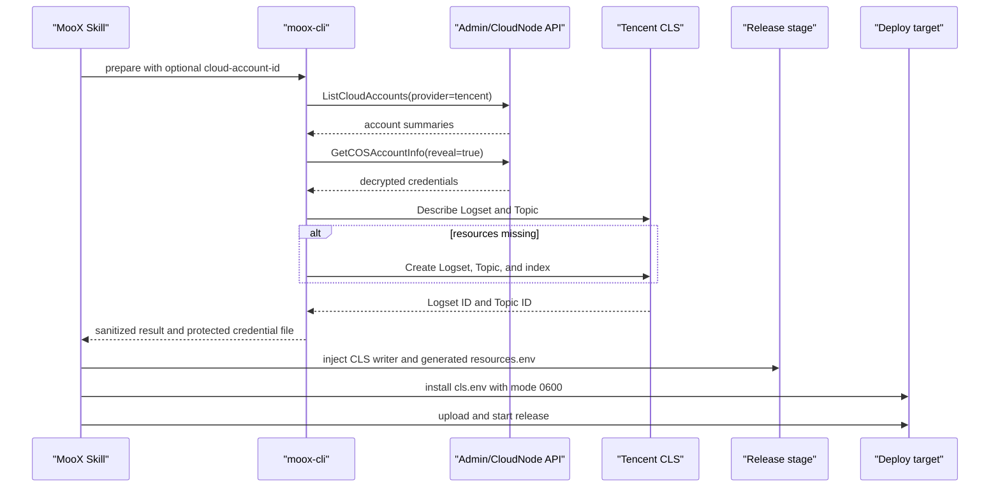

# CLS 发布前初始化设计

## 背景

MooX 的 11 个 tRPC 服务已经注册 `trpc-log-cls`，但仓库中的 `trpc_go.yaml` 默认只启用本地 writer。现有 `deploy-moox.sh --enable-cls` 在目标机启动时创建或复用 CLS 资源，再通过环境变量提供 Topic ID。该流程没有纳入 MooX Skill 的系统初始化，也没有在发布前核对云账户下的 CLS 资源。

本设计把 CLS 检查前移到每次发布之前。初始化程序使用云账户管理中保存的腾讯云凭证，查询固定名称的 CLS 日志集和日志主题，复用或创建资源，并把非敏感资源元数据写入自动生成的 `config/resources.env`；待发布配置只引用环境变量。

## 固定约定

- CLS 日志集名称固定为 `moox`。
- CLS 日志主题名称固定为 `moox-application`。
- CLS 地域固定为现有部署默认值 `ap-guangzhou`。
- 所有 MooX tRPC 服务共用该 Topic，通过 module、service、method 和 deployment version 字段区分来源。
- 初始化不允许覆盖日志集或主题名称，避免同一账号产生多套资源。
- 非 Factor 服务的 CLS writer 初始级别保持 `warn`；Factor 使用 `info`，以保留计算任务和 View 读取完成记录。

## 云账户选择

初始化脚本接受可选的 `--cloud-account-id`：

- 传入时，脚本必须精确使用该腾讯云账户；账户不存在、已删除或 provider 不是 `tencent` 时立即失败。
- 未传时，脚本调用 `ListCloudAccounts(provider=tencent)` 并使用返回列表中的第一项。
- 列表为空时立即失败，不回退到开发凭证、当前 shell 凭证或其他 provider。

列表顺序沿用 CloudNode 当前的 `c_id DESC`，因此“第一个”表示最新创建且未删除的腾讯云账户。

## 组件

### MooX Skill 初始化脚本

新增 `skills/moox/scripts/cls-bootstrap.sh`，作为发布前 CLS 初始化入口。脚本负责参数校验、调用 `moox-cli`、解析非敏感结果、更新 stage 配置，并把运行时凭证安全地安装到目标机。

主要参数：

```text
--admin-url <url>             Admin 管理面地址
--cloud-account-id <id>      可选；缺省选择第一个腾讯云账户
--stage-dir <path>           待发布目录
--target <localhost|user@host>
--deploy-dir <path>
```

`skills/moox/SKILL.md` 的系统初始化和发布流程必须在 release archive 同步或停止服务前调用该脚本。远程 Skill 可先上传仅用于预检的临时架构匹配 `moox-cli` helper；预检完成后立即删除，不属于 release archive。`deploy-moox.sh --enable-cls` 复用脚本生成的结果，不再把云资源发现推迟到服务启动阶段。

### moox-cli 编排命令

在现有 `moox-cli ops tencent cls` 下增加面向部署的 prepare 能力。命令只通过带服务鉴权的 `/api/service/cloudnode/*` 路径调用：

1. `ListCloudAccounts(provider=tencent)` 选择账户。
2. `GetCOSAccountInfo(account_id, reveal=true)` 取得解密后的 `SecretId` 和 `SecretKey`。
3. 使用凭证调用腾讯云 CLS API。
4. 查询或创建固定 Logset、Topic 和索引。

现有 `GetCOSAccountInfo` 已支持 `reveal=true`，本次不扩展 CloudNode protobuf。prepare 命令不得把明文凭证写入 stdout、stderr、日志或返回 JSON。

### 配置产物

prepare 成功后生成两类产物：

- stage 中每个启用服务的 `trpc_go*.yaml` 获得 `writer: cls`，其中 `topic_id` 引用 `${MOOX_CLS_TOPIC_ID}`。
- stage/部署根目录生成 `config/resources.env`，记录云账户 ID、region、CLS host、Logset ID 和 Topic ID；该文件不包含凭证。
- 目标机 `${deploy_dir}/secrets/cls.env` 保存 CLS writer 所需的 SecretId、SecretKey、region 和 host，权限固定为 `0600`。

Topic/Logset ID 虽然不是凭证，也不写入 `moox.toml` 或模块源配置；它们只进入自动生成的 `config/resources.env`。SecretId 和 SecretKey 只能存在于进程内存、受保护的临时文件和目标机 `0600` 文件中。脚本退出时必须删除本地临时凭证文件。

## 发布数据流



每次发布都重新调用腾讯云查询接口。脚本不把上次 Topic ID 当作事实来源；本地缓存只能用于诊断，不能跳过云端核对。

## 实施状态（2026-07-13）

发布前初始化已接入当前实现：`moox-cli ops tencent cls prepare` 负责通过
带 service-auth 的 CloudNode 控制面选择账户并核对固定 CLS 资源，
`skills/moox/scripts/cls-bootstrap.sh` 负责在目标机安全安装 `0600` 的
`secrets/cls.env`，并生成 `config/resources.env` 供所有模块读取；远程场景的
临时 helper 在预检后立即清理。`scripts/deploy/deploy-moox.sh` 的
`prepare_cls_preflight` 在 release archive 同步或停止旧服务前执行。对应的部署、Skill、CLI
和 tRPC 配置契约测试覆盖账户选择、Topic ID/credential placeholders、
固定 region/logset/topic、幂等更新及失败时不停止现有服务；运行时安全边界
仍以本设计的“安全边界”一节为准。

## 错误处理

以下情况必须在 release archive 同步、停止旧服务或切换配置之前终止发布：

- Admin 或 CloudNode 管理面不可达。
- 没有腾讯云账户，或指定账户不存在。
- `reveal=true` 未返回完整的 SecretId 和 SecretKey。
- 腾讯云鉴权失败或 CLS 查询失败。
- 固定 Logset 下存在无法读取的同名 Topic。
- CLS 返回空 Logset ID 或 Topic ID。
- stage 配置无法解析或无法写入。
- 目标机无法以 `0600` 安装 `cls.env`。

已有 Topic 未建立索引时，初始化程序创建索引。日志集、主题和索引已经存在时，操作保持幂等。

## 安全边界

- 明文云凭证只允许通过带服务鉴权的 `/api/service/cloudnode/GetCOSAccountInfo` 路径读取。
- 浏览器端和普通 `ListCloudAccounts` 响应继续不返回 SecretId、SecretKey。
- prepare 输出只包含 account ID、region、Logset ID、Topic ID 和创建/复用状态。
- 错误信息不得包含请求 body、SecretId、SecretKey 或完整 Authorization 信息。
- stage、release archive 和 Git 工作树不得包含明文凭证。
- 远程目标必须先完整写入临时文件、设置 `0600`，再原子替换 `secrets/cls.env`。

## Factor 与其他服务

Factor 不使用独立 CLS 资源。发布前初始化成功后，Factor 的 `trpc_go.yaml` 与其他服务配置同样加入 CLS writer，并通过 `config/resources.env` 使用生成的 Topic ID。Factor 保留 console writer，并以 `info` 级别同步计算任务和 View 读取流水线记录；其他服务仍以 `warn` 级别追加 CLS。

Storage 的多个 `trpc_go*.yaml` 都要更新。未包含在本次发布 stage 中的服务不修改远程配置，也不能因为初始化脚本扫描了仓库而被意外启用。

## 测试与验收

自动化测试覆盖：

- 未传 `--cloud-account-id` 时选择腾讯云账户列表第一项。
- 显式 account ID 精确选择，错误 ID 失败。
- `GetCOSAccountInfo` 使用 `reveal=true`，且日志和命令输出不含凭证。
- 已有固定 Logset、Topic 和索引时只查询不创建。
- 缺少资源时按 Logset、Topic、索引顺序创建。
- 每次执行都查询 CLS，不使用旧 Topic ID 跳过查询。
- 只更新 stage 内的 `trpc_go*.yaml`，并生成 `config/resources.env`。
- Factor 和 Storage 多配置文件获得 CLS writer；写入操作可重复执行且不产生重复 writer。
- `cls.env` 权限为 `0600`，传输失败时不替换旧文件。
- 任一准备步骤失败时，部署脚本尚未停止当前服务。

发布验收要求：

1. prepare 输出显示固定 Logset 和 Topic 的实际 ID。
2. stage 中 Factor 配置包含一个 CLS writer 和 `${MOOX_CLS_TOPIC_ID}` 占位符。
3. `config/resources.env` 包含解析后的资源 ID，且不含凭证。
4. 目标机 `cls.env` 权限为 `0600`。
5. 启动 Factor 后写入一条不含敏感内容的 info 测试日志（验证计算流水线记录可达 CLS）。
6. 在固定 Topic 中按 Factor service name 查到该日志。

## 非目标

- 不为每个服务创建独立 Topic。
- 不允许部署参数修改固定 CLS 名称。
- 不把明文凭证写入 `trpc_go.yaml`。
- 不通过浏览器 API 暴露云账户凭证。
- 不在本次改造中更换 `trpc-log-cls` 或调整日志保留策略。
