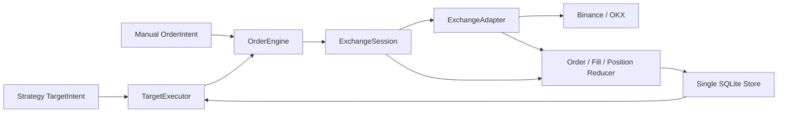

# Generic Trade Execution Module Design

## Status

Approved on 2026-07-28 after reviewing the current MooX Trade module and the
local WonderTrader and aioquant repositories.

This is a greenfield replacement design. It does not preserve the current
Trade protobuf, SQLite schema, RPC service split, Account/Channel split,
Rebalance Run/Leg model, or unused compatibility paths.

## Goal

Build a small, general Trade execution module for personal quantitative
trading. The module must support:

- Binance and OKX.
- SPOT and USDT-linear SWAP.
- MARKET and LIMIT orders.
- Cross margin and one-way `NET` SWAP positions.
- Explicit leverage per Exchange account and symbol.
- Manual orders and Strategy target-position execution.
- Durable Order and Fill facts.
- Exchange Account, Position, OpenOrder, and RecentFill synchronization.
- Paper and live isolation.

The design favors clear behavior over generic infrastructure. It does not
target institutional availability or distributed execution.

## Non-Goals

- Hedge-mode SWAP positions.
- Isolated margin.
- Coin-margined or inverse contracts.
- Delivery futures and options.
- STOP, STOP_LIMIT, or trailing orders.
- Quote-amount MARKET buys.
- TWAP, VWAP, arbitrage, or pluggable execution algorithms.
- A local replica of an Exchange margin engine.
- Distributed locks, generic Saga, generic DLQ, or global exactly-once.
- Backward-compatible protobuf or database migration.

## Approved Decisions

| Area | Decision |
| --- | --- |
| SWAP scope | Binance and OKX USDT-linear perpetuals only |
| Position mode | One-way `NET` |
| Margin mode | Cross |
| Order types | MARKET and LIMIT |
| MARKET quantity | Base-asset quantity only |
| Target execution | MARKET by default |
| Leverage | Stored by `ExchangeAccount + Symbol`; never carried by an order |
| SWAP accounting | Exchange snapshots are authoritative; local state is a risk reservation and query projection |
| Strategy boundary | Strategy publishes final base-asset target quantities |
| Target processing | Continuous convergence, not fixed Rebalance Legs |
| Naming | Use `Exchange`; do not use Provider, Broker, Venue, or Platform as Exchange synonyms |
| Account model | Merge the current Account and TradeChannel into `ExchangeAccount` |
| Synchronization name | Public method is `SyncAccount` |
| Persistence | Keep nine tables, including a local double-entry ledger |

## Architecture



The process remains a single Go service with one SQLite handle. NATS
JetStream carries only the Strategy-to-Trade target command. Local workers use
bounded Go channels and database-backed state; they do not add another
message broker or workflow engine.

## Vocabulary

These names have one meaning throughout Trade:

| Name | Meaning |
| --- | --- |
| `Exchange` | `binance` or `okx` |
| `ExchangeAccount` | One credential-bound execution account for one Exchange, market type, and execution mode |
| `ExchangeAdapter` | Exchange REST and private-stream implementation |
| `ExchangeSession` | Long-lived account lifecycle, readiness, settings, and synchronization |
| `ExchangeInstrument` | Normalized Exchange rules and contract conversion data |
| `ExchangeOrder` | Normalized Exchange order response or snapshot |
| `ExchangeFill` | One immutable Exchange execution fact |
| `ExchangePosition` | Exchange-authoritative normalized position snapshot |
| `ExchangeAccountSnapshot` | Exchange-authoritative equity, available funds, and margin snapshot |
| `OrderSpec` | The single validated order intention used by every entry point |
| `TargetExecution` | Durable progress toward one latest target-position command |

Trade code, protobuf, frontend types, and documentation must not use
`Provider`, `Broker`, `Venue`, or `Platform` as synonyms for Exchange. The
Admin Secret service keeps its generic JSON field `provider` because it also
stores cloud, database, EventBus, and other credentials. Trade maps that
external field to an internal `Exchange` value at the `secretclient`
boundary.

## Exchange Account

`ExchangeAccount` replaces the current Account, TradeChannel, and local API
key records:

```text
ExchangeAccount
  ID
  SpaceID
  Name
  Exchange
  MarketType          SPOT | SWAP
  ExecutionMode       PAPER | LIVE
  CredentialSecretID
  SettlementAsset
  MarginMode          CROSS for SWAP
  Status              ENABLED | DISABLED | ERROR
  Paused
  PauseReason
  LastSyncAt
  LastReadyAt
  LastError
```

Paper and live accounts are distinct records. A Strategy execution binding
refers to one `exchange_account_id`; callers no longer pass both `account_id`
and `channel_id`.

The module exposes two RPC services on one process:

```text
ExchangeAccountService
  CreateAccount
  UpdateAccount
  GetAccount
  ListAccounts
  SetLeverage
  PauseAccount
  SyncAccount

TradeExecutionService
  PlaceOrder
  CancelOrder
  CancelAllOrders
  SubmitTarget
  GetExecution
  ListExecutions
  GetOrder
  ListOrders
  ListFills
  ListPositions
```

Service method names omit the redundant `ExchangeAccount` prefix. Domain
entities retain the full name when they can appear outside the service
context.

## Order Specification

Every RPC, Strategy command, TargetExecutor action, Store record, and
ExchangeAdapter call uses one `OrderSpec`:

```go
type OrderSpec struct {
    ExchangeAccountID  string
    ClientOrderID      string
    Symbol             string
    OrderType          ExchangeOrderType
    TimeInForce        ExchangeTimeInForce
    Side               ExchangeSide
    PositionSide       ExchangePositionSide
    Quantity           Decimal
    LimitPrice         *Decimal
    ReferencePrice     Decimal
    ReferencePriceAt   time.Time
    ReduceOnly         bool
    Source             OrderSource
    StrategyExecutionID string
}
```

`Exchange` and `MarketType` come from `ExchangeAccount`; callers cannot
override them.

### Validation Matrix

| Market and type | Quantity | LimitPrice | PositionSide | ReduceOnly |
| --- | --- | --- | --- | --- |
| SPOT MARKET | Positive base quantity | Empty | Empty | False |
| SPOT LIMIT | Positive base quantity | Positive | Empty | False |
| SWAP MARKET | Positive base quantity | Empty | NET | Optional |
| SWAP LIMIT | Positive base quantity | Positive | NET | Optional |

MARKET never uses `price = 0`, never silently becomes LIMIT, and never accepts
quote amount. LIMIT accepts GTC, IOC, or FOK. MARKET has no domain-level
TimeInForce; each ExchangeAdapter sends the correct Exchange request.

`ReferencePrice` is not sent to the Exchange. It supports pre-trade
freshness, notional, and reservation checks. A true MARKET order cannot
guarantee maximum slippage. The module checks reference-price freshness
before submission and records actual slippage after Fill.

## SWAP Quantity and Account State

Domain Orders, Fills, Targets, and Positions use base-asset quantity.
ExchangeAdapter alone converts to and from Exchange contract quantity.

`ExchangeInstrument` contains:

```text
Exchange
MarketType
Symbol
BaseAsset
QuoteAsset
SettlementAsset
Linear
ContractValue
ContractValueAsset
ExchangeQuantityStep
MinExchangeQuantity
PriceTick
MinNotional
```

Only linear contracts whose contract value can be converted to base quantity
are enabled. The adapter rejects a quantity that cannot satisfy the Exchange
step or minimum; it does not silently round it into a different target.

Orders always carry positive quantity. A `NET` position uses signed base
quantity: positive is long, negative is short.

`ExchangePosition` contains:

```text
ExchangeAccountID
Symbol
PositionSide
SignedQuantity
EntryPrice
MarkPrice
Leverage
MarginMode
UsedMargin
LiquidationPrice
UnrealizedPnL
RealizedPnL
ExchangeUpdatedAt
```

Leverage is configured and persisted by `ExchangeAccount + Symbol`.
ExchangeSession applies the configured value before it marks the account
ready. Missing, invalid, or mismatched leverage blocks new orders.

For SPOT, Fill facts continue to drive the local double-entry asset ledger.
For SWAP, the module does not emulate the full Exchange margin engine:

- Pre-trade validation reserves `reference_notional / leverage + fee_buffer`.
- ExchangeFill records fees, settlement asset, and realized PnL.
- ExchangePosition and ExchangeAccountSnapshot are authoritative for actual
  margin, equity, available balance, and unrealized PnL.
- Order terminal state releases the local risk reservation.
- The next account synchronization corrects local projections from Exchange
  snapshots.

## Target Command

The Strategy-to-Trade event carries final base-asset target quantities:

```text
TargetIntent
  execution_id
  strategy_run_id
  execution_binding_id
  exchange_account_id
  command_sequence
  not_after
  data_revision
  targets[]
    instrument_id
    symbol
    target_quantity
```

The public event does not contain account/channel pairs, capital, quote asset,
target weight, or market type. Strategy owns portfolio sizing. Trade owns
execution.

The Python Strategy output contract changes from `target_weight` to
`target_quantity`. The execution binding keeps `exchange_account_id` and
mode; it removes `channel_id`, `capital_amount`, and `quote_asset`.

## Target Convergence

Trade keeps one latest desired target per execution binding and one serial
lane per `ExchangeAccount + Symbol`.

```text
effective_position =
    confirmed_exchange_position
  + same_direction_open_order_remaining

remaining =
    latest_target_position
  - effective_position
```

Rules:

1. Reject a command sequence that is not greater than the stored sequence.
2. Persist a newer target as the latest desired state; do not create an
   independent fixed-leg run.
3. Cancel conflicting active orders and wait for their final Fills.
4. Wait while a same-direction child order remains active.
5. Submit one MARKET child order for the remaining quantity.
6. Recompute after every Order, Fill, Position, timer, or manual sync update.
7. Record residual quantity below the Exchange minimum instead of looping.
8. Stop creating child orders after `not_after`; continue ingesting facts for
   already submitted orders.

For a SWAP reversal, TargetExecutor first submits a reduce-only MARKET order,
waits until the Exchange position is zero, then opens the opposite side. It
never combines close and reverse into one implicit signed order.

V1 does not add execution algorithms. An optional `max_child_notional`
deterministically caps each child order; an unset cap submits the full
remaining quantity.

## Exchange Session and SyncAccount

Each enabled ExchangeAccount owns one long-lived ExchangeSession:

1. Load the account, credential, instrument rules, margin mode, and leverage.
2. Connect the private stream and buffer incoming events.
3. Load instrument metadata, then fetch Exchange Account, Positions,
   OpenOrders, and RecentFills snapshots.
4. Apply snapshots and buffered events through the same idempotent reducer.
5. Mark the session ready only after state and settings are current.
6. Mark it not ready immediately when the stream disconnects.
7. Block new submissions while not ready.
8. Run the same account synchronization every 30 seconds.

`SyncAccount` manually triggers this account-level synchronization. It reads
the Exchange and updates local state. It does not place, cancel, or close
orders.

`SyncAccount`:

- Ingests new ExchangeFill facts.
- Updates open and terminal Orders.
- Resolves `SUBMIT_UNKNOWN` and `CANCEL_UNKNOWN`.
- Replaces Position and Account projections with Exchange snapshots.
- Imports unmanaged Exchange orders as `EXTERNAL`.
- Returns counts, readiness, and warnings.

SPOT accounts configure an explicit symbol synchronization universe. Current
balances are not a sufficient substitute because an externally sold-to-zero
asset would otherwise hide its terminal order and Fill on first startup.
Per-symbol fill cursors live on the ExchangeAccount row. Recovery is complete
within each adapter's documented bounded history window; Binance USD-M V1
uses the most recent seven days, and older one-off backfill is out of scope.

The local reservation rebase watermark advances only after a complete REST
account snapshot. Partial private updates merge only fields explicitly present
in the event and never advance that watermark.

It never cancels an unmanaged order automatically.

## Error and Terminal-State Rules

ExchangeAdapter returns typed `ExchangeErrorKind` values:

```text
REJECTED
INSUFFICIENT_BALANCE
RATE_LIMITED
ORDER_NOT_FOUND
AUTHENTICATION
NOT_READY
TRANSPORT_UNKNOWN
```

String matching is not a classification mechanism.

Any POST for which the client cannot prove that no request reached the
Exchange becomes `SUBMIT_UNKNOWN` or `CANCEL_UNKNOWN`. This includes EOF,
deadline, cancellation after dispatch, and HTTP 5xx. Trade queries by
`client_order_id` before retrying.

A successful cancel response does not immediately finalize the local order.
Trade first ingests the final RecentFills, then records CANCELED or
PARTIALLY_CANCELED and releases only the unconsumed reservation. Terminal
orders remain eligible for a bounded late-Fill synchronization window.

## Persistence

The replacement schema contains:

```text
t_exchange_accounts
t_exchange_instruments
t_trade_orders
t_order_fills
t_exchange_positions
t_target_executions
t_ledger_transactions
t_ledger_entries
t_trade_balance_projections
```

The nine tables keep Order and Fill facts normalized while merging small,
account-scoped configuration and single-record execution state:

- `t_exchange_accounts` stores the explicit SPOT sync symbols, per-symbol Fill
  cursors, leverage settings as a symbol-keyed JSON object, and the latest
  ExchangeAccountSnapshot as typed JSON. Trade does not keep historical
  account snapshots.
- `t_trade_orders` stores reservation totals and the remaining reservation.
  A separate reservation table is unnecessary because every reservation
  belongs to one Order.
- `t_order_fills` stores immutable Exchange executions. It remains separate
  because one Order may have many Fills, including a Fill arriving after a
  cancel response.
- `t_target_executions` stores target positions as typed JSON together with
  event ID, execution binding ID, command sequence, expiry, and processing
  status. The same row provides event idempotency and sequence ordering.
- `t_ledger_transactions` and `t_ledger_entries` preserve the local
  double-entry audit trail. `t_trade_balance_projections` is the
  transactionally maintained current balance by ExchangeAccount, asset, and
  bucket.

Exchange snapshots remain authoritative. The local ledger supports
reservation, Fill accounting, fees, audit, and pre-trade risk checks; it does
not attempt to reproduce the Exchange margin or liquidation engine.
`SyncAccount` may append an explicitly typed synchronization-adjustment
transaction when the local projection differs from the authoritative
Exchange snapshot.

The rewrite deletes:

```text
t_trade_channels
t_account_api_keys
t_exchange_account_leverage
t_exchange_account_snapshots
t_target_positions
t_trade_reservations
t_trade_command_offsets
t_trade_inbox
t_execution_plans
t_execution_slices
t_trade_sagas
t_rebalance_runs
t_rebalance_legs
t_trade_sync_cursors
```

The schema is recreated in place. No migration or compatibility reader is
added. One Store and one SQLite handle own every table and transaction.

## Reference-Project Lessons

### WonderTrader

Adopt:

- Narrow Exchange-facing SPI.
- Login and complete state queries before readiness.
- Target minus real position convergence.
- Active-order awareness.
- Order and Fill callbacks that wake execution.

Do not adopt:

- `price == 0` as MARKET.
- The execution algorithm named MARKET that submits opponent-price LIMIT.
- CTP today/yesterday position rules.
- DLL factories and many execution plugins.
- In-memory local ID correlation.
- Its nominal SWAP enum, which has no SWAP execution implementation.

### aioquant

Adopt:

- One small Trade facade.
- Exchange-specific request mapping inside adapters.
- Startup open-order recovery before readiness.

Do not adopt:

- Binance MARKET silently becoming LIMIT.
- One quantity field meaning base quantity or quote notional.
- In-memory active orders as the source of truth.
- Missing first-class Fill facts.
- Fire-and-forget callbacks and global locks.
- Its incomplete SWAP code.

## Operational and Security Boundaries

- Live startup rejects the checked-in default encryption key.
- `MOOX_TRADE_ENCRYPTION_KEY` is required for live ExchangeAccount use.
- ExchangeAccount, credential, and Strategy binding ownership are checked
  before every command.
- A disabled, paused, not-ready, or mismatched account cannot submit.
- MARKET reference price must be fresh.
- Simple pre-trade limits cover maximum child notional, available funds or
  margin, leverage ceiling, and reduce-only direction.
- No generic risk framework is introduced.

## Acceptance

The rewrite is complete only when all of the following pass:

1. SPOT MARKET buy and sell with base quantity and no price.
2. SPOT LIMIT GTC, IOC, and FOK on Binance and OKX.
3. Binance USDT SWAP MARKET long, short, and reduce-only close.
4. OKX base-quantity and contract-quantity conversion in both directions.
5. Cross margin, NET mode, leverage configuration, and restart recovery.
6. Partial Fill, fee, realized PnL, Position, and Account snapshot handling.
7. Strict close-then-open SWAP reversal.
8. EOF, deadline, cancellation, and 5xx submit uncertainty without duplicate
   orders.
9. Delayed Fill after cancel producing PARTIALLY_CANCELED.
10. Private-stream disconnect blocking submission until synchronization
    restores readiness.
11. New target superseding an older target without competing child orders.
12. Expired target creating no new child orders.
13. Strategy outbox to Trade target execution through embedded JetStream.
14. SQLite restart and account synchronization E2E.
15. Binance and OKX testnet smoke tests behind explicit credentials.
16. Trade terminology check with no unapproved Exchange synonyms.
17. Focused unit tests, module race tests, workspace verification,
    independent code review, build/release checks, and exact remote SHA proof.
