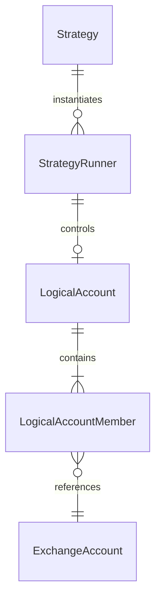

# StrategyRunner and LogicalAccount Trade Design

## Status

Draft for review on 2026-07-29.

This design replaces the Strategy `Binding`/`ExecutionBinding` routing model
and the Trade single-Exchange-account target model. MooX is a greenfield
project, so the implementation will remove obsolete APIs, tables, generated
types, and compatibility paths instead of migrating them.

## Goal

Build a small execution model for personal quantitative trading in which:

- An immutable `Strategy` can have multiple independent `StrategyRunner`
  instances.
- Each `StrategyRunner` controls one `LogicalAccount`.
- A `LogicalAccount` combines one or more physical `ExchangeAccount` records
  into one total position.
- Member accounts may use different Exchanges, but they form one homogeneous
  execution group.
- Strategy targets express the total desired position of the
  `LogicalAccount`, not per-account allocations.
- Trade chooses physical accounts dynamically.
- Operators can pause automation, place manual orders, and flatten a logical
  account through explicit RPC commands.
- Strategies are stateless functions over a complete historical input window
  and parameters.

The design favors deterministic behavior and clear ownership over portfolio
optimizers, distributed coordination, or institutional reliability.

## Non-Goals

- Multiple Strategy runners controlling the same logical or physical account.
- Fixed allocation weights between member accounts.
- Per-strategy capital accounting inside one physical account.
- Mixed paper/live, SPOT/SWAP, or settlement assets inside one logical account.
- Cross-currency NAV aggregation.
- A generic workflow engine, Saga framework, or global exactly-once delivery.
- TWAP, VWAP, grid, arbitrage, or pluggable execution algorithms.
- Stateful or incremental Strategy execution, including `state_json`,
  `state_revision`, `next_state`, and state-format migration.
- Backward-compatible protobuf or SQLite migration.

## Vocabulary

| Name | Meaning |
| --- | --- |
| `Strategy` | Immutable strategy code, manifest, and parameter schema |
| `StrategyRunner` | One independently configured stateless deployment of a Strategy |
| `StrategyResult` | One validated and atomically accepted Strategy output |
| `LogicalAccount` | One total execution account composed of physical Exchange accounts |
| `ExchangeAccount` | One credential-bound paper or live account on one Exchange |
| `TargetExecutor` | Trade component that converges a LogicalAccount to a FULL target |
| `StrategyEngine` | Component that executes Strategy code for a StrategyRunner |
| `OrderService` | Shared order validation, persistence, submission, cancellation, and recovery kernel |
| `OperatorAction` | Explicit manual intervention such as an order or logical-account flatten |

`StrategyRunner` is a persisted domain entity. `StrategyEngine` is the runtime
component that invokes Python. Trade must not use `StrategyRunner` as the name
of an execution worker.

## Core Model



The relationships are:

```text
Strategy 1 -> N StrategyRunner
StrategyRunner 1 -> 0..1 LogicalAccount
LogicalAccount 1 -> N ExchangeAccount
ExchangeAccount 1 -> 0..1 enabled LogicalAccount
```

An observe-only `StrategyRunner` has no `LogicalAccount`. An executing runner
has exactly one. A logical account has at most one active runner.

## Ownership

Strategy owns:

- `Strategy`.
- `StrategyRunner`.
- Runner parameters, complete historical input window, frequency, and command
  sequence.
- The latest theoretical FULL target saved with the runner.

Trade owns:

- `LogicalAccount`.
- Physical `ExchangeAccount` membership.
- Account readiness and synchronization.
- Current accepted FULL target and convergence progress.
- Orders, fills, positions, operator actions, and target execution.

`LogicalAccount` stores the owning `runner_id`. `StrategyRunner` stores the
target `logical_account_id`. Enabling either side requires the two references
to match. Trade revalidates both identifiers on every target command and
rejects a different runner.

The association is immutable while enabled. Changing the runner or logical
account requires disabling the old association and creating a new runner.

## Strategy Persistence

The Strategy schema becomes four tables:

```text
t_strategies
  strategy_id                  immutable primary key
  name
  manifest_yaml
  source_code + source_hash
  ctime

t_strategy_runners
  runner_id
  strategy_id
  space_id
  view_id
  freq
  params_json
  logical_account_id       nullable for observe-only
  current_targets_json
  command_sequence
  last_result_id
  last_success_at
  last_error
  status

t_strategy_results
  result_id
  runner_id
  strategy_id
  namespace
  trigger_bar_time
  input_hash
  action + output_json
  command_sequence            nullable when no Trade command is emitted
  ctime
  unique(runner_id, strategy_id, namespace, trigger_bar_time)

t_strategy_outbox
  message_id
  event_data
  ctime
```

`strategy_id` identifies one immutable Strategy artifact. Editing source code,
the manifest, input contract, or parameter schema creates a new `strategy_id`;
IDs never point to mutable code. `name` is a display label and need not be
unique. A `StrategyResult` stores its `strategy_id` directly so it remains
attributable after its runner changes Strategy.

`manifest_yaml` is the immutable Strategy package declaration. It contains the
supported Strategy API version, Python entrypoint, input requirements, and
parameter schema. The registry parses and strictly validates it when publishing
a Strategy. V1 accepts only `api_version: moox.strategy/v1`; `api_version` is
not duplicated as a table column.

Changing a runner's `strategy_id` requires the runner to be disabled. The
runner retains its current target and command sequence so the Strategy and
Trade sides remain aligned. The switch clears artifact-specific last-result
and health fields. There is no Strategy state or state-migration contract.

The Strategy Engine invokes Python with the complete historical input window
and parameters. Python output contains `action`, `targets`, and optional
`debug_info`; it never contains `state` or `next_state`. Rolling indicators,
cooldown rules, and consecutive-signal rules must be derived from the supplied
historical window rather than hidden mutable state.

"Complete historical window" means the full, time-ordered window declared by
the Strategy manifest and ending at `trigger_bar_time`; it does not mean all
market history. The Strategy must be reproducible from that window, parameters,
immutable artifact, and trigger context alone.

```python
def run(context, data, params):
    return {
        "action": "hold",
        "targets": [],
        "debug_info": {},
    }
```

`t_strategy_results` contains only validated, accepted results. Failed attempts
update the runner's `last_error` and operational logs but do not create a
result. `output_json` preserves the accepted `targets` and `debug_info`. The
uniqueness constraint is the logical-trigger idempotency key. `input_hash` is
computed from the actual complete input window, parameters, trigger context,
and immutable Strategy identity. Reusing the key with a different `input_hash`
is a conflict. The hash excludes generated result IDs, run time, and other
retry-varying metadata. The design does not carry a caller-supplied
`data_revision`.

The implementation removes or folds into the four tables:

- `t_strategy_bindings`.
- `t_strategy_states`.
- `t_strategy_runs`.
- `t_strategy_command_sequences`.
- `t_strategy_execution_bindings`.
- `t_strategy_run_metrics`.
- `t_strategy_binding_health`.
- `t_strategy_performance_points`.
- `t_strategy_performance_daily`.
- `t_strategy_operation_audits`.
- `group_id`.
- `capital_weight`.
- The current shared execution-binding routing behavior.

`current_targets_json` is the materialized latest accepted FULL theoretical
target. It implements `hold`, operator visibility, and outbox creation; it is
not passed back into Python and is not an account-position or Trade-progress
snapshot.

Every accepted result atomically inserts `t_strategy_results` and updates the
runner's latest result metadata. `hold` retains `current_targets_json`, does
not increment `command_sequence`, and emits no command. `rebalance` replaces
`current_targets_json`; an executing runner also increments
`command_sequence` and writes one Trade outbox message in the same transaction.
An observe-only runner stores its theoretical result and target but writes no
Trade outbox message. Empty `rebalance.targets` is valid and means complete
liquidation.

## Logical Account Persistence

Trade adds:

```text
t_logical_accounts
  space_id + logical_account_id
  name
  owner_runner_id
  execution_mode          PAPER | LIVE
  market_type             SPOT | SWAP
  settlement_asset
  automation_state        ACTIVE | PAUSED
  pause_reason
  ctime + mtime

t_logical_account_members
  space_id + logical_account_id + exchange_account_id
  priority
  enabled
  ctime + mtime

t_logical_account_targets
  space_id + logical_account_id
  target_id
  runner_id
  command_sequence
  targets_json
  status                    PENDING | CONVERGING | CONVERGED | BLOCKED
  blocked_targets_json
  last_error
  accepted_at + updated_at

t_operator_actions
  space_id + action_id
  logical_account_id
  action_type             MANUAL_ORDER | FLATTEN
  status                  RUNNING | COMPLETED | PARTIAL | FAILED
  reason
  request_json + result_json
  last_error
  ctime + mtime
```

The member table enforces one enabled logical-account membership per physical
account. Application validation also rejects duplicate membership before the
database write.

`t_logical_account_targets` contains one replaceable current target per logical
account; it is not target history. `target_id` is the global idempotency and
order-ownership identity. A Strategy publisher sets `target_id = result_id`;
Trade does not copy StrategyResult contents into its database.
`blocked_targets_json` records target quantities that cannot currently execute
and their explicit reasons. Execution progress is recomputed from the current
target, positions, orders, and account snapshots rather than persisted as a
second snapshot. `t_operator_actions` is the small durable identity and
progress record required for `action_id` idempotency and restart continuation.

All enabled members must have the same:

- `ExecutionMode`.
- `MarketType`.
- Settlement asset.

They may use different Exchanges. `priority` is a deterministic selection
order, not an allocation weight.

New logical accounts start `PAUSED`. Membership changes require the logical
account to remain `PAUSED`.
Removing a member with active orders or nonzero positions is rejected.
Adding a member with active orders or nonzero positions requires an explicit
operator adoption request. Without that request, Trade rejects the membership
change. Adoption does not trade immediately; the next Resume converges the
adopted positions toward the stored FULL target.

## Readiness

Logical-account readiness is computed, not persisted:

```text
logical_account_ready =
    automation_state == ACTIVE
    AND every enabled member session is Ready
    AND every target instrument has at least one eligible member
```

If any member becomes Not Ready, the `TargetExecutor` stops creating new
orders. Private events and account synchronization continue. Execution resumes
automatically when all members are Ready and `automation_state` remains
`ACTIVE`.

A logical account in `PAUSED` never resumes automatically.

## Target Contract

Strategy publishes one `LogicalAccountTargetRequested` command:

```text
target_id
runner_id
logical_account_id
command_sequence
targets[] InstrumentTarget
  instrument_id
  quantity
```

The command omits physical account IDs, Exchange-native symbols, market type,
capital, and allocation weights. Trade resolves account-specific instruments,
symbols, quantity steps, contract conversions, and minimums.
Each `InstrumentTarget.quantity` is the signed absolute desired position for
that instrument, not an Order quantity or adjustment delta. SPOT quantities
cannot be negative; SWAP uses the sign for direction.

Every command is a FULL replacement for the logical account:

- An omitted instrument has desired quantity zero.
- An empty target list means every current position should become zero.
- `hold` emits no command and preserves the last FULL target.
- A higher sequence replaces the previous target.
- Low, duplicate, and out-of-order sequences do not change current state.

Trade persists the latest target as `LogicalAccountTarget`, not as execution
history. Targets received during an operator pause still replace the stored
target, but they never change `automation_state` or create orders. Only an
operator Resume reactivates convergence.
The convergence input is the union of:

- Current FULL target instruments.
- Instruments with nonzero positions in any member.
- Instruments with active owned orders in any member.

This union ensures that positions created before account attachment or by
external drift cannot disappear merely because they were absent from an older
target.

## Instrument Resolution

`instrument_id` is the canonical identity. Each physical account contributes
an eligible Exchange instrument when:

- The account belongs to the logical account.
- The account and instrument are Ready for trading.
- The instrument maps to the requested canonical identity.
- Its market type and settlement asset match the logical account.

Trade uses the chosen account's native symbol, step size, contract conversion,
minimum quantity, and minimum notional. Strategy never sends a native symbol.

A target fails validation when no member supports an instrument. A temporary
member outage makes the logical account Not Ready instead of permanently
failing the target.

## Target Convergence

Each logical account has one serial `TargetExecutor`, scheduled by one
`TargetWorker`. The executor submits at most one
child order, waits for a fact or synchronization update, and recomputes. This
keeps account selection deterministic and avoids cross-account over-ordering.

For each instrument:

1. Read every member's confirmed position and active owned order.
2. Cancel or resolve stale owned orders that conflict with the current target.
3. Close positions whose sign opposes the target.
4. Compare the remaining same-direction total with the target.
5. Reduce excess positions or open the remaining quantity.
6. Recompute after every Order, Fill, Position, timer, or manual sync update.

Account selection is dynamic:

- Opposing positions close before any new exposure opens.
- Reductions start with the member holding the largest absolute reducible
  position.
- Increases use member priority first, then available funds and Exchange
  limits.
- If one account cannot accept the remaining quantity, the next eligible member
  is used.

Completion requires physical consistency:

- A positive target has no negative member positions or opposing active orders.
- A negative target has no positive member positions or opposing active orders.
- A zero target requires every member position to be zero.
- Opposing positions in different accounts never count as a completed net-zero
  target.

The executor records untradeable quantities below Exchange minimums in
`blocked_targets_json` instead of looping.

## Order Ownership

Orders store server-assigned ownership:

```text
logical_account_id
runner_id
owner_type             TARGET | OPERATOR | EXTERNAL
owner_id               target_id or operator_action_id
```

Public RPC callers cannot set `owner_type`, `runner_id`, or `owner_id`.

- `TARGET` orders belong to the current logical account and runner.
- `OPERATOR` orders belong to one explicit operator action.
- Exchange-discovered orders are `EXTERNAL`.

The `TargetExecutor` only cancels or reuses its own `TARGET` orders. An
unexpected `OPERATOR` or `EXTERNAL` order pauses automatic execution and
surfaces the conflict. It never silently adopts or cancels that order.

## Operator Intervention

Account exclusivity does not remove manual control. It makes manual control an
explicit control-plane operation.

Trade exposes:

```text
PauseLogicalAccount
ResumeLogicalAccount
PlaceManualOrder
FlattenLogicalAccount
GetOperatorAction
```

Every modifying request requires an idempotent `action_id` and reason.

### Manual Order

`PlaceManualOrder`:

1. Resolves the physical account's logical account.
2. Acquires the logical-account lock.
3. Persists `automation_state=PAUSED` and records the reason.
4. Stops new target children and cancels every active owned target order in the
   logical account.
5. Creates an `OPERATOR` order through the shared `OrderService`.
6. Leaves the logical account `PAUSED` after the order settles.

The latest Strategy target remains stored. Only an explicit
`ResumeLogicalAccount` allows automatic convergence toward it again.

### One-Click Flatten

`FlattenLogicalAccount`:

1. Atomically persists `automation_state=PAUSED` and a RUNNING
   `OperatorAction`.
2. Performs a fresh Exchange synchronization for every attached member,
   including disabled members that still belong to the logical account.
3. Cancels every open order found by synchronization, including `TARGET`,
   `OPERATOR`, and `EXTERNAL` orders.
4. Synchronizes again and does not submit a closing order on an account until
   its cancellations are confirmed terminal.
5. Closes each physical position on its exact account. It does not use
   cross-account net quantity.
6. Repeats synchronization until all known positions are zero, the bounded
   action deadline expires, or an account reports an error.
7. Finishes in `PAUSED`, never `ACTIVE`.

The RPC keeps the trading-domain name `FlattenLogicalAccount`; operator-facing
UI uses "close positions per account" (逐账户清仓). Flatten does not delete the
latest `LogicalAccountTarget`, so a later explicit Resume may reopen exposure
toward that target.

Flatten is an operator override. It attempts every member independently even
when the aggregate logical account is Not Ready. Failures and remaining
positions are returned per account, and repeated use of the same `action_id`
continues the same action without duplicating child orders.

LogicalAccount does not duplicate the running action as a `FLATTENING` state.
The RUNNING `OperatorAction` is the durable progress and restart identity.
There is no `control_revision`: the single-process serial executor, operator
path, and membership changes share the same logical-account lock. The
TargetExecutor holds that lock from its final ACTIVE check through Order
creation, Exchange submission, and response persistence; a later Pause then
cancels any active TARGET order created immediately before it.

Not Ready does not permit stale-position trading. If fresh synchronization
fails for one account, Flatten reports that account and does not guess a closing
quantity from an old snapshot; it continues with other accounts. SWAP closing
orders are reduce-only. SPOT closes supported non-settlement positive balances;
settlement cash is retained, and dust or unmapped assets are reported as
remaining positions.

`ResumeLogicalAccount` requires:

- No running operator action.
- No unresolved external order conflict.
- Every enabled member Ready.

Resume uses the latest stored Strategy target. The UI and RPC response must
make clear that resuming after a manual flatten can reopen positions.

## Order Submission and Recovery

The shared `OrderService` provides a state-aware idempotent entry point:

- `PENDING`: submit.
- `SUBMITTING` or `SUBMIT_UNKNOWN`: query by client order ID and recent fills.
- Unknown within the lookup window: return the existing unknown order.
- Unknown beyond the window and still absent: return to `PENDING` and permit a
  controlled retry with the same client order ID.
- OPEN, partial, canceling, or terminal: return the existing order.

Idempotency compares only caller-owned order fields. Server-derived reference
price and timestamp do not participate.

The domain names limit-order lifetime behavior `FillPolicy`, with supported
values `GTC`, `IOC`, and `FOK`; `MARKET` orders have no FillPolicy. Exchange
adapters map it to native `timeInForce` or order-type fields.

Public RPC and `ClientOrderSpec` do not expose a reduce-only flag.
`OrderService` derives and persists `ReducePositionOnly` from the confirmed
position and trusted execution phase:

- SPOT and SWAP opening or increase orders use `false`.
- SWAP reductions, opposite-position closing, and Flatten orders use `true`.
- A manual order that would cross zero is rejected; the operator must reduce or
  Flatten first, wait for confirmed zero, and then submit the opposite opening
  order.

The internal Order and Exchange request retain `ReducePositionOnly` and map it
to the Exchange-native `reduceOnly` guard. This prevents a stale closing
quantity from accidentally opening the opposite position.

The account lock covers precheck, unknown resolution, conditional submission,
and local response persistence. A successful non-OPEN Exchange response
triggers immediate `SyncAccount`; Trade never fabricates fills from an
aggregate order response that lacks a fill ID.

Exchange adapters validate native client-order-ID constraints. In particular,
Trade generates OKX client order IDs once with `xid.New().String()`, persists
them before submission, and reuses the same value for lookup or controlled
retry. The OKX adapter still validates the native length and alphanumeric
constraints at its boundary.

## Paper and Live

Paper and live logical accounts never share member accounts. Paper V1 accepts
MARKET orders only. It rejects LIMIT before creating an Order or reservation;
the module does not pretend to provide a matching engine.

Live activation requires:

- An explicit default-off live-trading switch.
- A static `production` or `testnet` environment profile.
- Homogeneous member environment.
- Valid single-secret retrieval for every member credential.

The service-auth-only `GetSecretValue` RPC is called once by secret ID. The
ordinary admin `GetSecret` remains masked. Trade validates returned category,
provider, status, key ID, secret value, and extra configuration. It does not
list or load unrelated credentials. The plaintext response type remains
distinct from the masked admin type and is named `SecretMaterial`.

## Health and Runtime

Readiness includes:

- SQLite.
- EventBus when enabled.
- Runtime worker status.
- Every enabled Exchange session.
- Every enabled LogicalAccount.
- Configuration and ownership validation.

The initial account enumeration retries at a fixed interval. A worker that
terminates unexpectedly records a readiness error. Existing session creation
and reconnect backoff remain; Trade does not add another supervisor layer.

## Persistence Simplification

Trade removes the local double-entry ledger tables and unused balance
projection. Execution risk uses:

- Exchange-authoritative account snapshots.
- Per-order remaining reservation.
- Immutable Fill facts.
- Confirmed Position snapshots.

The removal is a separate implementation change from live-order correctness,
but it is part of the greenfield target schema. The design does not add
balance-reconciliation machinery to preserve an unused projection.

## Public Service Shape

The Trade process remains a modular monolith with one SQLite store:

```text
ExchangeAccountService
  physical account CRUD, leverage, and synchronization

LogicalAccountService
  logical account CRUD, membership, ownership, pause, resume, and flatten

TradeExecutionService
  manual order, cancel, logical-account target, orders, fills, and positions
```

Strategy publishes one target event. Trade does not add a generic task broker,
algorithm registry, or second event workflow.

## Failure Semantics

- A member Not Ready stops automatic orders for the whole logical account.
- Unsupported instruments fail target validation.
- Insufficient capacity leaves a visible `BLOCKED` target with reasons; it does
  not change `automation_state` or over-allocate another account.
- An external order or fill pauses automation.
- Logical accounts remain paused after operator actions complete or fail.
- Restart restores current target, operator action, logical-account state,
  unknown orders, and Exchange sessions from SQLite.

## Required Tests

### Strategy

- Strategy and runner CRUD, validation, and strict schema.
- Strategy IDs identify immutable artifacts; source changes create new IDs.
- Manifest parsing rejects unsupported API versions and unknown fields.
- A disabled runner can switch Strategy while retaining its current target and
  sequence and clearing artifact-specific result and health fields.
- Python receives a complete historical input window and cannot return or
  persist `state` or `next_state`.
- One active runner per logical account.
- Accepted Result, Runner target metadata, sequence, and outbox changes are atomic.
- Failed attempts do not create Strategy Results.
- `hold` preserves `current_targets_json` and emits no command.
- Observe-only `rebalance` updates its theoretical target without an outbox
  message.
- Empty `rebalance` publishes an empty FULL target.
- Strategy output and the public command use `InstrumentTarget.quantity`; old
  `target_quantity`, `TargetPosition`, and `TradeTarget` names are rejected.
- Command sequence is monotonic per runner.
- Transaction failure cannot partially write Result, current target, sequence,
  or outbox.
- Removed `group_id`, capital weight, Binding, and ExecutionBinding fields are
  rejected.

### Logical Account

- Homogeneous member validation.
- A physical account cannot have enabled membership in two logical accounts.
- New logical accounts start paused.
- Membership changes require paused state.
- Removing a member with positions or orders is rejected.
- One owner runner per logical account.
- Any member Not Ready gates automatic execution.

### Target Executor

- Targets aggregate positions across multiple Exchanges.
- Opposing member positions close before opening target exposure.
- Zero target flattens every physical account, even when aggregate net is zero.
- Reduction selects the largest reducible position.
- Increase falls through priority members when capacity is insufficient.
- One child at a time survives restart and Fill updates.
- Final pre-submit validation under the logical-account lock prevents a child
  from being created after Pause.
- Unsupported instruments and below-minimum blocked targets terminate predictably.
- FULL omission closes current positions and stale owned orders.

### Operator

- Manual order pauses before submission and remains paused after settlement.
- Operator fields cannot be forged through public RPC.
- Flatten cancels orders and closes every member position.
- Flatten synchronizes before cancellation and never closes an account while
  cancellation is unconfirmed.
- Flatten does not trade from stale snapshots after synchronization failure.
- Partial flatten failure reports per-account remaining positions and remains paused.
- Repeated `action_id` does not create duplicate child orders.
- A running Flatten is represented by the OperatorAction while the logical
  account remains paused.
- Flatten handles disabled attached members, SPOT settlement cash, dust, and
  bounded retries.
- Resume requires Ready members and makes reopening the latest target explicit.
- External orders pause the logical account and are never auto-canceled.

### Order and Exchange

- RPC retry ignores server-derived reference quote changes.
- Public RPC cannot set reduce-only semantics.
- `FillPolicy` validates and maps `GTC`, `IOC`, and `FOK` for LIMIT orders;
  MARKET orders carry no policy.
- SWAP reductions and Flatten derive `ReducePositionOnly=true`; SWAP increases
  and all SPOT orders derive `false`.
- A manual order that would cross zero is rejected.
- State-aware submit covers every Order state.
- Unknown lookup window permits only controlled same-ID retry.
- Non-OPEN success responses trigger synchronization.
- OKX client IDs satisfy native validation.
- Paper LIMIT is rejected before persistence.
- `GetSecretValue` is service-auth-only and returns only the requested
  credential with validation metadata.
- Manager initial failure and worker termination affect readiness.

### Cross-Module and Real Exchange

- StrategyRunner FULL `LogicalAccountTargetRequested` reaches one multi-account
  LogicalAccount.
- Removed instrument becomes zero and closes physical positions.
- Empty FULL target closes every member.
- Manual flatten prevents automatic reopening until Resume.
- Real Binance and OKX testnet flows cover submit, query, fill/cancel, private
  stream, account sync, and restart recovery.

## Documentation Cleanup

On implementation, update current module README and DESIGN files as the only
authoritative operational descriptions. Delete or replace top-level Trade and
Strategy documents that describe:

- Binding/group routing.
- Inbox/Saga/Rebalance legs.
- Single-account target commands.
- Stateful Strategy input/output and state-format migration.
- LogicalAccount control revisions or duplicate `FLATTENING`/`DISABLED`
  automation states.
- `TargetIntent`, `TargetPosition`, `TradeTarget`, `target_quantity`,
  `RevealSecret`, or other superseded command and secret-access names.
- Paper LIMIT support.
- The local double-entry balance projection.
- Bulk secret reveal.

## Acceptance Criteria

The change is complete when:

1. No production schema, protobuf, Go type, config, or documentation uses the
   removed Binding/group model.
2. Strategy execution is stateless and accepts only complete historical input
   windows; production contracts contain no Strategy state or `data_revision`.
3. One StrategyRunner controls exactly one homogeneous LogicalAccount.
4. A LogicalAccount converges one FULL target across multiple physical
   accounts without cross-account netting errors.
5. Manual orders and flatten operations pause automation before they act.
6. Automatic execution cannot resume without explicit operator Resume.
7. Order submission, `FillPolicy`, server-derived reduce-only behavior, unknown
   recovery, OKX IDs, readiness, and `GetSecretValue` access satisfy the
   corrected boundaries.
8. Module tests, targeted race tests, cross-module E2E, deployment contracts,
   and real Exchange testnet smoke pass.
