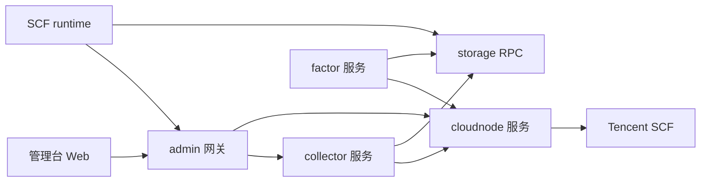
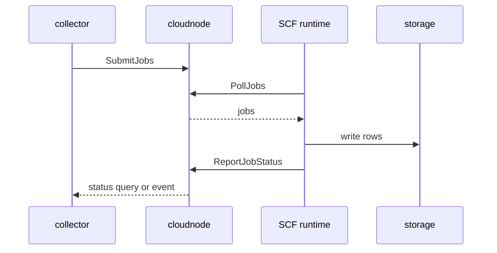
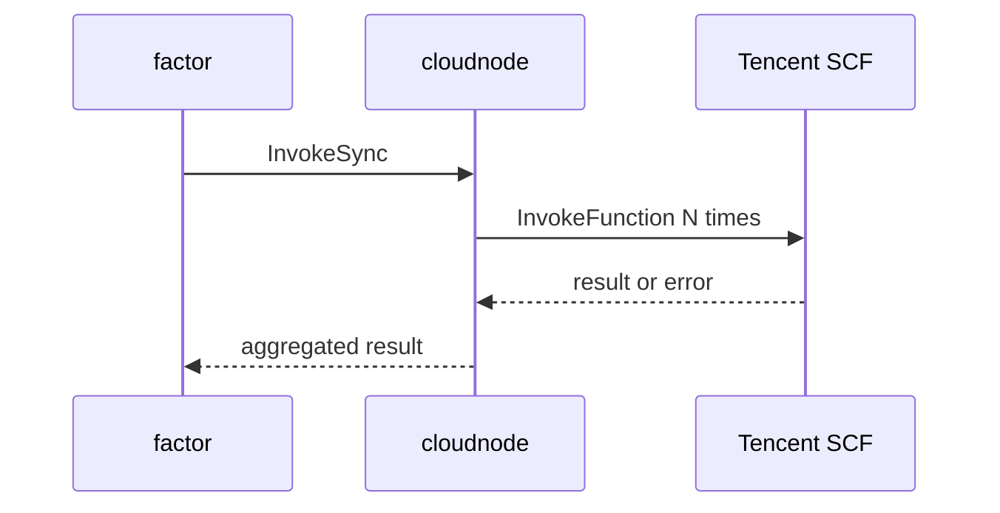

# 云节点执行平台架构

本文沉淀 MooX 对云函数节点、采集服务、因子服务的目标组织方式。核心结论是：云节点是系统级执行基础设施，不属于采集服务；采集、因子、交易等业务服务应通过统一的云节点执行平台使用云函数。

## 目标

MooX 需要同时支持单机部署和多服务部署。采集任务已经使用腾讯云 SCF 执行，后续因子计算也可能需要批量创建云节点、部署代码、同步调用多个云函数并聚合结果。因此，云节点能力需要从 `admin/collectmgr` 和采集业务中拆出来，形成独立服务。

目标架构满足以下要求：

- `admin` 只负责管理台网关、登录态、系统设置和页面入口。
- `collector` 负责采集规则、采集任务实例、交易所适配器和采集 planner。
- `cloudnode` 负责云节点池、代码包、部署、异步任务分发和同步 fan-out 调用。
- `factor` 可以复用 `cloudnode`，既支持离线异步计算，也支持实时同步计算。
- SCF runtime 提供通用执行协议，业务 workload handler 放在各业务模块内。
- 对外请求仍统一经过 `/api/admin` 和 `/api/service` 网关入口。

## 服务边界

| 服务 | 建议模块 | 职责 | 不应承担 |
| --- | --- | --- | --- |
| 管理后台/网关 | `modules/admin` | 登录态、加解密、管理台 API 入口、系统设置、服务部署信息 | 采集规则生成、云函数部署、业务任务状态机 |
| 云节点执行平台 | `modules/cloudnode` | 云节点池、云函数包、部署、异步 job、同步 invocation、SCF provider | 交易所业务、因子公式、K 线解析 |
| 采集服务 | `modules/collector` | 采集规则、采集任务实例、dataset-driven planner、交易所 adapter | 云节点池生命周期、通用 SCF 包管理 |
| 因子服务 | `modules/factor` | 因子定义、因子任务、因子结果聚合 | 云函数 provider 细节 |
| 存储服务 | `modules/storage` | metadata、access、primary、view、archive | 业务任务调度 |

服务依赖方向如下：



`collector` 和 `factor` 都依赖 `cloudnode`，但 `cloudnode` 不依赖业务服务的内部实现。业务状态由业务服务保存，云执行状态由 `cloudnode` 保存。

## 模块组织

建议新增独立模块：

```text
modules/cloudnode/
  cmd/moox-cloudnode/
    main.go

  proto/
    cloudnode.proto
    cloudjob.proto
    invocation.proto
    deployment.proto

  config/
    app.yaml
    trpc_go.yaml

  schema/
    cloudnode.sql

  internal/
    service/
      nodepool/
      deployment/
      package/
      asyncjob/
      invocation/

    providers/
      tencent-scf/
        client.go
        deploy.go
        invoke.go
        package.go

    runtime/
      protocol.go
      event.go
      lease.go

    repository/
      node_pool_repo.go
      deployment_repo.go
      package_repo.go
      async_job_repo.go
      invocation_repo.go

    domain/
      node_pool.go
      deployment.go
      package.go
      async_job.go
      sync_invocation.go
      execution.go

  scf/
    runtime/
      bootstrap/
      protocol/
      router/
      async_loop.go
      sync_invoke.go
```

目录名使用横线连接单词，例如 `tencent-scf`。Go package 名不能使用横线，因此该目录下 Go 文件统一使用短包名：

```go
package tencentscf
```

引用时显式使用 alias：

```go
import tencentscf "github.com/mooyang-code/moox/modules/cloudnode/internal/providers/tencent-scf"
```

业务模块组织如下：

```text
modules/collector/
  cmd/moox-collector/
    main.go

  proto/
    collector.proto
    collectmgr.proto

  schema/
    collector.sql

  internal/
    service/
      collectmgr/
    planner/
      generator.go
      dataset_source.go
      task_builder.go
    adapters/
      registry.go
      binance/
        spot_kline.go
    repository/
      task_rule_repo.go
      task_instance_repo.go
    domain/
      task_rule.go
      task_instance.go
      collect_params.go

  scf/
    workloads/
      binance-kline/
        handler.go
```

`modules/collector/scf` 只放采集业务 workload。SCF 的通用 runtime、心跳、协议、同步 invoke router 不放在 collector 中。

## 执行模式

`cloudnode` 需要一等支持异步和同步两种执行模式。

| 模式 | 入口 | 典型业务 | 特点 |
| --- | --- | --- | --- |
| 异步 job | `SubmitJobs`、`PollJobs`、`ReportJobStatus` | K 线采集、历史补仓、批量因子 | 可重试、可恢复、吞吐优先、最终一致 |
| 同步 invocation | `InvokeSync` | 实时因子、外部信号触发计算、策略同步判断 | 请求等待、fan-out/fan-in、延迟优先、可部分成功 |

异步流程：



同步流程：



## 云节点 API

后台管理入口：

```text
/api/admin/cloudnode/ListNodePools
/api/admin/cloudnode/ListNodes
/api/admin/cloudnode/ListPackages
/api/admin/cloudnode/ListDeployments
/api/admin/cloudnode/ListJobs
/api/admin/cloudnode/ListInvocations
/api/admin/cloudnode/CreateDeployment
```

后台服务入口：

```text
/api/service/cloudnode/ReportHeartbeat
/api/service/cloudnode/SubmitJobs
/api/service/cloudnode/PollJobs
/api/service/cloudnode/ReportJobStatus
/api/service/cloudnode/InvokeSync
```

这些 URL 继续由 admin 网关承载登录态、加解密和 codec。网关内部通过 RPC 调用 `moox-cloudnode`。

## 同步调用协议

同步调用请求需要表达 workload、部署版本、并发限制、超时预算和输入分片：

```json
{
  "owner_service": "factor",
  "workload_type": "factor.compute.realtime",
  "deployment_id": "factor-realtime-v1",
  "fanout": {
    "mode": "by_payloads",
    "max_parallelism": 32,
    "timeout_ms": 8000
  },
  "payloads": [
    {
      "request_id": "signal-001-part-001",
      "payload": {
        "factor_id": "momentum_v1",
        "subject_ids": ["BTCUSDT", "ETHUSDT"]
      }
    }
  ],
  "trace": {
    "record_detail": false,
    "sample_rate": 0.01
  }
}
```

同步调用响应需要保留部分成功语义：

```json
{
  "invocation_id": "sync-xxx",
  "status": "partial_success",
  "success_count": 31,
  "failed_count": 1,
  "timeout_count": 0,
  "duration_ms": 1260,
  "results": [
    {
      "request_id": "signal-001-part-001",
      "status": "success",
      "payload": {
        "values": []
      },
      "duration_ms": 234
    }
  ],
  "errors": []
}
```

同步调用默认只落 summary。明细结果由 `trace.record_detail` 或采样率控制，避免高频实时因子把数据库写爆。

## 数据模型归属

`cloudnode` 保存通用云执行状态：

```text
t_cloud_node_pools
t_cloud_nodes
t_cloud_function_packages
t_cloud_deployments
t_cloud_async_jobs
t_cloud_job_attempts
t_cloud_invocations
t_cloud_invocation_results
```

`collector` 保存采集业务状态：

```text
t_collector_task_rules
t_collector_task_instances
t_collector_execution_logs
```

业务任务引用云执行任务：

```text
t_collector_task_instances.cloud_job_id
t_factor_jobs.cloud_job_id
```

这样管理台可以同时展示业务视角和底层执行视角。

## 采集任务实例生成

采集任务实例生成逻辑放在 `modules/collector/internal/planner`，不再放在 `modules/admin/internal/service/collectmgr`。

采集规则参数表达数据来源、采集器、目标数据集和周期：

```json
{
  "source": {
    "kind": "dataset_subjects",
    "dataset_id": "binance_spot_kline"
  },
  "collector": {
    "exchange": "binance",
    "market": "spot",
    "data_type": "kline"
  },
  "target": {
    "dataset_id": "binance_spot_kline"
  },
  "schedule": {
    "intervals": ["30m"]
  }
}
```

Planner 读取 `dataset_subjects`，交给交易所 adapter 生成任务规格，再由 builder 生成完整任务实例。实例 ID 应由稳定字段生成：

```text
rule_id + exchange + market + data_type + subject_id + interval
```

重复生成时执行 upsert，不重复插入任务实例。

## SCF runtime 与业务 workload

通用 runtime 负责：

- 识别 async job event 和 sync invocation event。
- 处理 heartbeat、poll、lease、report。
- 统一日志、错误包装和超时控制。
- 调用业务 workload handler。

业务 workload 只实现统一接口：

```go
type WorkloadHandler interface {
    Handle(ctx context.Context, payload []byte) ([]byte, error)
}
```

采集 workload 放在：

```text
modules/collector/scf/workloads/binance-kline/
```

因子 workload 放在：

```text
modules/factor/scf/workloads/realtime-factor/
modules/factor/scf/workloads/batch-factor/
```

打包时，`cloudnode` 将通用 runtime 和指定业务 workload 组合为一个云函数代码包。

## 部署信息

`t_service_deployments` 应体现独立部署服务：

```text
moox-admin
moox-web-host
moox-storage-primary
moox-storage-access
moox-storage-view
moox-storage-archive
moox-cloudnode
moox-collector
moox-factor
moox-trade
```

SCF 探测时由系统把必要服务地址带给云函数。云函数不应依赖打包器猜测环境地址。

## 迁移原则

- 先拆服务边界，再调整业务逻辑。
- 外部 URL 可以保持 `/api/admin` 和 `/api/service`，内部实现迁移到独立服务。
- `cloudnode` 不理解业务 payload，只保存和调度通用 execution。
- `collector` 不直接管理云函数节点池，只提交 cloudnode job。
- `factor` 可以同步或异步使用 cloudnode。
- 横线目录用于可读性，Go package 使用无横线短名。
- 每次迁移都保持一个可构建、可回滚的中间状态。
