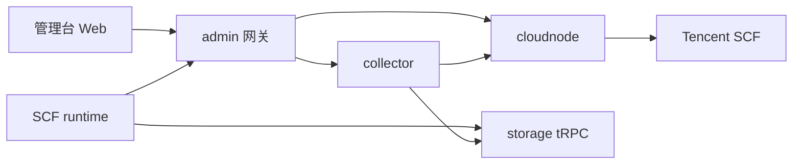
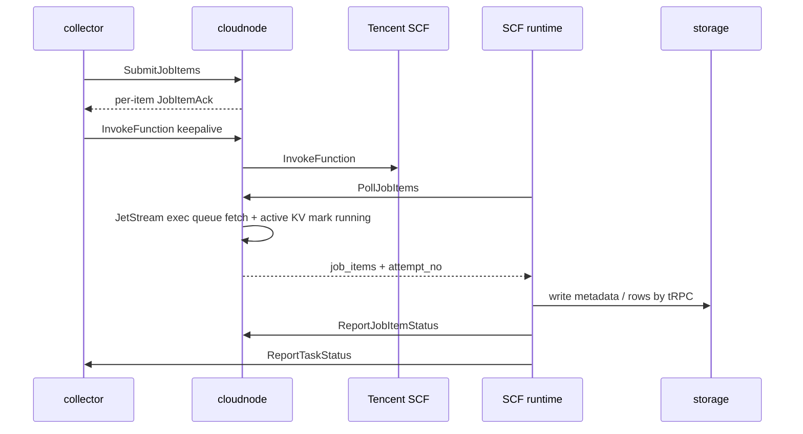

# 云节点执行平台架构

本文记录 MooX 云节点执行平台的当前落地架构。核心共识是：云节点不是 collector 的私有能力，而是系统级云函数执行基础设施；collector 只是第一个业务接入方。

## 核心结论

- `admin` 只负责管理台、网关、登录态、后台服务鉴权、系统设置和 `t_service_deployments` 服务部署信息。
- `collector` 是采集业务服务，负责采集规则、任务实例、planner、交易所适配器和 dataset-driven 任务生成。
- `cloudnode` 是云节点执行平台，负责云账户、云节点、云函数代码包、JetStream JobItem 执行队列、48 小时 active KV 状态、终态历史日库和腾讯云 SCF provider。
- `packages/cloudruntime` 是跨业务复用的 SCF runtime，负责心跳、拉取 JobItem、按 `job_type` 调度 handler、上报执行结果。
- 当前正常执行路径只使用异步 JobItem。`InvokeFunction` 用于管理台直调、部署后唤醒和 keepalive 触发；`InvokeSync` RPC 仍保留，但 invocation 摘要/明细不再落 SQLite，只写本地服务日志。
- SCF 写入 storage 的高频数据链路直连 storage tRPC，避免经过 admin 网关转发。

## 服务边界

| 独立服务 | 模块 | 主要职责 | 不应承担 |
| --- | --- | --- | --- |
| 管理后台/网关 | `modules/admin` | 登录态、管理台 API、后台服务 HMAC 鉴权、网关转发、服务部署信息 | 采集规则实现、云函数部署实现、云节点调度状态机 |
| 采集服务 | `modules/collector` | 采集规则、任务实例、planner、采集 job handler、交易所 sources | 云节点池生命周期、通用 SCF provider、存储引擎实现 |
| 云节点执行平台 | `modules/cloudnode` | 云账户、云节点、代码包、异步 JobItem、attempt、SCF provider | Binance/Kline 等业务 payload 解析 |
| 云函数运行时 | `packages/cloudruntime` | keepalive、PollJobItems、ReportJobItemStatus、handler registry | 具体采集业务、云厂商控制面 |
| 存储服务 | `modules/storage` | Metadata、PrimaryStore、DataShard、DataView、ViewBuilder、ViewIndex | 采集任务调度、云节点调度 |
| 前端静态服务 | `web-host` | 管理台静态页面 | API 代理或业务网关 |

服务依赖方向：


```mermaid
flowchart LR
  Web["管理台 Web"] --> Admin["admin 网关"]
  Admin --> Collector["collector"]
  Admin --> CloudNode["cloudnode"]
  Collector --> CloudNode
  CloudNode --> TencentSCF["Tencent SCF"]
  SCF["SCF runtime"] --> Admin
  SCF --> Storage["storage tRPC"]
  Collector --> Storage
```

`collector` 通过 CloudNodeMgr 协议或 `/api/service/cloudnode/*` 使用 `cloudnode` 能力，但不能直接 import `modules/cloudnode/internal/...`。`cloudnode` 不反向依赖业务服务。业务状态保存在业务模块中，云执行状态保存在 `cloudnode` 中。

## 术语边界

```text
task_rule      = 采集规则
task_instance  = 采集任务实例
job            = collector 生成的一次采集作业
job_item       = job 拆出的最小可执行单元
attempt        = job_item 的一次执行尝试
batch_change   = 云节点控制面批量管理变更
batch_id       = 某次 batch_change 的批次 ID
invocation     = 保留的云函数直调记录，不是 collector 正常任务路径
```

`BatchCreateNodes`、`BatchDeleteNodes`、`BatchDeployNodes` 是管理面 catalog 操作，返回 `BatchChangeResult`。`batch_id` 不等同于 collector 的 `task_instance`，也不等同于 `job_item_id`。

## 请求路径约定

| 调用方 | 路径 | 说明 |
| --- | --- | --- |
| 管理台前端 | `/api/admin/*` | 有登录态校验，网关转发到 admin、collector、cloudnode、storage 等后端服务 |
| 后台服务/SCF | `/api/service/*` | 有 HMAC 鉴权，用于心跳、任务拉取、状态上报 |
| SCF 到 storage | storage tRPC 地址 | 高频数据写入使用 `storage-primary` 的统一 Storage tRPC |
| MooX 到 SCF | 腾讯云 `InvokeFunction` | 由 `cloudnode` provider 封装，不由 collector 直接调用腾讯云 SDK |

`web-host` 只提供静态资源。浏览器 API 请求直接访问 admin gateway，不经过 `web-host` 反向代理。

## 模块组织

### `modules/cloudnode`

```text
modules/cloudnode/
  cmd/server/                 moox-cloudnode 服务入口
  cmd/cli/                    moox-cloudnode-cli schema 初始化入口
  config/
  schema/cloudnode.sql
  internal/
    bootstrap/
    config/
    repository/              云账户、节点、代码包、invocation 持久化
    jobqueue/                JetStream 执行队列
    jobstate/                JetStream KV active JobItem 状态
    jobhistory/              终态 JobItem 历史日库
    projection/              节点心跳批处理
    rpc/                     CloudNodeMgr RPC 入口
    providers/tencentscf/   腾讯云 SCF provider，Go package 名为 tencentscf
    spacecontext/
    storage/
  proto/cloudnode.proto
```

CloudNodeMgr 协议由 `modules/cloudnode/proto/cloudnode.proto` 维护，生成到 `modules/cloudnode/proto/cloudnodegen`。

### `modules/collector`

```text
modules/collector/
  cmd/
    server/                   moox-collector 控制面入口
    cli/                      moox-collector-cli schema 初始化入口
    scf/                      moox-collector-scf 云函数入口
  internal/
    app/control/
    app/runtime/
    app/runtimeboot/
    planner/
    taskpublisher/
    taskrunner/
    serverless/
    executor/
    sources/
    reporter/
    rpc/
  proto/collector.proto
```

collector 控制面负责生成任务实例和提交 JobItem；SCF 入口与业务 handler 位于 collector 模块内；通用云函数运行逻辑位于 `packages/cloudruntime`。

## 异步 JobItem 执行模型


```mermaid
sequenceDiagram
  participant Collector as collector
  participant CloudNode as cloudnode
  participant TencentSCF as Tencent SCF
  participant Runtime as SCF runtime
  participant Storage as storage

  Collector->>CloudNode: SubmitJobItems
  CloudNode-->>Collector: per-item JobItemAck
  Collector->>CloudNode: InvokeFunction keepalive
  CloudNode->>TencentSCF: InvokeFunction
  Runtime->>CloudNode: PollJobItems
  CloudNode->>CloudNode: JetStream exec queue fetch + active KV mark running
  CloudNode-->>Runtime: job_items + attempt_no
  Runtime->>Storage: write metadata / rows by tRPC
  Runtime->>CloudNode: ReportJobItemStatus
  Runtime->>Collector: ReportTaskStatus
```

当前执行队列模型：

```text
JetStream MOOX_CLOUDNODE_EXEC
  = JobItem 执行队列事实源，负责投递、ACK、NAK、TERM、重投。

JetStream KV MOOX_CLOUDNODE_JOB_ACTIVE
  = active JobItem 状态、attempt 和取消指令，TTL 48 小时。

SQLite data/cloudnode/jobs/YYYYMMDD.db
  = 终态 JobItem 和 attempt 快照，只作本机排障与短期审计；管理台当前不查询历史日库。
```

CloudNode 进程内的主 SQLite 连接池固定为单连接。JetStream 和 active KV 承担执行队列、重试和在线状态压力，主 SQLite 不再作为并发租约队列或 JobItem 状态表使用；单连接让剩余控制面写入和心跳批处理在进程内排队，避免同进程多连接争抢 SQLite 写锁。

CloudNode 使用的 subject 前缀固定为 `moox.cloudnode.*`，不复用 storage 的 `moox.storage.*`：

```text
moox.cloudnode.exec.v1.jobitem.s.<space_token>.pkg.<package_token>.type.<job_type_token>
```

`attempt` 表示同一个 JobItem 的一次执行尝试。SCF poll 时，CloudNode 从 JetStream 拉取消息，再用 active KV CAS 把状态从 `PENDING` 标记为 `RUNNING` 并创建 attempt。执行成功时，CloudNode ACK 执行消息并把终态 best-effort 写入历史日库；可重试失败时 NAK 执行消息，JetStream 负责重投；永久失败或取消时 TERM 执行消息。旧节点迟到上报时，CloudNode 通过 `attempt_no` 拒绝旧结果。

tRPC 定时器 `cloudnodeJobHistorySchedule` 每天运行一次，按触发时区的自然日创建 `D+1`、`D+2` 两个历史日库，并删除 `D-2`、`D-3` 两个历史库。SCF 执行过程日志由函数 stdout 进入 CLS，本地不维护执行日志表。

该删除方式在服务连续运行时提供 2 天短期历史，但不会扫描所有更老文件；跨日停机后需要检查历史目录残留。全系统自动清理、永久数据和磁盘巡检见[数据保留与磁盘空间](运维/数据保留与磁盘空间.md)。

`ReportHeartbeat` 不再每次同步写 SQLite。CloudNode 先写入 latest-wins heartbeat buffer，后台按 `space_id + node_id` 合并后批量 upsert 节点心跳，减轻 SQLite 写锁压力。

## CloudNode API

管理台 API 通过 `/api/admin/cloudnode/*` 暴露：

```text
GetNodeList
UpdateNode
InvokeFunction
BatchCreateNodes
BatchDeleteNodes
BatchDeployNodes
ListCloudAccounts
CreateCloudAccount
UpdateCloudAccount
DeleteCloudAccount
GetCOSAccountInfo
ListCloudRegions
GetPackageList
GetPackageDetail
DeletePackage
GetPackageDownloadURL
InitPackageUpload
CompletePackageUpload
```

后台服务 API 通过 `/api/service/cloudnode/*` 暴露：

```text
ReportHeartbeat
SubmitJobItems
InvokeFunction
PollJobItems
ReportJobItemStatus
CancelJobItem
GetJobItem
ListJobItems
ListJobItemAttempts
InvokeSync
```

`InvokeSync` 是保留 RPC。当前 collector 正常任务执行不使用它，也不围绕它维护第二套任务生命周期。

`SubmitJobItems` 使用逐条 ACK 语义，单条状态为 `CREATED`、`DEDUPLICATED` 或 `REJECTED`：

```json
{
  "items": [
    {
      "space_id": "crypto",
      "job_id": "rule-binance-kline",
      "job_item_id": "task-instance-id",
      "job_type": "collect.kline",
      "code_package_id": "moox-collector_dev",
      "params": {
        "exchange": "binance",
        "market": "spot",
        "data_type": "kline",
        "dataset_id": "binance_spot_kline",
        "subject_id": "BTCUSDT",
        "symbol": "BTCUSDT",
        "interval": "1m"
      },
      "priority": 100
    }
  ]
}
```

`PollJobItemsReq` 显式传入：

```text
space_id
node_id
supported_job_types
limit
runtime_version
protocol_version
```

`PollJobItemsRsp.poll_time`、`JobItemDetail.recover_at/create_time/start_time/finish_time` 已使用 `google.protobuf.Timestamp`。云节点 catalog 的部分时间字段仍是字符串，后续再按模块逐步收敛。

`ReportHeartbeatRsp` 可返回 `ControlDirective`，用于后续取消、降速、暂停等反向控制。当前 collector 短任务运行时会解析并记录指令；取消不要求 SCF 立即感知，CloudNode 会在后续 poll/report/heartbeat 过程中逐步收敛。

## Collector 任务生成模型

采集任务实例由采集规则和 dataset subjects 生成，不在页面或脚本中手工拼字段。

以币安现货 K 线为例：

```text
采集规则
  exchange = binance
  market = spot
  data_type = kline
  source.kind = dataset_subjects
  source.dataset_id = binance_spot_kline
  schedule.interval = 1m
  target.job_type = collect.kline
  target.code_package_id = moox-collector_dev
```

生成逻辑：

```text
读取规则
  -> 解析 collect_params
  -> 按 data_type planner 展开
  -> 从 storage metadata 读取 dataset subjects
  -> 生成或更新 task instances
  -> 提交 cloudnode JobItem
```

`TaskInstance` 当前显式保存 `space_id`、`task_id`、`rule_id`、`exchange`、`market`、`data_type`、`dataset_id`、`subject_id`、`symbol`、`interval`、`task_params`、`last_exec_node`、`last_exec_status`、`last_exec_time`、`result`、`is_deleted bool`、`cloud_job_item_id` 等字段。`cloud_job_item_id` 只用于把 collector 任务实例和 CloudNode JobItem 关联起来，不承载业务 payload。

稳定任务 ID 由以下字段计算，保证重复 planner 可幂等 upsert：

```text
space_id + rule_id + exchange + market + data_type + dataset_id + subject_id + interval
```

## SCF Runtime 约定

唤醒 SCF 时，CloudNode 构造 keepalive event。服务地址来自 admin `t_service_deployments` 的 active 记录：

```json
{
  "action": "keepalive",
  "source": "collector_schedule",
  "timestamp": "2026-07-04T00:00:00Z",
  "service_gateway_target": "106.53.107.122:11000",
  "storage_primary_target": "106.53.107.122:20200",
  "data": {
    "wake_reason": "collector_job_items"
  }
}
```

`service_gateway_target` 指向 Node Service Gateway。`storage_primary_target` 指向 `storage-primary` 的 Storage tRPC 服务。

通用 runtime 负责：

- 解析云函数事件。
- 读取 `service_gateway_target` 和 storage target。
- 向 `/api/service/cloudnode/ReportHeartbeat` 上报节点心跳。
- 通过 `/api/service/cloudnode/PollJobItems` 拉取任务。
- 按 `job_type` 调用业务 handler。
- 通过 `/api/service/cloudnode/ReportJobItemStatus` 上报 JobItem 执行结果。

业务 handler 负责：

- 调用交易所或外部数据源。
- 写入 storage metadata / access。
- 必要时调用 `/api/service/collectmgr/ReportTaskStatus` 回写 collector 任务状态。

## 服务部署信息

`t_gateway_nodes` 维护可调用节点，`t_service_deployments` 按节点维护可独立部署服务。SCF runtime 不从打包器硬编码服务地址，而是在 keepalive event 中接收当前 active 部署 target。

当前默认服务名：

| 服务名 | 类型 | 默认地址 | 说明 |
| --- | --- | --- | --- |
| `admin_gateway` | `gateway` | `http://106.53.107.122:11000` | 管理台请求入口 `/api/admin/*` |
| `service_gateway` | `gateway` | 节点 `public_address` | 后台/SCF 请求入口 `/api/service/*`（节点 Caddy + Node Gateway + service HMAC） |
| `web_host` | `frontend` | `http://106.53.107.122:9527` | 前端静态资源服务，不代理 API |
| `moox_collector` | `collector` | `http://127.0.0.1:11402` | 采集规则、任务实例、planner |
| `moox_cloudnode` | `cloudnode` | `http://127.0.0.1:11401` | 云账户、云节点、代码包、异步 JobItem |
| `storage-primary` | `storage` | `http://106.53.107.122:20200` | Metadata + PrimaryStore 服务 |
| `storage-view` | `storage` | `http://106.53.107.122:20202` | DataView + ViewBuilder 服务 |

`moox_cloudnode` 的服务端口默认只面向本机或内网，由 admin 网关转发公网请求。SCF 与后台服务应访问 `service_gateway`，并通过 HMAC 鉴权。

## 与 storage 的关系

采集 workload 对 storage 的调用分两类：

- 数据注册和 subject 绑定：调用 storage metadata tRPC。
- K 线和记录写入：调用 storage-primary tRPC。

storage 当前仓库默认是单进程 `roles: [primary, view]`，`eventbus.type: memory`，`eventbus.embedded.enabled: false`。拆出 `storage-view` 或私网 `storage-shard` 时，需要把跨进程事件总线切换为 NATS 或等价传输；Archive 属于独立 `modules/archive` 服务。
