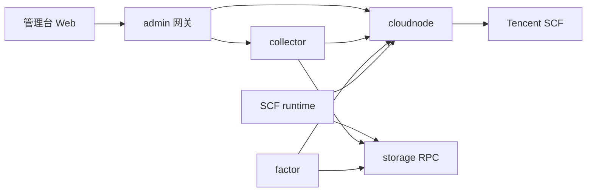
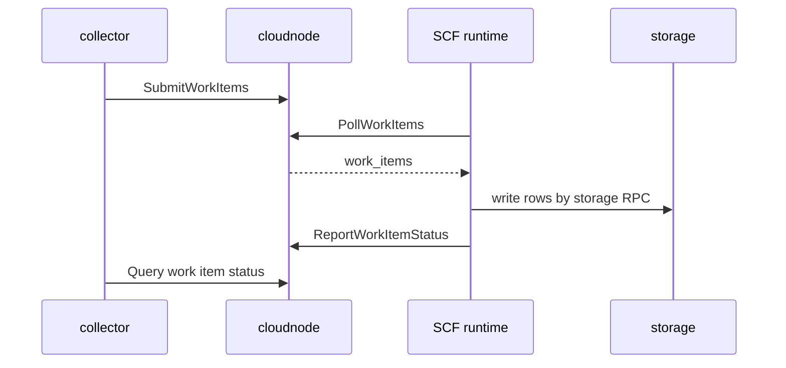
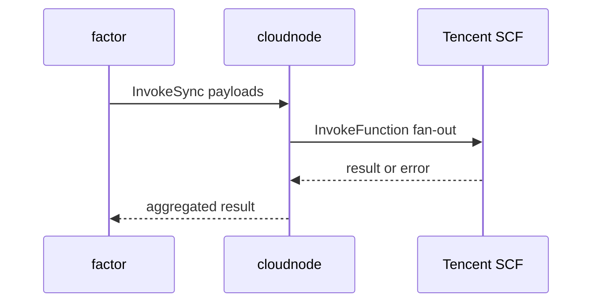

# 云节点执行平台架构

本文沉淀 MooX 关于采集服务、云节点执行平台、SCF 云函数 runtime、因子服务复用云节点能力的目标架构。当前共识是：云节点不是采集服务的私有能力，而是 MooX 系统级执行基础设施；采集、因子、交易等业务服务都可以通过统一的云节点服务使用腾讯云 SCF 或未来其他云执行环境。

## 核心结论

- `admin` 只负责管理台、网关、登录态、后台服务加解密、系统设置和服务部署信息维护。
- `collector` 从 `admin/collectmgr` 中独立出来，成为采集业务服务，负责采集规则、采集任务实例、交易所适配器、dataset-driven 任务生成。
- `cloudnode` 独立成为云节点执行平台，负责云节点池、云函数包、部署版本、异步 work_item、同步 invocation、云厂商 provider。
- SCF 通用运行时放到根级 `packages/cloudruntime`；`cloudnode` 只提供云节点控制面和云厂商 provider 能力，采集业务 SCF 入口与 workload 放到 `collector`。
- `factor` 后续可能同步调用 N 个云函数并等待结果，因此云节点平台必须同时支持异步执行和同步 fan-out/fan-in 调用。
- 腾讯云 SCF provider 目录命名使用 `tencent-scf`，Go package 名使用 `tencentscf`。
- 前端管理台请求统一走 `/api/admin/*`，后台服务和 SCF 请求统一走 `/api/service/*`。
- SCF 写入 storage 的高频数据链路可以直接走 storage RPC，避免经过 admin 网关转发造成额外延迟和带宽成本。

## 服务边界

| 独立服务 | 模块 | 主要职责 | 不应承担 |
| --- | --- | --- | --- |
| 管理后台/网关 | `modules/admin` | 登录态、管理台 API、后台服务加解密、网关转发、服务部署信息 | 采集规则业务实现、云函数部署实现、云节点调度状态机 |
| 采集服务 | `modules/collector` | 采集规则、任务实例、任务生成 planner、数据源 sources、采集 workload | 云节点池生命周期、通用 SCF provider、因子计算 |
| 云节点执行平台 | `modules/cloudnode` | 节点池、云节点、代码包、部署、异步 work_item、同步 invocation、SCF provider | Binance/Kline/Factor 等业务 payload 解析 |
| 因子服务 | `modules/factor` | 因子定义、因子计算任务、同步或异步计算结果聚合 | 云函数 provider 细节、采集规则 |
| 存储服务 | `modules/storage` | metadata、access、primary、view、archive 等存储能力 | 采集任务调度、云节点调度 |
| 前端静态服务 | `modules/web-host` | 管理台静态页面 | API 代理 |

服务依赖方向如下：


```mermaid
flowchart LR
  Web["管理台 Web"] --> Admin["admin 网关"]
  Admin --> Collector["collector"]
  Admin --> CloudNode["cloudnode"]
  Collector --> CloudNode
  Factor["factor"] --> CloudNode
  CloudNode --> TencentSCF["Tencent SCF"]
  SCF["SCF runtime"] --> CloudNode
  SCF --> Storage["storage RPC"]
  Collector --> Storage
  Factor --> Storage
```

`collector` 和 `factor` 可以通过 CloudNodeMgr 协议或 `/api/service/cloudnode/*` 使用 `cloudnode` 能力，但不能直接 import `modules/cloudnode/internal/...`。`cloudnode` 不反向依赖任何业务服务。业务状态保存在业务服务中，云执行状态保存在 `cloudnode` 中。

## 术语边界

```text
task_rule      = 采集规则
task_instance  = 采集任务实例
batch_change   = 云节点控制面批量管理变更
batch_id       = 某次 batch_change 的批次 ID
work_item      = SCF 异步执行待处理工作项
execution      = work_item 的一次执行记录
invocation     = 同步云函数调用
```

云节点批量管理接口保持短方法名：

```text
BatchCreateNodes
BatchDeleteNodes
BatchDeployNodes
```

它们返回 `BatchChangeResult`，核心字段为 `batch_id` 和 `processed_count`。`batch_id` 不等同于 collector 的 `task_instance`，也不等同于 SCF 异步执行队列中的 `work_item_id`。

## 请求路径约定

| 调用方 | 路径 | 说明 |
| --- | --- | --- |
| 管理台前端 | `/api/admin/*` | 有登录态校验，网关转发到 admin、collector、cloudnode、storage 等后端服务 |
| SCF 云函数 | `/api/service/*` | 后台服务入口，有加解密协议，用于心跳、任务状态上报、云节点任务拉取 |
| SCF 到 storage | storage RPC 地址 | 高频数据写入直接走 storage RPC，例如 `WriteTimeSeriesRows`、`WriteRecordRows`、`RegisterDataSubject` |
| MooX 到 SCF | 腾讯云 `InvokeFunction` | 由 `cloudnode` provider 封装，不由 collector 直接调用腾讯云 SDK |

## 目标模块组织

### `modules/cloudnode`

```text
modules/cloudnode/
  cmd/moox-cloudnode/
    main.go

  config/
    app.yaml
    trpc_go.yaml

  schema/
    cloudnode.sql

  internal/
    bootstrap/
      server.go
    config/
      config.go
    repository/
      models.go
      repository.go
      node.go
      account.go
      package.go
      work_item.go
      invocation.go

    rpc/
      server.go
      common.go
      node.go
      account.go
      package.go
      workitem.go
      invocation.go

    providers/
      tencent-scf/
        client.go

    storage/
      manager.go
```

`providers/tencent-scf` 目录使用横线命名，Go package 使用：

```go
package tencentscf
```

`modules/cloudnode` 内部业务代码导入时使用 alias；其他业务模块不能 import `modules/cloudnode/internal/...`：

```go
import tencentscf "github.com/mooyang-code/moox/modules/cloudnode/internal/providers/tencent-scf"
```

CloudNodeMgr 和 CollectMgr 协议分别由 `modules/cloudnode/proto` 与 `modules/collector/proto` 维护，并生成到 `cloudnodegen` / `collectorgen`。

### `modules/collector`

```text
modules/collector/
  cmd/moox-collector/
    main.go

  config/
    app.yaml
    trpc_go.yaml

  schema/
    collector.sql

  internal/
    serverless/
      handler.go

    taskrunner/
      poller.go

    domain/
      task_rule.go
      task_instance.go
      collect_params.go

    repository/
      task_rule.go
      task_instance.go

    rpc/
      service.go
      convert.go

    planner/
      storagesource/
      task_builder.go

    sources/
      binance/
        kline.go
        symbol.go
        client/
```

采集服务协议由 `modules/collector/proto` 维护。`modules/collector/internal/serverless` 只放采集云函数入口和 workload 编排，`modules/collector/internal/taskrunner` 只负责把 CloudNode work_item 转成采集任务事件；通用心跳、通用云节点协议、通用同步调用 router 不放在 collector，跨业务通用 runtime 位于 `packages/cloudruntime`。

## 云节点执行模型

云节点平台必须支持两种执行模式：异步 work_item 和同步 invocation。

| 模式 | 入口 | 典型场景 | 结果模型 |
| --- | --- | --- | --- |
| 异步 work_item | `SubmitWorkItems`、`PollWorkItems`、`ReportWorkItemStatus` | K 线采集、历史补仓、离线批量因子 | 可重试、可恢复、最终一致 |
| 同步 invocation | `InvokeSync` | 外部信号触发实时因子、策略同步判断、低延迟并行计算 | 请求等待、fan-out/fan-in、可部分成功 |

异步执行流程：


```mermaid
sequenceDiagram
  participant Collector as collector
  participant CloudNode as cloudnode
  participant SCF as SCF runtime
  participant Storage as storage

  Collector->>CloudNode: SubmitWorkItems
  SCF->>CloudNode: PollWorkItems
  CloudNode-->>SCF: work_items
  SCF->>Storage: write rows by storage RPC
  SCF->>CloudNode: ReportWorkItemStatus
  Collector->>CloudNode: Query work item status
```

同步执行流程：


```mermaid
sequenceDiagram
  participant Factor as factor
  participant CloudNode as cloudnode
  participant TencentSCF as Tencent SCF

  Factor->>CloudNode: InvokeSync payloads
  CloudNode->>TencentSCF: InvokeFunction fan-out
  TencentSCF-->>CloudNode: result or error
  CloudNode-->>Factor: aggregated result
```

## CloudNode API 设计

管理台 API 通过 `/api/admin/cloudnode/*` 暴露：

```text
GetNodeList
UpdateNode
InvokeFunction
BatchCreateNodes
BatchDeleteNodes
BatchDeployNodes
ListCloudAccounts
CreateCloudAccount
UpdateCloudAccount
DeleteCloudAccount
GetCOSAccountInfo
ListCloudRegions
GetPackageList
GetPackageDetail
DeletePackage
GetPackageDownloadURL
InitPackageUpload
CompletePackageUpload
```

`BatchCreateNodes`、`BatchDeleteNodes`、`BatchDeployNodes` 是管理面 catalog 操作，由 `moox-cloudnode`
直接更新云节点记录或部署投影；它们不进入 `SubmitWorkItems/PollWorkItems/ReportWorkItemStatus` 云执行 work_item 队列。

后台服务 API 通过 `/api/service/cloudnode/*` 暴露：

```text
ReportHeartbeat
SubmitWorkItems
PollWorkItems
ReportWorkItemStatus
InvokeSync
```

`SubmitWorkItems` 请求需要包含：

```json
{
  "work_items": [
    {
      "owner_service": "collector",
      "owner_ref": "task-instance-id",
      "workload_type": "collector.binance.spot.kline",
      "deployment_id": "collector-binance-kline-v1",
      "payload": {
        "exchange": "binance",
        "market": "spot",
        "data_type": "kline",
        "dataset_id": "binance_spot_kline",
        "subject_id": "BTCUSDT",
        "symbol": "BTCUSDT",
        "interval": "1m"
      },
      "priority": 100,
      "lease_timeout_ms": 600000,
      "retry_policy": {
        "max_attempts": 3,
        "backoff_ms": 30000
      }
    }
  ]
}
```

`InvokeSync` 请求需要包含：

```json
{
  "owner_service": "factor",
  "workload_type": "factor.compute.realtime",
  "deployment_id": "factor-realtime-v1",
  "fanout": {
    "mode": "by_payloads",
    "max_parallelism": 32,
    "timeout_ms": 8000
  },
  "payloads": [
    {
      "request_id": "signal-001-part-001",
      "payload": {
        "factor_id": "momentum_v1",
        "subject_ids": ["BTCUSDT", "ETHUSDT"]
      }
    }
  ],
  "trace": {
    "record_detail": false,
    "sample_rate": 0.01
  }
}
```

## Collector 任务生成模型

采集任务实例应由采集规则和 dataset 中的数据对象生成，而不是在页面或脚本中手工拼字段。

以币安现货 K 线为例：

```text
采集规则
  exchange = binance
  market = spot
  data_type = kline
  source.kind = dataset_subjects
  source.dataset_id = binance_spot_kline
  schedule.interval = 30m
  target.workload_type = collector.binance.spot.kline
```

生成逻辑：

```text
读取规则 -> 解析 collect_params -> 按 data_type planner 展开 -> 必要时从 storage metadata 读取 dataset subjects -> 生成 task instances -> 提交 cloudnode work_items
```

任务实例必须显式保存以下字段：

```text
space_id
rule_id
task_id
exchange
market
data_type
dataset_id
subject_id
symbol
interval
planned_exec_node
last_exec_node
last_exec_status
last_exec_time
task_params
cloud_work_item_id
is_deleted
```

稳定任务 ID 建议由以下字段计算：

```text
space_id + rule_id + exchange + market + data_type + dataset_id + subject_id + interval
```

这样同一规则重复生成任务实例时可以幂等 upsert，不会生成重复任务。

## SCF Runtime 与 Workload 分层

通用 runtime 放在 `packages/cloudruntime`，负责：

- 解析云函数事件。
- 识别异步 work_item 或同步 invocation。
- 加载服务部署信息。
- 调用 `/api/service/cloudnode/*` 拉取或上报任务。
- 调度 workload handler。
- 统一返回执行结果。

业务 workload 放在各业务模块，例如 collector 的 `modules/collector/internal/serverless` 入口以及 `executor` / `sources` 采集实现，负责：

- 调用币安接口读取现货标的和 K 线。
- 将现货标的写入 `binance_spot_kline` dataset。
- 将 K 线写入 storage access。
- 不直接操作云节点池、云函数部署、节点心跳状态机。

## 服务部署信息

`system.service_deployments` 或对应服务部署表应按可独立部署服务维护，不再按接口粒度拆得过细。

建议服务名：

| 服务名 | 类型 | 默认地址 | 说明 |
| --- | --- | --- | --- |
| `moox-admin` | `admin` | `http://106.53.107.122:11000` | 承载 `/api/admin/*` 和 `/api/service/*` 网关 |
| `moox-web-host` | `web` | `http://106.53.107.122:9527` | 只提供静态页面，不代理 API |
| `moox-collector` | `collector` | `http://106.53.107.122:11402` | 采集规则、任务实例、planner |
| `moox-cloudnode` | `cloudnode` | `http://106.53.107.122:11401` | 云节点池、部署、work_item、invocation |

**安全约定：** `moox-cloudnode` 的 TRPC HTTP 端口（默认 `11401`）应仅绑定本机或内网，供 admin 网关转发；业务服务（collector runtime、collector 控制面、factor、trade）调用执行面 RPC 时必须走 `/api/service/cloudnode/*` 并经 HMAC 鉴权，禁止将 `11401` 直接暴露到公网。
| `moox-storage-access` | `storage` | `http://106.53.107.122:20201` | storage access RPC |
| `moox-storage-metadata` | `storage` | `http://106.53.107.122:20202` | storage metadata RPC |
| `moox-storage-primary` | `storage` | `http://106.53.107.122:20203` | storage primary |
| `moox-storage-view` | `storage` | `http://106.53.107.122:20204` | storage view builder/query |
| `moox-storage-archive` | `storage` | `http://106.53.107.122:20205` | storage archive，可独立消费 NATS 事件 |
| `moox-factor` | `factor` | 待部署 | 因子服务，后续复用 cloudnode |
| `moox-trade` | `trade` | 待部署 | 交易服务 |

SCF runtime 不应从打包器硬编码获取服务地址。MooX 探测或初始化流程应把当前服务部署信息下发给 SCF，SCF 根据下发信息访问 admin 网关、cloudnode 和 storage RPC。

## 与 storage 的关系

采集 workload 对 storage 的调用分两类：

- 数据注册和 subject 绑定：调用 storage metadata RPC。
- K 线和记录写入：调用 storage access RPC。

storage 内部可以按单机或多机部署：

```text
access -> primary -> view
access -> primary -> archive
```

`view` 和 `archive` 独立部署时通过 RPC 读取 metadata/access 数据，并可通过 NATS 接收变更事件。单机部署可以继续使用 memory eventbus，多机部署切换到 NATS 配置。
