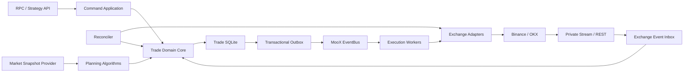

# Trade 交易模块架构设计

## 1. 文档状态

- 状态：已确认的目标架构
- 日期：2026-07-11
- 范围：`modules/trade`
- 前提：MooX 是新项目，不兼容旧 Trade 数据，也不执行数据迁移；现有数据可直接废弃。
- 阶段约束：第一阶段完成通用交易内核，第二阶段必须交付目标仓位调仓规划。

本文替代现有 Trade 模块以 RPC 编排和定时同步为中心的设计。Python 实盘程序仅作为交易细节参考，不继承其定时驱动、文件耦合、随机拆单和过程式大函数设计。

## 2. 目标与非目标

### 2.1 目标

1. 建立事件驱动、可恢复、可审计的交易内核。
2. 以订单状态机、成交账本和持仓投影为权威业务模型。
3. 将交易所差异限制在 Adapter 和 Instrument Rules 边界内。
4. 将拆单、定价、重试和执行排序设计成可替换算法。
5. 使用 SQLite 作为 Trade 自有权威数据库，并通过本地事务 Outbox 接入 MooX EventBus。
6. 第一阶段支持通用下单、撤单、撤单后重新下单、成交结算和对账。
7. 第二阶段支持目标仓位驱动的调仓规划，并复用第一阶段交易内核。

### 2.2 非目标

- 不把 Storage 模块作为 Trade 订单、成交、账本或持仓的权威存储或投影。
- 不使用定时同步作为交易主链路。
- 不在第一阶段实现智能调仓算法。
- 不允许算法插件绕过风控、状态机、账本或幂等约束。
- 不兼容现有 Trade Schema、Proto 或历史数据。
- 不在当前个人系统中区分管理员和普通成员；资源按 Space 共享。

## 3. 核心原则

### 3.1 事件驱动，定时任务只做兜底

RPC 只创建命令或意图，后续由领域事件推进：

```text
PlaceOrderCommand
  -> OrderIntentCreated
  -> OrderSubmitRequested
  -> OrderAcknowledged | OrderSubmitUnknown | OrderRejected
  -> FillReceived
  -> LedgerPosted
  -> PositionUpdated
  -> OrderCompleted
```

交易所私有 WebSocket、REST 查询结果和人工操作统一转换成领域事件。定时任务仅承担：

- `SUBMIT_UNKNOWN` 等异常状态的超时扫描；
- WebSocket 断线后的补偿查询；
- 低频全量对账；
- Outbox/Inbox、Saga 卡住任务的恢复。

### 3.2 本地事务强一致，跨边界最终一致

一次领域变更在同一 SQLite 事务内完成：

```text
聚合状态 + 账本分录 + Inbox 去重 + Outbox 事件
```

事务提交后由 Outbox Relay 发布到 MooX EventBus。EventBus 使用至少一次投递，所有消费者必须幂等。数据库提交与事件发布之间不允许双写裸奔。

### 3.3 算法决定如何执行，领域核心决定什么是合法交易

拆单、定价、调仓排序和重试策略可以替换，但算法只能产生候选计划。计划必须经过：

```text
InstrumentRules -> RiskPolicy -> ExecutionPlanValidator -> 持久化
```

算法不能直接调用交易所、修改余额、写成交或推进订单状态。

### 3.4 精确数值与确定性

- 金额、价格、数量统一使用 Decimal，不使用 `float64`。
- 算法输入包含完整快照 ID 和版本。
- 相同输入、配置和算法版本必须生成相同计划。
- 计划一旦持久化，重启后继续执行原计划，不重新随机生成。

## 4. 总体架构



Trade 保持模块化单体：领域边界清晰，但共享同一进程和 SQLite 事务。暂不拆成多个微服务，避免在交易、账本和持仓之间引入分布式事务。

## 5. 模块边界

建议重写后的内部目录：

```text
modules/trade/internal/
  domain/
    order/           订单聚合与状态机
    execution/       执行计划、执行片段和 Saga
    ledger/          双分录账本与余额计算
    position/        持仓投影与已实现盈亏
    instrument/      交易规则快照
    rebalance/       第二阶段目标仓位调仓
  application/
    command/         命令处理和事务边界
    query/           查询服务
    consumer/        EventBus/交易所事件消费
    reconciliation/ 对账和修复决策
  algorithm/
    split/           拆单算法
    pricing/         定价算法
    execution/       执行排序与重试策略
    rebalance/       第二阶段调仓算法
  exchange/
    adapter.go       交易所中立接口
    binance/
    okx/
  infra/
    store/           Repository、UnitOfWork、Inbox、Outbox；不暴露数据库实现
    bus/             Trade Topic 映射和 Outbox Relay，复用 packages/jetstream
    clock/           交易所时钟偏差
```

依赖方向固定为：

```text
infra ---------> application -> domain
algorithm ---------------------> domain contracts
exchange ----------------------> domain contracts
```

`domain` 不依赖 GORM、tRPC、NATS、Binance 或 OKX SDK。`store` 实现 Trade 内部存储端口，SQLite/GORM 只是部署配置和依赖注入时选择的技术，不进入领域接口、目录名或类型名。

## 6. 核心领域模型

### 6.1 Order

Order 是用户或调仓计划产生的交易意图，不等同于一次交易所请求。

```text
DRAFT -> READY -> SUBMITTING -> OPEN -> PARTIALLY_FILLED -> FILLED
                    |            |            |
                    v            v            v
              SUBMIT_UNKNOWN  CANCELING  PARTIALLY_CANCELED
                    |            |
                    v            v
                 REJECTED      CANCELED
```

约束：

- `client_order_id` 在 Space 内唯一，作为业务幂等键。
- `SUBMIT_UNKNOWN` 表示请求结果不确定，必须先查询交易所，禁止直接重试提交。
- 成交累计量只能由幂等 Fill 结算推进。
- 终态不可回退；交易所纠错通过补偿事件记录，不覆写历史。

### 6.2 ExecutionPlan 与 ExecutionSlice

ExecutionPlan 是算法的持久化结果；ExecutionSlice 是可提交到交易所的最小执行单元。

每个计划记录：

- 算法名称、版本和参数；
- 输入快照及其哈希；
- Instrument Rules 版本；
- 总数量、切片数量和确定性序号；
- 切片间依赖，例如卖出或减仓完成后才能买入或加仓；
- 最大重试次数、过期时间和失败策略。

切片状态：

```text
PLANNED -> READY -> SUBMITTING -> ACKNOWLEDGED -> PARTIAL -> FILLED
                         |              |             |
                         v              v             v
                    SUBMIT_UNKNOWN   REJECTED      EXHAUSTED
```

### 6.3 Ledger

账本使用只追加双分录。每个业务事件产生平衡分录，`sum(debit) == sum(credit)`。

最少覆盖：

- 现货委托冻结与解冻；
- 成交资产交换；
- 手续费；
- 资金划转；
- 合约已实现盈亏和资金费；
- 对账调整。

`Balance` 是账本物化结果，不是独立权威事实。Fill 通过交易所成交 ID 或稳定复合键幂等。

### 6.4 Position

Position 是成交账本和交易所快照的投影，记录数量、方向、均价、已实现盈亏、保证金和版本。对账发现差异时保存差异记录，再以显式 Adjustment 修正，禁止静默覆盖。

### 6.5 Saga

跨交易所调用的复合操作使用持久化 Saga：

- 撤单；
- 撤单后重新下单；
- 多切片执行；
- 第二阶段调仓；
- 必要的账户间资金划转。

“撤单后重新下单”的部分失败必须可见：旧单已撤、新单提交失败时 Saga 标记 `REPLACE_FAILED_AFTER_CANCEL`，不会伪装成改单成功。

## 7. 可插拔算法

第一阶段稳定接口：

```go
type SplitAlgorithm interface {
	Name() string
	Version() string
	Build(context.Context, SplitInput) ([]SliceDraft, error)
}

type PricingAlgorithm interface {
	Name() string
	Version() string
	Quote(context.Context, PricingInput) (OrderQuote, error)
}

type ExecutionPolicy interface {
	Name() string
	Version() string
	Next(context.Context, ExecutionState) ([]ExecutionCommand, error)
}
```

第一阶段提供：

- `SingleOrderSplitter`；
- `FixedNotionalSplitter`；
- `PassiveLimitPricing`；
- `IOCWithSlippageCapPricing`；
- `SequentialExecutionPolicy`。

第二阶段增加：

- `TWAPSplitter`；
- `LiquidityAwareSplitter`；
- `TargetPositionPlanner`；
- `SellReduceBeforeBuyIncreasePolicy`。

算法注册表通过名称和版本选择实现。算法配置在创建计划时完整快照，后续配置变化不影响已创建计划。

## 8. 交易所适配边界

Adapter 负责：

- 请求签名和交易所时间偏差；
- Symbol、价格、数量精度转换；
- 最小数量、最小名义金额、杠杆档位和 STP 能力映射；
- `reduceOnly`、IOC 等交易所参数；
- 原始错误到统一错误类别的映射；
- 按 `client_order_id`、`exchange_order_id` 查询真实状态。

Adapter 不负责：

- 业务重试决策；
- 账本和余额变更；
- Order/Saga 状态推进；
- 拆单和调仓规划。

统一错误至少包括：

```text
INVALID_REQUEST, INSUFFICIENT_BALANCE, RULE_VIOLATION,
RATE_LIMITED, TIME_SKEW, AUTH_FAILED, EXCHANGE_REJECTED,
TRANSPORT_UNCERTAIN, TRANSIENT_UNAVAILABLE, PERMANENT_FAILURE
```

## 9. EventBus 合约

Trade 直接复用公共 `packages/messagepb` 和 `packages/jetstream`。`infra/bus` 不重复封装 NATS 连接、发布、消费、ACK、重投和编解码，只实现 Trade 特有的 Topic/Payload 映射、Outbox Relay、Inbox 事务衔接与消费者路由。初始 Topic：

```text
moox.trade.order.intent_created.v1
moox.trade.order.submit_requested.v1
moox.trade.order.acknowledged.v1
moox.trade.order.submit_unknown.v1
moox.trade.order.state_changed.v1
moox.trade.fill.received.v1
moox.trade.ledger.posted.v1
moox.trade.position.updated.v1
moox.trade.execution.slice_ready.v1
moox.trade.execution.slice_completed.v1
moox.trade.reconciliation.requested.v1
moox.trade.reconciliation.completed.v1
moox.trade.rebalance.requested.v1
moox.trade.rebalance.completed.v1
```

只有需要跨事务、跨进程或供其他模块观察的事件进入 EventBus。聚合内部事件可在同一事务内同步处理，避免把所有函数调用消息化。

消息保证：

- Outbox 的 `message_id` 稳定，重试不变；
- Inbox 以 `(consumer, message_id)` 唯一去重；
- 同一 Order/ExecutionPlan 使用稳定 ordering key；
- 消费者验证聚合版本，乱序消息不会覆盖新状态；
- 毒消息进入 Trade 专属 DLQ，并保留错误分类和 payload 哈希。

## 10. 行情与 Storage 的边界

Trade 权威数据只在 Trade SQLite。市场行情可以通过 Storage/Access 或独立行情服务读取，但必须转换为不可变 `MarketSnapshot`：

```text
snapshot_id, as_of, source, completeness,
prices, liquidity, instrument_rules_version
```

执行计划引用 `snapshot_id`，并设置最大陈旧时间。快照过期或数据不完整时拒绝创建计划。Trade 不复制完整行情到自己的账本，也不依赖 PKL/CSV ready 文件。

## 11. 第二阶段调仓规划

调仓输入是目标仓位，不是直接的买卖订单：

```text
目标仓位 - 当前已对账仓位 = 待执行仓位差额
```

流程：

1. 接收 `TargetPositionIntent` 和幂等键。
2. 固定账户、持仓、行情和 Instrument Rules 快照。
3. 计算清仓、减仓、建仓、加仓和调仓差额。
4. 先执行清仓/减仓/卖出，再执行需要释放资金后的买入/加仓。
5. 为每个差额调用可配置拆单和定价算法。
6. 校验资金、杠杆容量、最小名义金额和 `reduceOnly`。
7. 持久化完整 RebalancePlan 和依赖图。
8. 通过第一阶段 ExecutionSlice 与 Order Saga 执行。
9. 完成后重新对账；残余差额显式标记，不伪造完成。

## 12. 安全与运营约束

- API Secret 由现有统一 Secret 能力管理；Trade 不提供明文回显接口。
- 模拟通道在真正实现前 fail closed，不得回落到实盘 Adapter。
- Space 是当前共享边界，不设计管理员/普通成员权限差异。
- SQLite 启用 WAL、`foreign_keys=ON`、合理 `busy_timeout`，不得使用 `synchronous=OFF`。
- 所有外部调用带超时、限流、熔断指标和 TraceContext。
- 所有人工修复通过显式命令和审计事件完成。

## 13. 验收标准

- 重复命令、重复 Fill、重复 EventBus 消息不会产生重复订单或重复账本分录。
- 进程在任意状态点退出，重启后可从 SQLite 状态继续执行。
- 网络超时不会直接重提不确定订单。
- 账本任意事务保持借贷平衡，余额可从账本重建。
- 撤单重下的任一部分失败都有明确终态和人工恢复入口。
- 更换拆单算法不需要修改 Order、Ledger、Adapter 或 EventBus 核心代码。
- 第二阶段能够从目标仓位生成确定性调仓计划，并复用相同的执行和结算内核。
