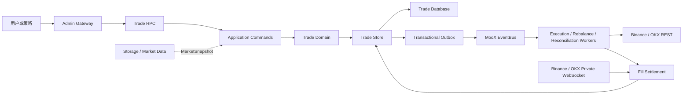
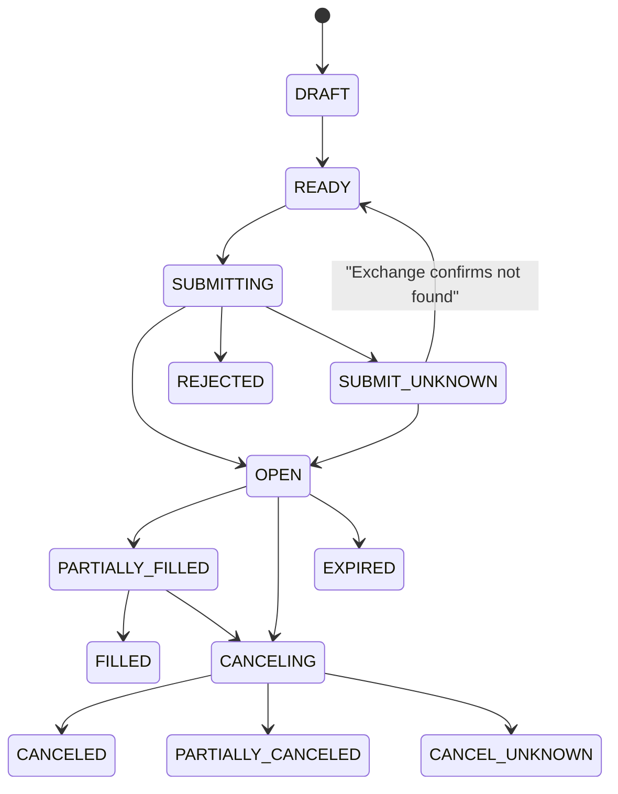

# Trade 交易模块架构设计

## 架构结论

Trade 采用事件驱动的模块化单体：一个进程、一个权威数据库和清晰的领域边界。订单、成交、执行计划、Saga、账本、余额、仓位、调仓、Inbox 与 Outbox 都由 Trade 自己保存。

Storage 只作为行情或市场快照来源。交易分析可以直接读取 Trade 权威库，不需要再把交易事实投影到 Storage。

## 系统关系



## 模块分层

```text
modules/trade/internal/
  domain/          精确 Decimal、订单、执行、账本、仓位、调仓
  algorithm/       可替换、版本化的拆单、定价和执行算法
  application/     命令、消费者、对账和调仓编排
  exchange/        交易所中立契约与 Binance/OKX 适配器
  infra/store/     权威存储、事务、Inbox/Outbox
  infra/bus/       Trade Topic 与 Outbox Relay
  infra/exchangebridge/ 账户通道到交易所适配器的装配
  observability/   指标与 TraceContext
  bootstrap/       生产 worker、私有流 supervisor、健康检查
  rpc/             tRPC 接口
```

依赖方向固定为 `rpc/consumer -> application -> domain`。领域层不依赖 tRPC、GORM、NATS 或交易所 SDK。底层数据库实现被限制在 `infra/store` 内，对上层只暴露交易语义。

## 一致性模型

### 本地强一致

以下数据在一个数据库事务内提交或回滚：

- 订单聚合状态和版本。
- 双式账本分录与余额投影。
- 成交记录与仓位投影。
- Inbox 或 Outbox 记录。

业务金额和数量使用精确 Decimal 字符串，不使用浮点数。订单通过聚合版本执行 compare-and-swap，避免并发状态覆盖。

### 跨进程最终一致

应用事务只写 Outbox，不直接发布 EventBus。Relay 收到 JetStream PubAck 后才标记已发布，并保持稳定的 `message_id`。消费者在业务成功后记录 Inbox 并 ACK；重复投递由业务幂等键和 Inbox 共同保护。

Trace ID 与 Request ID 会从 RPC 持久化到 Outbox，再恢复到消费者 Context。

## 订单状态机



`SUBMITTING` 和 `CANCELING` 先落库再调用交易所。进程在调用前后崩溃时，恢复器先查询交易所事实，禁止盲目重复操作。

## 交易所接入

### REST

REST 用于下单、撤单、按客户端订单 ID 查询、交易规则、成交缺口修复和低频对账。适配器把交易所错误标准化为规则错误、余额不足、限频、时间偏差、结果不确定和订单不存在等类别。

### 私有 WebSocket

生产 supervisor 按 `Space + Channel` 维护私有流：

- Binance：创建并续期 listen key，处理现货 `executionReport` 和合约 `ORDER_TRADE_UPDATE`。
- OKX：登录私有 WebSocket、订阅 orders channel，并执行 ping/pong 保活。
- 连接通过 generation 隔离，旧连接不能删除或覆盖新连接状态。
- 通道没有活动订单时取消连接；断线后重新鉴权和订阅。

私有事件按 `Space + Channel + Symbol + ExchangeOrderID` 定位订单。成交幂等键包含 Space、账户、通道、交易对和交易所成交号，避免不同账户或品种的成交号碰撞。

WebSocket 负责低延迟，不承担唯一可靠性责任。REST 对账始终保留。

## 账本与投影

Trade 数据库是账本与仓位的权威源：

```text
Order intent
  -> freeze available funds
  -> exchange fill
  -> post balanced ledger entries
  -> update balance projection
  -> update position projection
  -> release remaining reservation at terminal state
```

交易所余额同步以交易所总额为锚，但保留本地未完成订单的 `frozen` 和 `margin`。交易所快照省略的资产按零处理，避免留下可再次使用的虚假余额。

## 撤单换单 Saga

改单不是内存中的连续函数，而是持久化 Saga。恢复扫描覆盖初始撤单、结果未知、替代单已创建和替代单提交未知等状态。替代订单沿用普通订单内核，由 EventBus 提交；Saga 不会再次直接提交已经打开的订单。

## 调仓架构

调仓规划器只生成确定性草案，不访问数据库、EventBus 或交易所。规划结果保存算法名称、版本、市场快照、规则版本、legs 和依赖关系。

`rebalance.requested` 触发首批 legs；订单成交事件触发后续依赖 legs。恢复循环只修复中断，不作为正常调仓驱动器。

## 可观测性与健康

Prometheus 指标使用 `moox_trade_` 前缀，覆盖命令、交易所提交、成交、未知订单、对账差异、Outbox 延迟、私有流、操作延迟和调仓结果。标签只使用有限枚举，不包含订单号、通道 ID 或 Symbol。

健康检查同时验证：

- Trade Store 可访问。
- EventBus 当前连接正常。
- 最老未发布 Outbox 未超过阈值。
- 活动订单需要的每个私有流均已鉴权并订阅。
- 未知订单和活动订单数量可观测。

## 运维控制

暂停状态保存在 Trade 权威库并按 Space 隔离。下单前同时检查账户和通道；暂停只拒绝新风险，不阻断已有订单的成交结算和撤销。

立即对账通过 Outbox/EventBus 发起，消费者必须解包并遵守请求中的 Space、账户和通道边界。Saga 检查接口只返回当前 Space 的记录。

## 关键取舍

| 取舍 | 选择 | 原因 |
| --- | --- | --- |
| Trade Store 与 Storage | Trade 自建权威库 | 交易需要事务、状态机、账本和幂等；Storage 面向通用数据。 |
| 自建库分析与 Storage 投影 | 直接基于 Trade 库分析 | 避免双重事实源；需要跨域分析时再构建明确的数据产品。 |
| EventBus 与定时器 | EventBus 主驱动 | 正常路径低延迟；定时器仅修复超时、断线和漂移。 |
| WebSocket 与 REST | WebSocket 主回报，REST 兜底 | 同时获得低延迟和断线可恢复性。 |
| 原生改单与撤单换单 | 持久化撤单换单 Saga | 行为跨交易所一致，失败状态清晰且可恢复。 |
| 单体与微服务拆分 | 模块化单体 | 账本、订单和仓位共享事务，当前无需分布式事务。 |

## 相关文档

- [Trade 交易模块功能说明](交易模块功能说明.md)
- [MooX Trade 运维](运维/MooX-Trade运维.md)
- [Trade 模块重写执行计划](superpowers/plans/2026-07-11-trade-module-rewrite.md)
