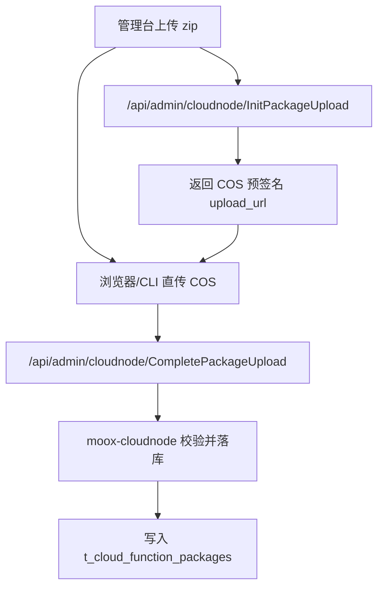

# 代码包管理

云函数代码包管理已经迁移到独立 `moox-cloudnode` 服务，不再由 admin 内置包管理能力承载。

admin 只负责把管理台请求转发到 cloudnode：

```text
/api/admin/cloudnode/InitPackageUpload
/api/admin/cloudnode/CompletePackageUpload
/api/admin/cloudnode/GetPackageList
/api/admin/cloudnode/GetPackageDetail
/api/admin/cloudnode/GetPackageDownloadURL
/api/admin/cloudnode/DeletePackage
```

## 模块归属

| 能力 | 当前归属 | 说明 |
| --- | --- | --- |
| 代码包元数据 | `modules/cloudnode` | 表 `t_cloud_function_packages` |
| 云账户/COS 凭证 | `modules/cloudnode` | 表 `t_cloud_accounts` |
| 上传到 COS | `modules/cloudnode/internal/service/cloudnode` | 依赖云账户配置 |
| 管理台 API | `modules/admin` 网关 | 只做鉴权和转发 |
| SCF 运行时包构建 | `modules/collector` / `scripts/build-collector-scf-package.sh` | 生成 collector SCF zip |

## 数据表

代码包元数据在：

```text
modules/cloudnode/schema/cloudnode.sql
```

核心表：

```text
t_cloud_function_packages
```

关键字段包括：

```text
c_package_id
c_package_name
c_version
c_workload_type
c_runtime
c_handler
c_cloud_account_id
c_cos_region
c_cos_bucket
c_cos_path
c_storage_type
c_status
```

## 上传流程



## 构建 collector SCF 包

collector workload 的 SCF zip 使用根脚本构建：

```bash
./scripts/build-collector-scf-package.sh
```

也可以通过 collector 模块代理入口：

```bash
make -C modules/collector package-scf
```

生成的 zip 是运行产物，不应提交到仓库。

## 部署关系

- 管理台上传代码包时，必须先创建可用云账户。
- 批量部署云函数节点时，cloudnode 根据节点、代码包和云账户调用腾讯云 SCF API。
- 批量部署返回 `batch_id`，表示本次云节点控制面批量变更。
- SCF runtime 启动后，通过 `/api/service/cloudnode/*` 与后台网关交互。
