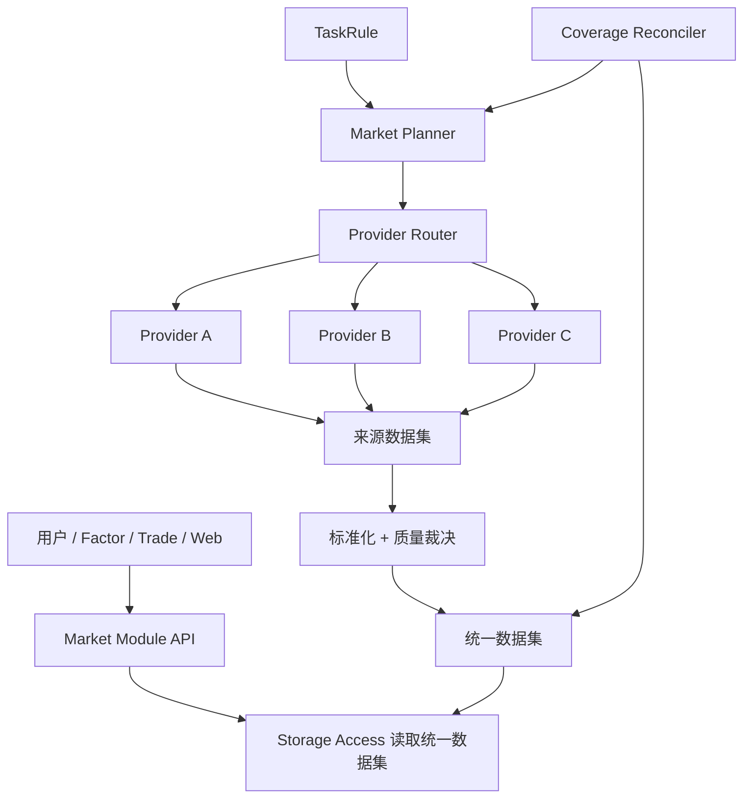

# 内置市场行情采集架构

## 文档状态

本文描述 MooX 行情采集的目标架构。文中的 Market Module、多 Provider 聚合、来源数据集、统一数据集、完整性修复和 `moox-cli init` 内置市场初始化尚未实现。当前实现仍以 Binance `symbol`、`kline` 采集为主，现状见 [采集任务管理](采集任务管理.md)。

本文记录已经确认的设计意图，后续实现应以这些边界为准。

## 目标

MooX 对用户提供稳定的逻辑市场接口，屏蔽数据来自多少个外部接口、如何分片、如何限频、如何补洞以及如何处理来源冲突。

第一阶段交付以下能力：

- 内置 `stock_cn`、`stock_us`、`crypto_binance`、`crypto_okx` Market Module。
- 标的发现、交易日历、不复权日 K 和分钟 K。
- 多 Provider 分片采集、质量校验、统一 K 线生成和缺口修复。
- 通过 Storage Access 读取已经持久化的统一 K 线。
- 通过 `moox-cli init` 注册内置 Space、DataSource、Field、Dataset 和 DatasetColumn。

第一阶段不包含：

- TuShare Pro 数据源。
- 实时快照和 Tick。它们在后续阶段使用常驻或流式运行时，不纳入当前短时 JobItem 设计。
- 跨交易所合并的加密货币 K 线。Binance 和 OKX 行情保持独立。
- 查询时直连外部 Provider。

## 核心原则

1. **上层面向 Market Module。** 用户选择 `stock_cn`，不选择 TDX、腾讯或凤凰。
2. **Provider 只负责取数。** Provider 不依赖 Storage，不管理任务状态，也不决定统一数据。
3. **一根 K 线来自一个 Provider。** 不把一个来源的 OHLC 和另一个来源的成交量拼成一根 K 线，也不平均多个来源的价格。
4. **采集结果先写来源数据集，再进入统一数据集。** 来源证据和业务统一数据分开保存。
5. **完整性由预期时间桶定义。** 请求成功不代表行情完整。
6. **查询只读 Storage。** 外部接口故障不能改变同一次业务查询的语义和延迟边界。
7. **逻辑任务不绑定 Provider。** Provider 是某次执行 Attempt 的选择，可以在补采时切换。

## 术语

| 术语 | 含义 | 示例 |
| --- | --- | --- |
| Market Module | 用户可见的逻辑市场产品 | `stock_cn`、`crypto_binance` |
| Exchange | 实际交易场所 | `SSE`、`SZSE`、`BSE`、`BINANCE`、`OKX` |
| Provider | 数据获取接口或传输来源 | `tdx`、`tencent`、`ifeng`、`binance_rest` |
| Product Type | 同一 Exchange 下的产品分段 | `spot`、`swap`、`future` |
| Instrument Type | 金融工具类型 | `equity`、`etf`、`index`、`perpetual` |
| Feed | Market Module 暴露的数据能力 | `instrument`、`calendar`、`kline` |
| 来源数据集 | 保存单个 Provider 最小标准化事实的内部 Dataset；内部类型为 `ProviderDataset`，角色为 `provider_data` | `tdx_equity_kline` |
| 统一数据集 | 质量裁决后供业务统一读取的 Dataset；内部类型为 `UnifiedDataset`，角色为 `unified_data` | `equity_kline` |

`Exchange` 不再表示数据适配器。现有 Collector 中用 `exchange` 表示 Binance 的字段，目标架构中应改为 `provider_id`；现有 `market=spot/swap` 应改为 `product_type`。

## 内置市场

### Market ID

系统内置以下 Market ID，同时将它们注册为 Storage Space ID：

```text
stock_cn
stock_us
crypto_binance
crypto_okx
```

这些 ID 是稳定的产品标识。代码不得通过拆分下划线推断其语义；Market Descriptor 显式声明资产类别、地区、Exchange、Instrument Type 和 Feed。

### `stock_cn`

`stock_cn` 是一个 Market Module，包含：

- Exchange：`SSE`、`SZSE`、`BSE`。
- Instrument Type：`equity`、`etf`、`index`。
- Feed：`instrument`、`calendar`、`kline`。
- 时区：`Asia/Shanghai`。

股票、ETF 和指数属于同一个模块，但使用不同统一数据集和独立 Provider 路由策略。它们的停牌、成交量、可交易性和字段要求不同，不应写入同一 Dataset。

### `stock_us`

`stock_us` 同样容纳多个实际 Exchange。Subject 元数据记录主要上市 Exchange；行情还应保留 `feed_scope`，用于区分 consolidated feed 与单一 Exchange feed。第一阶段只预留该语义，不实现复杂的美国合并行情。

### `crypto_binance` 和 `crypto_okx`

加密货币 Market Module 以实际 Exchange 为边界：

```text
crypto_binance -> exchange_id=BINANCE
crypto_okx     -> exchange_id=OKX
```

`product_type` 单独表达 `spot`、`swap`、`future`，不继续扩张 Market ID。Binance 与 OKX 的 BTC-USDT K 线来自不同交易场所，不能互相补洞。

现货、永续和交割合约应使用不同统一标的，例如：

```text
BTC-USDT
BTC-USDT-SWAP
BTC-USDT-240927
```

## 总体架构



### Market Module

每个 Market Module 封装六类市场策略：

| 组件 | 职责 |
| --- | --- |
| Universe Policy | 合并多个来源的标的列表，维护上市、停牌和退市状态 |
| Calendar Policy | 定义交易日、交易时段、午休和闭市语义 |
| Symbol Policy | 维护统一标的与各 Provider symbol 的映射 |
| Routing Policy | 按能力、限频、健康度和历史覆盖分配 Provider |
| Quality Policy | 标准化字段、检查 K 线合法性并裁决来源冲突 |
| Coverage Policy | 生成预期时间桶，检测缺口并创建修复任务 |

通用采集管线负责分片、重试、幂等写入和状态上报；Market Module 只注入市场规则。

### Provider

Provider 按数据类型实现强类型能力，例如 K 线 Provider 接收 Subject、频率和时间窗口，返回分页结果与来源元数据。

Provider 层负责：

- HTTP、TCP 或文件协议。
- 来源 symbol 和请求参数转换。
- 响应解析和最小标准化。
- 来源错误分类，例如限频、鉴权、暂时不可用、永久不支持和解析失败。

Provider 层不负责：

- 选择目标 Dataset。
- 写 Storage。
- 决定是否覆盖统一数据。
- 管理 TaskInstance 或 CloudNode JobItem 状态。

### 通用 K 线管线

`KlinePipeline` 依次执行：

```text
解析逻辑任务
  -> 读取统一数据水位和近期缺口
  -> 生成 Provider 分片
  -> 拉取并分页
  -> 过滤未闭合 K 线
  -> 写来源数据集
  -> 执行质量裁决
  -> 幂等写统一数据集
  -> 返回逐标的执行摘要
```

第一阶段在同一个 JobItem 中顺序完成来源数据集和统一数据集写入。来源数据写入成功而统一数据写入失败时，JobItem 返回失败；重试依赖两侧幂等写入恢复。规模扩大后，可以把统一数据生成改为事件驱动。

## SCF 执行模型

### 运行职责

SCF 是无状态、短时、可重试的执行器，不承担全局规划和长期状态：

| 组件 | 运行位置 | 职责 |
| --- | --- | --- |
| Market Registry | Collector 常驻控制面 | 注册 Market Module 和能力 |
| Route Planner | Collector 常驻控制面 | Provider 分配、分片和候选链 |
| Coverage Reconciler | Collector 常驻控制面 | 扫描缺口并生成修复任务 |
| Provider Health/Quota | Collector 常驻控制面 | 汇总健康度并分配全局请求预算 |
| Kline Job Handler | SCF | 执行一个有界采集分片 |
| Provider Client | SCF | 请求外部接口并解析响应 |
| Quality Resolver | SCF | 校验当前分片并写统一数据集 |
| Storage | 独立服务 | 保存来源数据、统一数据和水位事实 |

`stock_cn.kline` 等查询接口和 `moox-cli init` 不在 SCF 中执行。查询接口只读 Storage；CLI 在部署阶段初始化元数据。

### 一套代码包、每个 Space 一个 SCF 函数

所有内置市场复用同一个 Collector SCF 代码包，但每个 Space 部署独立函数：

```text
moox-collector-stock-cn-scf
  MOOX_SPACE_ID=stock_cn

moox-collector-stock-us-scf
  MOOX_SPACE_ID=stock_us

moox-collector-crypto-binance-scf
  MOOX_SPACE_ID=crypto_binance

moox-collector-crypto-okx-scf
  MOOX_SPACE_ID=crypto_okx
```

这种部署方式保持现有 CloudNode 单 Space 轮询模型，也让 Provider 限频、SCF 并发、凭据和故障影响按市场隔离。新增 Market Module 时复用代码包，只增加函数配置和节点标签。

### 有界 JobItem

当前 SCF keepalive 任务执行窗口为 45 秒，因此一个 JobItem 不能承载可能持续数分钟的全市场任务。第一阶段默认每轮只领取一个 K 线分片，并为外部请求、Storage 写入和状态上报预留时间。

K 线 JobItem 至少携带：

```text
market_id
space_id
provider_id
instrument_type
frequency
subjects
start_time
end_time
max_pages
max_rows
execution_budget_ms
continuation_cursor
```

执行规则：

- 单个 JobItem 目标执行时间为 20 到 30 秒，至少保留 10 秒用于写入和上报。
- 达到时间、页数或行数上限时正常结束，并返回 `continuation_cursor`。
- Collector 根据 cursor 生成后续 JobItem，不把剩余工作留在 SCF 本地。
- Context 即将超时时主动停止，不等待 SCF 强制终止。
- 来源数据集和统一数据集按时序 key 幂等写入，超时重试不产生重复事实。

SCF 进程内限频只作为第二层保护。Provider 的全局并发、待执行 JobItem 数和熔断窗口由 Collector 控制面管理，并与 SCF 函数最大并发保持一致。

TDX Provider 在 SCF 中按 JobItem 建立和关闭 TCP 连接，不依赖实例长期存活或心跳复用。若实时验证表明连接成本或稳定性无法满足执行窗口，可以把 TDX 切换到常驻 Worker；Market Module、JobItem 和 Storage 契约保持不变。

## Provider 路由

### 路由单元

路由单元是：

```text
Provider x Subject 集合 x Frequency x TimeWindow
```

系统既可以按 Subject 分片，也可以在 Provider 历史深度有限时按时间窗口分片。

### 分配策略

默认使用带权重的一致性哈希：

- 同一 Subject 长期分配给同一主 Provider，减少口径漂移。
- Provider 权重由能力、限频、近期成功率和延迟决定。
- 每个 Subject 生成稳定的主 Provider 和候选 Provider 链。
- 主 Provider 失败时，只重派失败 Subject 或缺失时间段。
- Provider 恢复后逐步迁回，避免路由震荡。

Provider capability 至少声明：

```text
supported_instrument_types
supported_frequencies
supported_date_range
max_symbols_per_request
max_points_per_request
requests_per_second
requests_per_day
max_concurrency
```

少量 Subject 可以重复分配给两个 Provider，作为持续质量样本。重复比例由 Market Module 配置；普通 Subject 保持互斥分配以扩大覆盖率。

## 统一 K 线

### 公共列契约

统一 K 线第一阶段使用共同语义：

```text
open
high
low
close
volume
amount              optional
trade_date
source_provider
fetched_at
quality_status
revision
```

`subject_id`、`freq` 和 `data_time` 是时序行键。所有价格均为不复权价格；复权因子和复权结果属于独立 Dataset 或派生结果。

Market Module 必须明确成交量单位、交易时区和 K 线时间对齐方式。日 K 由交易日历判断闭合；分钟 K 按交易时段生成预期桶，午休不算缺口。

### 原子来源

同一根统一 K 线的 OHLCV 必须来自同一个 Provider：

- 不平均不同 Provider 的价格。
- 不按字段拼接多个 Provider。
- Provider 独有字段保留在来源数据集。
- 缺失公共必填字段的候选行不能进入统一数据集。

### 来源裁决

质量裁决按以下顺序执行：

1. 拒绝未闭合、时间错位、重复、负成交量和 OHLC 关系非法的行。
2. 使用 Market Module 为 Instrument Type 和 Frequency 配置的 Provider 优先级。
3. 主 Provider 有合法数据时采用主 Provider。
4. 主 Provider 缺失时采用候选 Provider，并标记 `provisional`。
5. 后续来源验证一致时标记 `confirmed`。
6. 差异超过容差时保留确定性胜出结果，并登记 `conflict` 质量记录，不静默覆盖。

统一数据行记录 `source_provider` 和 `revision`。低优先级来源先填补缺口、高优先级来源后来恢复时，可以修订统一数据行，但必须留下版本和冲突证据。

## 完整性与补洞

### 完整性定义

行情完整性定义为：

```text
有效 Subject 集合
x 配置 Frequency
x Subject 有效期内的交易时间桶
= 预期 K 线集合
```

以下情况不是缺失 K 线：

- 非交易日。
- Subject 上市前或退市后。
- 已确认的停牌或无交易状态。
- 交易时段之外和午休时间。

系统不生成虚假的零成交 K 线。Coverage 状态记录 `present`、`no_trade`、`not_listed`、`delisted` 或 `unavailable`，防止无限补采。

### 修复层次

| 层次 | 行为 |
| --- | --- |
| 增量采集 | 从统一数据最新水位继续，并回看少量已闭合 K 线 |
| 近期巡检 | 扫描最近交易日或交易时段内的内部缺桶 |
| 历史巡检 | 低频扫描更早时间窗口，逐步消除历史空洞 |

第一阶段可以通过“最新水位 + 近期窗口扫描”实现。分钟数据规模扩大后，再为 Storage 增加专门的 coverage 查询能力。

## Storage 设计

### 内置 Space

内置市场使用以下 Space：

```text
stock_cn
stock_us
crypto_binance
crypto_okx
```

它们是用户可见的内置数据目录，不使用 `moox_` 内部运维前缀。每个 Space 固定携带：

```yaml
attributes:
  scope: builtin
  owner_module: collector
  managed_by: moox-cli
  market_id: stock_cn
  schema_version: "1"
```

内置 Space 和元数据契约禁止普通用户删除或改名。用户可以调整采集开关、在 Dataset 契约支持范围内选择频率、配置 Provider 策略，并创建自己的派生 View。

### 来源数据集与统一数据集

Space 已经表达市场，Dataset ID 不重复 Market ID：

```text
stock_cn/instruments
stock_cn/calendar
stock_cn/equity_kline
stock_cn/etf_kline
stock_cn/index_kline

crypto_binance/spot_instruments
crypto_binance/swap_instruments
crypto_binance/spot_kline
crypto_binance/swap_kline
```

统一数据集绑定一个 `kind=internal` 的 MooX DataSource，例如 `moox_stock_cn`。来源数据集分别绑定物理 DataSource，例如 `tdx`、`tencent` 或 `ifeng`。来源数据集使用 `dataset_role=provider_data`，统一数据集使用 `dataset_role=unified_data`。

初始化 Seed 只声明 Space、DataSource、Field、Dataset 和 DatasetColumn。Subject、SubjectSymbol 和 DatasetSubject 由 `instrument` Feed 动态维护。

PrimaryStoreNode、Device 和 PrimaryStoreRoute 属于部署拓扑，不进入逻辑市场 Seed。单机部署通过独立 route seed 注册本地通配路由。

### 跨 Space 边界

Storage View 当前不能跨 Space 组合 Dataset。跨 `stock_cn`、`stock_us` 和加密市场的组合分析由 Factor、Trade 或其他上层服务分别读取多个 Space 后完成，不依赖单个 Storage View。

## 查询语义

### `stock_cn.kline`

`stock_cn.kline` 是逻辑读取接口，只从 Storage 统一数据集读取：

```text
stock_cn + equity + kline -> space=stock_cn, dataset=equity_kline
stock_cn + etf    + kline -> space=stock_cn, dataset=etf_kline
stock_cn + index  + kline -> space=stock_cn, dataset=index_kline
```

Market Module 根据 Subject 的 Instrument Type 选择 Dataset；查询包含多种 Instrument Type 时，分别调用 Storage Access，再统一合并返回。业务层不直接访问 Pebble，也不读取来源数据集。

查询结果应同时返回数据水位和完整性状态，例如：

```json
{
  "freshness": "2026-07-11T10:35:00+08:00",
  "coverage_status": "complete",
  "missing_ranges": [],
  "rows": []
}
```

Storage 数据过旧或存在缺口时，查询返回已有数据及状态，不在请求链路中静默访问 Provider。

### Query 和 Refresh

读取与采集使用不同语义：

```text
stock_cn.kline.query    -> 只读 Storage
stock_cn.kline.refresh  -> 提交采集或补洞任务
```

`refresh` 完成后，调用方仍重新从 Storage 读取结果。Provider 响应不直接作为业务查询结果返回。

## 目标控制面模型

### 用户规则

用户规则只表达逻辑市场需求：

```json
{
  "market_id": "stock_cn",
  "data_type": "kline",
  "instrument_types": ["equity", "etf", "index"],
  "frequencies": ["5m", "1d"],
  "history": "5y"
}
```

高级过滤可以指定 `exchange_ids` 和 `subjects`，但不能指定 Provider 或来源数据集。普通用户也不需要指定统一数据集；Market Module 根据 Feed Descriptor 解析目标。

### TaskInstance 与 Attempt

逻辑 TaskInstance 的稳定键包含：

```text
market_id + data_type + unified_dataset + subject_id + freq
```

Provider 不进入稳定 Task ID。具体执行 Attempt 和 JobItem 记录：

```text
provider_id
exchange_id
product_type
time_window
shard_id
candidate_chain
```

一个 JobItem 返回逐 Subject 结果，包括成功、空数据、限频、暂时不可用、永久不支持、解析失败和 Storage 写入失败。补采只重新调度失败 Subject 或缺失时间段。

## 配置与初始化

### 配置布局

内置市场配置归 Collector 模块所有：

```text
modules/collector/config/markets/
  stock_cn/
    market.yaml
    metadata.seed.yaml
  stock_us/
    market.yaml
    metadata.seed.yaml
  crypto_binance/
    market.yaml
    metadata.seed.yaml
  crypto_okx/
    market.yaml
    metadata.seed.yaml
```

`market.yaml` 保存 Provider 能力、权重、限频、路由和补洞策略。`metadata.seed.yaml` 保存 Storage 逻辑契约。密钥不进入这两类文件，通过环境变量或 Secret 管理。

发布过程把市场 manifest 复制到固定共享配置目录。`moox-cli` 读取 manifest 文件，不直接依赖 Collector 的 `internal` Go 包。

### `moox-cli init`

`moox-cli init` 是内置资源初始化编排入口：

1. 检查 Storage Metadata 服务可用。
2. 加载启用的内置 Market manifest。
3. 校验重复 ID、引用关系和字段类型。
4. 按 Space、DataSource、Field、Dataset、DatasetColumn 顺序应用。
5. 输出 `applied`、`unchanged` 和 `failed` 汇总。

`init` 复用现有 `metadata apply` 的 create-or-verify 语义：缺失资源创建，契约一致的资源保持不变，契约冲突则失败，不静默覆盖。运行时服务不自动创建或修改 Storage 元数据。

推荐部署顺序：

```text
moox-storage-cli init
启动 Storage Metadata
moox-cli init --markets=all
启动 Collector
运行 instrument Feed 动态注册 Subject
运行 kline Feed 开始采集
```

## 目标代码边界

```text
modules/collector/internal/
  markets/
    contract.go
    registry.go
    stockcn/
      module.go
      universe.go
      calendar.go
      symbols.go
      routing.go
      quality.go
      coverage.go
    stockus/
    cryptomarket/
  providers/
    tdx/
    tencent/
    ifeng/
    binance/
    okx/
  pipeline/
    kline.go
    routing.go
    quality.go
    coverage.go
    storage.go
  storageio/
    metadata.go
    checkpoint.go
    writer.go
```

`crypto_binance` 和 `crypto_okx` 复用通用 Crypto Market Module，通过 Descriptor 注入不同 Exchange、Provider 和 symbol 规则，不复制整套采集业务代码。

## 从当前实现演进

目标架构需要逐步完成以下调整：

1. 将现有 `exchange` 数据适配器语义改为 `provider_id`，将 `market=spot/swap` 改为 `product_type`。
2. 将 `Collector.Collect(ctx, params) error` 拆成按数据类型定义的强类型 Provider 接口。
3. 把 Binance 中的 Storage 写入和 binding 逻辑移入通用 `storageio` 和 K 线 Handler。
4. 让 `jobs/*/handler.go` 成为真实执行边界，移除 `taskrunner` 对 Binance 的静态依赖。
5. 让 Job Definition 和管理台能力来自 Market Registry，而不是硬编码 Binance 选项。
6. 增加内置 Market manifest、`moox-cli init` 编排和 `scope=builtin` 元数据保护。
7. 先保持 Binance 当前行为，通过契约测试验证通用管线，再接入 `stock_cn` 多 Provider。

## 实施前验证项

以下内容在实现对应 Provider 前通过实时探测和契约测试确定：

- TDX、腾讯、凤凰等历史接口的可用性、频率、分页和限频边界。
- 每个 Instrument Type 和 Frequency 的 Provider 优先级与冲突容差。
- 美国股票 consolidated feed 的实际来源和授权边界。
- 分钟 K 规模增长后是否需要 Storage coverage 索引。
- 内置 metadata schema 的版本升级策略。第一版只实现 create-or-verify；破坏性变化使用显式升级流程，不由 `init` 自动覆盖。
