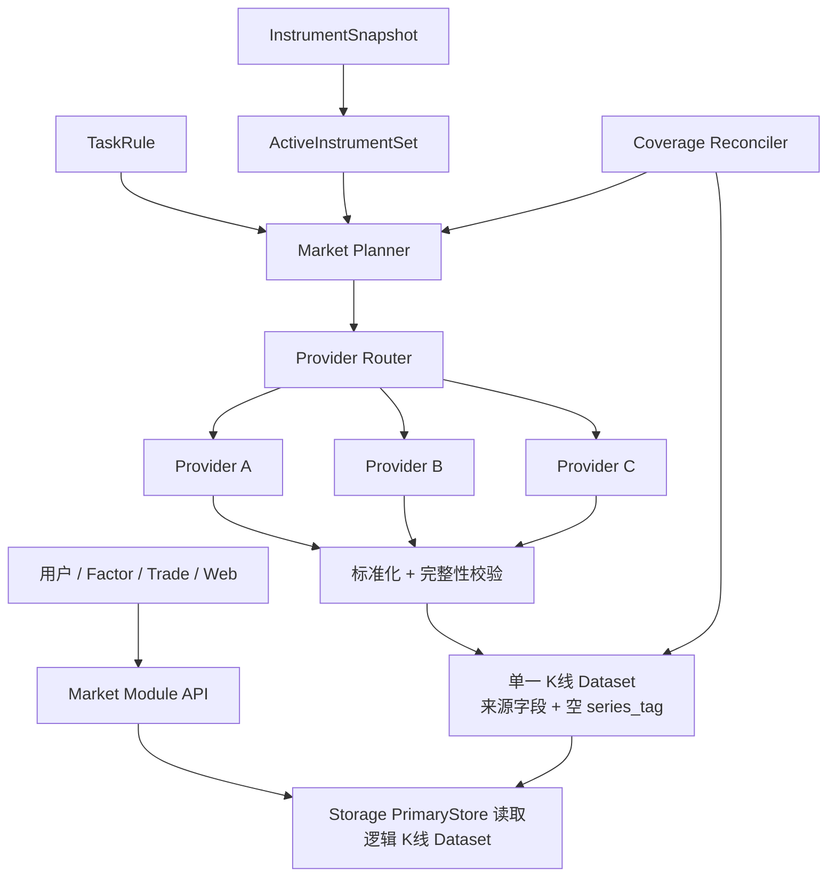

# 内置市场行情采集架构

## 文档状态

本文描述 MooX 行情采集的统一目标和当前实现边界。2026-08-30 起，公共
`MarketProvider`、强类型 Fetcher/Spec、Kline/Instrument Pipeline、stock_cn 多 Provider
路由和短时 SCF Runtime 已在源码及本地回归中落地；正式 stock_cn SCF 发布、出口 IP 门禁和
Storage E2E 仍待有凭证的环境验收。实时 K 线使用短时 SCF Timer Trigger，重采样由 Collector
独立的 1 分钟 Timer 协调，现状见 [采集任务管理](采集任务管理.md) 和
[SCF 短时行情采集架构](architecture/scf-short-lived-market-fetch.md)。

本文记录已经确认的设计和实现边界；生产状态以
[stock_cn 1m Canary](validation/stock-cn-1m-canary.md) 与执行计划状态表为准。

## 目标

MooX 对用户提供稳定的逻辑市场接口，屏蔽数据来自多少个外部接口、如何分片、如何补洞以及如何处理来源冲突；MooX 本身不主动限频，外部 Provider 的频控只作为错误和观测结果处理。

第一阶段交付以下能力：

- 内置 `stock_cn`、`stock_us`、`crypto` Market Module。
- 标的发现、交易日历、不复权日 K 和分钟 K。
- 多 Provider 分片采集、质量校验、单一逻辑 K 线写入和缺口修复。
- 通过 Storage PrimaryStore 读取已经持久化的逻辑 K 线。
- 通过 `moox-cli init` 注册内置 Space、DataSource、Field、Dataset 和 DatasetColumn。

第一阶段不包含：

- 需要账户或 token 的收费数据源。
- 实时快照和 Tick。它们不纳入当前 K 线 Timer 设计；若未来需要流式数据，应单独评估成本，不能把常驻运行时混入实时 K 线函数。
- 把不同交易所价格裁决成一根统一加密货币 K 线。Binance 和 OKX 在同一 Dataset
  中仍是两个独立 `series_tag`，不能互相补洞。
- 查询时直连外部 Provider。

底层 TimeSeries 身份已经统一为 scalar `series_tag`：精确空 tag 表示默认序列，
selector 缺省 tag 表示全部序列。Binance/OKX 使用共享 crypto Dataset；Storage
不解析 `venue:binance`，也没有 `series_tag_name`。

## 核心原则

1. **上层面向 Market Module。** 用户选择 `stock_cn`，不选择新浪、腾讯、百度或东方财富。
2. **Provider 只负责取数。** Provider 不依赖 Storage，不管理任务状态，也不决定目标 Dataset 或覆盖策略。
3. **一根 K 线来自一个 Provider。** 不把一个来源的 OHLC 和另一个来源的成交量拼成一根 K 线，也不平均多个来源的价格。
4. **同一逻辑 K 线 Dataset 直接幂等写入。** Provider 负责不同标的或 fallback，来源通过行字段追溯；默认不保存每个 Provider 的重复副本。
5. **完整性由预期时间桶定义。** 请求成功不代表行情完整。
6. **查询只读 Storage。** 外部接口故障不能改变同一次业务查询的语义和延迟边界。
7. **逻辑任务不绑定 Provider。** Provider 是某次执行 Attempt 的选择，可以在补采时切换。

## 术语

| 术语 | 含义 | 示例 |
| --- | --- | --- |
| Market Module | 用户可见的逻辑市场产品 | `stock_cn`、`crypto` |
| Exchange | 实际交易场所 | `SSE`、`SZSE`、`BSE`、`BINANCE`、`OKX` |
| Provider | 数据获取接口或传输来源 | `sina`、`tencent`、`eastmoney`、`baidu`、`binance` |
| Product Type | 同一 Exchange 下的产品分段 | `spot`、`swap`、`future` |
| Instrument Type | 金融工具类型 | `equity`、`etf`、`index`、`perpetual` |
| Market Data Contract | Market Module 暴露的强类型数据接口 | `instrument`、`calendar`、`kline` |
| InstrumentSnapshot | 某一个 InstrumentFetcher 一次完整分页得到的全市场标的快照 | EastMoney A 股完整快照 |
| ActiveInstrumentSet | 从最近一次有效完整快照生成、当前需要采集的全市场有效标的池 | `stock_cn` 当前 active 股票集合 |
| 逻辑 K 线 Dataset | 所有 Provider 对其负责标的直接写入的业务 Dataset，行内保存来源字段 | `stock_cn_kline` |

`Exchange` 不再表示数据适配器。现有 Collector 中用 `exchange` 表示 Binance 的字段，目标架构中应改为 `provider_id`；现有 `market=spot/swap` 应改为 `product_type`。

## 内置市场

### Market ID

系统内置以下 Market ID，同时将它们注册为 Storage Space ID：

```text
stock_cn
stock_us
crypto
```

这些 ID 是稳定的产品标识。代码不得通过拆分下划线推断其语义；Market Descriptor 显式声明资产类别、地区、Exchange、Instrument Type 和数据通道。

### `stock_cn`

`stock_cn` 是一个 Market Module，包含：

- Exchange：`SSE`、`SZSE`、`BSE`。
- Instrument Type：`equity`、`etf`、`index`。
- 数据通道：`instrument`、`calendar`、`kline`。
- 时区：`Asia/Shanghai`。

股票、ETF 和指数属于同一个模块，但第一阶段只交付普通股票并写入 `stock_cn_kline`。ETF 和指数后续使用独立 Dataset 和 Provider 路由策略；它们的停牌、成交量、可交易性和字段要求不同，不应在第一阶段混入股票 Dataset。

### `stock_us`

`stock_us` 同样容纳多个实际 Exchange。Subject 元数据记录主要上市 Exchange；行情还应保留 `feed_scope`，用于区分 consolidated feed 与单一 Exchange feed。第一阶段只预留该语义，不实现复杂的美国合并行情。

### `crypto`

加密货币使用一个逻辑 Market/Space，实际交易场所由 `series_tag` 区分：

```text
crypto + venue:binance -> exchange_id=BINANCE
crypto + venue:okx     -> exchange_id=OKX
```

`product_type` 单独表达 `spot`、`perpetual`、`future`，不继续扩张 Market ID。
Binance 与 OKX 的 BTC-USDT K 线来自不同交易场所，即使共享 Dataset 也不能互相
补洞或静默替代；查询和 Factor 通过完整 tag 选择或比较它们。

现货、永续和交割合约应使用不同统一标的，例如：

```text
BTC-USDT
BTC-USDT-SWAP
BTC-USDT-240927
```

## 总体架构



### Market Module

每个 Market Module 封装六类市场策略：

| 组件 | 职责 |
| --- | --- |
| Instrument Set Policy | 校验完整标的快照，维护上市、停牌、退市状态和当前 ActiveInstrumentSet |
| Calendar Policy | 定义交易日、交易时段、午休和闭市语义 |
| Instrument Policy | 维护统一标的与各 Provider symbol 的映射 |
| Routing Policy | 按 Fetcher Spec、单 IP 限频、当前调用健康度和历史覆盖分配 Provider |
| Quality Policy | 标准化字段、检查 K 线合法性并记录 primary/fallback 质量状态 |
| Coverage Policy | 生成预期时间桶，检测缺口并创建修复任务 |

通用采集管线负责分片、重试、幂等写入和状态上报；Market Module 只注入市场规则。

### Provider

Provider 按数据类型实现强类型 Fetcher，例如 K 线 Provider 接收 Subject、频率和时间窗口，返回 `NormalizedKline` 与来源元数据。`KlineSpec`、`InstrumentSpec` 描述接口规格，避免使用含义过宽的通用能力字段。

Provider 层负责：

- HTTP、TCP 或文件协议。
- 来源 symbol 和请求参数转换。
- 响应解析和最小标准化。
- 来源错误分类，例如限频、鉴权、暂时不可用、永久不支持和解析失败。

Provider 层不负责：

- 选择目标 Dataset。
- 写 Storage。
- 决定是否覆盖已有逻辑 K 线。
- 管理 TaskInstance 或 CloudNode JobItem 状态。

### 通用 Instrument 管线

`InstrumentFetcher` 返回某一个 Provider 的完整 `InstrumentSnapshot`。`InstrumentPipeline` 同时服务 crypto 和 stock，并遵守以下规则：

1. 一次快照的所有分页必须来自同一个 Provider；某页失败时整份快照失败，不能从另一个 Provider 接续下一页。
2. 快照必须记录 `snapshot_id`、`source_provider`、`fetched_at`、`page_count`、分页终止原因和交易所计数。
3. 首次快照必须非空并覆盖 Market Module 要求的交易所；后续出现分页中断、某交易所全空、重复代码、交易所冲突或数量异常时，保留上一版 `ActiveInstrumentSet`。
4. 只有完整快照及 Subject、SubjectSymbol、DatasetSubject 全部注册成功后，才原子切换 `ActiveInstrumentSet` 和 version。
5. 连续两个完整日快照都缺失的标的才转 inactive，避免单个来源短暂抖动导致批量下线。

Binance 现有 Symbol 全量快照迁为同一 `InstrumentFetcher` 契约；公开任务和结果统一使用 `instrument`，不为加密货币保留第二套 `symbol` 框架。

### 通用 K 线管线

`KlinePipeline` 依次执行：

```text
解析逻辑任务
  -> 读取 ActiveInstrumentSet、逻辑数据水位和 HistoryPolicy
  -> 稳定映射到 N 个 Group 并生成 Provider 候选链
  -> 首选 Provider 拉取；可重试失败时有界 fallback
  -> 标准化为 NormalizedKline
  -> 过滤未闭合或早于覆盖下界的 K 线
  -> 幂等写逻辑 K 线 Dataset
  -> 返回逐标的执行摘要
```

每根成功 K 线的 OHLCV/amount 必须全部来自同一个 Provider。Fallback 只替换整根 K 线，不能按字段拼接。写入失败时 JobItem 返回可重试结果，重试依赖同一 RowKey 幂等恢复。

### 数据集写入职责

Provider 只返回强类型结果，不选择 Dataset，也不直接调用 Storage。`KlinePipeline` 根据 Market Descriptor 选择一个逻辑 Dataset，并通过通用 `BatchStorage` 调用 Storage PrimaryStore `UpsertFields`。当前 Binance Collector 中由数据源直接构造 Storage 行和 binding 的逻辑应迁出 Provider 包，crypto 与 stock 共用同一 writer。

### `stock_cn_kline` 写入契约

新浪、腾讯、东方财富以及经验证可用的百度 KlineFetcher 都向同一个 Dataset 写入：

```text
space_id   = stock_cn
dataset_id = stock_cn_kline
subject_id = 600000.XSHG
freq       = 1m
data_time  = Market Module 归一后的 K 线时间桶
series_tag = ""
```

RowKey 固定为 `subject_id + freq + data_time + series_tag=""`，Provider 不进入 RowKey。同一标的同一分钟无论首选或 fallback 由谁成功，最多形成一行。公共列至少包括：

```text
open
high
low
close
volume
amount
trade_date
close_time
volume_unit
amount_unit
source_provider
provider_symbol
provider_timestamp
fetched_at
request_id
route_id
route_rank
quality_status
amount_quality
```

KlinePipeline 只写已经闭合且通过 `NormalizedKline` 校验的完整 K 线。重试、Realtime、Backfill 和 GapRepair 使用确定 `SourceEventID` 做整行幂等 Upsert；后写入的合格结果必须同时更新整根 OHLCV 和全部来源字段。无合法候选时不生成零值 K 线，由 Coverage 状态记录 `no_trade`、`unavailable` 或其他缺失原因。

部署 Canary 是受标记的历史回放：stock runtime 从随包交易日历选择最近一个已闭合分钟，并以该 session close 作为有界页的历史参考点，因此周末和节假日仍可验证真实 K 线拉取与写入；普通 Backfill/GapRepair 仍严格执行 Provider 最近 24 小时能力，超出即 fail closed。Monitor 在收盘后的短暂 grace window 内继续检查当日 14:59 桶，随后才进入 idle。

默认不建设 Provider K 线副本 Dataset。以后只有明确需要同时保存多个 Provider 的同分钟数据做质量对比、重放或审计时，才单独设计可选来源归档；该能力不能改变 `stock_cn_kline` 的 RowKey，也不能成为实时采集前置依赖。

### 写入失败与恢复

| 失败位置 | 处理 |
| --- | --- |
| Provider 拉取失败 | 不写数据；按候选链切换 Provider，或返回可重试错误 |
| `stock_cn_kline` 写入失败 | JobItem 失败；按相同 RowKey 和 SourceEventID 安全重试 |
| K 线写入成功、任务上报失败 | 安全重试；相同 RowKey 不产生重复行 |

第一阶段依靠稳定 Group 分片保证同一 Subject 在同一分钟只属于一个 SCF；Provider fallback 在该调用内顺序完成。覆盖修复与实时任务可能重复触达同一 RowKey，因此完整行 Upsert 和确定事件 ID 仍是必须的幂等边界。

## SCF 执行模型

> 本节描述当前公共运行时和 stock_cn 生产门禁。当前实现与未完成的云上验收以
> [A 股 1m 多数据源云函数采集执行计划](superpowers/plans/2026-08-29-stock-cn-1m-multi-provider-scf.md)
> 和现状文档为准。

### 运行职责

SCF 是无状态、短时、可重试的执行器，不承担全局规划和长期状态：

| 组件 | 运行位置 | 职责 |
| --- | --- | --- |
| Market Registry | Collector 常驻控制面 | 注册 Market Module、Provider、Fetcher 和 Spec |
| Instrument Pipeline | Collector/独立每日 Instrument snapshot Timer SCF | 生成完整 InstrumentSnapshot 并原子切换 ActiveInstrumentSet |
| Route Planner | Collector 常驻控制面 | 将有效标的池稳定映射到 N 个 Group，并分配 Provider 候选链 |
| Coverage Reconciler | Collector 常驻控制面 | 扫描缺口并生成修复任务 |
| Fleet Reconciler | Collector/CLI/CloudNode | 发布并回读 N 个函数；egress probe 仅作诊断 |
| Kline Job Handler | SCF | 执行一个有界采集分片 |
| Provider Client | SCF | 在单次函数边界内请求外部接口并解析响应，透传上游限频结果 |
| Kline Pipeline | SCF | 标准化、校验当前分片并写逻辑 K 线 Dataset |
| Storage | 独立服务 | 保存 Instrument、K 线和水位事实 |

`stock_cn.kline` 等查询接口和 `moox-cli init` 不在 SCF 中执行。查询接口只读 Storage；CLI 在部署阶段初始化元数据。

### 共用框架、每个市场独立函数集群

所有内置市场复用 `MarketProvider`、强类型 Fetcher/Spec、InstrumentPipeline、KlinePipeline、Storage writer 和 SCF Runtime。每个市场保留独立 composition root、二进制、配置和函数集群，避免相互争抢运行预算或扩大故障范围：

```text
moox-collector-stock-cn-000 ... moox-collector-stock-cn-(N-1)
  MOOX_SPACE_ID=stock_cn
  MOOX_GROUP_ID=0 ... N-1

moox-collector-stock-us-...
  MOOX_SPACE_ID=stock_us

moox-collector-crypto-...
  MOOX_SPACE_ID=crypto
```

`stock_cn.timer_function_count=N` 是 Kline Timer 发布配置，初始建议 200，但不是代码常量。全市场 Instrument 快照另行部署一个每日 Timer SCF；`ActiveInstrumentSet` 变化只更新 N 个 Kline 函数的 Assignment，只有 `ceil(active_subject_count/N)` 超过压测安全容量时，才由运维调整 N 并重新发布，第一期不做运行时自动扩缩容。Instrument snapshot 只有完整 generation 的全部来源和 Storage 写入成功后才切换 active set，避免独立抓取结果混代。

发布时先保持 Timer 和业务 Rule disabled，回读 N 个函数及 Trigger，并通过 Instrument/Kline canary 验证 SCF 到 Storage 的真实链路。egress probe 保留为出口分布诊断，不再阻断 Timer 或 `stock_cn_kline` Rule 的启用。A 股公开接口按出口 IP 控频，不配置跨全部 SCF 的 Provider 总请求额度，也不使用同账号同地域共享固定 EIP。

### 有界 JobItem

一个 JobItem 不能承载可能持续数分钟的全市场任务。第一阶段默认每次只执行一个 K 线
分片，并为外部请求、Storage 写入和状态上报预留时间；keepalive 只维持通信，不提供任务
执行窗口。

K 线 JobItem 至少携带：

```text
market_id
space_id
route_id
group_id
candidate_chain
instrument_type
frequency
subjects
batch_kind             realtime / backfill / gap_repair
coverage_start_time
start_time             backfill/gap_repair only
end_time               backfill/gap_repair only
max_pages
max_rows
execution_budget_ms
continuation_cursor
```

执行规则：

- `stock_cn` SCF 硬 deadline 为 15 秒，外部请求、fallback、Storage 写入和上报必须在该预算内完成；目标 p99 小于 12 秒。
- 达到时间、页数或行数上限时正常结束，并返回 `continuation_cursor`。
- Collector 根据 cursor 生成后续 JobItem，不把剩余工作留在 SCF 本地。
- Context 即将超时时主动停止，不等待 SCF 强制终止。
- 逻辑 K 线 Dataset 按包含空 `series_tag` 的完整时序 key 幂等写入，超时重试不产生重复行。

每个 stock Timer 函数使用短时、有界执行；连接超时、函数 deadline、单次批次上限和有限重试属于可靠性边界，不构成主动限频。MooX 不实现 token bucket、全局 permit、429 cooldown 或按出口 IP 计算请求预算；上游 429/远端忙只记录为结果和观测字段。SCF 随机公网出口是运行环境事实，不作为规避频控的功能承诺。

A 股 HTTP Provider 在每次 SCF invocation 内建立有界请求，不依赖实例长期存活。若某接口无法在 15 秒总预算内完成请求、fallback 和 Storage 写入，则保持 shadow/disabled；切换到常驻 Worker 需要独立设计和执行计划，Market Module、Fetcher 和 Storage 契约保持不变。

线路选择由公共 `packages/routeprobe` 负责，不是 DNS 代理或限频器。Binance HTTP 在已有 DNS 候选快照时，以保留 Host/SNI 的 `/time` 请求验证候选线路，并在同一次 SCF invocation 内缓存按 `source + host:port` 得出的顺序；TDX 则使用对应 `7709/7727` 协议探针后再建立数据连接。新鲜快照优先，快照过期或不存在时才执行协议探测；若没有协议验证通过的候选，不静默把未探测地址标记为健康线路。

## Provider 路由

### 路由单元

实时路由单元是：

```text
Group x Subject 集合 x Frequency x ClosedBar
```

Backfill 和 GapRepair 在同一 Group 内按 Provider 支持的历史范围和最大 Bars 再切时间窗口。当前新浪、腾讯、
东方财富公开分钟接口只有有界最新页、没有公共游标，因此 stock_cn 运行时把可配置历史窗口保守限制在最近 24 小时；
超过该窗口的 Rule 在计划/路由校验阶段 fail closed，不反复请求无法覆盖起点的同一页。接入有可靠游标分页的 Provider
并补齐覆盖推进后，才能提高该上限。

### 分配策略

默认使用两层确定性分配：

- `ActiveInstrumentSet` 中每个 Subject 通过 Rendezvous Hash 恰好映射到 `group_id=0..N-1`。
- 一个 Group 对应一个 Timer SCF；增删少量标的只更新 Assignment，不创建或删除函数。
- 按 `route_version + trading_date` 旋转带权 Provider ring，为每个 Group 生成稳定主 Provider 和候选链。
- 等权 Provider 的主 Group 数差值不超过 1；`N=200` 时三源为 67/67/66，四源为 50/50/50/50。
- 主 Provider 出现超时、429、协议错误、空响应或无有效闭合 K 线时，同一标的最多尝试一个候选 Provider。
- Context 取消、deadline 不足和本地非法请求不 fallback。

`KlineSpec` 至少声明：

```text
supported_instrument_types
supported_frequencies
supported_date_range
max_symbols_per_request
max_points_per_request
supports_range
complete_ohlcv
request_timeout
execution_deadline
max_retries
volume_unit
amount_unit
bucket_alignment
```

普通 Subject 保持互斥 Group 分配以扩大覆盖率。若未来需要持续多源质量抽样，应作为独立、低比例的验证任务设计，不改变生产 K 线 RowKey，也不默认写 Provider 副本 Dataset。

## 逻辑 K 线

### 公共列契约

逻辑 K 线第一阶段使用共同语义：

```text
open
high
low
close
volume
amount              optional
trade_date
source_provider
fetched_at
quality_status
provider_symbol
provider_timestamp
request_id
route_id
route_rank
```

`subject_id`、`freq`、`data_time` 和 `series_tag` 是时序行键。`stock_cn_kline` 固定使用空 tag；Provider 通过来源字段记录，不创建 `provider:<provider_id>` 序列。所有价格均为不复权价格；复权因子和复权结果属于独立 Dataset 或派生结果。

Market Module 必须明确成交量单位、交易时区和 K 线时间对齐方式。日 K 由交易日历判断闭合；分钟 K 按交易时段生成预期桶，午休不算缺口。

### 原子来源

同一根逻辑 K 线的 OHLCV 必须来自同一个 Provider：

- 不平均不同 Provider 的价格。
- 不按字段拼接多个 Provider。
- Provider 独有且不属于公共契约的字段不写入逻辑 K 线 Dataset。
- 缺失公共必填字段的候选行不能写入逻辑 K 线 Dataset。

### 请求时选择

Provider 选择和质量校验按以下顺序执行：

1. 拒绝未闭合、时间错位、重复、负成交量和 OHLC 关系非法的行。
2. 使用 Group 在当前 `route_version + trading_date` 下的主 Provider。
3. 主 Provider 返回完整合法 K 线时直接写入，并标记 `quality_status=primary`。
4. 主 Provider 可重试失败时尝试候选 Provider；成功则整根写入并标记 `quality_status=fallback`。
5. 两次尝试都失败时不写零值行，交给下一轮 Realtime 或 GapRepair。

逻辑数据行记录实际 `source_provider` 和路由证据。第一期不在写入前同时请求多个 Provider 做投票，也不让后来到达的低优先级结果覆盖已经合格的同分钟行。

## 完整性与补洞

### 完整性定义

行情完整性定义为：

```text
ActiveInstrumentSet
x 配置 Frequency
x Subject 有效期内的交易时间桶
= 预期 K 线集合
```

以下情况不是缺失 K 线：

- 非交易日。
- Subject 上市前或退市后。
- 已确认的停牌或无交易状态。
- 交易时段之外和午休时间。

系统不生成虚假的零成交 K 线。Coverage 状态记录 `present`、`no_trade`、`not_listed`、`delisted` 或 `unavailable`，防止无限补采。每个 Space 使用内部 `market_coverage` Record Dataset 保存面向查询的区间状态；Collector SQLite 只保存扫描 cursor、租约和调度 checkpoint，Market 查询不依赖 Collector 本地数据库。

### 历史策略与修复层次

Rule 使用显式 `HistoryPolicy` 决定唯一覆盖下界：

| Mode | 覆盖下界 |
| --- | --- |
| `live_only` | Rule 启用时刻 |
| `lookback` | 启用时刻向前回退配置的交易日数，并按 Calendar 对齐 |
| `since` | 配置的 RFC3339 `start_time` |

Realtime、Backfill 和 GapRepair 使用不同 BatchKind。Realtime 始终优先；历史任务受 `batch_bar_limit`、`max_concurrency`、函数执行预算、Provider 历史范围和每次最大 Bars 约束，MooX 不根据出口 IP 计算主动请求预算。同一 Subject/分钟同时只属于一个 BatchKind，Backfill 和 GapRepair 必须避开 Realtime 最近窗口及正在执行的桶。无水位时不得再隐式使用 `now-1h` 代替策略。

| 层次 | 行为 |
| --- | --- |
| Realtime | 请求最近闭合桶，并回看少量已闭合 K 线吸收网络抖动 |
| Backfill | 从 HistoryPolicy 覆盖下界向当前水位分页导入历史 |
| GapRepair | 只扫描配置覆盖区间内、且不早于 `gap_repair_lookback` 的内部缺桶 |

休市、午休、已确认停牌和日历未知不生成无限空数据重试。分钟数据规模扩大后，再为 Storage 增加专门的 coverage 查询能力。

## Storage 设计

### 内置 Space

内置市场使用以下 Space：

```text
stock_cn
stock_us
crypto
```

它们是用户可见的内置数据目录，不使用 `moox_` 内部运维前缀。每个 Space 固定携带：

```yaml
attributes:
  scope: builtin
  owner_module: collector
  managed_by: moox-cli
  market_id: stock_cn
  schema_version: "1"
```

内置 Space 和元数据契约禁止普通用户删除或改名。用户可以调整逻辑市场的采集开关和频率，并创建自己的派生 View；Provider 选择仍由系统 Market manifest 管理，不进入普通用户规则。

### 内置市场 Dataset

K 线只保留业务逻辑 Dataset，不强制建设 Provider 重复数据集：

```text
stock_cn/calendar
stock_cn/stock_cn_instruments
stock_cn/stock_cn_kline
stock_cn/etf_kline
stock_cn/index_kline
stock_cn/market_coverage

crypto/binance_spot_symbols
crypto/binance_swap_symbols
crypto/spot_kline
crypto/perpetual_kline
crypto/market_coverage
```

逻辑 K 线 Dataset 绑定一个 `kind=internal` 的市场 DataSource，例如 `stock_cn`。物理 `sina`、`tencent`、`eastmoney`、`baidu`、`binance` Provider 配置由 Collector 管理，不各自绑定同一 K 线 Dataset；具体来源由行内 `source_provider` 等 Field 保留。K 线 Dataset 使用 `dataset_role=market_data`，coverage 区间记录使用 `dataset_role=coverage_state`。

当前实现不创建 `provider_instruments` 或另一份 `instruments` Dataset。完整快照及分页证据写入市场自己的标的 Dataset（A 股为
`stock_cn_instruments`，Crypto 为对应 Binance 标的 Dataset），并在运行态维护 Subject、SubjectSymbol 和
DatasetSubject；Provider 来源、快照版本和分页信息保存在记录字段/属性中。这些运行态标的绑定不等于重复写 K 线，
也不改变所有 Provider 统一写入 `stock_cn_kline` 的约束。只有后续明确要求同时保存多个 Provider K 线副本时，才新增独立可选归档设计。

初始化 Seed 只声明 Space、DataSource、Field、Dataset 和 DatasetColumn。Subject、SubjectSymbol 和 DatasetSubject 由 `instrument` 数据通道动态维护。

逻辑市场 Seed 中的每个 Dataset 直接声明 `data_node_id`，并以 disabled 状态导入。
部署流程先用 DataNode 的 `node_id/service_target` 注册运行节点，再由 Doctor 只读检查
并显式激活已就绪 Dataset；激活后绑定不可修改。Device 是存储内部资源，不进入市场 Seed，
系统不提供 Dataset 在线迁移或再平衡。

### 跨 Space 边界

Storage View 当前不能跨 Space 组合 Dataset。跨 `stock_cn`、`stock_us` 和加密市场的组合分析由 Factor、Trade 或其他上层服务分别读取多个 Space 后完成，不依赖单个 Storage View。

## 查询语义

### `stock_cn.kline`

`stock_cn.kline` 是逻辑读取接口，只从 Storage 逻辑 K 线 Dataset 读取：

```text
stock_cn + equity + kline -> space=stock_cn, dataset=stock_cn_kline
stock_cn + etf    + kline -> space=stock_cn, dataset=etf_kline
stock_cn + index  + kline -> space=stock_cn, dataset=index_kline
```

Market Module 根据 Subject 的 Instrument Type 选择 Dataset；第一阶段只启用 equity 到 `stock_cn_kline` 的映射。查询包含多种 Instrument Type 时，分别调用 Storage PrimaryStore，再合并返回。业务层不直接访问 Pebble，也不读取 Provider 接口。

查询结果应同时返回数据水位和完整性状态，例如：

```json
{
  "freshness": "2026-07-11T10:35:00+08:00",
  "coverage_status": "complete",
  "missing_ranges": [],
  "rows": []
}
```

Storage 数据过旧或存在缺口时，查询返回已有数据及状态，不在请求链路中静默访问 Provider。

### Query 和 Refresh

读取与采集使用不同语义：

```text
stock_cn.kline.query    -> 只读 Storage
stock_cn.kline.refresh  -> 提交采集或补洞任务
```

`refresh` 完成后，调用方仍重新从 Storage 读取结果。Provider 响应不直接作为业务查询结果返回。

## 目标控制面模型

### 用户规则

用户规则只表达逻辑市场需求：

```json
{
  "market_id": "stock_cn",
  "data_type": "kline",
  "instrument_types": ["equity"],
  "frequencies": ["1m"],
  "history_policy": {
    "mode": "lookback",
    "lookback_trading_days": 20,
    "batch_bar_limit": 500,
    "max_concurrency": 2,
    "gap_repair_lookback": "4d",
    "execution_budget_ms": 12000
  }
}
```

高级过滤可以指定 `exchange_ids` 和 `subjects`，但不能指定 Provider 或 Provider 来源 Dataset。普通用户也不需要指定逻辑 K 线 Dataset；Market Module 根据 Market Descriptor 解析目标。

### TaskInstance 与 Attempt

K 线逻辑 TaskInstance 的稳定键包含：

```text
market_id + data_type + dataset_id + subject_id + freq + series_tag
```

Instrument 和 Calendar 在发现 Subject 之前就要运行，因此分别使用 `market_id + exchange_id + product_type + instruments_dataset` 与 `market_id + exchange_id + calendar_dataset`；Provider 始终不进入稳定键。

Provider 不进入稳定 Task ID。具体执行 Attempt 和 JobItem 记录：

```text
provider_id
exchange_id
product_type
time_window
group_id
route_id
batch_kind
candidate_chain
```

一个 JobItem 返回逐 Subject 结果，包括成功、空数据、限频、暂时不可用、永久不支持、解析失败和 Storage 写入失败。补采只重新调度失败 Subject 或缺失时间段。

## 配置与初始化

### 配置布局

内置市场配置归 Collector 模块所有：

```text
modules/collector/config/markets/
  stock_cn/
    market.yaml
    metadata.seed.yaml
    calendar.yaml
    provider-validation.yaml
  stock_us/
    market.yaml
    metadata.seed.yaml
    provider-validation.yaml
  crypto/
    market.yaml
    metadata.seed.yaml
    provider-validation.yaml
```

`market.yaml` 保存 Fetcher Spec、Provider 权重、`timer_function_count=N`、路由、执行边界和 HistoryPolicy。上游限频仅作为 Provider 观测/错误分类，不生成 MooX 主动限频策略。`metadata.seed.yaml` 保存 Storage 逻辑契约。密钥不进入这两类文件，通过环境变量或 Secret 管理。

发布过程把市场 manifest 复制到固定共享配置目录。`moox-cli` 读取 manifest 文件，不直接依赖 Collector 的 `internal` Go 包。

### `moox-cli init`

`moox-cli init` 是内置资源初始化编排入口：

1. 检查 Storage Metadata 服务可用。
2. 加载 `register_metadata=true` 的内置 Market manifest；Runtime readiness 不影响内置契约注册。
3. 校验重复 ID、引用关系和字段类型。
4. 按 Space、DataSource、Field、Dataset、DatasetColumn 顺序应用。
5. 输出 `applied`、`unchanged` 和 `failed` 汇总。

`init` 复用现有 `metadata apply` 的 create-or-verify 语义：缺失资源创建，契约一致的资源保持不变，契约冲突则失败，不静默覆盖。运行时服务不自动创建或修改 Storage 元数据。

Collector 控制面不迁移旧 Binance-oriented 数据库。部署时先停发并清理旧 `crypto` JobItem、备份旧控制库，再初始化独立的 `moox_collector_market_v2.db`；该切换不删除 Storage 中已有行情。SCF 发布前还要把目标环境的 Provider 验证证据与 runtime manifest 交叉校验，生成不含密钥的 readiness lock，运行时同时校验 lock 和已注册 factory。

推荐部署顺序：

```text
moox-storage-cli init
启动 Storage Metadata
moox-cli init --markets=all
启动 Collector
运行 instrument pipeline 动态注册 Subject
按配置发布 N 个 stock_cn 函数并保持 Timer/Rule disabled
回读 N 个函数、Trigger、Environment 和 group_id
对 N 个函数执行 egress probe 和 stock Provider 连通性 probe
仅在 result_count=non_empty_ip_count=distinct_ip_count=N 后启用 Timer 和 Rule
```

## 目标代码边界

```text
modules/collector/internal/
  marketdata/
    provider.go
    spec.go
    kline.go
    instrument.go
    registry.go
    router.go
  markets/
    stockcn/
      instrument_set.go
      calendar.go
  sources/
    binance/
    stockcn/
      eastmoney/
      tencent/
      sina/
      baidu/
  marketfetch/
    kline_pipeline.go
    instrument_pipeline.go
    assignment.go
    reconciler.go
    storage.go
  serverless/
    runtime.go
    crypto_market/
    stock_cn/
```

`crypto` Market Module 通过 Descriptor 注入 Binance、OKX 等 Exchange、Provider 和
symbol 规则；同一代码路径生成不同 `series_tag`，不按 venue 复制 Market Module。

## 实现状态与剩余工作

以下能力已经在当前工作树实现并通过对应模块测试：

1. `MarketProvider + KlineFetcher + InstrumentFetcher + Spec` 已统一 Binance 与 stock_cn，并由公共 Kline/Instrument Pipeline 和 Storage writer 承担运行边界。
2. Binance Provider 只保留协议和标准化适配，旧弱类型 Registry、并行 Executor、Provider 专用 Storage 写入已清理。
3. stock_cn 已接入新浪、腾讯、东方财富和百度 shadow；所有成功 K 线写入同一 `stock_cn_kline`，来源字段而非 Provider Dataset 区分来源。
4. `stock_cn.timer_function_count=N`、稳定 Group/Provider 分布、单 IP Feed 限频、同次最多一次 fallback、HistoryPolicy、GapRepair、Instrument shard union、Timer/egress/4KB/concurrency 门禁均已具备源码和回归测试。
5. `live_only/lookback/since`、Realtime/Backfill/GapRepair、交易日历和 Monitor 五类告警已经接入；Monitor 的真实 EventBus 样本仍需生产环境验证。

正式发布前仍需完成：

1. 通过至少三个完整、稳定且覆盖 SH/SZ/BSE 的 1m Provider 外部门槛；当前验证记录仍是部分通过，百度 Kline 保持 shadow。
2. 使用正式控制面凭据发布 N 个 Timer 函数，回读函数、Trigger、Environment、独立出口 IP 和真实 Storage K 线。
3. 完成 fallback/429、历史 Backfill、GapRepair、覆盖率和回滚演练，并把非敏感证据写入 validation 文档。

## 实施前验证项

以下内容在实现对应 Provider 前通过实时探测和契约测试确定：

- 新浪、腾讯、东方财富和百度 Kline/Instrument 接口的可用性、完整 OHLCV、历史范围、分页和单出口 IP 限频边界。
- 每个 Instrument Type 和 Frequency 的 KlineSpec/InstrumentSpec、Provider 主备权重和严格 symbol 转换。
- 启用地域中每个函数实际返回的公网出口 IP；必须证明结果数、非空 IP 数和去重 IP 数都等于配置 N。
- `live_only/lookback/since` 的覆盖下界、Backfill 批次上限、实时优先级和 GapRepair 范围。
- 美国股票 consolidated feed 的实际来源和授权边界。
- 分钟 K 规模增长后是否需要 Storage coverage 索引。
- 内置 metadata schema 的版本升级策略。第一版只实现 create-or-verify；破坏性变化使用显式升级流程，不由 `init` 自动覆盖。
