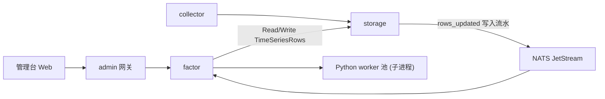
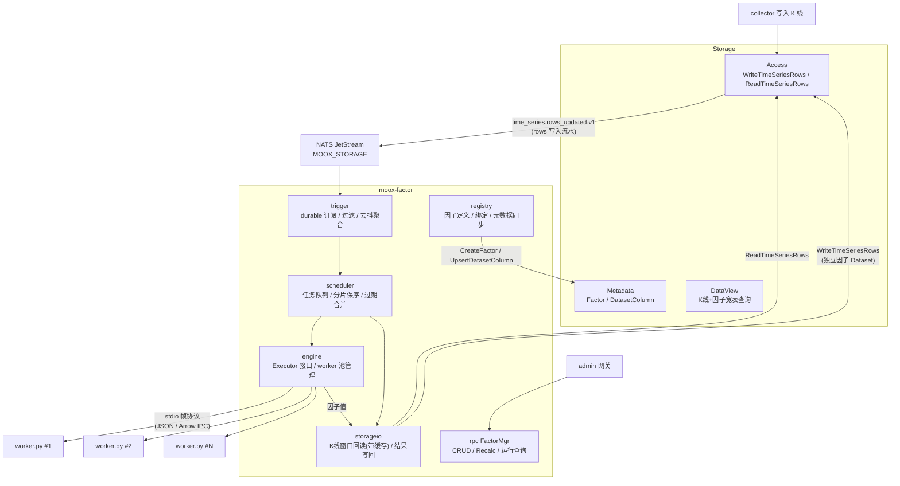
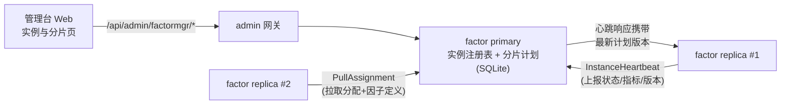

# 因子计算模块设计

本文是 `modules/factor` 因子计算模块的落地设计。核心共识是：因子计算是写入流水驱动的派生计算服务——上游消费 Storage rows_updated 写入流水，中间用常驻 Python worker 池执行 pandas 因子（兼容邢不行 `signal` 协议），下游将因子值以列级 patch 写回 Storage 独立结果数据集，由 View 物化链路合成宽表供查询。

## 核心结论

- `factor` 是独立业务服务（对齐 collector/cloudnode 的地位），不进 admin，不进 storage；通过 proto 生成包调用 storage，通过 admin 网关暴露管理面。
- 触发源是 Storage 的 `moox.storage.time_series.rows_updated.v1` JetStream 写入流水；流水携带 rows，因子模块从 row key 聚合任务并负责回读 K 线窗口。**部署前提：storage 的 `eventbus.type` 必须配置为 `nats`（默认 `memory` 只在单进程内可见）。**
- 因子代码保持邢不行协议：时序因子 `signal(df, n, factor_name)` / `signal_multi_params(df, param_list)`，截面因子 `signal(df, n, factor_name)` + `get_factor_list(n)` 依赖声明。存量因子文件零修改接入。
- Python 执行采用**本机常驻 worker 子进程池 + stdio 帧协议**（v1 JSON 编码，v2 Arrow IPC，同一帧协议内平滑升级）。因子代码可信（自写），不做沙箱，只做超时 kill 与崩溃重启。
- 因子结果写入**独立结果 Dataset**（不写回 K 线 Dataset），从根上避免"写回→再触发自身"的事件死循环；查询侧用 View 多 Dataset join 合成宽表。
- 任务粒度是 **per-symbol 批量**：一个任务 = 一个 symbol 的一份 DataFrame + 该 symbol 绑定的全部因子。K 线只回读一次、只传输一次。
- 跨机演进主路径是**按标的分片的多实例部署**：每台机器一个完整 factor 实例、负责一部分 symbol，实例内部与单机完全相同，仅需分片过滤 + primary 管理面同步；NATS WorkQueue 弹性执行是更远期的可选项。调度层与执行层之间以 `Executor` 接口 + 自包含任务结构切界，为后者预留。
- 截面因子（V2）依赖时序因子结果，采用"bar 收盘水位线 + 到齐率/超时触发"的两级流水线，是 Arrow/共享内存编码的主要受益场景。

## 目标与非目标

**目标**

1. 500 symbol × 100 因子 × 1m K 线粒度下稳定运行（每根 bar 的计算在下一根 bar 收盘前完成）。
2. 兼容邢不行风格 Python 因子，存量 `.py` 文件直接放入 `factors/` 即可注册使用。
3. 因子结果进入 Storage 数据体系（元数据登记、列级写回、View 查询），与 K 线同构管理。
4. 提供管理面：因子 CRUD/启停、绑定管理、手动补算、运行记录查询。

**非目标（当前版本）**

- 不做不可信代码沙箱与资源配额（因子自写可信）。
- 不做跨机分布式执行（预留演进路径，见「跨机演进」章节）。
- V1 不实现截面因子（协议与数据模型预留，见「截面因子设计」章节）。
- 不做因子回测/研究工作台（本模块只负责生产链路的增量计算）。

## 与现有系统的集成点

| 集成点 | 依赖 | 说明 |
| --- | --- | --- |
| 写入流水 | NATS JetStream stream `MOOX_STORAGE`，subject `moox.storage.time_series.rows_updated.v1` | durable pull consumer `factor_calc`，与 ViewBuilder/Archive 消费互不影响 |
| K 线回读 | `storage.Access/ReadTimeSeriesRows`（tRPC，默认 20102） | 因子模块从 rows 提取 key，并按 lookback 窗口回读完整 K 线 |
| 结果写回 | `storage.Access/WriteTimeSeriesRows` | 列级 patch 语义：同 key 只更新携带列 |
| 元数据登记 | `storage.Metadata/CreateFactor`、`UpsertDatasetColumn`（tRPC，默认 20100） | 结果列 `origin_type=factor`，写回前必须登记否则 schema 校验失败 |
| 查询出口 | `storage.DataView/QueryTimeSeriesRows` | View 定义 join K 线 Dataset + 因子结果 Dataset 的列 |
| 管理面 | admin 网关 `/api/admin/factormgr/*` | SysDeploy 注册 serviceID `factormgr` → `moox_factor`（HTTP 11404） |
| 服务发现 | admin `/api/service/sysdeploy/ListActiveServiceDeployments` | 解析 storage 地址，本地开发用 `config/app.yaml` 默认值兜底 |

模块依赖方向（factor 只 import `modules/storage/proto/gen` 与 `packages/commonpb`，禁止 import 任何模块 internal）：



## 总体架构



端到端数据流（1m 粒度）：

1. collector 在每分钟 bar 收盘后写入 500 symbol 的 K 线，Access 发布约 500 条 `rows_updated` 写入流水（含批量写入时的合并）。
2. trigger 消费事件，过滤出订阅的 K 线 Dataset，按 `(space, dataset, subject, freq)` 聚合进去抖桶（默认 2s 窗口），产出约 500 个 per-symbol 计算任务。
3. scheduler 按 subject hash 分片入队（同 symbol 保序），worker 池并发消费。
4. 每个任务：storageio 取该 symbol 最近 `lookback` 根 K 线（优先命中进程内缓存，缺失区间才回读 Access）→ engine 把 DataFrame + 因子清单发给一个 Python worker → worker 循环执行 100 个因子 → 返回各因子值序列。
5. storageio 将尾部 M 行因子值以列级 patch 写入因子结果 Dataset。
6. Storage View（K 线 Dataset join 因子 Dataset）自动增量物化，下游用 `QueryTimeSeriesRows` 查询宽表。

## 因子协议（Python 文件）

### 时序因子

与邢不行框架完全一致，每个因子一个 `.py` 文件，文件名即因子名：

```python
# factors/Bias.py
def signal(*args):
    df = args[0]          # 单 symbol K线 DataFrame，按 candle_begin_time 升序
    n = args[1]           # 参数
    factor_name = args[2] # 结果列名，如 "Bias_20"
    df[factor_name] = df['close'] / df['close'].rolling(n, min_periods=1).mean()
    return df

# 可选：一次计算多参数（worker 优先调用）
def signal_multi_params(df, param_list) -> dict:
    return {str(n): df['close'] / df['close'].rolling(int(n), min_periods=1).mean()
            for n in param_list}
```

**输入 DataFrame 列契约**（与 `binance_spot_kline` Dataset 列对齐）：

| 列 | 类型 | 说明 |
| --- | --- | --- |
| `candle_begin_time` | datetime64[ns] | 由 `TimeSeriesKey.data_time` 转换，UTC |
| `open` / `high` / `low` / `close` | float64 | |
| `volume` / `quote_volume` | float64 | |
| `trade_num` | int64 | |

worker 侧规则：优先调用 `signal_multi_params`；不存在则对每个参数调用 `signal` 并抽取 `df[factor_name]` 列（每次传入 `df.copy()` 防止因子间中间列污染）。`signal` 中产生的其他中间列（如 `df['ma']`）一律丢弃，只收取 `factor_name` 列。

### 截面因子（V2 预留）

`sections/` 风格因子同样是 `signal(df, n, factor_name)`，但输入是**全市场 long-format DataFrame**，并通过 `get_factor_list(n)` 声明对时序因子的依赖：

```python
# sections/RankPct.py
def signal(*args):
    df = args[0]   # 全市场截面：columns = [candle_begin_time, symbol, is_spot, QuoteVolumeMean_192, ...]
    n = args[1]
    factor_name = args[2]
    con = df['is_spot'] == 1
    df.loc[con, 'rank'] = df.loc[con].groupby('candle_begin_time')[f'QuoteVolumeMean_{n}'].rank(ascending=True, method='min')
    df.loc[con, 'rank_pct'] = df.loc[con].groupby('symbol')['rank'].transform(lambda x: x.pct_change(periods=n))
    df[factor_name] = df['rank_pct']
    return df

def get_factor_list(n):
    return [('QuoteVolumeMean', n)]   # 声明依赖：时序因子名 + 参数
```

截面因子输入 df 额外包含 `symbol`（即 subject_id）和 subject 属性标记列（如 `is_spot`），详见「截面因子设计」章节。

### 因子注册信息

因子在模块 SQLite 中登记（管理面录入或 CLI 导入 `factors/` 目录），核心字段：

| 字段 | 示例 | 说明 |
| --- | --- | --- |
| `factor_id` | `bias` | 全局唯一，小写 |
| `name` | `Bias` | Python 模块名 / 结果列名前缀 |
| `kind` | `timeseries` / `cross_section` | V1 只支持 timeseries |
| `source_code` | 文件内容 | DB 存源码，落盘到 `factors/` 供 worker import |
| `params` | `[20, 96, 288]` | 参数列表，每个参数产出一列 `Bias_{n}` |
| `lookback_bars` | `600`（默认 `max(params)*3`） | 回读窗口，保证 rolling 收敛 |
| `writeback_bars` | `5` | 每次写回尾部行数（幂等覆盖，容忍迟到数据） |
| `depends_json` | `[["QuoteVolumeMean", 192]]` | 截面因子依赖（V2） |
| `status` | `enabled` / `disabled` | |

**绑定（binding）**决定因子作用范围：`factor_id × dataset_id(K线) × freq × subject 选择器（全部 / 白名单）→ 结果 dataset_id`。一个 K 线 Dataset+freq 的全部启用绑定，构成 per-symbol 任务的因子清单。

## 数据模型与元数据登记

### 独立因子结果 Dataset

因子值写入与 K 线同 space、同 subject、同 freq 对齐的独立 Dataset：

```yaml
# 示例（通过 Metadata API 登记，非 seed）
dataset:
  space_id: crypto
  dataset_id: binance_spot_factor       # 约定：{K线dataset去掉_kline}_factor
  data_kind: time_series
  freqs: ["1m", "1h", "1d"]
```

行 key 与 K 线行一一对应：`(space_id, dataset_id=binance_spot_factor, subject_id=symbol, freq, data_time=bar开盘时间)`。列名 = `{因子名}_{参数}`（如 `Bias_20`、`Cci_648`），即邢不行框架中的 `factor_name`，与策略配置 `factor_list` 的 `('Bias', True, 20, 1)` 直接对应。

**为什么独立 Dataset 而不是写回 K 线 Dataset：**

1. **防自触发死循环**（决定性理由）：`WriteTimeSeriesRows` 成功后 Access 必然发布 `rows_updated` 写入流水，且流水会携带本次写入的 rows。若写回 K 线 Dataset，trigger 仍需区分"collector 写了新 K 线"与"自己刚写回的因子值"，容易自触发。独立 Dataset 后 trigger 只需按 `dataset_id` 白名单过滤。
2. 职责清晰：K 线 Dataset 的列契约归 collector，因子 Dataset 的列契约归 factor 模块，互不越权。
3. 因子列增删频繁（新因子、调参数），不污染原始数据集的 schema。

代价是查询需要 join——由 Storage View 承担：View 主 Dataset 为 K 线，附属列来自因子 Dataset（ViewBuilder 已支持多 Dataset 列 join），对查询方仍是一张宽表。

### 元数据登记流程（registry 负责，因子启用时自动执行）

1. `Metadata.CreateFactor`：登记 `Factor{space_id, factor_id, algorithm=因子名, params_json, value_type=DOUBLE}`。
2. 确保结果 Dataset 存在（`CreateDataset`，幂等）。
3. 对每个参数列 `Metadata.UpsertDatasetColumn`：`{dataset_id=binance_spot_factor, column_name="Bias_20", origin_type=DATASET_COLUMN_ORIGIN_TYPE_FACTOR, origin_id="bias", value_type=DOUBLE, required=false}`。
4. （可选）`UpsertViewColumn` 把新列加入既有宽表 View，触发 View 版本重建。

因子禁用时不删列不删数据（历史可查），只停止计算。

## 模块结构

```text
modules/factor/
├── cmd/
│   ├── server/main.go          # moox-factor：trpc.NewServer + control.Initialize + Serve
│   └── cli/main.go             # init（SQLite schema）、import（扫描 factors/ 入库）、run-once（单 symbol 手动计算，调试）
├── config/
│   ├── app.yaml                # storage/nats/python/worker/调度参数
│   └── trpc_go.yaml            # trpc.moox.factor.FactorMgr，HTTP 11404
├── schema/factor.sql           # 本地 SQLite schema
├── proto/factor.proto          # FactorMgr 协议（gen 到 proto/factorgen，对齐 collectorgen/admingen 命名）
├── pyworker/
│   ├── worker.py               # 常驻 worker 驱动（stdio 帧协议、因子加载、执行）
│   ├── codec.py                # JSON / Arrow 编解码
│   └── requirements.txt        # pandas, numpy；(v2) pyarrow
├── factors/                    # 时序因子 .py 库
├── sections/                   # 截面因子 .py 库（V2）
└── internal/
    ├── app/control/            # bootstrap / config / discovery（照搬 collector 模式）
    ├── rpc/                    # FactorMgr RPC 实现
    ├── registry/               # 因子/绑定 CRUD、源码落盘、Storage 元数据同步
    ├── trigger/                # NATS durable 订阅、事件过滤、去抖聚合
    ├── scheduler/              # 任务队列、subject 分片保序、过期合并、重试、补算、对账
    ├── engine/                 # Executor 接口、stdio worker 池实现、协议编解码、超时/重启
    ├── storageio/              # Access 客户端封装、K线窗口缓存、结果写回
    ├── cluster/                # 实例注册/心跳/分片计划与收敛（见「多实例分片管理」章节）
    └── repository/             # SQLite 持久化（因子、绑定、运行记录、实例、分片计划）
```

### 本地 SQLite schema（沿用 `t_`/`c_` 命名惯例）

```sql
CREATE TABLE t_factor_defs (
    c_factor_id      TEXT PRIMARY KEY,
    c_name           TEXT NOT NULL,             -- Python 模块名 / 列名前缀
    c_kind           TEXT NOT NULL DEFAULT 'timeseries'
                     CHECK (c_kind IN ('timeseries', 'cross_section')),
    c_source_code    TEXT NOT NULL,
    c_source_hash    TEXT NOT NULL,             -- 内容 hash，用于 worker 热重载判定
    c_params_json    TEXT NOT NULL DEFAULT '[]',  -- 如 [20,96,288]
    c_lookback_bars  INTEGER NOT NULL,          -- registry 计算（max(params)*3，下限 200），不设 DB 默认值
    c_writeback_bars INTEGER NOT NULL DEFAULT 5,
    c_depends_json   TEXT NOT NULL DEFAULT '[]',  -- 截面因子依赖，如 [["QuoteVolumeMean",192]]
    c_status         TEXT NOT NULL DEFAULT 'disabled',
    c_ctime          DATETIME NOT NULL DEFAULT CURRENT_TIMESTAMP,
    c_mtime          DATETIME NOT NULL DEFAULT CURRENT_TIMESTAMP
);

CREATE TABLE t_factor_bindings (
    c_binding_id       TEXT PRIMARY KEY,
    c_factor_id        TEXT NOT NULL REFERENCES t_factor_defs(c_factor_id),
    c_space_id         TEXT NOT NULL,
    c_source_dataset   TEXT NOT NULL,           -- K线 dataset，如 binance_spot_kline
    c_freq             TEXT NOT NULL,           -- 1m / 1h / 1d
    c_subject_mode     TEXT NOT NULL DEFAULT 'all'  -- all / include
                       CHECK (c_subject_mode IN ('all', 'include')),
    c_subjects_json    TEXT NOT NULL DEFAULT '[]',  -- include 模式的 symbol 白名单
    c_target_dataset   TEXT NOT NULL,           -- 结果 dataset，如 binance_spot_factor
    c_status           TEXT NOT NULL DEFAULT 'enabled',
    c_ctime            DATETIME NOT NULL DEFAULT CURRENT_TIMESTAMP,
    c_mtime            DATETIME NOT NULL DEFAULT CURRENT_TIMESTAMP
);

-- UpsertBinding 自然键：同一因子对同一 (space, source_dataset, freq) 只允许一条绑定
CREATE UNIQUE INDEX idx_factor_bindings_unique
ON t_factor_bindings(c_factor_id, c_space_id, c_source_dataset, c_freq);

CREATE TABLE t_factor_runs (
    c_run_id        TEXT PRIMARY KEY,
    c_trigger_type  TEXT NOT NULL,              -- event / recalc / reconcile / manual
    c_space_id      TEXT NOT NULL,
    c_source_dataset TEXT NOT NULL,
    c_target_dataset TEXT NOT NULL DEFAULT '',
    c_subject_id    TEXT NOT NULL,
    c_freq          TEXT NOT NULL,
    c_bar_time      TEXT NOT NULL,              -- 本次计算覆盖到的最新 bar（RFC3339）
    c_factor_count  INTEGER NOT NULL,
    c_status        TEXT NOT NULL,              -- succeeded / failed / superseded（终态一次写入，无 running）
    c_error         TEXT NOT NULL DEFAULT '',
    c_elapsed_ms    INTEGER NOT NULL DEFAULT 0,
    c_ctime         DATETIME NOT NULL DEFAULT CURRENT_TIMESTAMP
);
-- 时间列沿用全仓 c_ctime/c_mtime 惯例；mtime 触发器带 WHEN NEW.c_mtime = OLD.c_mtime 守卫（同 storage metadata.sql）
-- t_factor_runs 只保留近 N 天（清理 timer，scheduler.runs_retention_days 默认 7 天），高频 1m 场景可配置采样落库
-- 多实例部署时 primary 额外持有 t_factor_instances / t_shard_plans，
-- DDL 见「多实例分片管理（管理面设计）」章节
```

**元数据主从关系**：因子"怎么算"（源码、参数、绑定）以 factor 模块 SQLite 为准；因子"结果列契约"（Factor/DatasetColumn）以 Storage Metadata 为准，由 registry 单向同步（factor → storage），冲突时以 factor 侧覆盖。

## 触发链路

### NATS 订阅

- Stream：`MOOX_STORAGE`（storage 已声明，subjects `moox.storage.>`）。
- Consumer：durable pull consumer `factor_calc`，`FilterSubject = moox.storage.time_series.rows_updated.v1`，`AckWait = 60s`，`MaxDeliver = 5`，`DeliverPolicy = New`（首次部署不回放历史，存量数据靠补算命令初始化）。
- 消息体：`TimeSeriesRowsUpdated`（protojson），`rows[]` 含 `spaceId/datasetId/subjectId/freq/dataTime` 以及本次写入列。
- 消费即 Ack：流水只是"触发信号"，去抖与任务化在内存完成；即便进程崩溃丢失少量触发，由对账 timer 兜底（见调度器章节）。这避免了慢消费导致的 JetStream 重投风暴。

### 过滤与去抖聚合

```text
流水 rows[] 逐条处理：
  1. (space_id, dataset_id, freq) 是否命中任一 enabled binding 的 source_dataset？
     否 → 丢弃（因子结果 dataset 自身的事件在此被过滤，防自触发）
  2. subject 是否命中 binding 的 subject 选择器？否 → 丢弃
  3. 入去抖桶 bucket[(space, dataset, subject, freq)]：
       bucket.max_data_time = max(bucket.max_data_time, key.data_time)
       bucket.deadline 未设置则设为 now + debounce_window（默认 2s）
  4. bucket 到期 → 产出 FactorTask，桶清空
```

去抖窗口解决两个问题：collector 单次批量写入（如补历史）对同一 subject 产生的密集事件合并为一次计算；bar 收盘时 500 symbol 事件在数秒内涌入，聚合后即 500 个任务而非碎片化重复计算。

### 任务模型（自包含，为跨机演进准备）

```json
{
  "task_id": "ft-01HXXX",
  "kind": "timeseries",
  "space_id": "crypto",
  "source_dataset": "binance_spot_kline",
  "target_dataset": "binance_spot_factor",
  "subject_id": "BTC-USDT",
  "freq": "1m",
  "bar_time": "2026-07-06T09:15:00Z",
  "lookback_bars": 600,
  "factors": [
    {"name": "Bias",  "params": [20, 96], "writeback_bars": 5},
    {"name": "Cci",   "params": [648],    "writeback_bars": 5}
  ]
}
```

任务不内嵌 K 线数据（数据由执行侧按引用获取/由 dispatcher 注入），因此这个结构今天走进程内队列，将来可原封不动放进 NATS 消息。

## 调度器（scheduler）

- **分片保序**：`shard = hash(subject_id) % worker_count`，每个分片一条 FIFO 队列绑定一个 worker。同 symbol 的两次计算天然串行，避免乱序写回；不同 symbol 并发。
- **过期合并（supersede）**：入队时若队列中已存在同 `(space, dataset, subject, freq)` 的未执行任务，直接以新任务替换（取 `max(bar_time)`）。1m 粒度下若计算积压超过一个 bar 周期，永远只算最新 bar，旧任务标记 `superseded` 落运行记录。这是 1m 场景最重要的背压策略：**宁可跳过中间 bar，不允许队列无限增长**（被跳过 bar 的因子值由下一次计算的 `writeback_bars` 尾部覆盖顺带补齐）。
- **重试**：区分可重试错误（storage 读写超时、worker 崩溃）与不可重试错误（因子代码抛异常）。可重试指数退避最多 3 次；不可重试记录失败并告警，不阻塞后续任务。
- **补算**：`FactorMgr.RecalcFactor(factor_id?, subject 选择器, 时间范围)` 生成补算任务流，按窗口切片依次执行（每片 = lookback + 窗口段），与实时任务共用队列但低优先级。首次上线的存量回填即用此命令。
- **对账 timer**（默认 10min）：抽样若干 subject，比对 K 线 Dataset 与因子 Dataset 在最近 N 根 bar 的行覆盖，缺口生成补算任务。兜底"消费即 Ack"策略下可能丢失的触发。

## Python 执行引擎（engine）

### Executor 接口

```go
// internal/engine
type Executor interface {
    // Execute 同步执行一个因子任务：输入 K 线数据帧，返回各因子各参数的值序列。
    Execute(ctx context.Context, task *FactorTask, frame *DataFrame) (*FactorResult, error)
    Close() error
}
```

v1 实现 `stdioPoolExecutor`；跨机演进时新增 `natsExecutor`，scheduler/storageio 不感知差异。

### worker 池

- 进程数默认 `min(CPU核数, 8)`，可配。每个 worker 常驻约 150~200MB（pandas + 因子模块）。
- 启动流程：Go 拉起 `python3 pyworker/worker.py --factors-dir ./factors`，worker 加载全部因子模块后发 `ready` 帧（携带已加载因子清单 + source hash），Go 校验清单与 DB 一致后投入服务。
- 生命周期管理：
  - **超时 kill**：单任务超时（默认 30s，可按因子配置）直接 `SIGKILL` 子进程并重启，该任务按可重试错误处理（换 worker 重试一次，再失败转不可重试）。
  - **崩溃重启**：worker 退出即重启（指数退避，防 crash loop 空转）；其分片队列暂挂，重启完成后恢复。
  - **热重载**：因子源码变更（source hash 变化）后，逐个 worker drain（等在途任务完成）→ 重启 → 验证 ready，滚动完成，服务不中断。
  - worker 的 stderr 由 Go 接管并入模块日志（因子 `print`/异常栈可见）。

### stdio 帧协议

Go 与 worker 之间走 stdin/stdout **长度前缀二进制帧**（v1 起就用帧格式，而非裸 NDJSON——这使 JSON 与 Arrow 两种编码共享同一传输层，升级不破协议）：

```text
帧 = magic(2B: 0x4D 0x58 "MX") | type(1B) | meta_len(4B, BE) | meta(JSON bytes)
    | payload_len(8B, BE) | payload(bytes, 可为空)

type: 0x01 hello/ready   0x02 request   0x03 response
      0x04 error         0x05 ping/pong 0x06 reload
```

- `meta` 恒为 UTF-8 JSON，描述控制信息；
- `payload` 是数据面：JSON 编码时为空（数据内嵌 meta），Arrow 编码时为 Arrow IPC stream 字节。

**请求帧（type=0x02，v1 JSON 编码）**：

```json
{
  "id": "ft-01HXXX",
  "encoding": "json",
  "factors": [{"name": "Bias", "params": [20, 96]}, {"name": "Cci", "params": [648]}],
  "df": {
    "columns": ["candle_begin_time", "open", "high", "low", "close", "volume", "quote_volume", "trade_num"],
    "index_ms": true,
    "rows": [[1751791200000, 65000.1, 65100.0, 64950.2, 65080.5, 12.3, 800123.4, 532], ...]
  }
}
```

`candle_begin_time` 用 epoch 毫秒整数传输，worker 侧 `pd.to_datetime(unit='ms', utc=True)`；`null` 表示缺失值（转 `NaN`）。

**响应帧（type=0x03）**：

```json
{
  "id": "ft-01HXXX",
  "ok": true,
  "encoding": "json",
  "results": {
    "Bias_20":  {"tail": 5, "values": [1.0021, 1.0018, null, 1.0034, 1.0029]},
    "Bias_96":  {"tail": 5, "values": [...]},
    "Cci_648":  {"tail": 5, "values": [...]}
  },
  "per_factor_ms": {"Bias": 3, "Cci": 11},
  "elapsed_ms": 45
}
```

worker 只回传尾部 `writeback_bars` 行（全量序列没有回传价值，历史行值不变），显著减小回程数据量。`per_factor_ms` 供慢因子监控。

**worker 执行逻辑**：

```python
# pyworker/worker.py 核心循环（示意）
for frame in read_frames(sys.stdin.buffer):
    df = decode_df(frame)                       # json 或 arrow
    results = {}
    for f in frame.meta["factors"]:
        mod = FACTOR_MODULES[f["name"]]
        if hasattr(mod, "signal_multi_params"):
            out = mod.signal_multi_params(df.copy(), f["params"])
            for p, series in out.items():
                results[f'{f["name"]}_{p}'] = series
        else:
            for p in f["params"]:
                col = f'{f["name"]}_{p}'
                results[col] = mod.signal(df.copy(), p, col)[col]
    write_frame(sys.stdout.buffer, encode_results(results, tail=writeback_bars))
```

## 传输编码：v1 JSON 与 v2 Arrow IPC

### v1：JSON columnar

- 适用：时序因子常规窗口（≤1 万行 × 8 列）。600 行 lookback 的请求约 60KB，编解码 <5ms，完全够用。
- 优点：零依赖（标准库）、可读、易调试（`run-once` 可直接 dump 请求帧）。

### v2：Arrow IPC（触发条件与实现）

**何时切换**：满足任一条件时按任务粒度自动选择 `encoding=arrow`（阈值可配）：

1. 单 df 行数 > 50,000（长 lookback 补算、低频大窗口）；
2. 截面因子任务（全市场宽表：500 symbol × n bar × 依赖列，轻松到百万行级）；
3. 基准测试表明 JSON 编解码占单任务耗时 >20%。

**实现设计**：

- **传输层不变**：仍是上文的长度前缀帧，`meta.encoding = "arrow"`，`payload` = Arrow IPC **stream 格式**字节（`ARROW1` stream，含 schema + N 个 RecordBatch）。
- **Go 侧**：使用 `github.com/apache/arrow-go/v18`。storageio 回读的 `ColumnValue` 列直接构建 `arrow.Record`（每列一个 `array.Builder`，double 列 `Float64Builder`、时间列 `TimestampBuilder(ms, UTC)`），`ipc.NewWriter` 写入帧 payload。K 线缓存（见下节）可直接以 Arrow 列存驻留，回读后零转换发送。
- **Python 侧**：`pyarrow.ipc.open_stream(payload).read_all()` → `table.to_pandas(self_destruct=True, split_blocks=True)`，数值列基本零拷贝；响应同理，结果 series 组装成 `pa.table` 后 `ipc.new_stream` 写回 payload。
- **依赖管理**：`pyworker/requirements.txt` 增加 `pyarrow`；worker `hello` 帧上报自身支持的 encoding 列表，Go 侧握手协商——未装 pyarrow 的环境自动回落 JSON，部署不强绑。
- **超大截面数据的旁路（可选，阈值再上一级时启用）**：payload 改为传引用 `{"payload_ref": "/dev/shm/moox-factor/ft-xxx.arrow"}`，Go 把 Arrow IPC **file 格式**写入 tmpfs，worker `pa.memory_map(path)` 零拷贝打开。任务完成后由 Go 统一删除（worker 崩溃也不泄漏）。macOS 开发环境无 /dev/shm 时回落到 `os.TempDir()`。

**编码协商总结**：

| 场景 | 编码 | 传输 |
| --- | --- | --- |
| 时序因子常规任务（≤5 万行） | JSON | 帧内嵌 |
| 大窗口补算 / 长回看 | Arrow IPC stream | 帧 payload |
| 截面因子全市场宽表 | Arrow IPC stream | 帧 payload |
| 超大截面（> 内存阈值） | Arrow IPC file | tmpfs 引用 + mmap |

## 1m 粒度容量设计

### 预算

假设：500 symbol、100 因子（含多参数展开）、lookback 600 根、每因子在 600 行 df 上 1~5ms。

| 项 | 量级 | 说明 |
| --- | --- | --- |
| 每 bar 任务数 | 500 | per-symbol 聚合后 |
| 单任务计算 | 100~500ms | 100 因子串行（worker 内） |
| 总 CPU 时间 | 50~250 核·秒/bar | |
| 8 worker 墙钟 | 6~31s/bar | 预算 60s，余量 2~10 倍 |
| 请求传输 | 60KB × 500 = 30MB/bar | JSON，进程内 pipe，无网络成本 |
| 写回 | 500 次 WriteTimeSeriesRows × 100 列 × 5 行 | 可按 symbol 批量合并为单请求多行 |

结论：8 worker 在"平均因子 1~5ms"假设下可支撑；余量主要吃在**慢因子**上，治理手段见下。

### K 线窗口缓存（storageio，1m 场景关键优化）

不做缓存时每分钟 500 次 `ReadTimeSeriesRows` × 600 行 = 30 万行/分钟的读放大。设计进程内增量缓存：

- 每个 `(space, dataset, subject, freq)` 维护一个环形缓冲（容量 = 全体绑定因子的 `max(lookback_bars)` + 冗余），列存布局。
- 任务执行时：缓存覆盖 `[bar_time - lookback, bar_time]` → 直接命中；只缺尾部若干根 → 只回读缺失区间追加；冷启动/断档 → 全窗口回读重建。
- 稳态下每任务只回读 1~2 行新 K 线，Access 读压力降低两个数量级。
- 缓存对迟到修正不敏感的风险由 `writeback_bars` 幂等覆盖 + 对账 timer 兜底；收到早于缓存尾部的事件 `data_time` 时，主动重读该区间刷新缓存。
- 内存估算：500 subject × 2000 根 × 8 列 × 8B ≈ 64MB，可接受。

### 监控与慢因子治理

- 指标：任务队列深度、supersede 次数（积压信号）、单任务耗时分布、**因子级耗时 Top-N**（`per_factor_ms` 聚合）、写回失败数、NATS consumer lag、worker 重启次数。
- 慢因子处置：耗时超阈值告警 → 优化 pandas 写法 / 降参数 / 降频（1m 绑定改 1h）/ 单独绑定到专属分片避免拖累他人。
- 扩容顺序：加 worker 进程（上限 = 核数）→ 换更多核机器 → 跨机（见下章）。

## 跨机演进路线

因子代码可信、短期单机，但 1m 全量 + 慢因子增多后单机可能到顶。**主演进路径是"按标的分片的多实例部署"（阶段 2）**：每台机器跑一个完整的 moox-factor 实例，只负责一部分 symbol，实例内部与单机架构完全相同。NATS WorkQueue（阶段 3）仅在需要自动故障转移/任务级弹性时才考虑。

**阶段 0（V1 现状）**：stdio worker 池单机执行（等价于 `shard.total = 1`）。

**阶段 1（V1 已内建的缝）**：

- `Executor` 接口隔离调度与执行；
- 任务结构自包含、可序列化；
- 帧协议 meta/payload 分离，编码可协商；
- trigger 的 subject 过滤天然预留分片条件位（单机即 `hash(subject) % 1 == 0`）。

### 阶段 2：按标的分片的多实例部署（主路径）

每台机器 = 一个完整 moox-factor 实例，只负责一部分 symbol。**实例内部零改动**，跨实例只有三处协调点：

- **触发分片**：trigger 在 binding 过滤之后追加分片过滤（`hash(subject_id) % total == index` 或显式 symbol 白名单）。K 线 `rows_updated` 流水可从 rows 提取 key，量小（约 500 条/bar），每实例全量接收、本地过滤，代价可忽略。每实例使用独立 durable consumer（`factor_calc_{instance_id}`），互不干扰。
- **管理面一致性**：指定一台 **primary** 实例承接 FactorMgr 全部写操作（SysDeploy/admin 网关只路由到 primary）；replica 实例通过心跳从 primary 拉取因子定义与分片分配（比对 hash 增量同步），变更触发本地 worker 热重载。`RecalcFactor` 由 primary 受理后广播到全部实例，各实例只认领本分片的 symbol；对账 timer 各自只对账本分片。
- **截面因子执行者**：分片计划中指定一台实例为 `cross_section_leader`（通常即 primary）负责截面层，就绪信号与数据汇聚方式见「截面因子设计」章节——分片对截面层完全透明。

分片方案的关键性质：

- **数据零迁移**：因子结果统一写 Storage、按 symbol 为 key，与"哪台机器算的"无关。分片调整后，归属变化的 symbol 只经历一次缓存冷启动（自动重建）+ 一次对账补齐。
- **保序不变**：分片间 symbol 不相交，实例内的 hash 分片保序、supersede、缓存逻辑原样成立；K 线缓存只驻留本分片 symbol，单机内存随实例数线性下降。
- **配置一致性**：分片分配由 primary 集中管理、以单调递增的计划版本下发（见「多实例分片管理」章节），实例间短暂版本错位的后果是部分 symbol 被重复计算（写回幂等，仅浪费 CPU）或短暂漏算（对账 timer 兜底），均可发现、可自愈。
- **接受的代价**：不做自动故障转移——某实例宕机后其分片停算，靠告警 + 前端一键接管（生成新分片计划）恢复；弹性粒度是机器而非任务。

分片的配置管理、实例注册心跳、切换协议与前端干预能力，见下一章「多实例分片管理（管理面设计）」。

### 阶段 3：NATS WorkQueue 弹性执行（可选，仅在阶段 2 不够时）

触发条件：需要自动故障转移、任务级弹性伸缩，或慢因子导致分片间负载严重不均。新增 `natsExecutor`：

- 新建独立 stream `MOOX_FACTOR`（WorkQueuePolicy，subjects `moox.factor.task.v1`），沿用 cloudnode 的 JobItem 队列模式（`Nats-Msg-Id` 去重、ManualAck、MaxDeliver）；结果走 `moox.factor.result.v1` 或 worker 直接写回。
- Python worker 改造为独立部署单元：`nats-py` pull consumer 抢任务，多机水平扩展；Go 侧 trigger/scheduler/storageio 收敛为单点调度面。
- **数据面两个选项**：
  - 选项 A（消息内嵌 Arrow）：dispatcher 集中回读 K 线（缓存仍有效），Arrow payload 随消息下发。需将 NATS `max_payload` 调到 8MB；超限任务切片或转选项 B。实现最简单，worker 完全无外部依赖。
  - 选项 B（引用 + worker 自读）：消息只带任务元数据，worker 通过 Access **HTTP 端口**（20201，tRPC 同时暴露 HTTP/JSON）回读，携带 AuthInfo 鉴权；worker 本地维护自己的 K 线缓存。消息极小、扩展性最好，代价是 Python 侧要实现 Access HTTP 客户端 + 缓存。
  - 建议先 A 后 B：A 改动小可快速验证收益；worker 数量与数据量继续增长时再引入 B。
- 写回归口：保持由 Go 侧统一写回（worker 回传结果），保序、鉴权、批量合并都留在单点，Python 侧不碰写路径。

### 阶段 4：调度面高可用（远期）

primary 实例主备（SQLite 状态轻，切换成本低）。当前不设计。

## 多实例分片管理（管理面设计）

分片分配不走"各机器改 YAML"，而是 **primary 集中管理 + 前端可视化配置 + 实例心跳拉取生效**。使用者在管理台即可完成扩容、缩容、手动接管故障实例，无需登录机器。

### 角色与信息流



- **primary**：承接管理台全部写操作；持有实例注册表与分片计划；自身也是一个计算实例（认领自己的分片）。
- **replica**：启动时向 primary 注册，周期心跳（默认 5s）；心跳响应携带最新计划版本与因子定义 hash，版本变化即拉取并切换。
- **单机部署退化形态**：只有 primary 一个实例、一个覆盖全部 symbol 的默认计划，管理页显示单实例——单机与多机是同一套代码与数据模型。

### 数据模型（primary 侧 SQLite）

```sql
CREATE TABLE t_factor_instances (
    c_instance_id    TEXT PRIMARY KEY,        -- 如 factor-01，实例配置指定
    c_host           TEXT NOT NULL,
    c_rpc_target     TEXT NOT NULL,           -- 实例 FactorMgr tRPC 地址
    c_role           TEXT NOT NULL CHECK (c_role IN ('primary', 'replica')),
    c_status         TEXT NOT NULL,           -- online / offline / draining
    c_plan_version   INTEGER,                 -- 实例当前生效的计划版本（心跳上报）
    c_defs_hash      TEXT,                    -- 实例当前因子定义集 hash（心跳上报）
    c_metrics_json   TEXT,                    -- 队列深度/每bar耗时/worker状态/supersede数 快照
    c_last_heartbeat TEXT,
    c_ctime          DATETIME NOT NULL DEFAULT CURRENT_TIMESTAMP,
    c_mtime          DATETIME NOT NULL DEFAULT CURRENT_TIMESTAMP
);

CREATE TABLE t_shard_plans (
    c_plan_version    INTEGER PRIMARY KEY,    -- 单调递增
    c_mode            TEXT NOT NULL CHECK (c_mode IN ('hash', 'explicit')),
    c_assignments_json TEXT NOT NULL,
    -- hash 模式:     [{"instance_id":"factor-01","shard_index":0}, ...] + total 由条目数决定
    -- explicit 模式: [{"instance_id":"factor-01","subjects":["BTC-USDT",...]}, ...]
    -- 每条目可带 "cross_section_leader": true（全计划唯一）
    c_status          TEXT NOT NULL,          -- draft / active / superseded
    c_operator        TEXT,
    c_comment         TEXT,
    c_apply_time      TEXT,
    c_ctime           DATETIME NOT NULL DEFAULT CURRENT_TIMESTAMP
);
```

replica 本地持久化最近一次拉取的分配与因子定义：primary 短暂不可达时，replica 重启后仍按最后已知配置继续计算，管理面不可用不影响计算面。

### 实例生命周期

- **注册**：实例启动 → 按 `instance.primary_target`（或经 SysDeploy 解析）向 primary 注册 → 出现在管理页。首次注册的新实例默认**不分配分片**（观察态），由使用者在前端编入计划——避免新机器一上线就自动打乱分片。
- **心跳**：默认 5s，上报运行指标 + 当前计划版本 + 因子定义 hash；响应携带最新版本号，不一致则实例调 `PullAssignment` 增量同步。
- **离线判定**：心跳超时（默认 3 个周期）→ primary 标记 `offline` + 告警；其分片停算（不自动转移），等待前端干预。

### 分片计划与切换协议

计划变更走"草稿 → 应用 → 收敛"三步，版本单调递增：

```text
1. 前端编辑计划（草稿）：
   - hash 模式：拖动实例列表即定 shard_index/total；explicit 模式：symbol 白名单分组
   - 前端校验：全部 symbol 恰被覆盖一次（explicit）、cross_section_leader 全计划唯一
   - 预览：从 Storage Metadata(ListDatasetSubjects) 拉 symbol 全集，显示每实例分到的
     symbol 数与当前负载指标，辅助均衡决策
2. ApplyShardPlan：草稿激活，plan_version++，旧计划标记 superseded
3. 实例收敛：心跳发现新版本 → drain 本地在途任务（超时上限 30s，超时直接切）
   → 原子替换 trigger 分片过滤器 → 心跳上报新版本
4. primary 观察全部 online 实例上报新版本 → 计划状态"已收敛"（前端可见进度）；
   对归属变化的 symbol 自动下发一轮对账/补算，修复切换窗口内的缺口
```

切换期间不追求强一致：短暂双算无害（写回幂等），短暂漏算由第 4 步自动补齐。这与系统"派生数据可重建"的总体哲学一致。

### 前端干预能力（web/src/views/factor/）

| 页面/操作 | 内容 |
| --- | --- |
| 实例列表 | 实例 ID、主机、角色、在线状态、心跳时间、当前计划版本、负载指标（队列深度、每 bar 耗时、supersede 数、worker 重启数） |
| 分片计划 | 当前 active 计划总览（每实例分片/symbol 数/是否截面执行者）；编辑草稿（hash/explicit 两种模式）；应用与收敛进度 |
| 一键接管 | 对 offline 实例的快捷操作：把其分片并入选定的目标实例（本质是自动生成并应用一个新计划），并自动触发受影响 symbol 的补算 |
| 主动下线 | 缩容前先把实例分片转移走（生成新计划），收敛后实例进入 `draining` → 可安全停机 |
| 变更审计 | 计划历史（谁、何时、改了什么、收敛耗时） |

### RPC 扩展（并入 FactorMgr）

```protobuf
// —— 实例与分片：管理面（/api/admin/factormgr，JWT）——
rpc ListInstances(ListInstancesReq) returns (ListInstancesRsp);
rpc GetShardPlan(GetShardPlanReq) returns (GetShardPlanRsp);        // active + draft + 收敛进度
rpc SaveShardPlan(SaveShardPlanReq) returns (SaveShardPlanRsp);     // 保存草稿（服务端复验覆盖完整性）
rpc ApplyShardPlan(ApplyShardPlanReq) returns (ApplyShardPlanRsp);  // 激活，版本++
rpc TakeoverShard(TakeoverShardReq) returns (TakeoverShardRsp);     // 一键接管 offline 实例分片
rpc ListShardPlanHistory(ListShardPlanHistoryReq) returns (ListShardPlanHistoryRsp);

// —— 实例侧：服务面（replica → primary，tRPC 直连，HMAC/内网）——
rpc InstanceHeartbeat(InstanceHeartbeatReq) returns (InstanceHeartbeatRsp);
    // 上报: instance_id/指标/当前 plan_version/defs_hash
    // 响应: 最新 plan_version/defs_hash（不一致则实例发起 PullAssignment）
rpc PullAssignment(PullAssignmentReq) returns (PullAssignmentRsp);
    // 返回: 本实例分片分配 + 因子定义/绑定全量或增量（按 hash 判断）
```

### 与 SysDeploy 的边界

- SysDeploy/`t_service_deployments` 只登记 **primary** 的地址供 admin 网关路由（serviceID `factormgr` → `moox_factor`），管理台流量永远只进 primary。
- factor 实例注册表是模块内部概念（存 primary SQLite），不复用 `t_service_deployments`——replica 不接管理台流量，无需网关可见。

### 故障场景手册

| 场景 | 表现 | 处置 |
| --- | --- | --- |
| replica 宕机 | 实例 offline 告警，其分片停算 | 前端「一键接管」转移分片；机器恢复后重新上线为观察态，再编回计划 |
| primary 宕机 | 管理台不可用；**计算面不受影响**（各 replica 按本地持久化的最后配置继续算，截面层若 leader 恰为 primary 则暂停） | 恢复 primary；长时间不可恢复则选一台 replica 改 `role: primary` 重启（因子定义已通过同步落在各 replica 本地），并更新 SysDeploy 指向 |
| 计划收敛卡住 | 某实例长期不上报新版本 | 前端显示收敛进度与落后实例；检查实例日志，必要时重启该实例（启动即拉最新计划） |
| 分片版本错位窗口 | 个别 symbol 双算或漏算 | 双算幂等无害；漏算由计划收敛后的自动补算 + 周期对账修复 |

## 截面因子设计（V2）

### 语义与依赖 DAG

截面因子 `f(某 bar 时刻全市场的行)`，典型如"按 `QuoteVolumeMean_192` 全市场排名后取分位变化"。关键性质：

1. **依赖时序因子输出**：`get_factor_list(n)` 声明依赖，形成两级流水线（时序层 → 截面层）。注册时解析依赖并校验被依赖因子已启用、参数已含；依赖列直接从因子结果 Dataset 读取，不重算。
2. **bar 时刻 t 的截面值只依赖 t 时刻（及回看 n 根 bar）的截面**，成分固定时历史值稳定；成分变化或迟到数据通过重算窗口修正。

### 触发：bar 收盘水位线

截面计算必须等"该 bar 的时序因子基本到齐"，采用水位线（watermark）机制。**就绪信号统一使用因子结果 Dataset 的 `rows_updated` 写入流水**（而非进程内计数器）：所有实例写回因子值都会触发该流水，截面执行者订阅它并统计到齐率——单机与多实例分片部署共用同一套机制，分片对截面层完全透明。

```text
截面执行者（cross_section_leader）订阅因子结果 Dataset 的
moox.storage.time_series.rows_updated.v1 写入流水：
  收到 row.key(target_dataset, subject, freq, data_time=bar_time)
    → ready[(dataset, freq, bar_time)].subjects.add(subject)
触发条件（先到先触发）：
  a) |ready.subjects| / expected_subjects >= 到齐率阈值（默认 95%）
  b) now >= bar_time + freq周期 + 强制超时（1m 默认 +30s）
触发后生成截面任务；晚到的 subject 由下一次对账/重算窗口修正。
```

注意事件方向的分工：K 线 Dataset 的事件驱动**时序层**（因子结果 Dataset 的事件在时序 trigger 中被过滤以防自触发）；因子结果 Dataset 的事件驱动**截面层**（截面结果写回同一 Dataset，为防截面自触发，就绪统计只认依赖的时序因子列对应的写回——按事件时间与依赖列的写回节奏区分，或截面结果写入独立截面结果 Dataset，M5 实现时定案）。

到齐率而非 100%：个别 symbol 停牌/采集失败不应阻塞全市场截面。

### 数据组织与执行

截面任务输入 long-format 宽表，由 Go 侧从因子结果 Dataset 批量回读组装：

```text
行 = subject × bar（回看窗口 n+buffer 根 × 全部 symbol）
列 = candle_begin_time, symbol, 依赖因子列（如 QuoteVolumeMean_192）, subject 属性列（如 is_spot）
量级 = 500 symbol × ~2000 bar × 5 列 ≈ 100 万行 → 必用 Arrow（帧 payload 或 tmpfs 引用）
```

- `symbol` 列 = `subject_id`；`is_spot` 等属性列来自**系统内预先配置的属性 Dataset**（record 类型，key = subject_id，列如 `is_spot`、`is_swap`，由用户在 Storage 中提前登记维护）。注册截面因子时声明所需的属性 Dataset 与列名，Go 组装截面宽表时按 `subject_id` join 注入。属性数据低频变化，进程内缓存 + 定期刷新（默认 10min），不进热路径。
- 截面任务不做 subject 分片（一个任务就是全市场），单独一条截面队列，绑定专属 worker（避免长任务阻塞时序分片）；同 `(dataset, freq)` 的截面任务串行 + supersede。
- 执行协议与时序因子同一套帧协议，`meta.kind = "cross_section"`；worker 调用 `sections/` 模块的 `signal(df, n, factor_name)`。
- **写回**：结果按 `(symbol, bar_time)` 拆回行，写入同一个因子结果 Dataset（列如 `RankPct_1608`），仅写回尾部 `writeback_bars` 根 bar × 全 symbol。
- **重算窗口**：迟到数据、成分变化后，对账 timer 发现依赖列在窗口内有更新 → 生成截面重算任务（覆盖写，幂等）。

### 截面容量估算

500 symbol × 2000 bar × 5 列 double ≈ 40MB Arrow payload，pandas `groupby(candle_begin_time).rank()` 在百万行上约 1~3s。1m 粒度下每分钟一次全市场截面计算是可行的，但这是单任务大块 CPU：截面因子多时优先考虑 (a) 缩短回看窗口（多数截面因子 n 远小于 lookback 上限）、(b) 截面专属 worker 数、(c) 多实例分片部署时把截面执行者（cross_section_leader）放到独立机器。

## FactorMgr 协议草案（proto/factor.proto）

```protobuf
// package trpc.moox.factor
service FactorMgr {
  // 因子定义
  rpc CreateFactor(CreateFactorReq) returns (CreateFactorRsp);      // 含源码上传
  rpc UpdateFactor(UpdateFactorReq) returns (UpdateFactorRsp);      // 源码/参数变更 → 触发 worker 热重载 + 元数据同步
  rpc GetFactor(GetFactorReq) returns (GetFactorRsp);
  rpc ListFactors(ListFactorsReq) returns (ListFactorsRsp);
  rpc SetFactorStatus(SetFactorStatusReq) returns (SetFactorStatusRsp);  // enable/disable

  // 绑定
  rpc UpsertBinding(UpsertBindingReq) returns (UpsertBindingRsp);
  rpc ListBindings(ListBindingsReq) returns (ListBindingsRsp);
  rpc DeleteBinding(DeleteBindingReq) returns (DeleteBindingRsp);

  // 运维
  rpc RecalcFactor(RecalcFactorReq) returns (RecalcFactorRsp);      // 补算：factor/subject/时间范围，异步返回 recalc_id
  rpc GetRecalcProgress(GetRecalcProgressReq) returns (GetRecalcProgressRsp);
  rpc ListFactorRuns(ListFactorRunsReq) returns (ListFactorRunsRsp);
  rpc GetEngineStatus(GetEngineStatusReq) returns (GetEngineStatusRsp);  // worker 池/队列/lag 快照

  // 实例与分片（详见「多实例分片管理」章节）
  rpc ListInstances(ListInstancesReq) returns (ListInstancesRsp);
  rpc GetShardPlan(GetShardPlanReq) returns (GetShardPlanRsp);
  rpc SaveShardPlan(SaveShardPlanReq) returns (SaveShardPlanRsp);
  rpc ApplyShardPlan(ApplyShardPlanReq) returns (ApplyShardPlanRsp);
  rpc TakeoverShard(TakeoverShardReq) returns (TakeoverShardRsp);
  rpc ListShardPlanHistory(ListShardPlanHistoryReq) returns (ListShardPlanHistoryRsp);
  rpc InstanceHeartbeat(InstanceHeartbeatReq) returns (InstanceHeartbeatRsp);   // 服务面
  rpc PullAssignment(PullAssignmentReq) returns (PullAssignmentRsp);            // 服务面
}
```

管理台路径 `/api/admin/factormgr/{Method}`（JWT），SysDeploy 登记 `moox_factor`（HTTP 11404，`trpc.moox.factor.FactorMgr`）。

## 配置样例（config/app.yaml）

```yaml
database:
  path: ./data/factor/factor.db     # 相对 modules/factor 工作目录，对齐 collector 惯例

storage:
  metadata_target: "127.0.0.1:20100"   # 裸 host:port，客户端创建时统一规范化为 ip:// 前缀（对齐 collector normalizeStorageTarget）
  access_target: "127.0.0.1:20102"

nats:
  url: nats://127.0.0.1:4222          # 与 storage eventbus 同一 NATS
  stream: MOOX_STORAGE
  consumer: factor_calc
  subject: moox.storage.time_series.rows_updated.v1

engine:
  python_bin: python3
  factors_dir: ./factors
  sections_dir: ./sections
  workers: 8                          # 建议 = CPU 核数
  task_timeout_ms: 30000
  encoding: auto                      # auto / json / arrow
  arrow_row_threshold: 50000
  shm_dir: ""                         # 空则用系统临时目录；Linux 建议 /dev/shm/moox-factor

scheduler:
  debounce_window_ms: 2000
  max_retry: 3
  reconcile_interval_min: 10
  runs_retention_days: 7              # t_factor_runs 保留天数（清理 timer）
  cross_section_ready_ratio: 0.95     # V2
  cross_section_force_delay_ms: 30000 # V2

instance:                             # 实例身份；分片分配由 primary 集中管理（见「多实例分片管理」）
  instance_id: factor-01              # 全局唯一实例标识
  role: primary                       # primary / replica；primary 承接管理面写操作
  primary_target: ""                  # replica 必填：primary 的 tRPC 地址（留空则经 SysDeploy 解析）
  heartbeat_interval_ms: 5000

sysdeploy:
  admin_gateway_url: http://127.0.0.1:11000
```

## 实施里程碑

| 里程碑 | 内容 | 验收 |
| --- | --- | --- |
| M1 引擎打通 | 帧协议 + `pyworker/worker.py` + `engine`(stdio 池) + `storageio` 读写 + `cli run-once`；结果 Dataset 与元数据登记（registry 最小版） | `run-once --symbol BTC-USDT --freq 1m` 端到端：回读→计算 Bias/Cci→写回→DataView 可查 |
| M2 触发链路 | NATS durable 订阅 + 去抖 + scheduler（分片/supersede/重试）+ K 线窗口缓存 | collector 实时写 1m K 线，因子列自动跟进；压测 500 symbol 事件风暴下 bar 内完成 |
| M3 管理面 | `proto/factor.proto` + FactorMgr RPC + SQLite 持久化 + RecalcFactor 补算 + SysDeploy/网关接入 + `cli init/import` | 管理台/HTTP 完成因子 CRUD、启停、补算；重启不丢定义 |
| M4 可观测与 Arrow | 指标/慢因子统计、对账 timer、Arrow IPC 编码（含协商与阈值切换）、热重载 | 大窗口补算走 Arrow；因子级耗时可查 |
| M5 截面因子（V2） | 依赖解析、watermark 触发、截面数据组装（Arrow/tmpfs）、截面队列与写回 | `RankPct` 类因子端到端跑通 |
| M6 多实例分片管理 | 实例注册/心跳/离线判定、分片计划（草稿/应用/收敛）、`PullAssignment` 定义同步、切换后自动补算、前端实例与分片页（列表/计划编辑/一键接管/审计） | 双实例分片跑通：前端改计划→两实例收敛→对账无缺口；kill 一台后前端一键接管恢复 |

## 风险与开放问题

1. **storage eventbus 切 nats 的部署变更**：现网若跑 memory 模式需一次配置变更 + storage 重启，事件从此跨进程可见（ViewBuilder 行为不变，仅传输层变化）。
2. **事件丢失窗口**："消费即 Ack + 对账兜底"换取吞吐；对账周期（默认 10min）内的缺口是可见延迟上限，1m 强实时诉求可缩短对账周期或改为"处理完再 Ack"（需评估重投风暴）。
3. **因子结果 Dataset 的行数放大**：1m × 500 symbol × 每行 100 列因子值，Pebble 与 View(DuckDB) 的容量与查询性能需在 M2 压测确认；必要时因子列拆多个结果 Dataset（按因子组）。
4. **截面结果的写回目标**：截面结果若与时序因子共用结果 Dataset，会干扰截面就绪统计（rows_updated 流水需额外按列来源区分）；倾向为截面结果建独立 Dataset（如 `binance_spot_section`），M5 实现时定案。
5. **多 freq 并存**（同因子绑定 1m + 1h）：任务与缓存均按 freq 隔离，本设计已覆盖，但 View 宽表按 freq 分 View，管理面需引导用户理解。
6. **多实例分片的一致性窗口**：分片分配由 primary 以单调版本集中下发，实例收敛期间（秒级）存在双算（幂等无害）或漏算（收敛后自动补算 + 对账兜底）窗口；因子定义同步同理，窗口内新因子只在已同步实例的分片生效。
7. **primary 单点（管理面）**：primary 宕机不影响计算面（replica 按本地持久化配置继续算），但管理台与计划变更不可用；截面执行者若恰为 primary 则截面层暂停。恢复手段见「故障场景手册」，自动主备切换留待远期（阶段 4）。
