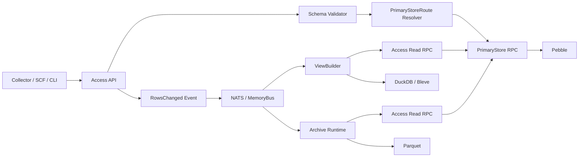

# Storage 服务架构与部署

本文说明 `modules/storage` 的服务角色、模块关系和部署方式。读完本文后，用户应能判断一个 storage 进程承担哪些职责，以及如何从单机部署平滑拆到多机部署。

更细的概念定义见 `存储概念与设计意图.md`，元数据表设计见 `存储目标架构与元数据.md`，PB 协议边界见 `协议设计.md`。

## 一句话模型

Storage 使用同一个二进制 `moox-storage`，通过 `storage.roles` 选择本进程启用的运行角色：

```text
access  负责 Metadata + Access API，是唯一公开事实数据读写入口
primary 负责 PrimaryStore RPC 和 Pebble 在线事实主存
view    负责 DataView 查询、ViewBuilder、DuckDB 和 Bleve
archive 负责 Archive runtime、archive.timer 和 Parquet 冷归档入口
```

单机部署可以把多个角色放在同一个进程。多机部署可以把这些角色拆成多个进程或多台机器；跨进程时，`view` 和 `archive` 通过 RPC 读取 `Metadata` 与 `Access`，并通过 NATS 接收行变更事件。

## 角色与职责

| 角色 | 对外服务 | 本地存储 | 主要职责 |
| --- | --- | --- | --- |
| `access` | `trpc.moox.storage.Metadata`、`trpc.moox.storage.Access`，以及对应 HTTP 服务 | Metadata SQLite；可内嵌 PrimaryStore | 管理元数据，校验 Dataset/Column 契约，解析 PrimaryStoreRoute，写入或读取 PrimaryStore，发布行变更事件 |
| `primary` | `trpc.moox.storage.PrimaryStore` | Pebble | 保存在线事实主存；可部署多实例并按 `PrimaryStoreRoute` 分片 |
| `view` | `trpc.moox.storage.DataView`，以及对应 HTTP 服务；`view.timer` 系列 timer | DuckDB、Bleve | 消费行变更事件，通过 Access 回读最新事实行，构建 TimeSeries DuckDB View 和 Record Bleve 索引 |
| `archive` | `trpc.moox.storage.archive.timer` | Parquet 归档目录 | 消费行变更事件，通过 Metadata/Access RPC 读取元数据和事实数据；当前事件 handler 为占位 ack，后续补齐 Parquet 归档策略 |

`view/search` 是 `view` 角色内部的 Bleve 索引能力，不是独立部署服务。顶层 `services/` 目录应只表达可独立部署或独立调度的角色。

## 代码模块关系

```text
modules/storage/
  cmd/moox-storage/       # 进程入口：读取 storage.roles，装配各角色
  internal/config/        # storage.yaml 业务配置加载
  internal/core/          # 领域抽象：eventbus、metadata、router、schema、response
  internal/infra/         # 底层实现：SQLite、Pebble、DuckDB、Bleve、Parquet、NATS
  internal/services/
    access/               # access 角色：Metadata + Access API
    primary/              # primary 角色：PrimaryStore + Pebble
    view/                 # view 角色：DataView + ViewBuilder
      builder/            # 行变更消费和增量物化
      search/             # Record View 的 Bleve 索引和搜索
    archive/              # archive 角色：归档调度和归档事件消费
```

`core` 和 `infra` 不作为服务启动。它们只提供抽象和底层实现。`services/*` 是运行角色或运行角色内部能力。

## 数据流

### 写入事实数据



Access 是事实数据读写的唯一入口。`view` 和 `archive` 收到事件后，也必须通过 Access 回读最新完整事实行；它们不直接理解 PrimaryStore 分片，也不直接访问某个 `PrimaryStoreTarget`。

### 查询数据

| 查询 | 服务路径 | 存储 |
| --- | --- | --- |
| `ReadTimeSeriesRows` | Client -> Access -> PrimaryStore | Pebble |
| `ReadRecordRows` | Client -> Access -> PrimaryStore | Pebble |
| `QueryTimeSeriesRows` | Client -> DataView | DuckDB |
| `SearchRecordRows` | Client -> DataView -> view/search | Bleve |

`SearchRecordRows` 属于 DataView 能力。它使用 `view/search` 的 Bleve 索引实现，但用户和部署系统不需要感知一个独立 search 服务。

## 事件总线

写入成功后，Access 发布 storage 领域事件：

```text
moox.storage.time_series.rows_changed.v1
moox.storage.record.rows_changed.v1
```

同进程部署可以使用 `eventbus.type: memory`。跨进程部署必须使用 `eventbus.type: nats` 或等价跨进程传输；否则 `view` 和 `archive` 收不到 Access 发布的变更事件。

NATS 配置要点：

| 字段 | 说明 |
| --- | --- |
| `eventbus.nats_url` | 所有 storage 进程连接同一个 NATS |
| `eventbus.stream_name` | storage 事件所在 JetStream stream |
| `eventbus.subject_prefix` | subject 前缀，默认 `moox.storage` |
| `eventbus.consumer_name` | 每个角色或副本使用独立 consumer 名，避免 durable 冲突 |
| `eventbus.embedded.enabled` | 只应由一个进程开启；多机部署建议使用独立 NATS |

实时派生消费者只处理进程启动后新产生的行变更事件。历史补仓、断档追数和读模型重建统一通过 `RebuildTimeSeriesView` / `RebuildRecordView` 完成，不通过事件消费者回放历史消息。

## 单机部署

单机部署把多个角色放进同一个进程。仓库默认 `modules/storage/config/storage.yaml` 使用：

```yaml
storage:
  roles:
    - access
    - view
  primary:
    service_name: ""
  eventbus:
    type: memory
```

该配置表示：

| 行为 | 说明 |
| --- | --- |
| `access` 和 `view` 同进程 | ViewBuilder 可以使用进程内 MemoryBus 接收事件 |
| `primary.service_name: ""` | Access 自动创建本地 PrimaryStore，并暴露 `trpc.moox.storage.PrimaryStore` |
| 未启用 `archive` | 不启动 archive runtime；`archive.timer` 注册为 noop |

如果要在单机里同时启用归档，可以把角色改为：

```yaml
storage:
  roles:
    - access
    - view
    - archive
```

此时 `archive` 与 `access` 同进程，`eventbus.type: memory` 可用。生产环境仍建议使用 NATS，便于后续拆分。

## 多机部署

多机部署把角色拆成独立进程。最常见的拆分是 `access`、`primary`、`view`、`archive` 四类进程。

### Primary 节点

Primary 节点只负责 Pebble 主存。

```yaml
storage:
  roles:
    - primary
```

要求：

| 项 | 要求 |
| --- | --- |
| tRPC | 暴露 `trpc.moox.storage.PrimaryStore` |
| 本地目录 | 拥有自己的 `devices.pebble_path` |
| 元数据 | 不作为 Metadata 控制面 |

多个 Primary 节点通过 `PrimaryStoreNode` 和 `PrimaryStoreRoute` 做水平分片。

### Access 节点

Access 节点负责 Metadata 与事实读写入口。

```yaml
storage:
  roles:
    - access
  primary:
    service_name: trpc.moox.storage.PrimaryStore
  eventbus:
    type: nats
    nats_url: nats://10.0.0.10:4222
```

要求：

| 项 | 要求 |
| --- | --- |
| tRPC/HTTP | 暴露 Metadata 和 Access |
| Metadata | 拥有 SQLite 元数据控制面 |
| PrimaryStore | 通过 `primary.service_name` 访问远程 Primary |
| EventBus | 发布行变更事件到 NATS |

### View 节点

View 节点负责 DataView 查询和异步物化。

```yaml
storage:
  roles:
    - view
  eventbus:
    type: nats
    nats_url: nats://10.0.0.10:4222
    consumer_name: storage_view_1
  view:
    metadata_service_name: trpc.moox.storage.Metadata
    access_service_name: trpc.moox.storage.Access
```

要求：

| 项 | 要求 |
| --- | --- |
| tRPC/HTTP | 暴露 DataView |
| Metadata | 通过 Metadata RPC 读取和更新 View 构建状态 |
| Access | 通过 Access RPC 回读事实数据 |
| EventBus | 订阅 NATS 行变更事件 |
| 本地目录 | 拥有 DuckDB 和 Bleve 目录 |

独立 `view` 进程不能使用 `eventbus.type: memory`。它必须连接 NATS。

### Archive 节点

Archive 节点负责归档运行时和 Parquet 冷归档。

```yaml
storage:
  roles:
    - archive
  eventbus:
    type: nats
    nats_url: nats://10.0.0.10:4222
    consumer_name: storage_archive_1
  view:
    metadata_service_name: trpc.moox.storage.Metadata
    access_service_name: trpc.moox.storage.Access
```

要求：

| 项 | 要求 |
| --- | --- |
| timer | 暴露 `trpc.moox.storage.archive.timer` |
| Metadata | 通过 Metadata RPC 读取 Dataset、Device、ArchiveFile 元数据 |
| Access | 通过 Access RPC 回读待归档事实数据 |
| EventBus | 订阅 NATS 行变更事件 |
| 本地目录 | 拥有 Parquet 归档目录 |

当前 archive 的事件 handler 只做占位 ack。后续归档策略应在 `services/archive` 内实现，不放到 `view` 角色中。

## 服务部署信息建议

`t_service_deployments` 应按独立部署角色记录服务，而不是按接口拆得过细。

| 服务名建议 | 角色 | 典型 endpoint |
| --- | --- | --- |
| `moox-storage-access` | `access` | Metadata tRPC/HTTP、Access tRPC/HTTP |
| `moox-storage-primary` | `primary` | PrimaryStore tRPC |
| `moox-storage-view` | `view` | DataView tRPC/HTTP、view timer |
| `moox-storage-archive` | `archive` | archive timer |
| `moox-storage-monolith` | `access,view,archive`，可内嵌 primary | 单机开发或小规模部署 |

SCF 或其他后台运行时需要与 storage 交互时，应优先读取服务部署信息。K 线等事实写入走 Access 或 Storage Access RPC；View 和 Archive 内部回读通过 Metadata/Access RPC 完成。

## 部署选择

| 场景 | 推荐部署 |
| --- | --- |
| 本地开发 | `roles: [access, view]`，`primary.service_name: ""`，`eventbus.type: memory` |
| 单机生产或小规模使用 | `roles: [access, view, archive]`，建议使用 NATS |
| 主存数据量变大 | 拆出一个或多个 `primary` 节点 |
| View 构建影响写入 | 拆出 `view` 节点，并使用 NATS |
| 归档任务消耗 IO | 拆出 `archive` 节点，并使用 NATS |
| 多机部署 | `access`、`primary`、`view`、`archive` 分进程部署 |

核心约束只有两条：

| 约束 | 原因 |
| --- | --- |
| 跨进程派生必须用 NATS | `memory` 事件总线不能跨进程传播 |
| 派生角色必须通过 Access/Metadata RPC 回读 | 派生角色不理解 PrimaryStore 分片，也不绕过 Access |
