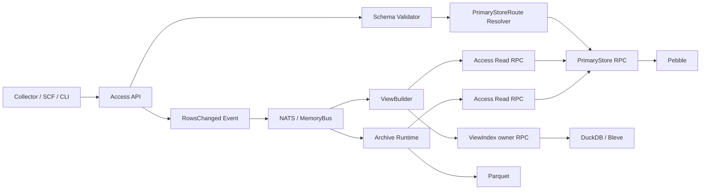

# Storage 服务架构与部署

本文说明 `modules/storage` 的服务角色、模块关系和部署方式。读完本文后，用户应能判断一个 storage 进程承担哪些职责，以及如何从单机部署平滑拆到多机部署。

更细的概念定义见 `存储概念与设计意图.md`，元数据表设计见 `存储目标架构与元数据.md`，PB 协议边界见 `协议设计.md`。

## 一句话模型

Storage 使用同一个二进制 `moox-storage`，通过 `storage.roles` 选择本进程启用的运行角色：

```text
access  负责 Metadata + Access API，是唯一公开事实数据读写入口
primary 负责 PrimaryStore RPC 和 Pebble 在线事实主存
view_index 负责 View 物理索引 owner
view_builder 负责增量双写和有租约的索引维护
view_query 负责 DataView 查询
view    是开发模式组合角色，承载上述三个 View 子角色
archive 负责 Archive runtime、archive.timer 和 Parquet 冷归档入口
```

单机部署可以把多个角色放在同一个进程。多机部署可以把这些角色拆成多个进程或多台机器；跨进程时，`view` 和 `archive` 通过 RPC 读取 `Metadata` 与 `Access`，并通过 NATS 接收行变更事件。

## 角色与职责

| 角色 | 对外服务 | 本地存储 | 主要职责 |
| --- | --- | --- | --- |
| `access` | `trpc.moox.storage.Metadata`、`trpc.moox.storage.Access`，以及对应 HTTP 服务 | Metadata SQLite；可内嵌 PrimaryStore | 管理元数据，校验 Dataset/Column 契约，解析 PrimaryStoreRoute，写入或读取 PrimaryStore，发布行变更事件 |
| `primary` | `trpc.moox.storage.PrimaryStore` | Pebble | 保存在线事实主存；可部署多实例并按 `PrimaryStoreRoute` 分片 |
| `view_index` | 内部 `trpc.moox.storage.ViewIndex`（20104） | 每 View/槽位独立 DuckDB 文件或 Bleve 目录 | 唯一物理 owner；创建、写入、统计、查询、排空引用和整库删除 |
| `view_builder` | `view.timer?op=maintain`；健康端口 20211 | 无 View 物理路径 | 消费事件并通过 owner 双写；从 PrimaryStore 分页构建、保存游标/租约、追平并原子激活 |
| `view_query` | `trpc.moox.storage.DataView`（20103/20202）；健康端口 20212 | 无 View 物理路径 | 读取 `active_index_id` 和 active schema，通过 owner 查询 |
| `view` | owner、builder、query 的组合服务 | `view_index_root` | 单进程开发模式；内部仍保持接口边界 |
| `archive` | `trpc.moox.storage.archive.timer` | Parquet 归档目录 | 消费行变更事件，通过 Metadata/Access RPC 读取元数据和事实数据；当前事件 handler 为占位 ack，后续补齐 Parquet 归档策略 |

`services/viewindex` 是可独立部署的 owner 服务；`view/search` 是 owner 内部的 Bleve 引擎实现，不直接暴露给用户。

## 代码模块关系

```text
modules/storage/
  cmd/server/             # moox-storage：读取 storage.roles，装配各角色
  cmd/cli/                # moox-storage-cli：初始化 metadata schema，导入 seed
  cmd/bench/              # 本地压测入口
  internal/config/        # storage.yaml 业务配置加载
  internal/core/          # 领域抽象：eventbus、metadata、router、schema、response
  internal/infra/         # 底层实现：SQLite、Pebble、DuckDB、Bleve、Parquet、NATS
  internal/services/
    access/               # access 角色：Metadata + Access API
    primary/              # primary 角色：PrimaryStore + Pebble
    view/                 # view 角色：DataView + ViewBuilder
      builder/            # 行变更消费和增量物化
      search/             # Record View 的 Bleve 索引和搜索
    viewindex/            # 独立 ViewIndex owner 服务和远程 client
    archive/              # archive 角色：归档调度和归档事件消费
```

`core` 和 `infra` 不作为服务启动。它们只提供抽象和底层实现。`services/*` 是运行角色或运行角色内部能力。

Storage 服务启动不自动创建 metadata 表。部署脚本会先运行 `moox-storage-cli init --storage-conf ... --schema-path ...`，需要导入示例元数据时再运行 `moox-storage-cli import-seed ...`。

## 数据流

### 写入事实数据


```mermaid
flowchart LR
    C["Collector / SCF / CLI"] --> A["Access API"]
    A --> V["Schema Validator"]
    V --> R["PrimaryStoreRoute Resolver"]
    R --> P["PrimaryStore RPC"]
    P --> PB["Pebble"]
    A --> E["RowsChanged Event"]
    E --> N["NATS / MemoryBus"]
    N --> VB["ViewBuilder"]
    N --> AR["Archive Runtime"]
    VB --> A2["Access Read RPC"]
    A2 --> P
    VB --> VI["ViewIndex owner RPC"]
    VI --> D["DuckDB / Bleve"]
    AR --> A3["Access Read RPC"]
    A3 --> P
    AR --> PQ["Parquet"]
```

Access 是事实数据读写的唯一入口。`view` 和 `archive` 收到事件后，也必须通过 Access 回读最新完整事实行；它们不直接理解 PrimaryStore 分片，也不直接访问某个 `PrimaryStoreTarget`。

### 查询数据

| 查询 | 服务路径 | 存储 |
| --- | --- | --- |
| `ReadTimeSeriesRows` | Client -> Access -> PrimaryStore | Pebble |
| `ReadRecordRows` | Client -> Access -> PrimaryStore | Pebble |
| `QueryTimeSeriesRows` | Client -> DataView -> ViewIndex owner | DuckDB active slot |
| `SearchRecordRows` | Client -> DataView -> ViewIndex owner | Bleve active slot |

`SearchRecordRows` 属于 DataView 能力。用户不直接调用内部 ViewIndex 服务。

`QueryTimeSeriesRows` 和 `SearchRecordRows` 都只读取 `active_index_id`。旧槽位持续服务到 `ActivateViewIndex` CAS 成功，因此 schema 或容量切换期间没有读空窗。active schema 与指针一起持久化，空索引也能准确校验字段；新字段激活前返回 `VIEW_NOT_READY`。

### 时序视图查询的 limit 与 total_mode

`QueryTimeSeriesRows` 支持两种查询形态：

| 形态 | 参数 | 行为 |
| --- | --- | --- |
| 精确分页 | `page` | 服务端按 `page.page` / `page.size` 返回结果；`page.size` 省略时默认 `25` |
| 预览查询 | `limit` | 服务端最多返回 `limit` 条，并额外探测 1 条设置 `has_more`；默认浏览页传 `limit=1000` |

`total_mode` 控制是否计算精确总数：

| 值 | 行为 |
| --- | --- |
| `AUTO` | 有 `keys`、`time_range` 或 `filters` 时计算总数；无界浏览时跳过总数 |
| `NONE` | 跳过总数 |
| `FORCE_EXACT` | 计算精确总数 |

`page_result.total_state` 表示 `total` 是否可信：

| 值 | 含义 |
| --- | --- |
| `EXACT` | `total` 是精确总数 |
| `SKIPPED` | 服务端为了避免大范围 `COUNT(*)` 没有计算总数，调用方应展示“已加载 N 条”而不是“总数 N 条” |

`limit` 不能与有效 `page.page`、`page.size` 或 `page.cursor` 同时使用。

## 事件总线

写入成功后，Access 发布 storage 领域事件：

```text
moox.storage.time_series.rows_changed.v1
moox.storage.record.rows_committed.v1
```

同进程部署可以使用 `eventbus.type: memory`。跨进程部署必须使用 `eventbus.type: nats` 或等价跨进程传输；否则 `view` 和 `archive` 收不到 Access 发布的变更事件。

NATS 配置要点：

| 字段 | 说明 |
| --- | --- |
| `eventbus.nats_url` | 所有 storage 进程连接同一个 NATS |
| `eventbus.stream_name` | storage 事件所在 JetStream stream |
| `eventbus.subject_prefix` | subject 前缀，默认 `moox.storage` |
| `eventbus.consumer_name` | 每个角色或副本使用独立 consumer 名，避免 durable 冲突 |
| `eventbus.embedded.enabled` | 只应由一个进程开启；多机部署建议使用独立 NATS |

实时派生消费者处理新产生的行变更事件。历史补仓、断档追数和读模型重建统一通过 view_builder 的 `op=maintain` 完成：schema 变化会用新 buildID 抢占旧构建，活动指针在最终 CAS 前不变；不提供手动重建 RPC，也不依赖事件消费者回放完整历史。

## 单机部署

单机部署把多个角色放进同一个进程。仓库默认 `modules/storage/config/storage.yaml` 使用：

```yaml
storage:
  roles:
    - access
    - view
  primary:
    service_name: ""
  eventbus:
    type: memory
```

该配置表示：

| 行为 | 说明 |
| --- | --- |
| `access` 和 `view` 同进程 | ViewBuilder 可以使用进程内 MemoryBus 接收事件 |
| `primary.service_name: ""` | Access 自动创建本地 PrimaryStore，并暴露 `trpc.moox.storage.PrimaryStore` |
| 未启用 `archive` | 不启动 archive runtime；`archive.timer` 注册为 noop |

如果要在单机里同时启用归档，可以把角色改为：

```yaml
storage:
  roles:
    - access
    - view
    - archive
```

此时 `archive` 与 `access` 同进程，`eventbus.type: memory` 可用。生产环境仍建议使用 NATS，便于后续拆分。

## 多机部署

多机部署把角色拆成独立进程。最常见的拆分是 `access`、`primary`、`view`、`archive` 四类进程。

### Primary 节点

Primary 节点只负责 Pebble 主存。

```yaml
storage:
  roles:
    - primary
```

要求：

| 项 | 要求 |
| --- | --- |
| tRPC | 暴露 `trpc.moox.storage.PrimaryStore` |
| 本地目录 | 拥有自己的 `devices.pebble_path` |
| 元数据 | 不作为 Metadata 控制面 |

多个 Primary 节点通过 `PrimaryStoreNode` 和 `PrimaryStoreRoute` 做水平分片。

### Access 节点

Access 节点负责 Metadata 与事实读写入口。

```yaml
storage:
  roles:
    - access
  primary:
    service_name: trpc.moox.storage.PrimaryStore
  eventbus:
    type: nats
    nats_url: nats://10.0.0.10:4222
```

要求：

| 项 | 要求 |
| --- | --- |
| tRPC/HTTP | 暴露 Metadata 和 Access |
| Metadata | 拥有 SQLite 元数据控制面 |
| PrimaryStore | 通过 `primary.service_name` 访问远程 Primary |
| EventBus | 发布行变更事件到 NATS |

### View 节点

生产部署拆为三个独立 View 进程；启动顺序是 `access -> view_index -> view_builder -> view_query`，停止顺序相反。

```yaml
storage:
  roles:
    - view_index
  devices:
    view_index_root: /data/moox/storage/view-indexes
  health:
    addr: :20213
---
storage:
  roles:
    - view_builder
  eventbus:
    type: nats
    nats_url: nats://10.0.0.10:4222
    consumer_name: storage_view_builder_1
  view:
    metadata_service_name: trpc.moox.storage.Metadata
    access_service_name: trpc.moox.storage.Access
    index_service_name: trpc.moox.storage.ViewIndex
---
storage:
  roles:
    - view_query
  view:
    metadata_service_name: trpc.moox.storage.Metadata
    index_service_name: trpc.moox.storage.ViewIndex
```

要求：

| 项 | 要求 |
| --- | --- |
| view_index | 监听内部 tRPC 20104；仅它拥有 `view_index_root`；健康 20213 |
| view_builder | 通过 Metadata/Access/ViewIndex RPC 工作；订阅 NATS；健康 20211 |
| view_query | 暴露 DataView 20103/20202；通过 Metadata/ViewIndex RPC 查询；健康 20212 |

独立 `view_builder` 不能使用 `eventbus.type: memory`。`view_query` 与 `view_builder` 配置不得声明物理索引路径。

View 索引计时器只在 view_builder 注册，参数统一使用 `op=maintain`。一次维护 pass 受 `run_budget`、每轮 View 数和每 View 页数约束；每页成功后持久化 cursor 并续租。owner 在可用磁盘低于配置下限时拒绝新构建。

相关业务配置位于 `storage.view.maintenance`：

```yaml
storage:
  view:
    maintenance:
      enabled: true
      owner_id: ""
      lease_ttl: 90s
      run_budget: 20s
      page_size: 500
      max_entries: 200000
      target_entries: 150000
      max_physical_bytes: 536870912
      min_free_disk_bytes: 1073741824
      min_ready_entries: 1000
      overlap_window: 30m
      allowed_lag: 2m
      remove_grace: 60s
      time_series:
        default_retention_window: 7d
        retention_by_freq:
          1m: 24h
          1h: 90d
          1d: 730d
      record:
        retention_window: 30d
```

`maintenance.enabled=false` 是完整 kill switch。`max_entries` 和 `max_physical_bytes` 是高水位；若保留窗口内数据本身仍超过高水位，系统上报 index pressure 而不会反复重建。物理布局为：

```text
<view_index_root>/duckdb/<space-hex>/<view-hex>/a.duckdb|b.duckdb
<view_index_root>/bleve/<space-hex>/<view-hex>/a|b
```

新项目需要清理旧派生格式时运行：

```bash
scripts/reset-storage-view-indexes.sh --root /data/moox/storage --yes
# 旧 metadata schema 也需要重建时追加 --metadata；PrimaryStore 始终保留
```

维护日志和指标统一携带以下字段，便于按一次切换串联控制面、owner 和查询侧：

```text
space_id view_id build_id index_id engine state owner_id
active_entries active_bytes warming_entries warming_bytes
cursor pages_written rows_written source_end coverage_end lag_seconds
switch_reason switch_duration_seconds remove_duration_seconds
```

### Archive 节点

Archive 节点负责归档运行时和 Parquet 冷归档。

```yaml
storage:
  roles:
    - archive
  eventbus:
    type: nats
    nats_url: nats://10.0.0.10:4222
    consumer_name: storage_archive_1
  view:
    metadata_service_name: trpc.moox.storage.Metadata
    access_service_name: trpc.moox.storage.Access
```

要求：

| 项 | 要求 |
| --- | --- |
| timer | 暴露 `trpc.moox.storage.archive.timer` |
| Metadata | 通过 Metadata RPC 读取 Dataset、Device、ArchiveFile 元数据 |
| Access | 通过 Access RPC 回读待归档事实数据 |
| EventBus | 订阅 NATS 行变更事件 |
| 本地目录 | 拥有 Parquet 归档目录 |

当前 archive 的事件 handler 只做占位 ack。后续归档策略应在 `services/archive` 内实现，不放到 `view` 角色中。

## 服务部署信息

当前 `t_service_deployments` 默认按 HTTP 入口和 tRPC 入口分别登记。SCF 或其他后台运行时需要与 storage 交互时，应优先读取这些 active 服务部署信息。

| 服务名 | 角色 | 默认端口 | 说明 |
| --- | --- | --- | --- |
| `storage_metadata` | `access` | `20200` | Metadata HTTP 服务 |
| `storage_access` | `access` | `20201` | Access HTTP 服务 |
| `storage_view` | `view` | `20202` | DataView HTTP 服务 |
| `storage_metadata_trpc` | `access` | `20100` | Metadata tRPC，SCF 注册 subject 时使用 |
| `storage_primary_trpc` | `primary` | `20101` | PrimaryStore tRPC，Access 内部使用 |
| `storage_access_trpc` | `access` | `20102` | Access tRPC，SCF 写 K 线和记录时使用 |
| `storage_view_trpc` | `view` | `20103` | DataView tRPC |

K 线等事实写入走 Access HTTP/tRPC；View 和 Archive 内部回读通过 Metadata/Access RPC 完成。

远程发布或线上验证优先通过 admin gateway `11000` 调用 DataView 管理接口，例如 `/api/admin/storage_view/QueryTimeSeriesRows` 和 `/api/admin/storage_view/SearchRecordRows`。验证请求必须带小页大小或 `limit`，并设置 `total_mode=NONE` 或等价跳过精确总数的参数，避免生产环境无界扫描或大范围 `COUNT(*)`。

## 部署选择

| 场景 | 推荐部署 |
| --- | --- |
| 本地开发 | `roles: [access, view]`，`primary.service_name: ""`，`eventbus.type: memory` |
| 单机生产或小规模使用 | `roles: [access, view, archive]`，建议使用 NATS |
| 主存数据量变大 | 拆出一个或多个 `primary` 节点 |
| View 构建影响写入 | 拆出 `view` 节点，并使用 NATS |
| 归档任务消耗 IO | 拆出 `archive` 节点，并使用 NATS |
| 多机部署 | `access`、`primary`、`view`、`archive` 分进程部署 |

核心约束只有两条：

| 约束 | 原因 |
| --- | --- |
| 跨进程派生必须用 NATS | `memory` 事件总线不能跨进程传播 |
| 派生角色必须通过 Access/Metadata RPC 回读 | 派生角色不理解 PrimaryStore 分片，也不绕过 Access |
