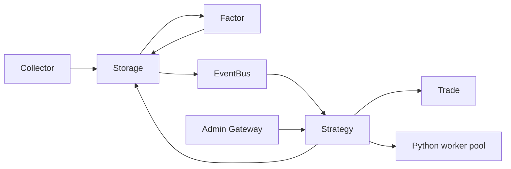
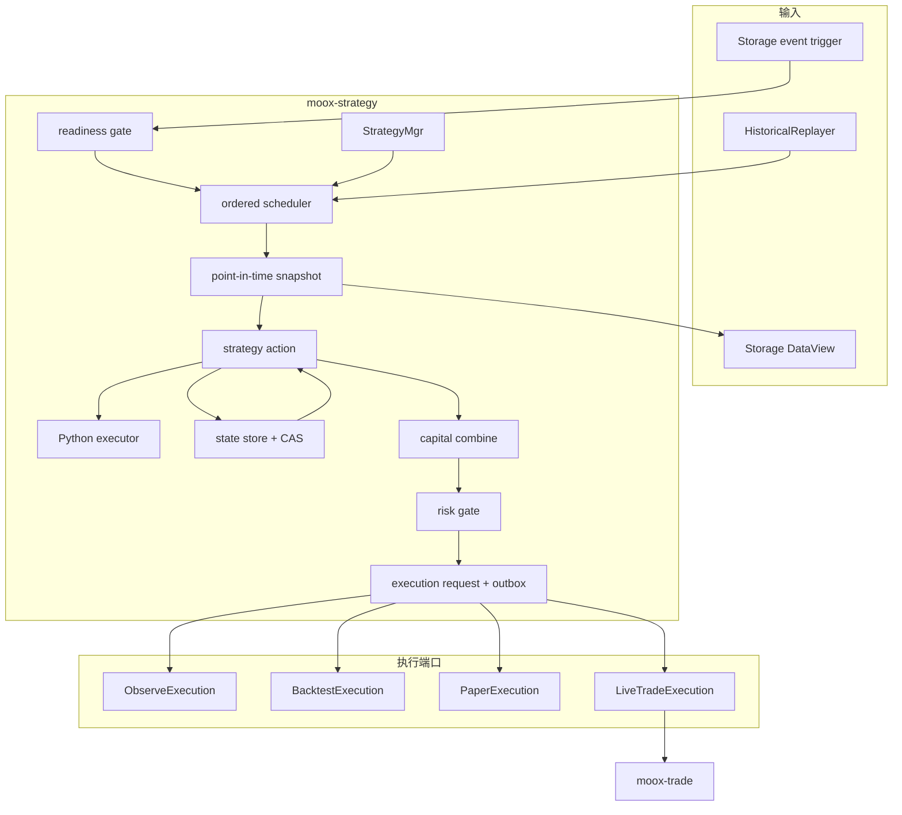

# Strategy 交易策略模块架构设计

## 设计结论

`modules/strategy` 是独立 Go 服务。它读取 Storage 中的行情与因子宽表，通过常驻 Python worker 调用版本化策略生成目标权重，聚合多个策略的资金分配，执行组合级风控，并把最终目标交给观察、回测、模拟或实盘执行端口。

策略开发者只编写 `strategy.yaml` 和 `strategy.py`。Python 不访问 Storage、Trade、账户、网络或文件，也不知道当前处于观察、回测、模拟还是实盘环境。完整 Python 契约见 [Strategy Python 策略接入手册](策略模块Python策略接入手册.md)；进程、协议、版本加载和数据传输统一见 [Python 计算运行时架构设计](Python计算运行时架构设计.md)。

核心链路固定为：

```text
闭合 Bar / 历史回放
  -> Point-in-time 数据快照
  -> Python Strategy.run
  -> 策略级 TargetWeights
  -> 策略组合资金聚合
  -> 组合级风控
  -> ExecutionRequest
  -> ObserveExecution / BacktestExecution / PaperExecution / LiveTradeExecution
```

回测和实时运行共享同一个 Python 策略、输入协议、状态机、目标权重校验、策略组合聚合和风控逻辑。两者的差异封装在时间驱动器和最终执行端口中，不允许维护两套策略实现。

## 目标与非目标

### 目标

1. 提供统一、版本化的 Python 策略输入输出协议。
2. 保证同一数据快照、参数和状态在回测与实时运行中产生相同决策。
3. 支持无状态选股和带入场、持有、冷却、止损状态的策略。
4. 支持多个策略按固定资金比例聚合到同一账户或模拟账户。
5. 以完整目标权重驱动执行，不让 Python 生成订单或依赖成交结果。
6. 通过状态 CAS、Inbox/Outbox 和稳定幂等键实现重试与重启恢复。
7. 保留每次决策使用的数据版本、策略版本、状态版本和执行结果，支持审计与复现。
8. 提供策略定义、绑定、策略组合、运行、回测和运维管理面。
9. 支持同一策略组合绑定多个执行账户，并分别配置资金倍率、风险和执行策略。
10. 提供只运行策略、不提交交易的观察模式，持续保留理论目标和绩效。

### V1 非目标

- 不执行不可信 Python，不提供容器级沙箱或租户资源隔离。
- 不支持 Tick/HFT、盘中回调或 Python `on_order/on_fill` 生命周期。
- 不支持 Python 直接访问交易所、数据库、文件和网络。
- 不支持 Delta 目标；Python 只输出完整目标权重。
- 不支持同一合约同时持有独立多头和空头的 hedge 模式。
- 不做动态子策略轮动。V1 策略组合只使用 Go 管理的固定资金比例。
- 不做分布式 Python 计算。V1 使用单实例本地 worker 池，接口为后续跨机执行预留。
- 不提供图形化策略编辑器、机器学习训练或参数自动寻优。
- 不提供 `on_tick/on_order/on_fill` 等对象生命周期 API；V1 只调用纯函数 `run()`。
- 不在 Go 进程中通过 cgo 嵌入 CPython，也不让 Python 反向加载 Go 动态库。

## 当前实现状态与边界

当前仓库已提供 `modules/strategy` 首版、Python SDK、策略 worker、SQLite 状态提交、RunOnce RPC、快照 hash、确定性回放和 Observe/Paper 端口。以下是仍需接入真实基础设施的边界：

- Storage 的真实 point-in-time RPC、NATS durable consumer 和 Trade live client 仍需在部署环境接入。
- Storage 当前事件主题是 `moox.storage.time_series.rows_updated.v1`，不是旧文档中的 `rows_changed`。
- `DataView/QueryTimeSeriesRows` 只查询当前 active 的近期 View，没有 `data_revision`、point-in-time 或 `available_at` 查询参数。
- Storage 时序行支持通用 attributes，Factor 写回已记录 parent task、snapshot hash 和 computed_at；列级 source hash 仍保存在后续运行事实表设计中。
- Factor 当前仍以 per-symbol 任务为粒度，没有全市场 Bar 完成事件；Strategy readiness 以 required dataset 到齐为触发依据。
- Trade 已预留 Strategy 归因字段；真实 live 提交/查询对账仍需联调。

因此，严格防未来数据的历史回测和可靠实盘接入分别依赖 Storage/Factor 与 Trade 的协议改造。实现阶段不能用当前 View 或内部文件读取绕过这些缺口。

## 方案选择

### 模块归属

| 方案 | 结论 | 原因 |
| --- | --- | --- |
| 独立 `strategy` 模块 | 采用 | 策略有自己的定义、绑定、状态、运行事实、回测和执行编排生命周期。 |
| 合入 `factor` | 不采用 | Factor 负责派生数据列，不应持有账户、目标权重或策略状态。 |
| 合入 `trade` | 不采用 | Trade 是订单、成交、账本和仓位事实源，不应加载用户 Python 或决定选什么标的。 |

### Python 输出层级

| 方案 | 结论 | 原因 |
| --- | --- | --- |
| 输出完整目标权重 `TargetWeights` | 采用 | 策略表达“想持有什么”，回测和实盘可复用同一决策。 |
| 只输出 score/signal | 不采用 | 排名、选股和权重逻辑会被拆散到 Python 与 Go 两侧。 |
| 直接输出订单 | 不采用 | Python 会耦合账户权益、交易规则、成交状态和实盘接口。 |

### 策略扩展方式

采用“Go 管理清单和生命周期，Python 实现纯计算”的方式。与 Factor 一样，Go 负责常驻 worker、超时、重试和数据编码；Strategy 额外提供显式策略包、状态协议和目标权重协议。不会复制参考代码的目录、接口或实现。

### 参考框架取舍

WonderTrader/wtpy 采用“Python 主进程加载 C++ 动态库，C++ 通过 ctypes 回调常驻 Python 策略对象”的方式。MooX 只借鉴其中经过验证的通用思想：常驻解释器、策略运行实例映射、稳定适配层、批量数据传输、理论目标与实际持仓分离，以及回测和实盘共用策略接口。

MooX 不采用 wtpy 的进程内回调、Python 对象隐式状态和 Context 主动查询模式。Go 始终是宿主和业务事实源，Python 是可终止、可重建的独立计算进程；全部业务状态、输入和输出都通过版本化协议显式传递。

## 模块边界



### Storage

Storage 是行情、因子和输入 View 的事实源。Strategy：

- 通过 `DataView/QueryTimeSeriesRows` 读取行情与因子宽表。
- 通过 Metadata 查询 View 列、标的范围和 point-in-time 元数据。
- 消费 `moox.storage.time_series.rows_updated.v1` 作为实时触发信号。
- 不 import Storage `internal`，不直接读取 Pebble、DuckDB 或 View 索引文件。

Strategy 通过 `SnapshotReader` 隔离数据来源：实时和近期回放可使用 DataView；完整历史必须使用 Storage 提供的历史快照查询能力。Strategy 不直接读取 Archive Parquet，也不把 Archive 文件路径当接口。

### Factor

Factor 负责计算并写回因子列。Strategy 只消费已经进入 Storage 的因子结果，不在每次决策中调用 FactorMgr，也不重复计算通用因子。

当前 Factor 不发布“某一 Bar 的全市场因子已完成”事件。V1 Strategy 使用 Storage 更新事件唤醒 readiness gate，并通过 View 查询确认目标 Bar 已物化。未来可增加 `moox.factor.batch.completed.v1` 优化唤醒，但该事件不能替代 Strategy 自己的数据完整性检查。

### Trade

Trade 是账户、订单、成交、账本和实际仓位的唯一事实源。Strategy：

- 读取余额、实际仓位、交易规则和市场快照。
- 把组合目标权重转换为目标数量后调用 `RebalanceSvc` 的 `FULL` 调仓。
- 保存 Strategy execution 与 Trade rebalance run 的关联，不复制订单或成交事实。
- 不直接调用交易所适配器，不自行重试不确定订单。

Strategy 的风控是提交前门禁，不能替代 Trade 的资金、敞口和账户级硬风控。

### Admin 与 EventBus

Admin 只做代理和服务发现，不实现 Strategy 业务。EventBus 提供实时触发、Outbox relay 和内部 durable consumer；业务真相仍保存在 Strategy SQLite 与 Trade 数据库中。

## 总体架构



## 目录结构

```text
modules/strategy/
├── cmd/
│   ├── server/main.go
│   └── cli/main.go
├── config/
│   ├── app.yaml
│   └── trpc_go.yaml
├── schema/strategy.sql
├── proto/
│   ├── strategy.proto
│   └── strategygen/
├── strategies/                 # 内置及 registry 物化的版本化策略包
├── pyworker/
│   ├── worker.py
│   ├── codec.py
│   └── runtime-requirements.txt
└── internal/
    ├── app/control/             # 配置、服务发现、bootstrap
    ├── domain/                  # 定义、绑定、状态、决策、目标、执行领域对象
    ├── repository/              # SQLite 与事务边界
    ├── registry/                # 策略包校验、版本和源码物化
    ├── trigger/                 # Storage 事件过滤与 readiness gate
    ├── scheduler/               # 按 binding 串行的任务队列
    ├── snapshot/                # point-in-time View 查询和输入标准化
    ├── engine/                  # Python Executor 与 worker 池
    ├── pysdk/                   # Python 输入输出类型、日志和本地校验工具
    ├── action/                  # 输出校验、状态 CAS 和操作提交
    ├── combine/                 # 多策略固定资金合并
    ├── risk/                    # 组合目标门禁
    ├── execution/               # observe/backtest/paper/live ExecutionPort
    ├── backtest/                # 历史回放、虚拟账户和结果产物
    ├── bus/                     # Inbox/Outbox relay 与内部 consumer
    ├── rpc/                     # StrategyMgr
    └── observability/           # health、metrics、trace
```

各目录只能依赖 `domain` 接口或其他模块的生成 proto 包。禁止跨模块 import `internal`。

## 核心领域模型

### StrategyDefinition

一个定义对应不可变的 `(strategy_id, version)`：

```text
strategy_id
version
api_version
manifest_yaml
source_code
source_hash
state_schema_version
status: draft / enabled / disabled
```

同一版本的清单和源码 hash 不允许变化。更新策略必须发布新版本。启用前完成 YAML、入口函数、参数 schema、输入列和 Python import 校验。

### StrategyBinding

Binding 把策略定义绑定到一次可运行配置：

```text
binding_id
strategy_id + strategy_version
space_id + view_id + freq
trigger_dataset
universe_policy
schedule_policy
params_json
group_id + capital_weight
state_mode: stateless / stateful
status: disabled / active / paused / error
```

账户、执行模式和硬风控不放在 Python 包中。一个策略版本可创建多个 Binding，各自持有独立状态和上一版完整 TargetWeights。

### StrategyGroup

StrategyGroup 表示需要统一合并理论目标和执行组合风控的一组策略：

```text
group_id
space_id
name
base_currency
risk_policy_json
status
```

每个 Binding 配置 `capital_weight`。V1 固定资金聚合公式为：

```text
group_target[instrument]
  = sum(binding.capital_weight * binding_target[instrument])
```

`hold` 保留该 Binding 上一次目标；`rebalance` 完整替换该 Binding 目标。任一成员目标更新后，Go 使用所有 active 成员的最新有效目标重新生成 GroupTargetWeights。

Go 不自动归一化成员权重或目标权重。资金比例、gross/net exposure 和单标的上限不合法时拒绝新组合目标。

### ExecutionBinding

ExecutionBinding 把同一 StrategyGroup 的目标路由到一个执行目的地：

```text
execution_binding_id
group_id
mode: observe / paper / live
account_id + channel_id           # observe 可为空
capital_scale
risk_policy_override_json
execution_policy_json
status: disabled / active / paused / error
```

一个 StrategyGroup 可以绑定多个账户。每个 ExecutionBinding 独立应用资金倍率、账户级风险覆盖和执行参数，产生独立 ExecutionRequest；任一账户失败不改变其他账户的目标和运行状态。历史回测由 BacktestJob 创建隔离执行环境，不作为长期 ExecutionBinding。

`observe` 模式继续运行 Python、推进显式状态、保存策略目标、组合目标和理论绩效，但不创建 Trade 请求。它用于新策略上线观察、紧急断开执行以及风险事件后的持续跟踪。

### StrategyState

State 按 Binding 隔离：

```text
binding_id
strategy_version
state_schema_version
state_revision
state_json
last_run_id
```

`next_state` 是完整替换快照。Action 使用读取时的 `state_revision` 做 CAS；旧状态上的晚到响应不能覆盖新状态。状态只描述策略运行记忆，不能保存“订单已成交”或实际账户仓位。

### StrategyRun

每个逻辑调度点最多接受一次实时决策：

```text
run_id
binding_id
strategy_id + version + source_hash
trigger_bar_time + trigger_bar_end
run_time + data_cutoff + data_revision
input_hash + previous_state_revision
action: hold / rebalance
output_hash + next_state_revision
status + error + elapsed_ms
```

稳定幂等键由 `binding_id + strategy_version + trigger_bar_time + live_namespace` 生成。晚到数据 revision 不自动改写已接受实时运行；显式回放使用新的 namespace。

### TargetWeights 与 ExecutionRequest

TargetWeights 是策略级完整目标。GroupTargetWeights 是资金聚合和组合风控后的完整目标。ExecutionRequest 记录：

```text
execution_id
group_id + group_target_revision + execution_binding_id
mode: observe / backtest / paper / live
account_id + channel_id
run_time + execution_latency
target_weights_hash
account_snapshot_id + market_snapshot_id + rules_version
idempotency_key
status + downstream_run_id + last_error
```

ExecutionRequest 一旦持久化就不因下游失败回滚。执行器继续让模拟或真实账户向同一目标收敛，直到被新 GroupTargetWeights 覆盖。

## 数据模型

Strategy SQLite 至少包含以下表：

| 表 | 用途 | 关键唯一约束 |
| --- | --- | --- |
| `t_strategy_defs` | 不可变策略版本和源码 | `(strategy_id, version)`；`source_hash` 建普通索引 |
| `t_strategy_bindings` | 数据、参数、调度和组合绑定 | `binding_id` |
| `t_strategy_groups` | 策略成员、资金权重与组合风控 | `group_id` |
| `t_strategy_execution_bindings` | 组合到观察、模拟或实盘目的地的绑定 | `execution_binding_id` |
| `t_strategy_states` | Binding 当前状态快照 | `binding_id` |
| `t_strategy_runs` | 每次策略运行事实 | `run_id`、逻辑调度点唯一键 |
| `t_strategy_target_weights` | Binding 完整目标权重 | `(run_id, instrument_id)` |
| `t_strategy_group_targets` | 聚合后的组合目标版本 | `(group_id, revision)`、`target_hash` |
| `t_strategy_group_target_weights` | 组合目标明细 | `(group_id, revision, instrument_id)` |
| `t_strategy_theoretical_nav` | Binding 与 Group 的单位净值和收益归因 | `(owner_type, owner_id, event_time)` |
| `t_strategy_execution_requests` | 每个 ExecutionBinding 的执行意图和下游关联 | `execution_id`、`idempotency_key` |
| `t_strategy_inbox` | EventBus 消费幂等 | `(consumer, message_id)` |
| `t_strategy_outbox` | 决策、组合和执行事件 | `message_id` |
| `t_backtest_jobs` | 回测配置、进度和摘要 | `backtest_id` |

实时决策、状态和执行关联存 SQLite。高频回测的逐 Bar 权重、虚拟成交、净值和指标写入按 `backtest_id` 寻址的 Parquet 结果产物；SQLite 只保存元数据、hash、统计摘要和产物位置。Parquet 是回测结果，不作为模块间隐式消息总线。

## 实时触发与数据完整性

### 触发源

V1 在 `MOOX_STORAGE` 上创建 durable consumer：

```text
stream: MOOX_STORAGE
durable: strategy_trigger_v1
subject: moox.storage.time_series.rows_updated.v1
```

事件只负责唤醒。Strategy 按 Binding 的 `trigger_dataset`、Space、freq 和标的范围过滤，不直接把事件行当作最终输入。

### readiness gate

readiness gate 按 `(binding_id, trigger_bar_time)` 聚合更新并检查：

1. 触发 Bar 已闭合。
2. View 已物化到目标 Bar。
3. Manifest 的 required columns 已进入 View schema。
4. 预期 instrument 集合达到 Binding 配置的覆盖率，V1 默认 100%。
5. 行级 `available_at` 等于本行实际提供字段可见时间的最大值。
6. `available_at <= data_cutoff <= run_time`。

合法的因子 `NaN` 不等于“数据未完成”。readiness 检查列与行是否到齐；Python 决定如何处理值缺失。

View 暂未到齐时有界重试。达到最大等待时间后不跳过该 Bar，也不推进状态；Binding 进入 `error` 并告警，reconcile timer 继续修复。V1 不允许后续 Bar 越过失败 Bar，因为有状态策略必须按时间顺序推进。

### 历史回放

HistoricalReplayer 不消费 NATS。它按 Binding 的交易日历和 schedule 生成与实时相同的 StrategyTask，并查询固定 `data_revision` 下当时可见的数据。历史回放必须保留当时的 universe、上市/下架状态、因子版本和 available_at，禁止幸存者偏差和修订数据泄漏。

### Storage 与 Factor 前置改造

为了让上一段成为可验证事实，而不是回测假设，需要新增或扩展公开协议：

1. Storage 提供按 `data_revision/as_of` 查询的历史快照接口，覆盖完整历史，不只查询当前 active View。
2. 查询结果返回每行所选字段的最大 `available_at`、数据 revision 和 View schema revision。
3. DatasetSubject 生效区间参与历史 universe 查询，避免使用今天的上市/下架集合回放过去。
4. FactorDefinition 使用不可变版本或 source hash；因子结果能追溯计算版本与 computed_at。
5. Strategy 的 `data_revision` 固定原始数据、因子版本、View schema 和 universe revision。
6. 实时 readiness 可增加明确 watermark 或 factor batch completed 事件，但最终仍以快照查询校验为准。

在这些能力落地前，只允许对明确标注为不可变、已冻结的数据快照进行研究性回测，不能宣称与历史实时可见数据严格一致。

## 调度与并发

- `schedule_policy` 明确声明 `bar / daily / weekly / monthly`、交易日历、执行时刻、时区和节假日顺延规则。
- 实时服务重启后按策略配置执行 `catch_up / skip / pause`，默认 `catch_up` 并保持逻辑调度点顺序；不得用系统当前时间伪造遗漏调度点。
- 同一 Binding 严格串行并按 `trigger_bar_time` 升序执行。
- 不同 Binding 可以并发，worker 池按 Binding 稳定分片。
- StrategyTask 有稳定 `run_id`；重复事件返回已有结果。
- Python 响应提交时必须 CAS `state_revision`。
- V1 不使用 Factor 的 supersede 策略。状态策略不能跳过中间 Bar。
- 队列积压超过配置阈值时暂停 Binding 并告警，不丢弃旧任务追最新。
- 手动 `run-once` 默认不提交状态、不生成 ExecutionRequest；显式 `--commit` 才进入正常事务链路。

## Python 执行引擎

### Executor 接口

```go
type Executor interface {
    Execute(
        ctx context.Context,
        task StrategyTask,
        frame DataFrame,
        previousTargets TargetWeights,
        previousState json.RawMessage,
    ) (StrategyOutput, error)
    Close() error
}
```

`StrategyOutput` 包含 `action`、`targets`、`next_state` 和可选 `debug_info`。协议细节以接入手册为准。

`previousTargets` 是该 Binding 上一次已经接受的完整理论目标，不是 Trade 实际仓位。Go 将其编码到 Python `context["previous_targets"]`，让策略读取当前理论组合而不必在 `state` 中复制一份持仓列表。

### Python SDK

Strategy 提供小型 `moox_strategy` SDK，但不提供可主动查询框架的 Context 对象。SDK 只包含：

- `StrategyOutput`、TargetWeights 列定义和 `empty_targets()`。
- 输入输出本地校验、时间和标的类型辅助函数。
- 将结构化日志写入 worker 捕获通道的 `strategy_log()`。
- 协议版本和 SDK 版本常量。

SDK 不提供 Storage、Trade、账户、文件或网络客户端。策略仍实现 `run(context, data, params, state)`，也可以直接返回协议规定的字典。

### worker 协议

Strategy 只定义 `StrategyTask` 和 `StrategyOutput` 的业务 payload。下述控制面、supervisor、快照和日志行为由共享 `packages/pyruntime` 实现，不在 Strategy 内复制一套 worker 管理代码。

Go 与 worker 使用四步协议：

```text
HELLO  -> protocol/python/sdk/runtime_env 版本握手
LOAD   -> 按 source_hash 加载不可变策略模块
RUN    -> 传入 StrategyTask、Arrow/JSON 数据、previous_targets 和 state
RESULT -> 返回 action、targets、next_state、debug_info 和受控日志
```

worker 使用 `source_hash` 生成唯一模块名，避免同名 `strategy.py` 相互覆盖。加载阶段只验证入口和依赖，不执行策略交易逻辑；`if __name__ == "__main__"` 不是运行入口。

### worker 池

- Go 启动固定数量的常驻 Python 子进程。
- Registry 把不可变策略版本物化到版本化目录，worker 按 `source_hash` 缓存模块。
- 请求使用长度前缀帧协议；小输入可用 JSON，跨标的长表默认使用 Arrow IPC。
- V1 使用一个受控 Python runtime；握手固定 Python、SDK、依赖锁文件和 `runtime_env_hash`，不允许 worker 静默使用本机其他环境。
- 每个 worker 同时只执行一个任务；并行度由 worker 数量提供，不在单个解释器中并发调用策略。
- 单任务超时后 kill 并重启 worker，使用同一 StrategyTask 重试。
- worker 崩溃不丢状态；状态只在 Go 事务提交后推进。
- 源码更新必须发布新版本，不对已启用版本热改文件。
- stderr 和策略 stdout 由 worker 捕获并关联 `run_id`；worker 自己的 stdout 只用于帧协议。
- worker 达到最大任务数、内存阈值或检测到模块污染后主动轮换，避免长期运行造成资源泄漏。

模块缓存只缓存代码和不可变常量。策略不得依赖模块级可变变量、单例对象或上一次调用遗留的 DataFrame。契约测试会在同一 warm worker 中穿插不同输入后再次执行相同请求，检查输出 hash 是否发生漂移。

V1 将策略代码视为可信代码。文档禁止网络、文件和系统时间访问，但该限制不是安全沙箱。需要运行第三方策略时必须另行设计容器、系统调用、网络和资源隔离。

## 运行结果提交与一致性

### `rebalance`

Go 在一个 SQLite 事务中：

1. 校验 Python 输出、标的身份、权重和 state JSON。
2. CAS 更新 StrategyState。
3. 保存 StrategyRun 和完整 TargetWeights。
4. 写入 `action.accepted` Outbox。

事务成功后，策略组合 consumer 生成新的 GroupTargetWeights，执行组合风控，并在另一个事务中保存组合目标和 `execution.requested` Outbox。

### `hold`

Go 只保存 StrategyRun 和 `next_state`，CAS 推进状态，继续引用旧 TargetWeights；不创建新的目标版本，也不创建新的 execution Outbox。旧目标尚未完成时，执行层继续收敛。

### 失败语义

| 失败点 | 行为 |
| --- | --- |
| 数据未到齐 | 不调用 Python，不推进状态，阻塞该 Binding 后续 Bar。 |
| Python 异常或超时 | 可重试；最终失败后不推进状态，Binding 进入 error。 |
| 输出协议或风控失败 | 不修正输出，不推进状态，不执行。 |
| SQLite 事务失败 | 不发布事件，可使用同一 run_id 重试。 |
| Outbox 发布失败 | 后台 relay 重试，业务事务不回滚。 |
| ExecutionPort 失败 | 保留目标与状态，按同一 execution_id 重试。 |
| Trade 结果未知 | 先按幂等键查询 Trade，禁止盲目重复调仓。 |
| 服务重启 | 从未完成 run、Outbox 和 execution request 恢复。 |

## 策略组合与风险控制

### 固定资金聚合

每个 Binding 的 TargetWeights 相对于其分配资金。Go 先乘 `capital_weight`，再按 `instrument_id` 求和。某 Binding 返回 `hold` 时使用它的上一目标；返回空 `rebalance` 时该 Binding 对所有 instrument 的贡献归零。

成员可以使用不同持仓周期。任一成员发布新目标后，组合都使用其他成员最近一次有效目标重新计算。尚无目标的成员视为现金，不把资金自动转给其他成员。

### Strategy 风控门禁

V1 至少检查：

- instrument 是否属于 Binding universe 和账户可交易市场。
- 现货是否出现负权重。
- 单 instrument 最大绝对权重。
- gross exposure、net exposure 和策略组合总预算。
- 最新市场快照、账户快照和交易规则是否过期。
- 目标换手率和单次资金变化是否超限。
- 账户、通道、StrategyGroup 或 ExecutionBinding 是否处于暂停状态。

任何超限都拒绝新组合目标。V1 不静默截断、缩放或重新归一化。Trade 仍需再次执行资金、杠杆、最小名义金额、reduce-only 和账户暂停检查。

## 执行端口

```go
type ExecutionPort interface {
    Submit(ctx context.Context, request ExecutionRequest) (ExecutionReceipt, error)
    Inspect(ctx context.Context, executionID string) (ExecutionReceipt, error)
}
```

四个端口接收同一种 GroupTargetWeights 和执行参数。除 Backtest 外，每个端口由对应 ExecutionBinding 创建。

需要生成数量的端口都调用 Strategy 内的共享 `TargetQuantityBuilder`，但各自提供账户与市场快照。该服务只负责按权益、价格、lot size、GroupTargetWeights 和 ExecutionBinding 的 `capital_scale` 把权重转成确定性目标数量。真实账户的目标减当前、反向先平后开和订单恢复仍由 Trade 负责；模拟执行器按同一公开语义实现并通过一致性测试校验。

### ObserveExecution

- 保存策略目标、组合目标、理论净值和风险检查结果。
- 不读取交易账户，不构造目标数量，不调用 Trade。
- 理论净值按权重收益计算，目标最早在 `run_time + execution_latency` 后生效，并使用版本化成本模型，禁止用已观察 Bar 的收盘价成交。
- 从 `paper/live` 切换到 `observe` 只断开新执行，不停止策略状态推进。
- 恢复真实执行前必须重新读取账户快照并创建新的 ExecutionRequest，不能补发观察期间的旧请求。

### BacktestExecution

- 使用隔离的虚拟账户、余额、持仓和成交记录。
- 最早成交时间满足 `execution_time >= run_time + execution_latency`。
- 使用当时可见的价格、交易日历、lot size、最小名义金额、手续费和滑点模型。
- 目标权重转目标数量使用共享 `TargetQuantityBuilder`；模拟器根据目标与虚拟持仓计算成交。
- 不调用 Trade，不修改实时 StrategyState。

### PaperExecution

- 使用持久化虚拟账户，实时消费市场数据。
- 与 Live 使用相同触发、数据快照、状态、组合和风控链路。
- 使用模拟成交模型，不允许意外回退到真实通道。

### LiveTradeExecution

1. 从 ExecutionBinding 取得账户、通道、资金倍率、风险覆盖和执行策略。
2. 从 Trade 获取账户余额、当前仓位和交易规则快照。
3. 使用 GroupTargetWeights、账户权益和市场价格生成确定性目标数量。
4. 持久化 snapshot ID、rules version 和稳定幂等键。
5. 调用 Trade `CreateRebalance(target_mode=FULL)`。
6. 保存 Trade run ID，消费或查询调仓结果，持续对账目标偏差。

Strategy 不根据成交速度回滚 `next_state`。下单失败、部分成交或断线只影响 execution 状态，不改变已经接受的策略决策。

## Trade 协议前置改造

当前 Trade `CreateRebalanceReq` 只有 run/account/channel/snapshot/targets，`TargetPosition` 只含 `symbol` 和 `quantity`。Strategy 实盘接入前需要补齐：

1. `TargetPosition` 增加稳定 `instrument_id` 和 `market_type`，避免多 venue 或交割合约冲突。
2. Rebalance 增加 `source=strategy`、`strategy_group_id`、`strategy_execution_id` 和 `group_target_revision`。
3. 提供 `GetRebalance` 和 `ListRebalances`，支持结果未知时按幂等键查询。
4. 调仓完成事件改为稳定 protobuf，不继续使用 `google.protobuf.BytesValue` 承载内部 JSON。
5. EventBus envelope 填充 `space_id`、TraceContext 和业务幂等键。
6. 订单、调仓 run 和成交查询保留 Strategy 归因字段。

这些改造属于跨模块协议，不允许 Strategy import Trade internal 规避。

## 回测系统

### BacktestJob

一个回测固定以下输入：

```text
strategy/group versions
bindings + params + capital weights
space/view/data revision
start/end/freq/schedule
initial capital
execution latency
fee/slippage/market rule versions
random seed
```

修改任一输入都会产生新的 `backtest_id` 和配置 hash。已完成回测不可原地修改。

### 回放流程

```text
生成逻辑调度点
  -> 查询 point-in-time 输入
  -> 调用同一 StrategyEngine
  -> 提交隔离 StrategyState
  -> 生成 GroupTargetWeights
  -> BacktestExecution
  -> 更新虚拟账户
  -> 下一调度点
```

回测停止条件包括数据缺口、Python 失败、状态冲突、非法目标或执行模型错误。默认不跳过失败 Bar。

### 结果

SQLite 保存回测配置、状态、进度、摘要和产物 hash。Parquet 结果至少包含：

- 每个决策点的 TargetWeights 和 GroupTargetWeights。
- 虚拟订单、成交、费用和持仓。
- 账户净值、收益、回撤和换手率。
- 目标与实际持仓偏差。
- 每次运行的 strategy/source/data/rules version。

同一配置重复回测必须得到相同的决策 hash、成交 hash 和最终净值。存在差异时标记非确定性并失败。

## EventBus 设计

新增 limits-retention stream：

```yaml
name: MOOX_STRATEGY
subjects: ["moox.strategy.>"]
max_age: 168h
```

V1 事件使用稳定 protobuf：

| Subject | Protobuf payload | 用途 |
| --- | --- | --- |
| `moox.strategy.action.accepted.v1` | `StrategyActionAccepted` | Binding 接受新完整目标。 |
| `moox.strategy.group_target.ready.v1` | `StrategyGroupTargetReady` | 组合目标通过聚合和风控。 |
| `moox.strategy.execution.requested.v1` | `StrategyExecutionRequested` | 请求 observe/backtest/paper/live 执行。 |
| `moox.strategy.execution.state_changed.v1` | `StrategyExecutionStateChanged` | 执行状态或下游关联变化。 |

内部 durable consumer：

| Durable | Filter |
| --- | --- |
| `strategy_group_target_v1` | `moox.strategy.action.accepted.v1` |
| `strategy_execution_v1` | `moox.strategy.execution.requested.v1` |

所有 consumer 使用 Inbox 幂等。所有业务事件从 Outbox relay 发布；RPC 或 SQLite 事务中不直接发布 NATS。

## RPC 与 CLI

`StrategyMgr` 通过 Admin 网关暴露，建议 HTTP 端口 `11408`，健康检查与 metrics 使用 `11418`。

主要 RPC：

```text
ImportStrategy / GetStrategy / ListStrategies / SetStrategyStatus
CreateBinding / UpdateBinding / ListBindings / SetBindingStatus
CreateGroup / UpdateGroup / ListGroups / SetGroupStatus
CreateExecutionBinding / UpdateExecutionBinding / ListExecutionBindings / SetExecutionBindingStatus
RunOnce / ListRuns / GetRun / GetState / ResetState
CreateBacktest / GetBacktest / ListBacktests / CancelBacktest
InspectExecution / RetryExecution
GetEngineStatus
```

`ResetState` 是高风险操作：必须暂停 Binding，记录操作者、旧 revision 和原因，并从新 revision 恢复。不能静默删除状态。

CLI 对齐接入手册，至少提供：

```text
init
validate
import
run-once
backtest
inspect-run
inspect-execution
```

## 配置

`config/app.yaml` 建议分为：

```yaml
database: {}
storage: {}
trade: {}
nats: {}
engine: {}
scheduler: {}
readiness: {}
backtest: {}
retention: {}
sysdeploy: {}
health: {}
```

`engine` 至少固定 `worker_count`、`task_timeout`、`max_tasks_per_worker`、`memory_limit`、Python 可执行文件、依赖锁文件、`runtime_env_hash`、帧协议版本和 Arrow 阈值。启动时任一 worker 握手不一致即判为未就绪，不能降级到本机其他 Python 环境。

敏感值只通过环境变量或 Secret 注入。重要环境变量使用 `MOOX_STRATEGY_*` 前缀。

## 可观测性与运维

健康检查至少验证：

- SQLite 可读写。
- Storage Metadata/DataView 可达。
- EventBus 连接和 durable consumer 正常。
- Python worker 就绪且无持续 crash loop。
- Outbox 延迟、Binding 队列延迟和 execution backlog 未超阈值。
- Live StrategyGroup 对 Trade 可达。

Prometheus 指标使用 `moox_strategy_` 前缀：

```text
runs_total{status,trigger_type}
run_duration_seconds{status}
binding_queue_lag_bars
readiness_retry_total{reason}
state_cas_conflict_total
worker_restart_total{reason}
group_target_total{status}
execution_total{mode,status}
execution_target_drift_ratio{mode}
backtest_progress_ratio
outbox_oldest_age_seconds
```

标签只使用有限枚举，不放 strategy_id、binding_id、run_id、instrument_id 或账户 ID。业务 ID 放日志和 TraceContext。

Binding 进入 error、worker crash loop、Outbox/执行积压、Trade 结果未知或目标偏差长期超限时告警。

## 测试策略

### 单元测试

- StrategyDefinition/Binding/Group 校验。
- `hold`、空 `rebalance` 和完整目标替换语义。
- 固定资金聚合、gross/net exposure 和单标的限制。
- state revision CAS、action/execution 幂等键。
- point-in-time 时间边界和执行延迟。
- 目标权重转数量、反向仓位和精度处理。

### Python 契约测试

- YAML、入口函数、参数默认值和 required columns。
- JSON 与 Arrow 编解码一致。
- HELLO/LOAD/RUN/RESULT 协议版本、runtime 环境 hash 和模块缓存。
- `next_state` 完整快照和大小限制。
- `NaN/Inf`、重复 instrument、非法现货空头和异常处理。
- 相同输入重复执行得到相同输出 hash。
- warm worker 交叉运行不同 Binding 后无模块级状态污染。

### 组件与端到端测试

- 真实 SQLite 事务、Inbox/Outbox relay 和重启恢复。
- 进程内 NATS Server 的重复投递、NAK 和 durable 恢复。
- View 物化延迟、数据缺口、late revision 和 reconcile。
- Python worker 超时、崩溃、stderr 和版本加载失败。
- 多 Binding 聚合与 execution Outbox 幂等。
- 一个 StrategyGroup 绑定多个 ExecutionBinding 时，分别缩放、隔离失败并保持相同组合目标版本。
- ObserveExecution 持续推进策略状态，但不会产生 Trade 调用；恢复执行不补发旧请求。
- Live adapter 使用 fake Trade 验证结果未知时先查询再重试。
- Backtest 与实时 replay 在相同输入下产生一致 action hash。

### 验收场景

1. 同一 Bar 重复事件只接受一次决策。
2. 服务在 Python 返回后、事务提交前崩溃，不推进状态也不执行。
3. 服务在事务提交后、Outbox 发布前崩溃，重启后只发布一次。
4. Trade RPC 超时但实际已接收调仓，不重复创建调仓。
5. 有状态策略某 Bar 数据缺失时，后续 Bar 不越过该状态缺口。
6. 相同策略版本、参数、数据 revision 和随机种子的两次回测完全一致。
7. Observe、Paper 与 Live 输入相同时产生相同 GroupTargetWeights。
8. 同一 StrategyGroup 的两个账户按各自 capital_scale 产生独立目标数量和幂等键。

## 安全与许可边界

- Python 源码视为可信内部代码；V1 的超时 kill 不是安全沙箱。
- API Key、账户凭证和 Trade 私有数据不进入 Python 输入。
- 策略包源码、参数和状态按 Space/权限控制，不通过 debug_info 泄露。
- WonderTrader/wtpy 使用 MIT License；XBX 参考代码的许可边界另行确认。本模块只吸收“常驻解释器、目标驱动、策略与执行分离、回测与实盘共核”等通用领域思想，采用独立协议、目录和实现，不复制参考工程源码。

## 工程接入

实现时需要同步修改：

1. 根 `go.work`：加入 `modules/strategy` 和 `modules/strategy/proto/strategygen`。
2. 根 `Makefile` 与 `scripts/build.sh`：增加 server/CLI/proto target。
3. EventBus：增加 `MOOX_STRATEGY`、topics、consumers 和 strategy 凭证 ACL。
4. Admin SysDeploy：增加 `moox_strategy` / `strategymgr`，端口 `11408`，health `11418`。
5. `scripts/release.sh` 与 `scripts/deploy-moox.sh`：增加二进制、配置、策略包、Python runtime、schema、启停和 `--no-strategy`。
6. Trade proto 与实现：补齐 Strategy 归因、instrument_id、查询和稳定事件。
7. 文档：模块 README、运维手册、架构总览和部署端口表。

## 交付顺序

1. **M1：契约与 run-once**。策略包、Python SDK、worker 握手与模块缓存、输出校验和 CLI。
2. **M2：回测**。HistoricalReplayer、隔离状态、BacktestExecution 和结果产物。
3. **M3：实时运行与 Paper**。Storage trigger、readiness、状态 CAS、Outbox 和虚拟账户。
4. **M4：策略组合**。固定资金聚合、组合风控、ObserveExecution 和多周期成员目标。
5. **M5：Live Trade**。ExecutionBinding、多账户资金倍率、Trade 协议改造、FULL 调仓、结果查询和目标偏差对账。
6. **M6：管理面与运维**。RPC、Admin 转发、指标、告警、发布和远端验证。

每个阶段都必须保留同一 Python 协议和 StrategyEngine；禁止先写一套回测策略逻辑，再另写实盘适配逻辑。

## 相关文档

- [Strategy 交易策略模块执行计划](superpowers/plans/2026-07-11-strategy-module.md)
- [Python 计算运行时架构设计](Python计算运行时架构设计.md)
- [Strategy Python 策略接入手册](策略模块Python策略接入手册.md)
- [因子计算模块设计](因子计算模块设计.md)
- [Trade 交易模块架构设计](交易模块架构设计.md)
- [Trade 交易模块功能说明](交易模块功能说明.md)
- [WonderTrader/wtpy](https://github.com/wondertrader/wtpy)（仅用于架构理念对照）
