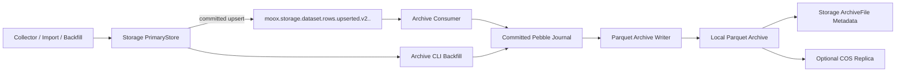

# 行情数据归档模块设计

## 文档状态

本文定义 MooX 行情数据归档模块的当前架构。按 scalar `series_tag` 分区的 Parquet
v2 已在代码中实现，生产发布与真实跨模块 E2E 验收待后续完成。归档模块使用纯 Go
实现，作为独立的 `modules/archive` 运行，消费 Storage
提交成功后发布的 NATS JetStream 行变更事件，将已闭合 K 线按市场、数据集、频率、
标的、`series_tag` 和月份物化为本地 Parquet 文件。本地归档永久保留；COS 是可选
的远程副本，不参与在线写入和本地读取。

本设计已确认以下边界：

- 数据来源是已闭合的 `1m`、`1h` 等 K 线。
- 归档模块单实例运行。
- 主要读取模式是按单个 `subject_id`、可选精确 `series_tag` 查询一段历史时间。
- 目录采用 subject-first 布局，`subject_id` 下按 `series_tag` 拆一层目录，不再
  增加年、月子目录。
- 每个 Parquet 文件名携带 Space、Dataset、Subject、频率、完整 tag 和月份，从
  原目录提取到任意位置后仍可独立识别。
- 接受每个 tag 独立月文件带来的小文件，不合并不同 tag 的归档分区。
- 文件布局参考现有 Python 量化程序的“按标的+按月分区”方式，但优先保证跨语言、可查询性和写入安全，不追求 Pickle 字节级兼容。
- 本地归档数据永不删除。内部临时文件和已物化的日志项可在校验成功后清理，但不得丢失逻辑归档行。

Archive 的自动清理只覆盖消息去重回执：默认保留 168 小时，并随物化维护删除到期回执。Parquet 月分区、已封口文件和 COS 对象不属于该清理范围。本地 `root_dir` 会随归档事实持续增长，部署者必须为其规划独立容量；参见[数据保留与磁盘空间](运维/数据保留与磁盘空间.md)。

## 目标

1. 将 Storage 中已提交的 Canonical K 线持续归档到本地 Parquet。
2. 对 NATS 重投、重复行、乱序行、迟到行和数据修订保持幂等。
3. 在进程崩溃、断电和 COS 故障下保证本地归档不丢失。
4. 保留 Storage 的逻辑值类型，不在归档链路中改变价格精度或字段语义。
5. 支持对已封口文件定期上传 COS，并校验本地与远端副本。
6. 提供回填、压缩、验证和 COS 重试命令，便于首次建档和故障修复。

## 非目标

- 归档模块不从逐笔成交或 ticker 自行合成 K 线。
- 归档模块不裁决 Provider 质量，不判断 K 线是否闭合，不填补市场缺口。这些职责属于 Market Module、Collector 和 Storage Canonical 链路。
- 归档模块不提供在线行情查询 API。业务在线查询继续读取 Storage。

归档通过 Storage PrimaryStore 的公开读接口读取已激活 Dataset。Dataset 的目标由
Metadata Snapshot 按 `data_node_id -> DataNode.service_target` 解析；归档模块不保存
节点路由，也不执行 DataNode 注册、激活或绑定修改。Schema v6 不提供在线迁移，归档
部署前必须确认目标 Dataset 已由 Doctor 检查并显式激活。
- 首版不支持多实例共写同一本地归档目录。
- 首版不删除、降采样或自动迁出本地历史文件。

## 现状与迁移边界

Storage 已有 `internal/modules/archive` 和 `internal/service/device/parquet` 原型。现有实现通过定时器回读 Storage，以随机归档 ID 生成文件，并把每个业务列拆成一条长表记录。它适合通用事实快照，不符合本设计的三项要求：

- 无法直接得到每根 K 线一行的宽表 Parquet。
- 文件路径不是 `space/dataset/freq/subject/series_tag/month` 的稳定布局。
- 没有以 NATS 行变更事件为主链路的持续归档、本地日志、COS 副本和重启恢复语义。

目标实现将这些职责迁移到独立的 `modules/archive`。新模块可复用 Storage 已采用的 `github.com/parquet-go/parquet-go` 和 `github.com/cockroachdb/pebble`，但不得导入 `modules/storage/internal/...`。两套归档流程不同时运行；新模块上线后，Storage 的 `archive` 角色、定时器和旧写入路径一并移除。Storage `ArchiveFile` 元数据契约可保留，由新模块通过 Metadata RPC 登记物化文件。

## 市场与数据集

归档模块使用《内置市场行情采集架构》中定义的稳定 Market Space ID：

```text
stock_cn
stock_hk
stock_us
crypto
```

首版只归档显式登记的 Canonical K 线 Dataset：

| Space ID | Dataset ID |
| --- | --- |
| `stock_cn` | `stock_kline`, `index_kline` |
| `stock_hk` | `ah_stock_kline_daily` |
| `stock_us` | `stock_kline_daily` |
| `crypto` | `spot_kline_1h`, `perpetual_kline_1h` |

实际启用列表来自模块配置。未知 Space、未登记 Dataset 和非时序数据被跳过并计数。归档模块不通过拆分 `space_id` 或 `dataset_id` 推导市场语义。

## 总体架构



主链路遵循“Storage 先提交，归档后物化”的顺序。归档模块消费 Storage 事件，不让 Collector 同时双写 Storage 和归档文件。因此，在线采集、历史回填、文件导入和数据修订共用一条归档通道。

## 模块边界

```text
modules/archive/
  cmd/
    server/                 # NATS 消费、物化和 COS 同步常驻进程
    cli/                    # backfill / compact / verify / sync-cos
  config/
    app.yaml
    trpc_go.yaml
  internal/
    bootstrap/              # 生命周期与依赖组装
    config/                 # YAML 和环境变量校验
    consumer/               # EventMessage 解码、过滤和 ACK/NAK
    domain/                 # ArchiveRow / PartitionKey / Schema
    journal/                # Pebble 持久化待物化行与状态
    writer/                 # 分区合并、排序、去重和 Parquet 原子替换
    registry/               # ArchiveFile Metadata RPC
    cosstore/               # COS 上传、校验和重试
    backfill/               # Storage PrimaryStore 历史回填和水位修复
    health/                 # ready/live 与运行指标
```

模块直接复用公共的 `packages/events`、`packages/jetstream` 和 `packages/storagepb`。它不复制 NATS 连接、EventMessage 包装或 Storage protobuf 契约。

## NATS 消费契约

### 事件入口

| 项 | 值 |
| --- | --- |
| Stream | `MOOX_STORAGE` |
| Subject | `moox.storage.dataset.rows.upserted.v2.<space>.<dataset>` |
| Consumer | `moox_archive_kline_v2`，由 Archive 创建并持有 |
| Deliver Policy | 首次创建使用 `DeliverAll` |
| Ack Policy | `AckExplicit` |
| Max Deliver | `-1`，暂时故障持续重试 |
| Ack Wait | 默认 `5m` |
| Max Ack Pending | 默认 `256` |

Consumer 先按 `packages/events` 解码并校验 `EventMessage`，再将 `payload` 解码为 `DatasetRowsUpserted`。模块对事件和每一行执行以下校验：

1. `space_id` 和 `dataset_id` 位于启用白名单。
2. 事件的 `space_id/dataset_id` 与行 key 一致。
3. `subject_id`、`freq` 和 `data_time` 非空。
4. `data_time` 是合法 RFC3339/RFC3339Nano，并能归一化为 UTC。
5. `series_tag` 满足 Storage 的不透明标量校验，并在事件、journal 和 Parquet 间
   原样传递。
6. 列名非空、不重复，`value_type` 与 `TypedValue` 分支一致。
7. 同一 Dataset 中已登记列的逻辑类型不发生变化。

校验以整个事件为原子边界。只要一条需归档行非法，Consumer 就不写入该事件的任何行；它先同步持久化整个原始事件和错误原因到 quarantine，再对 delivery 执行 `Term`。这避免同一事件只归档部分行，也避免确定性坏消息无限重投。

通过校验的行以 Pebble `Sync` batch 持久化到本地 journal。只有当事件中所有需归档行都持久化成功后，Consumer 才 ACK NATS 消息。进程在 ACK 前崩溃时，JetStream 重投；进程在 journal 成功但 ACK 失败后崩溃时，重投行以相同业务键覆盖 journal 记录。

### 错误分类

| 错误 | 处理 |
| --- | --- |
| NATS 连接、Pebble IO、磁盘空间不足 | NAK 并指数退避，保留消息 |
| Parquet 临时写入或 rename 失败 | 保留 journal，重试物化，不影响已持久化消息的 ACK |
| COS 上传失败 | 记录待同步状态并重试，不回退本地归档 |
| 无效 key、类型冲突、非法路径 | 同步写入本地 quarantine，`Term` 该消息并告警 |
| 未启用 Space/Dataset | 忽略并计数，它不是错误 |

## 幂等与部分更新

逻辑归档行的唯一键为：

```text
space_id + dataset_id + subject_id + freq + data_time + series_tag
```

`series_tag` 是不透明标量，空字符串表示默认序列。Archive 不解析
`venue:binance`，也不支持 Dimensions Map、tag 数组或 `dimensions_json`。

Storage `TimeSeriesRow` 允许部分列更新。归档模块按以下规则合并：

- 事件未携带的列保留已归档值。
- 事件携带的列覆盖同键旧值。
- 重复 `message_id` 或重复业务键不生成重复 K 线。
- 乱序和迟到行按 `data_time` 放入对应月份。
- 已封口月份收到修订时只重新物化对应 tag 的月文件，将 COS 状态标记为 dirty，
  并再次上传。

## 目录与分区契约

归档根目录下的路径格式为：

```text
{archive_root}/{space_id}/{dataset_id}/{freq}/{subject_id}/series_tag={encoded_tag}/
  {space_id}__{dataset_id}__{subject_id}__{freq}__series_tag={encoded_tag}__{YYYYMM}.parquet
```

`series_tag` 是 `PartitionKey` 的一部分。目录段固定使用
`series_tag={encoded_tag}`，其中 `encoded_tag` 复用
`domain.EncodeIdentity(series_tag)` 的可逆 percent-encoding：

- 空 tag 编码为空字符串，目录名为 `series_tag=`；
- `venue:binance` 编码为 `venue%3Abinance`；
- tag 中的字面 `%` 编码为 `%25`，不会与编码结果混淆；
- 编码只保证路径安全，不拆分或解释 `venue`、`binance` 等业务内容。

文件名使用六个固定分区字段，并以双下划线 `__` 分隔。双下划线是保留分隔符；
分区字段中的字面 `__` 必须 percent-encode。`series_tag=` 前缀属于文件格式，不是
tag name。文件名可以独立恢复 Space、Dataset、Subject、频率、完整 tag 和月份。

示例：

```text
data/archive/
├── crypto/
│   ├── spot_kline_1h/
│   │   └── 1h/
│   │       └── BTC-USDT/
│   │           ├── series_tag=venue%3Abinance/
│   │           │   ├── crypto__spot_kline_1h__BTC-USDT__1h__series_tag=venue%3Abinance__202606.parquet
│   │           │   └── crypto__spot_kline_1h__BTC-USDT__1h__series_tag=venue%3Abinance__202607.parquet
│   │           └── series_tag=venue%3Aokx/
│   │               └── crypto__spot_kline_1h__BTC-USDT__1h__series_tag=venue%3Aokx__202607.parquet
│   └── perpetual_kline_1h/
│       └── 1h/
│           └── BTC-USDT-SWAP/
│               └── series_tag=venue%3Abinance/
│                   └── crypto__perpetual_kline_1h__BTC-USDT-SWAP__1h__series_tag=venue%3Abinance__202607.parquet
├── stock_cn/
├── stock_hk/
└── stock_us/
```

月份使用归一化后的 UTC `data_time` 计算。时间范围查询先计算涉及的 `YYYYMM`，
精确 tag 查询直接进入对应 tag 目录；未指定 tag 时枚举 Subject 下全部
`series_tag=*` 目录。扫描散落的原子文件时，读取器从文件名恢复完整分区身份，再从
Parquet 系统列读取并校验文件内常量 `series_tag`。

`space_id`、`dataset_id` 和 `freq` 必须通过稳定 ID 校验。`subject_id` 与
`series_tag` 保留原始大小写；对 `/`、`..`、NUL 和非安全字节执行可逆的
percent-encoding。实现在 join 后必须再用 `filepath.Rel` 确认结果位于
`archive_root` 内。

## Parquet 数据契约

### 行粒度

每一根 K 线对应一行 Parquet，不使用“一个业务列一行”的长表格式。一个文件只包含
一个 `series_tag`。分区内以 `candle_begin_time` 去重，并按以下顺序排序：

```text
candle_begin_time ASC
```

### 系统列

| Parquet 列 | 类型 | 要求 |
| --- | --- | --- |
| `candle_begin_time` | `TIMESTAMP(NANOS, UTC)` | 由 `TimeSeriesKey.data_time` 归一化而来，非空 |
| `space_id` | UTF-8 string | 非空，与路径一致 |
| `dataset_id` | UTF-8 string | 非空，与路径一致 |
| `subject_id` | UTF-8 string | 非空，与路径解码后一致 |
| `freq` | UTF-8 string | 非空，与路径一致 |
| `series_tag` | UTF-8 string | NOT NULL；文件内为常量，与路径解码值一致，默认序列为 `""` |
| `attributes_json` | UTF-8 JSON string | 行 attributes 的稳定 JSON，无属性时为 `{}` |
| `written_at` | `TIMESTAMP(NANOS, UTC)` | 最后修订来源事件的 `written_at` |

虽然路径已包含全部分区身份，文件仍保留这些系统列。这使单个 Parquet 文件可独立
验证、复制和读取，重复字符列会被 Parquet 字典编码有效压缩。

### 业务列与类型映射

Storage `FieldValueType` 按以下规则无损映射：

| Storage 类型 | Parquet 类型 |
| --- | --- |
| `STRING` | UTF-8 string |
| `INT` | `INT64` |
| `DOUBLE` | `DOUBLE` |
| `BOOL` | `BOOLEAN` |
| `TIME` | `TIMESTAMP(NANOS, UTC)` |
| `JSON` | UTF-8 JSON string |
| `BYTES` | byte array |

归档模块不将 decimal string 转成 `float64`。若 Storage 用 string 保存精确价格，Parquet 也保存 string；若 Storage 提供 double，Parquet 保存 double。数值精度由 Canonical Dataset 契约决定，归档链路不二次转换。

初始 K 线字段通常包含：

```text
open
high
low
close
volume
quote_volume or amount
trade_num
taker_buy_base_asset_volume
taker_buy_quote_asset_volume
source_provider
fetched_at
quality_status
revision
```

文件 schema 使用当前 Dataset 已见列的并集。新列以 nullable 列加入当月文件；旧行该列为 null。不同月份可以具有不同的可选列，读取时按列名 union。同名列的逻辑类型变更是 Dataset 契约错误，不做隐式强转。

### 编码与压缩

- 初始实现使用 Storage 已采用的 `github.com/parquet-go/parquet-go v0.25.1`。
- 默认使用 ZSTD 压缩。
- 默认 row group 上限为 `64K` 行，允许通过配置调整。
- 字符串和低基数列使用 dictionary encoding。
- 文件 metadata 记录 `moox.archive.schema_version=2`、物化时间和分区身份。v2 使用
  `series_tag` 系统列；发现 v1 或 `dimensions_json` 时明确拒绝，不做兼容读取。

## 持久化与物化

### 为什么需要 journal

Parquet 并非逐行安全追加格式。每条 NATS 消息都重写当月文件会放大 IO；在 Parquet 文件就地追加则会让进程崩溃破坏 footer。因此归档模块先把行写入本地 Pebble journal，再批量物化 Parquet。

journal 存放在独立的 `state_dir`，不放入用户查询的 `archive_root`。它保存：

- 待物化的行与部分列更新。
- 每个分区的已见 schema、水位和 dirty 状态。
- 物化 generation、文件 SHA-256 和行数。
- ArchiveFile 登记状态。
- COS 对象的待上传、已校验和重试状态。
- quarantine 记录和最后错误。

### 物化流程

```text
获取 dirty partition
  -> 读取现有完整身份文件（如有）
  -> 读取 journal 中该分区的 pending rows
  -> 按业务键合并部分更新
  -> 去重、排序、生成目标 schema
  -> 写入同目录 .tmp-<generation>
  -> flush + fsync
  -> 重新打开校验 schema / row count / min-max time
  -> rename 覆盖目标文件
  -> fsync 父目录
  -> 记录 manifest 和 ArchiveFile
  -> 清理已物化 journal 项
```

每个 partition 串行物化，不同 partition 可使用有界 worker pool 并行。单实例仍必须维护 partition mutex，防止定时压缩、手工 CLI 和迟到数据同时改写一个文件。

`PartitionKey` 固定包含
`space_id/dataset_id/freq/subject_id/series_tag/YYYYMM`。不同 tag 即使来自同一
Subject 和月份，也拥有独立的 dirty 状态、generation、mutex 和目标文件。

默认物化触发条件为：

- dirty partition 的 pending 行数达到 `10,000`；或
- 距上次物化达到 `10m`；或
- UTC 月份切换；或
- 进程收到优雅停止信号；或
- 运维执行 `archive compact`。

这些阈值必须可配置。部署前通过基准测试确认实际 symbol 和 tag 数量下的写放大、
磁盘带宽和最大物化时间。设计接受 tag 分区带来的小文件，不能为了合并文件数而跨
tag 物化。当月分区模式无法满足目标负载时，优先将高频 Dataset 切换为“按日文件、
仍位于对应 tag 目录”，不得引入更深的日期目录。该切换属于文件契约版本升级，
首版仍使用月分区。

### 月份封口

当 UTC 进入新月后，归档写入器对上月所有 tag partition 执行最终物化和校验，并将
文件标记为 sealed。sealed 表示普通在线数据不再修改该文件，不表示拒绝迟到数据或
人工回填。任何合法修订都可重新打开对应 tag 的月文件，生成新 generation，并重置
COS 校验状态。

## ArchiveFile 元数据

每个物理月文件对应一条 Storage `ArchiveFile`。稳定 ID 使用路径身份的 SHA-256 摘要，不使用时间戳随机 ID：

```text
sha256(
  space_id + "\n" + dataset_id + "\n" + freq + "\n" +
  subject_id + "\n" + series_tag + "\n" + YYYYMM
)
```

`ArchiveFile` 字段映射：

| 字段 | 值 |
| --- | --- |
| `space_id` | Market Space ID |
| `dataset_id` | Canonical K 线 Dataset ID |
| `partition_key` | `freq/encoded_subject_id/series_tag=encoded_tag/YYYYMM` |
| `file_uri` | 本地绝对 `file://` URI |
| `file_format` | `parquet` |
| `min_time/max_time` | 文件内 `candle_begin_time` 范围 |
| `row_count` | K 线行数，不是列展开行数 |
| `content_hash` | 文件 SHA-256 |
| `columns` | 系统列和业务列名 |
| `status` | `active`、`sealed`、`dirty` 或 `failed` |
| `attributes` | schema version、generation、COS 状态和对象 key |

重新物化同一分区时更新同一条 ArchiveFile，不为每次物化新建元数据记录。

`file_uri` 的 basename 必须与 ArchiveFile 中的 `space_id`、`dataset_id`、
`partition_key` 一致。`archive verify` 会同时比较文件名、tag 目录、Parquet 常量
列和 ArchiveFile 元数据，任一身份不一致都视为损坏文件。

## 回填与恢复

JetStream 只保留有限时间的行变更事件。因此 NATS 主链路不能独自完成首次全量建档，也不能修复超出 stream retention 的停机窗口。

### 首次建档

```text
bin/moox-archive-cli backfill \
  --config archive/config/app.yaml \
  --storage-auth-file secrets/storage-internal-auth.env \
  --space crypto \
  --dataset spot_kline_1h \
  --freq 1h \
  --subject BTC-USDT \
  --start 2025-01-01T00:00:00Z \
  --end 2026-07-01T00:00:00Z \
  --confirm
```

CLI 通过 Storage Metadata 枚举 DatasetSubject 和频率，通过 Storage PrimaryStore
分页读取行，然后按返回行的完整 tag 路由到同一 journal 和物化链路。
`--series-tag` 未出现时回填全部 tag；显式 `--series-tag ""` 只回填默认序列，
非空值精确回填对应 tag。`--subject`、`--freq`、`--series-tag`、`--start` 和
`--end` 均可选，但扩大范围前 CLI 必须输出预估分区数并要求显式 `--confirm`。

### 重启恢复

Server 启动顺序固定为：

1. 打开 Pebble journal 并校验状态版本。
2. 恢复上次中断的 materialization generation。
3. 清理未被 rename 接管的过期临时文件。
4. 先处理已持久化的 dirty partition。
5. 连接 JetStream 并创建或校验 Archive 自己的 Consumer。
6. 启动 COS 重试和后台校验循环。
7. journal 可写、归档写入器可用且 NATS 已连接后才将 readiness 设为 true。

### 修复命令

| 命令 | 用途 |
| --- | --- |
| `archive backfill` | 从 Storage 回填指定范围 |
| `archive compact` | 立即物化 dirty partition |
| `archive verify` | 校验路径、schema、排序、唯一键、行数和 hash |
| `archive sync-cos` | 上传或重试指定分区 |
| `archive status` | 输出 journal、dirty partition、COS 和消费水位摘要 |

## COS 副本

### 对象布局

COS object key 与本地相对路径一致：

```text
{prefix}/{space_id}/{dataset_id}/{freq}/{subject_id}/series_tag={encoded_tag}/
  {space_id}__{dataset_id}__{subject_id}__{freq}__series_tag={encoded_tag}__{YYYYMM}.parquet
```

默认只上传 sealed 月份。`sync_open_partitions=true` 时可定期覆盖当月对象，但本地物化和 NATS ACK 不等待 COS。

### 上传与校验

1. 归档写入器对稳定文件快照计算 SHA-256 和大小。
2. COS worker 使用 `github.com/tencentyun/cos-go-sdk-v5` 上传对象。
3. 上传请求写入自定义 metadata：`x-cos-meta-sha256`、`x-cos-meta-row-count` 和 `x-cos-meta-schema-version`。
4. 上传后使用 HEAD 校验对象大小和自定义 SHA-256，不依赖多分片上传时不等于文件 MD5 的 ETag。
5. 校验成功后将 generation 标记为 synced。本地文件后续变化时，新 hash 会让状态回到 dirty。

COS Secret ID 和 Secret Key 只从环境变量或凭证文件读取，不写入 `app.yaml`、journal、日志或 ArchiveFile metadata。COS 建议开启 Bucket Versioning，以便在当月对象覆盖或迟到修订时保留远端历史。

## 配置契约

```yaml
archive:
  root_dir: ../data/archive
  state_dir: ../data/archive-state

  sources:
    stock_cn:
      datasets: [stock_kline, index_kline]
    stock_hk:
      datasets: [ah_stock_kline_daily]
    stock_us:
      datasets: [stock_kline_daily]
    crypto:
      datasets: [spot_kline_1h, perpetual_kline_1h]

  eventbus:
    urls: ["nats://127.0.0.1:4222"]
    stream: MOOX_STORAGE
    consumer: moox_archive_kline_v2
    fetch_batch: 128
    fetch_max_wait: 1s
    dedupe_retention: 168h

  materialize:
    interval: 10m
    pending_rows: 10000
    workers: 2
    row_group_rows: 65536
    compression: zstd

  storage_rpc:
    access_service: trpc.moox.storage.PrimaryStore
    metadata_service: trpc.moox.storage.Metadata

  cos:
    enabled: false
    region: ""
    bucket: ""
    prefix: moox/archive
    sync_interval: 1h
    sync_open_partitions: false
    workers: 2
```

配置校验必须拒绝重复 Space/Dataset、相交的 `root_dir/state_dir`、非法 NATS Consumer 名称、无界 worker 数、非法时间间隔和开启 COS 时缺失的 region/bucket。NATS 凭证和 TLS 配置继续使用 `packages/jetstream.ConfigFromEnv`。

## 生命周期与优雅停止

Server 正常停止时：

1. 停止拉取新 NATS 消息。
2. 等待已拉取消息写入 journal 并 ACK/NAK。
3. 对长时处理的 delivery 定期发送 `InProgress`。
4. 在 shutdown timeout 内尝试物化 dirty partition。
5. 未能物化的数据保留在 journal，不视为停止失败。
6. 关闭 COS worker、JetStream client 和 Pebble。

## 可观测性

健康检查至少输出：

```json
{
  "module": "archive",
  "ready": true,
  "nats_ready": true,
  "journal_ready": true,
  "dirty_partitions": 0,
  "pending_rows": 0,
  "oldest_pending_age_seconds": 0,
  "last_materialized_at": "2026-07-11T08:00:00Z",
  "cos_enabled": false,
  "cos_pending_files": 0
}
```

关键指标：

- NATS deliveries、ACK、NAK、redelivery 和 quarantine 数。
- journal pending 行数、字节数、最旧延迟和持久化耗时。
- dirty partition 数、物化行数、文件大小、耗时、失败和写放大。
- 每个 Space/Dataset/freq 的最大 `candle_begin_time` 和归档延迟。
- COS pending、upload bytes、校验失败、重试和最旧待同步时间。
- 本地磁盘可用空间和预估耗尽时间。

告警至少覆盖：磁盘空间不足、journal 持续增长、物化连续失败、归档延迟超限、NATS 持续重投和 COS 长时间未同步。

## 安全

- 所有路径由受验证的身份片段生成，禁止直接拼接未信任 `subject_id`。
- 临时文件与目标文件必须在同一文件系统中，确保 rename 原子。
- `root_dir` 和 `state_dir` 不跟随外部可写符号链接；启动时检查目录所有者和权限。
- 日志不输出 NATS 原始凭证、COS Secret、完整 bytes 列或任意大体积 payload。
- COS 凭证使用最小权限，只允许访问配置 prefix。

## 测试设计

### 单元测试

- Space/Dataset 白名单与事件行一致性校验。
- `subject_id/series_tag` 可逆编码、空 tag 目录、路径越界阻断和 UTC 月份分区。
- 全部 Storage 逻辑类型的 Parquet 映射。
- 重复、乱序、迟到和部分列更新合并。
- schema 新增 nullable 列与同名列类型冲突。
- journal Sync batch、重启恢复和已物化项清理。
- ArchiveFile 稳定 ID 包含 tag，且 generation 和 hash 更新。
- COS 大小/SHA-256 校验与重试状态机。

### 集成测试

- 启动进程内 NATS JetStream，发布真实 `EventMessage + DatasetRowsUpserted`，验证生成目标 Parquet。
- 在 journal 前崩溃，重启后验证 NATS 重投。
- 在 journal 后、ACK 前崩溃，重启后验证 Parquet 只有一根对应 K 线。
- 在临时 Parquet 写入和 rename 之间崩溃，验证旧文件可读且 journal 保留。
- 发布跨月、跨 symbol、跨频率和跨 tag 的事件，验证分区路径和独立物化。
- 使用临时 Storage PrimaryStore/Metadata 服务验证全量回填和 ArchiveFile 登记。
- 使用 `httptest` 模拟 COS PUT/HEAD，验证失败不会删除本地文件。

### 格式验收

纯 Go 测试必须使用独立 Parquet reader 重新打开文件，验证 schema、行数、排序和值。发布前再执行一次非运行时验收：

```python
import pandas as pd

df = pd.read_parquet(
    "data/archive/crypto/spot_kline_1h/1h/BTC-USDT/"
    "series_tag=venue%3Abinance/"
    "crypto__spot_kline_1h__BTC-USDT__1h__"
    "series_tag=venue%3Abinance__202607.parquet"
)
assert df["candle_begin_time"].is_monotonic_increasing
assert df["series_tag"].eq("venue:binance").all()
assert not df.duplicated(["candle_begin_time"]).any()
```

Python 只用于跨语言格式验收，不进入运行时依赖或核心测试链路。

### 基准测试

- 1,000 个 symbol 每分钟各一根 `1m` K 线的 journal 写入和 ACK 吞吐。
- 不同月内大小的单 symbol 文件合并耗时、峰值内存和写放大。
- 不同 writer worker 数下的顺序 IO、磁盘队列和归档延迟。
- ZSTD 压缩等级和 row group 大小对体积与 CPU 的影响。

## 验收标准

1. 四个内置 Market Space 的启用 K 线 Dataset 能按 tag 目录生成月分区 Parquet，
   文件名可独立恢复 Space、Dataset、Subject、频率、tag 和月份。
2. 每个 Parquet 文件只包含一个 tag；每根 K 线一行，按
   `candle_begin_time` 升序且时间唯一，行内 tag 与路径一致。
3. 重放同一 NATS 消息 100 次后，文件行数和内容不变。
4. 进程在 journal、ACK、Parquet 临时文件和 rename 各边界崩溃后，重启可恢复且无数据丢失。
5. 部分列更新不会清空未携带的旧列；迟到修订只重新生成对应 tag 的月文件。
6. COS 关闭或不可用时，NATS 消费和本地归档继续工作。
7. COS 开启时，sealed 文件的远端大小和 SHA-256 与本地 generation 一致。
8. 已封口和已上传文件仍永久保留在本地。
9. `archive backfill` 能在 JetStream retention 之外从 Storage 重建指定时间范围。
10. 新 `modules/archive` 上线后，Storage 旧 archive timer 不再生成第二套归档文件。

## 实施顺序

1. 建立 `modules/archive` 骨架、配置、健康检查和公共 JetStream 消费器。
2. 实现事件校验、分区键和 Pebble journal，打通 ACK/NAK 可恢复链路。
3. 实现宽表 Parquet schema、物化、原子替换和格式验证。
4. 实现 ArchiveFile 登记、CLI 回填/验证和重启恢复。
5. 实现 COS 副本、校验、重试和可观测性。
6. 执行故障注入、基准测试和 Python/Pandas 格式验收。
7. 停用并移除 Storage 旧 archive 角色和重复 Parquet 写入路径。
