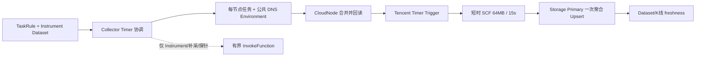

# 采集任务管理

> **当前 SCF 行情架构（2026-08-04）**：实时 K 线已改为腾讯云 Timer Trigger 直接触发。
> Collector 每分钟只协调规则、ActiveInstrumentSet、任务分片和公共 DNS 环境变量；SCF 不回调
> Collector/Admin，也不发布实时 Completion。每个函数独立保存一份环境变量；crypto 每函数最多
> 30 个标的，stock_cn 按发布配置 N、Group 安全容量和完整 4KB 校验决定分片大小，
> 64MB/15s，聚合后一次写 Storage。Instrument 快照、缺口补采、出口探针和人工 E2E 才使用
> `InvokeFunction`。`crypto_market` 和 `stock_cn` 共用 MarketProvider、Fetcher/Spec、InstrumentPipeline
> 和 KlinePipeline，但使用独立 SCF 包和函数集群。设计背景和迁移步骤见
> [SCF 短时行情采集架构](architecture/scf-short-lived-market-fetch.md) 与
> [SCF 定时触发行情采集执行计划](superpowers/plans/2026-08-04-scf-timer-market-fetch.md)。

标准配置发布会按每个启用地域自动创建 1 个 `trigger_type=invoke` 辅助函数，承载这些按需任务；
`custom.toml` 中的 `function_count` 只计算实时 Timer 函数。若只手工创建 Timer 函数，Instrument
快照和缺口补采会明确告警“无 active market fetcher nodes”，不会伪装成已完成。

`moox-collector` 是采集规则、短时 SCF 批次和补采重试的唯一控制面。行情采集不再使用常驻
SCF、CloudNode JobItem 或 SCF 心跳；一次 Timer 函数调用只处理一个有界批次，并在 15 秒内返回。

### Timer 节点与 Invoke 辅助节点

`moox-fetcher-<space>-timer-*` 是实时节点：腾讯 Timer Trigger 到点后直接触发函数，
函数从自身 Environment 读取标的分片并写入 Storage。`moox-fetcher-crypto-market-invoke-*` 和
`moox-fetcher-stock-cn-invoke-*` 是每个启用地域保留 1 个的辅助节点，没有 Timer，不会自动参与每分钟采集，只由
`InvokeFunction` 按需调用。stock_cn 的完整 Instrument 快照也通过该共享 Invoke 节点执行，不能另建
`instrument_fetcher` Timer 函数。

辅助节点用于全量 Instrument 快照、K 线缺口补采、出口探针和人工 E2E。保留地域级辅助节点是为了
让这些任务也能使用对应地域的公网出口；它们不计入 `function_count`，也不会因为闲置而产生
每分钟的 Timer 运行时长。删除辅助节点不会影响实时 Timer K 线，但会使上述按需任务无法执行。

## 服务边界

| 服务 | 默认地址 | 职责 |
| --- | --- | --- |
| `moox-collector` | `127.0.0.1:11402` | Rule、TaskInstance、BatchInvocation、RetryItem 与调度 |
| `moox-cloudnode` | `127.0.0.1:11401` | 云账户、函数包、函数节点、Timer Trigger 和受管环境协调 |
| `moox-storage` | `20200/20201/20202` | Instrument、K 线和最新数据水位的唯一真值 |
| `moox-monitor` | `127.0.0.1:11409` | Dataset freshness、批次诊断和部署检查 |

运行态表仅由 Collector 自己维护：

```text
t_collector_task_rules
t_collector_task_instances
t_collector_fetch_batches
t_collector_fetch_retries
```

删除运行数据后，直接删除 Collector、CloudNode 和 Monitor SQLite 文件并重新初始化。新项目
不迁移旧 `cloud_job_item_id`、旧 JobItem 历史或旧常驻 SCF 状态。

## 短时执行链路



1. 用户创建并启用 Rule。
2. Collector 每分钟扫描启用规则和完整 ActiveInstrumentSet，按固定 N 个 Group 协调；crypto 保持每函数最多 30 个标的，stock_cn 按压测安全容量和 4KB Environment 校验分片。
3. Collector 将任务和 DNS 作为一次受管 Environment Patch 提交 CloudNode；CloudNode 先读取完整
   Environment，合并白名单键，校验 4KB，更新并回读 Tencent 函数和 Trigger。
4. Timer 到点后函数从自身 Environment 读取任务，执行并发行情请求，聚合后只写一次 Storage。
5. `BatchInvocation`、Completion Consumer 和 RetryItem 仅服务 Instrument 快照、缺口补采等有界 Invoke 路径，
   不作为实时 K 线健康真值。
6. Collector 先将有界 Invoke 的 `BatchInvocation` 落库为 `planned`，再异步调用 CloudNode 的
   `InvokeFunction(Event)`；返回的腾讯云 `request_id` 写入批次。
7. 有界 Invoke 的 SCF 按所属 Market Provider 请求、聚合已收盘行并一次写入 Storage Primary；随后才按
   既有 Completion 合同发布事件。实时 Timer 不发布 Completion，也不依赖 EventBus。
8. Completion Consumer 只事务性更新有界 Invoke 的批次、TaskInstance 新鲜度和 RetryItem。
   实时 Timer 的 429、5xx、网络错误和临时 Storage 错误由下一周期与 Gap Audit 覆盖。

`BatchInvocation` 是一次 SCF 调用，`RetryItem` 是失败的单个标的，二者都不是用户配置。
`TaskInstance` 只表达稳定的 `Dataset + Subject + Frequency` 业务任务，不按分钟膨胀。

## 规则

Instrument Rule 必须指定数据源、市场类型和 RECORD Dataset，并且始终从交易所读取全量活跃
标的快照。全量快照不填写 `symbols`：

```json
{
  "data_type": "instrument",
  "provider": "binance",
  "market_type": "spot",
  "collect_params": {
    "symbol_source": "exchange",
    "target_dataset_id": "binance_spot_symbols"
  }
}
```

K 线 Rule 必须关联 Instrument Dataset，标的不再在 K 线 Rule 中重复配置：

```json
{
  "data_type": "kline",
  "provider": "binance",
  "market_type": "spot",
  "collect_params": {
    "symbol_source": "dataset",
    "symbol_dataset_id": "binance_spot_symbols",
    "target_dataset_id": "binance_spot_kline_1m",
    "frequency": "1m"
  }
}
```

`stock_cn` 的 K 线 Rule 使用 `provider=stock_cn_multi`、`market_type=equity`、
`symbol_dataset_id=stock_cn_instruments` 和 `target_dataset_id=stock_cn_kline`。新浪、腾讯、
东方财富分别负责分片中的部分标的，当前 Provider 失败时最多顺序 fallback 一次；所有成功来源
仍写同一个 `stock_cn_kline`，空 `series_tag` 和 `source_provider` 字段保证同一分钟单行幂等。
百度在 Kline 能力正式验证前只保留 shadow，不进入生产候选链。
当前公开分钟接口没有可靠公共游标，历史 Backfill/GapRepair 先限制在最近 24 小时；超出范围的配置在计划阶段
拒绝，避免无效重复请求。接入游标分页并完成覆盖验证后再提高上限。

这两个对象是 `TaskRule` 的内容：外层 `data_type`、`provider`、`market_type` 写入 Rule；只有 `collect_params` 的对象序列化后写入 `TaskRule.collect_params`。不要把外层字段放进 `collect_params`。

### K 线 Resample Rule

`kline_resample` 复用现有 `TaskRule` 和 `TaskInstance`，不新增配置表。数据源选择一个已经生效的
时间序列 Dataset，目标 Dataset 独立保存重采样结果，并在 Dataset ID 末尾带目标周期：

```json
{
  "data_type": "kline_resample",
  "provider": "binance",
  "market_type": "spot",
  "collect_params": {
    "source_dataset_id": "binance_spot_kline_1m",
    "source_frequency": "1m",
    "source_series_tag": "venue:binance",
    "target_dataset_id": "spot_kline_resample_5m",
    "target_frequency": "5m",
    "alignment": "epoch_utc",
    "settle_delay_ms": 10000
  }
}
```

目标周期可以是任意整分钟、整小时或整日周期，但必须是源周期的整数倍。Collector 的独立 1 分钟
`kline_resample.timer` 只负责认领有界任务；读取源 K 线、等待完整窗口、重采样和写目标 Dataset
均在受限 Worker 中完成。实时、修复、历史回填按优先级处理，源窗口不完整时不写部分目标行，
对已变更源窗口按同一个 RowKey 幂等覆盖。

历史回填要求开始时间包含、结束时间不包含且落在目标周期边界。回填完成前 Collector 会追加
`source=catchup` 的 Dataset sync point，并等待目标 View 追上该 fence；因此“任务完成”不只表示
Primary 已写入，也表示查询 View 已可见。源数据保留期由服务端校验，超出保留期的修复不会伪造数据。

实时批次只读取最近 3 根 K 线并过滤未收盘行。Realtime、Backfill 和 GapRepair 使用不同 BatchKind，
通过覆盖区间和 active-task 排他检查避免同一 Subject/分钟并发来源覆盖。长时间缺口由每分钟运行的 Gap Audit 分段补采：
每批 1 个标的、最多 1000 根、每分钟最多 5 批。Storage RowKey Upsert 允许少量重复调用，
不会生成重复 K 线。

## 调度、监控与排障

管理台仍通过 `/api/admin/collectmgr/CreateTaskRule` 创建规则，也可以读取
`GetTaskInstanceList`。Collector timer 是唯一行情执行入口，统一生成短时批次；已没有
`ScheduleTasks` 或旧 JobItem 调度接口。

Monitor 以 Storage 最新数据时间作为实时业务真值；有界 Invoke 可额外消费 Completion 快照用于中文诊断。
短时函数未被调用时没有心跳是正常状态，不能用 `scf:heartbeat` 判定 Fetcher 是否在线。

### A股 1m Canary 与低基数指标

`stock_cn/stock_cn_kline` Canary 使用 `modules/collector/config/markets/stock_cn/calendar.yaml`
识别交易日、交易时段、午休和休市。交易时段内读取最近 3 个已闭合且超过 `settle_delay` 的
分钟桶，要求桶连续存在，`source_provider` 非空，OHLC 为有限正数且满足高低价关系，volume 和
amount 为有限非负数。午休、盘前、盘后及休市日返回 `idle/healthy`，不把预期无数据变成告警；
日历已过期或距离 `coverage_end` 小于 `calendar_warning_lead` 时分别报告
`calendar_expired`、`calendar_expiring`。闭合桶数量、结算延迟、日历预警期和 eligible Kline
Provider 均由 `modules/monitor/config/app.yaml` 配置。

Collector 的市场指标只允许以下低基数维度：`market_id`、`route_id`、`provider_id`、
`feed_kind`、`group_id`、`batch_kind`、`result`。`group_id` 必须位于发布配置 `0..N-1`；
Subject、函数名、公网 IP 和 candidate chain 只能进入 CLS 结构化日志，禁止进入 Prometheus
标签。Instrument 完整快照通过聚合指标记录 `source_provider`、active 数、XSHG/XSHE/XBSE
覆盖和快照时间；函数集群门禁分别记录 expected/actual Group 数，以及 egress probe 的
expected/result/non-empty/distinct 数。监控阈值以发布配置 N、Instrument 最小 active 数、
快照最大年龄和 `measured_safe_group_size` 为准，不在告警代码中复制固定值。

排障按以下顺序进行：

1. 检查 CloudNode 的 Fetcher 节点是否 Active，配置是否为 64MB、15 秒和受管环境变量。
2. 检查 CloudNode 节点详情中的 Timer cron、启用状态、Environment hash 和最近协调时间。
3. 检查对应 SCF CLS 日志中的逐标的耗时、结果和 Storage 写入。
4. 有界补采再检查 `BatchInvocation`、`RetryItem` 和 `MarketFetchBatchCompleted` 事件。
5. 最后检查 Storage 的最新已收盘 K 线与 View。

`moox-cli collector function probe-egress` 会同步调用每个已部署 Fetcher：crypto 检查 Binance，
stock_cn 检查新浪、腾讯和东方财富的连通性。stock_cn 只有在 expected/result/non-empty/distinct
公网 IP 数都等于发布配置 N 后才允许启用 Timer 和业务 Rule；A 股 Provider 按出口 IP 限频，
不设置跨全部函数的 Provider 总请求配额。探针不写 Storage、不发布完成事件。

## 验收

本地执行：

```bash
cd modules/collector
go test -race -count=1 ./internal/marketfetch ./internal/store ./internal/bootstrap ./internal/rpc ./test
```

真实环境依次验证：函数发布配置回读、Timer Trigger 状态、出口探针、全量 Instrument 快照的真实
Storage 数据、连续三轮 K 线 freshness。实时验收证据使用函数名、Timer event 时间、CLS
逐标的结果和 Storage watermark；有界补采另行使用 `batch_id`、CloudNode `request_id`、
Completion 和 RetryItem，不再使用 `cloud_job_item_id` 或 JobItem 终态。
