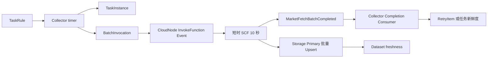

# 采集任务管理

`moox-collector` 是采集规则、短时 SCF 批次和补采重试的唯一控制面。行情采集不再使用常驻
SCF、CloudNode JobItem 或 SCF 心跳；一次函数调用只处理一个有界批次，并在 10 秒内返回。

## 服务边界

| 服务 | 默认地址 | 职责 |
| --- | --- | --- |
| `moox-collector` | `127.0.0.1:11402` | Rule、TaskInstance、BatchInvocation、RetryItem 与调度 |
| `moox-cloudnode` | `127.0.0.1:11401` | 云账户、函数包、函数节点和 `InvokeFunction(Event)` |
| `moox-storage` | `20200/20201/20202` | Symbol、K 线和最新数据水位的唯一真值 |
| `moox-monitor` | `127.0.0.1:11409` | Dataset freshness、批次诊断和部署检查 |

运行态表仅由 Collector 自己维护：

```text
t_collector_task_rules
t_collector_task_instances
t_collector_fetch_batches
t_collector_fetch_retries
```

删除运行数据后，直接删除 Collector、CloudNode 和 Monitor SQLite 文件并重新初始化。新项目
不迁移旧 `cloud_job_item_id`、旧 JobItem 历史或旧常驻 SCF 状态。

## 短时执行链路



1. 用户创建并启用 Rule。
2. Collector timer 每 10 秒扫描；同一周期只生成一个稳定 `schedule_id`，每个批次最多 10 个标的。
3. Collector 先将 `BatchInvocation` 落库为 `planned`，再异步调用 CloudNode 的
   `InvokeFunction(Event)`；返回的腾讯云 `request_id` 写入批次。
4. SCF 只请求 Binance、聚合已收盘行并一次写入 Storage Primary；然后发布一个
   `MarketFetchBatchCompleted` EventBus 事件。
5. Completion Consumer 事务性更新批次、TaskInstance 新鲜度和 RetryItem。没有完成事件的
   批次到期后由 Collector 回收；429、5xx、网络错误和临时 Storage 错误使用 5 秒、30 秒、2 分钟重试。

`BatchInvocation` 是一次 SCF 调用，`RetryItem` 是失败的单个标的，二者都不是用户配置。
`TaskInstance` 只表达稳定的 `Dataset + Subject + Frequency` 业务任务，不按分钟膨胀。

## 规则

Symbol Rule 必须使用手动标的清单、数据源、市场类型和 RECORD Dataset。首版每条规则最多
20 个标的：

```json
{
  "data_type": "symbol",
  "provider": "binance",
  "market_type": "spot",
  "collect_params": {
    "symbol_source": "manual",
    "symbols": ["BTC-USDT", "ETH-USDT"],
    "target_dataset_id": "binance_spot_symbols"
  }
}
```

K 线 Rule 必须关联 Symbol Dataset，标的不再在 K 线 Rule 中重复配置：

```json
{
  "data_type": "kline",
  "provider": "binance",
  "market_type": "spot",
  "collect_params": {
    "symbol_source": "dataset",
    "symbol_dataset_id": "binance_spot_symbols",
    "target_dataset_id": "binance_spot_kline_1m",
    "frequency": "1m"
  }
}
```

这两个对象是 `TaskRule` 的内容：外层 `data_type`、`provider`、`market_type` 写入 Rule；只有 `collect_params` 的对象序列化后写入 `TaskRule.collect_params`。不要把外层字段放进 `collect_params`。

实时批次只读取最近 3 根 K 线并过滤未收盘行。长时间缺口由每分钟运行的 Gap Audit 分段补采：
每批 1 个标的、最多 1000 根、每分钟最多 5 批。Storage RowKey Upsert 允许少量重复调用，
不会生成重复 K 线。

## 调度、监控与排障

管理台仍通过 `/api/admin/collectmgr/CreateTaskRule` 创建规则，也可以读取
`GetTaskInstanceList`。Collector timer 是唯一行情执行入口，统一生成短时批次；已没有
`ScheduleTasks` 或旧 JobItem 调度接口。

Monitor 以 Storage 最新数据时间作为业务真值，并消费最后一条 Completion 快照用于中文诊断。
短时函数未被调用时没有心跳是正常状态，不能用 `scf:heartbeat` 判定 Fetcher 是否在线。

排障按以下顺序进行：

1. 检查 CloudNode 的 Fetcher 节点是否 Active，配置是否为 64MB、10 秒和受管环境变量。
2. 检查 Collector 的 `BatchInvocation`：`batch_id`、`request_id`、状态和错误摘要。
3. 检查对应 SCF CLS 日志与 `MarketFetchBatchCompleted` 事件。
4. 检查 `RetryItem` 是否 pending 或 dispatched。
5. 最后检查 Storage 的最新已收盘 K 线与 View。

`moox-cli collector function probe-egress` 会同步调用每个已部署 Fetcher：Binance 连通性是通过
条件，公网 IP 反射结果仅作为出口分布记录。它不写 Storage、不发布完成事件。

## 验收

本地执行：

```bash
cd modules/collector
go test -race -count=1 ./internal/marketfetch ./internal/store ./internal/bootstrap ./internal/rpc ./test
```

真实环境依次验证：函数发布配置回读、出口探针、10 个 Symbol 的真实 Storage 数据、
Completion 状态和 Dataset freshness。验收证据使用 `batch_id`、CloudNode `request_id`、
Completion、RetryItem 和 Storage watermark；不再使用 `cloud_job_item_id` 或 JobItem 终态。
