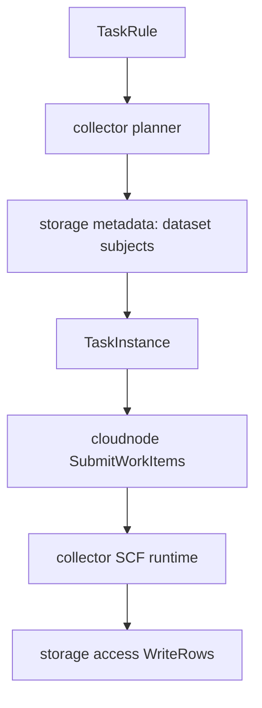

# 采集任务管理

采集任务管理已经从 admin 拆分为独立 `moox-collector` 服务，代码位于 `modules/collector`。

admin 只负责：

- 管理台登录态鉴权。
- `/api/admin/collectmgr/*` 网关转发。
- `/api/service/collectmgr/*` 后台服务鉴权和转发。
- 在 `t_service_deployments` 中维护 `moox_collector` 的部署地址。

admin 不再拥有采集规则、任务实例或执行日志的业务表和实现。

## 独立服务

| 服务 | 模块 | 默认地址 | 说明 |
| --- | --- | --- | --- |
| `moox-collector` | `modules/collector` | `127.0.0.1:11402` | 采集规则、任务实例、planner、任务状态上报 |
| `moox-cloudnode` | `modules/cloudnode` | `127.0.0.1:11401` | 采集 work_item 下发到 SCF 云节点 |
| `moox-storage` | `modules/storage` | `20200/20201/20202` | 元数据读取、K 线写入、视图查询 |

## 数据表归属

`modules/collector/schema/collector.sql` 拥有：

```text
t_collector_task_rules
t_collector_task_instances
t_collector_execution_logs
```

这些表不属于 `modules/admin/schema/admin.sql`，也不写入 `data/admin.db`。

部署后默认数据库路径为：

```text
<data-dir>/collector/moox_collector.db
```

## 规则到任务实例

当前核心路径是 dataset-driven 采集：

1. 用户在管理台创建采集规则。
2. 管理台请求 `/api/admin/collectmgr/CreateTaskRule`。
3. 请求体按 proto 结构包装为 `{ "rule": { ... } }`；更新规则时使用 `{ "rule_id": "...", "rule": { ... } }`。
4. admin 网关转发到 `moox-collector`。
5. `moox-collector` planner 从 storage metadata 读取 dataset subjects。
6. planner 为每个 subject 生成或更新 task instance。
7. collector 将待执行任务提交给 `moox-cloudnode`。
8. SCF runtime 执行采集 workload，并写入 storage access。



## 网关路径

管理台请求：

```text
/api/admin/collectmgr/GetTaskRuleList
/api/admin/collectmgr/CreateTaskRule
/api/admin/collectmgr/RecalculateAllTaskInstances
/api/admin/collectmgr/GetTaskInstanceList
```

后台/SCF 请求：

```text
/api/service/cloudnode/PollWorkItems
/api/service/cloudnode/ReportWorkItemStatus
/api/service/collectmgr/ReportTaskStatus
```

其中 `PollWorkItems` / `ReportWorkItemStatus` 维护 CloudNode work_item 租约和执行结果，`ReportTaskStatus` 维护 collector 任务实例状态。

`task_instance` 不作为 seed 数据或手工 CRUD 数据维护。当前重建路径是先通过 `CreateTaskRule` 创建规则，再调用 `RecalculateAllTaskInstances` 由 planner 根据 dataset subjects 生成或更新任务实例。

## 当前 Binance K 线规则

示例规则使用 `binance_spot_kline` dataset 的 subjects 生成现货 K 线任务实例：

```json
{
  "source": {"kind": "dataset_subjects", "dataset_id": "binance_spot_kline"},
  "collector": {"exchange": "binance", "market": "spot", "data_type": "kline", "intervals": ["1m"]},
  "target": {"dataset_id": "binance_spot_kline", "workload_type": "collector.binance.spot.kline"},
  "schedule": {"interval": "30m", "timezone": "Asia/Shanghai"}
}
```

## 与 SCF 的关系

SCF runtime 不直接读取 collector 数据库。它通过 CloudNode work_item 协议获取任务，并通过后台网关回报任务状态。storage 写入走直连 storage access，以降低转发流量和延迟。
