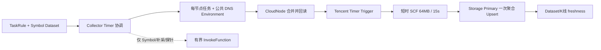

# 采集任务管理

> **当前 SCF 行情架构（2026-08-04）**：实时 K 线已改为腾讯云 Timer Trigger 直接触发。
> Collector 每分钟只协调规则、Symbol Dataset、任务分片和公共 DNS 环境变量；SCF 不回调
> Collector/Admin，也不发布实时 Completion。每个函数独立保存一份环境变量，最多 30 个标的，
> 64MB/15s，聚合后一次写 Storage。Symbol 快照、缺口补采、出口探针和人工 E2E 才使用
> `InvokeFunction`。设计背景和迁移步骤见
> [SCF 短时行情采集架构](architecture/scf-short-lived-market-fetch.md) 与
> [SCF 定时触发行情采集执行计划](superpowers/plans/2026-08-04-scf-timer-market-fetch.md)。

标准配置发布会按每个启用地域自动创建 1 个 `trigger_type=invoke` 辅助函数，承载这些按需任务；
`custom.toml` 中的 `function_count` 只计算实时 Timer 函数。若只手工创建 Timer 函数，Symbol
快照和缺口补采会明确告警“无 active market fetcher nodes”，不会伪装成已完成。

`moox-collector` 是采集规则、短时 SCF 批次和补采重试的唯一控制面。行情采集不再使用常驻
SCF、CloudNode JobItem 或 SCF 心跳；一次 Timer 函数调用只处理一个有界批次，并在 15 秒内返回。

## 服务边界

| 服务 | 默认地址 | 职责 |
| --- | --- | --- |
| `moox-collector` | `127.0.0.1:11402` | Rule、TaskInstance、BatchInvocation、RetryItem 与调度 |
| `moox-cloudnode` | `127.0.0.1:11401` | 云账户、函数包、函数节点、Timer Trigger 和受管环境协调 |
| `moox-storage` | `20200/20201/20202` | Symbol、K 线和最新数据水位的唯一真值 |
| `moox-monitor` | `127.0.0.1:11409` | Dataset freshness、批次诊断和部署检查 |

运行态表仅由 Collector 自己维护：

```text
t_collector_task_rules
t_collector_task_instances
t_collector_fetch_batches
t_collector_fetch_retries
```

删除运行数据后，直接删除 Collector、CloudNode 和 Monitor SQLite 文件并重新初始化。新项目
不迁移旧 `cloud_job_item_id`、旧 JobItem 历史或旧常驻 SCF 状态。

## 短时执行链路



1. 用户创建并启用 Rule。
2. Collector 每分钟扫描启用规则和完整 Symbol Dataset，按节点稳定分片，每函数最多 30 个标的。
3. Collector 将任务和 DNS 作为一次受管 Environment Patch 提交 CloudNode；CloudNode 先读取完整
   Environment，合并白名单键，校验 4KB，更新并回读 Tencent 函数和 Trigger。
4. Timer 到点后函数从自身 Environment 读取任务，执行并发行情请求，聚合后只写一次 Storage。
5. `BatchInvocation`、Completion Consumer 和 RetryItem 仅服务 Symbol 快照、缺口补采等有界 Invoke 路径，
   不作为实时 K 线健康真值。
6. Collector 先将有界 Invoke 的 `BatchInvocation` 落库为 `planned`，再异步调用 CloudNode 的
   `InvokeFunction(Event)`；返回的腾讯云 `request_id` 写入批次。
7. 有界 Invoke 的 SCF 只请求 Binance、聚合已收盘行并一次写入 Storage Primary；随后才按
   既有 Completion 合同发布事件。实时 Timer 不发布 Completion，也不依赖 EventBus。
8. Completion Consumer 只事务性更新有界 Invoke 的批次、TaskInstance 新鲜度和 RetryItem。
   实时 Timer 的 429、5xx、网络错误和临时 Storage 错误由下一周期与 Gap Audit 覆盖。

`BatchInvocation` 是一次 SCF 调用，`RetryItem` 是失败的单个标的，二者都不是用户配置。
`TaskInstance` 只表达稳定的 `Dataset + Subject + Frequency` 业务任务，不按分钟膨胀。

## 规则

Symbol Rule 必须指定数据源、市场类型和 RECORD Dataset，并且始终从交易所读取全量活跃
标的快照。全量快照不填写 `symbols`：

```json
{
  "data_type": "symbol",
  "provider": "binance",
  "market_type": "spot",
  "collect_params": {
    "symbol_source": "exchange",
    "target_dataset_id": "binance_spot_symbols"
  }
}
```

K 线 Rule 必须关联 Symbol Dataset，标的不再在 K 线 Rule 中重复配置：

```json
{
  "data_type": "kline",
  "provider": "binance",
  "market_type": "spot",
  "collect_params": {
    "symbol_source": "dataset",
    "symbol_dataset_id": "binance_spot_symbols",
    "target_dataset_id": "binance_spot_kline_1m",
    "frequency": "1m"
  }
}
```

这两个对象是 `TaskRule` 的内容：外层 `data_type`、`provider`、`market_type` 写入 Rule；只有 `collect_params` 的对象序列化后写入 `TaskRule.collect_params`。不要把外层字段放进 `collect_params`。

实时批次只读取最近 3 根 K 线并过滤未收盘行。长时间缺口由每分钟运行的 Gap Audit 分段补采：
每批 1 个标的、最多 1000 根、每分钟最多 5 批。Storage RowKey Upsert 允许少量重复调用，
不会生成重复 K 线。

## 调度、监控与排障

管理台仍通过 `/api/admin/collectmgr/CreateTaskRule` 创建规则，也可以读取
`GetTaskInstanceList`。Collector timer 是唯一行情执行入口，统一生成短时批次；已没有
`ScheduleTasks` 或旧 JobItem 调度接口。

Monitor 以 Storage 最新数据时间作为实时业务真值；有界 Invoke 可额外消费 Completion 快照用于中文诊断。
短时函数未被调用时没有心跳是正常状态，不能用 `scf:heartbeat` 判定 Fetcher 是否在线。

排障按以下顺序进行：

1. 检查 CloudNode 的 Fetcher 节点是否 Active，配置是否为 64MB、15 秒和受管环境变量。
2. 检查 CloudNode 节点详情中的 Timer cron、启用状态、Environment hash 和最近协调时间。
3. 检查对应 SCF CLS 日志中的逐标的耗时、结果和 Storage 写入。
4. 有界补采再检查 `BatchInvocation`、`RetryItem` 和 `MarketFetchBatchCompleted` 事件。
5. 最后检查 Storage 的最新已收盘 K 线与 View。

`moox-cli collector function probe-egress` 会同步调用每个已部署 Fetcher：Binance 连通性是通过
条件，公网 IP 反射结果仅作为出口分布记录。它不写 Storage、不发布完成事件。

## 验收

本地执行：

```bash
cd modules/collector
go test -race -count=1 ./internal/marketfetch ./internal/store ./internal/bootstrap ./internal/rpc ./test
```

真实环境依次验证：函数发布配置回读、Timer Trigger 状态、出口探针、全量 Symbol 快照的真实
Storage 数据、连续三轮 K 线 freshness。实时验收证据使用函数名、Timer event 时间、CLS
逐标的结果和 Storage watermark；有界补采另行使用 `batch_id`、CloudNode `request_id`、
Completion 和 RetryItem，不再使用 `cloud_job_item_id` 或 JobItem 终态。
