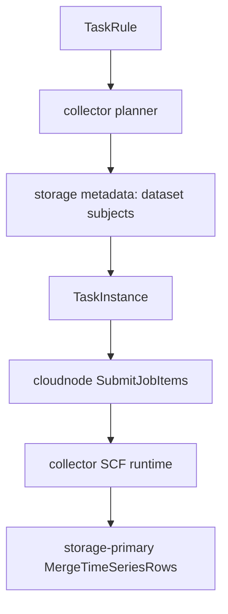

# 采集任务管理

采集任务管理已经从 admin 拆分为独立 `moox-collector` 服务，代码位于 `modules/collector`。

> 本文描述当前已经实现的 Collector 控制面和 SCF 执行链路。多 Provider 聚合、`stock_cn` 等 Market Module、来源数据集、统一数据集、完整性补洞和内置市场初始化属于目标架构，见 [内置市场行情采集架构](内置市场行情采集架构.md)；在对应代码落地前，不应把目标设计当作当前运行能力。

admin 只负责：

- 管理台登录态鉴权。
- `/api/admin/collectmgr/*` 网关转发。
- `/api/service/collectmgr/*` 后台服务鉴权和转发。
- 在 `t_service_deployments` 中维护 `moox_collector` 的部署地址。

admin 不再拥有采集规则或任务实例的业务表和实现；采集执行日志由 SCF/CLS 承载。

## 独立服务

| 服务 | 模块 | 默认地址 | 说明 |
| --- | --- | --- | --- |
| `moox-collector` | `modules/collector` | `127.0.0.1:11402` | 采集规则、任务实例、planner、任务状态上报 |
| `moox-cloudnode` | `modules/cloudnode` | `127.0.0.1:11401` | 采集 JobItem 下发到 SCF 云节点 |
| `moox-storage` | `modules/storage` | `20200/20201/20202` | 元数据读取、K 线写入、视图查询 |

## 数据表归属

`modules/collector/schema/collector.sql` 拥有：

```text
t_collector_task_rules
t_collector_task_instances
```

这些表不属于 `modules/admin/schema/admin.sql`，也不写入 `data/admin.db`。

部署后默认数据库路径为：

```text
<data-dir>/collector/moox_collector.db
```

服务启动不创建表。部署或本地重建时，先执行：

```bash
moox-collector-cli init --db-path <data-dir>/collector/moox_collector.db
```

## 规则到任务实例

当前核心路径是 dataset-driven 采集：

1. 用户在管理台创建采集规则。
2. 管理台请求 `/api/admin/collectmgr/CreateTaskRule`。
3. 请求体按 proto 结构包装为 `{ "rule": { ... } }`；更新规则时使用 `{ "rule_id": "...", "rule": { ... } }`。
4. admin 网关转发到 `moox-collector`。
5. `moox-collector` planner 从 storage metadata 读取 dataset subjects。
6. planner 为每个 subject 生成或更新 task instance。
7. collector 将待执行任务提交给 `moox-cloudnode`。
8. collector 通过 `InvokeFunction` 唤醒 SCF runtime。
9. SCF runtime 拉取 JobItem，执行采集 workload，并写入 storage metadata/access。



## 当前 JobItem 模型

采集执行模型已收敛为 Job / JobItem：

```text
TaskRule
  -> collector jobs/* planner 生成 Job
  -> Job 拆成多个 JobItem
  -> CloudNode 派发 JobItem
  -> CloudRuntime 按 job_type 调用 handler
  -> handler 写 Storage
```

Collector 下的具体采集任务按子目录组织：

```text
modules/collector/internal/jobs/
  registry.go
  kline/
    params.go
    planner.go
    handler.go
    result.go
  symbol/
    params.go
    planner.go
    handler.go
    result.go
```

`planner.go` 负责把规则拆成 JobItem；`handler.go` 负责执行一个 JobItem、写入 Storage，并返回执行摘要。`sources/` 只保留交易所 API 和底层采集能力。

JobItem 字段目标：

```text
job_id          一次采集作业
job_item_id     最小执行单元，同时作为幂等键
job_type        handler 注册键，例如 collect.kline
code_package_id 目标代码包 ID
params          handler 输入参数
```

CloudNode 只保存 JobItem 状态、attempt、错误和执行摘要，不保存 K 线、标的等业务数据。

Collector 协议中的 `collect_params`、`task_params` 和执行 `result` 使用 `google.protobuf.Struct`，便于不同采集任务在同一协议中传递结构化参数。`ReportTaskStatus` 使用 `task_id` 上报任务实例状态；`is_deleted` 在协议层是 bool，SQLite 中以 INTEGER 存储 bool 语义。

## 网关路径

管理台请求：

```text
/api/admin/collectmgr/GetTaskRuleList
/api/admin/collectmgr/CreateTaskRule
/api/admin/collectmgr/RecalculateAllTaskInstances
/api/admin/collectmgr/GetTaskInstanceList
```

后台/SCF 请求：

```text
/api/service/cloudnode/SubmitJobItems
/api/service/cloudnode/InvokeFunction
/api/service/cloudnode/PollJobItems
/api/service/cloudnode/ReportJobItemStatus
/api/service/collectmgr/ReportTaskStatus
```

其中 `SubmitJobItems` 由 collector 控制面调用，用于提交采集 JobItem；`InvokeFunction` 用于部署后或调度时唤醒 SCF；`PollJobItems` / `ReportJobItemStatus` 维护 CloudNode JobItem 执行状态和结果；`ReportTaskStatus` 维护 collector 任务实例状态。

唤醒 SCF 时，collector 从 `t_service_deployments` 获取 active 服务信息，并在 keepalive event 中下发：

```text
service_gateway_target
storage_metadata_target
storage_primary_target
```

SCF runtime 使用 `service_gateway_target` 访问 `/api/service/*` 后台网关，使用 storage target 直连 storage tRPC。

`task_instance` 不作为 seed 数据或手工 CRUD 数据维护。当前重建路径是先通过 `CreateTaskRule` 创建规则，再调用 `RecalculateAllTaskInstances` 由 planner 根据 dataset subjects 生成或更新任务实例。

## 当前 Binance K 线规则

示例规则使用 `binance_spot_kline` dataset 的 subjects 生成现货 K 线任务实例：

```json
{
  "source": {"kind": "dataset_subjects", "dataset_id": "binance_spot_kline"},
  "collector": {"exchange": "binance", "market": "spot", "data_type": "kline", "intervals": ["1m"]},
  "target": {"dataset_id": "binance_spot_kline", "job_type": "collect.kline", "code_package_id": "moox-collector_dev"},
  "schedule": {"interval": "1m", "timezone": "Asia/Shanghai"}
}
```

## 目标 Market Module 边界

Collector 后续从“用户选择交易所适配器”演进为“用户选择逻辑市场”：

```text
stock_cn
stock_us
crypto_binance
crypto_okx
```

用户规则只表达 `market_id`、Feed、Instrument Type、频率和历史范围。Market Module 在内部选择 Provider、生成分片、写来源数据集、执行质量裁决，并把业务统一读取的数据写入统一数据集。

目标模型中：

- `exchange_id` 只表示 `SSE`、`SZSE`、`BINANCE` 等实际交易场所。
- `provider_id` 表示 TDX、腾讯、凤凰、Binance REST 等获取接口。
- `product_type` 表示 `spot`、`swap`、`future` 等产品分段。
- Provider 不进入逻辑 TaskInstance 的稳定 ID，只记录在具体执行 Attempt。
- `stock_cn.kline` 等查询接口只读 Storage 统一数据集，不在查询链路调用外部 Provider。

完整目标架构、Dataset 布局、质量裁决和 `moox-cli init` 约定见 [内置市场行情采集架构](内置市场行情采集架构.md)。

## 与 SCF 的关系

SCF runtime 不直接读取 collector 数据库。它通过 CloudNode JobItem 协议获取任务，并通过后台网关回报任务状态。storage 写入走直连 storage metadata/access tRPC，以降低转发流量和延迟。

当前实现由一个 SCF runtime 按 keepalive 事件指定的 Space 轮询并执行任务。目标架构继续保留这条执行链路，但明确以下边界：

- `moox-collector` 控制面负责 Market Registry、Provider 路由、覆盖率巡检、全局限频和 JobItem 分片。
- SCF 只执行一个有时间、页数和行数上限的分片，不在本地保存游标或全局状态。
- 所有内置市场复用同一套 Collector SCF 代码包，但 `stock_cn`、`stock_us`、`crypto_binance`、`crypto_okx` 分别部署函数，并通过 `MOOX_SPACE_ID` 固定 Space。
- 单个 JobItem 目标执行 20 到 30 秒；达到预算后返回 `continuation_cursor`，由控制面创建后续任务。
- 查询接口只读 Storage，`moox-cli init` 在部署阶段初始化元数据，两者都不在 SCF 内执行。

当前 SCF keepalive 执行窗口为 45 秒。目标实现必须至少预留 10 秒用于来源数据集、统一数据集的幂等写入和任务状态上报，不能把全市场采集作为一个 JobItem 执行。
