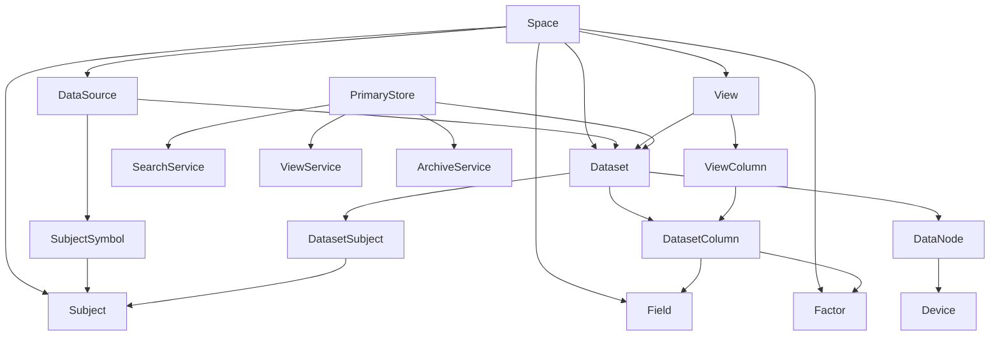

# 量化金融数据系统概念说明

本文是当前 moox 量化数据系统的概念索引。详细设计以以下文档为准：

- `存储概念与设计意图.md`
- `存储目标架构与元数据.md`
- `协议设计.md`

## 一句话模型

```text
Space 里管理 DataSource、Subject、Field、Factor、Dataset 和 View。
用户按 Dataset 写入与读取事实数据，按 View 查询异步物化后的组合结果。
Pebble 是在线事实主存，DuckDB、Bleve、Parquet 从 Pebble 变更派生。
所有数据访问都先进入 PrimaryStore Service，再由 PrimaryStore 转发到内部执行服务。
每个 Dataset 直接绑定一个 DataNode；Primary 只从 Metadata Snapshot 解析
`data_node_id -> service_target`。目标 Schema v6 不保留独立拓扑表、路由 seed 或
在线迁移；TimeSeries 行身份额外包含一个不透明 scalar `series_tag`。
```

## 概念关系



## 核心概念

| 概念 | 含义 |
| --- | --- |
| `Space` | 业务命名空间。本文所有“全局”均指 Space 内全局。 |
| `DataSource` | 数据来源，例如交易所、供应商 API、文件导入、内部计算。 |
| `Subject` | Space 内业务对象，例如交易标的、榜单、新闻源、账户。 |
| `SubjectSymbol` | Subject 在某个 DataSource 下的外部代码映射。 |
| `Dataset` | 可写事实数据集，并且只绑定一个 DataSource。 |
| `DatasetSubject` | Dataset 的对象池，用于采集范围和查询范围。 |
| `Field` | Space 内普通字段字典。 |
| `Factor` | Space 内、已参数化的因子结果定义。 |
| `DatasetColumn` | Dataset 下允许写入的列，可来自 Field、Factor 或系统列。 |
| `View` | 查询入口和异步物化结果定义。 |
| `ViewColumn` | View 对用户暴露的列。 |
| `PrimaryStore` | 唯一公开数据访问入口，负责校验、元数据解释和请求转发。 |
| `DataNode` | 由部署注册的事实存储 Owner，保存 `service_target` 和状态，可承载多个 Dataset。 |
| `Device` | 底层具体存储组件，例如 Pebble、DuckDB、Bleve、Parquet。 |

## 读写边界

- 写入事实数据：使用 `PrimaryStore.UpsertFields`，入口是 `Dataset`。
- 读取事实数据：使用 `PrimaryStore.ReadTimeSeriesRows` 或 `PrimaryStore.ReadRecordRows`，入口是 `Dataset`。
- 组合分析查询：使用 `ViewService.QueryTimeSeriesRows`，入口是已经登记并构建的 `View`。
- 文本检索：使用 `ViewService.SearchRecordRows`，入口是已经登记并构建的 Record View。

系统不在线生成临时组合查询计划。调用方请求不存在的组合时，返回 `VIEW_NOT_FOUND`。

PrimaryStore 读写接口沿 `Dataset.data_node_id -> DataNode.service_target` 直接访问所属 DataNode。
`SearchRecordRows` 查询 Search Service 中的集中式索引，不在 Dataset 之间 fan-out。
`QueryTimeSeriesRows` 查询 View Service 中的物化结果。Dataset 创建为 disabled，Doctor
执行只读激活检查，调用方显式激活后状态变为 active 且绑定锁定。

## 存储职责

| 组件 | 职责 |
| --- | --- |
| PrimaryStore Service / Pebble | 在线事实主存，支持低延迟写入和按 key 范围扫描。 |
| View Service / DuckDB | TimeSeries View 的近期版本化物化查询结果。 |
| Search Service / Bleve | Record View 的版本化全文索引，索引字段由 ViewColumn 决定。 |
| Archive Service / Parquet | 从 Pebble 事实主存归档生成冷备文件。 |
| SQLite | 元数据控制面。 |
