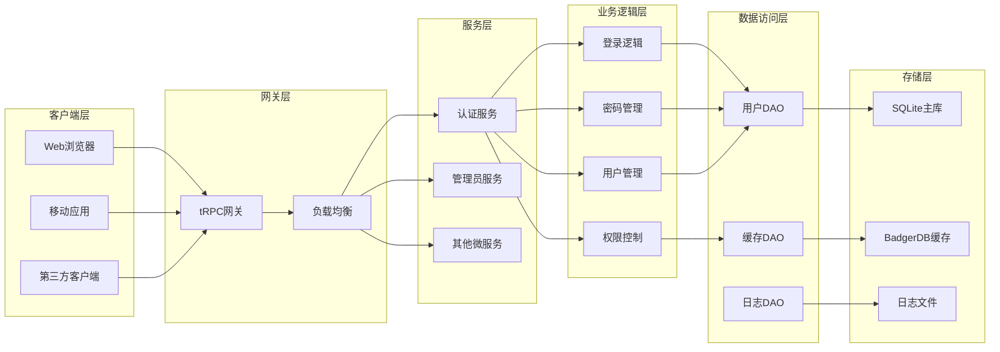
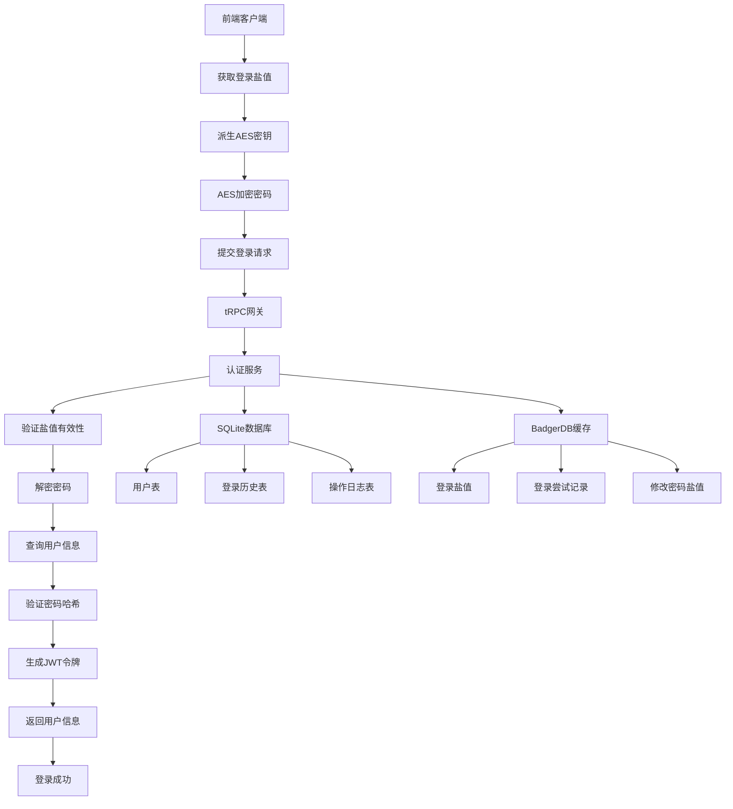
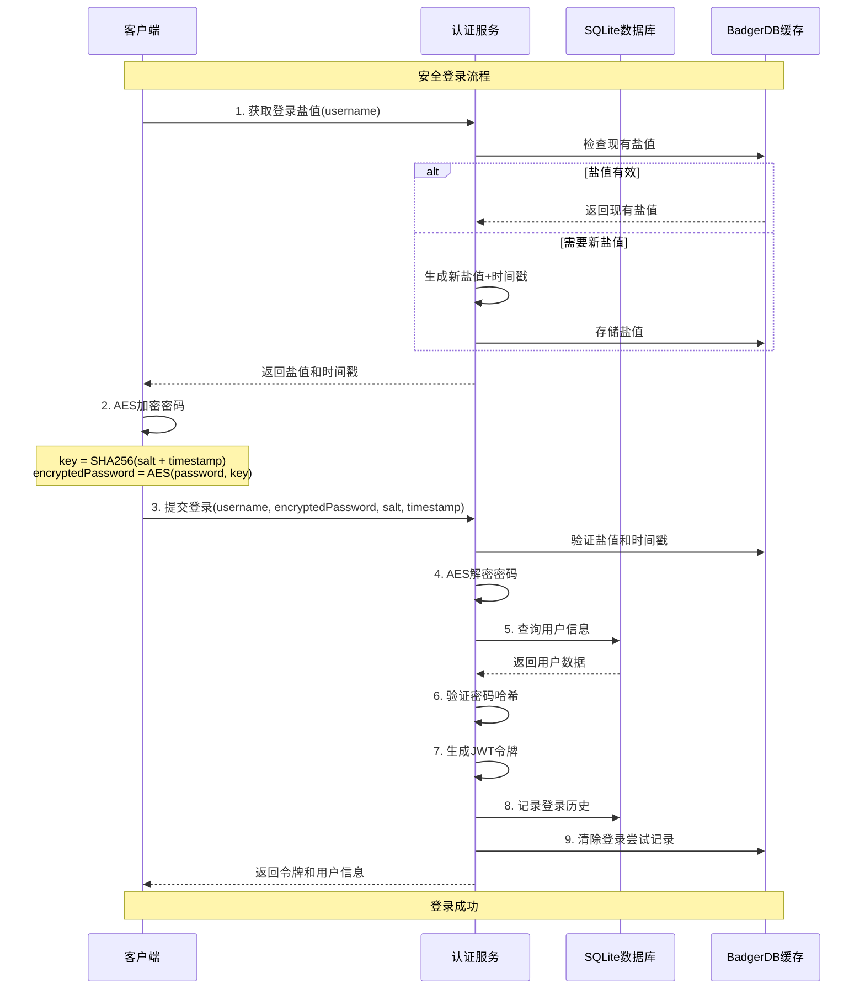

# Moox 服务集群

## 概述

基于 tRPC-Go 的微服务集群，提供认证、管理员等核心服务功能。

## 📁 目录结构

```
internal/service/
├── auth/                    # 认证服务
│   ├── config/             # 配置管理
│   │   └── config.go
│   ├── dao/                # 数据访问层
│   │   ├── badger.go       # BadgerDB缓存封装
│   │   └── user.go         # 用户数据访问
│   ├── logic/              # 业务逻辑层
│   │   ├── init.go         # 服务初始化
│   │   ├── login.go        # 登录相关
│   │   ├── password.go     # 密码相关
│   │   ├── user.go         # 用户信息相关
│   │   └── helper.go       # 辅助方法
│   ├── model/              # 数据模型
│   │   └── user.go         # 用户模型定义
│   ├── util/               # 工具函数
│   │   └── crypto.go       # 加密工具
│   └── interface.go        # 服务接口定义
├── admin/                  # 管理员服务
│   ├── config/
│   ├── logic/
│   └── interface.go
└── README.md
```

## 🔐 认证服务特性

### 安全架构

- 🔐 **双步安全登录**：盐值+AES对称加密
- 🛡️ **登录限制**：防暴力破解，账户锁定机制
- 🔑 **JWT令牌管理**：安全的用户会话控制
- 📊 **SQLite数据库**：轻量级持久化存储
- ⚡ **BadgerDB缓存**：高性能数据缓存
- 📝 **完整审计**：登录历史、操作日志
- 🏗️ **分层架构**：interface-logic-dao清晰分离

### 密码传输安全

系统使用 **AES-GCM 对称加密** 确保密码传输安全：

1. **客户端加密流程**：
   ```
   salt + timestamp → 派生AES密钥 → AES加密密码 → 发送到服务端
   ```

2. **服务端解密流程**：
   ```
   接收加密密码 → 使用相同salt+timestamp派生密钥 → AES解密 → 验证密码
   ```

### 登录安全机制

- **失败次数限制**：支持配置最大登录尝试次数（默认5次）
- **账户锁定**：超过限制后自动锁定账户（默认30分钟）
- **盐值时效性**：动态盐值有过期时间（默认5分钟）
- **IP 跟踪**：记录登录 IP 和设备信息
- **JWT 令牌**：使用 JWT 进行会话管理

## 🚀 快速开始

### 1. 安装依赖

```bash
cd src/github.com/mooyang-code/moox/server
go mod tidy
```

核心依赖：

```go
require (
    github.com/golang-jwt/jwt/v5 v5.0.0
    github.com/google/uuid v1.3.0
    github.com/dgraph-io/badger/v4 v4.2.0
    gorm.io/gorm v1.25.0
    gorm.io/driver/sqlite v1.5.0
    trpc.group/trpc-go/trpc-go latest
)
```

### 2. 配置文件

```yaml
# 认证服务配置
auth:
  database:
    db_name: "auth.db"
  
  cache:
    data_dir: "./cache"
    password: ""
    db: 0
  
  jwt:
    secret_key: "your-secret-key-here"
    access_expired: "24h"
  
  security:
    salt_expired: "5m"      # 盐值有效期
    max_login_attempt: 5    # 最大登录尝试次数
    lock_duration: "30m"    # 账户锁定时间

# 管理员服务配置
admin:
  database:
    db_name: "admin.db"
  
  cache:
    data_dir: "./admin_cache"
    password: ""
    db: 1
  
  jwt:
    secret_key: "your-admin-secret-key"
    access_expired: "8h"
```

### 3. 使用示例

```go
package main

import (
    "github.com/mooyang-code/moox/server/internal/service/auth"
    "github.com/mooyang-code/moox/server/internal/service/auth/config"
    "github.com/mooyang-code/moox/server/internal/service/admin"
    adminconfig "github.com/mooyang-code/moox/server/internal/service/admin/config"
)

func main() {
    // 创建认证服务
    authCfg := &config.Config{
        // ... 配置参数
    }
    authService, err := auth.NewAuthService(authCfg)
    if err != nil {
        log.Fatal(err)
    }
    
    // 创建管理员服务
    adminCfg := &adminconfig.Config{
        // ... 配置参数
    }
    adminService, err := admin.NewAdminService(adminCfg)
    if err != nil {
        log.Fatal(err)
    }
    
    // 注册 tRPC 服务
    // server.RegisterAuthAPI(authService)
    // server.RegisterAdminAPI(adminService)
}
```

## 🔌 API 接口

### 认证服务接口 (AuthAPI)

#### 1. 获取登录盐值
```
POST /api/auth/get_login_salt
Content-Type: application/json

{
  "username": "user123"
}

Response:
{
  "code": 0,
  "message": "获取盐值成功",
  "salt": "random_salt",
  "timestamp": 1234567890,
  "expiresIn": 300
}
```

#### 2. 用户登录
```
POST /api/auth/login
Content-Type: application/json

{
  "username": "user123",
  "passwordHash": "encrypted_password",
  "salt": "salt_from_step1",
  "timestamp": 1234567890,
  "clientIp": "192.168.1.100",
  "userAgent": "Mozilla/5.0...",
  "deviceId": "web_abc123"
}

Response:
{
  "code": 0,
  "message": "登录成功",
  "accessToken": "jwt_token",
  "expiresIn": 86400,
  "userInfo": {
    "userId": "uuid",
    "username": "user123",
    "nickname": "用户昵称",
    "email": "user@example.com",
    "avatar": "avatar_url",
    "status": 1,
    "role": 2,
    "createdAt": 1234567890,
    "lastLoginAt": 1234567890,
    "lastLoginIp": "192.168.1.100"
  }
}
```

#### 3. 获取修改密码盐值
```
POST /api/auth/get_change_password_salt
Content-Type: application/json

{
  "accessToken": "jwt_token"
}
```

#### 4. 修改密码
```
POST /api/auth/change_password
Content-Type: application/json

{
  "accessToken": "jwt_token",
  "oldPasswordHash": "encrypted_old_password",
  "newPasswordHash": "encrypted_new_password",
  "salt": "salt_from_step3",
  "timestamp": 1234567890
}
```

#### 5. 获取用户信息
```
POST /api/auth/get_user_info
Content-Type: application/json

{
  "accessToken": "jwt_token",
  "userId": "optional_user_id"  // 管理员可查询其他用户
}
```

#### 6. 更新用户信息
```
POST /api/auth/update_user_info
Content-Type: application/json

{
  "accessToken": "jwt_token",
  "nick": "新昵称",
  "email": "new@example.com",
  "avatar": "new_avatar_url"
}
```

### 管理员服务接口 (AdminAPI)

#### 1. 管理员登录
```
POST /api/admin/login
Content-Type: application/json

// 与认证服务登录接口相同，复用用户登录逻辑
```

## 🔄 前端集成示例

### JavaScript 加密库

```html
<!-- 引入CryptoJS库 -->
<script src="https://cdnjs.cloudflare.com/ajax/libs/crypto-js/4.1.1/crypto-js.min.js"></script>
```

### 完整的前端登录代码

```javascript
class SecureLoginManager {
  constructor() {
    this.saltCache = null;
    this.saltPromise = null;
  }

  // 从盐值和时间戳派生AES密钥
  deriveEncryptionKey(salt, timestamp) {
    const keyMaterial = salt + timestamp.toString();
    return CryptoJS.SHA256(keyMaterial);
  }

  // AES加密密码
  encryptPassword(password, salt, timestamp) {
    try {
      const key = this.deriveEncryptionKey(salt, timestamp);
      const encrypted = CryptoJS.AES.encrypt(password, key).toString();
      return encrypted;
    } catch (error) {
      console.error('密码加密失败:', error);
      throw new Error('密码加密失败');
    }
  }

  // 智能获取盐值（支持缓存和重入）
  async getLoginSalt(username) {
    if (this.saltPromise) {
      return await this.saltPromise;
    }

    if (this.saltCache && this.saltCache.username === username) {
      const now = Date.now() / 1000;
      const expiresAt = this.saltCache.timestamp + this.saltCache.expiresIn;
      
      if (now < expiresAt - 30) {
        return this.saltCache;
      }
    }

    this.saltPromise = this._fetchSalt(username);
    
    try {
      const saltData = await this.saltPromise;
      this.saltCache = { ...saltData, username };
      return saltData;
    } finally {
      this.saltPromise = null;
    }
  }

  async _fetchSalt(username) {
    const response = await fetch('/api/auth/get_login_salt', {
      method: 'POST',
      headers: { 'Content-Type': 'application/json' },
      body: JSON.stringify({ username })
    });
    
    const data = await response.json();
    if (data.code !== 0) {
      throw new Error(data.message);
    }
    
    return data;
  }

  // 安全登录
  async login(username, password) {
    try {
      console.log('🔐 开始安全登录流程...');
      
      // 1. 获取盐值
      const saltData = await this.getLoginSalt(username);
      console.log('✅ 获取盐值成功');
      
      // 2. 加密密码
      const encryptedPassword = this.encryptPassword(
        password, 
        saltData.salt, 
        saltData.timestamp
      );
      console.log('🔒 密码加密完成');
      
      // 3. 登录请求
      const loginResponse = await fetch('/api/auth/login', {
        method: 'POST',
        headers: { 'Content-Type': 'application/json' },
        body: JSON.stringify({
          username,
          passwordHash: encryptedPassword,  // 发送加密后的密码
          salt: saltData.salt,
          timestamp: saltData.timestamp,
          clientIp: await this.getClientIP(),
          userAgent: navigator.userAgent,
          deviceId: this.getDeviceID()
        })
      });
      
      const loginData = await loginResponse.json();
      
      if (loginData.code === 0) {
        this.saltCache = null; // 清除缓存
        console.log('🎉 登录成功!');
        
        // 保存令牌
        localStorage.setItem('accessToken', loginData.accessToken);
        localStorage.setItem('userInfo', JSON.stringify(loginData.userInfo));
        
        return loginData;
      } else {
        throw new Error(loginData.message);
      }
      
    } catch (error) {
      console.error('❌ 登录失败:', error);
      throw error;
    }
  }

  // 修改密码
  async changePassword(oldPassword, newPassword) {
    try {
      const accessToken = localStorage.getItem('accessToken');
      if (!accessToken) {
        throw new Error('请先登录');
      }

      console.log('🔐 开始修改密码流程...');
      
      // 1. 获取修改密码盐值
      const saltResponse = await fetch('/api/auth/get_change_password_salt', {
        method: 'POST',
        headers: { 'Content-Type': 'application/json' },
        body: JSON.stringify({ accessToken })
      });
      
      const saltData = await saltResponse.json();
      if (saltData.code !== 0) {
        throw new Error(saltData.message);
      }
      
      console.log('✅ 获取修改密码盐值成功');
      
      // 2. 加密旧密码和新密码
      const encryptedOldPassword = this.encryptPassword(
        oldPassword, 
        saltData.salt, 
        saltData.timestamp
      );
      
      const encryptedNewPassword = this.encryptPassword(
        newPassword, 
        saltData.salt, 
        saltData.timestamp
      );
      
      console.log('🔒 密码加密完成');
      
      // 3. 提交修改密码请求
      const changeResponse = await fetch('/api/auth/change_password', {
        method: 'POST',
        headers: { 'Content-Type': 'application/json' },
        body: JSON.stringify({
          accessToken,
          oldPasswordHash: encryptedOldPassword,
          newPasswordHash: encryptedNewPassword,
          salt: saltData.salt,
          timestamp: saltData.timestamp
        })
      });
      
      const changeData = await changeResponse.json();
      
      if (changeData.code === 0) {
        console.log('🎉 密码修改成功!');
        return changeData;
      } else {
        throw new Error(changeData.message);
      }
      
    } catch (error) {
      console.error('❌ 修改密码失败:', error);
      throw error;
    }
  }

  // 辅助方法
  getDeviceID() {
    let deviceId = localStorage.getItem('deviceId');
    if (!deviceId) {
      deviceId = 'web_' + Math.random().toString(36).substr(2, 9);
      localStorage.setItem('deviceId', deviceId);
    }
    return deviceId;
  }

  async getClientIP() {
    // 简化处理，实际可以通过第三方服务获取
    return '0.0.0.0';
  }
}

// 使用示例
const loginManager = new SecureLoginManager();

// 登录
document.getElementById('loginBtn').addEventListener('click', async () => {
  try {
    const username = document.getElementById('username').value;
    const password = document.getElementById('password').value;
    
    await loginManager.login(username, password);
    alert('登录成功!');
    window.location.href = '/dashboard';
    
  } catch (error) {
    alert('登录失败: ' + error.message);
  }
});

// 修改密码
document.getElementById('changePasswordBtn').addEventListener('click', async () => {
  try {
    const oldPassword = document.getElementById('oldPassword').value;
    const newPassword = document.getElementById('newPassword').value;
    
    await loginManager.changePassword(oldPassword, newPassword);
    alert('密码修改成功!');
    
  } catch (error) {
    alert('修改密码失败: ' + error.message);
  }
});
```

### Node.js 服务端示例（用于测试）

```javascript
const crypto = require('crypto');

// 派生加密密钥
function deriveEncryptionKey(salt, timestamp) {
  const keyMaterial = salt + timestamp.toString();
  return crypto.createHash('sha256').update(keyMaterial).digest();
}

// AES加密
function encryptPassword(password, salt, timestamp) {
  const key = deriveEncryptionKey(salt, timestamp);
  const cipher = crypto.createCipher('aes-256-gcm', key);
  
  let encrypted = cipher.update(password, 'utf8', 'base64');
  encrypted += cipher.final('base64');
  
  return encrypted;
}

// 使用示例
const salt = "a1b2c3d4e5f6";
const timestamp = Math.floor(Date.now() / 1000);
const password = "mySecretPassword";

const encryptedPassword = encryptPassword(password, salt, timestamp);
console.log('加密后的密码:', encryptedPassword);
```

## 🛡️ 安全特性

### 1. 密码传输安全
- ✅ AES-GCM对称加密
- ✅ 基于盐值和时间戳的密钥派生
- ✅ 每次登录使用不同的加密密钥
- ✅ 防止密码明文传输

### 2. 登录安全
- ✅ 登录尝试次数限制（默认5次）
- ✅ 账户锁定机制（默认30分钟）
- ✅ 盐值时效性（默认5分钟）
- ✅ JWT令牌管理

### 3. 数据安全
- ✅ 密码单向哈希存储
- ✅ 用户操作审计日志
- ✅ 登录历史记录
- ✅ 设备指纹识别

### 4. 系统安全
- ✅ 分层架构设计
- ✅ 数据访问控制
- ✅ 接口权限验证
- ✅ 异常监控记录

## 🏗️ 架构设计

### 系统整体架构



### 服务分层

```
┌─────────────────┐
│   Interface     │  # 服务接口层
├─────────────────┤
│     Logic       │  # 业务逻辑层
├─────────────────┤
│      DAO        │  # 数据访问层
├─────────────────┤
│   Model/Utils   │  # 模型和工具层
└─────────────────┘
```

### 认证服务架构



### 安全登录时序图



### 数据存储

- **SQLite**：主数据库，存储用户信息、登录历史、操作日志
- **BadgerDB**：缓存数据库，存储盐值、登录尝试、临时数据

### 业务流程

1. **登录流程**：
   ```
   客户端 → 获取盐值 → AES加密 → 提交登录 → JWT令牌 → 登录成功
   ```

2. **密码修改流程**：
   ```
   验证令牌 → 获取盐值 → 加密密码 → 验证旧密码 → 更新新密码 → 完成修改
   ```

## 🚀 部署建议

### 1. 生产环境配置
- 使用强密钥：JWT密钥至少32位随机字符
- 启用HTTPS：确保传输层安全
- 设置防火墙：限制数据库访问
- 定期备份：SQLite数据库定期备份

### 2. 性能优化
- BadgerDB缓存：合理设置缓存大小
- 数据库连接池：根据并发量调整
- 日志级别：生产环境使用ERROR级别
- 监控告警：设置关键指标监控

### 3. 安全建议
- 定期更换JWT密钥
- 监控异常登录行为
- 实施IP白名单（如需要）
- 定期清理过期数据

## 🔧 扩展开发

### 添加新服务

1. 在 `internal/service/` 下创建服务目录
2. 实现服务接口和业务逻辑
3. 添加配置和数据模型
4. 更新路由和注册

### 认证扩展

1. 添加新的认证方式（短信、邮箱等）
2. 集成第三方登录（OAuth2等）
3. 实现多因子认证（2FA）
4. 添加用户权限管理
5. 实现单点登录（SSO）

## �� 许可证

MIT License 